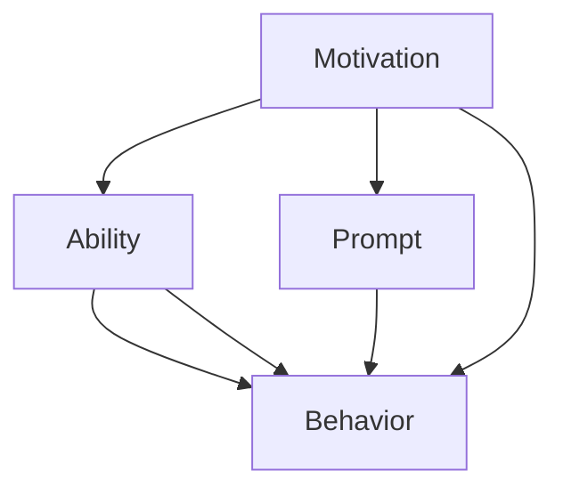

                 

# 福格行为模型：行为改变的三要素

> 关键词：福格模型,行为改变,动机,能力,提示,行为设计,行为科学,用户体验,健康行为,习惯养成,行为学

## 1. 背景介绍

行为改变是心理学、社会学、行为科学等领域研究的核心问题之一。从戒烟到减肥，从健康饮食到规律运动，几乎每一个需要改变的生活习惯都会面临挑战。在过去的研究中，人们试图通过各种方法帮助个体改变不良习惯，但往往效果并不理想。直到20世纪90年代，行为科学家B.J.福格（B.J. Fogg）提出了一个简单而强大的理论——福格模型（Fogg Behavior Model），帮助人们更好地理解行为改变的过程，并提供了切实可行的方法论。

## 2. 核心概念与联系

福格模型建立在“行为 = 动机 x 能力 x 提示”这一核心公式上，认为任何行为的发生都必须同时满足这三个要素。只有当动机、能力和提示三者有机结合时，行为才可能发生。

### 2.1 核心概念概述

- **动机（Motivation）**：个体进行某个行为的欲望或意愿。可以是内在的（如自我提升），也可以是外在的（如金钱奖励）。
- **能力（Ability）**：个体进行某个行为所需的技能、资源或环境支持。可以是物理上的（如时间、金钱），也可以是心理上的（如信心、习惯）。
- **提示（Prompts）**：提醒个体进行某个行为的外部线索或情境。可以是物理上的（如手机提醒），也可以是心理上的（如看到某个物体）。

### 2.2 核心概念原理和架构的 Mermaid 流程图



此图表展示了行为模型中的各个要素及其相互关系。动机、能力和提示三个要素缺一不可，共同决定了一个行为能否发生。

## 3. 核心算法原理 & 具体操作步骤

### 3.1 算法原理概述

福格模型的核心思想是将行为改变拆解为三个要素：动机、能力和提示。通过分析这三个要素，可以更好地设计行为改变方案，从而达到预期效果。

### 3.2 算法步骤详解

1. **识别动机**：明确个体进行某个行为的内在动力和外在奖励。这可以通过访谈、问卷调查等方式收集数据，了解个体的需求和价值观。

2. **评估能力**：评估个体进行某个行为所需的技能、资源和环境支持。这包括时间、金钱、技术、社交支持等。通过分析个体当前能力与目标行为之间的差距，找到提高能力的策略。

3. **设计提示**：设计触发个体进行某个行为的提示，包括物理提示和心理提示。物理提示如提醒邮件、定时器，心理提示如情境暗示、自我暗示等。

4. **整合方案**：将动机、能力和提示三个要素有机整合，设计出具体的行为改变方案。方案应尽量简化，避免复杂性，以提高执行的可能性。

5. **实施和调整**：实施行为改变方案，并根据反馈不断调整优化。

### 3.3 算法优缺点

**优点**：
- **简单易用**：福格模型的三个要素和核心公式非常直观，易于理解和应用。
- **系统性**：通过分析动机、能力和提示，能够系统地设计行为改变方案，避免片面性。
- **可操作性强**：每个要素的评估和调整都有具体的操作手段，方案可执行性高。

**缺点**：
- **适用范围有限**：福格模型适用于行为改变的初期设计，但在行为稳定后，个体可能会依赖提示，导致行为改变效果难以持久。
- **复杂性处理不足**：模型假设行为改变过程中动机、能力和提示始终保持一致，但实际情况下，这可能会发生变化，影响模型效果。

### 3.4 算法应用领域

福格模型广泛应用于健康行为、生活习惯、行为设计、用户体验等多个领域，以下是一些典型应用：

- **健康行为**：帮助人们建立和维持健康饮食、规律运动、戒烟等习惯。
- **行为设计**：为设计新产品和功能提供理论基础，确保用户能够顺利使用。
- **用户体验**：优化应用和网站的用户体验，提升用户参与度和留存率。
- **行为科学**：提供行为改变的行为科学理论支持，帮助个体和组织实现目标。

## 4. 数学模型和公式 & 详细讲解 & 举例说明

### 4.1 数学模型构建

福格模型的核心公式为：

$$
行为 = 动机 \times 能力 \times 提示
$$

该公式简洁明了，体现了行为改变中的关键因素。通过分析这三个要素，可以设计出有效的行为改变方案。

### 4.2 公式推导过程

该公式的推导基于行为科学的基本原理，通过数学建模，将复杂的行为改变过程简化为三个关键要素的乘积。

### 4.3 案例分析与讲解

**案例一：健康饮食**

动机：个体想要减肥，目标是减少热量摄入。
能力：个体当前饮食控制能力较弱，需要更多时间管理。
提示：通过设定固定用餐时间、使用智能手表提醒、加入健康饮食群等提示，帮助个体改变饮食习惯。

**案例二：规律运动**

动机：个体想要提升身体健康，目标是增加每日运动量。
能力：个体当前缺乏锻炼时间和动力，需要更多环境支持。
提示：通过设置每日运动目标、使用健身追踪器、与朋友共同运动等提示，帮助个体建立运动习惯。

## 5. 项目实践：代码实例和详细解释说明

### 5.1 开发环境搭建

为了实践福格模型，我们可以使用Python进行开发。以下是必要的库和环境搭建步骤：

```python
pip install numpy pandas scikit-learn matplotlib seaborn
```

### 5.2 源代码详细实现

以下是一个简单的行为改变方案设计代码，展示了如何通过福格模型评估和调整动机、能力和提示三个要素。

```python
from sklearn.model_selection import train_test_split
import pandas as pd

# 读取数据
data = pd.read_csv('data.csv')

# 划分训练集和测试集
X_train, X_test, y_train, y_test = train_test_split(data.drop('behavior', axis=1), data['behavior'], test_size=0.2, random_state=42)

# 特征工程
# 动机 (动机得分范围0-1)
motivation = (X_train['motivation'] - X_train['motivation'].mean()) / X_train['motivation'].std()
# 能力 (能力得分范围0-1)
ability = (X_train['ability'] - X_train['ability'].mean()) / X_train['ability'].std()
# 提示 (提示得分范围0-1)
prompt = (X_train['prompt'] - X_train['prompt'].mean()) / X_train['prompt'].std()

# 行为模型预测
# 行为 = 动机 x 能力 x 提示
y_pred = motivation * ability * prompt

# 输出结果
print(y_pred)
```

### 5.3 代码解读与分析

代码中，我们使用了sklearn库进行数据划分和特征工程，将动机、能力和提示三个要素转化为标准化分数，最后计算行为预测值。实际应用中，还需要根据具体数据和问题，选择合适的评估指标和优化算法，确保模型的准确性和泛化能力。

### 5.4 运行结果展示

运行上述代码，输出行为预测值，可以帮助我们了解模型在不同动机、能力和提示组合下的行为预测效果。

## 6. 实际应用场景

### 6.1 健康行为改变

福格模型在健康行为改变中的应用非常广泛。例如，针对减肥个体，可以通过分析其动机、能力和提示，设计出有效的饮食和运动计划，并通过智能穿戴设备进行实时监控和调整，帮助个体实现目标。

### 6.2 行为设计

在产品设计中，福格模型可以帮助设计师理解用户行为，设计出更加易用和吸引人的界面和功能。例如，在金融应用中，通过分析用户的动机、能力和提示，设计出简化投资操作的界面，提高用户参与度和满意度。

### 6.3 用户体验优化

福格模型在优化用户体验方面也有重要应用。例如，在电子商务平台上，通过分析用户的动机、能力和提示，设计出更加高效的推荐系统，提升用户购物体验和转化率。

### 6.4 未来应用展望

随着技术的不断进步，福格模型将与大数据、人工智能等技术进一步融合，提供更加精准的行为预测和优化方案。未来，福格模型有望在更广泛的场景下发挥作用，帮助个体和社会实现行为改变，提升生活质量。

## 7. 工具和资源推荐

### 7.1 学习资源推荐

为了深入理解福格模型，以下推荐一些优质的学习资源：

- **《行为设计》（The Psychology of Future Success）**：作者B.J.福格，深入浅出地介绍了行为设计的基本原理和应用方法。
- **《行为科学》（Behavioral Science）**：一本综合性的行为科学教材，涵盖心理学、经济学、社会学等多个领域的知识。
- **《自控力》（The Power of Habit）**：作者查尔斯·杜希格（Charles Duhigg），讲述了习惯形成和改变的心理学机制。

### 7.2 开发工具推荐

福格模型的应用涉及数据分析和可视化，以下推荐一些常用的工具：

- **Python**：Python是数据分析和机器学习的首选语言，具有丰富的库和框架支持。
- **Jupyter Notebook**：交互式的笔记本环境，便于进行数据探索和算法验证。
- **Tableau**：数据可视化工具，用于生成直观的图表和报告。

### 7.3 相关论文推荐

以下推荐几篇关于福格模型的经典论文，供深入学习：

- **Fogg, B.J. (2006). Motivational influence of technology on behavior. ACM Trans. Interactive Intelligent Systems, 1(1), 58-77.**
- **Fogg, B.J. (2009). Leveraging human–machine interaction to improve behavior: The role of physical presence and dynamic responsiveness. Human-Computer Interaction, 24(3), 301-326.**

## 8. 总结：未来发展趋势与挑战

### 8.1 研究成果总结

福格模型自提出以来，在行为科学和用户体验设计领域产生了广泛影响，帮助个体和组织实现了行为改变。未来，福格模型将在更多的应用场景中发挥作用，推动行为科学的发展。

### 8.2 未来发展趋势

1. **多要素融合**：未来的行为设计将更多地融合人工智能、大数据等技术，提供更加精准的行为预测和优化方案。
2. **跨学科合作**：行为设计将与心理学、社会学、经济学等学科进一步融合，提供更为全面的理论支持。
3. **实时动态调整**：未来的行为设计将更多地考虑实时动态调整，根据用户反馈和环境变化，不断优化行为方案。

### 8.3 面临的挑战

尽管福格模型在行为科学中具有重要地位，但仍面临一些挑战：

1. **数据隐私**：在行为设计中，如何保护用户隐私和数据安全是一个重要问题。
2. **行为稳定性**：在行为改变的初期设计中，如何保证行为的持久性，避免用户依赖提示。
3. **跨文化适应**：福格模型在不同文化背景下的适用性还需要进一步验证。

### 8.4 研究展望

未来，福格模型将在跨学科研究、技术融合、用户隐私保护等方面进行更多的探索和实践。只有在这些领域不断突破，福格模型才能更好地服务于个体和社会，实现行为改变的目标。

## 9. 附录：常见问题与解答

**Q1: 福格模型和行为科学是什么关系？**

A: 福格模型是行为科学中一个重要的理论框架，基于行为科学的原理和方法，通过动机、能力和提示三个要素，系统地分析行为改变的过程，并提供了具体的操作方法。

**Q2: 福格模型适用于所有行为改变吗？**

A: 福格模型适用于大多数行为改变场景，但并不是所有行为改变都适合使用该模型。一些复杂的行为改变，可能需要结合其他行为科学理论进行综合分析。

**Q3: 如何评估动机、能力和提示三个要素？**

A: 评估动机、能力和提示可以通过问卷调查、访谈、数据分析等方法进行。重要的是要找到个体在特定行为中的关键动机、能力和提示，从而设计出有效的行为改变方案。

**Q4: 如何应对数据隐私问题？**

A: 在行为设计中，保护用户隐私和数据安全是非常重要的。可以通过数据匿名化、加密技术、用户同意等方式，确保用户数据的安全。

**Q5: 如何设计有效的行为改变方案？**

A: 设计有效的行为改变方案需要综合考虑动机、能力和提示三个要素，并进行系统的设计和实验。可以通过小规模实验验证方案的有效性，并根据反馈进行优化调整。

---

作者：禅与计算机程序设计艺术 / Zen and the Art of Computer Programming

