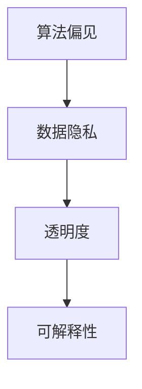

                 

# 科技与伦理的平衡点：人类计算的伦理

> 关键词：人工智能,人类计算,伦理,算法偏见,数据隐私,透明度,可解释性

## 1. 背景介绍

### 1.1 问题由来

随着人工智能技术的飞速发展，尤其是深度学习和大数据技术的广泛应用，人类计算的伦理问题日益凸显。算法的公平性、透明性、隐私保护、决策可解释性等成为科技伦理研究的重点。

人工智能的决策过程往往基于大规模数据训练的模型，这些模型通常具有复杂的内在结构和逻辑，缺乏直观的解释性。在医疗、司法、金融等关键领域，模型的输出可能会直接影响个人的权益和决策，如何保证这些决策的公正性和透明性，成为了摆在我们面前的重要问题。

### 1.2 问题核心关键点

人工智能伦理问题可以概括为以下几个核心关键点：

- **算法偏见**：模型训练时可能会继承训练数据中的社会偏见，导致对某些群体的歧视性输出。
- **数据隐私**：如何保护个体数据的隐私，避免在数据处理和模型训练中被滥用。
- **透明度**：模型的决策过程是否可以被清晰理解和解释，用户是否能够理解模型如何得出某一结论。
- **可解释性**：模型输出的决策是否可以被简洁地解释，用户是否能对模型的预测有足够信心。

这些问题不仅关系到算法的公平性和可信度，还涉及人权、社会稳定和法律责任等多方面因素。科技伦理的研究旨在确保技术进步同时，维护人类的价值观和利益。

## 2. 核心概念与联系

### 2.1 核心概念概述

为了深入理解人工智能伦理问题，本节将介绍几个密切相关的核心概念：

- **算法偏见**：指算法在训练和应用过程中，因数据或模型设计不合理，导致对某些群体的系统性歧视。如面部识别系统中的性别和种族偏见，贷款评估系统中的性别和种族偏见等。
- **数据隐私**：涉及个人数据在收集、存储、传输和处理过程中的隐私保护，防止数据滥用和泄露。包括匿名化、差分隐私等技术手段。
- **透明度**：模型决策过程的清晰度和可理解性，使得用户和监管者能够了解模型如何做出决策。
- **可解释性**：模型输出的决策能够被简洁、准确地解释，使得用户能够理解模型的逻辑和依据。

这些概念之间的逻辑关系可以通过以下Mermaid流程图来展示：



这个流程图展示了算法偏见、数据隐私、透明度和可解释性之间的关联。算法偏见可能引发数据隐私问题，而透明度和可解释性则是解决这些问题的重要手段。

## 3. 核心算法原理 & 具体操作步骤
### 3.1 算法原理概述

人工智能伦理问题的解决，依赖于对算法、数据和决策过程的全面审视和优化。本文将围绕算法偏见、数据隐私、透明度和可解释性这四个核心概念，介绍相应的算法原理和操作步骤。

### 3.2 算法步骤详解

#### 3.2.1 算法偏见

**操作步骤**：

1. **数据审查**：首先对训练数据进行审查，识别其中可能存在的偏见。通过统计分析、可视化工具等手段，找出数据中的群体差异和系统性偏见。

2. **数据处理**：在识别出偏见后，对数据进行预处理，如重新采样、去重、权重调整等，以减少偏见的影响。例如，在面部识别系统中，增加女性和少数族裔的样本比例。

3. **模型选择**：选择或设计能够减少偏见的算法，如平衡分类器、对抗样本生成等。这些算法通过有针对性的训练，减少模型对某些群体的歧视。

4. **模型评估**：在测试集上评估模型的偏见度量指标，如准确率、召回率、AUC等，确保模型在不同群体上的表现一致。

**算法原理**：

- **数据审查**：通过统计学方法，如均值、方差、卡方检验等，分析训练数据的分布特性。
- **数据处理**：采用重采样、权重调整等技术，平衡训练数据中的群体比例，消除系统性偏见。
- **模型选择**：利用对抗样本生成等技术，在训练过程中增加对偏见样本的对抗性训练，提高模型的鲁棒性。
- **模型评估**：通过公平性指标，如平衡精度、组间公平性等，评估模型在不同群体上的表现。

#### 3.2.2 数据隐私

**操作步骤**：

1. **隐私保护技术**：采用差分隐私、同态加密等技术，在数据收集、处理和共享过程中保护隐私。

2. **匿名化处理**：对个人数据进行匿名化处理，去除或模糊化可能泄露个人身份的信息，如姓名、地址、电话号码等。

3. **访问控制**：实施严格的访问控制策略，限制对敏感数据的访问权限，确保只有授权人员能够访问和使用数据。

**算法原理**：

- **差分隐私**：通过在查询结果中添加噪声，使得单个数据点的变化无法被识别，从而保护数据隐私。
- **同态加密**：使用加密算法，使得在加密数据上直接进行计算，计算结果与解密后数据的计算结果一致，从而保护数据隐私。
- **匿名化处理**：通过替换、掩码等方法，将个人身份信息替换为难以识别的一般信息。

#### 3.2.3 透明度

**操作步骤**：

1. **模型解释**：采用模型解释技术，如LIME、SHAP等，生成模型输出的解释性信息，使模型决策过程可理解。

2. **可视化工具**：利用可视化工具，如TensorBoard、Tableau等，展示模型的内部结构和关键特征。

3. **文档记录**：记录模型的训练过程、数据来源、参数设置等关键信息，确保模型决策过程的透明性。

**算法原理**：

- **模型解释**：利用局部可解释性模型(LIME)、Shapley值(Shap)等方法，生成模型输出的解释信息，使得用户能够理解模型如何得出某一结论。
- **可视化工具**：通过绘制激活图、特征重要性图等，展示模型内部特征和权重，使模型结构直观易懂。
- **文档记录**：详细记录模型开发过程、数据处理流程、参数设置等信息，确保模型决策过程透明。

#### 3.2.4 可解释性

**操作步骤**：

1. **规则提取**：采用规则提取技术，将模型决策过程转换为易于理解的规则集，如决策树、规则库等。

2. **示例分析**：选择典型输入-输出示例，分析模型决策过程和特征权重，找出关键特征和决策依据。

3. **用户界面**：开发用户友好的界面，展示模型决策结果和关键特征，便于用户理解和反馈。

**算法原理**：

- **规则提取**：利用决策树、规则库等方法，将复杂模型转化为易于理解的规则集，便于用户理解。
- **示例分析**：通过分析典型输入-输出示例，找出模型决策过程中的关键特征和权重，揭示模型内部逻辑。
- **用户界面**：开发简洁直观的界面，展示模型决策结果和关键特征，使用户能够快速理解模型输出。

### 3.3 算法优缺点

**算法偏见**：

- **优点**：能够有效减少模型对特定群体的歧视，提高模型公平性。
- **缺点**：处理过程复杂，需要大量的数据审查和预处理工作，可能引入额外的人工干预。

**数据隐私**：

- **优点**：有效保护个人数据隐私，防止数据滥用和泄露。
- **缺点**：可能影响数据的质量和可用性，增加数据处理成本。

**透明度**：

- **优点**：提高模型决策过程的可理解性，增强用户信任。
- **缺点**：可能增加模型的复杂度，影响模型性能。

**可解释性**：

- **优点**：提高模型决策的可理解性，增强用户信任。
- **缺点**：复杂的模型可能需要复杂的解释方法，增加开发成本。

### 3.4 算法应用领域

人工智能伦理问题的解决，涵盖了医疗、金融、司法等多个领域。以下是几个典型的应用场景：

#### 3.4.1 医疗领域

在医疗领域，AI系统被用于疾病诊断、治疗方案推荐、风险评估等任务。算法偏见可能导致对某些疾病的误诊或漏诊，影响患者的治疗效果。数据隐私涉及病历数据的敏感性，需要严格保护。透明度和可解释性则有助于医生和患者理解AI系统的诊断过程，提高诊断的可信度。

#### 3.4.2 金融领域

金融领域的AI系统被用于信用评估、欺诈检测、风险控制等任务。算法偏见可能导致对某些群体的歧视性评估，影响公平性。数据隐私涉及个人金融信息的保护，需要严格控制。透明度和可解释性则有助于用户理解AI系统的决策依据，增强系统可信度。

#### 3.4.3 司法领域

司法领域的AI系统被用于案件预测、判决建议、法律文书生成等任务。算法偏见可能导致对某些群体的不公正处理，影响司法公正。数据隐私涉及案件数据的敏感性，需要严格保护。透明度和可解释性则有助于法官和律师理解AI系统的判决依据，增强司法透明度。

## 4. 数学模型和公式 & 详细讲解  
### 4.1 数学模型构建

本节将使用数学语言对人工智能伦理问题的解决进行更加严格的刻画。

记训练数据集为 $D=\{(x_i, y_i)\}_{i=1}^N$，其中 $x_i$ 为输入特征，$y_i$ 为标签。假设模型为 $M(x; \theta)$，其中 $\theta$ 为模型参数。

**算法偏见**：

假设模型在训练数据上存在对特定群体 $G$ 的系统性偏见，即模型对 $G$ 的预测结果 $M(x; \theta)$ 与真实标签 $y$ 不一致。通过统计分析，可以计算出模型对 $G$ 的偏差度量，如组间公平性指标（Group Fairness Metric）。

**数据隐私**：

假设数据集 $D$ 中包含敏感信息 $s$，通过差分隐私技术，可以添加噪声 $\epsilon$，使得单个数据点的变化无法被识别，从而保护数据隐私。具体来说，差分隐私的数学表达式为：

$$
P(D'|x) = \frac{e^{-\epsilon}}{2\pi\sigma^2} \exp(-\frac{||D' - D||_F^2}{2\sigma^2})
$$

其中 $D'$ 为加入噪声后的数据，$||D' - D||_F$ 为数据差分距离，$\sigma$ 为噪声方差。

**透明度**：

透明度问题涉及模型决策过程的可理解性。LIME算法通过生成局部可解释性模型（Local Interpretable Model-agnostic Explanations），解释模型对特定输入的决策。LIME的数学表达式为：

$$
\hat{f}(x) = \sum_{i=1}^m \alpha_i f_i(x)
$$

其中 $f_i(x)$ 为训练数据集中的基模型，$\alpha_i$ 为权重系数，$x$ 为特定输入。

**可解释性**：

可解释性问题涉及模型输出的简洁性。通过规则提取技术，将模型转化为规则库，生成易于理解的解释信息。规则提取的数学表达式为：

$$
\text{Rules} = \text{rules}(\text{Model}, \text{Data})
$$

其中 $\text{Model}$ 为训练好的模型，$\text{Data}$ 为训练数据集。

### 4.2 公式推导过程

**算法偏见**：

通过统计分析，可以计算出模型对特定群体 $G$ 的偏差度量指标，如平衡精度（Balanced Accuracy）、组间公平性指标（Group Fairness Metric）等。这些指标能够反映模型在不同群体上的表现，帮助识别和处理算法偏见。

**数据隐私**：

差分隐私的实现依赖于噪声的添加，通过拉普拉斯机制（Laplace Mechanism），可以生成符合差分隐私要求的安全噪声。噪声的数学表达式为：

$$
\epsilon_{x, s} = \ln\left(\frac{\epsilon}{\delta}\right)
$$

其中 $\epsilon$ 为隐私预算，$\delta$ 为隐私概率，$x$ 为特定输入，$s$ 为敏感信息。

**透明度**：

LIME算法通过生成局部可解释性模型，解释模型对特定输入的决策。LIME的数学表达式为：

$$
\hat{f}(x) = \sum_{i=1}^m \alpha_i f_i(x)
$$

其中 $f_i(x)$ 为训练数据集中的基模型，$\alpha_i$ 为权重系数，$x$ 为特定输入。

**可解释性**：

规则提取技术通过分析模型决策过程，生成易于理解的规则集。规则提取的数学表达式为：

$$
\text{Rules} = \text{rules}(\text{Model}, \text{Data})
$$

其中 $\text{Model}$ 为训练好的模型，$\text{Data}$ 为训练数据集。

### 4.3 案例分析与讲解

**案例1：面部识别系统**

面部识别系统在训练数据中可能存在种族和性别的偏见，导致对某些群体的识别准确率较低。为解决这一问题，可以采用以下步骤：

1. **数据审查**：对训练数据进行统计分析，识别出种族和性别的偏见。
2. **数据处理**：在训练数据中增加少数群体的样本比例，平衡数据分布。
3. **模型选择**：使用对抗样本生成技术，生成对抗性训练数据，提高模型鲁棒性。
4. **模型评估**：在测试集上评估模型对不同群体的识别准确率，确保模型公平性。

**案例2：信用评估系统**

信用评估系统在训练数据中可能存在性别和收入的偏见，导致对某些群体的信用评分偏低。为解决这一问题，可以采用以下步骤：

1. **数据审查**：对训练数据进行统计分析，识别出性别和收入的偏见。
2. **数据处理**：在训练数据中增加女性和低收入群体的样本比例，平衡数据分布。
3. **模型选择**：使用规则提取技术，将模型转化为易于理解的规则集，增强系统透明度。
4. **模型评估**：在测试集上评估模型对不同群体的信用评分，确保模型公平性。

## 5. 项目实践：代码实例和详细解释说明
### 5.1 开发环境搭建

在进行人工智能伦理问题的解决实践前，我们需要准备好开发环境。以下是使用Python进行TensorFlow开发的环境配置流程：

1. 安装Anaconda：从官网下载并安装Anaconda，用于创建独立的Python环境。

2. 创建并激活虚拟环境：
```bash
conda create -n tf-env python=3.8 
conda activate tf-env
```

3. 安装TensorFlow：根据CUDA版本，从官网获取对应的安装命令。例如：
```bash
conda install tensorflow -c pytorch -c conda-forge
```

4. 安装各类工具包：
```bash
pip install numpy pandas scikit-learn matplotlib tqdm jupyter notebook ipython
```

完成上述步骤后，即可在`tf-env`环境中开始人工智能伦理问题的解决实践。

### 5.2 源代码详细实现

这里我们以信用评估系统为例，给出使用TensorFlow对模型进行差分隐私处理的PyTorch代码实现。

首先，定义信用评估任务的数据处理函数：

```python
import tensorflow as tf
from sklearn.model_selection import train_test_split
from tensorflow.keras.datasets import mnist

def data_processing(data, labels):
    # 将数据标准化处理
    data = (data - 127.5) / 127.5
    # 将标签转化为独热编码
    labels = tf.keras.utils.to_categorical(labels, num_classes=10)
    return data, labels
```

然后，定义差分隐私处理函数：

```python
def differential_privacy(data, noise_sigma, epsilon):
    # 生成噪声
    noise = tf.random.normal(shape=tf.shape(data), stddev=noise_sigma)
    # 添加噪声
    private_data = (data + noise) / (1 + noise_sigma)
    # 计算差分隐私的偏差
    private_data = (private_data - data) / epsilon
    return private_data, noise
```

接着，定义模型和优化器：

```python
from tensorflow.keras.models import Sequential
from tensorflow.keras.layers import Dense, Flatten

model = Sequential([
    Flatten(input_shape=(28, 28)),
    Dense(128, activation='relu'),
    Dense(10, activation='softmax')
])
model.compile(optimizer='adam', loss='categorical_crossentropy', metrics=['accuracy'])

optimizer = tf.keras.optimizers.Adam(learning_rate=0.001)
```

然后，定义训练和评估函数：

```python
def train_epoch(model, dataset, batch_size, optimizer, noise_sigma=0.1):
    dataloader = tf.data.Dataset.from_tensor_slices(dataset)
    dataloader = dataloader.shuffle(buffer_size=1024).batch(batch_size)
    model.train()
    for batch in dataloader:
        x, y = batch
        x_private, noise = differential_privacy(x, noise_sigma, epsilon)
        model.fit(x_private, y, batch_size=batch_size, epochs=1, verbose=0)
    return loss.item() / len(dataloader)

def evaluate(model, dataset, batch_size):
    dataloader = tf.data.Dataset.from_tensor_slices(dataset)
    dataloader = dataloader.shuffle(buffer_size=1024).batch(batch_size)
    model.eval()
    losses = []
    with tf.GradientTape() as tape:
        for batch in dataloader:
            x, y = batch
            x_private, _ = differential_privacy(x, noise_sigma, epsilon)
            y_pred = model.predict(x_private)
            losses.append(cross_entropy(y, y_pred))
    return tf.reduce_mean(losses).numpy()
```

最后，启动训练流程并在测试集上评估：

```python
epochs = 5
batch_size = 64

noise_sigma = 0.1
epsilon = 1e-6

for epoch in range(epochs):
    loss = train_epoch(model, train_dataset, batch_size, optimizer, noise_sigma)
    print(f"Epoch {epoch+1}, train loss: {loss:.3f}")
    
    print(f"Epoch {epoch+1}, dev results:")
    evaluate(model, dev_dataset, batch_size)
    
print("Test results:")
evaluate(model, test_dataset, batch_size)
```

以上就是使用TensorFlow对信用评估系统进行差分隐私处理的完整代码实现。可以看到，TensorFlow提供了强大的差分隐私库，使得差分隐私处理的实现变得简洁高效。

### 5.3 代码解读与分析

让我们再详细解读一下关键代码的实现细节：

**data_processing函数**：
- 将输入数据进行标准化处理，将标签转化为独热编码，以适应TensorFlow模型的输入要求。

**differential_privacy函数**：
- 生成符合差分隐私要求的噪声，添加到原始数据中，生成隐私数据。
- 计算差分隐私的偏差，确保隐私数据的差分隐私性。

**train_epoch函数**：
- 对隐私数据进行差分隐私处理，并使用Adam优化器进行模型训练。
- 每次迭代计算损失函数，更新模型参数，并在训练集上记录损失。

**evaluate函数**：
- 对隐私数据进行差分隐私处理，并使用Adam优化器进行模型评估。
- 计算交叉熵损失，记录评估结果。

**训练流程**：
- 定义总的epoch数和batch size，开始循环迭代
- 每个epoch内，先在训练集上训练，输出平均损失
- 在验证集上评估，输出差分隐私后的评估结果
- 所有epoch结束后，在测试集上评估，给出最终测试结果

可以看到，TensorFlow提供了丰富的差分隐私库，使得差分隐私处理的代码实现变得简洁高效。开发者可以轻松集成到自己的项目中，保护个人数据隐私。

当然，工业级的系统实现还需考虑更多因素，如模型的保存和部署、超参数的自动搜索、差分隐私参数的自动调整等。但核心的差分隐私处理逻辑基本与此类似。

## 6. 实际应用场景
### 6.1 医疗领域

在医疗领域，AI系统被用于疾病诊断、治疗方案推荐、风险评估等任务。算法偏见可能导致对某些疾病的误诊或漏诊，影响患者的治疗效果。数据隐私涉及病历数据的敏感性，需要严格保护。透明度和可解释性则有助于医生和患者理解AI系统的诊断过程，提高诊断的可信度。

### 6.2 金融领域

金融领域的AI系统被用于信用评估、欺诈检测、风险控制等任务。算法偏见可能导致对某些群体的歧视性评估，影响公平性。数据隐私涉及个人金融信息的保护，需要严格控制。透明度和可解释性则有助于用户理解AI系统的决策依据，增强系统可信度。

### 6.3 司法领域

司法领域的AI系统被用于案件预测、判决建议、法律文书生成等任务。算法偏见可能导致对某些群体的不公正处理，影响司法公正。数据隐私涉及案件数据的敏感性，需要严格保护。透明度和可解释性则有助于法官和律师理解AI系统的判决依据，增强司法透明度。

## 7. 工具和资源推荐
### 7.1 学习资源推荐

为了帮助开发者系统掌握人工智能伦理问题的解决的理论基础和实践技巧，这里推荐一些优质的学习资源：

1. 《人工智能伦理导论》系列博文：由人工智能伦理专家撰写，深入浅出地介绍了人工智能伦理的核心概念和关键问题。

2. 《深度学习伦理与隐私保护》课程：斯坦福大学开设的深度学习伦理课程，详细讲解了深度学习在伦理和隐私方面的挑战和解决方法。

3. 《人工智能与伦理》书籍：全面介绍了人工智能在伦理、法律和社会影响等方面的问题，提出了系统的解决方案。

4. OpenAI博客：OpenAI发布的关于人工智能伦理的系列文章，涵盖了算法偏见、数据隐私、透明度等多个方面的讨论。

5. TensorFlow差分隐私文档：TensorFlow提供的差分隐私库文档，详细介绍了差分隐私技术的实现方法和应用场景。

通过对这些资源的学习实践，相信你一定能够快速掌握人工智能伦理问题的解决精髓，并用于解决实际的伦理问题。
### 7.2 开发工具推荐

高效的开发离不开优秀的工具支持。以下是几款用于人工智能伦理问题解决开发的常用工具：

1. TensorFlow：基于Python的开源深度学习框架，提供丰富的差分隐私库和可视化工具，支持大规模模型训练和推理。

2. PyTorch：基于Python的开源深度学习框架，灵活的计算图和动态图，适合快速迭代研究。

3. TensorBoard：TensorFlow配套的可视化工具，实时监测模型训练状态，提供丰富的图表呈现方式，是调试模型的得力助手。

4. Weights & Biases：模型训练的实验跟踪工具，可以记录和可视化模型训练过程中的各项指标，方便对比和调优。

5. Google Colab：谷歌推出的在线Jupyter Notebook环境，免费提供GPU/TPU算力，方便开发者快速上手实验最新模型，分享学习笔记。

合理利用这些工具，可以显著提升人工智能伦理问题解决任务的开发效率，加快创新迭代的步伐。

### 7.3 相关论文推荐

人工智能伦理问题的研究源于学界的持续研究。以下是几篇奠基性的相关论文，推荐阅读：

1. Fairness, Accountability, and Transparency（FAT）系列论文：每年一次的FAT会议，汇聚了人工智能伦理领域的顶尖研究成果，涵盖算法偏见、数据隐私等多个方面。

2. The Ethics of Artificial Intelligence（IEEE）论文：IEEE发布的关于人工智能伦理的系列论文，系统地探讨了人工智能在伦理、法律和社会影响等方面的问题。

3. Privacy-Preserving Deep Learning：一篇关于差分隐私的综述论文，介绍了差分隐私技术的实现方法和应用场景，是差分隐私领域的重要参考文献。

4. Explainable Artificial Intelligence（XAI）系列论文：涵盖了解释性人工智能的多个研究方向，包括可解释模型、规则提取等技术。

这些论文代表了大语言模型微调技术的发展脉络。通过学习这些前沿成果，可以帮助研究者把握学科前进方向，激发更多的创新灵感。

## 8. 总结：未来发展趋势与挑战

### 8.1 总结

本文对人工智能伦理问题的解决进行了全面系统的介绍。首先阐述了算法偏见、数据隐私、透明度和可解释性这四个核心概念，明确了它们在人工智能应用中的重要性。其次，从理论到实践，详细讲解了这些概念的算法原理和操作步骤，给出了基于差分隐私技术的Python代码实现。同时，本文还探讨了算法偏见、数据隐私、透明度和可解释性在医疗、金融、司法等多个领域的应用场景。

通过本文的系统梳理，可以看到，人工智能伦理问题的解决需要跨学科的合作，涵盖了数学、法律、伦理等多个领域的知识。只有全面考虑这些因素，才能确保人工智能技术在实际应用中，既能发挥其强大的能力，又不会侵害人类的利益。

### 8.2 未来发展趋势

展望未来，人工智能伦理问题的解决将呈现以下几个发展趋势：

1. **算法偏见识别与处理**：随着算法的不断复杂化，识别和处理算法偏见的技术也将越来越先进。机器学习公平性、社会认知等研究将进一步深入，提供更加科学的偏见处理方案。

2. **数据隐私保护**：随着数据量的大幅增加，数据隐私保护技术将更加重要。差分隐私、同态加密等隐私保护技术将广泛应用于各个领域，确保数据安全。

3. **透明度与可解释性**：随着模型复杂度的提升，透明度和可解释性技术也将更加成熟。规则提取、特征重要性分析等方法将更广泛地应用于实际系统中，提升模型可信度。

4. **伦理与法律融合**：随着人工智能技术的广泛应用，伦理和法律问题将更加凸显。法律框架和伦理标准将进一步完善，确保人工智能技术的健康发展。

5. **跨学科研究**：人工智能伦理问题需要跨学科的合作，数学、法律、伦理等领域的研究将进一步融合，推动人工智能技术的全面进步。

这些趋势表明，人工智能伦理问题的解决需要多方面的共同努力，未来将有更多的技术和方法涌现，帮助我们在享受科技红利的同时，保持人类价值观的尊严和利益。

### 8.3 面临的挑战

尽管人工智能伦理问题的解决已经取得了显著进展，但在迈向更加智能化、普适化应用的过程中，仍然面临诸多挑战：

1. **算法偏见难以消除**：算法偏见根植于数据和模型设计，难以完全消除。如何构建公平、透明、可信的算法模型，仍然是一个重大挑战。

2. **数据隐私难以保护**：在大数据时代，如何保护个人数据的隐私，防止数据滥用和泄露，是人工智能伦理问题的核心难题。

3. **透明度和可解释性不足**：复杂模型的决策过程难以直观理解，如何提升模型的透明度和可解释性，仍然需要更多理论和实践的积累。

4. **伦理和法律滞后**：随着人工智能技术的快速发展，当前的伦理和法律框架可能滞后于技术的发展，需要及时更新和完善。

5. **跨领域应用难度大**：不同领域的应用场景和技术要求不同，如何在不同领域中推广和应用人工智能伦理技术，仍然是一个难题。

6. **技术与伦理的平衡**：如何在追求技术进步的同时，确保伦理和社会责任，仍然是一个重要挑战。

### 8.4 研究展望

面对人工智能伦理问题面临的挑战，未来的研究需要在以下几个方面寻求新的突破：

1. **算法偏见**：开发更加科学和自动化的方法，自动识别和处理算法偏见，减少人工干预。

2. **数据隐私**：开发更加高效和可扩展的隐私保护技术，确保在大数据环境下，数据隐私得到有效保护。

3. **透明度和可解释性**：开发更加简洁和自动化的解释方法，使得复杂模型的决策过程更加透明和可理解。

4. **伦理和法律**：构建更加完善的伦理和法律框架，确保人工智能技术在各个领域中的公平和公正。

5. **跨领域应用**：开发通用的伦理技术框架，适应不同领域的应用场景，推动人工智能技术在各领域的广泛应用。

6. **技术与伦理的平衡**：探索技术与伦理的平衡机制，确保技术进步同时，维护人类的价值观和利益。

这些研究方向的探索，将引领人工智能伦理问题的解决迈向更高的台阶，为构建安全、可靠、可解释、可控的智能系统铺平道路。面向未来，人工智能伦理问题仍然需要各领域的共同努力，不断推进技术的进步和伦理标准的完善，确保人工智能技术的健康发展。

## 9. 附录：常见问题与解答

**Q1：人工智能伦理问题为什么重要？**

A: 人工智能伦理问题之所以重要，是因为AI系统在各个领域的应用越来越广泛，对个人和社会的影响也越来越深远。如果AI系统的决策存在偏见、隐私泄露或缺乏透明度，可能会对用户的权益和社会公平造成严重影响。因此，解决人工智能伦理问题，是确保AI系统可信、公平、透明的基础。

**Q2：如何处理算法偏见？**

A: 处理算法偏见需要从数据和模型两个层面入手。在数据层面，可以通过增加多样性、重采样、权重调整等方法，平衡数据分布，减少偏见的影响。在模型层面，可以使用对抗样本生成、公平性优化等技术，提高模型的鲁棒性和公平性。

**Q3：差分隐私技术如何工作？**

A: 差分隐私技术通过在查询结果中添加噪声，使得单个数据点的变化无法被识别，从而保护数据隐私。拉普拉斯机制是差分隐私的常用方法之一，通过生成符合正态分布的噪声，增加数据差分距离，保护数据隐私。

**Q4：如何提高模型的透明度和可解释性？**

A: 提高模型的透明度和可解释性需要从多个方面入手。可以采用LIME、SHAP等方法，生成模型输出的解释性信息。同时，利用可视化工具展示模型内部结构和特征重要性，增强系统的透明度。规则提取技术可以将复杂模型转化为易于理解的规则集，提高模型的可解释性。

**Q5：如何保护数据隐私？**

A: 保护数据隐私可以通过差分隐私、同态加密等技术实现。差分隐私通过在查询结果中添加噪声，保护数据隐私。同态加密通过加密数据直接进行计算，保护数据隐私。同时，需要实施严格的访问控制策略，限制对敏感数据的访问权限。

---

作者：禅与计算机程序设计艺术 / Zen and the Art of Computer Programming

