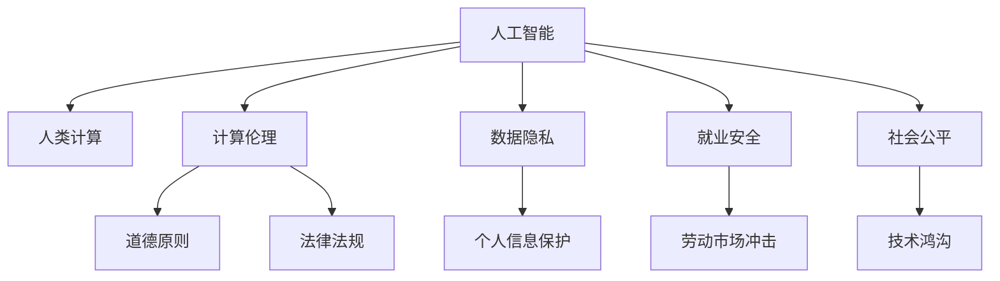

                 

# 科技与社会：人类计算的双重影响与思考

> 关键词：人工智能,人类计算,社会影响,伦理挑战,技术发展,未来展望

## 1. 背景介绍

### 1.1 问题由来
随着信息技术的迅猛发展，人类计算正在经历前所未有的变革。从早期的电算到今天的超级计算机，计算技术的进步不仅极大地提升了人类的生产效率和生活质量，也深刻地改变了社会的结构和人们的思维方式。尤其是人工智能（AI）技术的崛起，让人类计算进入了全新的阶段。

AI技术通过模拟人类思维和行为，自动化完成复杂任务，带来了生产自动化、智能决策、精准医疗等诸多领域的革命性变化。但与此同时，AI技术的发展也带来了伦理、隐私、就业等诸多社会问题。如何在享受科技带来的便利的同时，审视并解决随之而来的挑战，成为了当下科技与社会共同面对的重要课题。

### 1.2 问题核心关键点
本文聚焦于人工智能与人类计算的双重影响，探讨了AI技术在推动社会进步的同时，如何平衡技术发展与人类伦理、社会福祉的关系。主要关注以下几个关键点：
1. AI技术在医疗、交通、教育、金融等各个领域的广泛应用。
2. 人工智能引发的就业、隐私、伦理、安全等社会问题。
3. AI技术的可持续发展路径及未来趋势。

## 2. 核心概念与联系

### 2.1 核心概念概述

为更好地理解人工智能与人类计算的双重影响，本节将介绍几个密切相关的核心概念：

- **人工智能（Artificial Intelligence, AI）**：指模拟人类智能的机器智能，包括学习、推理、自然语言处理、计算机视觉、自动化决策等能力。
- **人类计算（Human Computing）**：指将人的智力资源转化为计算力，通过众包、众智、众创等方式，实现人机协同计算。
- **计算伦理（Computational Ethics）**：指在人工智能应用中，如何遵循道德原则、法律法规，确保计算活动的安全性、隐私性和公平性。
- **数据隐私（Data Privacy）**：指在数据收集、存储、使用过程中，如何保护个人信息，避免数据滥用和泄露。
- **就业安全（Job Security）**：指AI技术在自动化生产过程中，如何避免对劳动市场的冲击，保障劳动者的就业机会和收入水平。
- **社会公平（Social Equity）**：指在人工智能的应用中，如何确保各个群体、各个地区、各个国家都能公平地受益，避免技术鸿沟的扩大。

这些核心概念之间的逻辑关系可以通过以下Mermaid流程图来展示：



这个流程图展示了人工智能技术在推动社会进步的同时，如何与计算伦理、数据隐私、就业安全、社会公平等社会问题相联系。

## 3. 核心算法原理 & 具体操作步骤
### 3.1 算法原理概述

人工智能的核心算法包括机器学习（Machine Learning, ML）、深度学习（Deep Learning, DL）和强化学习（Reinforcement Learning, RL）等。这些算法通过大量数据的学习，不断优化模型参数，提升模型性能，实现自动化决策和复杂任务的处理。

### 3.2 算法步骤详解

以深度学习算法为例，其核心步骤包括：

1. **数据准备**：收集和标注大量的训练数据，将其分为训练集、验证集和测试集。
2. **模型选择**：选择适合任务的神经网络结构，如卷积神经网络（CNN）、循环神经网络（RNN）、变压器（Transformer）等。
3. **模型训练**：使用训练数据对模型进行前向传播、损失计算和反向传播，更新模型参数，使得模型能够准确预测新数据。
4. **模型评估**：使用验证集对模型进行评估，确定模型是否过拟合或欠拟合，并进行调整。
5. **模型测试**：使用测试集对模型进行最终评估，检验模型的泛化能力和性能。

### 3.3 算法优缺点

深度学习算法具有以下优点：

- **自动化能力**：能够自动从数据中学习特征，无需手动提取。
- **性能优越**：在许多领域取得了超越人类专家的表现，如图像识别、语音识别、自然语言处理等。
- **可扩展性强**：适用于大规模数据和高维数据的处理。

但深度学习算法也存在一些缺点：

- **数据依赖性强**：需要大量标注数据进行训练，数据质量对模型效果影响大。
- **模型复杂度高**：深层神经网络包含大量参数，训练复杂度高。
- **可解释性差**：难以解释模型内部的决策过程，存在“黑箱”问题。

### 3.4 算法应用领域

深度学习算法在医疗、交通、教育、金融等多个领域得到了广泛应用：

- **医疗**：用于医学影像分析、疾病诊断、个性化治疗等，提升了医疗服务的精准度和效率。
- **交通**：用于自动驾驶、智能交通管理、路径优化等，提高了交通系统的安全性和便捷性。
- **教育**：用于个性化学习、智能辅导、教育资源推荐等，改善了教育资源的分配和利用。
- **金融**：用于风险评估、欺诈检测、投资分析等，提升了金融服务的智能化和安全性。

## 4. 数学模型和公式 & 详细讲解 & 举例说明

### 4.1 数学模型构建

以深度学习中的卷积神经网络（CNN）为例，其数学模型可以表示为：

$$
f(x) = \sum_i \sum_j w_{i,j} f_k(x_i) x_j
$$

其中，$x$ 为输入数据，$w$ 为卷积核参数，$f_k(x_i)$ 为卷积操作，$i$ 和 $j$ 为卷积核的位置索引。

### 4.2 公式推导过程

以卷积神经网络为例，其前向传播的计算过程如下：

1. 卷积层计算：对输入数据和卷积核进行卷积操作，得到卷积特征图。
2. 激活层计算：对卷积特征图进行非线性变换，如ReLU激活函数。
3. 池化层计算：对激活层输出进行降维处理，如最大池化或平均池化。
4. 全连接层计算：将池化层输出连接成向量，通过全连接层进行线性变换和激活函数操作，得到最终输出。

### 4.3 案例分析与讲解

以图像分类任务为例，CNN通过卷积操作提取图像特征，再通过全连接层进行分类。如图像分类任务中，CNN可以从原始像素数据中学习出边缘、角点等特征，最终识别出图像中的物体类别。

## 5. 项目实践：代码实例和详细解释说明

### 5.1 开发环境搭建

在进行深度学习项目开发前，需要先搭建好开发环境。以下是使用Python进行TensorFlow和PyTorch开发的典型环境配置：

1. 安装Anaconda：从官网下载并安装Anaconda，用于创建独立的Python环境。
```bash
conda create -n tensorflow-env python=3.8
conda activate tensorflow-env
```

2. 安装TensorFlow和PyTorch：
```bash
conda install tensorflow=2.6 python=3.8
conda install pytorch=1.9 torchvision=0.10.1 torchaudio=0.5.0 cudatoolkit=11.1 -c pytorch -c conda-forge
```

3. 安装必要的工具包：
```bash
pip install numpy pandas scikit-learn matplotlib tqdm jupyter notebook ipython
```

完成上述步骤后，即可在`tensorflow-env`或`pytorch-env`环境中开始深度学习开发。

### 5.2 源代码详细实现

以下是使用TensorFlow实现卷积神经网络进行图像分类的代码实现：

```python
import tensorflow as tf
from tensorflow.keras import layers, models

def create_model(input_shape):
    model = models.Sequential([
        layers.Conv2D(32, (3, 3), activation='relu', input_shape=input_shape),
        layers.MaxPooling2D((2, 2)),
        layers.Conv2D(64, (3, 3), activation='relu'),
        layers.MaxPooling2D((2, 2)),
        layers.Conv2D(64, (3, 3), activation='relu'),
        layers.Flatten(),
        layers.Dense(64, activation='relu'),
        layers.Dense(10)
    ])
    return model

input_shape = (28, 28, 1)
model = create_model(input_shape)
model.summary()

# 编译模型
model.compile(optimizer='adam',
              loss=tf.keras.losses.SparseCategoricalCrossentropy(from_logits=True),
              metrics=['accuracy'])

# 加载数据集
(x_train, y_train), (x_test, y_test) = tf.keras.datasets.mnist.load_data()
x_train = x_train.reshape(-1, 28, 28, 1)
x_train = x_train / 255.0
x_test = x_test.reshape(-1, 28, 28, 1)
x_test = x_test / 255.0

# 训练模型
model.fit(x_train, y_train, epochs=10, validation_data=(x_test, y_test))
```

以上代码展示了如何使用TensorFlow实现一个简单的卷积神经网络，用于手写数字识别任务。

### 5.3 代码解读与分析

**create_model函数**：
- 定义了一个包含多个卷积层和池化层的卷积神经网络，最后两个全连接层用于分类。
- 在模型编译时，使用Adam优化器和交叉熵损失函数，评估指标为准确率。

**训练模型**：
- 将MNIST数据集加载到内存中，并对其进行预处理，将像素值归一化到0到1之间。
- 使用`fit`方法对模型进行训练，设置训练轮数为10轮，并使用测试集进行验证。

## 6. 实际应用场景

### 6.1 医疗

AI技术在医疗领域的应用包括医学影像分析、疾病诊断、个性化治疗等，极大地提升了医疗服务的精准度和效率。例如，基于深度学习技术的影像分割算法，可以从医学影像中自动识别肿瘤、血管等关键结构，辅助医生进行诊断和治疗。此外，AI技术还可以用于药物研发，加速新药的发现和测试。

### 6.2 交通

AI技术在交通领域的应用包括自动驾驶、智能交通管理、路径优化等，提高了交通系统的安全性和便捷性。例如，自动驾驶技术可以通过深度学习算法识别道路标志、车辆、行人等，自主完成驾驶决策。智能交通管理系统可以通过实时数据分析，优化交通信号灯的分配，减少交通拥堵。

### 6.3 教育

AI技术在教育领域的应用包括个性化学习、智能辅导、教育资源推荐等，改善了教育资源的分配和利用。例如，基于深度学习的个性化推荐系统可以根据学生的学习历史和兴趣，推荐适合的学习资源和课程，提升学习效率。智能辅导系统可以通过自然语言处理技术，解答学生的疑问，提供个性化的辅导。

### 6.4 金融

AI技术在金融领域的应用包括风险评估、欺诈检测、投资分析等，提升了金融服务的智能化和安全性。例如，基于深度学习的风险评估模型可以分析客户的信用记录、行为数据等，预测其违约风险。欺诈检测系统可以通过深度学习算法识别异常交易行为，及时预警和阻止欺诈行为。

## 7. 工具和资源推荐

### 7.1 学习资源推荐

为了帮助开发者系统掌握深度学习与人类计算的相关知识，这里推荐一些优质的学习资源：

1. Coursera《深度学习专项课程》：由斯坦福大学Andrew Ng教授主讲，涵盖了深度学习的基本概念、算法和应用。
2. TensorFlow官方文档：提供了详细的TensorFlow使用指南和案例，适合快速上手。
3. PyTorch官方文档：提供了全面的PyTorch使用指南和案例，适合初学者和进阶用户。
4. Fast.ai深度学习课程：由Jeremy Howard和Rachel Thomas主讲，通过实践项目，快速掌握深度学习技术。
5. Kaggle数据科学竞赛：提供了大量实际问题，通过竞赛形式，实战练兵。

通过对这些资源的学习实践，相信你一定能够快速掌握深度学习与人类计算的核心技术，并用于解决实际的计算问题。

### 7.2 开发工具推荐

高效的深度学习开发离不开优秀的工具支持。以下是几款常用的开发工具：

1. Jupyter Notebook：基于Python的交互式开发环境，支持代码编辑、运行、展示等功能，非常适合深度学习开发。
2. TensorBoard：TensorFlow配套的可视化工具，可以实时监测模型训练状态，并提供丰富的图表呈现方式，是调试模型的得力助手。
3. PyCharm：Google开发的Python IDE，支持深度学习、机器学习等领域的开发，提供了丰富的代码提示和调试功能。
4. Visual Studio Code：微软推出的通用IDE，支持深度学习、计算机视觉等领域的开发，提供了丰富的插件和扩展。
5. Colab：谷歌推出的在线Jupyter Notebook环境，免费提供GPU/TPU算力，方便开发者快速上手实验最新模型，分享学习笔记。

合理利用这些工具，可以显著提升深度学习与人类计算的开发效率，加快创新迭代的步伐。

### 7.3 相关论文推荐

深度学习与人类计算的研究源于学界的持续研究。以下是几篇奠基性的相关论文，推荐阅读：

1. 《Deep Blue: The Future of AI and the Economy》（阿西莫夫）：探讨了AI技术对未来经济和社会的深远影响。
2. 《Human-Computer Interaction》（唐纳德·诺曼）：研究了人机交互的心理学和设计原则。
3. 《Artificial Intelligence: A Modern Approach》（Russell & Norvig）：系统介绍了人工智能的基本概念、算法和应用。
4. 《Superintelligence: Paths, Dangers, Strategies》（Nick Bostrom）：探讨了超级智能的潜在风险和应对策略。
5. 《Computational Ethics: An Introduction》（Bruce Uprichard）：研究了计算伦理的基本问题和方法。

这些论文代表了深度学习与人类计算的研究脉络。通过学习这些前沿成果，可以帮助研究者把握学科前进方向，激发更多的创新灵感。

## 8. 总结：未来发展趋势与挑战

### 8.1 总结

本文对深度学习与人类计算的双重影响进行了全面系统的介绍。首先阐述了深度学习在医疗、交通、教育、金融等各个领域的应用。其次，探讨了深度学习引发的就业、隐私、伦理、安全等社会问题。最后，对深度学习与人类计算的未来发展趋势和面临的挑战进行了深入分析。

通过本文的系统梳理，可以看到，深度学习技术正在推动社会进步，同时也带来了诸多挑战。如何在享受科技带来的便利的同时，审视并解决随之而来的挑战，是当下科技与社会共同面对的重要课题。

### 8.2 未来发展趋势

展望未来，深度学习与人类计算的发展趋势包括：

1. **智能化水平提升**：深度学习技术将进一步提升医疗、交通、教育、金融等领域的智能化水平，实现自动化决策、智能辅导等功能。
2. **跨领域融合**：深度学习技术将与其他领域的先进技术进行深度融合，如自动驾驶、智能家居、工业互联网等，推动各行业的数字化转型。
3. **人机协同计算**：深度学习技术将与人类智慧进行深度结合，形成人机协同计算的格局，实现更高效、更智能的计算过程。
4. **计算伦理规范**：深度学习技术将遵循更严格的计算伦理规范，保护数据隐私、确保公平性、保障安全可靠。
5. **社会公平与福祉**：深度学习技术将关注社会公平与福祉问题，确保各群体、各地区、各国家都能公平地受益，缩小技术鸿沟。

以上趋势凸显了深度学习与人类计算的广阔前景。这些方向的探索发展，必将进一步提升人工智能技术在各行业的应用价值，为构建安全、可靠、可持续的智能社会奠定基础。

### 8.3 面临的挑战

尽管深度学习技术已经取得了瞩目成就，但在迈向更加智能化、普适化应用的过程中，仍面临诸多挑战：

1. **数据隐私问题**：深度学习模型需要大量标注数据进行训练，数据隐私和安全问题亟待解决。
2. **伦理规范不足**：深度学习模型的决策过程缺乏可解释性，容易产生误导性、歧视性的输出，需要建立严格的伦理规范。
3. **计算资源限制**：深度学习模型的计算复杂度高，需要大量的计算资源进行训练和推理，资源限制成为制约因素。
4. **技术鸿沟扩大**：深度学习技术的普及与应用需要高水平的技术支持，技术鸿沟的扩大可能加剧社会分化。
5. **就业结构变化**：深度学习技术的普及可能对劳动市场造成冲击，需要构建新的就业结构以应对变化。

正视深度学习与人类计算面临的这些挑战，积极应对并寻求突破，将是大规模应用的关键。

### 8.4 研究展望

面对深度学习与人类计算所面临的挑战，未来的研究需要在以下几个方面寻求新的突破：

1. **数据隐私保护**：开发更加安全、高效的数据隐私保护技术，保护用户数据隐私。
2. **模型可解释性**：研究如何增强深度学习模型的可解释性，使其决策过程透明、可理解。
3. **计算资源优化**：优化深度学习模型的计算图，减少资源消耗，提高推理速度和计算效率。
4. **跨领域融合**：推动深度学习技术与其他领域的融合，实现更广泛的应用。
5. **伦理规范建立**：建立严格的技术伦理规范，确保深度学习技术的公平性、安全性、可持续性。
6. **社会公平促进**：研究如何通过深度学习技术，促进社会公平和福祉，缩小技术鸿沟。

这些研究方向将引领深度学习与人类计算技术迈向更高的台阶，为构建安全、可靠、可持续的智能社会奠定基础。面向未来，深度学习与人类计算需要与其他先进技术进行深度融合，共同推动各行业的数字化转型和智能化升级。

## 9. 附录：常见问题与解答

**Q1：深度学习技术会取代人类吗？**

A: 深度学习技术在许多领域已经展现出了超越人类的能力，但其取代人类仍需时日。深度学习技术更多地是作为人类智能的延伸，辅助人类完成复杂任务，提升生产效率和生活质量。

**Q2：深度学习技术有哪些应用场景？**

A: 深度学习技术在医疗、交通、教育、金融、安防等多个领域都有广泛应用。例如，在医疗领域，深度学习技术用于医学影像分析、疾病诊断、个性化治疗等；在交通领域，深度学习技术用于自动驾驶、智能交通管理等。

**Q3：深度学习技术面临哪些伦理挑战？**

A: 深度学习技术面临诸多伦理挑战，如数据隐私、模型可解释性、公平性、安全性等。数据隐私问题需要通过隐私保护技术解决；模型可解释性需要通过可解释性技术增强；公平性需要通过公平性评估指标改进；安全性需要通过安全测试和漏洞修复提升。

**Q4：如何应对深度学习技术带来的就业冲击？**

A: 深度学习技术的普及可能对劳动市场造成冲击，需要通过教育培训、就业转型等方式进行应对。同时，也需要构建新的就业结构，如AI技术开发者、数据科学家、智能系统运维等岗位，以适应技术发展。

**Q5：深度学习技术的未来发展方向是什么？**

A: 深度学习技术的未来发展方向包括智能化水平提升、跨领域融合、人机协同计算、计算伦理规范、社会公平与福祉等。需要在技术创新、伦理规范、社会应用等方面持续努力，推动深度学习技术更好地服务于社会。

总之，深度学习与人类计算技术正处于快速发展的重要阶段，需要科技界、产业界和社会各界共同努力，在享受技术带来的便利的同时，审视并解决随之而来的挑战，推动构建更加安全、可靠、可持续的智能社会。

