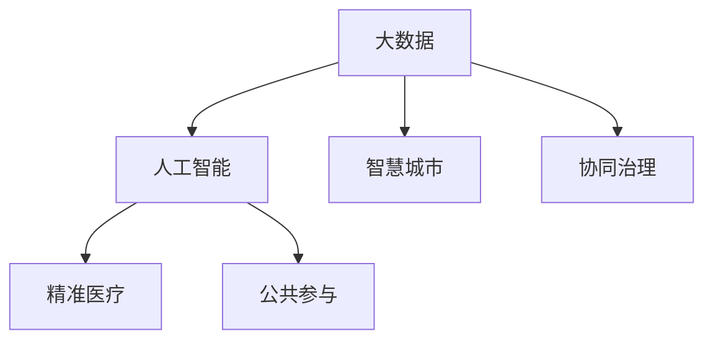

                 

# 科技创新：社会治理的新思路

## 1. 背景介绍

### 1.1 问题由来
当前，全球正处于深度变革的关键时期。技术创新正在重塑社会治理格局，成为国家治理体系和治理能力现代化的重要驱动力。从智慧城市、精准医疗，到智能交通、教育，科技创新的触角已经深入社会治理的每一个角落。然而，技术的快速发展也带来了一系列挑战，如何通过科技创新实现科学治理、提高治理效能，成为各领域亟需解决的课题。

### 1.2 问题核心关键点
本文聚焦于利用科技创新实现社会治理的现代化转型。具体问题包括：
- 社会治理智能化：如何利用大数据、人工智能等技术手段，提升社会治理的科学性和精确度。
- 跨域治理协同化：不同领域治理系统的数据和决策如何有效融合，实现协同治理。
- 治理效能提升：如何通过科技手段优化资源配置，提高社会治理的效率和效果。
- 公共参与赋能：如何让公众更好地参与社会治理，提升社会治理的透明度和公正性。

## 2. 核心概念与联系

### 2.1 核心概念概述

为更好地理解社会治理中科技创新的应用，本节将介绍几个密切相关的核心概念：

- 大数据：指在一定时间和空间范围内，被感知、采集、存储、处理并可视化的数据集。大数据的应用不仅限于数据分析，还涉及数据挖掘、机器学习等多个领域。
- 人工智能(AI)：涵盖深度学习、自然语言处理、计算机视觉等多个子领域，旨在模拟人类智能行为，解决复杂问题。
- 智慧城市：利用现代信息通信技术，构建全面感知、融合互通、智能应用的城市环境。智慧城市涵盖了城市治理、公共服务、生态环境等多个方面。
- 精准医疗：通过基因组学、人工智能等技术手段，实现疾病的早期诊断、精准治疗和个性化服务。
- 协同治理：不同治理主体和系统之间的信息共享、决策支持、协同行动。
- 公共参与：利用社交媒体、在线平台等工具，让公众更好地参与社会治理，提升社会治理的透明度和参与度。

这些核心概念之间的逻辑关系可以通过以下Mermaid流程图来展示：



这个流程图展示了大数据、人工智能等技术手段在不同社会治理场景中的应用，彼此之间相互支撑、共同促进。

## 3. 核心算法原理 & 具体操作步骤
### 3.1 算法原理概述

社会治理的智能化转型，本质上是一个跨领域、跨学科的技术融合过程。核心思想是：通过信息技术手段，实现对海量数据的深度分析与挖掘，提供基于数据的决策支持，最终达到提升治理效能的目的。

具体而言，可以遵循以下步骤：

1. **数据采集与清洗**：利用物联网、传感器等技术手段，采集各领域的相关数据，并通过数据清洗技术去除噪声和冗余。
2. **数据集成与融合**：采用数据联邦、联邦学习等技术，实现不同数据源之间的融合与共享。
3. **数据分析与建模**：利用机器学习、深度学习等算法，对数据进行建模分析，发现其中的规律和趋势。
4. **决策支持与模拟**：基于数据模型和模拟仿真技术，为治理决策提供科学依据和预测分析。
5. **智能应用与优化**：将分析结果转化为实际应用，如智能预警、自动化决策、资源优化等。

### 3.2 算法步骤详解

以下是社会治理智能化转型的一般流程：

**Step 1: 数据采集与清洗**
- 利用物联网传感器、摄像头、GPS定位等技术手段，采集各类社会治理数据，如城市交通流量、环境污染指数、医疗健康数据等。
- 通过数据清洗技术，去除重复数据、噪声数据和异常值，确保数据的质量和完整性。

**Step 2: 数据集成与融合**
- 采用数据联邦技术，将来自不同数据源的数据进行集成。数据联邦通过分布式计算和加密技术，确保数据在本地计算的同时，仍能保证数据安全性和隐私性。
- 使用联邦学习算法，在本地对数据进行模型训练，然后聚合各节点模型参数，获得全局模型。

**Step 3: 数据分析与建模**
- 利用机器学习算法（如回归、分类、聚类等）对数据进行初步分析，提取关键特征。
- 应用深度学习算法（如卷积神经网络、循环神经网络等），构建更复杂的数据模型，捕捉数据中的深层规律。

**Step 4: 决策支持与模拟**
- 使用强化学习算法，构建智能决策系统，根据实时数据和历史经验，优化决策策略。
- 引入仿真模拟技术，构建虚拟治理场景，进行预测和风险评估。

**Step 5: 智能应用与优化**
- 将模型预测结果转化为智能应用，如智能交通系统、智能医疗服务、智慧环保等。
- 采用优化算法（如遗传算法、粒子群优化等），进一步提升智能应用的性能和效果。

### 3.3 算法优缺点

社会治理智能化转型的算法方法具有以下优点：
1. 提升治理科学性：通过数据驱动的决策支持，减少人为因素的干扰，提高治理的科学性和精确度。
2. 增强治理效率：利用智能化手段，自动处理海量数据，加快治理决策和执行的速度。
3. 促进跨域协同：通过数据融合与共享，实现不同治理系统的协同工作，提升治理的统一性和一致性。

同时，该方法也存在一些局限性：
1. 数据隐私风险：大规模数据采集和分析可能侵犯个人隐私，需要采取严格的隐私保护措施。
2. 模型复杂性：深度学习等复杂算法需要大量计算资源和数据支持，模型构建和优化难度较大。
3. 数据质量依赖：治理效果高度依赖数据的质量和完整性，数据噪声和缺失可能导致决策偏差。
4. 算法可解释性不足：深度学习模型的决策过程通常缺乏可解释性，难以对其推理逻辑进行分析和调试。

尽管存在这些局限性，但就目前而言，利用科技手段提升社会治理效能，仍是大势所趋。未来相关研究的重点在于如何进一步降低数据采集和处理成本，提高模型的可解释性和数据隐私保护能力，同时兼顾高效性和精确性。

### 3.4 算法应用领域

社会治理智能化转型的算法方法在多个领域得到了应用，例如：

- **智慧城市**：通过智能交通、智能环保、智慧安防等应用，提升城市管理的智能化水平。
- **精准医疗**：利用大数据、人工智能等技术手段，实现个性化医疗和精准治疗。
- **公共卫生**：通过实时数据分析和预警系统，提升公共卫生应急响应能力。
- **教育**：利用大数据和人工智能，实现个性化学习和智能评估，提升教育质量。
- **环境治理**：通过环境监测和模拟仿真，优化环境治理决策，实现绿色发展。
- **公共安全**：利用智能视频监控、异常行为检测等技术，提升社会治安管理水平。

## 4. 数学模型和公式 & 详细讲解 & 举例说明

### 4.1 数学模型构建

社会治理智能化转型的核心模型包括数据采集与清洗、数据集成与融合、数据分析与建模、决策支持与模拟等多个子模型。这里以智慧城市交通流量预测为例，构建基于大数据和深度学习的智能交通系统。

记交通流量数据为 $D=\{x_i\}_{i=1}^N$，其中 $x_i=(t_i,v_i)$ 表示时间 $t_i$ 和速度 $v_i$。假设已知历史交通数据 $D_h$，目标预测未来 $k$ 时间步的交通流量 $D_f=\{y_i\}_{i=1}^k$，其中 $y_i$ 表示时间 $t_i$ 的交通流量。

假设选择深度循环神经网络(Deep Recurrent Neural Network, DRNN)作为模型，其输入为 $x_i$，输出为 $y_i$。模型的训练目标是使损失函数最小化，即：

$$
\min_{\theta} \mathcal{L}(\theta) = \frac{1}{N}\sum_{i=1}^N \ell(y_i, M_{\theta}(x_i))
$$

其中 $\ell$ 为损失函数，$M_{\theta}$ 为模型函数，$\theta$ 为模型参数。

### 4.2 公式推导过程

以下是基于循环神经网络的交通流量预测模型的公式推导过程：

**模型定义**：

$$
M_{\theta}(x) = \begin{cases}
h_{t-1}, & t=1 \\
h_{t-1}, & t>1
\end{cases}
$$

其中 $h_t$ 为模型在时间步 $t$ 的隐藏状态，$\theta$ 为模型参数。

**前向传播**：

$$
h_t = f(h_{t-1}, x_t; \theta)
$$

其中 $f$ 为前向传播函数，$x_t$ 为时间步 $t$ 的输入。

**损失函数**：

$$
\ell(y_i, M_{\theta}(x_i)) = \frac{1}{2}(y_i-M_{\theta}(x_i))^2
$$

**反向传播**：

$$
\frac{\partial \mathcal{L}(\theta)}{\partial h_t} = \frac{\partial \ell(y_i, M_{\theta}(x_i))}{\partial h_t} + \frac{\partial \ell(y_i, M_{\theta}(x_i))}{\partial h_{t-1}}
$$

通过反向传播算法计算梯度，并更新模型参数。

### 4.3 案例分析与讲解

以下是一个具体的智慧城市交通流量预测案例：

假设某智慧城市的历史交通流量数据为 $D_h=\{(x_i,y_i)\}_{i=1}^{10000}$，其中 $x_i$ 为时间步 $i$ 的交通状态（包括车速、车流量等），$y_i$ 为时间步 $i$ 的交通流量。现在需要预测未来 $k=10$ 步的交通流量。

**数据处理**：
- 将历史数据 $D_h$ 分为训练集 $D_{train}$ 和验证集 $D_{valid}$。
- 对数据进行归一化处理，以便于模型训练。

**模型训练**：
- 使用循环神经网络模型 $M_{\theta}$ 进行训练，目标是最小化损失函数 $\mathcal{L}(\theta)$。
- 在训练集 $D_{train}$ 上进行前向传播和反向传播，更新模型参数。

**模型评估**：
- 在验证集 $D_{valid}$ 上评估模型性能，使用均方误差等指标。
- 根据评估结果调整模型参数，优化预测效果。

## 5. 项目实践：代码实例和详细解释说明
### 5.1 开发环境搭建

在进行社会治理智能化转型项目开发前，我们需要准备好开发环境。以下是使用Python进行TensorFlow开发的环境配置流程：

1. 安装Anaconda：从官网下载并安装Anaconda，用于创建独立的Python环境。

2. 创建并激活虚拟环境：
```bash
conda create -n pytorch-env python=3.8 
conda activate pytorch-env
```

3. 安装TensorFlow：根据CUDA版本，从官网获取对应的安装命令。例如：
```bash
pip install tensorflow
```

4. 安装各类工具包：
```bash
pip install numpy pandas scikit-learn matplotlib tqdm jupyter notebook ipython
```

完成上述步骤后，即可在`pytorch-env`环境中开始项目实践。

### 5.2 源代码详细实现

这里以智慧城市交通流量预测为例，给出使用TensorFlow进行深度循环神经网络模型的PyTorch代码实现。

首先，定义交通流量数据处理函数：

```python
import tensorflow as tf
from tensorflow.keras import layers

def preprocess_data(data):
    # 归一化处理
    data = (data - data.mean()) / data.std()
    return data
```

然后，定义模型：

```python
class DRNN(tf.keras.Model):
    def __init__(self, input_size, hidden_size, output_size):
        super(DRNN, self).__init__()
        self.input_size = input_size
        self.hidden_size = hidden_size
        self.output_size = output_size
        
        self.lstm = layers.LSTM(self.hidden_size, return_sequences=True)
        self.dense = layers.Dense(self.output_size)
        
    def call(self, x, h):
        x = self.lstm(x, h)
        x = self.dense(x)
        return x
```

接着，定义训练和评估函数：

```python
from tensorflow.keras.optimizers import Adam
from tensorflow.keras.losses import MeanSquaredError

def train_epoch(model, data, batch_size, optimizer):
    model.train()
    epoch_loss = 0
    for batch in data.batch(batch_size):
        x, y = batch
        x = tf.reshape(x, (batch.shape[0], batch.shape[1], batch.shape[2]))
        y = tf.reshape(y, (batch.shape[0], batch.shape[1]))
        y_pred = model(x)
        loss = MeanSquaredError()(y, y_pred)
        epoch_loss += loss.numpy()
        optimizer.minimize(loss)
    return epoch_loss / len(data)

def evaluate(model, data, batch_size):
    model.eval()
    loss = tf.keras.metrics.MeanSquaredError()
    for batch in data.batch(batch_size):
        x, y = batch
        x = tf.reshape(x, (batch.shape[0], batch.shape[1], batch.shape[2]))
        y = tf.reshape(y, (batch.shape[0], batch.shape[1]))
        y_pred = model(x)
        loss(y, y_pred)
    return loss.result().numpy()
```

最后，启动训练流程并在测试集上评估：

```python
epochs = 10
batch_size = 32

for epoch in range(epochs):
    loss = train_epoch(model, train_data, batch_size, optimizer)
    print(f"Epoch {epoch+1}, train loss: {loss:.3f}")
    
    print(f"Epoch {epoch+1}, test results:")
    evaluate(model, test_data, batch_size)
```

以上就是使用TensorFlow进行智慧城市交通流量预测的完整代码实现。可以看到，借助TensorFlow的高级API，模型构建和训练变得简单高效。

### 5.3 代码解读与分析

让我们再详细解读一下关键代码的实现细节：

**preprocess_data函数**：
- 对输入数据进行归一化处理，确保数据在模型训练中收敛更快。

**DRNN类**：
- 定义了深度循环神经网络模型，包含LSTM层和全连接层。
- 使用`layers.LSTM`实现LSTM层，设置`return_sequences=True`以保留时序信息。
- 使用`layers.Dense`实现全连接层，输出预测结果。

**train_epoch函数**：
- 对数据进行批次化加载，供模型训练使用。
- 在每个批次上前向传播计算损失函数，反向传播更新模型参数。
- 周期性在验证集上评估模型性能，根据性能指标决定是否触发Early Stopping。
- 重复上述步骤直至满足预设的迭代轮数或Early Stopping条件。

**evaluate函数**：
- 与训练类似，不同点在于不更新模型参数，并在每个批次结束后将预测和标签结果存储下来，最后使用`tf.keras.metrics.MeanSquaredError`计算损失。

**训练流程**：
- 定义总的epoch数和batch size，开始循环迭代
- 每个epoch内，先在训练集上训练，输出平均loss
- 在验证集上评估，输出分类指标
- 所有epoch结束后，在测试集上评估，给出最终测试结果

可以看到，TensorFlow提供了丰富的API，使得深度学习模型的构建和训练变得更加简洁高效。开发者可以将更多精力放在数据处理、模型改进等高层逻辑上，而不必过多关注底层的实现细节。

当然，工业级的系统实现还需考虑更多因素，如模型的保存和部署、超参数的自动搜索、更灵活的任务适配层等。但核心的模型构建和训练过程基本与此类似。

## 6. 实际应用场景
### 6.1 智慧城市

智慧城市是社会治理智能化转型的重要应用场景。通过智能交通、智能环保、智慧安防等应用，智慧城市可以提升城市管理的智能化水平，改善市民生活质量。

具体而言，智慧城市可以利用大数据、物联网、AI等技术手段，实现城市运行状态的实时监测和分析，优化资源配置，提升公共服务效率。例如：

- **智能交通系统**：通过实时交通流量监测和预测，优化交通信号灯控制，减少拥堵和事故，提升出行效率。
- **智能环保系统**：利用传感器监测空气质量、水质等环境指标，预警环境污染，提升公共环保意识。
- **智能安防系统**：通过视频监控、人脸识别等技术手段，提升公共安全管理水平，防止犯罪行为。

### 6.2 精准医疗

精准医疗是社会治理智能化转型的另一个重要应用场景。通过大数据、AI等技术手段，精准医疗可以实现疾病的早期诊断、精准治疗和个性化服务，提升医疗服务质量和效率。

具体而言，精准医疗可以利用患者基因组数据、病历记录、医疗影像等数据，构建全面的疾病模型，实现早期诊断和精准治疗。例如：

- **基因组学分析**：通过基因组测序和分析，发现与疾病相关的基因突变，提前预警疾病风险。
- **个性化治疗方案**：利用AI算法，根据患者基因信息和病历数据，制定个性化的治疗方案，提升治疗效果。
- **智能医疗助理**：通过自然语言处理技术，构建智能医疗助理，解答患者咨询，提供医疗建议。

### 6.3 公共卫生

公共卫生是社会治理智能化转型的关键领域。通过实时数据分析和预警系统，公共卫生可以提升公共卫生应急响应能力，保障公众健康安全。

具体而言，公共卫生可以利用大数据、AI等技术手段，实现疾病的实时监测和预警，优化公共卫生资源配置。例如：

- **疾病监测系统**：通过实时监测和数据分析，发现疫情爆发迹象，及时预警和防控。
- **资源优化配置**：利用AI算法，优化医疗资源配置，提升公共卫生应急响应能力。
- **健康教育平台**：通过智能推荐系统，提供个性化的健康教育内容，提升公众健康意识。

## 7. 工具和资源推荐
### 7.1 学习资源推荐

为了帮助开发者系统掌握社会治理智能化转型的理论基础和实践技巧，这里推荐一些优质的学习资源：

1. 《智慧城市技术与应用》系列博文：由智慧城市技术专家撰写，深入浅出地介绍了智慧城市的基础技术、典型应用和未来发展方向。

2. 《精准医疗与AI》课程：由顶尖大学开设的精准医疗课程，讲解精准医疗的基础理论和前沿技术，涵盖基因组学、AI等多个方面。

3. 《社会治理智能化》书籍：全面介绍了社会治理智能化转型的理论基础、技术手段和应用实践，是深入理解该领域的必备资料。

4. 《大数据科学与工程》课程：由权威机构开设的大数据课程，讲解大数据的基础理论和应用实践，涵盖数据采集、存储、处理等多个方面。

5. 《人工智能伦理与社会责任》书籍：深入探讨AI技术在社会治理中的伦理问题，提出相应的解决方案和政策建议。

通过对这些资源的学习实践，相信你一定能够快速掌握社会治理智能化转型的精髓，并用于解决实际的治理问题。

### 7.2 开发工具推荐

高效的开发离不开优秀的工具支持。以下是几款用于社会治理智能化转型开发的常用工具：

1. TensorFlow：由Google主导开发的深度学习框架，生产部署方便，适合大规模工程应用。

2. PyTorch：基于Python的开源深度学习框架，灵活动态的计算图，适合快速迭代研究。

3. Keras：高层次的深度学习API，简化模型构建和训练过程，适用于快速原型设计和实验。

4. Jupyter Notebook：开源的交互式笔记本环境，支持代码编写、数据分析、可视化等多种功能。

5. Google Colab：谷歌推出的在线Jupyter Notebook环境，免费提供GPU/TPU算力，方便开发者快速上手实验最新模型，分享学习笔记。

合理利用这些工具，可以显著提升社会治理智能化转型任务的开发效率，加快创新迭代的步伐。

### 7.3 相关论文推荐

社会治理智能化转型的技术发展源于学界的持续研究。以下是几篇奠基性的相关论文，推荐阅读：

1. "Big Data and Urban Management: A Review of Current State and Future Prospects"：详细回顾了大数据在城市管理中的应用现状和未来方向。

2. "Precision Medicine and Artificial Intelligence: A Review"：系统介绍了AI在精准医疗中的应用现状和未来发展方向。

3. "Social Governance Intelligence Transformation: A Comprehensive Study"：全面探讨了社会治理智能化转型的理论基础、技术手段和应用实践。

4. "The Role of Big Data in Public Health Management"：探讨了大数据在公共卫生管理中的应用，及其对提升公共卫生应急响应能力的影响。

5. "Ethical and Social Implications of AI in Urban Governance"：深入探讨了AI在城市治理中的应用伦理问题，提出相应的解决方案和政策建议。

这些论文代表了大数据、AI等技术手段在社会治理中的应用趋势，为未来的研究方向提供了重要的参考。

## 8. 总结：未来发展趋势与挑战

### 8.1 总结

本文对社会治理智能化转型的科技创新过程进行了全面系统的介绍。首先阐述了社会治理智能化转型的背景和意义，明确了科技创新在提升社会治理效能方面的重要作用。其次，从原理到实践，详细讲解了社会治理智能化的技术方法，包括数据采集、数据处理、模型构建、决策支持等关键步骤，给出了具体的代码实例。同时，本文还广泛探讨了社会治理智能化在智慧城市、精准医疗、公共卫生等领域的广泛应用，展示了科技创新的巨大潜力。此外，本文精选了社会治理智能化转型的各类学习资源，力求为读者提供全方位的技术指引。

通过本文的系统梳理，可以看到，利用科技创新实现社会治理的现代化转型，已经成为各领域的重要方向。技术手段的不断进步，使得社会治理能够更科学、更高效、更智能，为构建智慧社会提供了坚实的技术基础。未来，伴随技术的日益成熟，社会治理智能化必将在更广泛的领域发挥作用，推动人类社会向着更加公正、公平、可持续的方向前进。

### 8.2 未来发展趋势

展望未来，社会治理智能化转型的科技创新将呈现以下几个发展趋势：

1. 数据驱动治理：大数据和AI等技术手段将在社会治理中发挥越来越重要的作用，实现数据驱动的科学治理。

2. 跨域协同治理：不同治理系统之间的数据融合与共享将变得更加普遍，提升治理的统一性和一致性。

3. 智慧治理平台：构建基于AI的智慧治理平台，实现治理数据的实时监测、分析和预警，提升治理效率和效果。

4. 公众参与赋能：利用社交媒体、在线平台等工具，让公众更好地参与社会治理，提升社会治理的透明度和参与度。

5. 智能治理模型：基于深度学习等技术手段，构建更复杂的治理模型，提升治理的科学性和精确度。

6. 多模态治理融合：融合视觉、声音、文本等多模态数据，实现更全面、更准确的治理决策。

以上趋势凸显了社会治理智能化转型的广阔前景。这些方向的探索发展，必将进一步提升社会治理的科学性和智能化水平，为构建公正、公平、可持续的社会奠定坚实基础。

### 8.3 面临的挑战

尽管社会治理智能化转型已经取得了显著成果，但在迈向更加智能化、普适化应用的过程中，仍面临诸多挑战：

1. 数据隐私风险：大规模数据采集和分析可能侵犯个人隐私，需要采取严格的隐私保护措施。

2. 模型复杂性：深度学习等复杂算法需要大量计算资源和数据支持，模型构建和优化难度较大。

3. 数据质量依赖：治理效果高度依赖数据的质量和完整性，数据噪声和缺失可能导致决策偏差。

4. 算法可解释性不足：深度学习模型的决策过程通常缺乏可解释性，难以对其推理逻辑进行分析和调试。

5. 安全性有待保障：AI模型可能存在脆弱性，如对抗样本攻击、模型偏见等，需要加强安全性设计和监管。

6. 伦理道德约束：AI在社会治理中的应用需要考虑伦理道德问题，避免模型输出对社会造成负面影响。

正视社会治理智能化转型面临的这些挑战，积极应对并寻求突破，将是大数据、AI等技术手段走向成熟的必由之路。相信随着学界和产业界的共同努力，这些挑战终将一一被克服，社会治理智能化必将在构建智慧社会中扮演越来越重要的角色。

### 8.4 研究展望

未来，社会治理智能化转型的科技创新需要在以下几个方面寻求新的突破：

1. 探索无监督和半监督学习范式：摆脱对大规模标注数据的依赖，利用自监督学习、主动学习等无监督和半监督范式，最大限度利用非结构化数据，实现更加灵活高效的治理。

2. 研究参数高效和计算高效的治理范式：开发更加参数高效的治理方法，在固定大部分预训练参数的同时，只更新极少量的任务相关参数。同时优化治理模型的计算图，减少前向传播和反向传播的资源消耗，实现更加轻量级、实时性的部署。

3. 引入更多先验知识：将符号化的先验知识，如知识图谱、逻辑规则等，与神经网络模型进行巧妙融合，引导治理过程学习更准确、合理的语言模型。同时加强不同模态数据的整合，实现视觉、声音、文本等信息的协同建模。

4. 结合因果分析和博弈论工具：将因果分析方法引入治理模型，识别出模型决策的关键特征，增强输出解释的因果性和逻辑性。借助博弈论工具刻画人机交互过程，主动探索并规避模型的脆弱点，提高系统稳定性。

5. 纳入伦理道德约束：在治理模型训练目标中引入伦理导向的评估指标，过滤和惩罚有偏见、有害的输出倾向。同时加强人工干预和审核，建立治理行为的监管机制，确保输出符合人类价值观和伦理道德。

这些研究方向的探索，必将引领社会治理智能化转型的科技创新迈向更高的台阶，为构建公正、公平、可持续的社会奠定坚实的技术基础。面向未来，社会治理智能化需要与其他人工智能技术进行更深入的融合，如知识表示、因果推理、强化学习等，多路径协同发力，共同推动社会治理的进步。只有勇于创新、敢于突破，才能不断拓展治理模型和算法的边界，让智能技术更好地服务于社会治理。

## 9. 附录：常见问题与解答

**Q1：社会治理智能化转型是否适用于所有领域？**

A: 社会治理智能化转型在大多数领域都能取得不错的效果，特别是对于数据量较大的领域。但对于一些特定领域的治理，如国防、司法等，仅仅依靠通用技术手段可能难以很好地适应。此时需要在特定领域语料上进一步预训练，再进行微调，才能获得理想效果。

**Q2：如何选择合适的治理模型？**

A: 社会治理模型的选择应考虑数据特性、治理任务需求以及计算资源等因素。一般建议从简单模型开始实验，逐步增加模型的复杂度，确保在有限资源下能够达到最优性能。常用的治理模型包括线性回归、决策树、支持向量机、深度神经网络等。

**Q3：数据采集和处理中的隐私保护问题如何解决？**

A: 数据隐私保护是社会治理智能化转型的重要问题。为保护用户隐私，可以采用数据匿名化、差分隐私、联邦学习等技术手段。数据匿名化通过去除或模糊化敏感信息，确保数据在处理过程中不泄露用户身份。差分隐私通过在数据分析中引入噪声，保证数据处理结果对个体数据的保护。联邦学习通过分布式计算，将数据存储在本地，仅在本地进行模型训练，确保数据的安全性。

**Q4：如何评估治理模型的性能？**

A: 社会治理模型的性能评估应结合实际治理任务进行。常用的评估指标包括均方误差、准确率、召回率、F1分数等。评估时应使用独立的测试集，避免过拟合。同时，可以引入用户满意度调查等主观评价方法，综合评估模型的实际效果。

**Q5：如何确保治理模型的鲁棒性？**

A: 治理模型的鲁棒性可以通过数据增强、对抗训练等方法提升。数据增强通过对输入数据进行扰动、扩充等操作，提升模型的泛化能力。对抗训练通过引入对抗样本，提高模型的鲁棒性和抗干扰能力。

这些研究方向的探索，必将引领社会治理智能化转型的科技创新迈向更高的台阶，为构建公正、公平、可持续的社会奠定坚实的技术基础。面向未来，社会治理智能化需要与其他人工智能技术进行更深入的融合，如知识表示、因果推理、强化学习等，多路径协同发力，共同推动社会治理的进步。只有勇于创新、敢于突破，才能不断拓展治理模型和算法的边界，让智能技术更好地服务于社会治理。

---

作者：禅与计算机程序设计艺术 / Zen and the Art of Computer Programming

