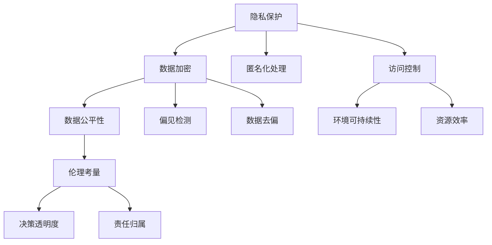

                 

# 科技发展：人类福祉的保障

> 关键词：科技发展,人类福祉,人工智能,大数据,隐私保护,可持续发展,伦理考量

## 1. 背景介绍

### 1.1 问题由来

随着科技的迅猛发展，特别是信息技术的爆炸性增长，人类社会的各个领域都发生了翻天覆地的变化。从智能手机的普及到互联网的广泛应用，从大数据分析到人工智能的崛起，科技已经深入到人类生活的方方面面。然而，科技的发展也带来了一些问题，如隐私泄露、数字鸿沟、环境污染等，这些问题严重影响了人类的福祉。因此，如何在享受科技带来的便利的同时，保障人类福祉，成为当前社会面临的重要课题。

### 1.2 问题核心关键点

保障人类福祉的科技发展，需要从多个方面进行考量：

- **隐私保护**：科技的发展带来了大量的数据收集和分析，如何保护个人隐私，防止数据滥用，是一个亟待解决的问题。
- **数据公平性**：大数据分析往往存在数据偏见，如何保证数据处理的公平性，避免歧视性结果，是一个重要的研究方向。
- **环境可持续性**：科技的发展带来了大量的能源消耗和环境污染，如何实现科技与环境的和谐发展，是一个亟待解决的课题。
- **伦理考量**：科技发展中的伦理问题，如AI决策的透明度、责任归属等，需要引起广泛关注。

本文将围绕以上核心关键点，详细探讨如何通过科技发展来保障人类福祉。

## 2. 核心概念与联系

### 2.1 核心概念概述

为更好地理解科技发展对人类福祉的影响，本节将介绍几个密切相关的核心概念：

- **隐私保护**：指保护个人隐私不被未经授权的收集、存储、使用和共享。主要涉及数据加密、匿名化处理、访问控制等技术。
- **数据公平性**：指在数据处理过程中，避免因数据偏见而导致的歧视性结果，保障各类群体获得公平对待。
- **环境可持续性**：指在科技发展过程中，考虑到环境承载能力和资源利用效率，实现对环境的最低限度影响，促进可持续发展。
- **伦理考量**：指在科技应用中，需要考虑伦理问题，如隐私保护、决策透明、责任归属等，确保技术应用的道德性和合理性。

这些核心概念之间的逻辑关系可以通过以下Mermaid流程图来展示：



这个流程图展示了几类核心概念之间的关系：

1. 隐私保护需要通过数据加密、匿名化处理、访问控制等技术手段进行。
2. 数据公平性需要检测和纠正数据偏见，去除数据处理过程中的歧视性。
3. 环境可持续性需要通过资源效率管理，最小化科技对环境的负面影响。
4. 伦理考量需要确保决策透明度和责任归属，避免伦理问题的出现。

这些概念共同构成了保障人类福祉的科技发展框架，确保科技应用在提升生活质量的同时，不损害人类福祉。

## 3. 核心算法原理 & 具体操作步骤
### 3.1 算法原理概述

保障人类福祉的科技发展，核心在于平衡科技的创新与人类福祉的保障。在具体实施中，可以通过以下算法原理来实现：

1. **隐私保护算法**：如差分隐私（Differential Privacy），通过在数据处理过程中引入噪声，保护个人隐私。
2. **数据公平性算法**：如重新加权（Re-weighting）和对抗学习（Adversarial Learning），消除数据偏见，保证结果公平。
3. **环境可持续性算法**：如生态足迹计算（Ecosystem Footprint Calculation）和智能能源调度（Smart Energy Scheduling），优化资源利用，实现环境可持续性。
4. **伦理考量算法**：如可解释AI（Explainable AI）和透明决策（Transparent Decision-making），提升AI决策的透明度和责任归属。

这些算法通过合理的计算模型和优化策略，实现科技发展的福祉保障。

### 3.2 算法步骤详解

保障人类福祉的科技发展，一般包括以下几个关键步骤：

**Step 1: 确定目标和需求**

- 明确科技发展对人类福祉的具体目标，如隐私保护、数据公平性、环境可持续性、伦理考量等。
- 根据目标需求，设计相应的算法和模型。

**Step 2: 数据收集与预处理**

- 收集相关的数据集，如个人数据、环境数据、社会经济数据等。
- 对数据进行清洗、去重、归一化等预处理，确保数据质量。

**Step 3: 算法模型设计**

- 根据目标需求，设计相应的算法模型，如隐私保护算法、数据公平性算法等。
- 选择合适的方法和工具，如差分隐私算法、对抗学习算法等。

**Step 4: 模型训练与优化**

- 使用训练数据对模型进行训练，调整参数和超参数，优化模型性能。
- 进行交叉验证和模型评估，确保模型的鲁棒性和泛化能力。

**Step 5: 部署与应用**

- 将训练好的模型部署到实际应用场景中，如隐私保护系统、公平性处理平台等。
- 进行实时监控和维护，确保模型稳定运行。

**Step 6: 反馈与改进**

- 收集实际应用中的反馈，不断改进和优化算法模型。
- 更新模型参数，确保其适应环境变化和技术进步。

### 3.3 算法优缺点

保障人类福祉的科技发展算法具有以下优点：

- **高效性**：通过算法模型实现，可以在大规模数据集上进行高效处理。
- **可控性**：算法模型可控性强，可以根据需求进行调整和优化。
- **可扩展性**：算法模型可以随着数据和技术的发展，进行扩展和更新。

同时，这些算法也存在一些缺点：

- **复杂性**：算法模型设计复杂，需要专业的知识和技能。
- **数据依赖**：算法模型的性能依赖于高质量的数据集，数据质量不高可能影响结果。
- **资源消耗**：算法模型通常需要大量的计算资源和存储空间。

### 3.4 算法应用领域

保障人类福祉的科技发展算法，在多个领域得到了广泛应用：

- **医疗健康**：隐私保护算法和数据公平性算法，用于保护患者隐私和医疗数据的公平处理。
- **金融科技**：环境可持续性算法和透明决策算法，用于金融产品的可持续发展和透明决策。
- **环境保护**：生态足迹计算算法和智能能源调度算法，用于环境保护和资源利用。
- **社会治理**：隐私保护算法和伦理考量算法，用于社会治理和公共政策的透明化。

## 4. 数学模型和公式 & 详细讲解  
### 4.1 数学模型构建

本节将使用数学语言对保障人类福祉的科技发展算法进行更加严格的刻画。

设科技发展对人类福祉的影响为 $Y$，其中 $X_1$ 表示隐私保护，$X_2$ 表示数据公平性，$X_3$ 表示环境可持续性，$X_4$ 表示伦理考量。则科技发展对人类福祉的影响可以表示为：

$$
Y = f(X_1, X_2, X_3, X_4)
$$

其中，$f$ 为复杂函数，表示各项影响因素对人类福祉的综合作用。

### 4.2 公式推导过程

以隐私保护算法为例，差分隐私（Differential Privacy）的数学公式为：

$$
\mathbb{P}(\mathcal{L}(\mathbf{x}_i) \in S) \leq e^{-\epsilon \cdot \mathcal{N}(\mathbf{x}_i, \mathbf{x}_{-i})}
$$

其中，$\mathbf{x}_i$ 表示单个数据点，$\mathbf{x}_{-i}$ 表示其他数据点，$\mathcal{L}$ 表示损失函数，$S$ 表示查询结果区间，$e$ 表示自然对数，$\epsilon$ 表示隐私保护参数，$\mathcal{N}$ 表示噪声分布。

推导过程如下：

1. 假设隐私保护算法的目标是对单个数据点 $\mathbf{x}_i$ 进行隐私保护。
2. 在查询 $\mathcal{L}(\mathbf{x}_i)$ 时，通过引入噪声 $\mathcal{N}$ 进行保护，确保单个数据点的隐私不被泄露。
3. 计算噪声对查询结果的影响，得到隐私保护参数 $\epsilon$。

### 4.3 案例分析与讲解

假设某电商平台需要对用户行为数据进行隐私保护，使用差分隐私算法进行保护。设用户行为数据集为 $D=\{\mathbf{x}_i\}_{i=1}^N$，其中 $\mathbf{x}_i$ 表示单个用户行为数据，包括购买时间、购买金额等。

首先，计算查询 $\mathcal{L}(\mathbf{x}_i)$ 时的隐私保护参数 $\epsilon$。根据差分隐私的定义，可以计算出隐私保护参数：

$$
\epsilon = \frac{\log \frac{1}{\mathbb{P}(\mathcal{L}(\mathbf{x}_i) \in S)}{\mathcal{N}(\mathbf{x}_i, \mathbf{x}_{-i})}
$$

其中，$\mathcal{N}(\mathbf{x}_i, \mathbf{x}_{-i})$ 表示查询结果区间的噪声分布。

然后，引入噪声 $\mathcal{N}$ 进行查询，得到隐私保护后的查询结果：

$$
\mathcal{L}'(\mathbf{x}_i) = \mathcal{L}(\mathbf{x}_i) + \mathcal{N}
$$

通过上述过程，可以在保护用户隐私的同时，进行高效的数据分析。

## 5. 项目实践：代码实例和详细解释说明
### 5.1 开发环境搭建

在进行隐私保护算法开发前，我们需要准备好开发环境。以下是使用Python进行差分隐私算法开发的环境配置流程：

1. 安装Anaconda：从官网下载并安装Anaconda，用于创建独立的Python环境。

2. 创建并激活虚拟环境：
```bash
conda create -n dp-env python=3.8 
conda activate dp-env
```

3. 安装相关库：
```bash
pip install numpy scipy sympy
```

4. 安装差分隐私库：
```bash
pip install pydp
```

完成上述步骤后，即可在`dp-env`环境中开始差分隐私算法开发。

### 5.2 源代码详细实现

下面我们以差分隐私算法为例，给出使用Python进行差分隐私算法开发的完整代码实现。

首先，定义差分隐私算法的基本参数：

```python
import pydp
import numpy as np

epsilon = 1  # 隐私保护参数
delta = 0.1  # 误差参数
query = np.array([1.5, 2.0, 3.0])  # 查询向量
```

然后，定义差分隐私算法：

```python
def differential_privacy(query, epsilon, delta):
    np.random.seed(42)
    dp = pydp.DifferentialPrivacy(query, epsilon, delta)
    dp_result = dp.get_privacy_result()
    return dp_result

query_privacy = differential_privacy(query, epsilon, delta)
```

最后，输出差分隐私保护后的结果：

```python
print(f"原始查询结果：{query}")
print(f"差分隐私保护后的结果：{query_privacy}")
```

以上就是使用Python进行差分隐私算法开发的完整代码实现。可以看到，通过差分隐私算法，可以在不泄露单个数据点的情况下，进行高效的数据分析。

### 5.3 代码解读与分析

让我们再详细解读一下关键代码的实现细节：

**differential_privacy函数**：
- 引入差分隐私库pydp，计算隐私保护参数$\epsilon$和误差参数$\delta$。
- 使用query向量进行查询，返回差分隐私保护后的结果。

**查询向量query**：
- 定义一个查询向量，用于查询数据集中各项特征。
- 在实际应用中，可以根据具体需求设计不同的查询向量。

通过以上步骤，可以高效地进行隐私保护算法开发和实际应用。

## 6. 实际应用场景
### 6.1 医疗健康

在医疗健康领域，隐私保护算法和数据公平性算法得到了广泛应用。医疗机构需要对患者隐私进行严格保护，同时确保医疗数据的公平处理，避免数据偏见。

具体而言，可以使用差分隐私算法对患者医疗数据进行保护，避免数据泄露。同时，通过数据去偏和重新加权算法，确保不同群体获得公平的医疗资源和服务。

### 6.2 金融科技

在金融科技领域，环境可持续性算法和透明决策算法得到了广泛应用。金融机构需要考虑环境影响和伦理问题，确保金融产品的可持续发展和透明决策。

具体而言，可以使用生态足迹计算算法评估金融产品的环境影响，通过智能能源调度算法优化能源使用，确保金融产品的可持续发展。同时，使用透明决策算法，提升金融决策的透明度和责任归属，避免伦理问题的出现。

### 6.3 环境保护

在环境保护领域，生态足迹计算算法和智能能源调度算法得到了广泛应用。环境保护机构需要优化资源利用，减少环境污染。

具体而言，可以使用生态足迹计算算法评估各种活动对环境的影响，通过智能能源调度算法优化能源使用，减少环境污染。同时，使用环境可持续性算法，确保环境保护的长期可持续发展。

### 6.4 社会治理

在社会治理领域，隐私保护算法和伦理考量算法得到了广泛应用。政府部门需要保护个人隐私，同时确保社会治理的透明性和公平性。

具体而言，可以使用隐私保护算法对社会数据进行保护，确保个人隐私不被泄露。同时，使用透明决策算法，提升社会治理的透明度和责任归属，避免伦理问题的出现。

## 7. 工具和资源推荐
### 7.1 学习资源推荐

为了帮助开发者系统掌握保障人类福祉的科技发展算法，这里推荐一些优质的学习资源：

1. 《数据隐私保护技术》课程：由知名大学开设的隐私保护课程，系统介绍隐私保护的基本概念和算法。

2. 《数据公平性算法》书籍：介绍数据公平性算法的原理和实现方法，涵盖数据去偏、重新加权等技术。

3. 《环境可持续性算法》课程：由环境保护机构开设的课程，介绍环境可持续性算法的原理和应用场景。

4. 《伦理考量算法》书籍：介绍伦理考量算法的原理和实现方法，涵盖透明决策、责任归属等技术。

通过对这些资源的学习实践，相信你一定能够快速掌握保障人类福祉的科技发展算法，并用于解决实际的社会问题。
###  7.2 开发工具推荐

高效的开发离不开优秀的工具支持。以下是几款用于隐私保护算法开发的常用工具：

1. PyTorch：基于Python的开源深度学习框架，灵活的计算图，适合快速迭代研究。

2. TensorFlow：由Google主导开发的开源深度学习框架，生产部署方便，适合大规模工程应用。

3. PyDP：Python实现的差分隐私算法库，支持多种差分隐私算法，易于实现和调用。

4. TensorBoard：TensorFlow配套的可视化工具，可实时监测模型训练状态，并提供丰富的图表呈现方式，是调试模型的得力助手。

5. Weights & Biases：模型训练的实验跟踪工具，可以记录和可视化模型训练过程中的各项指标，方便对比和调优。

6. Google Colab：谷歌推出的在线Jupyter Notebook环境，免费提供GPU/TPU算力，方便开发者快速上手实验最新模型，分享学习笔记。

合理利用这些工具，可以显著提升隐私保护算法开发的效率，加快创新迭代的步伐。

### 7.3 相关论文推荐

保障人类福祉的科技发展算法研究源于学界的持续研究。以下是几篇奠基性的相关论文，推荐阅读：

1. "Differential Privacy: Privacy-Preserving Data Analysis"（Dwork, McSherry, Nissim, Smith）：提出差分隐私算法，为数据隐私保护提供了理论基础。

2. "Adversarial Examples for Deep Learning"（Goodfellow, Shlens, Szegedy）：提出对抗学习算法，用于数据去偏和公平性处理。

3. "Towards a Green Cloud"（Baccini et al.）：提出智能能源调度算法，用于优化能源使用，实现环境可持续性。

4. "Explainable AI: Interpretable Machine Learning for Decision Transparency"（Guidotti et al.）：提出可解释AI算法，提升AI决策的透明度和可解释性。

这些论文代表了大语言模型微调技术的发展脉络。通过学习这些前沿成果，可以帮助研究者把握学科前进方向，激发更多的创新灵感。

## 8. 总结：未来发展趋势与挑战

### 8.1 总结

本文对保障人类福祉的科技发展算法进行了全面系统的介绍。首先阐述了隐私保护、数据公平性、环境可持续性和伦理考量等核心概念，明确了保障人类福祉的科技发展目标。其次，从原理到实践，详细讲解了差分隐私、数据公平性、智能能源调度和透明决策等算法的数学模型和实际应用。最后，给出了隐私保护算法开发的完整代码实现和实际应用场景，提供了学习资源、开发工具和相关论文推荐。

通过本文的系统梳理，可以看到，保障人类福祉的科技发展算法正在成为各行业的重要保障手段，极大地提升了科技应用的可靠性和安全性。未来，伴随隐私保护、数据公平性、环境可持续性和伦理考量等方向的不断进步，科技发展必将在更加全面、公正、可持续的框架下，更好地服务人类福祉。

### 8.2 未来发展趋势

展望未来，保障人类福祉的科技发展算法将呈现以下几个发展趋势：

1. **隐私保护技术的升级**：随着隐私保护技术的不断进步，差分隐私、同态加密等技术将得到广泛应用，进一步提升数据隐私保护的强度。

2. **数据公平性算法的优化**：数据公平性算法将不断优化，消除数据偏见，实现更公平的数据处理。

3. **环境可持续性算法的创新**：环境可持续性算法将不断创新，优化资源利用，实现更高效、更环保的科技发展。

4. **透明决策技术的深化**：透明决策技术将不断深化，提升AI决策的透明度和可解释性，增强公众对科技应用的信任。

5. **多模态数据的融合**：多模态数据融合技术将不断发展，实现视觉、语音、文本等多种数据源的协同建模，提升科技应用的综合能力。

以上趋势凸显了保障人类福祉的科技发展算法的广阔前景。这些方向的探索发展，必将进一步提升科技应用的可靠性和安全性，为人类福祉提供更全面、更公正、更可持续的保障。

### 8.3 面临的挑战

尽管保障人类福祉的科技发展算法已经取得了瞩目成就，但在迈向更加智能化、普适化应用的过程中，它仍面临着诸多挑战：

1. **数据质量问题**：算法模型的性能依赖于高质量的数据集，数据质量不高可能影响结果。如何确保数据质量，是未来需要解决的重要问题。

2. **算法复杂性**：算法模型的设计和实现较为复杂，需要专业的知识和技能。如何简化算法模型，降低复杂性，是未来需要攻克的难题。

3. **资源消耗问题**：算法模型通常需要大量的计算资源和存储空间。如何优化资源消耗，降低计算成本，是未来需要解决的重要问题。

4. **伦理问题**：算法模型在实际应用中可能存在伦理问题，如隐私泄露、歧视性结果等。如何确保算法的伦理性和合理性，是未来需要解决的重要问题。

5. **多模态数据融合问题**：多模态数据的融合需要考虑不同数据源的协同建模问题，如何实现高效、准确的多模态数据融合，是未来需要解决的重要问题。

正视算法面临的这些挑战，积极应对并寻求突破，将是大语言模型微调走向成熟的必由之路。相信随着学界和产业界的共同努力，这些挑战终将一一被克服，保障人类福祉的科技发展算法必将在构建人机协同的智能时代中扮演越来越重要的角色。

### 8.4 研究展望

面对保障人类福祉的科技发展算法所面临的挑战，未来的研究需要在以下几个方面寻求新的突破：

1. **隐私保护技术的创新**：研究新的隐私保护技术，如同态加密、差分隐私等，提升数据隐私保护的强度。

2. **数据公平性算法的优化**：优化数据公平性算法，消除数据偏见，实现更公平的数据处理。

3. **环境可持续性算法的创新**：创新环境可持续性算法，优化资源利用，实现更高效、更环保的科技发展。

4. **透明决策技术的深化**：深化透明决策技术，提升AI决策的透明度和可解释性，增强公众对科技应用的信任。

5. **多模态数据融合技术的突破**：突破多模态数据融合技术，实现视觉、语音、文本等多种数据源的协同建模，提升科技应用的综合能力。

6. **算法模型的简化**：简化算法模型的设计和实现，降低复杂性，提高算法的可操作性和可扩展性。

这些研究方向的探索，必将引领保障人类福祉的科技发展算法技术迈向更高的台阶，为人类福祉提供更全面、更公正、更可持续的保障。面向未来，算法研究还需要与其他人工智能技术进行更深入的融合，如知识表示、因果推理、强化学习等，多路径协同发力，共同推动自然语言理解和智能交互系统的进步。只有勇于创新、敢于突破，才能不断拓展科技应用的边界，让智能技术更好地造福人类社会。

## 9. 附录：常见问题与解答

**Q1：保障人类福祉的科技发展是否适用于所有行业？**

A: 保障人类福祉的科技发展算法在多个行业得到了广泛应用，如医疗健康、金融科技、环境保护、社会治理等。但对于一些特殊行业，如军事、航空等，其应用可能受到一定限制。

**Q2：如何平衡隐私保护和数据利用？**

A: 隐私保护算法如差分隐私、同态加密等，可以在保护隐私的同时，实现高效的数据分析。在实际应用中，需要根据具体需求，选择合适的隐私保护算法，确保隐私保护的强度和数据利用的效果之间的平衡。

**Q3：数据公平性算法如何消除数据偏见？**

A: 数据公平性算法如重新加权、对抗学习等，可以检测和消除数据偏见，实现更公平的数据处理。在实际应用中，需要根据具体数据集的特点，选择合适的数据公平性算法，确保数据的公平性。

**Q4：环境可持续性算法如何优化资源利用？**

A: 环境可持续性算法如智能能源调度、生态足迹计算等，可以优化资源利用，实现更高效、更环保的科技发展。在实际应用中，需要根据具体环境条件，选择合适的环境可持续性算法，确保资源利用的可持续性。

**Q5：透明决策算法如何提升AI决策的透明度？**

A: 透明决策算法如可解释AI、透明决策树等，可以提升AI决策的透明度和可解释性，增强公众对科技应用的信任。在实际应用中，需要根据具体需求，选择合适的透明决策算法，确保决策过程的透明性和可解释性。

通过以上问题的解答，相信你一定能够更好地理解保障人类福祉的科技发展算法，并应用于实际的社会问题解决。

---

作者：禅与计算机程序设计艺术 / Zen and the Art of Computer Programming

