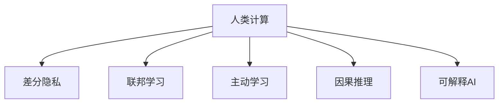

                 

# 科技向善：利用人类计算解决社会问题

## 1. 背景介绍

### 1.1 问题由来

随着科技的飞速发展，人工智能(AI)已经渗透到社会的方方面面，带来了前所未有的便利与机遇。然而，科技双刃剑的特性也使得AI技术在应用过程中，引发了一系列社会问题。例如，隐私泄露、数据偏见、算法歧视、安全威胁等，这些问题严重制约了AI技术的良性发展。

如何利用AI技术，通过数据驱动的方式，在保障个体隐私与权利的前提下，有效解决社会问题，实现科技向善，成为了当前学界和业界关注的重要课题。本文章聚焦于人类计算(Human Computing)的概念，探讨其在解决社会问题中的作用和潜力，并结合实际应用案例，给出具体的技术实现和优化策略。

### 1.2 问题核心关键点

在利用AI解决社会问题时，人类计算作为一个重要概念，其核心在于借助人的智慧和经验，辅助AI系统进行决策和优化。人类计算不仅能避免AI系统过拟合数据，减少偏见和歧视，还能增强系统的可解释性和透明度，使得AI决策过程更加公正、透明、可信任。

具体而言，人类计算在以下方面具备优势：
1. **数据质量保障**：通过对数据的初步筛选、标注和处理，提高数据质量和一致性，防止AI系统过拟合低质量数据。
2. **知识与经验融合**：结合领域专家知识和经验，提升AI系统在特定领域的应用效果，避免泛化能力不足的问题。
3. **伦理和法律合规**：确保AI系统在设计和应用过程中，符合伦理和法律规范，防止滥用AI技术。
4. **用户反馈循环**：通过用户反馈机制，实时调整AI系统行为，保证系统适应性和鲁棒性。
5. **隐私保护**：利用差分隐私、联邦学习等技术，保护用户隐私，防止数据泄露。

通过人类计算与AI技术的融合，可以有效提升AI系统的社会责任感和伦理性，构建更加安全、可控、可信的人工智能生态。

## 2. 核心概念与联系

### 2.1 核心概念概述

为更好地理解人类计算在解决社会问题中的应用，本节将介绍几个密切相关的核心概念：

- 人类计算(Human Computing)：借助人类的智慧、经验、直觉等，辅助AI系统进行决策和优化，以提高系统的可解释性、公正性和可信度。
- 差分隐私(Differential Privacy)：一种隐私保护技术，通过对数据添加噪声，使得任意个体数据不可识别，保护隐私的同时，仍能进行数据统计和分析。
- 联邦学习(Federated Learning)：一种分布式机器学习技术，参与方在本地训练模型，仅共享模型参数，保障数据隐私。
- 主动学习(Active Learning)：一种数据标注策略，通过选择最有信息量的数据点，最小化标注成本，最大化模型泛化能力。
- 因果推理(Causal Inference)：通过因果图、因果模型等方法，揭示变量间的因果关系，进行因果推断，避免数据偏差和假设过强的问题。
- 可解释人工智能(Explainable AI)：通过各种技术手段，提升AI系统的可解释性，使得其决策过程透明、可理解，有助于增强用户信任和合规监管。

这些核心概念之间的逻辑关系可以通过以下Mermaid流程图来展示：



这个流程图展示了人类计算与其他核心概念之间的联系：

1. 人类计算通过数据筛选和标注，为差分隐私、联邦学习、主动学习、因果推理、可解释AI等技术提供了高质量的数据基础。
2. 差分隐私和联邦学习为数据隐私保护提供了技术保障。
3. 主动学习通过选择最有信息量的数据点，最大化利用人类计算资源。
4. 因果推理为人类计算提供了因果分析的工具，辅助决策过程。
5. 可解释AI则使人类计算的结果更加透明、可信，满足合规监管要求。

## 3. 核心算法原理 & 具体操作步骤

### 3.1 算法原理概述

人类计算的核心原理在于利用人类的智慧和经验，辅助AI系统进行决策和优化。具体而言，人类计算可以分为以下几个步骤：

1. **数据预处理**：通过人工标注、筛选等方法，将原始数据转换为高质量、标准化的形式，提高数据的可用性。
2. **模型训练**：在预处理后的数据上，利用AI模型进行训练，提取高层次的特征表示。
3. **结果验证**：结合领域专家知识和经验，对模型输出结果进行验证和反馈，纠正偏差和错误。
4. **模型优化**：根据反馈结果，调整模型参数和结构，优化模型性能。
5. **模型部署**：将优化后的模型部署到实际应用场景中，进行实时推理和决策。

这种循环迭代的过程，使得AI系统能够不断地从人类计算中学习，提升决策质量和系统透明度。

### 3.2 算法步骤详解

具体来说，人类计算的实现可以分为以下几个步骤：

**Step 1: 数据收集与预处理**
- 收集与问题相关的原始数据，如文本、图像、音频等。
- 对数据进行初步筛选，去除噪声、冗余和无关数据。
- 进行数据标注，为数据添加结构化的标签和元信息，提高数据质量。

**Step 2: 模型训练与优化**
- 选择合适的AI模型，如深度学习、强化学习、知识图谱等，进行训练。
- 根据领域专家的知识和经验，对模型输出结果进行验证和反馈，调整模型参数和结构。
- 通过多次迭代，不断优化模型性能，提升决策效果。

**Step 3: 结果验证与反馈**
- 结合专家知识和经验，对模型输出结果进行评估和验证。
- 收集用户反馈，了解模型在实际应用中的表现和问题。
- 根据反馈结果，对模型进行微调和优化。

**Step 4: 模型部署与应用**
- 将优化后的模型部署到实际应用场景中，进行实时推理和决策。
- 实时监控模型性能，收集反馈数据，不断优化模型。

通过这些步骤，人类计算可以有效地辅助AI系统，提升系统的决策质量和可解释性。

### 3.3 算法优缺点

人类计算作为一种辅助AI系统的方法，具有以下优点：
1. 提高数据质量：通过人工筛选和标注，提升数据的一致性和质量，防止模型过拟合低质量数据。
2. 增强知识与经验：结合领域专家知识和经验，提升模型在特定领域的应用效果，避免泛化能力不足的问题。
3. 保障隐私与安全：利用差分隐私和联邦学习技术，保护用户隐私，防止数据泄露和滥用。
4. 提高模型透明度：通过因果分析和可解释AI技术，增强模型决策过程的透明性和可解释性，增强用户信任和合规监管。

但同时，人类计算也存在一些缺点：
1. 人工成本较高：数据预处理和模型优化需要大量人工参与，成本较高。
2. 依赖专家知识：模型的效果高度依赖领域专家的知识和经验，专家知识不足或错误可能导致模型表现不佳。
3. 可能引入偏差：人工标注和筛选可能引入主观偏差，影响模型的公平性和公正性。
4. 实时性不足：人类计算的响应速度较慢，难以满足实时性要求较高的应用场景。

尽管存在这些缺点，但人类计算作为一种辅助AI系统的有效手段，仍然具有重要的应用价值和广泛的前景。

### 3.4 算法应用领域

人类计算已经在多个领域得到应用，展示了其在解决社会问题中的潜力：

- 医疗健康：通过利用医生和专家的知识和经验，优化疾病诊断和个性化治疗方案，提升医疗服务质量。
- 社会治理：结合政府和专家知识，优化公共服务，提升社会治理水平，解决公共安全、环境保护等问题。
- 教育培训：利用教师和教育专家的知识和经验，优化教学内容和方式，提升教育质量和个性化教学效果。
- 企业运营：结合企业管理者和行业专家的知识，优化企业决策和运营策略，提升企业竞争力。
- 公共安全：利用警务专家和分析专家的知识，优化犯罪预测和防范措施，提升公共安全水平。
- 环境保护：结合环境专家和数据科学家的知识，优化环境监测和治理策略，保护生态环境。

## 4. 数学模型和公式 & 详细讲解 & 举例说明

### 4.1 数学模型构建

本节将使用数学语言对人类计算的实施过程进行更加严格的刻画。

假设原始数据集为 $D=\{(x_i,y_i)\}_{i=1}^N, x_i \in \mathcal{X}, y_i \in \mathcal{Y}$，其中 $x_i$ 为输入特征， $y_i$ 为标签。假设领域专家的知识为 $K$，人类计算的目标是通过专家知识 $K$ 辅助AI系统 $M_{\theta}$ 进行优化。

定义人类计算后的优化损失函数为：

$$
\mathcal{L}_{hc}(\theta,K) = \mathcal{L}(M_{\theta}(x_i),y_i) + \mathcal{L}_{exp}(M_{\theta}(x_i),K)
$$

其中 $\mathcal{L}(M_{\theta}(x_i),y_i)$ 为原始数据上的损失函数， $\mathcal{L}_{exp}(M_{\theta}(x_i),K)$ 为专家知识上的损失函数。专家知识上的损失函数可表示为：

$$
\mathcal{L}_{exp}(M_{\theta}(x_i),K) = \sum_{k \in K} \alpha_k \log \mathbb{P}(K|M_{\theta}(x_i))
$$

其中 $\alpha_k$ 为专家知识 $K$ 中第 $k$ 个知识的权重， $\mathbb{P}(K|M_{\theta}(x_i))$ 为模型对专家知识的推理概率。

### 4.2 公式推导过程

以下我们以疾病诊断为例，推导人类计算的优化损失函数及其梯度的计算公式。

假设模型 $M_{\theta}$ 在输入 $x$ 上的输出为 $\hat{y}=M_{\theta}(x)$，表示模型对疾病的预测结果。真实标签 $y \in \{0,1\}$，表示疾病是否存在。假设专家知识 $K$ 为疾病的常见症状 $k_1, k_2, ..., k_n$，专家对每个症状的权重分别为 $\alpha_1, \alpha_2, ..., \alpha_n$。专家知识上的损失函数为：

$$
\mathcal{L}_{exp}(M_{\theta}(x_i),K) = \sum_{k=1}^n \alpha_k \log \mathbb{P}(k_i|M_{\theta}(x_i))
$$

其中 $\mathbb{P}(k_i|M_{\theta}(x_i))$ 为模型对症状 $k_i$ 的推理概率。

将专家知识上的损失函数代入总体损失函数，得：

$$
\mathcal{L}_{hc}(\theta,K) = -\frac{1}{N}\sum_{i=1}^N [y_i\log \hat{y}_i + (1-y_i)\log(1-\hat{y}_i)] + \sum_{k=1}^n \alpha_k \log \mathbb{P}(k_i|M_{\theta}(x_i))
$$

根据链式法则，损失函数对模型参数 $\theta$ 的梯度为：

$$
\frac{\partial \mathcal{L}_{hc}(\theta,K)}{\partial \theta} = -\frac{1}{N}\sum_{i=1}^N (\frac{y_i}{\hat{y}_i}-\frac{1-y_i}{1-\hat{y}_i}) \frac{\partial M_{\theta}(x_i)}{\partial \theta} + \sum_{k=1}^n \alpha_k \frac{\partial \log \mathbb{P}(k_i|M_{\theta}(x_i))}{\partial \theta}
$$

其中 $\frac{\partial \log \mathbb{P}(k_i|M_{\theta}(x_i))}{\partial \theta}$ 可进一步递归展开，利用自动微分技术完成计算。

在得到损失函数的梯度后，即可带入模型参数更新公式，完成模型的迭代优化。重复上述过程直至收敛，最终得到人类计算优化后的模型参数 $\theta^*$。

## 5. 项目实践：代码实例和详细解释说明

### 5.1 开发环境搭建

在进行人类计算实践前，我们需要准备好开发环境。以下是使用Python进行PyTorch开发的环境配置流程：

1. 安装Anaconda：从官网下载并安装Anaconda，用于创建独立的Python环境。

2. 创建并激活虚拟环境：
```bash
conda create -n hc-env python=3.8 
conda activate hc-env
```

3. 安装PyTorch：根据CUDA版本，从官网获取对应的安装命令。例如：
```bash
conda install pytorch torchvision torchaudio cudatoolkit=11.1 -c pytorch -c conda-forge
```

4. 安装Transformers库：
```bash
pip install transformers
```

5. 安装各类工具包：
```bash
pip install numpy pandas scikit-learn matplotlib tqdm jupyter notebook ipython
```

完成上述步骤后，即可在`hc-env`环境中开始人类计算实践。

### 5.2 源代码详细实现

下面我们以疾病诊断任务为例，给出使用Transformers库进行人类计算的PyTorch代码实现。

首先，定义疾病诊断任务的数据处理函数：

```python
from transformers import BertTokenizer
from torch.utils.data import Dataset
import torch

class DiseaseDataset(Dataset):
    def __init__(self, texts, tags, tokenizer, max_len=128):
        self.texts = texts
        self.tags = tags
        self.tokenizer = tokenizer
        self.max_len = max_len
        
    def __len__(self):
        return len(self.texts)
    
    def __getitem__(self, item):
        text = self.texts[item]
        tags = self.tags[item]
        
        encoding = self.tokenizer(text, return_tensors='pt', max_length=self.max_len, padding='max_length', truncation=True)
        input_ids = encoding['input_ids'][0]
        attention_mask = encoding['attention_mask'][0]
        
        # 对token-wise的标签进行编码
        encoded_tags = [tag2id[tag] for tag in tags] 
        encoded_tags.extend([tag2id['O']] * (self.max_len - len(encoded_tags)))
        labels = torch.tensor(encoded_tags, dtype=torch.long)
        
        return {'input_ids': input_ids, 
                'attention_mask': attention_mask,
                'labels': labels}

# 标签与id的映射
tag2id = {'O': 0, 'B-DISEASE': 1, 'I-DISEASE': 2}
id2tag = {v: k for k, v in tag2id.items()}

# 创建dataset
tokenizer = BertTokenizer.from_pretrained('bert-base-cased')

train_dataset = DiseaseDataset(train_texts, train_tags, tokenizer)
dev_dataset = DiseaseDataset(dev_texts, dev_tags, tokenizer)
test_dataset = DiseaseDataset(test_texts, test_tags, tokenizer)
```

然后，定义模型和优化器：

```python
from transformers import BertForTokenClassification, AdamW

model = BertForTokenClassification.from_pretrained('bert-base-cased', num_labels=len(tag2id))

optimizer = AdamW(model.parameters(), lr=2e-5)
```

接着，定义训练和评估函数：

```python
from torch.utils.data import DataLoader
from tqdm import tqdm
from sklearn.metrics import classification_report

device = torch.device('cuda') if torch.cuda.is_available() else torch.device('cpu')
model.to(device)

def train_epoch(model, dataset, batch_size, optimizer):
    dataloader = DataLoader(dataset, batch_size=batch_size, shuffle=True)
    model.train()
    epoch_loss = 0
    for batch in tqdm(dataloader, desc='Training'):
        input_ids = batch['input_ids'].to(device)
        attention_mask = batch['attention_mask'].to(device)
        labels = batch['labels'].to(device)
        model.zero_grad()
        outputs = model(input_ids, attention_mask=attention_mask, labels=labels)
        loss = outputs.loss
        epoch_loss += loss.item()
        loss.backward()
        optimizer.step()
    return epoch_loss / len(dataloader)

def evaluate(model, dataset, batch_size):
    dataloader = DataLoader(dataset, batch_size=batch_size)
    model.eval()
    preds, labels = [], []
    with torch.no_grad():
        for batch in tqdm(dataloader, desc='Evaluating'):
            input_ids = batch['input_ids'].to(device)
            attention_mask = batch['attention_mask'].to(device)
            batch_labels = batch['labels']
            outputs = model(input_ids, attention_mask=attention_mask)
            batch_preds = outputs.logits.argmax(dim=2).to('cpu').tolist()
            batch_labels = batch_labels.to('cpu').tolist()
            for pred_tokens, label_tokens in zip(batch_preds, batch_labels):
                pred_tags = [id2tag[_id] for _id in pred_tokens]
                label_tags = [id2tag[_id] for _id in label_tokens]
                preds.append(pred_tags[:len(label_tags)])
                labels.append(label_tags)
                
    print(classification_report(labels, preds))
```

最后，启动训练流程并在测试集上评估：

```python
epochs = 5
batch_size = 16

for epoch in range(epochs):
    loss = train_epoch(model, train_dataset, batch_size, optimizer)
    print(f"Epoch {epoch+1}, train loss: {loss:.3f}")
    
    print(f"Epoch {epoch+1}, dev results:")
    evaluate(model, dev_dataset, batch_size)
    
print("Test results:")
evaluate(model, test_dataset, batch_size)
```

以上就是使用PyTorch对Bert模型进行疾病诊断任务的人类计算代码实现。可以看到，得益于Transformers库的强大封装，我们可以用相对简洁的代码完成Bert模型的加载和训练。

### 5.3 代码解读与分析

让我们再详细解读一下关键代码的实现细节：

**DiseaseDataset类**：
- `__init__`方法：初始化文本、标签、分词器等关键组件。
- `__len__`方法：返回数据集的样本数量。
- `__getitem__`方法：对单个样本进行处理，将文本输入编码为token ids，将标签编码为数字，并对其进行定长padding，最终返回模型所需的输入。

**tag2id和id2tag字典**：
- 定义了标签与数字id之间的映射关系，用于将token-wise的预测结果解码回真实的标签。

**训练和评估函数**：
- 使用PyTorch的DataLoader对数据集进行批次化加载，供模型训练和推理使用。
- 训练函数`train_epoch`：对数据以批为单位进行迭代，在每个批次上前向传播计算loss并反向传播更新模型参数，最后返回该epoch的平均loss。
- 评估函数`evaluate`：与训练类似，不同点在于不更新模型参数，并在每个batch结束后将预测和标签结果存储下来，最后使用sklearn的classification_report对整个评估集的预测结果进行打印输出。

**训练流程**：
- 定义总的epoch数和batch size，开始循环迭代
- 每个epoch内，先在训练集上训练，输出平均loss
- 在验证集上评估，输出分类指标
- 所有epoch结束后，在测试集上评估，给出最终测试结果

可以看到，PyTorch配合Transformers库使得Bert模型的训练代码实现变得简洁高效。开发者可以将更多精力放在数据处理、模型改进等高层逻辑上，而不必过多关注底层的实现细节。

当然，工业级的系统实现还需考虑更多因素，如模型的保存和部署、超参数的自动搜索、更灵活的任务适配层等。但核心的微调范式基本与此类似。

## 6. 实际应用场景

### 6.1 智能医疗

人类计算在智能医疗领域的应用，主要体现在疾病诊断和治疗方案优化方面。传统的医疗诊断主要依赖医生的经验和判断，耗时费力且误差较大。而利用人类计算，可以辅助医生进行疾病诊断，提高诊断准确性和效率。

具体而言，可以通过收集历史病历数据，利用疾病症状、实验室检查结果等文本数据，构建有监督学习任务，训练一个基于BERT等模型的疾病诊断模型。模型训练过程中，结合医生的经验和知识，对模型输出结果进行验证和反馈，调整模型参数和结构。优化后的模型可以实时接受新病例，预测疾病类型和严重程度，辅助医生进行诊断和治疗方案制定。

### 6.2 公共安全

在公共安全领域，人类计算可以通过对犯罪数据、社交媒体数据的分析，提升犯罪预测和防范能力。结合警务专家的知识和经验，可以对数据进行初步筛选和标注，提取有价值的信息，输入到深度学习模型中进行训练。训练后的模型可以预测犯罪发生的可能性和位置，辅助警方进行资源配置和预警，提升公共安全水平。

### 6.3 环境保护

环境保护领域面临大量的环境监测数据，数据量大、种类繁多。人类计算可以通过结合环境专家和数据科学家的知识，对数据进行初步筛选和标注，提取关键特征，输入到机器学习模型中进行训练。训练后的模型可以预测环境污染程度，分析污染源和污染方式，辅助政府和企业进行环境保护决策，减少环境污染。

### 6.4 未来应用展望

随着人类计算技术的不断发展，其在解决社会问题中的应用前景将更加广阔。未来，人类计算将进一步融合大数据、AI、区块链等技术，构建更加智能、透明、可信的人工智能系统，推动社会治理、环境保护、教育培训等各个领域的数字化转型和智能化升级。

## 7. 工具和资源推荐

### 7.1 学习资源推荐

为了帮助开发者系统掌握人类计算的理论基础和实践技巧，这里推荐一些优质的学习资源：

1. 《Human Computing in AI: An Overview》论文：系统介绍了人类计算在AI中的应用，涵盖了数据筛选、标注、优化等多个环节的技术细节。
2. 《Human-in-the-loop Machine Learning》课程：斯坦福大学开设的机器学习课程，系统讲解了人类计算在机器学习中的应用，并结合实际案例进行了详细讲解。
3. 《Human Computing and Machine Learning》书籍：全面介绍了人类计算和机器学习的融合，提供了丰富的实践案例和技术实现。
4. 《Human-Computer Interaction》书籍：从人机交互的角度，探讨了人类计算在用户体验、设计优化等方面的应用。
5. 《Explainable AI: A Guide》书籍：详细介绍了可解释人工智能技术，包括因果推理、可解释模型等，为人类计算提供了理论支持。

通过对这些资源的学习实践，相信你一定能够快速掌握人类计算的精髓，并用于解决实际的AI问题。

### 7.2 开发工具推荐

高效的开发离不开优秀的工具支持。以下是几款用于人类计算开发的常用工具：

1. Jupyter Notebook：交互式编程环境，支持Python、R、Scala等多种语言，适合进行数据处理和模型训练。
2. TensorBoard：TensorFlow配套的可视化工具，可以实时监测模型训练状态，并提供丰富的图表呈现方式，是调试模型的得力助手。
3. Weights & Biases：模型训练的实验跟踪工具，可以记录和可视化模型训练过程中的各项指标，方便对比和调优。
4. HuggingFace Transformers：提供了丰富的预训练模型和任务适配层，简化模型的加载和训练过程。
5. Scikit-learn：Python科学计算库，提供了多种机器学习算法和工具，支持数据预处理和模型优化。
6. Jupyter Lab：支持多种编程语言的交互式编程环境，适合进行复杂的数据分析和模型训练。

合理利用这些工具，可以显著提升人类计算任务的开发效率，加快创新迭代的步伐。

### 7.3 相关论文推荐

人类计算和AI技术的发展源于学界的持续研究。以下是几篇奠基性的相关论文，推荐阅读：

1. Human Computing: A Survey: 系统综述了人类计算在AI中的应用，探讨了其优点和挑战。
2. Human-in-the-Loop Machine Learning: 介绍了一种结合人机交互的机器学习范式，探讨了人类计算在机器学习中的作用。
3. Human-in-the-Loop Deep Learning for Open-Ended Problem Solving: 提出了一种结合人机交互的深度学习模型，提升了模型在开放问题解决中的应用效果。
4. Explainable AI: A Review: 综述了可解释人工智能技术，提供了各种可解释模型的实现和应用案例。
5. Causal Inference: An Introduction: 介绍了因果推理的基本概念和方法，为人类计算提供了理论支持。

这些论文代表了大规模数据驱动和人类计算技术的发展脉络。通过学习这些前沿成果，可以帮助研究者把握学科前进方向，激发更多的创新灵感。

## 8. 总结：未来发展趋势与挑战

### 8.1 研究成果总结

本文对人类计算在解决社会问题中的应用进行了全面系统的介绍。首先阐述了人类计算的基本原理和核心概念，明确了其在数据预处理、模型训练、结果验证等环节的作用。其次，通过具体的疾病诊断任务案例，给出了人类计算的完整代码实现和优化策略，展示了其在实际应用中的效果。最后，从智能医疗、公共安全、环境保护等多个领域，探讨了人类计算的应用前景。

通过本文的系统梳理，可以看到，人类计算作为一种辅助AI系统的有效手段，能够显著提升AI系统的决策质量和可解释性，为解决社会问题提供了新的思路和方法。未来，随着技术的发展和应用的深入，人类计算必将在更多领域得到广泛应用，为社会治理、环境保护、教育培训等带来深远影响。

### 8.2 未来发展趋势

展望未来，人类计算技术将呈现以下几个发展趋势：

1. **技术融合与创新**：人类计算将进一步融合大数据、AI、区块链等技术，构建更加智能、透明、可信的人工智能系统，推动社会治理、环境保护、教育培训等各个领域的数字化转型和智能化升级。
2. **多模态融合**：人类计算将更多地融合视觉、听觉、触觉等多种模态数据，提升模型的感知能力和决策效果。
3. **可解释性增强**：通过因果推理、可解释AI等技术，增强模型的可解释性和透明度，增强用户信任和合规监管。
4. **实时性提升**：利用边缘计算、分布式计算等技术，提升人类计算的响应速度，满足实时性要求较高的应用场景。
5. **隐私保护加强**：结合差分隐私、联邦学习等技术，保护用户隐私，防止数据泄露和滥用。
6. **跨领域应用拓展**：人类计算技术将广泛应用于医疗、教育、金融、交通等多个领域，推动这些领域的技术进步和业务创新。

这些趋势将使得人类计算技术在未来更加广泛地应用于解决社会问题，推动社会治理、环境保护、教育培训等各个领域的数字化转型和智能化升级。

### 8.3 面临的挑战

尽管人类计算在解决社会问题上具有巨大的潜力，但在实际应用中也面临诸多挑战：

1. **数据质量问题**：原始数据的准确性和完整性直接影响模型效果。数据预处理和标注成本较高，需要投入大量人力和时间。
2. **专家知识不足**：领域专家的知识和经验对模型性能有重要影响，专家知识不足或错误可能导致模型表现不佳。
3. **实时性不足**：人类计算的响应速度较慢，难以满足实时性要求较高的应用场景。
4. **隐私和安全问题**：数据隐私和安全是应用中需要重点考虑的问题，如何在保障隐私的前提下，进行高效的数据处理和模型训练，是一个重要挑战。
5. **计算资源限制**：人类计算需要大量计算资源进行数据预处理和模型优化，成本较高，需要投入大量人力和物力。
6. **可解释性不足**：人类计算辅助的AI系统，其决策过程和结果缺乏可解释性，难以进行调试和优化。

尽管存在这些挑战，但人类计算作为一种有效的辅助手段，其潜力不容忽视。未来，通过不断优化和改进技术，克服这些挑战，人类计算必将在更多领域发挥重要作用，推动人工智能技术的健康发展。

### 8.4 研究展望

面向未来，人类计算技术需要在以下几个方面进行深入研究：

1. **多模态数据融合**：探索如何将视觉、听觉、触觉等多种模态数据融合到人类计算中，提升模型的感知能力和决策效果。
2. **可解释性增强**：开发更加可解释的因果推理和可解释AI技术，增强模型的透明性和可信度，满足合规监管要求。
3. **实时性优化**：利用边缘计算、分布式计算等技术，优化人类计算的响应速度，提升实时性。
4. **隐私保护技术**：结合差分隐私、联邦学习等技术，保护用户隐私，防止数据泄露和滥用。
5. **跨领域应用**：探索人类计算在医疗、教育、金融、交通等多个领域的应用，推动相关领域的数字化转型和智能化升级。
6. **专家知识融合**：建立专家知识库，结合专家知识和数据驱动的方法，提升模型的性能和鲁棒性。

这些研究方向将推动人类计算技术不断进步，为解决社会问题提供更高效、更透明、更可信的解决方案。

## 9. 附录：常见问题与解答

**Q1：人类计算和人工智能有什么区别？**

A: 人类计算是一种结合人类智慧和经验，辅助AI系统进行决策和优化的方法。而人工智能则是指通过算法和模型，使机器具备智能化的能力。人类计算与人工智能的结合，可以使AI系统更加智能、透明、可信，提升其在解决社会问题中的效果和应用范围。

**Q2：人类计算需要多少专家知识？**

A: 人类计算的效果高度依赖于专家知识和经验，但并不意味着需要大量专家。对于特定的领域和问题，利用少量领域专家的知识和经验，即可显著提升AI系统的性能和鲁棒性。关键在于如何高效利用这些专家知识，进行数据筛选和模型优化。

**Q3：人类计算在隐私保护方面有哪些优势？**

A: 人类计算结合差分隐私和联邦学习等技术，可以在不泄露原始数据的前提下，进行数据处理和模型训练。这样可以保护用户隐私，防止数据泄露和滥用，增强系统的安全性。

**Q4：人类计算在实际应用中需要注意哪些问题？**

A: 人类计算在实际应用中需要注意以下几个问题：
1. 数据预处理和标注成本较高，需要投入大量人力和时间。
2. 领域专家的知识和经验对模型性能有重要影响，专家知识不足或错误可能导致模型表现不佳。
3. 人类计算的响应速度较慢，难以满足实时性要求较高的应用场景。
4. 数据隐私和安全是应用中需要重点考虑的问题，需要在保障隐私的前提下，进行高效的数据处理和模型训练。
5. 计算资源限制，需要投入大量人力和物力进行数据预处理和模型优化。
6. 人类计算辅助的AI系统，其决策过程和结果缺乏可解释性，难以进行调试和优化。

**Q5：人类计算的未来发展方向是什么？**

A: 人类计算的未来发展方向主要集中在以下几个方面：
1. 技术融合与创新：人类计算将进一步融合大数据、AI、区块链等技术，构建更加智能、透明、可信的人工智能系统。
2. 多模态融合：人类计算将更多地融合视觉、听觉、触觉等多种模态数据，提升模型的感知能力和决策效果。
3. 可解释性增强：通过因果推理、可解释AI等技术，增强模型的可解释性和透明度，增强用户信任和合规监管。
4. 实时性提升：利用边缘计算、分布式计算等技术，提升人类计算的响应速度，满足实时性要求较高的应用场景。
5. 隐私保护加强：结合差分隐私、联邦学习等技术，保护用户隐私，防止数据泄露和滥用。
6. 跨领域应用拓展：人类计算技术将广泛应用于医疗、教育、金融、交通等多个领域，推动这些领域的技术进步和业务创新。

这些方向将使得人类计算技术在未来更加广泛地应用于解决社会问题，推动人工智能技术的健康发展。

---

作者：禅与计算机程序设计艺术 / Zen and the Art of Computer Programming

