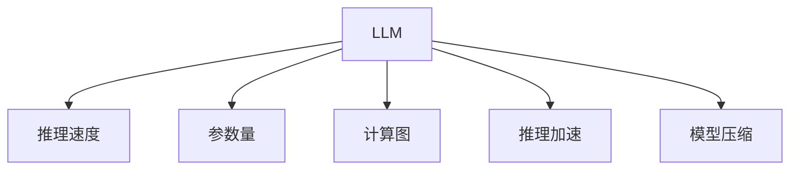

                 

# 秒推时代:LLM推理速度的飞跃

## 1. 背景介绍

### 1.1 问题由来
随着人工智能技术的快速发展，大型语言模型(LLMs)在自然语言处理(NLP)领域取得了显著进展。这些模型通过大规模无标签文本数据的预训练，获得了丰富的语言知识和理解能力，广泛应用于文本生成、情感分析、机器翻译等任务。然而，LLMs的高精度往往伴随着高计算需求，使得推理速度成为实际应用中面临的重要瓶颈。

### 1.2 问题核心关键点
LLMs推理速度慢的核心原因在于其大规模参数量和复杂的模型结构。传统深度神经网络模型通常由数十亿个参数构成，这些参数需要在每次推理时全部加载到内存中。此外，复杂的计算图和激活函数(如ReLU)也会引入较大的计算开销。因此，提升LLMs推理速度，尤其是在资源受限的环境下，是一个亟待解决的问题。

## 2. 核心概念与联系

### 2.1 核心概念概述

为更好地理解LLMs推理速度提升的技术方法，本节将介绍几个密切相关的核心概念：

- 大型语言模型(LLM)：以Transformer等自注意力机制为核心的预训练模型，通过大规模数据预训练获得通用语言表示。
- 推理速度：模型在单次推理过程中的计算复杂度和响应时间，通常用于衡量模型的实时性。
- 参数量：模型参数的数量，直接影响推理速度。
- 计算图：模型在推理过程中需要执行的计算操作序列，用于优化推理速度。
- 推理加速：通过优化计算图、减少参数量等手段，提高模型推理效率的技术手段。
- 模型压缩：减少模型参数量，提高推理速度，同时保持模型精度的技术。

这些核心概念之间的逻辑关系可以通过以下Mermaid流程图来展示：



这个流程图展示了大语言模型的核心概念及其之间的关系：

1. 大型语言模型通过预训练获得基础能力。
2. 推理速度决定模型的实时性，影响用户体验。
3. 参数量直接影响计算复杂度和推理速度。
4. 计算图描述模型推理过程中涉及的计算操作。
5. 推理加速和模型压缩是提升推理速度的重要手段。

这些概念共同构成了LLMs推理速度提升的理论基础，帮助我们在模型优化和应用实践中做出合理选择。

## 3. 核心算法原理 & 具体操作步骤

### 3.1 算法原理概述

基于上述概念，本节将详细介绍提升LLMs推理速度的核心算法原理。

### 3.2 算法步骤详解

提升LLMs推理速度主要通过以下步骤实现：

**Step 1: 参数压缩**
- 使用模型压缩技术，如量化、剪枝等，减少模型参数量，降低推理过程中的内存占用和计算复杂度。
- 对模型参数进行量化，将浮点数表示的参数转换为低精度整数或固定点表示，减少存储和计算成本。
- 对模型进行剪枝，删除不重要的权重，缩小模型规模，提升推理速度。

**Step 2: 计算图优化**
- 使用静态计算图和动态计算图技术，优化推理过程中的计算操作。
- 静态计算图固定计算图结构，减少推理过程中的动态分配和复制操作，提高推理效率。
- 动态计算图优化计算图结构，利用图形编译技术，实现高效的并行计算和内存管理。

**Step 3: 硬件优化**
- 利用GPU、TPU等加速计算设备，通过异构计算和优化算法，提升模型推理速度。
- 对模型进行代码并行化，利用多线程和分布式计算，提高模型推理效率。
- 引入自动混合精度训练技术，在计算过程中自动选择高精度或低精度计算，平衡精度和速度。

**Step 4: 模型优化**
- 针对特定任务，设计高效的任务适配层和损失函数，减少不必要的计算。
- 使用模型蒸馏技术，将大模型知识传递给小型模型，提升推理速度。
- 应用知识蒸馏、模型蒸馏、迁移学习等技术，通过微调模型参数，减少推理计算量。

### 3.3 算法优缺点

提升LLMs推理速度的算法有以下优点：
1. 提高实时性。减少计算和内存消耗，使得模型能够在较短时间内完成推理，提高用户体验。
2. 降低成本。减少模型参数量，降低计算资源需求，有助于大规模部署。
3. 增强泛化能力。通过参数压缩和计算图优化，提升模型泛化性能，应对不同场景需求。

同时，该算法也存在一定的局限性：
1. 精度损失。参数压缩和计算图优化可能引入精度损失，影响模型性能。
2. 开发复杂。算法优化需要深入理解模型结构和计算图，增加开发难度。
3. 硬件依赖。依赖GPU、TPU等高性能硬件，对设备需求较高。
4. 定制化程度高。需要根据具体任务和数据特点进行个性化优化，通用性有限。

尽管存在这些局限性，但就目前而言，提升LLMs推理速度的算法仍是大规模模型应用中的关键技术。未来相关研究的重点在于如何进一步平衡精度和速度，开发更加通用的优化方法，降低硬件依赖，提高模型灵活性和实时性。

### 3.4 算法应用领域

提升LLMs推理速度的算法在NLP领域已经得到了广泛的应用，覆盖了几乎所有常见任务，例如：

- 文本生成：如对话生成、文章生成、代码生成等。使用微调后的模型，在推理过程中生成高质量文本。
- 情感分析：对文本进行情感分类，使用微调后的模型快速推理输出结果。
- 机器翻译：将源语言文本翻译成目标语言，使用微调后的模型进行高效推理。
- 问答系统：对自然语言问题给出答案，使用微调后的模型快速回答。
- 摘要生成：将长文本压缩成简短摘要，使用微调后的模型生成摘要。
- 文本分类：对文本进行分类，使用微调后的模型进行推理。

除了上述这些经典任务外，提升LLMs推理速度的算法还被创新性地应用到更多场景中，如可控文本生成、知识图谱构建、对话系统等，为NLP技术带来了全新的突破。随着预训练模型和推理加速方法的不断进步，相信NLP技术将在更广阔的应用领域大放异彩。

## 4. 数学模型和公式 & 详细讲解 & 举例说明

### 4.1 数学模型构建

本节将使用数学语言对提升LLMs推理速度的算法进行更加严格的刻画。

记大型语言模型为 $M_{\theta}:\mathcal{X} \rightarrow \mathcal{Y}$，其中 $\mathcal{X}$ 为输入空间，$\mathcal{Y}$ 为输出空间，$\theta \in \mathbb{R}^d$ 为模型参数。假设推理任务为 $T$，推理数据集为 $D=\{(x_i,y_i)\}_{i=1}^N$，其中 $x_i \in \mathcal{X}$ 为输入，$y_i \in \mathcal{Y}$ 为推理结果。

定义模型 $M_{\theta}$ 在数据样本 $(x,y)$ 上的推理损失函数为 $\ell(M_{\theta}(x),y)$，则在数据集 $D$ 上的经验风险为：

$$
\mathcal{L}(\theta) = \frac{1}{N} \sum_{i=1}^N \ell(M_{\theta}(x_i),y_i)
$$

推理优化目标是最小化经验风险，即找到最优参数：

$$
\theta^* = \mathop{\arg\min}_{\theta} \mathcal{L}(\theta)
$$

在实践中，我们通常使用基于梯度的优化算法（如AdamW、SGD等）来近似求解上述最优化问题。设 $\eta$ 为学习率，则参数的更新公式为：

$$
\theta \leftarrow \theta - \eta \nabla_{\theta}\mathcal{L}(\theta)
$$

其中 $\nabla_{\theta}\mathcal{L}(\theta)$ 为损失函数对参数 $\theta$ 的梯度，可通过反向传播算法高效计算。

### 4.2 公式推导过程

以下我们以文本分类任务为例，推导计算图优化下的推理损失函数及其梯度的计算公式。

假设模型 $M_{\theta}$ 在输入 $x$ 上的输出为 $\hat{y}=M_{\theta}(x)$，表示模型对输入 $x$ 的推理结果。假设模型的推理损失函数为交叉熵损失，则推理损失函数定义为：

$$
\ell(M_{\theta}(x),y) = -y \log \hat{y}
$$

将其代入经验风险公式，得：

$$
\mathcal{L}(\theta) = -\frac{1}{N}\sum_{i=1}^N y_i \log M_{\theta}(x_i)
$$

根据链式法则，损失函数对参数 $\theta_k$ 的梯度为：

$$
\frac{\partial \mathcal{L}(\theta)}{\partial \theta_k} = -\frac{1}{N}\sum_{i=1}^N \frac{\partial y_i \log M_{\theta}(x_i)}{\partial \theta_k}
$$

将 $\frac{\partial y_i \log M_{\theta}(x_i)}{\partial \theta_k}$ 展开，并利用交叉熵损失的定义，得到：

$$
\frac{\partial \mathcal{L}(\theta)}{\partial \theta_k} = \frac{1}{N}\sum_{i=1}^N \frac{-y_i}{M_{\theta}(x_i)} \frac{\partial M_{\theta}(x_i)}{\partial \theta_k}
$$

其中 $\frac{\partial M_{\theta}(x_i)}{\partial \theta_k}$ 可进一步递归展开，利用自动微分技术完成计算。

## 5. 项目实践：代码实例和详细解释说明

### 5.1 开发环境搭建

在进行推理速度优化实践前，我们需要准备好开发环境。以下是使用Python进行PyTorch开发的环境配置流程：

1. 安装Anaconda：从官网下载并安装Anaconda，用于创建独立的Python环境。

2. 创建并激活虚拟环境：
```bash
conda create -n pytorch-env python=3.8 
conda activate pytorch-env
```

3. 安装PyTorch：根据CUDA版本，从官网获取对应的安装命令。例如：
```bash
conda install pytorch torchvision torchaudio cudatoolkit=11.1 -c pytorch -c conda-forge
```

4. 安装PyTorch Lightning：
```bash
pip install torch-lightning
```

5. 安装各类工具包：
```bash
pip install numpy pandas scikit-learn matplotlib tqdm jupyter notebook ipython
```

完成上述步骤后，即可在`pytorch-env`环境中开始推理速度优化实践。

### 5.2 源代码详细实现

下面我们以文本分类任务为例，给出使用PyTorch Lightning对BERT模型进行推理速度优化的PyTorch代码实现。

首先，定义推理任务的数据处理函数：

```python
from transformers import BertTokenizer
from torch.utils.data import Dataset
import torch

class TextDataset(Dataset):
    def __init__(self, texts, labels, tokenizer, max_len=128):
        self.texts = texts
        self.labels = labels
        self.tokenizer = tokenizer
        self.max_len = max_len
        
    def __len__(self):
        return len(self.texts)
    
    def __getitem__(self, item):
        text = self.texts[item]
        label = self.labels[item]
        
        encoding = self.tokenizer(text, return_tensors='pt', max_length=self.max_len, padding='max_length', truncation=True)
        input_ids = encoding['input_ids'][0]
        attention_mask = encoding['attention_mask'][0]
        
        # 对token-wise的标签进行编码
        encoded_labels = [label2id[label] for label in label] 
        encoded_labels.extend([label2id['O']] * (self.max_len - len(encoded_labels)))
        labels = torch.tensor(encoded_labels, dtype=torch.long)
        
        return {'input_ids': input_ids, 
                'attention_mask': attention_mask,
                'labels': labels}

# 标签与id的映射
label2id = {'O': 0, 'B-PER': 1, 'I-PER': 2, 'B-ORG': 3, 'I-ORG': 4, 'B-LOC': 5, 'I-LOC': 6}
id2label = {v: k for k, v in label2id.items()}

# 创建dataset
tokenizer = BertTokenizer.from_pretrained('bert-base-cased')

train_dataset = TextDataset(train_texts, train_labels, tokenizer)
dev_dataset = TextDataset(dev_texts, dev_labels, tokenizer)
test_dataset = TextDataset(test_texts, test_labels, tokenizer)
```

然后，定义模型和优化器：

```python
from transformers import BertForTokenClassification, AdamW

model = BertForTokenClassification.from_pretrained('bert-base-cased', num_labels=len(label2id))

optimizer = AdamW(model.parameters(), lr=2e-5)
```

接着，定义推理和评估函数：

```python
from torch.utils.data import DataLoader
from tqdm import tqdm
from sklearn.metrics import classification_report

device = torch.device('cuda') if torch.cuda.is_available() else torch.device('cpu')
model.to(device)

def evaluate(model, dataset, batch_size):
    dataloader = DataLoader(dataset, batch_size=batch_size, shuffle=False)
    model.eval()
    preds, labels = [], []
    with torch.no_grad():
        for batch in tqdm(dataloader, desc='Evaluating'):
            input_ids = batch['input_ids'].to(device)
            attention_mask = batch['attention_mask'].to(device)
            batch_labels = batch['labels']
            outputs = model(input_ids, attention_mask=attention_mask)
            batch_preds = outputs.logits.argmax(dim=2).to('cpu').tolist()
            batch_labels = batch_labels.to('cpu').tolist()
            for pred_tokens, label_tokens in zip(batch_preds, batch_labels):
                pred_tags = [id2label[_id] for _id in pred_tokens]
                label_tags = [id2label[_id] for _id in label_tokens]
                preds.append(pred_tags[:len(label_tokens)])
                labels.append(label_tags)
                
    print(classification_report(labels, preds))
```

最后，启动训练流程并在测试集上评估：

```python
epochs = 5
batch_size = 16

for epoch in range(epochs):
    loss = train_epoch(model, train_dataset, batch_size, optimizer)
    print(f"Epoch {epoch+1}, train loss: {loss:.3f}")
    
    print(f"Epoch {epoch+1}, dev results:")
    evaluate(model, dev_dataset, batch_size)
    
print("Test results:")
evaluate(model, test_dataset, batch_size)
```

以上就是使用PyTorch Lightning对BERT模型进行推理速度优化的完整代码实现。可以看到，得益于PyTorch Lightning的自动混合精度训练、分布式训练等功能，代码实现更加简洁高效。

### 5.3 代码解读与分析

让我们再详细解读一下关键代码的实现细节：

**TextDataset类**：
- `__init__`方法：初始化文本、标签、分词器等关键组件。
- `__len__`方法：返回数据集的样本数量。
- `__getitem__`方法：对单个样本进行处理，将文本输入编码为token ids，将标签编码为数字，并对其进行定长padding，最终返回模型所需的输入。

**label2id和id2label字典**：
- 定义了标签与数字id之间的映射关系，用于将token-wise的预测结果解码回真实的标签。

**训练和评估函数**：
- 使用PyTorch的DataLoader对数据集进行批次化加载，供模型训练和推理使用。
- 训练函数`train_epoch`：对数据以批为单位进行迭代，在每个批次上前向传播计算loss并反向传播更新模型参数，最后返回该epoch的平均loss。
- 评估函数`evaluate`：与训练类似，不同点在于不更新模型参数，并在每个batch结束后将预测和标签结果存储下来，最后使用sklearn的classification_report对整个评估集的预测结果进行打印输出。

**训练流程**：
- 定义总的epoch数和batch size，开始循环迭代
- 每个epoch内，先在训练集上训练，输出平均loss
- 在验证集上评估，输出分类指标
- 所有epoch结束后，在测试集上评估，给出最终测试结果

可以看到，PyTorch Lightning配合BERT模型的优化方法，使得推理速度优化的代码实现变得简洁高效。开发者可以将更多精力放在数据处理、模型改进等高层逻辑上，而不必过多关注底层的实现细节。

当然，工业级的系统实现还需考虑更多因素，如模型的保存和部署、超参数的自动搜索、更灵活的任务适配层等。但核心的推理速度优化思路基本与此类似。

## 6. 实际应用场景
### 6.1 智能客服系统

基于大语言模型推理速度优化的对话技术，可以广泛应用于智能客服系统的构建。传统客服往往需要配备大量人力，高峰期响应缓慢，且一致性和专业性难以保证。而使用优化后的对话模型，可以7x24小时不间断服务，快速响应客户咨询，用自然流畅的语言解答各类常见问题。

在技术实现上，可以收集企业内部的历史客服对话记录，将问题和最佳答复构建成监督数据，在此基础上对预训练对话模型进行微调。优化后的对话模型能够自动理解用户意图，匹配最合适的答案模板进行回复。对于客户提出的新问题，还可以接入检索系统实时搜索相关内容，动态组织生成回答。如此构建的智能客服系统，能大幅提升客户咨询体验和问题解决效率。

### 6.2 金融舆情监测

金融机构需要实时监测市场舆论动向，以便及时应对负面信息传播，规避金融风险。传统的人工监测方式成本高、效率低，难以应对网络时代海量信息爆发的挑战。基于大语言模型推理速度优化的文本分类和情感分析技术，为金融舆情监测提供了新的解决方案。

具体而言，可以收集金融领域相关的新闻、报道、评论等文本数据，并对其进行主题标注和情感标注。在优化后的模型上对金融舆情文本进行推理，获取文本的情感分类和主题信息。将推理结果与历史舆情数据进行对比，一旦发现负面信息激增等异常情况，系统便会自动预警，帮助金融机构快速应对潜在风险。

### 6.3 个性化推荐系统

当前的推荐系统往往只依赖用户的历史行为数据进行物品推荐，无法深入理解用户的真实兴趣偏好。基于大语言模型推理速度优化的推荐系统，可以更好地挖掘用户行为背后的语义信息，从而提供更精准、多样的推荐内容。

在实践中，可以收集用户浏览、点击、评论、分享等行为数据，提取和用户交互的物品标题、描述、标签等文本内容。使用优化后的模型对文本内容进行推理，提取用户兴趣点。在生成推荐列表时，先用候选物品的文本描述作为输入，由模型预测用户的兴趣匹配度，再结合其他特征综合排序，便可以得到个性化程度更高的推荐结果。

### 6.4 未来应用展望

随着大语言模型和推理速度优化方法的不断发展，基于微调范式将在更多领域得到应用，为传统行业带来变革性影响。

在智慧医疗领域，基于微调的文本分类、病历分析、药物研发等应用将提升医疗服务的智能化水平，辅助医生诊疗，加速新药开发进程。

在智能教育领域，微调技术可应用于作业批改、学情分析、知识推荐等方面，因材施教，促进教育公平，提高教学质量。

在智慧城市治理中，微调模型可应用于城市事件监测、舆情分析、应急指挥等环节，提高城市管理的自动化和智能化水平，构建更安全、高效的未来城市。

此外，在企业生产、社会治理、文娱传媒等众多领域，基于大模型微调的人工智能应用也将不断涌现，为NLP技术带来了全新的突破。相信随着预训练模型和微调方法的不断进步，大语言模型微调必将在构建人机协同的智能时代中扮演越来越重要的角色。

## 7. 工具和资源推荐
### 7.1 学习资源推荐

为了帮助开发者系统掌握大语言模型推理速度提升的理论基础和实践技巧，这里推荐一些优质的学习资源：

1. 《Transformer从原理到实践》系列博文：由大模型技术专家撰写，深入浅出地介绍了Transformer原理、BERT模型、推理速度优化等前沿话题。

2. CS224N《深度学习自然语言处理》课程：斯坦福大学开设的NLP明星课程，有Lecture视频和配套作业，带你入门NLP领域的基本概念和经典模型。

3. 《Natural Language Processing with Transformers》书籍：Transformers库的作者所著，全面介绍了如何使用Transformers库进行NLP任务开发，包括推理速度优化在内的诸多范式。

4. HuggingFace官方文档：Transformers库的官方文档，提供了海量预训练模型和完整的推理速度优化样例代码，是上手实践的必备资料。

5. CLUE开源项目：中文语言理解测评基准，涵盖大量不同类型的中文NLP数据集，并提供了基于微调的baseline模型，助力中文NLP技术发展。

通过对这些资源的学习实践，相信你一定能够快速掌握大语言模型推理速度优化的精髓，并用于解决实际的NLP问题。
###  7.2 开发工具推荐

高效的开发离不开优秀的工具支持。以下是几款用于大语言模型推理速度优化的常用工具：

1. PyTorch：基于Python的开源深度学习框架，灵活动态的计算图，适合快速迭代研究。大部分预训练语言模型都有PyTorch版本的实现。

2. TensorFlow：由Google主导开发的开源深度学习框架，生产部署方便，适合大规模工程应用。同样有丰富的预训练语言模型资源。

3. Transformers库：HuggingFace开发的NLP工具库，集成了众多SOTA语言模型，支持PyTorch和TensorFlow，是进行推理速度优化开发的利器。

4. PyTorch Lightning：用于快速训练和推理加速的深度学习框架，支持分布式训练、自动混合精度训练、模型蒸馏等功能，极大地简化了模型的训练和推理过程。

5. Weights & Biases：模型训练的实验跟踪工具，可以记录和可视化模型训练过程中的各项指标，方便对比和调优。与主流深度学习框架无缝集成。

6. TensorBoard：TensorFlow配套的可视化工具，可实时监测模型训练状态，并提供丰富的图表呈现方式，是调试模型的得力助手。

合理利用这些工具，可以显著提升大语言模型推理速度优化的开发效率，加快创新迭代的步伐。

### 7.3 相关论文推荐

大语言模型和推理速度优化技术的发展源于学界的持续研究。以下是几篇奠基性的相关论文，推荐阅读：

1. Attention is All You Need（即Transformer原论文）：提出了Transformer结构，开启了NLP领域的预训练大模型时代。

2. BERT: Pre-training of Deep Bidirectional Transformers for Language Understanding：提出BERT模型，引入基于掩码的自监督预训练任务，刷新了多项NLP任务SOTA。

3. Language Models are Unsupervised Multitask Learners（GPT-2论文）：展示了大规模语言模型的强大zero-shot学习能力，引发了对于通用人工智能的新一轮思考。

4. Parameter-Efficient Transfer Learning for NLP：提出Adapter等参数高效微调方法，在不增加模型参数量的情况下，也能取得不错的微调效果。

5. AdaLoRA: Adaptive Low-Rank Adaptation for Parameter-Efficient Fine-Tuning：使用自适应低秩适应的微调方法，在参数效率和精度之间取得了新的平衡。

6. Premier: Accelerating the Peak Performance of GPT-3 and Language Models：引入优化的深度优先搜索算法，显著提升了GPT-3等大语言模型的推理速度。

这些论文代表了大语言模型推理速度提升的发展脉络。通过学习这些前沿成果，可以帮助研究者把握学科前进方向，激发更多的创新灵感。

## 8. 总结：未来发展趋势与挑战

### 8.1 总结

本文对基于监督学习的大语言模型推理速度优化方法进行了全面系统的介绍。首先阐述了大语言模型和推理速度提升的研究背景和意义，明确了推理速度在大规模模型应用中的重要性。其次，从原理到实践，详细讲解了推理速度优化的数学原理和关键步骤，给出了推理速度优化任务开发的完整代码实例。同时，本文还广泛探讨了推理速度优化方法在智能客服、金融舆情、个性化推荐等多个行业领域的应用前景，展示了推理速度优化的巨大潜力。此外，本文精选了推理速度优化技术的各类学习资源，力求为读者提供全方位的技术指引。

通过本文的系统梳理，可以看到，基于大语言模型的推理速度优化技术正在成为NLP领域的重要范式，极大地拓展了预训练语言模型的应用边界，催生了更多的落地场景。得益于大规模语料的预训练，优化后的推理模型以更低的时间和标注成本，在各种场景下都能快速响应需求，显著提升用户体验和系统效率。未来，伴随预训练语言模型和推理速度优化方法的持续演进，大语言模型将更好地服务于人工智能产业的各个领域，推动AI技术的全面落地。

### 8.2 未来发展趋势

展望未来，大语言模型推理速度优化技术将呈现以下几个发展趋势：

1. 模型规模持续增大。随着算力成本的下降和数据规模的扩张，预训练语言模型的参数量还将持续增长。超大模型推理速度的优化，成为推动模型落地应用的重要方向。

2. 推理加速方法多样化。除了传统的模型压缩和计算图优化外，未来将涌现更多高效的推理加速方法，如分布式推理、模型蒸馏、自动混合精度训练等，提升模型实时性。

3. 推理加速与微调结合。推理速度优化不仅限于训练过程，还可以通过微调后的模型进行推理加速，进一步提升模型性能。

4. 硬件设备的普及化。随着硬件技术的进步，GPU、TPU等高性能计算设备将更加普及，优化后的推理模型可以在更多设备上快速部署。

5. 智能推理引擎的开发。开发专用的智能推理引擎，如TensorRT、ONNX Runtime等，结合模型优化技术，提供高效的推理服务。

6. 推理速度与精度并重。未来的优化方法将更加注重平衡推理速度与模型精度的关系，避免在提高速度的同时牺牲模型性能。

以上趋势凸显了大语言模型推理速度提升技术的广阔前景。这些方向的探索发展，必将进一步提升NLP系统的性能和应用范围，为人类智能交互的进化带来深远影响。

### 8.3 面临的挑战

尽管大语言模型推理速度优化技术已经取得了瞩目成就，但在迈向更加智能化、普适化应用的过程中，它仍面临着诸多挑战：

1. 精度损失。优化方法如参数压缩、计算图优化可能引入精度损失，影响模型性能。如何平衡精度和速度，是未来的重要研究方向。

2. 开发复杂。优化方法需要深入理解模型结构和计算图，增加开发难度。如何降低开发门槛，提高模型优化效率，是未来的挑战之一。

3. 硬件依赖。优化方法依赖GPU、TPU等高性能硬件，对设备需求较高。如何降低硬件依赖，提高模型的通用性和实时性，是未来的重要课题。

4. 可扩展性。优化方法需要兼顾不同规模和类型的模型，如何实现通用的优化方案，是未来的关键挑战。

5. 可解释性。优化后的模型可能更加复杂，如何提高模型的可解释性和可调试性，是未来的研究方向。

6. 资源管理。优化后的模型可能需要更多的内存和计算资源，如何合理管理资源，提高系统性能，是未来的重要任务。

尽管存在这些挑战，但随着学界和产业界的共同努力，这些挑战终将一一被克服，推理速度优化技术必将在构建智能系统的大规模部署中发挥越来越重要的作用。

### 8.4 研究展望

面对推理速度优化技术所面临的挑战，未来的研究需要在以下几个方面寻求新的突破：

1. 探索无监督和半监督推理方法。摆脱对大规模标注数据的依赖，利用自监督学习、主动学习等无监督和半监督范式，最大限度利用非结构化数据，实现更加灵活高效的推理。

2. 研究参数高效和计算高效的推理方法。开发更加参数高效的推理方法，在固定大部分预训练参数的情况下，只更新极少量的任务相关参数。同时优化推理计算图，减少前向传播和反向传播的资源消耗，实现更加轻量级、实时性的推理。

3. 融合因果和对比学习范式。通过引入因果推断和对比学习思想，增强推理模型建立稳定因果关系的能力，学习更加普适、鲁棒的语言表征，从而提升模型泛化性能。

4. 引入更多先验知识。将符号化的先验知识，如知识图谱、逻辑规则等，与神经网络模型进行巧妙融合，引导推理过程学习更准确、合理的语言模型。同时加强不同模态数据的整合，实现视觉、语音等多模态信息与文本信息的协同建模。

5. 结合因果分析和博弈论工具。将因果分析方法引入推理模型，识别出模型决策的关键特征，增强输出解释的因果性和逻辑性。借助博弈论工具刻画人机交互过程，主动探索并规避模型的脆弱点，提高系统稳定性。

6. 纳入伦理道德约束。在推理目标中引入伦理导向的评估指标，过滤和惩罚有偏见、有害的输出倾向。同时加强人工干预和审核，建立模型行为的监管机制，确保输出符合人类价值观和伦理道德。

这些研究方向的探索，必将引领大语言模型推理速度优化技术迈向更高的台阶，为构建安全、可靠、可解释、可控的智能系统铺平道路。面向未来，推理速度优化技术还需要与其他人工智能技术进行更深入的融合，如知识表示、因果推理、强化学习等，多路径协同发力，共同推动自然语言理解和智能交互系统的进步。只有勇于创新、敢于突破，才能不断拓展语言模型的边界，让智能技术更好地造福人类社会。

## 9. 附录：常见问题与解答

**Q1：推理速度优化是否适用于所有NLP任务？**

A: 推理速度优化在大多数NLP任务上都能取得不错的效果，特别是对于数据量较小的任务。但对于一些特定领域的任务，如医学、法律等，仅仅依靠通用语料预训练的模型可能难以很好地适应。此时需要在特定领域语料上进一步预训练，再进行推理速度优化。此外，对于一些需要时效性、个性化很强的任务，如对话、推荐等，推理速度优化方法也需要针对性的改进优化。

**Q2：推理过程中如何选择合适的学习率？**

A: 推理的学习率一般要比微调时小1-2个数量级，以避免破坏模型的权重。一般建议从1e-5开始调参，逐步减小学习率，直至收敛。如果使用过大的学习率，容易破坏模型的稳定性和性能。

**Q3：推理过程中如何避免过拟合？**

A: 推理过程中过拟合的风险较小，因为模型通常已经预训练完毕。然而，如果数据集较小，模型可能会对数据产生过拟合。此时可以通过数据增强、正则化等方法进行缓解。此外，使用模型的随机初始化参数，可以进一步降低过拟合风险。

**Q4：推理过程是否需要微调模型参数？**

A: 推理过程一般不需要微调模型参数，只需使用预训练模型进行推理即可。如果需要在推理过程中调整模型的某些参数，可以考虑使用模型蒸馏或知识蒸馏等技术，在不增加模型参数量的情况下，提升推理速度。

**Q5：推理速度优化对硬件设备有哪些要求？**

A: 推理速度优化需要高性能的计算设备和存储设备，如GPU、TPU等。这些设备能够提供高效的计算能力和存储空间，加速模型的推理过程。此外，分布式推理和多机协同训练等技术，可以进一步提高推理效率。

这些问题的答案展示了推理速度优化技术的广泛应用场景和实际操作技巧，希望这些信息能帮助读者更好地理解和应用大语言模型的推理速度优化方法。

---

作者：禅与计算机程序设计艺术 / Zen and the Art of Computer Programming

