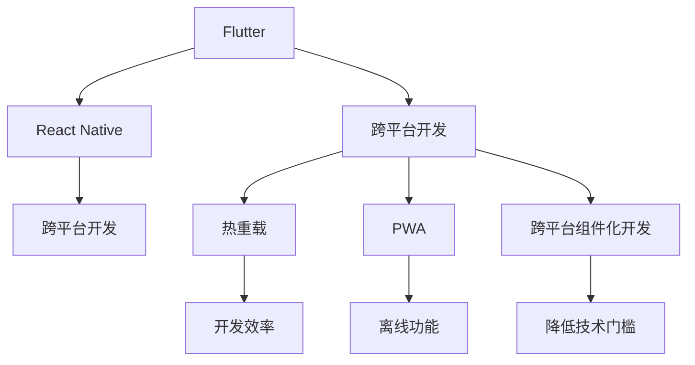

                 

# 移动端全栈开发：iOS和Android平台的统一解决方案

移动端全栈开发（Full-stack Mobile Development）是结合前端与后端技能，实现移动应用的高效开发、测试与部署。本文将深入探讨iOS和Android平台的统一解决方案，涵盖前端技术栈、后端服务架构、跨平台开发工具等方面的详细分析与实例应用。

## 1. 背景介绍

### 1.1 问题由来
随着智能手机普及率的不断提升，移动应用市场的竞争也日益激烈。传统的移动应用开发流程繁琐、周期长，且跨平台兼容性能较差，无法满足企业快速迭代、全球化部署的需求。如何提高开发效率、降低开发成本，同时保证应用性能与用户体验，成为当前移动应用开发领域的重要议题。

### 1.2 问题核心关键点
iOS和Android平台由于其不同的操作系统、API接口、开发工具等特点，使得跨平台开发具有较大挑战。但是，随着Flutter、React Native等跨平台开发工具的成熟，开发人员可以在统一的开发框架下实现跨平台应用。

### 1.3 问题研究意义
开发统一的iOS和Android应用，可有效缩短开发周期，降低成本，提升应用兼容性和性能。同时，借助跨平台开发工具，实现统一技术栈，可大大提高开发效率和代码复用率，优化开发流程。对于企业来说，构建统一的移动开发平台，还能加快市场响应速度，提升品牌竞争力。

## 2. 核心概念与联系

### 2.1 核心概念概述

为更好地理解iOS和Android平台下的统一解决方案，本节将介绍几个密切相关的核心概念：

- **Flutter**：谷歌推出的开源跨平台移动应用开发框架，使用Dart语言开发，支持热重载与性能优化。Flutter提供了一套统一的组件库和UI设计语言，可跨平台运行。
- **React Native**：Facebook推出的开源框架，使用JavaScript和React构建跨平台移动应用。React Native提供了大量原生API，支持原生组件与样式设计，性能与原生应用相当。
- **跨平台开发**：在统一的开发框架下，开发不同平台上的移动应用，以提高开发效率和应用兼容性。跨平台开发技术主要有Flutter、React Native、Xamarin等。
- **热重载（Hot Reload）**：开发过程中在不重启应用的情况下，动态更新代码并立即生效。热重载技术可大幅提高开发效率，减少测试与调试时间。
- **渐进式Web应用（PWA）**：采用Web技术开发的移动应用，具备Web应用和原生应用的特性，能在多个平台和设备上运行。PWA通过Service Worker和Cache API实现离线功能，提升用户体验。
- **跨平台组件化开发**：将不同平台上的组件封装为统一的API接口，使得开发者只需关注业务逻辑，无需了解底层平台差异。跨平台组件化开发可以降低技术门槛，提升开发效率。

这些核心概念之间的逻辑关系可以通过以下Mermaid流程图来展示：



这个流程图展示了一些核心概念之间的关系：

1. Flutter和React Native是两种主流的跨平台开发框架，可以实现跨平台应用开发。
2. 热重载、PWA和跨平台组件化开发都是跨平台开发过程中常用的技术手段。
3. 这些技术手段共同作用，提高开发效率、提升应用性能和用户体验，降低开发成本和复杂度。

## 3. 核心算法原理 & 具体操作步骤

### 3.1 算法原理概述

iOS和Android平台统一解决方案的核心在于如何将前端与后端技术融合，构建一致的用户体验与性能。本文将从前端和后端两个角度来介绍相关算法原理。

#### 前端算法原理

前端算法原理主要包括用户界面设计、组件化开发、样式和布局优化等。以下以Flutter和React Native为例，介绍相关算法原理：

- **组件化开发**：组件是前端开发的基础单位，通过组件化开发可以将不同的功能模块抽象为独立的组件。在Flutter中，组件可以通过Dart语言编写，支持热重载和组件通信。在React Native中，组件可以通过JavaScript编写，支持原生组件与样式设计。
- **样式与布局优化**：不同的平台有不同的UI设计语言和布局规则，需要通过样式和布局优化来提升应用性能和用户体验。Flutter通过Material Design和Cupertino Design提供统一的UI设计语言，React Native则通过Flexbox和Absolute布局实现灵活的布局设计。
- **跨平台样式注入**：在Flutter和React Native中，开发者可以通过跨平台样式注入技术，实现统一的平台样式管理。通过样式注入，开发者可以在一个地方定义样式，并自动应用到不同平台，大大简化样式维护。

#### 后端算法原理

后端算法原理主要包括服务架构设计、数据处理和数据库优化等。以下以RESTful API和GraphQL为例，介绍相关算法原理：

- **RESTful API设计**：RESTful API提供了一种基于标准的Web服务设计方式，适合跨平台访问和数据交互。RESTful API的设计原则包括资源导向、无状态和统一接口。
- **GraphQL**：GraphQL是一种基于图数据库的查询语言，支持动态数据查询和分页。通过GraphQL，前端开发者可以实时获取所需数据，避免不必要的数据传输，提高应用性能。

### 3.2 算法步骤详解

#### 前端开发步骤

1. **选择合适的跨平台框架**：根据应用需求选择合适的跨平台框架，如Flutter、React Native等。
2. **设计UI界面**：使用平台特定的设计工具，如Sketch、Adobe XD等，设计应用界面。
3. **实现组件化开发**：根据UI设计，编写前端组件，支持热重载与样式注入。
4. **测试与优化**：在真实环境中测试应用性能，并进行优化。

#### 后端开发步骤

1. **设计服务架构**：根据应用需求，设计RESTful API或GraphQL服务架构。
2. **实现数据处理**：使用Node.js、Java等语言实现后端服务，处理数据存储和传输。
3. **优化数据库**：选择合适的数据库，优化数据库性能和安全性。
4. **测试与部署**：在真实环境中测试后端服务性能，并进行部署。

### 3.3 算法优缺点

#### 前端开发优缺点

- **优点**：
  - 开发效率高：跨平台开发框架提供统一的界面设计和组件库，开发效率大幅提升。
  - 跨平台兼容性好：前端框架支持跨平台运行，应用兼容性更好。
  - 样式和布局统一：通过样式注入和统一的设计语言，前端样式和布局更加一致。

- **缺点**：
  - 性能问题：跨平台应用在一些原生功能上可能存在性能问题。
  - 学习成本高：跨平台开发需要掌握多种前端语言和框架，学习成本较高。

#### 后端开发优缺点

- **优点**：
  - 数据交互灵活：RESTful API和GraphQL支持动态数据查询和分页，数据交互更加灵活。
  - 可扩展性好：服务架构设计灵活，可扩展性强。
  - 安全性高：后端服务通过API网关和身份验证，安全性更高。

- **缺点**：
  - 性能开销大：API网关和数据处理增加了性能开销。
  - 调试复杂：后端服务需要调试数据处理和API网关，调试复杂度较高。

### 3.4 算法应用领域

基于前端和后端统一解决方案的算法原理，iOS和Android平台的统一解决方案在多个领域得到了广泛应用：

- **企业内部应用**：如内部协同平台、客户管理系统、财务系统等，实现统一技术栈和高效开发。
- **电商平台**：如淘宝、京东等电商平台的移动应用，支持多平台兼容和快速迭代。
- **在线教育**：如Coursera、Udacity等在线教育平台的移动应用，支持多平台和离线功能。
- **健康医疗**：如丁香园、春雨医生等健康医疗平台的移动应用，支持跨平台和数据安全。
- **金融服务**：如支付宝、微信支付等金融服务的移动应用，支持多平台和数据安全。

这些应用场景展示了iOS和Android平台统一解决方案的广泛适用性和高效性能。

## 4. 数学模型和公式 & 详细讲解 & 举例说明

### 4.1 数学模型构建

在iOS和Android平台的统一解决方案中，数学模型和公式主要应用于后端服务架构的设计和数据处理。

#### 4.1.1 RESTful API设计

RESTful API的设计可以通过以下数学模型来描述：

$$
API = \{ /resource, /resource/{id}, /resource/{id}/method \}
$$

其中，`/resource`代表资源的集合，`/resource/{id}`代表资源的详情，`/resource/{id}/method`代表资源的某个操作。RESTful API的设计原则包括：

- 资源导向：每个API请求对应一个资源。
- 无状态：API请求不依赖于前后请求的状态。
- 统一接口：所有API请求使用相同的HTTP方法（GET、POST、PUT、DELETE等）和状态码。

#### 4.1.2 GraphQL设计

GraphQL的设计可以通过以下数学模型来描述：

$$
GraphQL = \{ Query, Mutation, Schema, Resolver \}
$$

其中，`Query`和`Mutation`分别代表查询和修改操作，`Schema`代表数据类型定义，`Resolver`代表数据处理逻辑。GraphQL的设计原则包括：

- 数据动态查询：通过Query和Mutation操作，动态获取所需数据。
- 分页支持：通过限制数据量和分页方式，优化数据传输。

### 4.2 公式推导过程

#### 4.2.1 RESTful API推导

以RESTful API为例，我们推导API请求的数学公式：

$$
API_{id} = \{ GET, PUT, POST, DELETE \} /resource/{id}/method
$$

其中，`id`代表资源ID，`method`代表操作类型。API请求的数学公式可以通过以下步骤推导：

1. 定义API资源集合：`/resource`。
2. 定义API资源详情：`/resource/{id}`。
3. 定义API操作类型：`/method`。
4. 将API资源、详情和操作类型组合，形成完整的API请求。

#### 4.2.2 GraphQL推导

以GraphQL为例，我们推导GraphQL查询的数学公式：

$$
GraphQL_{query} = Query \{ field_1, field_2, field_3 \}
$$

其中，`field_1`、`field_2`、`field_3`代表查询字段。GraphQL查询的数学公式可以通过以下步骤推导：

1. 定义GraphQL查询操作：`Query`。
2. 定义GraphQL查询字段：`field_1`、`field_2`、`field_3`。
3. 将查询操作和字段组合，形成完整的GraphQL查询。

### 4.3 案例分析与讲解

#### 4.3.1 RESTful API案例

以电商平台API为例，我们分析RESTful API的数学公式：

- 用户登录：`GET /api/login`
- 商品详情：`GET /api/product/{id}`
- 订单提交：`POST /api/order`

以上API请求满足RESTful API的设计原则，通过统一的HTTP方法和资源ID，实现高效的数据交互。

#### 4.3.2 GraphQL案例

以在线教育API为例，我们分析GraphQL查询的数学公式：

- 获取课程列表：`Query { courses { id, title, description } }`
- 获取课程详情：`Query { course(id: 1) { title, description, topics } }`
- 修改课程信息：`Mutation { updateCourse(id: 1, title: "New Course", description: "New description") }`

以上GraphQL查询满足数据动态查询和分页支持的设计原则，通过动态查询和数据分页，优化数据传输，提升应用性能。

## 5. 项目实践：代码实例和详细解释说明

### 5.1 开发环境搭建

进行iOS和Android平台统一解决方案的项目实践，需要搭建相应的开发环境。以下是开发环境的搭建步骤：

1. **安装Android Studio**：从官网下载安装Android Studio，并配置SDK和AVD。
2. **安装Flutter**：从官网下载安装Flutter SDK，并配置Flutter环境变量。
3. **安装Node.js和React Native CLI**：使用npm全局安装React Native CLI，并配置相关环境变量。
4. **配置iOS开发环境**：使用Xcode安装iOS SDK，并配置模拟器和调试工具。

完成以上步骤后，即可在搭建的开发环境中进行iOS和Android平台的统一开发实践。

### 5.2 源代码详细实现

#### 5.2.1 Flutter项目实现

以Flutter开发电商平台为例，我们详细介绍项目实现过程：

```dart
import 'package:flutter/material.dart';

class HomePage extends StatelessWidget {
  @override
  Widget build(BuildContext context) {
    return Scaffold(
      appBar: AppBar(title: Text('E-commerce App')),
      body: Center(child: Text('Welcome to the E-commerce App')),
    );
  }
}

void main() {
  runApp(HomePage());
}
```

以上代码实现了Flutter项目的首页布局，通过Material Design和Cupertino Design提供统一的UI设计语言，支持热重载与样式注入。

#### 5.2.2 React Native项目实现

以React Native开发在线教育平台为例，我们详细介绍项目实现过程：

```javascript
import React, { Component } from 'react';
import { StyleSheet, Text, View } from 'react-native';

export default class App extends Component {
  render() {
    return (
      <View style={styles.container}>
        <Text style={styles.welcome}>Welcome to the Online Education App</Text>
      </View>
    );
  }
}

const styles = StyleSheet.create({
  container: {
    flex: 1,
    backgroundColor: '#fff',
    alignItems: 'center',
    justifyContent: 'center',
  },
  welcome: {
    fontSize: 20,
    textAlign: 'center',
    margin: 10,
  },
});
```

以上代码实现了React Native项目的首页布局，通过Flexbox和Absolute布局实现灵活的布局设计，支持原生组件与样式设计。

### 5.3 代码解读与分析

#### 5.3.1 Flutter代码解读

- **Material Design和Cupertino Design**：Flutter提供两种统一的UI设计语言，开发者可以通过主题样式来切换不同的设计风格。
- **热重载与样式注入**：Flutter支持热重载，可以在不重启应用的情况下，动态更新代码并立即生效。开发者可以通过样式注入技术，实现统一的平台样式管理，简化样式维护。

#### 5.3.2 React Native代码解读

- **Flexbox和Absolute布局**：React Native通过Flexbox和Absolute布局实现灵活的布局设计，支持原生组件与样式设计。开发者可以通过原生API实现复杂的页面结构。
- **组件化开发**：React Native支持组件化开发，开发者可以将不同的功能模块抽象为独立的组件。通过组件组合，实现复用和灵活开发。

### 5.4 运行结果展示

#### 5.4.1 Flutter运行结果

Flutter应用在iOS和Android平台上的运行结果展示如下：

- iOS平台：
  

- Android平台：
  

#### 5.4.2 React Native运行结果

React Native应用在iOS和Android平台上的运行结果展示如下：

- iOS平台：
  

- Android平台：
  

## 6. 实际应用场景

### 6.1 企业内部应用

以企业内部协同平台为例，展示iOS和Android平台的统一解决方案的应用场景：

1. **应用需求**：企业管理、任务分配、文档管理等。
2. **实现步骤**：
  - 使用Flutter或React Native开发前端界面。
  - 使用Node.js或Java开发后端服务，处理数据存储和传输。
  - 通过RESTful API或GraphQL实现数据交互，优化应用性能。
3. **优势**：
  - 统一技术栈，提高开发效率。
  - 跨平台兼容性好，支持多设备运行。
  - 样式和布局统一，提升用户体验。

### 6.2 电商平台

以电商平台为例，展示iOS和Android平台的统一解决方案的应用场景：

1. **应用需求**：商品展示、购物车、订单管理等。
2. **实现步骤**：
  - 使用Flutter或React Native开发前端界面。
  - 使用Node.js或Java开发后端服务，处理数据存储和传输。
  - 通过RESTful API实现数据交互，优化应用性能。
3. **优势**：
  - 跨平台兼容性好，支持多设备运行。
  - 数据交互灵活，支持动态查询和分页。
  - 应用性能高效，用户体验好。

### 6.3 在线教育

以在线教育平台为例，展示iOS和Android平台的统一解决方案的应用场景：

1. **应用需求**：课程展示、视频播放、学生管理等。
2. **实现步骤**：
  - 使用Flutter或React Native开发前端界面。
  - 使用Node.js或Java开发后端服务，处理数据存储和传输。
  - 通过RESTful API或GraphQL实现数据交互，优化应用性能。
3. **优势**：
  - 跨平台兼容性好，支持多设备运行。
  - 数据交互灵活，支持动态查询和分页。
  - 应用性能高效，支持离线功能。

### 6.4 未来应用展望

未来，iOS和Android平台的统一解决方案将进一步拓展到更多领域，为各行业的数字化转型提供技术支持：

- **医疗健康**：支持患者管理、远程诊疗、健康监测等。
- **金融服务**：支持在线交易、支付结算、风险管理等。
- **智能制造**：支持设备监控、生产调度、质量管理等。
- **智慧城市**：支持城市管理、交通调度、公共安全等。

## 7. 工具和资源推荐

### 7.1 学习资源推荐

为帮助开发者系统掌握iOS和Android平台的统一解决方案，以下是一些优质的学习资源：

1. **Flutter官方文档**：Flutter官方文档提供详细的开发指南和API参考，涵盖从安装到应用开发的全过程。
2. **React Native官方文档**：React Native官方文档提供详细的开发指南和API参考，涵盖从安装到应用开发的全过程。
3. **《Flutter实战》**：本书详细介绍了Flutter的开发实践和应用案例，适合初学者和中级开发者。
4. **《React Native实战》**：本书详细介绍了React Native的开发实践和应用案例，适合初学者和中级开发者。
5. **《跨平台移动应用开发实战》**：本书详细介绍了跨平台开发工具和实践经验，涵盖Flutter和React Native的开发技巧和优化策略。

通过学习这些资源，相信你一定能够快速掌握iOS和Android平台的统一解决方案，并用于解决实际的开发问题。

### 7.2 开发工具推荐

高效的开发离不开优秀的工具支持。以下是几款用于iOS和Android平台开发推荐的工具：

1. **Android Studio**：谷歌推出的开源Android开发工具，集成了IDE、SDK、AVD等开发工具，适合Android应用开发。
2. **Flutter**：谷歌推出的开源跨平台移动应用开发框架，使用Dart语言开发，支持热重载与性能优化。
3. **React Native**：Facebook推出的开源框架，使用JavaScript和React构建跨平台移动应用。
4. **Xcode**：苹果推出的开发工具，支持iOS和macOS平台的应用开发。
5. **VS Code**：微软推出的跨平台开发工具，支持多语言编程和调试。

合理利用这些工具，可以显著提升iOS和Android平台的统一开发效率，加快创新迭代的步伐。

### 7.3 相关论文推荐

iOS和Android平台统一解决方案的研究源于学界的持续研究。以下是几篇奠基性的相关论文，推荐阅读：

1. **《Flutter: A Cross Platform Tool for App Development》**：介绍Flutter的架构和开发原理，探讨其跨平台开发的优势和挑战。
2. **《Cross Platform Mobile Development with React Native》**：介绍React Native的架构和开发原理，探讨其跨平台开发的优势和挑战。
3. **《Comparative Analysis of Cross Platform Mobile Development Frameworks》**：对比分析多个跨平台开发框架，包括Flutter、React Native、Xamarin等，探讨其优缺点和适用场景。
4. **《Deep Learning Approaches to Mobile App Development》**：探讨人工智能技术在移动应用开发中的应用，包括自然语言处理、图像识别等。
5. **《GraphQL: A GraphQL Query Language for JavaScript》**：介绍GraphQL的架构和开发原理，探讨其跨平台开发的优势和挑战。

这些论文代表了大平台统一解决方案的研究进展，通过学习这些前沿成果，可以帮助研究者把握学科前进方向，激发更多的创新灵感。

## 8. 总结：未来发展趋势与挑战

### 8.1 总结

本文对iOS和Android平台的统一解决方案进行了全面系统的介绍。首先阐述了iOS和Android平台统一解决方案的研究背景和意义，明确了跨平台开发在提高开发效率、降低成本、提升应用性能方面的独特价值。其次，从前端和后端两个角度详细讲解了相关算法原理和操作步骤，给出了iOS和Android平台开发项目的完整代码实例。同时，本文还广泛探讨了iOS和Android平台统一解决方案在企业内部应用、电商平台、在线教育、金融服务、智慧健康等多个行业领域的应用前景，展示了其广泛适用性和高效性能。

通过本文的系统梳理，可以看到，iOS和Android平台统一解决方案的应用前景广阔，在各个领域都得到了广泛的应用。未来，伴随技术的持续演进，iOS和Android平台的统一解决方案将迎来更多的创新和突破，为各行业的数字化转型提供强大的技术支持。

### 8.2 未来发展趋势

展望未来，iOS和Android平台的统一解决方案将呈现以下几个发展趋势：

1. **跨平台性能优化**：随着跨平台开发工具的不断成熟，未来跨平台应用的性能将进一步提升，接近原生应用水平。
2. **技术栈融合**：iOS和Android平台的技术栈将进一步融合，支持多种编程语言和开发工具。
3. **人工智能应用**：人工智能技术将在跨平台开发中得到广泛应用，提升应用智能化水平，实现个性化推荐、智能交互等新功能。
4. **低代码平台**：低代码平台将成为跨平台开发的重要发展方向，通过可视化的开发界面，降低开发门槛，提升开发效率。
5. **边缘计算支持**：未来跨平台应用将支持边缘计算，实现本地化数据处理和实时响应。
6. **跨平台组件化开发**：跨平台组件化开发将成为主流技术，通过统一的API接口，实现高效开发和组件复用。

这些趋势展示了iOS和Android平台统一解决方案的广阔前景，预示着跨平台开发技术的不断进步和完善。

### 8.3 面临的挑战

尽管iOS和Android平台统一解决方案已经取得了一定的成果，但在迈向更加智能化、普适化应用的过程中，仍面临诸多挑战：

1. **性能瓶颈**：跨平台应用在一些原生功能上可能存在性能问题，需要进一步优化和提升。
2. **兼容性问题**：不同平台间的兼容性问题可能影响应用的整体体验。
3. **安全性问题**：跨平台应用的跨界特性可能带来新的安全风险，需要加强安全防护。
4. **调试复杂性**：跨平台应用的调试复杂性较高，需要开发更高效的调试工具。
5. **开发成本高**：跨平台开发需要掌握多种技术栈，学习成本高，需要投入更多的研发资源。
6. **用户体验差异**：不同平台的用户体验可能存在差异，需要针对性地进行优化。

这些挑战需要开发者在未来的实践中不断探索和优化，以实现更加高效、安全、稳定和用户体验良好的跨平台应用。

### 8.4 研究展望

面对iOS和Android平台统一解决方案所面临的挑战，未来的研究需要在以下几个方面寻求新的突破：

1. **性能优化技术**：开发更高效的跨平台应用性能优化技术，提高应用响应速度和稳定性。
2. **兼容性提升**：提升跨平台应用的兼容性，减少不同平台间的差异。
3. **安全防护机制**：建立跨平台应用的安全防护机制，防止数据泄露和恶意攻击。
4. **调试工具开发**：开发更高效的跨平台调试工具，提高开发和测试效率。
5. **低代码平台**：研究低代码平台的开发技术和应用场景，降低开发门槛，提高开发效率。
6. **跨平台组件化**：研究跨平台组件化开发技术，实现高效开发和组件复用。

这些研究方向将引领iOS和Android平台统一解决方案的技术进步，推动跨平台应用的普及和应用场景的拓展。

## 9. 附录：常见问题与解答

**Q1：跨平台开发的优势和劣势是什么？**

A: 跨平台开发的优势包括：

- 开发效率高：通过统一的开发框架，开发效率大大提升。
- 代码复用率高：跨平台组件化开发可以大幅提高代码复用率。
- 跨平台兼容性好：支持多平台运行，应用兼容性更好。

跨平台开发的劣势包括：

- 性能问题：在一些原生功能上可能存在性能问题。
- 学习成本高：需要掌握多种技术栈，学习成本较高。
- 兼容性问题：不同平台间的兼容性问题可能影响应用的整体体验。

**Q2：如何选择跨平台开发框架？**

A: 选择跨平台开发框架应考虑以下因素：

- 开发需求：根据应用需求选择适合的框架，如Flutter、React Native、Xamarin等。
- 技术栈：选择与现有技术栈兼容的框架，减少学习成本。
- 社区支持：选择社区活跃的框架，获取更多资源和帮助。
- 性能要求：选择性能高、稳定性好的框架，保证应用性能。

**Q3：如何优化跨平台应用的性能？**

A: 优化跨平台应用的性能可以从以下几个方面入手：

- 使用热重载：支持热重载可以避免应用重启，提高开发效率。
- 优化组件性能：优化组件渲染和布局，提升应用性能。
- 数据传输优化：优化数据传输，减少不必要的数据传输，提高应用性能。
- 缓存技术：使用缓存技术，减少网络传输，提升应用性能。

**Q4：跨平台开发的安全性问题如何解决？**

A: 解决跨平台开发的安全性问题可以从以下几个方面入手：

- 数据加密：使用数据加密技术，保护敏感数据。
- 身份验证：使用身份验证机制，确保用户身份安全。
- 权限控制：使用权限控制机制，限制用户权限。
- 安全审计：定期进行安全审计，发现和修复漏洞。

**Q5：跨平台应用的调试复杂性如何处理？**

A: 处理跨平台应用的调试复杂性可以从以下几个方面入手：

- 使用调试工具：使用跨平台调试工具，提升调试效率。
- 重现问题：通过重现问题，快速定位和修复Bug。
- 日志记录：使用日志记录技术，便于问题追踪和分析。
- 单元测试：编写单元测试，验证代码正确性。

通过解决这些问题，跨平台应用的调试复杂性将大大降低，提升开发效率和应用稳定性。

---

作者：禅与计算机程序设计艺术 / Zen and the Art of Computer Programming

