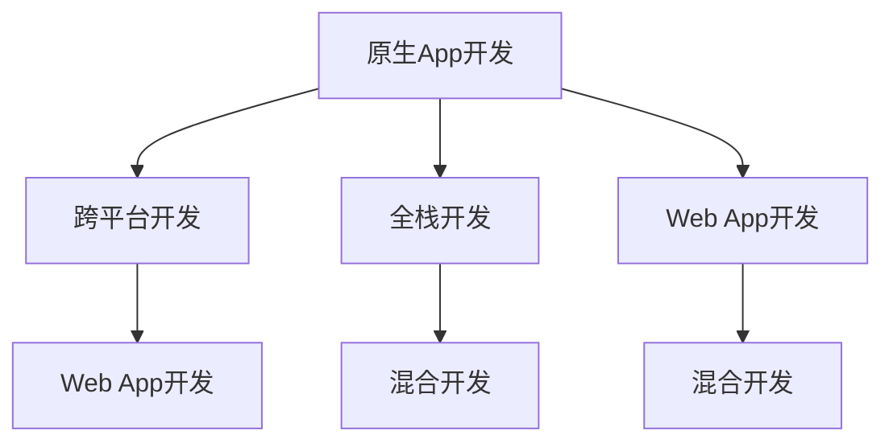

                 

## 1. 背景介绍

### 1.1 问题由来
移动端应用开发已经成为企业数字化转型的重要环节，但同时面临着成本高、开发周期长、维护复杂等挑战。为了提高开发效率和降低开发成本，移动开发技术经历了从原生开发到混合开发，再到全栈开发的历史演进。

### 1.2 问题核心关键点
移动端全栈开发的核心是使用统一的技术栈（如React Native、Flutter、Xamarin等）进行跨平台开发，同时兼容原生应用的性能和体验。这不仅能大幅降低开发成本，还能提升应用的质量和用户体验。

### 1.3 问题研究意义
全栈开发是移动应用开发技术的重要趋势，具有以下几方面的意义：

1. **降低开发成本**：使用统一的开发工具和技术栈，可以显著降低不同平台（iOS和Android）开发所需的资源和时间投入。
2. **提升开发效率**：全栈开发可以利用单一代码库维护多个平台的应用，提高开发效率和代码复用率。
3. **保证用户体验**：通过统一的框架和组件，全栈开发能够保证应用在多个平台上的一致性和易用性。
4. **促进快速迭代**：全栈开发环境支持热更新和模块化开发，可以快速响应市场变化和用户需求。
5. **强化跨平台能力**：全栈开发提升了应用的跨平台兼容性和可扩展性，为企业的多样化应用场景提供了灵活的解决方案。

## 2. 核心概念与联系

### 2.1 核心概念概述

为更好地理解移动端全栈开发，本节将介绍几个密切相关的核心概念：

- **原生App开发**：使用各自平台的编程语言和开发工具（如Swift、Kotlin），为特定平台（iOS或Android）开发的应用程序。原生App具备较高的性能和用户体验，但开发成本高、周期长。
- **跨平台开发**：使用单一代码库在不同平台（iOS和Android）上运行的应用程序，通过跨平台框架如React Native、Flutter、Xamarin等实现。跨平台开发能够大幅降低开发成本，提高开发效率，但可能牺牲部分性能和用户体验。
- **全栈开发**：使用同一技术栈（如React Native、Flutter、Xamarin等）进行跨平台开发，同时兼容原生应用的性能和体验。全栈开发具有原生应用的性能和用户体验，且成本和开发效率高。
- **Web App开发**：使用Web技术（如HTML、CSS、JavaScript）在移动端进行开发的Web应用程序，通过浏览器运行。Web App开发成本低、开发速度快，但性能和用户体验受限于浏览器环境。
- **混合开发**：结合原生开发和跨平台开发的特点，使用一套代码在原生应用上嵌入跨平台组件，实现跨平台兼容性的开发方式。混合开发能够在一定程度上提升开发效率，但代码维护和性能调优复杂。

这些核心概念之间的逻辑关系可以通过以下Mermaid流程图来展示：



这个流程图展示了几类移动开发技术的核心概念及其之间的关系：

1. 原生App开发是传统移动开发的基础，具备最高性能和用户体验。
2. 跨平台开发通过统一技术栈，降低开发成本和提升开发效率。
3. 全栈开发结合了原生和跨平台开发的优点，具备高性能和用户体验，且成本和效率高。
4. Web App开发使用Web技术，成本低、速度快，但性能和用户体验有限。
5. 混合开发结合原生和跨平台特点，实现一定程度的性能和用户体验提升，但代码维护复杂。

这些概念共同构成了移动端全栈开发的技术框架，为开发者提供了丰富的选择和优化路径。

## 3. 核心算法原理 & 具体操作步骤

### 3.1 算法原理概述

移动端全栈开发的核心算法原理是跨平台组件的渲染和交互机制。以React Native为例，其基本流程如下：

1. JavaScript代码通过Bridge接口调用原生代码，获取界面元素和处理逻辑。
2. JavaScript代码渲染界面并更新界面状态，通过Bridge接口调用原生代码更新界面元素。
3. 原生代码负责渲染UI界面和处理用户交互事件，通过Bridge接口向JavaScript代码返回渲染结果和事件处理结果。

这一过程可以概括为“桥接机制”，即通过一个中间层将JavaScript代码和原生代码连接起来，实现跨平台开发。

### 3.2 算法步骤详解

以下以React Native为例，详细讲解移动端全栈开发的步骤：

**Step 1: 准备开发环境**

1. 安装Node.js和npm，配置环境变量。
2. 安装React Native CLI工具，创建新项目。
3. 在项目中添加Android和iOS平台的支持库和依赖项。

**Step 2: 添加跨平台组件**

1. 通过npm安装跨平台组件库（如react-native-elements、react-native-paper等）。
2. 在代码中引入组件并使用，支持在不同平台上渲染。

**Step 3: 定义组件样式和逻辑**

1. 使用样式表（如Flexbox布局）定义组件的样式。
2. 在组件内部编写逻辑处理代码，实现功能需求。

**Step 4: 实现桥接机制**

1. 通过Bridge接口调用原生代码实现界面渲染和事件处理。
2. 在原生代码中处理UI渲染和用户交互事件，向JavaScript代码返回结果。

**Step 5: 调试和测试**

1. 在调试模式下运行应用，使用Chrome DevTools进行调试。
2. 在不同平台上进行测试，确保应用性能和用户体验一致。

**Step 6: 打包和发布**

1. 使用React Native CLI工具生成Android APK和iOS IPA文件。
2. 在相应平台上发布应用，并维护后续更新。

### 3.3 算法优缺点

移动端全栈开发具有以下优点：

1. **成本低**：使用同一技术栈进行跨平台开发，降低了不同平台开发所需的资源和时间投入。
2. **效率高**：全栈开发可以同时开发iOS和Android应用，加快开发进程。
3. **一致性**：全栈开发可以利用同一代码库在不同平台上保持一致的体验和风格。
4. **灵活性**：全栈开发可以根据用户需求灵活调整功能模块和界面设计。

同时，全栈开发也存在一些局限性：

1. **性能受限**：全栈开发可能牺牲部分性能，特别是在处理复杂动画和UI渲染时。
2. **调试复杂**：全栈开发涉及多平台代码，调试过程较为复杂，需具备一定经验。
3. **维护成本**：全栈开发需要维护不同平台的代码，增加了代码管理和维护的复杂度。

尽管存在这些局限性，但就目前而言，全栈开发仍然是移动应用开发的重要趋势。未来相关研究的重点在于如何进一步提升全栈开发的性能和用户体验，同时兼顾一致性和开发效率。

### 3.4 算法应用领域

移动端全栈开发已经在多个领域得到广泛应用，如：

- 企业移动应用：包括CRM、ERP、HR等企业级应用，通过全栈开发提升应用的一致性和灵活性。
- 电子商务：支持跨平台的在线购物和移动支付，提升用户体验和交易安全性。
- 游戏开发：支持iOS和Android多平台兼容，提供一致的游戏体验。
- 教育培训：开发跨平台的学习平台和应用，提升教育资源共享和教学质量。
- 社交媒体：支持跨平台的即时通讯和内容分享，实现用户无缝切换。
- 医疗健康：开发跨平台的医疗健康应用，提升医疗服务的可达性和用户体验。

除了上述这些经典应用外，全栈开发还被创新性地应用到更多场景中，如可穿戴设备、车载应用、智能家居等，为移动技术带来了新的突破。随着全栈开发技术的不断进步，相信移动应用技术将在更广阔的应用领域大放异彩。

## 4. 数学模型和公式 & 详细讲解 & 举例说明

### 4.1 数学模型构建

以React Native为例，其数学模型主要涉及跨平台组件的渲染和用户交互处理。

React Native通过Bridge接口连接JavaScript代码和原生代码，实现跨平台渲染和交互。其基本模型可以表示为：

$$
\text{JavaScript代码} \rightarrow \text{Bridge接口} \rightarrow \text{原生代码} \rightarrow \text{渲染UI界面} \rightarrow \text{返回渲染结果} \rightarrow \text{处理用户交互事件}
$$

### 4.2 公式推导过程

以React Native的Bridge接口为例，其工作流程可以分解为以下步骤：

1. JavaScript代码通过Bridge接口调用原生代码，获取界面元素和处理逻辑。
2. 原生代码处理用户交互事件，向Bridge接口返回结果。
3. JavaScript代码更新界面状态，通过Bridge接口调用原生代码更新界面元素。

这些步骤可以简化为数学表达式：

$$
\text{JavaScript代码} \rightarrow \text{Bridge接口} \rightarrow \text{原生代码} \rightarrow \text{返回渲染结果} \rightarrow \text{处理用户交互事件} \rightarrow \text{更新界面状态}
$$

### 4.3 案例分析与讲解

以下以React Native为例，展示一个简单的跨平台组件实现：

```javascript
import React from 'react';
import { View, Text } from 'react-native';

const MyComponent = () => {
  return (
    <View>
      <Text>Hello, World!</Text>
    </View>
  );
};

export default MyComponent;
```

在代码中，我们定义了一个简单的跨平台组件`MyComponent`，使用`View`和`Text`组件渲染一个包含“Hello, World!”文本的界面。

在原生代码中，我们可以通过Bridge接口调用这个组件：

```swift
import React from 'react';
import { MyComponent } from './MyComponent';
import { StyleSheet, View } from 'react-native';

const App = () => {
  return (
    <View style={styles.container}>
      <MyComponent />
    </View>
  );
};

const styles = StyleSheet.create({
  container: {
    flex: 1,
    justifyContent: 'center',
    alignItems: 'center',
    backgroundColor: '#F5FCFF',
  },
});

export default App;
```

在原生代码中，我们通过Bridge接口调用`MyComponent`组件，并将其渲染到界面中。

通过这个简单的案例，我们可以看到，React Native通过Bridge接口实现了跨平台组件的渲染和交互，实现了JavaScript代码和原生代码的无缝连接。

## 5. 项目实践：代码实例和详细解释说明

### 5.1 开发环境搭建

在进行全栈开发实践前，我们需要准备好开发环境。以下是使用React Native进行移动端开发的环境配置流程：

1. 安装Node.js和npm，配置环境变量。
2. 安装React Native CLI工具，创建新项目。
3. 在项目中添加Android和iOS平台的支持库和依赖项。
4. 安装相关的开发工具和调试工具，如Android Studio、Xcode等。

完成上述步骤后，即可在开发环境中开始全栈开发实践。

### 5.2 源代码详细实现

这里我们以一个简单的登录应用为例，展示React Native的全栈开发实践。

首先，定义登录界面的UI组件：

```javascript
import React from 'react';
import { View, TextInput, Button, Alert } from 'react-native';

const LoginScreen = ({ navigation }) => {
  const [email, setEmail] = React.useState('');
  const [password, setPassword] = React.useState('');

  const handleLogin = () => {
    if (email === '' || password === '') {
      Alert.alert('Please fill in the form');
      return;
    }

    // 模拟登录验证
    if (email === 'test@example.com' && password === 'password') {
      navigation.navigate('Home');
    } else {
      Alert.alert('Login failed');
    }
  };

  return (
    <View style={{ flex: 1, alignItems: 'center', justifyContent: 'center' }}>
      <TextInput
        style={{ height: 40, borderColor: 'gray', borderWidth: 1, marginBottom: 10 }}
        placeholder="Email"
        onChangeText={setEmail}
        value={email}
      />
      <TextInput
        style={{ height: 40, borderColor: 'gray', borderWidth: 1 }}
        placeholder="Password"
        onChangeText={setPassword}
        secureTextEntry={true}
        value={password}
      />
      <Button title="Login" onPress={handleLogin} />
    </View>
  );
};

export default LoginScreen;
```

然后，定义导航器：

```javascript
import { createStackNavigator } from '@react-navigation/stack';
import LoginScreen from './LoginScreen';
import HomeScreen from './HomeScreen';

const Stack = createStackNavigator();

const App = () => {
  return (
    <Stack.Navigator>
      <Stack.Screen name="Login" component={LoginScreen} />
      <Stack.Screen name="Home" component={HomeScreen} />
    </Stack.Navigator>
  );
};

export default App;
```

最后，使用Express服务器搭建后端API：

```javascript
const express = require('express');
const app = express();

app.post('/login', (req, res) => {
  const { email, password } = req.body;

  if (email === 'test@example.com' && password === 'password') {
    res.send({ success: true });
  } else {
    res.send({ success: false });
  }
});

app.listen(3000, () => {
  console.log('Server started on port 3000');
});
```

通过这个简单的登录应用案例，我们可以看到，React Native能够轻松实现跨平台的全栈开发，通过Bridge接口连接JavaScript代码和原生代码，实现界面渲染和交互处理。

### 5.3 代码解读与分析

让我们再详细解读一下关键代码的实现细节：

**LoginScreen组件**：
- 定义了一个包含Email输入框、Password输入框和登录按钮的登录界面。
- 使用React Hooks实现了输入值的状态管理，方便在界面组件间传递和更新数据。
- 通过模拟登录验证，展示登录成功或失败的提示框。

**App组件**：
- 使用Stack Navigator创建了一个栈式导航器，包含登录和首页两个屏幕。
- 通过React Native提供的Navigator API，实现了不同屏幕之间的切换和路由管理。

**后端API**：
- 使用Express框架搭建了一个简单的登录验证API。
- 通过POST请求接收前端发送的登录表单数据，验证后返回成功或失败响应。
- 在开发过程中，可以使用Postman等工具进行API测试和调试。

## 6. 实际应用场景

### 6.1 智能客服系统

基于React Native的全栈开发，可以构建智能客服系统的移动应用，提升客户咨询体验和问题解决效率。

在智能客服应用中，可以集成语音识别和自然语言处理技术，使机器人能够理解客户问题并提供智能回答。通过全栈开发，可以保证客服应用在iOS和Android平台上的一致性，提升用户体验和应用性能。

### 6.2 金融理财应用

金融理财应用需要具备高效、稳定、可靠的特点，全栈开发能够满足这些要求。通过React Native，可以构建跨平台的理财应用，支持iOS和Android用户使用。

在金融理财应用中，可以使用React Native的第三方库（如Swipeable组件）实现滑动卡片操作，为用户提供更加流畅的操作体验。通过API接口与后端系统对接，可以实时获取和更新账户信息，提升应用的实时性和准确性。

### 6.3 在线教育平台

在线教育平台需要提供跨平台的优质教育资源，全栈开发能够实现这一目标。通过React Native，可以构建跨平台的在线课程和视频应用，支持iOS和Android用户使用。

在在线教育平台中，可以使用React Native的动画库（如React Native Animation）实现动画效果，提升学习体验。通过API接口与后端系统对接，可以实时推送课程更新和互动信息，提升平台的互动性和时效性。

### 6.4 未来应用展望

随着React Native等跨平台开发框架的不断成熟，全栈开发将在更多领域得到应用，为传统行业带来变革性影响。

在智慧医疗领域，基于React Native的全栈开发，可以构建跨平台的医疗应用，支持医生与患者进行远程诊断和治疗。通过集成AI技术，可以提升诊断的准确性和效率，改善患者的治疗体验。

在智能制造领域，基于React Native的全栈开发，可以构建跨平台的生产管理应用，支持工人和管理人员实时监控和调度生产流程。通过集成IoT技术，可以实现设备的远程监控和预测性维护，提升生产效率和设备可靠性。

在智能交通领域，基于React Native的全栈开发，可以构建跨平台的交通管理应用，支持城市管理部门实时监控和调度交通流量。通过集成传感器和数据采集技术，可以实现交通流量的实时分析和预测，提升交通管理和调度的效率。

除了上述这些领域，全栈开发还被创新性地应用到更多场景中，如智慧农业、智能物流、智能家居等，为各行各业提供智能解决方案。

## 7. 工具和资源推荐

### 7.1 学习资源推荐

为了帮助开发者系统掌握全栈开发的技术基础和实践技巧，这里推荐一些优质的学习资源：

1. React Native官方文档：React Native的官方文档，提供了详尽的API文档和开发指南，是学习React Native的必备资料。
2. Flutter官方文档：Flutter的官方文档，提供了完整的开发指南和API文档，是学习Flutter的必备资料。
3. Xamarin官方文档：Xamarin的官方文档，提供了完整的开发指南和API文档，是学习Xamarin的必备资料。
4.《React Native实战》书籍：由React Native社区成员撰写的实战书籍，通过实际项目展示了React Native的开发技巧和最佳实践。
5. 《Flutter实战》书籍：由Flutter社区成员撰写的实战书籍，通过实际项目展示了Flutter的开发技巧和最佳实践。
6. 《Xamarin实战》书籍：由Xamarin社区成员撰写的实战书籍，通过实际项目展示了Xamarin的开发技巧和最佳实践。

通过对这些资源的学习实践，相信你一定能够快速掌握全栈开发的精髓，并用于解决实际的移动开发问题。

### 7.2 开发工具推荐

高效的开发离不开优秀的工具支持。以下是几款用于React Native开发的常用工具：

1. React Native CLI：React Native的命令行界面工具，用于创建和管理React Native项目。
2. Visual Studio Code：微软开发的IDE工具，支持React Native的开发和调试。
3. Xcode：苹果开发的IDE工具，支持iOS应用的开发和调试。
4. Android Studio：谷歌开发的IDE工具，支持Android应用的开发和调试。
5. Expo：React Native的快速开发平台，支持跨平台的移动应用开发和发布。
6. Code Push：React Native的代码热更新工具，支持快速发布和更新应用。

合理利用这些工具，可以显著提升React Native应用的开发效率，加快创新迭代的步伐。

### 7.3 相关论文推荐

全栈开发的研究源于学界的持续研究。以下是几篇奠基性的相关论文，推荐阅读：

1. "React Native: A Decisive Step Towards Universal Apps"：React Native的发布文章，介绍了React Native的基本概念和开发流程。
2. "Flutter: A Complete Toolbox for App Development"：Flutter的发布文章，介绍了Flutter的基本概念和开发流程。
3. "Xamarin: Cross-Platform Development with .NET"：Xamarin的发布文章，介绍了Xamarin的基本概念和开发流程。
4. "Mobile Development with React Native"：React Native的官方教程，提供了详细的开发示例和最佳实践。
5. "Mobile Development with Flutter"：Flutter的官方教程，提供了详细的开发示例和最佳实践。
6. "Mobile Development with Xamarin"：Xamarin的官方教程，提供了详细的开发示例和最佳实践。

这些论文代表了大语言模型微调技术的发展脉络。通过学习这些前沿成果，可以帮助研究者把握学科前进方向，激发更多的创新灵感。

## 8. 总结：未来发展趋势与挑战

### 8.1 总结

本文对移动端全栈开发进行了全面系统的介绍。首先阐述了全栈开发的发展背景和意义，明确了全栈开发在移动应用开发中的重要地位。其次，从原理到实践，详细讲解了全栈开发的数学模型和操作步骤，给出了全栈开发任务开发的完整代码实例。同时，本文还广泛探讨了全栈开发在智能客服、金融理财、在线教育等多个行业领域的应用前景，展示了全栈开发的巨大潜力。此外，本文精选了全栈开发技术的各类学习资源，力求为读者提供全方位的技术指引。

通过本文的系统梳理，可以看到，全栈开发是移动应用开发技术的重要趋势，具有降低开发成本、提高开发效率、保证用户体验等显著优势。全栈开发不仅能显著提升应用的开发速度和质量，还能保证应用在多个平台上的统一性和一致性，为企业的数字化转型提供有力支持。未来，随着全栈开发技术的不断演进，相信全栈开发将会在更多领域得到广泛应用，为移动应用技术的产业化进程注入新的动力。

### 8.2 未来发展趋势

展望未来，全栈开发技术将呈现以下几个发展趋势：

1. **成本低廉**：全栈开发技术的成熟将进一步降低移动应用开发的成本，提升开发效率。
2. **性能提升**：通过不断优化渲染机制和组件库，全栈开发将实现更高的性能和更流畅的用户体验。
3. **生态完善**：全栈开发生态将不断丰富，更多第三方组件和工具将被引入，提升开发效率和代码复用率。
4. **跨平台优化**：全栈开发将实现更高程度的跨平台兼容性和一致性，提升应用的通用性和可扩展性。
5. **多平台支持**：全栈开发将支持更多平台（如Web、桌面等），拓展应用的场景和应用范围。
6. **前端智能化**：全栈开发将与前端智能化技术（如AI、AR、VR等）结合，提升应用的智能化和交互性。

以上趋势凸显了全栈开发技术的广阔前景。这些方向的探索发展，必将进一步提升全栈开发的性能和用户体验，为移动应用技术的产业化进程注入新的动力。

### 8.3 面临的挑战

尽管全栈开发技术已经取得了显著进展，但在迈向更加智能化、普适化应用的过程中，它仍面临着诸多挑战：

1. **性能瓶颈**：全栈开发可能牺牲部分性能，特别是在处理复杂动画和UI渲染时。如何进一步优化性能，提高用户体验，将是未来的重要研究方向。
2. **调试复杂**：全栈开发涉及多平台代码，调试过程较为复杂，需具备一定经验。如何简化调试流程，提升开发效率，将是未来的重要研究方向。
3. **跨平台一致性**：全栈开发需要保证应用在不同平台上的统一性和一致性，但跨平台一致性常常难以达到预期效果。如何提升跨平台一致性，将是未来的重要研究方向。
4. **第三方组件依赖**：全栈开发依赖大量第三方组件库，组件库的稳定性和维护成本可能影响应用的稳定性。如何优化组件库选择和使用，将是未来的重要研究方向。
5. **用户隐私保护**：全栈开发应用需处理用户隐私数据，如何保护用户隐私，防止数据泄露，将是未来的重要研究方向。
6. **安全性保障**：全栈开发应用可能面临各种安全威胁，如何加强安全防护，防止攻击和恶意行为，将是未来的重要研究方向。

这些挑战凸显了全栈开发技术的复杂性和多样性，需要在开发、运维、安全等各个环节进行全面优化，方能真正实现全栈开发的应用价值。

### 8.4 研究展望

面对全栈开发技术所面临的种种挑战，未来的研究需要在以下几个方面寻求新的突破：

1. **性能优化**：开发更高效的渲染机制和组件库，提升应用的性能和用户体验。
2. **调试简化**：引入更加智能化的调试工具，简化跨平台调试流程，提升开发效率。
3. **跨平台一致性**：引入更先进的多平台适配技术，提升应用的跨平台一致性和兼容性。
4. **组件库优化**：优化第三方组件库的选择和使用，提升组件库的稳定性和可维护性。
5. **用户隐私保护**：引入更加严格的用户隐私保护机制，防止数据泄露和滥用。
6. **安全性保障**：引入更加强大的安全防护技术，防止攻击和恶意行为。

这些研究方向将引领全栈开发技术迈向更高的台阶，为移动应用技术的产业化进程提供新的动力。面向未来，全栈开发技术需要在性能、用户体验、安全性等方面进行持续优化，方能真正实现全栈开发的应用价值。

## 9. 附录：常见问题与解答

**Q1：全栈开发是否适合所有类型的移动应用？**

A: 全栈开发适用于多数类型的移动应用，特别是跨平台需求较高的场景。对于需要高度定制化、高性能或特定平台功能的应用，原生开发可能更为适合。

**Q2：全栈开发是否会牺牲应用的性能？**

A: 全栈开发可能会牺牲一定的性能，尤其是在处理复杂动画和UI渲染时。但通过不断优化渲染机制和组件库，可以显著提升应用的性能和用户体验。

**Q3：如何优化全栈开发的性能？**

A: 优化全栈开发性能的方法包括：
1. 使用原生代码进行复杂的UI渲染和动画处理。
2. 选择高效的渲染机制和组件库。
3. 使用跨平台组件进行合理布局和样式管理。
4. 进行代码优化和资源压缩。
5. 使用平台特性进行本地化优化。

**Q4：全栈开发是否需要频繁调试？**

A: 全栈开发需要处理多平台代码，调试过程可能较为复杂。但通过引入智能化的调试工具，如Chrome DevTools、VS Code等，可以简化调试流程，提升开发效率。

**Q5：全栈开发是否需要大量第三方组件依赖？**

A: 全栈开发依赖大量第三方组件库，组件库的稳定性和维护成本可能影响应用的稳定性。但通过合理选择和使用第三方组件，可以提升组件库的稳定性和可维护性。

**Q6：如何保护全栈开发应用的用户隐私？**

A: 保护全栈开发应用的用户隐私，需要采取以下措施：
1. 使用加密传输和存储用户数据。
2. 对用户数据进行严格的访问控制和权限管理。
3. 引入隐私保护机制，如差分隐私、数据匿名化等。

这些措施可以有效地保护用户隐私，提升应用的安全性和用户信任度。

通过对这些问题的解答，相信你能够更好地理解全栈开发的技术细节和应用场景，掌握全栈开发的核心要点和实践技巧，并在实际项目中灵活应用，构建出高质量的跨平台移动应用。

