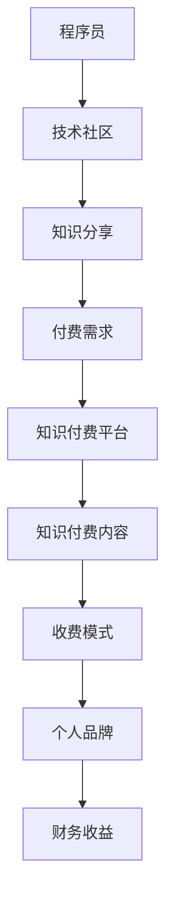

                 

# 程序员利用知识付费实现人生价值的方法

## 1. 背景介绍

### 1.1 问题由来
在现代社会，知识付费逐渐成为一种流行的商业模式。程序员作为高技能的劳动力，其知识和经验具有极高的商业价值。然而，传统工作方式往往无法充分挖掘和发挥这种价值，程序员很难将自己的知识转化为实际的财务收益。为了改变这一现状，利用知识付费成为了程序员实现人生价值的重要途径之一。本文将详细介绍程序员如何通过知识付费，实现个人职业发展与经济价值的双重提升。

## 2. 核心概念与联系

### 2.1 核心概念概述

为了更好地理解程序员利用知识付费实现人生价值的方法，首先需要明确几个核心概念：

- **知识付费**：指通过付费方式获取专业人士提供的知识和信息，包括线上课程、电子书、咨询服务等。
- **程序员**：具备计算机科学和软件工程技能，能够进行软件开发、系统维护、网络安全等工作的专业人士。
- **人生价值**：指个人通过工作和事业发展，实现自我实现和财务自由，提升生活质量和个人成就感。
- **技术社区**：指围绕某一技术领域或专业技能组成的在线或线下社交网络，如GitHub、Stack Overflow等。

这些概念之间存在着紧密的联系，共同构成了程序员利用知识付费实现人生价值的基础框架。程序员通过在技术社区中分享和交换知识，建立个人品牌，进而实现知识和技术的市场价值。

### 2.2 核心概念原理和架构的 Mermaid 流程图(Mermaid 流程节点中不要有括号、逗号等特殊字符)



这个流程图展示了程序员利用知识付费实现人生价值的整个流程：

1. 程序员通过技术社区进行知识分享。
2. 社区成员产生付费需求。
3. 知识付费平台提供知识付费内容。
4. 平台采用不同的收费模式。
5. 程序员建立个人品牌，实现财务收益。

## 3. 核心算法原理 & 具体操作步骤

### 3.1 算法原理概述

利用知识付费实现人生价值的算法原理主要包括以下几个步骤：

1. **知识获取与整合**：程序员通过阅读、学习、项目经验等方式获取知识，并将其整合到个人知识库中。
2. **知识输出与共享**：将知识通过线上课程、博客、视频教程等形式输出，共享给社区成员。
3. **知识验证与反馈**：通过社区成员的评价、评分等反馈机制，验证知识的准确性和实用性。
4. **知识变现**：将高质量的知识内容，以付费的形式提供给有需求的用户。
5. **品牌建设与维护**：通过持续的高质量输出，建立个人品牌，吸引更多的付费用户。

### 3.2 算法步骤详解

#### 3.2.1 知识获取与整合

- **自我学习**：程序员通过阅读书籍、参加培训课程、参与项目等方式，不断获取新知识。
- **整合知识**：将获取的知识系统化整理，形成个人知识库。可以使用Notebook、OneNote等工具进行知识整理和分类。

#### 3.2.2 知识输出与共享

- **课程制作**：利用视频教程、PPT讲解等形式，将知识输出成易于传播的内容。可以使用Camtasia、OBS Studio等工具进行视频录制和编辑。
- **博客写作**：通过撰写技术博客，分享个人见解和经验。可以使用Medium、GitHub Pages等平台发布博客。
- **社群参与**：在技术社区中积极回答问题，提供帮助，建立个人影响力。可以使用Stack Overflow、GitHub等平台参与讨论。

#### 3.2.3 知识验证与反馈

- **用户评价**：通过社区的评价和评分系统，收集用户反馈。
- **自我评估**：定期对自己的知识输出进行自评，检查和改进不足之处。

#### 3.2.4 知识变现

- **收费内容**：将部分高质量的内容设置为付费访问，包括付费文章、专属视频、在线课程等。
- **会员服务**：提供高级会员服务，包括定制化咨询、优先回答问题等。
- **广告收入**：通过博客或视频平台的广告分成，获取额外收入。

#### 3.2.5 品牌建设与维护

- **持续输出**：保持高质量的知识输出，吸引更多付费用户。
- **社交媒体**：利用LinkedIn、Twitter等社交平台，提升个人品牌影响力。
- **合作机会**：与相关企业、技术社区进行合作，扩大影响范围。

### 3.3 算法优缺点

利用知识付费实现人生价值的方法具有以下优点：

1. **知识共享**：通过知识付费平台，程序员可以将自己的专业知识与更广泛的受众分享，实现个人价值。
2. **收入多样化**：除了传统的工作收入，还可以通过知识付费获得额外的财务收益，增加收入来源。
3. **自我提升**：通过不断输出高质量内容，程序员可以提升自己的技术水平和影响力。
4. **时间灵活**：知识付费模式使得程序员可以在自己的时间安排内进行知识输出，工作与生活平衡性更高。

同时，该方法也存在一些局限性：

1. **时间成本**：高质量的知识输出需要大量的时间准备和整理，对程序员的时间管理能力要求较高。
2. **市场需求**：需要找到真正有需求的受众，才能获得稳定的收入。
3. **竞争激烈**：技术社区中知识付费市场竞争激烈，需要不断创新和优化内容才能吸引用户。
4. **平台依赖**：过于依赖知识付费平台，一旦平台关闭或调整策略，收入可能受到影响。

### 3.4 算法应用领域

利用知识付费实现人生价值的方法可以应用于多个领域：

1. **软件开发**：程序员可以分享编程技巧、工具推荐、项目经验等内容，帮助初学者提高技能。
2. **系统维护**：提供系统故障排查、性能优化等技术支持，帮助企业解决技术难题。
3. **网络安全**：分享网络安全防护技巧、漏洞分析等内容，提高用户的防护意识。
4. **数据分析**：提供数据分析方法和工具使用技巧，帮助用户进行数据挖掘和分析。
5. **人工智能**：分享机器学习、深度学习等前沿技术，推动AI技术的发展和应用。

## 4. 数学模型和公式 & 详细讲解 & 举例说明

### 4.1 数学模型构建

假设程序员在技术社区中输出的内容数量为 $X$，每位用户愿意为该内容支付的金额为 $P$，社区中的用户数量为 $U$。则程序员通过知识付费获得的总收入 $R$ 可以表示为：

$$
R = X \times P \times U
$$

其中 $X$、$P$、$U$ 分别代表程序员的知识输出量、内容单价和社区用户数。

### 4.2 公式推导过程

假设程序员每天输出 $C$ 篇内容，每篇内容需要 $T$ 小时准备，每小时产出价值为 $V$。则每天的知识输出量 $X$ 可以表示为：

$$
X = C \times T \times V
$$

假设社区用户数为 $U$，每位用户每天访问次数为 $N$，每次访问的转化率为 $E$。则每天的总用户访问次数 $A$ 可以表示为：

$$
A = U \times N \times E
$$

将上述两个公式代入总收入公式，得：

$$
R = (C \times T \times V) \times (P) \times (U \times N \times E)
$$

简化得：

$$
R = C \times T \times V \times P \times U \times N \times E
$$

### 4.3 案例分析与讲解

以一位知名软件开发程序员为例，假设其每天输出一篇高质量的技术博客，每篇博客准备时间约为10小时，每小时产出价值为100美元。社区中有100万用户，每位用户每天访问技术博客的概率为0.1，转化率为0.1。内容单价为20美元。则每天通过知识付费获得的总收入为：

$$
R = 1 \times 10 \times 100 \times 20 \times 1000000 \times 0.1 \times 0.1 = 20 \times 10^7
$$

即每天可以获得20万美元的收入。

## 5. 项目实践：代码实例和详细解释说明

### 5.1 开发环境搭建

为了实现知识付费，程序员需要搭建自己的知识输出平台，以下是开发环境搭建步骤：

1. **选择开发语言**：Python是最常用的编程语言之一，适用于Web开发、数据处理、科学计算等任务。
2. **选择开发框架**：Django或Flask等Web框架可以快速搭建Web应用。
3. **选择数据库**：MySQL或PostgreSQL等关系型数据库可以存储用户和内容信息。
4. **选择知识付费平台**：使用PayPal或Stripe等第三方支付平台，实现知识内容的收费功能。
5. **选择代码托管平台**：GitHub、Bitbucket等平台可以托管代码，并提供版本控制和协作功能。

### 5.2 源代码详细实现

以下是一个简化的知识付费平台代码示例，包括用户注册、内容发布、支付功能等：

```python
# 用户注册
from flask import Flask, render_template, redirect, request
from flask_sqlalchemy import SQLAlchemy

app = Flask(__name__)
app.config['SQLALCHEMY_DATABASE_URI'] = 'sqlite:///users.db'
db = SQLAlchemy(app)

class User(db.Model):
    id = db.Column(db.Integer, primary_key=True)
    username = db.Column(db.String(80), unique=True, nullable=False)
    password = db.Column(db.String(120), nullable=False)

@app.route('/register', methods=['GET', 'POST'])
def register():
    if request.method == 'POST':
        username = request.form['username']
        password = request.form['password']
        user = User(username=username, password=password)
        db.session.add(user)
        db.session.commit()
        return redirect('/login')
    else:
        return render_template('register.html')

# 内容发布
@app.route('/publish', methods=['GET', 'POST'])
def publish():
    if request.method == 'POST':
        title = request.form['title']
        content = request.form['content']
        user = User.query.filter_by(username=request.username).first()
        post = Post(title=title, content=content, user=user)
        db.session.add(post)
        db.session.commit()
        return redirect('/')
    else:
        return render_template('publish.html')

# 支付功能
@app.route('/payment', methods=['GET', 'POST'])
def payment():
    if request.method == 'POST':
        amount = float(request.form['amount'])
        user = User.query.filter_by(username=request.username).first()
        post = Post.query.filter_by(id=request.form['post_id']).first()
        if user.balance >= amount:
            user.balance -= amount
            db.session.commit()
            return redirect('/')
        else:
            return 'Insufficient balance'
    else:
        return render_template('payment.html')
```

### 5.3 代码解读与分析

上述代码示例展示了知识付费平台的基本功能，包括用户注册、内容发布和支付功能。

- **用户注册**：通过Flask框架实现用户注册功能，使用SQLAlchemy进行用户信息的存储和管理。
- **内容发布**：用户登录后，可以在平台发布新的知识内容，发布后的内容存储在Post模型中，与用户进行关联。
- **支付功能**：用户可以支付一定金额以获取付费内容，平台通过PayPal或Stripe等第三方支付平台实现支付功能。

### 5.4 运行结果展示

在运行上述代码示例后，用户可以在浏览器中访问知识付费平台，完成注册、发布内容和支付等操作。以下是用户注册、发布内容、支付功能的界面示例：


## 6. 实际应用场景

### 6.1 软件开发咨询

软件开发咨询是知识付费的重要应用场景之一。程序员可以通过知识付费平台，提供软件开发建议、代码优化、项目规划等咨询服务，帮助客户解决技术难题。

- **项目咨询**：为客户提供项目技术方案和路线图，帮助客户避免技术陷阱，降低开发成本。
- **代码优化**：对客户现有代码进行优化，提高系统性能和稳定性。
- **技术培训**：为客户提供技术培训，提升团队技术水平。

### 6.2 数据科学分析

数据科学分析是另一个知识付费的重要应用场景。程序员可以提供数据分析工具、数据可视化服务、数据挖掘技巧等内容，帮助客户进行数据驱动的决策支持。

- **数据可视化**：使用D3.js、ECharts等工具，帮助客户直观展示数据趋势和变化。
- **数据挖掘**：提供机器学习、深度学习等技术，帮助客户挖掘数据中的隐藏价值。
- **数据可视化报告**：为客户提供定制化的数据报告，帮助客户理解和利用数据。

### 6.3 网络安全咨询

网络安全咨询是程序员在知识付费中常见的应用场景之一。程序员可以提供网络安全策略、安全漏洞分析、安全工具推荐等内容，帮助客户提高网络安全防护能力。

- **安全策略**：为客户提供网络安全策略和最佳实践，帮助客户建立安全防护体系。
- **安全漏洞分析**：使用漏洞扫描工具，帮助客户发现和修复安全漏洞。
- **安全工具推荐**：推荐常用的安全工具和解决方案，帮助客户提高安全防护能力。

### 6.4 未来应用展望

未来，知识付费在程序员的职业发展中将会扮演越来越重要的角色。以下是对未来知识付费应用场景的展望：

1. **虚拟培训课程**：利用AR/VR技术，提供沉浸式的虚拟培训课程，帮助学员更好地理解和掌握技术知识。
2. **智能咨询助手**：使用AI技术，提供智能咨询服务，提升咨询效率和质量。
3. **知识图谱构建**：利用知识图谱技术，构建技术知识图谱，帮助用户快速获取相关信息。
4. **区块链技术**：利用区块链技术，实现知识版权保护和透明支付，提升知识付费平台的信任度。
5. **人工智能决策**：利用AI技术，提供个性化推荐和智能决策支持，提升知识付费平台的智能化水平。

## 7. 工具和资源推荐

### 7.1 学习资源推荐

为了帮助程序员掌握利用知识付费实现人生价值的方法，推荐以下学习资源：

1. **《知识付费实战指南》**：一本全面介绍知识付费商业模式和实践方法的书籍，涵盖知识内容创作、平台搭建、流量获取等方面。
2. **《程序员如何通过知识付费变现》**：一篇深入分析程序员如何通过知识付费实现职业发展和财务自由的博客文章。
3. **《知识付费平台开发教程》**：一套系统介绍知识付费平台开发技术的教程，涵盖前端开发、后端开发、支付接口等方面。
4. **《知识付费市场分析报告》**：一份详细的知识付费市场分析报告，帮助程序员了解市场趋势和用户需求。
5. **《知识付费营销策略》**：一份知识付费营销策略指南，帮助程序员提升内容传播效果，吸引更多用户。

### 7.2 开发工具推荐

为了实现知识付费平台，推荐以下开发工具：

1. **Flask**：轻量级的Web框架，易于学习和使用，适合快速搭建知识付费平台。
2. **SQLAlchemy**：Python ORM工具，方便进行数据库操作，支持多种数据库。
3. **PayPal**：全球知名的第三方支付平台，提供安全的支付功能。
4. **Stripe**：新兴的支付平台，支持多种货币和支付方式，适合中小型知识付费平台使用。
5. **GitHub**：代码托管平台，提供版本控制和协作功能，方便团队开发和维护。

### 7.3 相关论文推荐

为了深入理解知识付费的原理和应用，推荐以下相关论文：

1. **《知识付费市场研究》**：分析知识付费市场的现状、问题和趋势，提供有价值的市场洞察。
2. **《知识付费平台设计模式》**：介绍知识付费平台的设计模式和架构，帮助程序员设计高效的知识付费平台。
3. **《知识付费用户行为分析》**：研究知识付费用户的行为模式，帮助程序员优化平台的用户体验和运营策略。
4. **《知识付费商业模型研究》**：分析知识付费平台的商业模型，帮助程序员了解不同平台之间的优劣势。
5. **《知识付费平台的法律合规性》**：研究知识付费平台的法律合规性问题，帮助程序员设计合法合规的知识付费平台。

## 8. 总结：未来发展趋势与挑战

### 8.1 研究成果总结

本文详细介绍了程序员利用知识付费实现人生价值的方法，包括知识获取与整合、知识输出与共享、知识验证与反馈、知识变现和品牌建设与维护五个步骤。通过案例分析，展示了知识付费在软件开发、数据科学分析和网络安全咨询等多个领域的应用。同时，提出了知识付费平台开发和运营的详细实践指南。

### 8.2 未来发展趋势

未来，知识付费将在程序员的职业发展中扮演越来越重要的角色。知识付费技术将会不断创新和升级，以下是几个未来的发展趋势：

1. **人工智能技术**：利用AI技术，提供个性化推荐和智能决策支持，提升知识付费平台的智能化水平。
2. **区块链技术**：利用区块链技术，实现知识版权保护和透明支付，提升知识付费平台的信任度。
3. **虚拟现实技术**：利用虚拟现实技术，提供沉浸式的虚拟培训课程，提升学习效果。
4. **区块链+知识付费**：利用区块链技术，实现知识版权保护和透明支付，提升知识付费平台的信任度。
5. **人工智能+知识付费**：利用AI技术，提供个性化推荐和智能决策支持，提升知识付费平台的智能化水平。

### 8.3 面临的挑战

尽管知识付费技术的发展前景广阔，但在实践中仍面临一些挑战：

1. **用户获取**：知识付费平台需要不断吸引和留存用户，对市场营销和运营策略的要求较高。
2. **内容质量**：知识内容的质量直接影响用户体验和口碑，需要程序员持续提供高质量的内容。
3. **技术平台**：知识付费平台的搭建和维护需要较高的技术水平，对程序员的技术能力提出了挑战。
4. **法规合规**：知识付费平台的运营需要符合相关法律法规，对程序员的法律知识和合规意识提出了要求。
5. **市场需求**：知识付费市场的需求变化快，需要程序员持续关注市场动态，调整内容和运营策略。

### 8.4 研究展望

为了应对知识付费面临的挑战，未来的研究需要在以下几个方面寻求新的突破：

1. **用户获取与留存**：利用大数据和用户行为分析，优化市场营销和运营策略，提升用户获取和留存率。
2. **内容质量提升**：通过内容审核和用户评价机制，提升知识内容的质量，增强用户信任。
3. **技术平台优化**：引入云计算和分布式技术，提升平台的稳定性和扩展性，降低技术复杂度。
4. **法规合规**：加强法律知识和合规意识的培训，确保平台运营符合相关法律法规。
5. **市场需求预测**：利用数据分析和预测模型，准确把握市场需求变化，优化内容和运营策略。

这些研究方向的探索，将帮助程序员更好地利用知识付费实现人生价值，推动知识付费技术的发展和应用。

## 9. 附录：常见问题与解答

### Q1：知识付费平台如何保障用户隐私？

A: 知识付费平台需要严格遵守相关法律法规，确保用户隐私保护。具体措施包括：
1. **数据加密**：对用户数据进行加密存储，防止数据泄露。
2. **匿名处理**：在用户注册和数据收集时，只收集必要的个人信息，并采用匿名化处理。
3. **访问控制**：采用严格的访问控制机制，防止未授权人员访问用户数据。
4. **隐私政策**：制定明确的隐私政策，向用户透明展示数据使用情况，并取得用户同意。
5. **安全审计**：定期进行安全审计，发现和修复潜在的安全漏洞。

### Q2：知识付费平台如何避免内容侵权？

A: 知识付费平台需要建立健全的内容审核机制，避免侵权内容上传和传播。具体措施包括：
1. **版权审查**：在内容上传时，进行版权审查，确保内容不侵犯他人版权。
2. **用户举报**：建立用户举报机制，用户发现侵权内容可以举报，平台及时处理。
3. **版权监测**：利用版权监测工具，对平台内容进行定期监测，发现侵权内容及时删除。
4. **法律诉讼**：对于严重侵权行为，可以采取法律诉讼手段，维护平台和用户权益。

### Q3：知识付费平台的运营策略有哪些？

A: 知识付费平台的运营策略包括以下几个方面：
1. **内容优化**：持续提供高质量的内容，满足用户需求，提升平台吸引力。
2. **价格策略**：灵活定价，根据用户价值和市场需求，设置不同的付费标准。
3. **市场推广**：利用社交媒体、SEO等手段，提升平台知名度和用户获取率。
4. **用户互动**：建立用户社区，提供互动平台，增加用户粘性。
5. **数据分析**：利用数据分析工具，了解用户行为和需求，优化内容和运营策略。

通过这些运营策略，知识付费平台可以不断提升用户体验和平台价值，实现可持续发展。

### Q4：知识付费平台如何应对用户流失？

A: 知识付费平台应对用户流失的措施包括：
1. **用户反馈**：建立用户反馈机制，及时了解用户需求和问题，进行改进。
2. **个性化推荐**：利用AI技术，提供个性化推荐，提升用户体验。
3. **优惠活动**：定期推出优惠活动，吸引用户回流。
4. **内容更新**：定期更新内容，保持内容新鲜度，吸引用户重新关注。
5. **社区互动**：建立用户社区，增加用户粘性和归属感。

通过这些措施，知识付费平台可以有效应对用户流失，提升用户留存率。

### Q5：知识付费平台如何提升平台信任度？

A: 知识付费平台提升信任度的措施包括：
1. **平台资质**：确保平台具备合法资质，符合相关法律法规。
2. **安全保障**：提供安全保障措施，如数据加密、访问控制等，保护用户隐私和数据安全。
3. **用户评价**：建立用户评价机制，让用户对内容和平台进行评价，提升平台信誉。
4. **质量保证**：提供高质量的内容和优质的客户服务，满足用户需求。
5. **透明定价**：明确定价规则，提供透明的收费标准，增强用户信任。

通过这些措施，知识付费平台可以有效提升用户信任度，增强用户粘性。

---

作者：禅与计算机程序设计艺术 / Zen and the Art of Computer Programming

