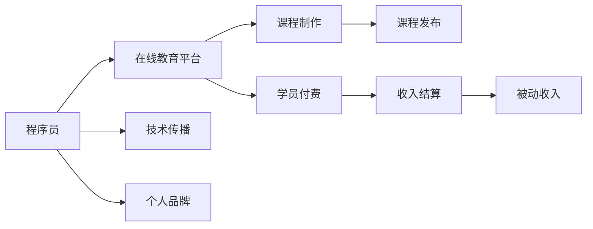

                 

# 程序员利用知识付费实现被动收入

> 关键词：知识付费, 程序员, 被动收入, 编程技术, 在线教育, 软件架构

## 1. 背景介绍

在数字化浪潮的推动下，程序员不仅需要具备卓越的技术能力，还需要敏锐的商业洞察力。传统职业道路的瓶颈和市场竞争的加剧，使得程序员开始思考如何利用自身的技术优势，开拓新的收入来源。知识付费作为新型的商业模式，为程序员提供了实现被动收入的独特机会。本文将深入探讨程序员如何利用知识付费实现被动收入，并从多个维度分析其潜力和挑战。

### 1.1 问题由来

随着互联网和移动设备的普及，人们对于知识的渴求日益增长。特别是对于技术领域，初学者和自学者通过网络获取知识的需求激增。然而，传统的教育资源（如书籍、视频教程等）在提供个性化、互动化学习体验方面存在局限性。知识付费模式应运而生，通过提供高质量、高价值的内容，满足市场对技术教育的刚性需求。

对于程序员而言，知识付费不仅是一种变现手段，更是一种技术传播方式。通过在线教育平台，程序员可以将自身的技术经验和专业技能转化为课程内容，实现与广大开发者的交流和分享，提升自身影响力，同时获得可观的被动收入。

## 2. 核心概念与联系

### 2.1 核心概念概述

- **知识付费**：指消费者为获取专业知识和技能而支付费用的模式。在线教育、编程培训、技术咨询等都是知识付费的表现形式。
- **程序员**：具备编程技能，能在软件开发生命周期中执行程序设计、软件测试、维护等工作的专业人士。
- **被动收入**：无需主动工作即可获得的收入，例如投资收益、租金、版税等。
- **在线教育**：通过互联网技术，结合多媒体教学工具，提供在线课程、互动问答、作业批改等服务。
- **软件架构**：指导软件系统的设计和构建，以实现系统的可扩展性、可维护性和可重用性。

这些概念之间的联系主要体现在，程序员可以利用在线教育平台，将自己的技术知识和软件架构经验转化为课程内容，向学生收取费用，从而实现被动收入。

### 2.2 核心概念原理和架构的 Mermaid 流程图



这个流程图展示了程序员利用知识付费实现被动收入的基本流程：程序员通过在线教育平台制作课程，学员付费学习，平台结算收入，程序员获得被动收入。同时，知识付费还促进了技术传播和个人品牌的建立。

## 3. 核心算法原理 & 具体操作步骤

### 3.1 算法原理概述

知识付费平台通常采用订阅制或按需购买的方式，基于课程内容价值和学员需求进行定价。课程制作和发布需要程序员具备以下技能和工具：

- **编程语言和框架**：掌握至少一种编程语言（如Python、Java、C++）和相关开发框架，能够快速实现课程内容。
- **在线课程制作工具**：熟悉常见的在线课程平台（如Coursera、Udemy、腾讯课堂等），能够利用平台提供的工具和资源，高效制作课程。
- **软件开发最佳实践**：理解软件开发生命周期、软件架构设计、版本控制等，保证课程内容的系统性和实用性。

### 3.2 算法步骤详解

**Step 1: 确定课程主题和目标**

- 基于自身技术专长，选择感兴趣的编程技术或软件架构主题。
- 明确课程目标和受众群体，制定详细的教学大纲。

**Step 2: 制作课程内容**

- 录制课程讲解视频，准备PPT、代码示例、测试题等教学材料。
- 利用视频剪辑、字幕生成工具，提升视频质量。
- 编写课程讲义和作业，确保学员能够跟随课程内容进行实践。

**Step 3: 选择平台并发布课程**

- 选择合适的在线教育平台，并注册成为讲师。
- 上传课程视频、讲义、作业等资源，设置课程价格和发布时间。
- 利用平台的推广工具，提升课程的曝光度和学员数量。

**Step 4: 维护和更新课程**

- 根据学员反馈，不断改进和优化课程内容。
- 定期更新课程资料，保证内容的时效性和先进性。
- 建立学员社群，与学员进行互动交流，解答疑问。

**Step 5: 结算收入和提升影响力**

- 平台根据学员购买和订阅情况，结算课程收入。
- 利用社交媒体和个人博客，分享课程内容和编程心得，提升个人品牌影响力。
- 参与技术社区，提供技术支持和代码贡献，扩大技术影响力。

### 3.3 算法优缺点

**优点**：

- **多样化收入来源**：程序员可以同时提供多种类型的课程，如编程语言、框架、工具、软件架构等，拓宽收入渠道。
- **灵活性强**：课程制作和发布流程相对简单，无需大量的前期投入和团队支持。
- **市场潜力大**：在线教育市场持续增长，技术教育和软件架构需求旺盛，课程市场需求大。

**缺点**：

- **时间和精力投入大**：课程制作需要花费大量时间和精力，特别是在初期阶段，可能需要持续的更新和改进。
- **市场竞争激烈**：技术教育和软件架构领域竞争激烈，需要持续优化课程内容和营销策略，才能吸引学员。
- **品牌建立难度**：技术社区对于讲师的评价标准较高，建立个人品牌和影响力需要时间和努力。

### 3.4 算法应用领域

知识付费模式不仅适用于传统的软件开发教育，还广泛应用于软件架构、网络安全、人工智能等技术领域。程序员可以利用知识付费，将自身技术知识和经验传播到更广泛的群体，实现多领域、多层次的变现。

## 4. 数学模型和公式 & 详细讲解 & 举例说明

### 4.1 数学模型构建

知识付费模式可以简单地用收入模型进行描述。假设课程的固定成本为 $C$，每门课程的价格为 $P$，订阅期为 $T$，学员人数为 $N$，则总收入 $I$ 可以表示为：

$$
I = P \times N \times T - C
$$

其中 $P$ 是课程价格，$N$ 是订阅用户数量，$T$ 是订阅期长度，$C$ 是课程制作和运营的固定成本。

### 4.2 公式推导过程

对于一个具体的课程，设每门课程的固定成本为 $C_i$，价格为 $P_i$，订阅期为 $T_i$，在 $t$ 时刻的订阅用户数为 $N_i(t)$。则总收入 $I_i$ 的表达式为：

$$
I_i(t) = \int_0^T P_i \times N_i(t) \, dt - C_i
$$

在实际应用中，课程的价格、订阅期和用户增长曲线需要通过市场调研和数据分析确定。而课程的固定成本则包括课程制作、视频剪辑、平台费用等。

### 4.3 案例分析与讲解

以一个Python编程课程为例，该课程的固定成本为 $C = 1000$ 美元，价格为 $P = 50$ 美元/月，订阅期为 $T = 6$ 个月。假设课程初期（第一个月）的订阅用户数量为 $N_1 = 100$，第二个月增长率为 $r = 0.1$。则总收入 $I$ 的计算过程如下：

1. 第一个月的收入 $I_1 = 100 \times 50 = 5000$ 美元。
2. 第二个月的订阅用户数量 $N_2 = 100 \times (1 + 0.1) = 110$。
3. 第二个月的收入 $I_2 = 110 \times 50 = 5500$ 美元。
4. 总收入 $I = I_1 + I_2 = 10500$ 美元。

## 5. 项目实践：代码实例和详细解释说明

### 5.1 开发环境搭建

**Step 1: 安装必要的开发工具**

- 安装Python 3.8及以上版本，推荐使用Anaconda环境。
- 安装常用的编程工具，如IDE（如PyCharm、VSCode等）、版本控制系统（如Git）。

**Step 2: 选择在线教育平台**

- 选择适合自己定位的在线教育平台，如Coursera、Udemy、腾讯课堂等。
- 注册平台账号，上传个人简介和课程大纲，申请成为讲师。

### 5.2 源代码详细实现

**Step 1: 课程内容制作**

- 录制视频讲解，准备PPT、代码示例等教学材料。
- 使用视频剪辑工具（如HandBrake、Adobe Premiere）进行视频编辑。
- 编写课程讲义和作业，确保学员能够跟上课程进度。

**Step 2: 课程上传和发布**

- 登录在线教育平台，上传视频、PPT、代码示例等资源。
- 设置课程价格和发布时间，填写课程描述和教学大纲。
- 利用平台的推广工具，提升课程曝光度，吸引学员注册和订阅。

### 5.3 代码解读与分析

**Step 1: 视频剪辑**

- 使用Python脚本来批量处理视频，添加字幕、剪辑视频片段。
- 示例代码：

```python
import moviepy.editor as mp
from moviepy.video.io.VideoFileClip import VideoFileClip

def add_subtitles(video_path, subtitles_path):
    video = mp.VideoFileClip(video_path)
    subtitles = mp.subtitles.SubtitlesClip(subtitles_path, fps=video.fps)
    video_with_subtitles = video.set_audio(None)
    video_with_subtitles += subtitles
    video_with_subtitles.write_videofile("output.mp4", fps=video.fps)

video_path = "example.mp4"
subtitles_path = "example.srt"
add_subtitles(video_path, subtitles_path)
```

**Step 2: 课程内容编排**

- 使用Python脚本来生成课程目录和讲义。
- 示例代码：

```python
# 课程目录
chapter1 = "Introduction"
chapter2 = "Basic Python Syntax"
chapter3 = "Object-Oriented Programming"

# 讲义内容
lecture1 = "Welcome to Python Programming"
lecture2 = "Variables, Data Types, and Operators"
lecture3 = "Functions and Libraries"

# 生成课程目录
with open("lecture_notes.txt", "w") as f:
    f.write(f"Chapter 1: {chapter1}\n")
    f.write(f"1.1 {lecture1}\n")
    f.write(f"1.2 {lecture2}\n")
    f.write(f"1.3 {lecture3}\n")
    f.write(f"\n")
    f.write(f"Chapter 2: {chapter2}\n")
    f.write(f"2.1 Basic Python Syntax\n")
    f.write(f"2.2 Data Types and Operations\n")
    f.write(f"2.3 Error Handling and Debugging\n")
    f.write(f"\n")
    f.write(f"Chapter 3: {chapter3}\n")
    f.write(f"3.1 Object-Oriented Programming\n")
    f.write(f"3.2 Inheritance and Polymorphism\n")
    f.write(f"3.3 Design Patterns\n")
```

**Step 3: 代码生成和测试**

- 使用Python脚本来生成教学代码，并测试其功能。
- 示例代码：

```python
# 示例代码
def add_numbers(a, b):
    return a + b

result = add_numbers(3, 5)
print(result)
```

### 5.4 运行结果展示

- 视频编辑后的效果展示：视频更加专业，字幕清晰，视频流畅。
- 课程目录和讲义：清晰地展示了课程结构，帮助学员快速定位内容。
- 教学代码的运行结果：测试代码运行正确，学员可以轻松理解。

## 6. 实际应用场景

### 6.1 智能医疗

在智能医疗领域，知识付费可以帮助医生和医学生通过在线教育平台，获得高质量的医疗知识和技能。医生可以利用丰富的医疗数据和案例，制作临床诊疗、疾病诊断、医学研究等课程，提升自身的专业水平，同时获得被动收入。

### 6.2 在线教育平台

在线教育平台本身就是一个典型的知识付费应用。程序员可以加入在线教育平台，提供编程语言、软件开发、网络安全等课程，实现与更多开发者交流和分享，提升自身影响力和平台收入。

### 6.3 软件开发

知识付费在软件开发中的应用非常广泛。程序员可以制作编程教程、技术博客、代码开源等，帮助开发者提升编程技能，同时通过平台打赏、广告分成等方式实现被动收入。

### 6.4 未来应用展望

随着技术的发展，知识付费的应用领域将进一步拓展。未来，知识付费模式将与更多领域（如金融、教育、医疗等）深度融合，帮助专业人士分享知识和经验，实现多渠道、多层次的变现。

## 7. 工具和资源推荐

### 7.1 学习资源推荐

**在线教育平台**：

- Coursera：提供高质量的在线课程，涵盖多个技术领域。
- Udemy：提供丰富的编程和技术课程，注重实战和应用。
- edX：提供全球顶尖大学和机构的课程，注重理论与实践结合。

**编程工具和资源**：

- GitHub：代码托管平台，提供丰富的开源项目和社区支持。
- Stack Overflow：程序员社区，提供技术问答和经验分享。
- VSCode：轻量级IDE，支持多种编程语言和插件扩展。

**软件开发最佳实践**：

- 《Clean Code: A Handbook of Agile Software Craftsmanship》：提升代码质量和管理技能。
- 《Effective Java》：优化Java编程实践，提高代码效率和可读性。
- 《The Pragmatic Programmer》：提供实用的软件开发经验和技巧。

### 7.2 开发工具推荐

**编程工具**：

- PyCharm：功能强大的Python IDE，支持代码编辑、调试、测试等功能。
- VSCode：轻量级、跨平台的IDE，支持多种编程语言和插件扩展。
- Git：版本控制系统，支持代码管理、协作开发等功能。

**在线教育平台**：

- Coursera：提供高质量的在线课程，涵盖多个技术领域。
- Udemy：提供丰富的编程和技术课程，注重实战和应用。
- edX：提供全球顶尖大学和机构的课程，注重理论与实践结合。

### 7.3 相关论文推荐

**知识付费与在线教育**：

- 《A Study of Online Learning Platforms: Costs, Benefits, and Challenges》：分析在线学习平台的发展现状和前景。
- 《The Impact of Online Education on the Global Labor Market》：探讨在线教育对全球劳动力市场的影响。
- 《The Role of Online Education in the Future of Work》：展望在线教育在未来职场中的作用和趋势。

## 8. 总结：未来发展趋势与挑战

### 8.1 研究成果总结

知识付费模式为程序员提供了新的收入渠道和自我提升的途径。通过在线教育平台，程序员可以将自身技术经验和知识传播到更广泛的群体，实现被动收入，提升自身影响力。

### 8.2 未来发展趋势

知识付费模式将与更多领域深度融合，拓展应用场景。未来，知识付费将成为技术教育和软件开发的重要组成部分，推动技术传播和知识共享的普及。

### 8.3 面临的挑战

知识付费模式面临的挑战主要包括：

- **内容质量参差不齐**：部分课程内容质量不高，难以吸引学员。
- **市场竞争激烈**：平台和讲师之间的竞争加剧，需要持续优化课程内容和营销策略。
- **技术更新快速**：新技术和新工具不断涌现，需要不断学习和更新课程内容。

### 8.4 研究展望

未来的研究可以聚焦以下几个方向：

- **课程内容优化**：提高课程内容的质量和互动性，吸引更多学员。
- **个性化推荐**：利用算法推荐系统，为学员推荐最适合的课程。
- **多模态教学**：结合视频、文字、代码等多种教学形式，提升学习体验。
- **社交学习**：构建学员社群，促进学习交流和知识共享。

## 9. 附录：常见问题与解答

**Q1: 知识付费模式是否适合所有领域？**

A: 知识付费模式适合技术教育、软件开发、医疗、金融等多个领域。但需要根据具体领域的特点，选择合适的平台和内容形式。

**Q2: 程序员如何选择在线教育平台？**

A: 选择平台时应考虑平台的用户数量、课程质量、付费模式、技术支持等因素。可以参考平台的用户评价、讲师资质和课程内容。

**Q3: 课程制作和发布需要注意哪些问题？**

A: 课程制作和发布需要注意：

- 课程结构合理，内容充实，满足学员需求。
- 视频质量高，字幕清晰，确保观看体验。
- 测试代码运行正确，学员可以轻松理解。
- 定期更新课程内容，保持时效性和先进性。

**Q4: 知识付费模式的收入如何结算？**

A: 知识付费平台的收入结算方式主要有：

- 订阅制：学员按月或按年支付固定费用，获取课程内容。
- 按需购买：学员根据课程内容进行单独购买，获取所需知识。

**Q5: 知识付费模式如何提升个人品牌影响力？**

A: 提升个人品牌影响力可以通过以下方式：

- 制作高质量课程，吸引更多学员。
- 参与技术社区，提供技术支持和代码贡献。
- 通过社交媒体和个人博客，分享课程内容和编程心得。
- 建立学员社群，与学员进行互动交流，解答疑问。

作者：禅与计算机程序设计艺术 / Zen and the Art of Computer Programming

