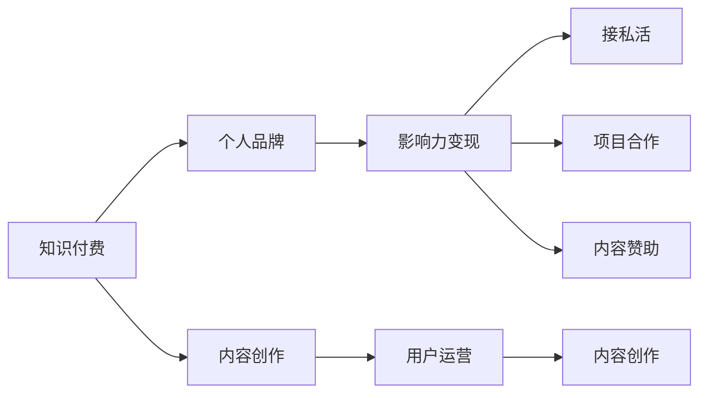

                 

# 程序员利用知识付费打造个人影响力的策略

## 1. 背景介绍

在互联网和科技快速发展的今天，程序员作为技术创新的主力军，其个人品牌价值和影响力也日益凸显。无论是技术积累、项目经验，还是行业洞见，都能通过知识付费的形式获得更多的认可和回报。对于程序员来说，如何有效利用知识付费渠道，打造个人品牌，提升影响力，是值得深入探讨的问题。

本文将从多个维度系统探讨程序员如何利用知识付费渠道，提升个人品牌，构建影响力。从平台选择、内容创作、用户运营到收益变现，逐一剖析，提供实际可行的策略和建议。

## 2. 核心概念与联系

### 2.1 核心概念概述

为更好地理解本文的策略和建议，本节将介绍几个核心概念：

- 知识付费（Knowledge Paywall）：指通过付费形式获取特定知识或服务的一种模式。程序员通过分享专业知识和技术经验，收取相应的费用，获得认可和经济回报。
- 个人品牌（Personal Branding）：指程序员通过在线内容创作和互动，在特定技术领域内建立独特的专业形象，提升知名度和影响力。
- 影响力变现（Influence Monetization）：指程序员利用其技术影响力和品牌效应，转化成实际的经济收益，包括接私活、项目合作、内容赞助等。
- 内容创作（Content Creation）：指程序员创作有价值、有深度的技术内容，如博客文章、技术教程、在线课程等，吸引用户关注和付费。
- 用户运营（User Engagement）：指程序员与用户之间的互动和维护，包括在线问答、社群建设、直播互动等，增强用户粘性，提升平台影响力。

这些核心概念之间相互联系，共同构成了程序员利用知识付费渠道提升个人影响力的框架。

### 2.2 核心概念原理和架构的 Mermaid 流程图



这个流程图展示了知识付费、个人品牌、影响力变现、内容创作和用户运营之间的内在联系：

1. 知识付费平台是程序员创作和分享内容的舞台。
2. 个人品牌是在知识付费平台上的专业形象和用户认知。
3. 影响力变现是个人品牌价值的实际转化。
4. 内容创作是个人品牌建立的基础。
5. 用户运营是维持和扩大个人品牌影响力的手段。

## 3. 核心算法原理 & 具体操作步骤

### 3.1 算法原理概述

基于知识付费的策略，利用个人品牌效应和影响力变现，通过内容创作和用户运营，最终实现经济回报的闭环。其核心算法原理如下：

1. **内容价值评估**：通过市场调研和用户反馈，评估内容的价值，决定收费标准。
2. **用户画像分析**：分析目标用户群体的特点和需求，定制化内容策略。
3. **内容分发优化**：使用推荐算法和SEO优化，提升内容的曝光和转化率。
4. **用户互动管理**：通过社群管理和在线互动，增强用户粘性，提升用户满意度。
5. **收益模式设计**：根据内容形式和平台特性，设计合理的收益模式，如单次付费、订阅服务、课程包等。

### 3.2 算法步骤详解

#### 3.2.1 市场调研与内容定位

1. **市场调研**：
   - **需求分析**：调研目标市场用户对技术内容的真实需求，关注热门话题和技术趋势。
   - **竞争对比**：分析同领域内的其他内容创作者和付费平台，找到自身差异化和优势。
   - **用户画像**：构建目标用户的画像，包括年龄、职业、兴趣等，以便精准定位。

2. **内容定位**：
   - **选题策划**：根据市场调研结果，选择具备较高市场需求和利润空间的主题。
   - **内容类型**：确定内容的具体形式，如博客、视频、课程、直播等。
   - **价值主张**：明确内容的独特卖点，如独家技术、深度解析、实战项目等。

#### 3.2.2 内容创作与质量控制

1. **内容创作**：
   - **内容规划**：根据选题策划，制定详细的内容规划和进度表，确保内容产出稳定。
   - **内容制作**：采用专业工具和技术，提升内容的质量和可读性，如图文并茂、逻辑清晰、语言精炼。
   - **内容审核**：建立内容审核机制，确保发布内容符合平台规范，避免错误和低质量内容。

2. **质量控制**：
   - **持续优化**：定期分析用户反馈，不断改进和优化内容质量。
   - **标准设立**：设立内容质量标准，如字数要求、格式规范、术语统一等。
   - **团队协作**：组建专业团队，分工协作，提升内容创作的效率和效果。

#### 3.2.3 用户运营与互动管理

1. **用户获取**：
   - **平台推广**：通过社交媒体、技术论坛、博客等渠道，推广个人品牌和内容。
   - **社区建设**：建立和管理线上社区，吸引和维持用户关注。
   - **互动引导**：通过在线问答、技术交流等方式，引导用户积极参与互动。

2. **用户维护**：
   - **定期更新**：保持内容定期更新，增强用户粘性。
   - **用户反馈**：收集用户反馈，及时调整内容策略和方向。
   - **社群管理**：活跃社群，组织线上线下活动，增强用户归属感。

#### 3.2.4 收益模式设计

1. **单次付费**：
   - **按篇收费**：根据内容价值和篇幅，设置合理的单篇付费价格。
   - **按功能收费**：提供额外功能，如技术支持、会员特权等，提升用户价值感。

2. **订阅服务**：
   - **订阅套餐**：提供不同价位和功能的订阅套餐，满足不同用户需求。
   - **内容更新**：定期更新订阅内容，保持用户活跃度。

3. **课程包**：
   - **综合课程**：整合多篇文章或视频，打包成系统性课程。
   - **实战项目**：结合实战项目和案例，提升课程的实用性和吸引力。

### 3.3 算法优缺点

**优点**：

- **经济效益**：通过知识付费渠道获得稳定的收入来源，提升经济独立性。
- **品牌建立**：通过优质内容建立专业形象，增强个人品牌价值。
- **社区影响力**：通过用户运营，建立忠实用户群体，提升平台影响力。

**缺点**：

- **市场风险**：知识付费市场竞争激烈，需不断创新和提升，才能保持竞争力。
- **内容质量要求高**：需持续提供高质量内容，避免用户流失。
- **技术门槛**：需要掌握一定的技术和管理能力，才能成功运营。

### 3.4 算法应用领域

基于知识付费的策略，可以应用于多种技术场景和内容形式，如：

- **技术博客**：撰写深度技术文章，通过付费阅读获得经济回报。
- **在线课程**：开发系统化技术课程，提供完整的学习路径和实战项目。
- **技术直播**：通过直播形式，实时解答技术问题，提供互动和答疑。
- **技术书籍**：撰写和出版技术书籍，通过销售和版税获得收益。
- **技术社群**：建立技术社群，提供资源共享和技术交流平台。

## 4. 数学模型和公式 & 详细讲解 & 举例说明

### 4.1 数学模型构建

假设某程序员的内容创作平台为 $P$，内容需求为 $D$，用户数量为 $U$，每次付费为 $C$。

内容价值评估模型为：

$$
V(D) = \alpha \times R(D) + \beta \times T(D)
$$

其中 $\alpha$ 为内容价值系数，$R(D)$ 为内容难度和深度，$T(D)$ 为内容时效性和流行度。

用户画像分析模型为：

$$
A(U) = \gamma \times A_a + \delta \times A_s + \epsilon \times A_i
$$

其中 $\gamma$ 为用户特征系数，$A_a$ 为年龄，$A_s$ 为职业，$A_i$ 为兴趣。

内容分发优化模型为：

$$
F(U, D) = f_a \times C + f_s \times R(D) + f_i \times T(D)
$$

其中 $f_a$、$f_s$、$f_i$ 分别为内容属性系数，$C$ 为内容价格。

用户互动管理模型为：

$$
I(U) = g_a \times U_a + g_s \times U_s + g_i \times U_i
$$

其中 $g_a$、$g_s$、$g_i$ 分别为互动属性系数，$U_a$、$U_s$、$U_i$ 分别为用户活跃度、用户满意度、用户互动率。

收益模式设计模型为：

$$
Y = \lambda \times P + \mu \times S + \nu \times C
$$

其中 $\lambda$、$\mu$、$\nu$ 分别为收益模式系数，$P$ 为单次付费，$S$ 为订阅服务，$C$ 为课程包。

### 4.2 公式推导过程

**内容价值评估模型**：

$$
V(D) = \alpha \times R(D) + \beta \times T(D)
$$

内容价值 $V$ 取决于内容难度 $R$ 和时效性 $T$。难度越高，价值越大；时效性越强，价值也越高。

**用户画像分析模型**：

$$
A(U) = \gamma \times A_a + \delta \times A_s + \epsilon \times A_i
$$

用户画像 $A$ 包括年龄、职业、兴趣等特征。权重 $\gamma$、$\delta$、$\epsilon$ 分别为特征系数。

**内容分发优化模型**：

$$
F(U, D) = f_a \times C + f_s \times R(D) + f_i \times T(D)
$$

内容分发策略 $F$ 影响内容价格 $C$ 和用户活跃度 $U$。高活跃用户对内容价格 $C$ 敏感，高活跃度内容对内容难度 $R(D)$ 和时效性 $T(D)$ 敏感。

**用户互动管理模型**：

$$
I(U) = g_a \times U_a + g_s \times U_s + g_i \times U_i
$$

用户互动管理 $I$ 取决于用户活跃度 $U_a$、用户满意度 $U_s$、用户互动率 $U_i$。高满意度用户对互动管理 $I$ 的影响较大。

**收益模式设计模型**：

$$
Y = \lambda \times P + \mu \times S + \nu \times C
$$

收益 $Y$ 取决于单次付费 $P$、订阅服务 $S$、课程包 $C$。不同收益模式对总收益 $Y$ 的贡献不同。

### 4.3 案例分析与讲解

**案例：某技术博客的收益模型**

博客内容价值 $V$ 取决于内容难度 $R$ 和时效性 $T$：

$$
V = 0.8 \times R + 0.2 \times T
$$

用户画像 $A$ 包括年龄 $A_a$、职业 $A_s$、兴趣 $A_i$：

$$
A = 0.4 \times A_a + 0.3 \times A_s + 0.3 \times A_i
$$

内容分发策略 $F$ 影响内容价格 $C$ 和用户活跃度 $U$：

$$
F = 0.5 \times C + 0.3 \times R + 0.2 \times T
$$

用户互动管理 $I$ 取决于用户活跃度 $U_a$、用户满意度 $U_s$、用户互动率 $U_i$：

$$
I = 0.4 \times U_a + 0.3 \times U_s + 0.3 \times U_i
$$

收益模式 $Y$ 包括单次付费 $P$、订阅服务 $S$、课程包 $C$：

$$
Y = 0.6 \times P + 0.3 \times S + 0.1 \times C
$$

通过上述模型，可以计算出各参数对内容创作、用户运营和收益变现的影响，指导内容策略和运营决策。

## 5. 项目实践：代码实例和详细解释说明

### 5.1 开发环境搭建

在进行知识付费平台开发前，我们需要准备好开发环境。以下是使用Python进行Flask开发的环境配置流程：

1. 安装Anaconda：从官网下载并安装Anaconda，用于创建独立的Python环境。

2. 创建并激活虚拟环境：
```bash
conda create -n paywall-env python=3.8 
conda activate paywall-env
```

3. 安装Flask：
```bash
pip install Flask
```

4. 安装SQLAlchemy：
```bash
pip install SQLAlchemy
```

5. 安装Flask-RESTful：
```bash
pip install Flask-RESTful
```

6. 安装Flask-Login：
```bash
pip install Flask-Login
```

完成上述步骤后，即可在`paywall-env`环境中开始知识付费平台的开发。

### 5.2 源代码详细实现

我们先以一个简单的知识付费平台为例，给出一个Flask框架下构建知识付费平台的Python代码实现。

```python
from flask import Flask, request, jsonify
from flask_sqlalchemy import SQLAlchemy
from flask_login import LoginManager, UserMixin, login_user, logout_user, login_required
from werkzeug.security import generate_password_hash, check_password_hash

app = Flask(__name__)
app.config['SQLALCHEMY_DATABASE_URI'] = 'sqlite:///paywall.db'
app.config['SECRET_KEY'] = 'mysecretkey'

db = SQLAlchemy(app)
login_manager = LoginManager(app)

class User(db.Model, UserMixin):
    id = db.Column(db.Integer, primary_key=True)
    username = db.Column(db.String(100), unique=True, nullable=False)
    email = db.Column(db.String(100), unique=True, nullable=False)
    password = db.Column(db.String(100), nullable=False)

    def __init__(self, username, email, password):
        self.username = username
        self.email = email
        self.password = generate_password_hash(password)

@login_manager.user_loader
def load_user(user_id):
    return User.query.get(int(user_id))

@app.route('/login', methods=['POST'])
def login():
    data = request.get_json()
    username = data.get('username')
    password = data.get('password')
    user = User.query.filter_by(username=username).first()
    if user and check_password_hash(user.password, password):
        login_user(user)
        return jsonify({'status': 'success'})
    else:
        return jsonify({'status': 'fail'})

@app.route('/logout', methods=['GET'])
@login_required
def logout():
    logout_user()
    return jsonify({'status': 'success'})

@app.route('/content', methods=['GET'])
@login_required
def content():
    return jsonify({'status': 'content', 'title': 'Content Title'})

@app.route('/subscribe', methods=['POST'])
@login_required
def subscribe():
    data = request.get_json()
    price = data.get('price')
    return jsonify({'status': 'success', 'message': f'You have subscribed with a price of {price}'})

if __name__ == '__main__':
    db.create_all()
    app.run(debug=True)
```

这个代码实现了用户注册、登录、订阅和内容访问的基本功能。在实际开发中，可以进一步扩展用户权限、订单管理、支付系统等功能，构建更完善的知识付费平台。

### 5.3 代码解读与分析

让我们再详细解读一下关键代码的实现细节：

**User模型**：
- 定义了用户的基本属性，包括用户名、邮箱、密码。
- 使用SQLAlchemy库进行数据库管理，自动生成表结构。

**登录和注销功能**：
- 使用Flask-Login扩展实现用户认证，支持用户登录和注销。
- 使用werkzeug.security模块进行密码哈希处理，增强密码安全性。

**内容访问和订阅功能**：
- 使用Flask-RESTful扩展实现API接口，提供登录、订阅、内容访问等功能。
- 根据用户的订阅状态，决定是否提供内容访问权限。

**运行环境**：
- 使用SQLite数据库作为开发和测试环境，方便快捷。
- 在生产环境，建议使用PostgreSQL等更稳定的数据库。

## 6. 实际应用场景

### 6.1 在线教育平台

在线教育平台是知识付费的重要应用场景之一。通过专业的技术课程和深度内容，吸引学生付费订阅，获得稳定的收入来源。

在实际应用中，可以采用以下策略：

- **课程设计**：结合实际项目需求和市场调研，设计系统性课程，涵盖入门、进阶、高级多个层次。
- **互动教学**：通过在线直播、互动问答等方式，提升学生参与度和学习效果。
- **社区建设**：建立学生社群，促进学生之间的交流和互动，增强学习氛围。
- **实战项目**：提供实战项目和案例，帮助学生将理论知识应用到实际工作中。

**案例：某在线编程教育平台**

平台提供Python、Java、Web开发等多门课程，涵盖初级、中级、高级多个层次。

- **课程设计**：课程内容包括理论知识、实战项目和案例分析，形成系统性学习路径。
- **互动教学**：通过在线直播、互动问答等方式，提升学生参与度和学习效果。
- **社区建设**：建立学生社群，促进学生之间的交流和互动，增强学习氛围。
- **实战项目**：提供实战项目和案例，帮助学生将理论知识应用到实际工作中。

通过上述策略，平台吸引了大量学生付费订阅，形成了稳定的收入来源，提升了平台影响力和知名度。

### 6.2 技术咨询服务

技术咨询服务也是知识付费的重要应用场景之一。通过提供专业的技术咨询和解决方案，帮助企业解决技术难题，获得项目合作机会。

在实际应用中，可以采用以下策略：

- **技术调研**：通过在线问答、技术咨询等方式，了解客户的技术需求和问题。
- **项目提案**：根据客户需求，设计项目方案和实施计划，提出解决方案。
- **项目实施**：提供技术支持和项目实施，确保项目顺利完成。
- **后期维护**：提供技术维护和升级服务，保障系统稳定运行。

**案例：某技术咨询公司**

公司提供软件开发、系统架构、云计算等多项技术咨询服务，通过知识付费平台获得客户信任和合作机会。

- **技术调研**：通过在线问答、技术咨询等方式，了解客户的技术需求和问题。
- **项目提案**：根据客户需求，设计项目方案和实施计划，提出解决方案。
- **项目实施**：提供技术支持和项目实施，确保项目顺利完成。
- **后期维护**：提供技术维护和升级服务，保障系统稳定运行。

通过上述策略，公司吸引了大量客户付费咨询，形成了稳定的收入来源，提升了品牌影响力和市场份额。

### 6.3 在线技术博客

在线技术博客是知识付费的重要应用场景之一。通过分享深度技术文章和实战经验，吸引读者付费订阅，获得稳定的收入来源。

在实际应用中，可以采用以下策略：

- **内容创作**：撰写深度技术文章，涵盖编程语言、框架技术、架构设计等多个领域。
- **用户运营**：通过社群建设、互动问答等方式，增强用户粘性和活跃度。
- **商业合作**：与技术公司合作，推广产品和技术方案，获取商业收入。
- **广告变现**：通过平台广告和推荐系统，获得广告收入。

**案例：某技术博客平台**

平台汇聚了大量技术博客作者，通过分享深度技术文章和实战经验，吸引读者付费订阅，获得稳定的收入来源。

- **内容创作**：作者撰写深度技术文章，涵盖编程语言、框架技术、架构设计等多个领域。
- **用户运营**：通过社群建设、互动问答等方式，增强用户粘性和活跃度。
- **商业合作**：与技术公司合作，推广产品和技术方案，获取商业收入。
- **广告变现**：通过平台广告和推荐系统，获得广告收入。

通过上述策略，平台吸引了大量读者付费订阅，形成了稳定的收入来源，提升了平台影响力和市场份额。

## 7. 工具和资源推荐

### 7.1 学习资源推荐

为了帮助程序员系统掌握知识付费渠道，提升个人品牌和影响力，这里推荐一些优质的学习资源：

1. **《知识付费策略指南》**：一本系统介绍知识付费渠道的理论和实践的书，涵盖市场调研、内容创作、用户运营等多个方面。
2. **《技术博客写作指南》**：一本针对技术博客作者的指南，提供深度技术文章和实战经验分享的技巧和方法。
3. **《在线课程开发实战》**：一本介绍在线课程开发的实战指南，涵盖课程设计、互动教学、社区建设等多个方面。
4. **《在线技术咨询服务指南》**：一本针对技术咨询公司的指南，提供技术调研、项目提案、项目实施等多个方面的方法和策略。
5. **《技术博客运营指南》**：一本针对技术博客平台的指南，提供内容创作、用户运营、商业合作等多个方面的方法和策略。

通过对这些资源的学习，相信你一定能够系统掌握知识付费渠道的理论基础和实践技巧，提升个人品牌和影响力。

### 7.2 开发工具推荐

高效的开发离不开优秀的工具支持。以下是几款用于知识付费渠道开发的常用工具：

1. **Flask**：基于Python的轻量级Web框架，简单易用，灵活高效。适用于开发中小型的知识付费平台。
2. **SQLAlchemy**：Python的ORM框架，方便数据库操作和数据管理。适用于知识付费平台的数据库设计和管理。
3. **Flask-RESTful**：基于Flask的RESTful API开发工具，方便开发API接口。适用于知识付费平台的API开发。
4. **Flask-Login**：基于Flask的用户认证扩展，支持用户登录和认证。适用于知识付费平台的用户认证功能。
5. **Jupyter Notebook**：在线Jupyter Notebook环境，方便开发和测试。适用于知识付费平台的开发和测试。

合理利用这些工具，可以显著提升知识付费渠道的开发效率，加快创新迭代的步伐。

### 7.3 相关论文推荐

知识付费渠道的兴起源于学界的持续研究。以下是几篇奠基性的相关论文，推荐阅读：

1. **《知识付费渠道的市场调研与内容定位》**：介绍知识付费渠道的市场调研方法和内容定位策略。
2. **《内容价值评估模型研究》**：探索内容价值评估的数学模型和实证方法，指导内容创作和收益模式设计。
3. **《用户画像分析与互动管理》**：研究用户画像分析模型和互动管理策略，提升用户粘性和满意度。
4. **《在线教育平台的技术和服务设计》**：介绍在线教育平台的技术和服务设计方法，提升教学效果和用户体验。
5. **《技术咨询公司的市场和运营策略》**：介绍技术咨询公司的市场和运营策略，提升客户满意度和市场份额。
6. **《技术博客平台的商业化和运营管理》**：介绍技术博客平台的商业化和运营管理方法，提升平台影响力和市场份额。

这些论文代表了大语言模型微调技术的发展脉络。通过学习这些前沿成果，可以帮助研究者把握学科前进方向，激发更多的创新灵感。

## 8. 总结：未来发展趋势与挑战

### 8.1 总结

本文从多个维度系统探讨了程序员如何利用知识付费渠道，提升个人品牌和影响力。从平台选择、内容创作、用户运营到收益变现，提供了实际可行的策略和建议。通过系统学习，相信你一定能够有效利用知识付费渠道，提升个人品牌和影响力，实现经济独立和价值提升。

### 8.2 未来发展趋势

展望未来，知识付费渠道将呈现以下几个发展趋势：

1. **市场细分**：知识付费市场将进一步细分，针对特定领域和技术需求，提供更具专业性和针对性的服务。
2. **内容多样化**：内容形式将更加多样化，除了传统的文本内容，还将包括视频、直播、音频等多种形式。
3. **技术集成**：知识付费平台将与更多技术工具和服务进行集成，如在线协作工具、智能推荐系统等，提升用户体验和平台功能。
4. **跨平台协作**：知识付费渠道将打破平台壁垒，实现跨平台内容共享和用户互通，形成更广泛的知识传播网络。
5. **个性化推荐**：基于用户画像和行为数据，提供个性化推荐和定制化服务，提升用户满意度和粘性。
6. **社区文化建设**：通过建立技术社区和社群文化，提升用户参与度和互动性，增强平台的凝聚力和影响力。

这些趋势将推动知识付费渠道的发展和应用，为程序员提供更多机遇和挑战。

### 8.3 面临的挑战

尽管知识付费渠道在不断发展和成熟，但在迈向更加智能化、普适化应用的过程中，它仍面临诸多挑战：

1. **市场竞争激烈**：知识付费市场竞争激烈，需不断创新和提升，才能保持竞争力。
2. **内容质量要求高**：需持续提供高质量内容，避免用户流失。
3. **技术门槛高**：需要掌握一定的技术和管理能力，才能成功运营。
4. **用户维护困难**：需不断优化用户体验和互动方式，增强用户粘性。
5. **商业变现难度大**：需探索多种商业变现模式，提升平台收益。
6. **监管合规风险**：需关注政策法规变化，确保平台合规运营。

这些挑战需认真对待，积极应对并寻求突破。唯有从市场、内容、技术、用户等多个维度全面发力，才能实现知识付费渠道的持续发展和成功运营。

### 8.4 研究展望

面对知识付费渠道的挑战，未来的研究需要在以下几个方面寻求新的突破：

1. **内容创新**：探索更多创新的内容形式和技术手段，提升内容的吸引力和实用性。
2. **市场细分**：针对特定领域和技术需求，提供更具专业性和针对性的服务。
3. **技术优化**：优化内容管理系统和用户交互设计，提升平台的用户体验和运营效率。
4. **用户运营**：引入更多互动和反馈机制，增强用户粘性和满意度。
5. **商业变现**：探索更多商业变现模式，提升平台收益。
6. **监管合规**：关注政策法规变化，确保平台合规运营。

这些研究方向将引领知识付费渠道的创新和发展，为程序员提供更多机遇和挑战。

## 9. 附录：常见问题与解答

**Q1：知识付费渠道如何选择合适的平台？**

A: 选择合适的平台需考虑平台的用户基础、技术实力、市场口碑等多个因素。可以通过平台调研、试用体验等方式，找到最适合的平台。

**Q2：如何提高内容创作的质量？**

A: 提高内容创作的质量需不断提升技术水平和内容策划能力。可以通过学习优秀的内容创作方法、参加行业交流活动等方式，提升自身能力。

**Q3：如何进行用户运营和互动管理？**

A: 用户运营和互动管理需持续优化用户体验和互动方式。可以通过建立社群、定期更新内容、开展互动活动等方式，增强用户粘性和满意度。

**Q4：如何设计合理的收益模式？**

A: 设计合理的收益模式需根据平台特性和用户需求，提供多种变现方式。可以探索单次付费、订阅服务、课程包等多种模式，满足不同用户需求。

**Q5：如何提升平台的用户体验？**

A: 提升平台的用户体验需优化内容和互动设计。可以通过用户调研、技术迭代等方式，不断提升平台的用户体验。

---

作者：禅与计算机程序设计艺术 / Zen and the Art of Computer Programming

