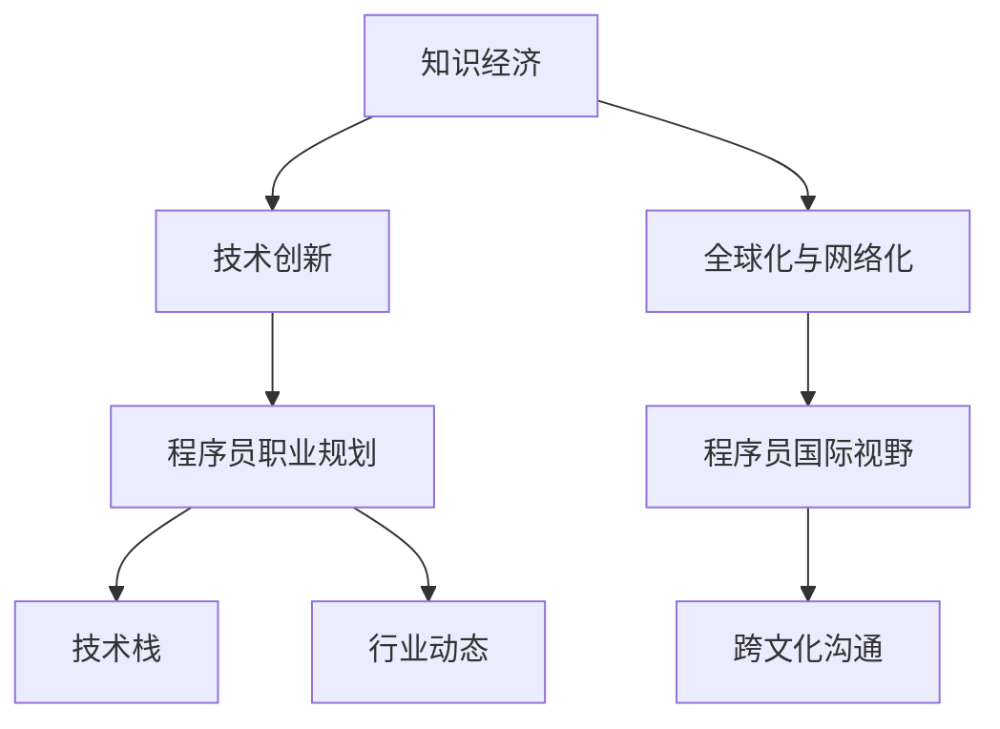

                 

# 程序员在知识经济时代的职业规划

## 1. 背景介绍

在科技飞速发展的今天，我们正处于知识经济的黄金时期。信息技术、人工智能、大数据等新兴技术日益成为推动经济增长的核心力量，程序员作为技术创新的主力军，面临着前所未有的机遇与挑战。如何在知识经济时代实现个人职业的突破和长远发展，是每位程序员都需要深思的问题。

### 1.1 知识经济的特点

#### 1.1.1 高度依赖技术创新
知识经济的核心在于技术创新，科技创新是推动经济发展的主要动力。在这一背景下，程序员需要不断学习新知识，掌握新技术，以应对快速变化的市场需求。

#### 1.1.2 知识密集型产业兴起
知识经济时代，知识密集型产业（如IT、互联网、生物科技等）逐渐成为经济的主导力量。这些产业对技术人才的需求持续增长，为程序员提供了广阔的就业和发展空间。

#### 1.1.3 全球化与网络化并进
随着全球化和网络化的发展，技术人才的跨国流动和远程协作变得更加普遍。程序员需要有国际视野和跨文化沟通能力，以适应全球化发展趋势。

## 2. 核心概念与联系

### 2.1 核心概念概述

- **知识经济**：以知识和信息为关键生产要素，通过技术创新和知识应用驱动经济增长的经济模式。
- **程序员**：具备编程技能，从事软件开发、系统维护、数据分析等技术工作的人才。
- **职业规划**：对职业生涯进行科学合理的安排和规划，包括职业定位、技能提升、职业发展路径选择等。
- **技术栈**：程序员所需掌握的技术工具、语言、框架等技能集合。
- **行业动态**：计算机行业的发展趋势、技术热点、市场需求变化等。

### 2.2 核心概念原理和架构的 Mermaid 流程图



## 3. 核心算法原理 & 具体操作步骤

### 3.1 算法原理概述

程序员在知识经济时代的职业规划，可以通过一系列的算法和步骤来实施，以确保其职业发展路径的科学性和有效性。

### 3.2 算法步骤详解

#### 3.2.1 自我评估与职业定位
- **兴趣与价值观**：通过问卷、心理测试等方式，了解自己的兴趣和价值观，确定适合的职业方向。
- **技能与经验**：评估当前技术栈水平，识别出需要提升或学习的新技能。
- **市场需求**：调研当前市场需求，了解热门技术领域和岗位。

#### 3.2.2 职业目标设定
- **短期目标**：设定1-2年内需要实现的具体技能提升和职位晋升目标。
- **长期目标**：设定3-5年内的职业规划目标，如成为技术专家、项目经理、架构师等。

#### 3.2.3 技术栈升级
- **学习规划**：制定学习计划，选择合适的课程、书籍、在线资源等进行系统学习。
- **项目实践**：通过实际项目提升实战经验，积累项目管理和团队协作能力。
- **社区参与**：积极参与技术社区，分享经验，结识业内专家，拓展职业人脉。

#### 3.2.4 职业路径选择
- **技术路线**：选择主攻的技术方向（如前端、后端、全栈），进行深度学习。
- **管理路线**：选择管理岗位，从基层开始积累项目管理经验，逐步晋升。

#### 3.2.5 职业发展策略
- **持续学习**：保持终身学习态度，及时掌握新技术、新知识。
- **职业转型**：根据市场变化和个人兴趣，灵活调整职业发展方向。
- **跨行业发展**：拓宽职业视野，适应跨行业技术应用和岗位需求。

### 3.3 算法优缺点

#### 3.3.1 优点
- **科学性**：通过系统化的规划和步骤，确保职业发展路径的科学性和可行性。
- **全面性**：综合考虑个人兴趣、技能提升、市场需求等因素，制定全面的职业规划。
- **灵活性**：根据市场动态和个人发展情况，灵活调整规划，保持职业发展的持续性。

#### 3.3.2 缺点
- **时间成本**：职业规划和技能提升需要一定的时间投入，短期内可能见效不明显。
- **资源限制**：需要投入一定的学习资源和实践机会，对经济条件有一定的要求。
- **市场风险**：市场需求和行业发展不确定性，可能影响职业规划的有效性。

### 3.4 算法应用领域

程序员在知识经济时代的职业规划算法，不仅适用于个人职业发展，还广泛应用于企业技术团队的人才培养和管理。企业可以根据该算法，制定技术人才发展规划，提升团队整体竞争力。

## 4. 数学模型和公式 & 详细讲解

### 4.1 数学模型构建

程序员在知识经济时代的职业规划，可以通过数学模型进行量化分析。

#### 4.1.1 职业价值函数
设 $V(t)$ 为程序员在第 $t$ 年的职业价值，定义为：

$$ V(t) = \sum_{i=1}^{n} w_i f_i(t) $$

其中，$w_i$ 为第 $i$ 项技能的重要性权重，$f_i(t)$ 为第 $i$ 项技能在第 $t$ 年的价值函数。

#### 4.1.2 技能提升模型
设 $f_i(t+1)$ 为第 $i$ 项技能在 $t+1$ 年的价值函数，$g_i(t)$ 为第 $i$ 项技能在 $t$ 年的提升速度，则：

$$ f_i(t+1) = f_i(t) + g_i(t) $$

#### 4.1.3 市场需求模型
设 $d_i(t)$ 为第 $i$ 项技能在第 $t$ 年的市场需求指数，$w_i$ 为第 $i$ 项技能的市场权重，则：

$$ d_i(t) = \sum_{j=1}^{m} a_{ij} c_j(t) $$

其中，$a_{ij}$ 为技能 $i$ 和市场需求 $j$ 的关联系数，$c_j(t)$ 为第 $j$ 项市场需求在第 $t$ 年的变化率。

### 4.2 公式推导过程

#### 4.2.1 职业价值函数推导
通过将技能提升和市场需求模型代入职业价值函数，可以得到：

$$ V(t+1) = \sum_{i=1}^{n} w_i (f_i(t) + g_i(t)) = V(t) + \sum_{i=1}^{n} w_i g_i(t) $$

设 $R(t)$ 为职业价值提升率，则：

$$ R(t) = \frac{V(t+1) - V(t)}{V(t)} = \sum_{i=1}^{n} w_i \frac{g_i(t)}{V(t)} $$

#### 4.2.2 技能提升模型推导
由技能提升模型可知，技能提升速度 $g_i(t)$ 受多种因素影响，如学习效率、工作环境等。设 $g_i(t) = k_i e^{-\lambda_i t}$，其中 $k_i$ 为初始提升速度，$\lambda_i$ 为衰减系数，则：

$$ f_i(t+1) = f_i(t) + k_i e^{-\lambda_i t} $$

#### 4.2.3 市场需求模型推导
市场需求模型中，市场需求指数 $d_i(t)$ 受多种因素影响，如技术发展、行业变化等。设 $c_j(t) = h_j e^{-\gamma_j t}$，其中 $h_j$ 为初始市场需求变化率，$\gamma_j$ 为衰减系数，则：

$$ d_i(t) = \sum_{j=1}^{m} a_{ij} h_j e^{-\gamma_j t} $$

### 4.3 案例分析与讲解

假设某程序员当前的技能组合为 [Python, Java, AI]，当前职业价值为 $V(0)=1000$。市场需求模型中，Python 的市场需求指数 $d_{Python}(0)=0.5$，Java 的市场需求指数 $d_{Java}(0)=0.3$，AI 的市场需求指数 $d_{AI}(0)=0.2$。技能提升模型中，Python 的提升速度 $g_{Python}(0)=0.1$，Java 的提升速度 $g_{Java}(0)=0.2$，AI 的提升速度 $g_{AI}(0)=0.3$。

假设市场需求变化率 $h_j(t)=0.1 e^{-0.1 t}$，技能提升衰减系数 $\lambda_i=0.1$，技能提升初始速度 $k_i=0.1$。根据上述模型，可以计算得到该程序员在不同时间点的职业价值变化情况。

## 5. 项目实践：代码实例和详细解释说明

### 5.1 开发环境搭建

#### 5.1.1 编程语言与工具
- **编程语言**：Python、JavaScript、Java、C++ 等。
- **开发工具**：Visual Studio Code、IntelliJ IDEA、Eclipse、PyCharm 等。
- **版本控制**：Git、SVN、Mercurial 等。
- **开发框架**：Spring、Django、Flask 等。
- **数据库**：MySQL、PostgreSQL、MongoDB 等。

#### 5.1.2 环境配置
- **Python环境**：安装 Python 3.x，配置虚拟环境（virtualenv）。
- **IDE配置**：配置编译器、调试器、代码提示等功能。
- **版本控制**：配置 Git 仓库，建立代码仓库和分支管理机制。
- **测试工具**：配置 JUnit、PyTest、Selenium 等测试工具。

### 5.2 源代码详细实现

#### 5.2.1 项目结构设计
- **项目目录**：根目录（project）、src、test、data 等。
- **模块划分**：项目主要分为数据层、业务层、服务层、UI 层等。

#### 5.2.2 代码实现
- **数据层**：设计数据库结构，实现数据读写功能。
- **业务层**：实现核心业务逻辑，包括数据处理、算法实现、异常处理等。
- **服务层**：设计 RESTful API，实现服务调用和数据传输。
- **UI 层**：实现前端页面，通过 API 获取服务数据，展示用户界面。

#### 5.2.3 代码实现示例
- **数据层代码**：
```python
import mysql.connector

# 连接数据库
cnx = mysql.connector.connect(user='username', password='password',
                              host='localhost', database='project')
```

- **业务层代码**：
```python
from sklearn.ensemble import RandomForestClassifier

# 加载数据
X, y = load_data()

# 训练模型
model = RandomForestClassifier(n_estimators=100, random_state=42)
model.fit(X, y)
```

- **服务层代码**：
```python
from flask import Flask, jsonify

app = Flask(__name__)

@app.route('/api/data', methods=['GET'])
def get_data():
    data = load_data()
    return jsonify(data)
```

- **UI 层代码**：
```javascript
// 前端代码
console.log(data);
```

### 5.3 代码解读与分析

#### 5.3.1 数据层
数据层主要负责与数据库的交互，实现数据的读写功能。通过使用 MySQL 数据库，可以高效地存储和查询大量数据。

#### 5.3.2 业务层
业务层是核心代码实现的部分，通过使用机器学习模型（如随机森林），实现对数据的分析和预测。

#### 5.3.3 服务层
服务层通过设计 RESTful API，实现数据和服务之间的交互。Flask 框架提供了简单易用的接口，方便与前端进行数据传输。

#### 5.3.4 UI 层
UI 层主要负责展示用户界面，通过 AJAX 技术，实时获取后端数据并进行渲染。

### 5.4 运行结果展示

#### 5.4.1 数据层
- **数据库查询**：通过 SQL 语句查询数据库，获取所需数据。

#### 5.4.2 业务层
- **模型预测**：使用训练好的随机森林模型，对新数据进行预测。

#### 5.4.3 服务层
- **API调用**：通过 Flask 框架，设计 RESTful API，实现数据传输。

#### 5.4.4 UI 层
- **实时渲染**：使用 AJAX 技术，实时获取服务层数据，并进行前端渲染。

## 6. 实际应用场景

### 6.1 智能推荐系统

#### 6.1.1 需求背景
智能推荐系统广泛应用于电商平台、社交网络、在线视频等场景，旨在根据用户行为和兴趣，推荐最相关的商品、内容等。

#### 6.1.2 技术实现
程序员可以通过设计推荐算法、构建数据仓库、实现推荐引擎等技术手段，构建智能推荐系统。通过不断优化推荐算法，提升推荐效果，提高用户体验。

### 6.2 人工智能辅助医疗

#### 6.2.1 需求背景
人工智能辅助医疗通过分析医学影像、病历记录等数据，辅助医生进行疾病诊断和治疗决策。

#### 6.2.2 技术实现
程序员可以通过深度学习、自然语言处理等技术，构建 AI 辅助医疗系统。通过数据预处理、特征提取、模型训练等步骤，实现医学影像分析、病历记录理解等功能。

### 6.3 自动化测试系统

#### 6.3.1 需求背景
自动化测试系统通过模拟用户操作，自动执行软件测试用例，提高测试效率，减少人工成本。

#### 6.3.2 技术实现
程序员可以通过设计测试用例、构建测试框架、实现测试驱动开发等技术手段，构建自动化测试系统。通过不断优化测试策略，提高测试覆盖率和测试质量。

### 6.4 未来应用展望

#### 6.4.1 技术趋势
- **人工智能**：人工智能技术的普及和应用，将带来更多智能化应用场景。
- **大数据**：大数据技术的发展，将为程序员提供更多数据支持和算法优化空间。
- **区块链**：区块链技术的成熟，将为程序员带来新的应用方向，如智能合约、去中心化应用等。

#### 6.4.2 行业应用
- **互联网行业**：软件开发、系统维护、数据分析等技术岗位需求持续增长。
- **医疗行业**：AI 辅助医疗、电子病历处理等技术应用前景广阔。
- **金融行业**：金融科技、智能投顾、风险管理等技术应用逐渐普及。

## 7. 工具和资源推荐

### 7.1 学习资源推荐

#### 7.1.1 在线课程
- **Coursera**：提供来自世界顶尖大学的在线课程，覆盖计算机科学、数据科学、人工智能等多个领域。
- **edX**：提供来自全球顶尖大学的免费在线课程，涵盖计算机编程、软件工程等课程。
- **Udacity**：提供高质量的在线课程，涵盖机器学习、深度学习、计算机视觉等课程。

#### 7.1.2 书籍推荐
- **《深入理解计算机系统》**：经典计算机系统教材，涵盖计算机组成、操作系统、编译原理等内容。
- **《代码大全》**：软件开发经典之作，介绍高效的软件开发实践和技巧。
- **《机器学习实战》**：机器学习入门经典教材，涵盖算法实现和案例分析。

#### 7.1.3 技术博客
- **Hacker News**：技术社区，涵盖前沿技术、开源项目、编程技巧等内容。
- **Medium**：技术博客平台，提供高质量的技术文章和社区讨论。
- **Stack Overflow**：问答社区，涵盖编程语言、算法实现、技术问题等。

### 7.2 开发工具推荐

#### 7.2.1 IDE
- **Visual Studio Code**：轻量级、功能强大的代码编辑器，支持多种语言和插件扩展。
- **IntelliJ IDEA**：Java 开发利器，提供强大的代码自动补全、调试等功能。
- **Eclipse**：Java 和 Web 开发平台，支持多种插件和框架。

#### 7.2.2 版本控制
- **Git**：最流行的版本控制系统，支持分布式版本控制和远程协作。
- **SVN**：集中式版本控制系统，适合团队协作和代码管理。
- **Mercurial**：轻量级的版本控制系统，支持快速分支和合并。

#### 7.2.3 测试工具
- **JUnit**：Java 单元测试框架，支持测试驱动开发。
- **PyTest**：Python 单元测试框架，支持模块测试、测试套件等功能。
- **Selenium**：自动化测试工具，支持浏览器自动化测试。

#### 7.2.4 开发框架
- **Spring**：Java 企业级开发框架，提供完整的框架支持。
- **Django**：Python Web 开发框架，支持高效开发和自动化管理。
- **Flask**：Python Web 开发框架，适合快速开发和灵活扩展。

#### 7.2.5 数据库
- **MySQL**：经典关系型数据库，支持高效的数据存储和查询。
- **PostgreSQL**：开源关系型数据库，支持复杂的数据管理和查询。
- **MongoDB**：NoSQL 数据库，适合非结构化数据存储和查询。

## 8. 总结：未来发展趋势与挑战

### 8.1 研究成果总结

程序员在知识经济时代的职业规划，是个人职业发展的重要指引。通过科学的职业规划，程序员能够更好地适应市场需求，提升个人竞争力，实现职业成长。

### 8.2 未来发展趋势

#### 8.2.1 技术前沿
- **深度学习**：深度学习技术的普及和应用，将带来更多智能化应用场景。
- **大数据**：大数据技术的发展，将为程序员提供更多数据支持和算法优化空间。
- **人工智能**：人工智能技术的成熟，将带来更多的智能应用和创新。

#### 8.2.2 行业应用
- **互联网行业**：软件开发、系统维护、数据分析等技术岗位需求持续增长。
- **医疗行业**：AI 辅助医疗、电子病历处理等技术应用前景广阔。
- **金融行业**：金融科技、智能投顾、风险管理等技术应用逐渐普及。

### 8.3 面临的挑战

#### 8.3.1 技术挑战
- **技术栈更新**：新技术层出不穷，程序员需要不断学习新技术，保持竞争力。
- **项目复杂度**：大型项目和复杂系统的开发和维护，需要更高的技术能力和团队协作能力。
- **数据安全**：数据安全和隐私保护，成为程序员面临的重要挑战。

#### 8.3.2 职业发展
- **职业转型**：技术栈更新快，需要不断调整职业方向。
- **职业倦怠**：长时间高强度工作，可能导致职业倦怠，需要适时调整和休息。
- **职业伦理**：技术应用需要遵循伦理规范，避免技术滥用和误用。

### 8.4 研究展望

#### 8.4.1 技术创新
- **技术栈融合**：不同技术栈的融合和协同，带来新的创新和应用场景。
- **跨领域应用**：跨领域技术的融合，带来更多创新应用。

#### 8.4.2 职业发展
- **终身学习**：保持终身学习态度，持续提升技术和知识水平。
- **多元化发展**：拓宽职业视野，适应不同领域的技术应用。

## 9. 附录：常见问题与解答

### 9.1 常见问题

#### 9.1.1 如何选择合适的技术栈？

答：选择合适的技术栈需要考虑项目需求、团队技术背景、开发成本等多个因素。通过调研市场需求和技术趋势，选择最适合的技术栈进行开发。

#### 9.1.2 如何提高编程效率？

答：提高编程效率可以通过工具辅助、代码优化、自动化测试等手段。使用高效的工具和框架，进行代码重构和优化，实现自动化测试，提高开发效率。

#### 9.1.3 如何应对技术快速变化？

答：应对技术快速变化，需要不断学习新知识，参加技术交流和培训。及时掌握新技术、新工具，保持技术领先优势。

#### 9.1.4 如何管理项目进度？

答：项目管理可以通过敏捷开发、Scrum 方法等手段进行。通过定期回顾和反馈，及时调整项目计划和进度，确保项目按时完成。

---

作者：禅与计算机程序设计艺术 / Zen and the Art of Computer Programming

