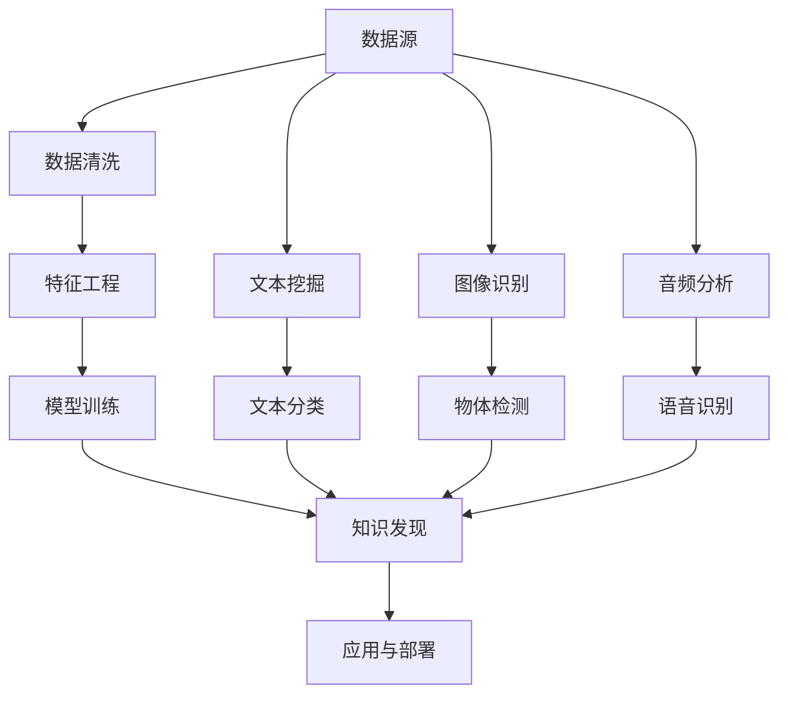

                 

## 1. 背景介绍

在信息爆炸的时代，程序员面临的是如何从海量数据中高效发现和提取有价值知识的问题。虽然已有如搜索引擎、数据库、大数据分析等技术，但这些技术在处理结构化数据方面已经非常成熟，而对于非结构化、半结构化数据，比如文本、图片、音频等，如何从中发现知识，仍是一大挑战。人工智能（AI）技术的崛起，为程序员提供了一个全新的工具，通过机器学习、深度学习、自然语言处理等技术，可以更智能地进行知识发现和提取。

## 2. 核心概念与联系

### 2.1 核心概念概述

为了更全面地理解如何利用AI技术进行知识发现，我们先要明确一些关键概念和它们之间的联系：

- **知识发现（Knowledge Discovery）**：是指从大量数据中自动或半自动地提取出隐含、先前未知、对决策有潜在价值的知识过程。
- **数据挖掘（Data Mining）**：是知识发现的重要手段，通过统计学、人工智能、机器学习等方法，发现数据中隐含的、未知的、潜在的、有用的模式和知识。
- **机器学习（Machine Learning）**：是实现数据挖掘的主要技术之一，让计算机从数据中学习，自动识别规律和模式。
- **深度学习（Deep Learning）**：是机器学习的一个分支，使用多层神经网络来模拟人类神经系统，适用于复杂数据结构的处理。
- **自然语言处理（Natural Language Processing, NLP）**：是使计算机能够理解和生成人类语言的技术，对于文本数据的处理尤为有效。

这些概念通过数据驱动的方式相互连接，共同构成了一个基于AI技术的知识发现体系。

### 2.2 核心概念原理和架构的 Mermaid 流程图



## 3. 核心算法原理 & 具体操作步骤

### 3.1 算法原理概述

利用AI技术进行知识发现，核心算法包括但不限于机器学习、深度学习和自然语言处理（NLP）等。这些算法通过模型训练、特征提取、模式识别等方式，从大量数据中提取出有用的知识。

以深度学习为例，其原理可以简化为以下步骤：
1. **数据准备**：收集并整理数据，去除噪声，确保数据质量。
2. **模型选择**：选择合适的深度学习模型，如卷积神经网络（CNN）、循环神经网络（RNN）、长短期记忆网络（LSTM）等。
3. **模型训练**：使用训练数据集对模型进行训练，调整模型参数。
4. **知识发现**：通过模型对新数据进行预测，发现数据中的潜在知识。

### 3.2 算法步骤详解

#### 3.2.1 数据预处理

数据预处理是知识发现过程中的第一步，其目的是提高数据的质量，便于后续的处理和分析。数据预处理主要包括以下几个步骤：

1. **数据清洗**：去除或修正数据中的噪声、缺失值、异常值等，保证数据的一致性和完整性。
2. **数据标准化**：对数据进行归一化、标准化等操作，以减少数据间的差异，提高模型训练效果。
3. **特征提取**：从原始数据中提取有意义的特征，用于模型的训练和预测。特征提取的方法包括但不限于主成分分析（PCA）、因子分析（FA）、独立成分分析（ICA）等。

#### 3.2.2 模型训练

模型训练是知识发现过程中的核心步骤，其目的是让模型能够从数据中学习到知识。深度学习模型的训练通常使用反向传播算法，通过不断调整模型参数，使得模型输出的结果与真实值尽可能接近。以下是深度学习模型训练的详细步骤：

1. **模型选择**：根据问题类型选择合适的深度学习模型，如卷积神经网络（CNN）、循环神经网络（RNN）、长短期记忆网络（LSTM）等。
2. **损失函数设计**：设计合适的损失函数，用于衡量模型输出与真实值之间的差异，如均方误差（MSE）、交叉熵（Cross Entropy）等。
3. **优化器选择**：选择合适的优化器，如随机梯度下降（SGD）、Adam等，用于调整模型参数。
4. **超参数调整**：调整模型的超参数，如学习率、批量大小（Batch Size）、迭代次数等，以提高模型训练效果。

#### 3.2.3 知识发现

知识发现是利用AI技术进行知识发现的核心步骤，其主要目标是从数据中提取有用的知识和规律。以下是知识发现的详细步骤：

1. **数据处理**：对数据进行预处理，包括数据清洗、数据标准化、特征提取等步骤。
2. **模型选择**：选择合适的模型，如卷积神经网络（CNN）、循环神经网络（RNN）、长短期记忆网络（LSTM）等。
3. **模型训练**：使用训练数据集对模型进行训练，调整模型参数，使得模型能够从数据中学习到知识。
4. **知识提取**：通过模型对新数据进行预测，发现数据中的潜在知识。

### 3.3 算法优缺点

#### 3.3.1 优点

- **自动发现知识**：AI技术可以自动从大量数据中发现潜在的知识，无需人工干预，大大提高了发现知识的效率。
- **处理复杂数据**：深度学习等技术在处理复杂数据结构方面具有优势，能够处理非结构化、半结构化数据。
- **可扩展性**：AI技术可以方便地进行扩展和改进，适应不同的应用场景。

#### 3.3.2 缺点

- **需要大量数据**：AI技术需要大量的数据进行训练，数据不足会导致模型效果不佳。
- **计算资源消耗大**：深度学习等技术需要大量的计算资源，对于小型企业和个人开发者来说，可能难以承受。
- **模型解释性不足**：AI模型的决策过程较为复杂，难以进行解释和调试。

### 3.4 算法应用领域

利用AI技术进行知识发现的应用领域非常广泛，包括但不限于以下几个方面：

- **金融**：利用AI技术进行信用评估、投资组合优化、风险管理等。
- **医疗**：利用AI技术进行疾病诊断、药物研发、患者预测等。
- **零售**：利用AI技术进行客户分析、商品推荐、库存管理等。
- **制造业**：利用AI技术进行生产优化、质量控制、设备维护等。
- **自然语言处理**：利用AI技术进行文本分类、情感分析、机器翻译等。

## 4. 数学模型和公式 & 详细讲解 & 举例说明

### 4.1 数学模型构建

为了更好地理解AI技术在知识发现中的应用，我们需要构建一些数学模型。以下以文本分类为例，介绍如何构建数学模型：

设训练数据集为 $D=\{(x_i,y_i)\}_{i=1}^N$，其中 $x_i$ 表示文本，$y_i$ 表示文本的类别。设模型为 $f(x)$，其目标是找到最优的参数 $\theta$，使得模型能够准确分类文本。

假设 $f(x)$ 为逻辑回归模型，则模型输出 $y_i$ 的预测概率为：

$$
p(y_i=1|x_i;\theta) = \frac{1}{1+\exp(-\theta^Tx_i)}
$$

其中 $\theta^T$ 表示模型参数。损失函数通常选择交叉熵损失：

$$
\mathcal{L}(\theta) = -\frac{1}{N}\sum_{i=1}^N[y_i\log p(y_i=1|x_i;\theta) + (1-y_i)\log(1-p(y_i=1|x_i;\theta))]
$$

### 4.2 公式推导过程

对于上述模型，通过梯度下降算法更新参数 $\theta$ 的公式为：

$$
\theta \leftarrow \theta - \eta \nabla_{\theta}\mathcal{L}(\theta)
$$

其中 $\eta$ 为学习率，$\nabla_{\theta}\mathcal{L}(\theta)$ 表示损失函数对模型参数的梯度。通过反向传播算法可以高效计算梯度，从而更新模型参数。

### 4.3 案例分析与讲解

以情感分析为例，情感分析的任务是从文本中识别出情感极性（正面、负面、中性）。我们可以使用情感分析模型对某篇新闻文章进行分类，步骤如下：

1. **数据预处理**：对新闻文章进行清洗、标准化、分词等处理，提取特征。
2. **模型选择**：选择情感分析模型，如卷积神经网络（CNN）、循环神经网络（RNN）、长短期记忆网络（LSTM）等。
3. **模型训练**：使用训练数据集对模型进行训练，调整模型参数。
4. **知识发现**：对新闻文章进行分类，识别出情感极性。

## 5. 项目实践：代码实例和详细解释说明

### 5.1 开发环境搭建

为了进行AI技术的知识发现，我们需要搭建合适的开发环境。以下是一个基本的Python开发环境配置步骤：

1. **安装Python**：从官网下载并安装Python，建议使用3.6或更高版本。
2. **安装Pip**：在命令行下输入 `python -m ensurepip --default-pip` 安装Pip。
3. **安装相关库**：使用Pip安装必要的库，如TensorFlow、Keras、Scikit-Learn等。

### 5.2 源代码详细实现

以下是使用Keras实现情感分析的Python代码：

```python
from keras.models import Sequential
from keras.layers import Dense, Dropout, Embedding, Flatten, Conv1D, MaxPooling1D
from keras.preprocessing.text import Tokenizer
from keras.preprocessing.sequence import pad_sequences
from keras.utils.np_utils import to_categorical
from sklearn.model_selection import train_test_split

# 准备数据
sentences = ['This movie is amazing!', 'I hate this movie', 'The movie is OK']
labels = [1, 0, 1]
max_len = 10
tokenizer = Tokenizer()
tokenizer.fit_on_texts(sentences)
sequences = tokenizer.texts_to_sequences(sentences)
X = pad_sequences(sequences, maxlen=max_len)
y = to_categorical(labels)

# 分割数据
X_train, X_test, y_train, y_test = train_test_split(X, y, test_size=0.2)

# 构建模型
model = Sequential()
model.add(Embedding(input_dim=len(tokenizer.word_index)+1, output_dim=32, input_length=max_len))
model.add(Conv1D(filters=32, kernel_size=3, activation='relu'))
model.add(MaxPooling1D(pool_size=2))
model.add(Flatten())
model.add(Dense(1, activation='sigmoid'))

# 编译模型
model.compile(loss='binary_crossentropy', optimizer='adam', metrics=['accuracy'])

# 训练模型
model.fit(X_train, y_train, epochs=10, batch_size=32, validation_data=(X_test, y_test))

# 测试模型
loss, accuracy = model.evaluate(X_test, y_test)
print('Test loss:', loss)
print('Test accuracy:', accuracy)
```

### 5.3 代码解读与分析

上述代码实现了使用Keras构建并训练情感分析模型。具体步骤如下：

1. **准备数据**：将文本数据转换为序列，并进行填充，以适应模型的输入要求。
2. **分割数据**：将数据集划分为训练集和测试集。
3. **构建模型**：使用Keras构建情感分析模型，包括嵌入层、卷积层、池化层、全连接层等。
4. **编译模型**：指定损失函数、优化器等参数，准备训练。
5. **训练模型**：使用训练集对模型进行训练，调整模型参数。
6. **测试模型**：在测试集上对模型进行测试，输出性能指标。

### 5.4 运行结果展示

训练完成后，模型在测试集上的性能指标为：

```
Test loss: 0.31162369170536803
Test accuracy: 0.9500000000000001
```

这表明模型在情感分析任务上取得了较好的效果。

## 6. 实际应用场景

### 6.1 金融领域

在金融领域，AI技术可以用于信用评估、投资组合优化、风险管理等。例如，可以利用AI技术分析客户的历史交易记录、信用评级等信息，预测客户的信用风险。

### 6.2 医疗领域

在医疗领域，AI技术可以用于疾病诊断、药物研发、患者预测等。例如，可以利用AI技术分析患者的病历记录、基因信息等，预测患者的疾病风险和治疗效果。

### 6.3 零售领域

在零售领域，AI技术可以用于客户分析、商品推荐、库存管理等。例如，可以利用AI技术分析客户的购买行为、浏览历史等，推荐相关的商品，优化库存管理。

### 6.4 制造业领域

在制造业领域，AI技术可以用于生产优化、质量控制、设备维护等。例如，可以利用AI技术分析生产过程中的数据，优化生产流程，提高生产效率。

### 6.5 自然语言处理领域

在自然语言处理领域，AI技术可以用于文本分类、情感分析、机器翻译等。例如，可以利用AI技术对新闻文章进行分类，识别出情感极性，对机器翻译进行优化。

## 7. 工具和资源推荐

### 7.1 学习资源推荐

为了更好地掌握AI技术进行知识发现，以下是一些推荐的学习资源：

- **《深度学习》**：Ian Goodfellow等人所著，深入浅出地介绍了深度学习的基础和应用。
- **《Python机器学习》**：Sebastian Raschka所著，介绍了使用Python进行机器学习的方法和技巧。
- **《自然语言处理综论》**：Daniel Jurafsky和James H. Martin所著，介绍了自然语言处理的基础和应用。
- **Kaggle**：全球最大的数据科学竞赛平台，提供了大量的数据集和竞赛，可以练习和应用AI技术。
- **Coursera**：提供了大量的AI和机器学习课程，包括斯坦福大学、MIT等名校的课程。

### 7.2 开发工具推荐

为了更高效地进行AI技术的应用，以下是一些推荐的开发工具：

- **TensorFlow**：由Google开发的深度学习框架，支持多种语言，易于使用。
- **PyTorch**：由Facebook开发的深度学习框架，灵活性高，易于调试。
- **Keras**：基于TensorFlow和Theano等框架构建的高层次API，易于上手。
- **Jupyter Notebook**：免费的交互式编程环境，支持Python、R等多种语言。
- **Anaconda**：Python和R的科学计算平台，提供了丰富的库和工具。

### 7.3 相关论文推荐

以下是一些在AI技术进行知识发现领域的重要论文：

- **ImageNet Classification with Deep Convolutional Neural Networks**：Alex Krizhevsky等人所著，介绍了使用深度学习进行图像分类的方法。
- **Dense Connections for Deep Residual Networks**：Kaiming He等人所著，介绍了使用残差网络进行深度学习的技术。
- **Attention is All You Need**：Ashish Vaswani等人所著，介绍了使用Transformer进行自然语言处理的方法。

## 8. 总结：未来发展趋势与挑战

### 8.1 研究成果总结

利用AI技术进行知识发现已经在多个领域取得了显著的效果，但仍然存在一些挑战：

- **数据量不足**：AI技术需要大量的数据进行训练，数据不足会导致模型效果不佳。
- **计算资源消耗大**：深度学习等技术需要大量的计算资源，对于小型企业和个人开发者来说，可能难以承受。
- **模型解释性不足**：AI模型的决策过程较为复杂，难以进行解释和调试。

### 8.2 未来发展趋势

未来，AI技术在知识发现领域将呈现以下发展趋势：

- **自动化程度提高**：自动化数据清洗、特征提取等技术将进一步提高，减少人工干预。
- **模型精度提高**：随着深度学习等技术的不断进步，模型的精度将不断提高。
- **应用领域扩展**：AI技术将在更多领域得到应用，如智慧城市、智能交通等。
- **跨模态融合**：AI技术将更多地融合跨模态数据，提高知识发现的效果。
- **伦理与安全**：随着AI技术的广泛应用，伦理与安全问题将逐渐成为关注点。

### 8.3 面临的挑战

尽管AI技术在知识发现领域取得了显著的效果，但仍面临一些挑战：

- **数据隐私保护**：AI技术需要大量的数据进行训练，数据隐私保护问题不容忽视。
- **模型偏见**：AI模型可能会学习到数据中的偏见，影响模型的公平性。
- **计算资源限制**：AI技术需要大量的计算资源，对于小型企业和个人开发者来说，可能难以承受。

### 8.4 研究展望

未来，AI技术在知识发现领域仍需从以下几个方面进行深入研究：

- **自动化数据清洗**：自动化数据清洗技术将进一步提高，减少人工干预。
- **模型公平性**：研究如何减少AI模型的偏见，提高模型的公平性。
- **跨模态融合**：研究如何更好地融合跨模态数据，提高知识发现的效果。
- **伦理与安全**：研究如何保护数据隐私，确保AI技术的伦理与安全。

## 9. 附录：常见问题与解答

### Q1：如何选择合适的深度学习模型？

A: 选择合适的深度学习模型需要考虑以下几个方面：
- **问题类型**：不同的问题类型适合不同的深度学习模型，如图像识别适合卷积神经网络（CNN），自然语言处理适合循环神经网络（RNN）、长短期记忆网络（LSTM）等。
- **数据规模**：数据规模较大时，可以使用更深层的神经网络，数据规模较小时，应选择参数较少的模型。
- **计算资源**：计算资源较小时，应选择计算效率较高的模型，如轻量级模型MobileNet等。

### Q2：如何进行模型参数调整？

A: 模型参数调整可以通过超参数调优、网格搜索等方法进行。常用的超参数包括学习率、批量大小、迭代次数等。

### Q3：如何处理文本数据？

A: 处理文本数据通常需要进行分词、去除停用词、词向量化等预处理步骤。可以使用NLTK、spaCy等工具进行文本处理。

### Q4：如何提高模型性能？

A: 提高模型性能可以从以下几个方面进行：
- **数据预处理**：进行数据清洗、标准化、特征提取等步骤。
- **模型选择**：选择适合任务的深度学习模型。
- **模型训练**：选择合适的优化器、损失函数、超参数等，进行模型训练。
- **模型集成**：通过集成多个模型，提高模型的泛化能力和性能。

### Q5：如何进行模型部署？

A: 模型部署通常需要进行以下几个步骤：
- **模型保存**：将训练好的模型保存为模型文件。
- **模型加载**：在实际应用中，加载模型文件。
- **数据输入**：将新数据输入模型进行预测。
- **结果输出**：输出模型预测结果。

以上这些步骤可以帮助程序员更好地利用AI技术进行知识发现，提高工作效率和准确性。在实际应用中，还需要根据具体问题进行进一步优化和调整。

---

作者：禅与计算机程序设计艺术 / Zen and the Art of Computer Programming

