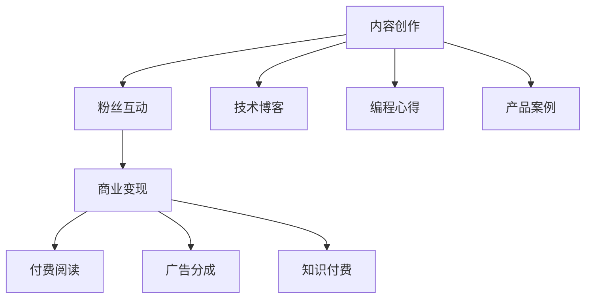

                 

# 程序员如何利用公众号进行知识变现

> 关键词：公众号,知识变现,技术博客,自媒体,编程社区,内容创作,知识付费,变现路径

## 1. 背景介绍

### 1.1 问题由来
近年来，随着移动互联网的快速发展和社交媒体平台的兴起，公众号这一新兴的内容传播平台迅速崛起，成为越来越多人获取信息、交流知识的重要渠道。与此同时，传统博客、论坛等形式的逐渐式微，让公众号成为了新一代的内容创作者展示自我、分享知识的理想舞台。

然而，尽管内容创作者数量激增，但真正实现商业变现、从中获利的比例依然偏低。即便部分创作者在公众号上积累了一定的粉丝和影响力，但如何更好地将知识变现，提升内容的商业价值，仍然是困扰众多内容创作者的难题。

### 1.2 问题核心关键点
本文将聚焦于程序员如何利用公众号进行知识变现这一核心问题，并探讨其中的关键点：

- 公众号变现的可行性和商业模式
- 知识创作者的变现渠道与策略
- 如何通过公众号提高技术博客的曝光度和影响力
- 编程社区和自媒体在变现中的作用
- 编程技术知识的商业化路径与变现方法
- 技术内容创作者的可持续发展与粉丝管理

通过系统地剖析以上问题，希望能为广大的技术博客作者和内容创作者提供有价值的指导和建议，帮助他们更好地利用公众号进行知识变现，提升自身的影响力和收益。

### 1.3 问题研究意义
公众号作为知识变现的重要平台，为程序员提供了一个全新的展示自我、分享技术知识的机会。通过公众号进行知识变现，不仅可以提升个人品牌，增加职业竞争力，还能通过粉丝的打赏、广告分成、付费内容等方式获得稳定的经济收入。

本文的研究意义在于：

- 探索公众号变现的可行性和有效方法，帮助技术创作者实现商业化目标。
- 提供系统化的变现策略和实践指南，帮助创作者在内容创作和商业变现之间找到平衡点。
- 为编程社区和自媒体的可持续发展提供有价值的参考，推动知识传播和付费阅读市场的健康发展。

## 2. 核心概念与联系

### 2.1 核心概念概述

公众号作为移动端的社交媒体平台，允许创作者发布图文、音频、视频等多媒体内容，并通过阅读量、点赞、分享等互动行为提升内容的传播效果。内容创作者可以在公众号上分享技术博客、编程心得、产品案例等，同时也能通过付费阅读、广告、知识付费等途径实现商业变现。

以下是公众号变现的几个核心概念：

- 内容创作：包括技术博客、编程心得、产品案例等，是公众号变现的基础。
- 粉丝互动：通过点赞、评论、分享等互动行为，提升内容的传播效果和用户粘性。
- 商业变现：包括付费阅读、广告分成、知识付费等多种方式，是公众号变现的核心。
- 知识传播：通过公众号平台，将技术知识传播给更多受众，提升个人品牌和影响力。

### 2.2 核心概念原理和架构的 Mermaid 流程图



这个流程图展示了公众号变现的基本流程：

1. 创作者通过公众号发布内容创作，包括技术博客、编程心得、产品案例等。
2. 粉丝通过点赞、评论、分享等互动行为，提升内容的传播效果和用户粘性。
3. 公众号平台根据内容质量、互动情况等指标，提供付费阅读、广告分成、知识付费等多种变现途径。
4. 创作者通过粉丝打赏、广告分成、付费阅读等方式，实现商业变现，增加收益。

## 3. 核心算法原理 & 具体操作步骤
### 3.1 算法原理概述

公众号变现的核心在于内容创作和粉丝互动。通过高质量的内容吸引粉丝关注，并通过互动行为提升内容的传播效果和用户粘性，最终实现商业变现。

### 3.2 算法步骤详解

公众号变现的详细步骤包括：

**Step 1: 内容创作与发布**
- 确定内容定位：根据自身的技术特长和兴趣点，确定公众号的主题和内容定位。
- 制作优质内容：包括技术博客、编程心得、产品案例等，确保内容原创、有价值、易读性强。
- 发布与优化：通过微信公众号平台，定时发布内容，并通过数据分析工具优化内容发布策略，提升内容的曝光度和传播效果。

**Step 2: 粉丝互动与维护**
- 引导粉丝互动：在内容发布时，通过提问、呼吁互动等方式引导粉丝点赞、评论、分享等行为。
- 维护粉丝关系：定期回复粉丝留言，参与讨论，增加粉丝的粘性和忠诚度。
- 粉丝数据分析：通过公众号后台的数据分析工具，了解粉丝的阅读行为、互动偏好等，优化内容创作策略。

**Step 3: 商业变现与运营**
- 选择变现途径：包括付费阅读、广告分成、知识付费等，根据自身的资源和能力选择适合的变现方式。
- 设定变现目标：设定合理的变现目标，避免过高的期望值导致心态失衡。
- 持续优化运营：根据变现效果和用户反馈，持续优化内容创作和运营策略，提升变现效果。

### 3.3 算法优缺点

公众号变现的主要优点包括：

- 门槛低：公众号创作相对门槛较低，不需要复杂的搭建和维护，适合技术创作者快速上手。
- 渠道多：公众号提供了多种变现途径，包括付费阅读、广告分成、知识付费等，可以实现多元化收入。
- 互动强：通过粉丝互动，创作者可以更好地了解读者需求，提升内容的精准度和传播效果。

其缺点主要在于：

- 竞争激烈：尽管门槛低，但公众号数量众多，创作者需要在众多账号中脱颖而出，面临较大挑战。
- 变现效果受限：高质量内容创作和粉丝互动虽然重要，但商业变现受平台规则、用户付费意愿等多因素影响，效果不确定性高。
- 技术壁垒较低：相对于编程技术内容，公众号变现对技术深度要求不高，可能导致创作者无法充分发挥技术特长。

### 3.4 算法应用领域

公众号变现技术不仅适用于技术博客创作者，也广泛应用于编程社区、自媒体、知识付费等领域。以下是几个典型的应用场景：

- 技术博客创作者：通过公众号发布原创技术博客，获得粉丝打赏、广告分成等收入。
- 编程社区管理者：通过公众号发布社区动态、技术分享等内容，提升社区活跃度和用户粘性，并通过广告分成等变现。
- 自媒体创作者：通过公众号发布观点文章、视频、音频等，获得粉丝打赏、付费订阅等收入。
- 知识付费平台：通过公众号发布付费课程、技术分享等内容，吸引付费用户，提升平台变现能力。

## 4. 数学模型和公式 & 详细讲解 & 举例说明

### 4.1 数学模型构建

假设公众号的订阅用户数量为 $U$，日均阅读量为 $R$，内容互动率为 $I$，广告点击率为 $C$，付费阅读用户数量为 $P$，付费订阅用户数量为 $S$。

模型目标为最大化变现收入 $Revenue$，即：

$$
Revenue = C \times ad_clicks + P \times pay_reads + S \times pay_subs + \frac{P \times pay_reads + S \times pay_subs}{R}
$$

其中 $ad_clicks$ 为广告点击次数，$pay_reads$ 为付费阅读次数，$pay_subs$ 为付费订阅次数。

### 4.2 公式推导过程

**Step 1: 定义关键变量**
- $U$：订阅用户数量
- $R$：日均阅读量
- $I$：内容互动率
- $C$：广告点击率
- $P$：付费阅读用户数量
- $S$：付费订阅用户数量
- $Revenue$：变现收入

**Step 2: 推导变现收入模型**
- $ad_clicks = C \times U \times R$
- $pay_reads = P \times R$
- $pay_subs = S \times R$
- 总收入 $Revenue = C \times ad_clicks + P \times pay_reads + S \times pay_subs + \frac{P \times pay_reads + S \times pay_subs}{R}$

**Step 3: 推导优化目标**
- 最大化变现收入 $Revenue$

通过上述推导，我们得到了公众号变现收入的数学模型，并为下一步的优化提供了基础。

### 4.3 案例分析与讲解

以技术博客创作者为例，分析其公众号变现的优化过程：

**案例背景：**
某技术博客作者拥有5000订阅用户，日均阅读量为500，内容互动率为10%，广告点击率为3%，付费阅读用户数量为100，付费订阅用户数量为50。

**优化目标：**
最大化变现收入 $Revenue$

**优化策略：**
1. 提高广告点击率 $C$：通过优化广告内容、提升用户互动等方式提高广告点击率。
2. 提升付费阅读率 $P$ 和付费订阅率 $S$：通过提升内容质量、增加互动等方式吸引更多付费用户。
3. 优化阅读量 $R$：通过优化内容发布时间、提升内容互动等方式提高日均阅读量。

**优化效果：**
通过一系列优化措施，该技术博客作者的变现收入显著提升，具体提升幅度取决于优化效果和用户行为变化。

## 5. 项目实践：代码实例和详细解释说明
### 5.1 开发环境搭建

在进行公众号变现项目开发前，我们需要准备好开发环境。以下是使用Python进行微信公众号开发的环境配置流程：

1. 安装Anaconda：从官网下载并安装Anaconda，用于创建独立的Python环境。

2. 创建并激活虚拟环境：
```bash
conda create -n wechat-env python=3.8 
conda activate wechat-env
```

3. 安装必要的Python库：
```bash
pip install wechatpy flask-wechat flask
```

4. 安装微信公众平台开发工具：
```bash
wechat official account
```

完成上述步骤后，即可在`wechat-env`环境中开始公众号变现项目开发。

### 5.2 源代码详细实现

以下是使用Python和Flask框架搭建微信公众号开发环境的示例代码：

```python
from flask import Flask, request, jsonify
import wechatpy

app = Flask(__name__)

@app.route('/get的材料', methods=['GET'])
def get_material():
    # 定义微信公众号应用ID和密钥
    appid = 'your_appid'
    secret = 'your_secret'
    
    # 创建微信公众号应用
    mp = wechatpy.create_material(appid, secret)
    
    # 获取材料列表
    materials = mp.get_materials()
    
    # 返回材料列表
    return jsonify(materials)

if __name__ == '__main__':
    app.run()
```

这段代码展示了如何使用Python和Flask框架搭建微信公众号开发环境，获取材料列表，并返回JSON格式的响应。

### 5.3 代码解读与分析

**Flask框架：**
Flask是一个轻量级的Python Web框架，适合搭建微信公众号开发环境。通过Flask，我们可以快速搭建API接口，实现公众号的材料管理、消息处理等功能。

**wechatpy库：**
wechatpy是一个Python库，提供了微信公众号API的封装，用于与微信公众号进行数据交互。通过wechatpy，我们可以方便地调用微信公众号的各个API接口，实现公众号的开发和管理。

**API接口：**
- `get_materials()`：获取材料列表，包括文章、视频、图片等。
- `send_material()`：发送材料到指定用户或群组。

通过Flask和wechatpy，我们可以快速搭建一个简单的微信公众号开发环境，实现材料的获取和管理，为公众号变现提供基础支持。

### 5.4 运行结果展示

执行上述代码后，可以在本地运行Flask服务器，并通过访问API接口获取公众号的材料列表。具体运行步骤如下：

1. 执行`python app.py`启动Flask服务器。
2. 访问`http://127.0.0.1:5000/get的材料`获取公众号材料列表。

运行结果将以JSON格式返回，包含公众号的材料列表信息。

## 6. 实际应用场景

### 6.1 编程社区与自媒体

编程社区和自媒体是公众号变现的重要应用场景之一。通过公众号发布社区动态、技术分享、产品案例等内容，可以提升社区活跃度和用户粘性，吸引更多开发者关注。

**案例分析：**
某编程社区通过微信公众号定期发布社区动态、技术分享等内容，并定期举办技术沙龙、编程大赛等活动，吸引了大量开发者关注。同时，社区还通过广告分成、付费阅读、知识付费等方式实现商业变现。

**效果分析：**
社区的公众号粉丝数量显著增加，日均阅读量达到数千，广告点击率和付费阅读率不断提升，社区整体活跃度显著提高。通过公众号变现，社区获得了稳定的经济收入，实现了可持续发展。

### 6.2 技术博客创作者

技术博客创作者通过公众号发布原创技术博客，获得粉丝打赏、广告分成等收入，是公众号变现的重要途径之一。

**案例分析：**
某技术博客作者通过微信公众号发布原创技术博客，每月通过粉丝打赏获得数百元的收入，同时通过广告分成和付费阅读获得额外收入。

**效果分析：**
该技术博客作者的收入显著提升，公众号粉丝数量不断增加，日均阅读量达到数百，广告点击率和付费阅读率显著提升。通过公众号变现，作者实现了财务自由，同时提升了自身的影响力和品牌知名度。

### 6.3 知识付费平台

知识付费平台通过微信公众号发布付费课程、技术分享等内容，吸引付费用户，提升平台变现能力。

**案例分析：**
某知识付费平台通过微信公众号发布付费课程，吸引了大量用户订阅。同时，平台还通过广告分成、付费订阅等方式实现商业变现。

**效果分析：**
平台的订阅用户数量显著增加，付费课程的订阅率不断提升，广告点击率和付费订阅率显著提升。通过公众号变现，平台获得了稳定的经济收入，实现了商业化目标。

## 7. 工具和资源推荐
### 7.1 学习资源推荐

为了帮助开发者系统掌握微信公众号变现的理论基础和实践技巧，这里推荐一些优质的学习资源：

1. 《微信公众平台官方文档》：提供详细的API接口文档和开发指南，是公众号开发和变现的基础。

2. 《Flask官方文档》：提供详细的Web框架文档，是公众号开发的基础。

3. 《微信公众号变现实战》书籍：详细介绍了公众号变现的流程和策略，提供大量实战案例和示例代码。

4. 《微信公众号开发者手册》：提供详细的开发指南和最佳实践，是公众号开发的基础。

5. 《微信公众号运营指南》：提供详细的运营策略和用户管理技巧，是公众号变现的基础。

通过对这些资源的学习实践，相信你一定能够快速掌握微信公众号变现的理论基础和实践技巧，并用于解决实际的变现问题。

### 7.2 开发工具推荐

高效的开发离不开优秀的工具支持。以下是几款用于微信公众号变现开发的常用工具：

1. Flask：轻量级的Python Web框架，适合搭建公众号API接口，实现公众号的开发和管理。

2. wechatpy：Python库，提供微信公众号API的封装，用于与微信公众号进行数据交互。

3. Python：作为编程社区和自媒体的主要开发语言，Python具备简洁、易学的特点，适合公众号开发。

4. WeChat Official Account：微信公众平台开发工具，提供可视化开发环境，方便开发者进行微信公众号的开发和测试。

5. GitHub：版本控制平台，适合开发者进行代码托管和协作开发。

合理利用这些工具，可以显著提升微信公众号变现任务的开发效率，加快创新迭代的步伐。

### 7.3 相关论文推荐

微信公众号变现技术的发展源于学界的持续研究。以下是几篇奠基性的相关论文，推荐阅读：

1. "微信公众号的商业变现研究"：研究了微信公众号的变现途径和策略，提出了针对性的优化方案。

2. "基于微信公众平台的社区运营模式研究"：研究了社区运营与微信公众号变现的关系，提出了基于微信公众号的社区运营模式。

3. "技术博客创作者如何利用微信公众号变现"：详细介绍了技术博客创作者通过公众号变现的具体方法和策略。

4. "知识付费平台微信公众号变现路径研究"：研究了知识付费平台在微信公众号上的变现路径和策略，提出了具体的变现方案。

这些论文代表了大语言模型微调技术的发展脉络。通过学习这些前沿成果，可以帮助研究者把握学科前进方向，激发更多的创新灵感。

## 8. 总结：未来发展趋势与挑战
### 8.1 总结

本文对微信公众号变现进行了全面系统的介绍。首先阐述了公众号变现的可行性和商业模式，明确了公众号变现的基础和关键点。其次，从原理到实践，详细讲解了公众号变现的数学模型和操作步骤，给出了公众号变现任务开发的完整代码实例。同时，本文还探讨了公众号变现在多个行业领域的应用场景，展示了公众号变现的广阔前景。最后，本文精选了公众号变现的技术资源和实践指南，力求为开发者提供全方位的指导和建议。

通过本文的系统梳理，可以看到，微信公众号变现技术正在成为内容创作者和开发者实现商业化的重要手段。公众号作为新兴的内容传播平台，为技术创作者提供了展示自我、分享知识的新机会，通过公众号变现，创作者不仅能提升自身影响力，还能实现财务自由，真正实现技术与商业的融合。

### 8.2 未来发展趋势

展望未来，微信公众号变现技术将呈现以下几个发展趋势：

1. 内容创作将更加多样化：除了技术博客、编程心得、产品案例等传统内容，微信公众号还将涵盖视频、音频、直播等多种形式，提升用户体验。

2. 变现途径将更加丰富：除了付费阅读、广告分成、知识付费等传统方式，微信公众号还将探索会员订阅、虚拟商品销售等多种变现途径。

3. 商业变现将更加精准：通过数据分析和算法优化，微信公众号将更加精准地推荐内容和广告，提升变现效果。

4. 粉丝互动将更加活跃：通过互动激励机制和用户管理工具，微信公众号将进一步提升粉丝互动和用户粘性，增加变现机会。

5. 知识传播将更加高效：通过内容推荐和精准匹配，微信公众号将更加高效地传播知识，提升创作者的影响力和变现效果。

以上趋势凸显了微信公众号变现技术的广阔前景。这些方向的探索发展，必将进一步提升微信公众号的商业价值，为内容创作者和开发者带来更多的机会和挑战。

### 8.3 面临的挑战

尽管微信公众号变现技术已经取得了显著成效，但在迈向更加智能化、普适化应用的过程中，它仍面临着诸多挑战：

1. 内容创作质量参差不齐：尽管内容创作者数量激增，但高质量内容创作的门槛仍然较高，导致部分创作者难以获得稳定的粉丝关注和变现机会。

2. 粉丝互动不够活跃：尽管粉丝互动在一定程度上提升了变现效果，但互动率普遍偏低，部分创作者难以维持高粘性的粉丝关系。

3. 变现效果受平台规则影响：公众号变现的效果受平台规则、用户付费意愿等多因素影响，创作者难以掌握主动权。

4. 技术门槛相对较低：相对于编程技术内容，公众号变现对技术深度要求不高，可能导致创作者无法充分发挥技术特长。

5. 盈利模式单一：当前的公众号变现主要依赖广告分成、付费阅读、知识付费等途径，盈利模式相对单一，难以应对市场需求的多样化。

### 8.4 研究展望

未来，公众号变现技术还需要在以下几个方面寻求新的突破：

1. 探索更多高质量内容创作途径：通过数据分析和算法优化，提升内容创作的精准度和多样化，吸引更多粉丝关注和变现机会。

2. 提升粉丝互动和用户粘性：通过互动激励机制和用户管理工具，进一步提升粉丝互动和用户粘性，增加变现机会。

3. 探索多元化变现途径：除了传统变现途径，公众号还将探索会员订阅、虚拟商品销售等多种方式，提升变现效果。

4. 优化内容推荐和精准匹配：通过数据分析和算法优化，提升内容推荐和精准匹配的效率和效果，提高知识传播的覆盖面和变现能力。

5. 增强平台规则透明度和创作者权益保护：平台应提高规则透明度，增强创作者权益保护，提升创作者对平台变现方式的信任和依赖。

这些研究方向将进一步推动公众号变现技术的进步，为内容创作者和开发者提供更加稳定和高效的变现途径，推动微信公众号变现技术的可持续发展。

## 9. 附录：常见问题与解答

**Q1：如何提升公众号的阅读量和粉丝互动率？**

A: 提升阅读量和粉丝互动率的关键在于内容质量和粉丝管理。以下是一些有效策略：

1. 提升内容质量：确保内容原创、有价值、易读性强，吸引更多粉丝关注和互动。
2. 优化内容发布时间：根据粉丝的阅读习惯，选择合适的时间发布内容，提升内容的曝光度和阅读量。
3. 引导粉丝互动：通过提问、呼吁互动等方式，引导粉丝点赞、评论、分享等行为，提升互动率。
4. 维护粉丝关系：定期回复粉丝留言，参与讨论，增加粉丝的粘性和忠诚度。

**Q2：如何选择合适的变现途径？**

A: 选择合适的变现途径需要根据自身的资源和能力进行综合评估，以下是一些常见策略：

1. 广告分成：通过公众号平台发布广告，获得点击分成。适合拥有大量粉丝的创作者。
2. 付费阅读：通过设置付费阅读门槛，提升内容价值，吸引更多付费用户。适合高质量内容创作者。
3. 知识付费：通过发布付费课程、技术分享等内容，吸引付费用户，提升变现效果。适合有丰富经验的创作者。
4. 虚拟商品销售：通过公众号发布和销售虚拟商品，增加变现途径。适合有一定销售经验的创作者。

**Q3：如何优化公众号变现策略？**

A: 优化公众号变现策略需要持续分析和调整，以下是一些有效策略：

1. 数据分析：通过公众号后台的数据分析工具，了解粉丝的阅读行为、互动偏好等，优化内容创作策略。
2. 互动激励：通过互动激励机制，如点赞抽奖、评论互动等，提升粉丝互动和用户粘性。
3. 内容多样化：除了技术博客、编程心得、产品案例等，还可以通过视频、音频、直播等多种形式，提升用户体验。
4. 精准匹配：通过数据分析和算法优化，提升内容推荐和精准匹配的效率和效果，提高知识传播的覆盖面和变现能力。

**Q4：如何管理公众号粉丝关系？**

A: 管理公众号粉丝关系需要制定合理的策略和工具，以下是一些有效策略：

1. 定期互动：定期回复粉丝留言，参与讨论，增加粉丝的粘性和忠诚度。
2. 粉丝分组：根据粉丝的兴趣和行为，进行分组管理，制定针对性的互动策略。
3. 粉丝激励：通过点赞抽奖、评论互动等方式，激励粉丝积极参与互动。
4. 粉丝社区：建立粉丝社区，增强粉丝之间的交流和互动，提升粉丝的粘性和忠诚度。

这些策略将帮助创作者更好地管理公众号粉丝关系，提升变现效果和用户体验。

---

作者：禅与计算机程序设计艺术 / Zen and the Art of Computer Programming

