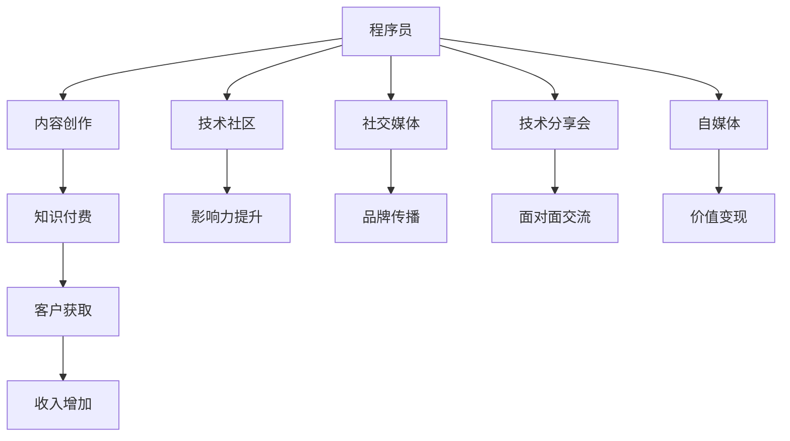

                 

# 程序员如何利用影响力营销推广知识付费

在数字化时代，知识付费已成为一种流行趋势，为快速积累财富和提升职业竞争力提供了重要途径。程序员作为互联网和人工智能领域的中坚力量，他们具有独特的知识背景和视角，在推广知识付费时具有天然的影响力。本文将探讨程序员如何利用影响力营销推广知识付费，并详细介绍实现这一目标的关键步骤和策略。

## 1. 背景介绍

### 1.1 问题由来

近年来，随着互联网和人工智能技术的快速发展，程序员作为技术推动者，对于新技术、新方法的了解和掌握成为行业内外的焦点。知识付费平台如雨后春笋般涌现，程序员等专业人士凭借其独特视角和深入理解，成为推广知识付费的天然扩散者。程序员利用影响力营销，不仅可以快速推广高质量内容，还能提升个人品牌影响力，进一步巩固在技术社区中的地位。

### 1.2 问题核心关键点

程序员在推广知识付费时，可以借助多种方式：

1. **内容创作**：通过撰写技术文章、录制编程视频、开技术博客等方式，分享专业知识和技术心得。
2. **技术社区**：活跃在Stack Overflow、GitHub、CSDN等技术社区，通过回答问题、参与讨论等方式，提升知名度。
3. **社交媒体**：利用微博、微信、LinkedIn等社交平台，分享学习心得、展示项目成果，吸引关注。
4. **技术分享会**：参加或组织技术分享会、技术论坛等线下活动，进行面对面交流。
5. **自媒体**：通过开设YouTube频道、播客等自媒体渠道，分享编程经验和知识。

### 1.3 问题研究意义

程序员利用影响力营销推广知识付费，具有以下意义：

1. **快速积累财富**：程序员凭借专业知识和经验，能快速构建个人品牌，吸引付费订阅者。
2. **提升职业竞争力**：通过推广优质内容，可以展示自己的专业能力和知识深度，赢得行业认可。
3. **促进知识传播**：通过分享和学习，可以推动行业知识的普及和传播，提高整体技术水平。
4. **实现价值变现**：在分享知识和经验的同时，也能获得经济回报，实现自我价值和财务自由的统一。

## 2. 核心概念与联系

### 2.1 核心概念概述

1. **知识付费**：指用户为获取特定知识、技能或服务而支付费用，通过线上平台进行购买和消费的行为。
2. **影响力营销**：利用个人或团队的知名度和影响力，推广特定产品或服务，以实现商业目的的一种营销方式。
3. **程序员**：具有编程和软件开发能力的专门人才，是互联网和人工智能技术发展的主要推动力。
4. **内容创作**：通过撰写博客、录制视频、编写代码等方式，创作出有价值的内容。
5. **技术社区**：程序员聚集的平台，如Stack Overflow、GitHub等，通过参与讨论、回答问题等方式，提升影响力。
6. **社交媒体**：如微博、微信、LinkedIn等平台，通过分享内容、互动交流等方式，扩大影响力。

这些概念之间的逻辑关系可以通过以下Mermaid流程图来展示：



这个流程图展示出程序员通过内容创作、技术社区、社交媒体等途径，提升影响力并推广知识付费的过程。

## 3. 核心算法原理 & 具体操作步骤

### 3.1 算法原理概述

程序员利用影响力营销推广知识付费，其核心算法原理是通过在多个平台上持续输出有价值的内容，吸引目标用户，并通过有效的社交策略和商业运营手段，最终实现用户转化和价值变现。

具体步骤如下：

1. **选择内容主题**：根据自身的技术专长和市场需求，选择合适的知识付费主题。
2. **创作高质量内容**：编写高质量的技术文章、录制编程视频、开设技术博客等。
3. **发布和推广**：通过技术社区、社交媒体、自媒体等平台发布和推广内容。
4. **互动和反馈**：与用户互动，收集反馈信息，不断优化内容。
5. **客户转化**：引导用户订阅或购买付费内容，实现知识付费的商业变现。

### 3.2 算法步骤详解

#### 3.2.1 选择内容主题

选择合适的内容主题是推广知识付费的基础。程序员应该从自身专长和市场需求出发，选择具有一定难度和深度的主题。

1. **技术深度**：选择有技术深度的内容，能够吸引技术爱好者和专业人士。
2. **市场需求**：结合当前技术趋势和市场需求，选择用户感兴趣的领域。
3. **个人兴趣**：选择自己感兴趣且熟悉的主题，能够保证内容的质量和深度。

#### 3.2.2 创作高质量内容

高质量的内容是吸引用户的关键。程序员在创作内容时需要注意以下要点：

1. **结构清晰**：文章或视频应该有清晰的结构和逻辑，方便用户理解。
2. **案例丰富**：通过具体的案例和代码示例，帮助用户更好地掌握知识。
3. **图文并茂**：适当插入代码片段、图表等，增强内容的可视性和可读性。
4. **定期更新**：定期更新内容，保持时效性和相关性。

#### 3.2.3 发布和推广

发布和推广是内容传播的关键步骤。程序员可以通过以下方式进行推广：

1. **技术社区**：在Stack Overflow、GitHub等技术社区发布内容，参与讨论和回答问题。
2. **社交媒体**：通过微博、微信、LinkedIn等平台分享内容，吸引关注和互动。
3. **自媒体**：开设YouTube频道、播客等自媒体渠道，定期发布内容。
4. **技术分享会**：参加或组织技术分享会、技术论坛等线下活动，进行面对面交流。

#### 3.2.4 互动和反馈

与用户互动，收集反馈信息，是优化内容的关键。程序员可以通过以下方式进行互动：

1. **评论和回复**：在社交媒体和自媒体上积极回复用户评论，进行互动。
2. **问卷调查**：通过问卷调查收集用户反馈，了解用户需求和兴趣点。
3. **社区参与**：在技术社区积极参与讨论，了解用户真实需求。

#### 3.2.5 客户转化

客户转化是知识付费的最终目标。程序员可以通过以下方式进行客户转化：

1. **引导订阅**：通过提供免费试用、优惠折扣等方式，吸引用户订阅付费内容。
2. **课程推广**：开设在线课程，通过平台推广吸引用户参加。
3. **用户互动**：通过社交媒体和自媒体平台，与用户互动，提升用户粘性。

### 3.3 算法优缺点

#### 3.3.1 优点

1. **提升专业形象**：通过内容创作和知识分享，程序员可以展示自己的专业能力和知识深度。
2. **吸引目标用户**：高质量的内容和活跃的社交活动可以吸引大量目标用户。
3. **实现价值变现**：通过知识付费实现经济回报，同时提升职业竞争力。
4. **推动技术传播**：通过推广高质量内容，推动技术知识的普及和传播。

#### 3.3.2 缺点

1. **内容创作成本高**：高质量内容的创作需要大量时间和精力投入。
2. **市场竞争激烈**：技术社区和社交媒体上，知识付费内容丰富，需要具有独特的吸引力和竞争力。
3. **用户转化难度大**：部分用户对付费内容持观望态度，难以快速实现客户转化。
4. **时间管理难度大**：平衡内容创作和推广工作，需要有效的时间管理。

### 3.4 算法应用领域

程序员利用影响力营销推广知识付费，已经在多个领域得到应用，例如：

1. **在线编程教育**：通过开设编程课程、录制编程视频等方式，传授编程技能。
2. **技术博客**：撰写技术博客，分享编程经验和心得，吸引用户订阅。
3. **技术咨询**：通过提供技术咨询、编程问题解答等服务，吸引客户。
4. **开源项目**：通过开源项目吸引技术爱好者，推广付费内容。

除了上述这些经典应用外，程序员还可以将影响力营销应用到更多场景中，如个人品牌推广、技术社区建设、技术研讨会组织等，为技术推广和知识传播提供新的动力。

## 4. 数学模型和公式 & 详细讲解 & 举例说明

### 4.1 数学模型构建

知识付费推广的数学模型可以通过以下公式进行描述：

$$
I = C \times E \times S
$$

其中：

- $I$：推广的影响力。
- $C$：内容的质量。
- $E$：推广的渠道和方式。
- $S$：推广的社交策略。

### 4.2 公式推导过程

#### 4.2.1 内容质量 $C$

内容质量是影响影响力的关键因素。通过以下公式进行计算：

$$
C = f(T, P, R)
$$

其中：

- $T$：技术深度和实用性。
- $P$：内容的可读性和可理解性。
- $R$：内容的更新频率和时效性。

#### 4.2.2 推广渠道 $E$

推广渠道的选择对于推广效果有重要影响。通过以下公式进行计算：

$$
E = \sum_{i=1}^n P_i \times C_i
$$

其中 $P_i$ 和 $C_i$ 分别表示各个推广渠道的质量和数量。

#### 4.2.3 社交策略 $S$

社交策略是推广知识付费的重要环节。通过以下公式进行计算：

$$
S = g(I_{\text{社交}}, I_{\text{互动}}, I_{\text{反馈}})
$$

其中 $I_{\text{社交}}$、$I_{\text{互动}}$ 和 $I_{\text{反馈}}$ 分别表示社交互动、用户反馈等方面的影响力。

### 4.3 案例分析与讲解

以程序员小王为例，分析如何利用影响力营销推广知识付费。

小王是一名软件开发工程师，具有丰富的编程经验和良好的技术背景。他选择了一个热门的主题——“Python编程技术”，作为推广的内容。

1. **内容创作**：小王撰写了一系列的Python编程教程和技术博客，并通过GitHub开源，吸引了大批技术爱好者关注。
2. **发布和推广**：在Stack Overflow、CSDN等技术社区发布教程，同时在微博、微信上分享技术心得。
3. **互动和反馈**：积极回复社交媒体上的评论，参与技术社区的讨论，收集用户反馈信息。
4. **客户转化**：通过提供付费的高级教程、技术咨询等方式，吸引用户订阅，实现商业变现。

通过以上步骤，小王成功地推广了知识付费，并获得了可观的收入。

## 5. 项目实践：代码实例和详细解释说明

### 5.1 开发环境搭建

在进行知识付费推广的实践中，需要搭建合适的开发环境。以下是使用Python进行知识付费推广的开发环境配置流程：

1. **安装Python**：从官网下载并安装Python 3.x版本，确保有足够的内存和磁盘空间。
2. **安装必要的库**：使用pip或conda安装必要的库，如Flask、Django、Markdown等，用于内容发布和排版。
3. **配置开发环境**：根据需要配置开发环境，如本地开发、远程部署等。

### 5.2 源代码详细实现

下面以开设技术博客为例，给出使用Python Flask框架进行知识付费推广的PyTorch代码实现。

1. **安装Flask库**：

```bash
pip install Flask
```

2. **编写Flask应用代码**：

```python
from flask import Flask, request, render_template
from markdown import markdown

app = Flask(__name__)

@app.route('/', methods=['GET', 'POST'])
def index():
    if request.method == 'POST':
        title = request.form['title']
        content = request.form['content']
        content_md = markdown(content)
        with open('blog.txt', 'a') as f:
            f.write(f"{title}\n")
            f.write(content_md + "\n")
        return "博客发布成功！"
    return render_template('index.html')

if __name__ == "__main__":
    app.run(debug=True)
```

3. **编写模板文件**：

```html
<!-- index.html -->
<html>
<head>
    <title>博客</title>
</head>
<body>
    <h1>博客</h1>
    <form method="POST">
        <label for="title">标题：</label>
        <input type="text" name="title" id="title">
        <br>
        <label for="content">内容：</label>
        <textarea name="content" id="content"></textarea>
        <br>
        <input type="submit" value="发布">
    </form>
</body>
</html>
```

### 5.3 代码解读与分析

**Flask框架**：

Flask是一个轻量级的Web框架，用于搭建简单的博客应用。通过Flask，程序员可以轻松实现博客的发布和展示功能。

**模板文件**：

模板文件用于展示博客页面，包含标题和内容输入框。通过使用表单，用户可以提交博客内容。

**代码实现**：

代码实现包含以下步骤：

1. **创建Flask应用**：使用Flask创建应用实例，设置路由。
2. **处理表单提交**：通过处理POST请求，获取用户提交的标题和内容。
3. **保存内容到文件**：将用户提交的内容保存为Markdown格式，并写入本地文件。
4. **展示表单**：通过render_template方法渲染HTML模板，展示表单。

通过以上代码，程序员可以轻松搭建一个简单的技术博客，发布自己的知识付费内容。

### 5.4 运行结果展示

在运行上述代码后，可以通过浏览器访问本地地址，输入博客标题和内容，进行博客发布。成功发布后，可以在博客页面上查看用户提交的内容。

## 6. 实际应用场景

### 6.1 在线编程教育

在线编程教育是程序员推广知识付费的重要领域。通过开设在线编程课程、录制编程视频等方式，程序员可以传授编程技能，吸引大量技术爱好者。

1. **开设编程课程**：通过平台如Udemy、Coursera等，开设Python、Java等编程课程，提供免费试用和优惠折扣。
2. **录制编程视频**：通过YouTube、Bilibili等平台，发布编程视频教程，吸引用户订阅。

### 6.2 技术咨询

技术咨询是程序员推广知识付费的有效途径。通过提供技术咨询、编程问题解答等服务，程序员可以吸引客户，实现商业变现。

1. **技术咨询平台**：通过建立技术咨询平台，提供一对一咨询服务，吸引用户付费。
2. **编程问题解答**：通过社交媒体、技术社区等方式，解答编程问题，展示技术能力，吸引用户关注。

### 6.3 技术博客

技术博客是程序员推广知识付费的重要渠道。通过撰写技术博客，程序员可以分享编程经验和心得，吸引大量用户订阅。

1. **开设技术博客**：通过博客平台如CSDN、Medium等，开设技术博客，定期发布文章。
2. **分享编程心得**：通过技术博客，分享编程经验和心得，展示技术深度。

### 6.4 未来应用展望

随着知识付费市场的不断扩大，程序员利用影响力营销推广知识付费将有更广阔的发展空间。以下是未来应用展望：

1. **多平台推广**：程序员可以同时利用多种平台，如技术社区、社交媒体、自媒体等，全面推广知识付费内容。
2. **内容多样化**：除了技术博客、编程视频，还可以开设在线课程、技术咨询等，实现内容多样化。
3. **客户定制化**：通过客户互动和反馈，提供个性化定制内容，满足用户需求。
4. **技术交流**：通过技术分享会和社区活动，进行面对面的技术交流，提升影响力。

## 7. 工具和资源推荐

### 7.1 学习资源推荐

为了帮助程序员系统掌握知识付费推广的理论基础和实践技巧，这里推荐一些优质的学习资源：

1. **《知识付费运营手册》**：系统介绍知识付费运营的各个环节，包括内容创作、推广、客户转化等。
2. **《程序员如何利用影响力营销》**：详细讲解程序员利用影响力营销推广知识付费的方法和技巧。
3. **《内容创作技巧》**：提供高质量内容创作技巧和工具，帮助程序员提升内容质量。
4. **《社交媒体运营》**：介绍社交媒体运营的各个方面，帮助程序员提高社交媒体推广效果。
5. **《自媒体运营》**：提供自媒体运营的实用技巧和策略，帮助程序员建立个人品牌。

通过这些资源的学习，相信程序员可以更好地掌握知识付费推广的技能，提升影响力，实现商业价值。

### 7.2 开发工具推荐

高效的开发离不开优秀的工具支持。以下是几款用于知识付费推广开发的常用工具：

1. **Flask**：轻量级的Web框架，用于搭建博客应用。
2. **Django**：全功能的Web框架，用于搭建复杂的博客应用。
3. **Markdown**：轻量级的文本排版工具，用于内容创作。
4. **GitHub**：代码托管平台，用于发布开源项目和代码。
5. **Jupyter Notebook**：交互式编程环境，用于数据科学和机器学习应用。

合理利用这些工具，可以显著提升知识付费推广任务的开发效率，加快创新迭代的步伐。

### 7.3 相关论文推荐

知识付费推广的背后涉及诸多理论问题，以下是几篇奠基性的相关论文，推荐阅读：

1. **《知识付费平台的用户行为研究》**：研究用户对知识付费平台的使用行为，探讨如何提升用户粘性和满意度。
2. **《内容创业的商业模式》**：探讨内容创业的商业模式，分析各种内容创业的优缺点和实施策略。
3. **《影响力营销的效果评估》**：研究影响力营销的效果评估方法，提供科学的评估指标和工具。
4. **《知识付费的社交传播效应》**：探讨知识付费的社交传播效应，分析社交媒体对知识付费推广的影响。
5. **《程序员如何利用社交媒体推广技术》**：探讨程序员如何利用社交媒体推广技术，提升个人品牌影响力。

这些论文代表了大语言模型微调技术的发展脉络。通过学习这些前沿成果，可以帮助研究者把握学科前进方向，激发更多的创新灵感。

## 8. 总结：未来发展趋势与挑战

### 8.1 总结

本文对程序员利用影响力营销推广知识付费的方法进行了全面系统的介绍。首先阐述了知识付费和影响力营销的背景和意义，明确了程序员在推广知识付费时的独特优势。其次，从原理到实践，详细讲解了推广知识付费的关键步骤和策略，给出了知识付费推广的完整代码实例。同时，本文还探讨了知识付费推广在多个行业领域的应用前景，展示了其巨大的发展潜力。最后，本文精选了推广知识付费的学习资源、开发工具和相关论文，力求为程序员提供全方位的技术指引。

通过本文的系统梳理，可以看到，程序员利用影响力营销推广知识付费的方法已经成为一种有效的推广手段。他们凭借其专业的技术背景和广泛的技术社区，可以轻松吸引大量目标用户，提升个人品牌影响力，实现经济回报和职业发展双赢。

### 8.2 未来发展趋势

展望未来，知识付费推广将呈现以下几个发展趋势：

1. **平台多样化**：除了现有的知识付费平台，未来将出现更多专业化、垂直化的知识付费平台。
2. **内容深度化**：知识付费内容将更加深入和专业化，满足用户对深度知识的需求。
3. **技术驱动化**：越来越多的技术将在知识付费推广中得到应用，如大数据、人工智能等。
4. **用户定制化**：基于用户行为和需求，提供个性化定制内容，提升用户满意度。
5. **国际化**：知识付费推广将面向全球用户，带来更广阔的市场空间。

### 8.3 面临的挑战

尽管知识付费推广具有巨大的发展潜力，但在推广过程中也面临着诸多挑战：

1. **市场竞争激烈**：现有的知识付费平台和内容创作者众多，如何脱颖而出是一大挑战。
2. **内容质量参差不齐**：部分内容质量不高，难以吸引用户关注和付费。
3. **客户转化难度大**：部分用户对付费内容持观望态度，难以实现快速转化。
4. **时间管理难度大**：需要平衡内容创作和推广工作，时间管理压力大。
5. **用户需求多样**：用户需求多样化，需要提供多种内容形式和推广方式。

### 8.4 研究展望

面对知识付费推广所面临的挑战，未来的研究需要在以下几个方面寻求新的突破：

1. **内容质量提升**：通过技术和工具，提升内容的质量和深度，满足用户对高质量内容的需求。
2. **个性化定制**：基于用户行为和需求，提供个性化定制内容，提升用户满意度。
3. **高效推广策略**：研究和应用高效推广策略，提升推广效果和客户转化率。
4. **用户行为分析**：通过大数据和人工智能技术，深入分析用户行为和需求，优化推广策略。
5. **内容多样化**：提供多种内容形式和推广方式，满足用户多样化的需求。

这些研究方向的探索，必将引领知识付费推广技术迈向更高的台阶，为程序员提供更广阔的推广空间和发展机遇。只有勇于创新、敢于突破，才能不断拓展知识付费推广的边界，实现技术价值和商业价值的统一。

## 9. 附录：常见问题与解答

**Q1：程序员如何选择合适的知识付费内容主题？**

A: 程序员应该选择技术深度高、实用性强的知识付费内容主题。可以参考市场需求和技术趋势，选择用户感兴趣的领域。

**Q2：内容创作时需要注意哪些细节？**

A: 内容创作时需要注意以下几点：
1. **结构清晰**：文章或视频应该有清晰的结构和逻辑，方便用户理解。
2. **案例丰富**：通过具体的案例和代码示例，帮助用户更好地掌握知识。
3. **图文并茂**：适当插入代码片段、图表等，增强内容的可视性和可读性。
4. **定期更新**：定期更新内容，保持时效性和相关性。

**Q3：如何提升知识付费推广效果？**

A: 提升知识付费推广效果需要综合考虑以下几个方面：
1. **多平台推广**：同时在技术社区、社交媒体、自媒体等平台上推广内容。
2. **客户互动**：积极回复用户评论，参与技术社区讨论，收集用户反馈信息。
3. **客户定制化**：根据用户需求，提供个性化定制内容，提升用户满意度。
4. **优化推广策略**：研究高效推广策略，提升推广效果和客户转化率。
5. **内容多样化**：提供多种内容形式和推广方式，满足用户多样化的需求。

通过以上几点，可以有效提升知识付费推广效果，实现商业价值最大化。

**Q4：如何处理推广过程中遇到的问题？**

A: 在推广过程中，可能会遇到以下问题：
1. **内容质量不高**：需要持续改进内容创作质量，提升内容深度和实用性。
2. **用户转化率低**：可以通过提供免费试用、优惠折扣等方式，吸引用户订阅。
3. **时间管理难度大**：需要合理规划时间和精力，平衡内容创作和推广工作。
4. **市场竞争激烈**：需要提升内容质量和创新能力，打造独特的知识付费内容。
5. **用户需求多样化**：需要提供多种内容形式和推广方式，满足用户多样化的需求。

通过以上几点，可以有效处理推广过程中遇到的问题，提升推广效果。

---

作者：禅与计算机程序设计艺术 / Zen and the Art of Computer Programming

