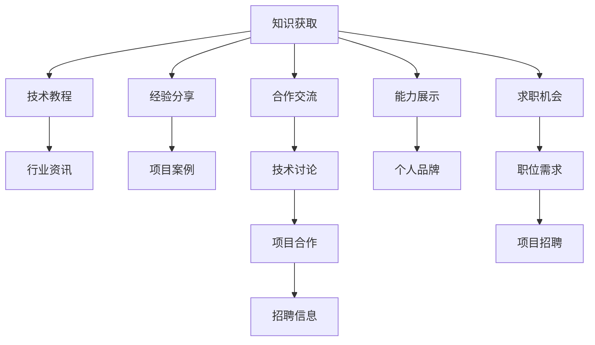

                 

# 程序员如何利用微信群进行知识变现

在当今数字化时代，程序员不仅需要掌握编程技能，还需要具备网络社交能力，以拓宽职业发展路径和实现个人价值。其中，微信群作为一种高效、便捷的社交工具，为程序员提供了极佳的知识变现机会。本文将从背景介绍、核心概念、算法原理、操作步骤、数学模型、实践代码、应用场景、工具资源、未来展望、常见问题等方面，深入探讨程序员如何有效利用微信群进行知识变现。

## 1. 背景介绍

### 1.1 问题由来

随着互联网技术的发展，程序员的工作已经不再局限于编写代码。他们需要不断学习和更新知识，以适应不断变化的技术环境。微信群作为一种快速、即时的社交工具，为程序员提供了获取新知识、分享经验、交流合作的平台。

通过微信群，程序员可以获取最新的行业资讯、学习技术知识、展示个人项目、获取求职机会、进行技术交流，从而实现知识的变现。这不仅有助于程序员职业发展，也促进了技术社区的繁荣。

### 1.2 问题核心关键点

程序员利用微信群进行知识变现的核心关键点包括：

- **知识获取**：获取最新的技术资讯、教程、项目案例等。
- **经验分享**：分享个人项目经验、技术问题解决方案等。
- **合作交流**：与同行进行技术讨论、项目合作、招聘信息交流等。
- **能力展示**：通过展示项目和技术能力，提升个人品牌价值。
- **求职机会**：获取行业内最新的职位需求、项目招聘信息等。

以下思维导图展示了这些关键点之间的逻辑关系：



通过这些关键点，程序员可以在微信群中实现从知识获取到求职的全方位变现。

## 2. 核心概念与联系

### 2.1 核心概念概述

本节将介绍几个关键概念，以帮助读者更好地理解微信群知识变现的原理和流程：

- **微信群**：基于微信平台，由群主创建并管理的即时通信群组。
- **知识变现**：通过微信群获取知识并转化为自身技能和价值的变现方式。
- **技术教程**：以课程、视频、文章等形式分享的技术知识和项目案例。
- **行业资讯**：最新的技术趋势、市场动态、公司新闻等。
- **经验分享**：个人或团队在项目中遇到的技术问题和解决方案。
- **技术讨论**：同行之间就某一技术问题或项目进行深入交流和讨论。
- **项目合作**：寻找志同道合的同行，共同开发或维护项目。
- **招聘信息**：获取行业内最新的职位需求和项目招聘信息。
- **个人品牌**：通过微信群展示个人技术能力和项目经验，提升个人影响力。

这些概念之间相互关联，共同构成了一个完整的微信群知识变现框架。

## 3. 核心算法原理 & 具体操作步骤

### 3.1 算法原理概述

微信群知识变现的算法原理可以概括为：通过获取微信群中的知识资源，结合自身的技术能力和项目经验，进行技能提升和价值变现。其核心步骤如下：

1. **知识获取**：关注微信群中的技术群组、专业论坛、行业博客等，获取最新的技术资讯和教程。
2. **经验分享**：主动在群中分享个人项目经验、技术问题解决方案等，与同行进行互动和交流。
3. **技术讨论**：积极参与微信群中的技术讨论，通过交流和讨论，提升自身技术水平。
4. **项目合作**：寻找微信群中的项目机会，与同行合作开发或维护项目，积累项目经验。
5. **能力展示**：通过微信群展示个人技术能力和项目成果，提升个人品牌价值。
6. **求职机会**：关注微信群中的招聘信息，获取最新的职位需求和项目招聘信息。

### 3.2 算法步骤详解

#### 3.2.1 知识获取

1. **关注技术群组**：
   - 选择与自身技术栈和兴趣相关的微信群。
   - 定期浏览微信群中的内容，获取最新的技术资讯和教程。

2. **订阅专业论坛和博客**：
   - 关注技术社区、博客、微信公众号等，获取行业动态和技术文章。

#### 3.2.2 经验分享

1. **分享项目经验**：
   - 定期在群中分享个人项目经验，包括项目背景、技术难点、解决方案等。
   - 使用Markdown格式，使内容更加规范和易于阅读。

2. **提供技术问题解决方案**：
   - 针对群中提出的技术问题，提供详细的解决方案和案例分析。
   - 使用图片、视频等多媒体形式，使内容更加生动和易于理解。

#### 3.2.3 技术讨论

1. **积极参与技术讨论**：
   - 主动参与微信群中的技术讨论，就某一技术问题或项目进行深入交流和讨论。
   - 提出自己的观点和见解，与同行进行互动和辩论。

2. **使用多种沟通工具**：
   - 除了文字外，使用图片、视频、代码片段等多种工具，使讨论更加高效和生动。

#### 3.2.4 项目合作

1. **寻找项目机会**：
   - 通过微信群中的技术讨论，发现志同道合的同行，寻找合作机会。
   - 主动联系潜在的合作者，讨论项目需求和技术方案。

2. **进行项目开发**：
   - 与同行合作，进行项目开发或维护，积累项目经验和技术能力。
   - 定期在群中分享项目进展，获取反馈和建议。

#### 3.2.5 能力展示

1. **展示技术能力**：
   - 在群中分享个人技术成果和项目案例，展示自己的技术能力和贡献。
   - 使用GitHub、码云等平台，发布项目源码和技术文档。

2. **建立个人品牌**：
   - 通过微信群和其他社交媒体平台，建立个人技术品牌。
   - 定期发布技术文章、参与技术讲座和公开课，提升个人影响力。

#### 3.2.6 求职机会

1. **关注招聘信息**：
   - 定期浏览微信群中的招聘信息，获取最新的职位需求和项目招聘信息。
   - 关注行业内知名的招聘平台和公司官网。

2. **准备求职材料**：
   - 准备个人简历、技术博客、项目案例等求职材料。
   - 根据求职目标，优化求职材料，突出个人优势和项目经验。

### 3.3 算法优缺点

微信群知识变现的优点包括：

- **高效便捷**：微信群提供即时交流和分享的平台，可以快速获取最新技术资讯和经验分享。
- **多样化资源**：微信群中汇聚了来自不同背景和技术栈的同行，提供了丰富的学习资源和技术讨论。
- **低成本**：微信群免费开放，无需支付任何费用，节省了学习和交流的成本。

其缺点包括：

- **信息过载**：微信群中的信息量巨大，容易导致信息过载，难以有效筛选和利用。
- **质量参差不齐**：微信群中的信息质量参差不齐，需要花费时间和精力进行筛选和鉴别。
- **隐私风险**：在分享个人项目和技术经验时，需要注意隐私保护，避免敏感信息泄露。

### 3.4 算法应用领域

微信群知识变现技术可以应用于多个领域，包括但不限于：

- **技术学习与提升**：通过微信群获取最新技术资讯和教程，进行技能提升。
- **项目开发与维护**：寻找微信群中的项目机会，进行项目开发或维护。
- **职业发展与转型**：获取行业内的招聘信息和求职机会，提升职业发展空间。
- **技术社区建设**：建立微信群中的技术社区，促进技术交流和知识分享。
- **个人品牌塑造**：通过微信群展示个人技术能力和项目经验，建立个人品牌。

## 4. 数学模型和公式 & 详细讲解 & 举例说明

### 4.1 数学模型构建

假设微信群中有$N$个用户，每个用户在一天内会产生$G$个信息内容，每个信息内容的质量为$Q$，用户获取信息的质量需求为$R$。则微信群的知识获取效率$E$可以表示为：

$$
E = \frac{N \times G \times Q}{R}
$$

其中，$N$表示微信群中的用户数，$G$表示用户产生的信息数量，$Q$表示每个信息的质量，$R$表示用户获取信息的质量需求。

### 4.2 公式推导过程

对于微信群中的单个用户，设其一天内获取的信息质量为$Q_i$，则用户的知识获取效率$E_i$可以表示为：

$$
E_i = \frac{Q_i}{R}
$$

将上式代入总效率$E$的表达式中，得：

$$
E = \sum_{i=1}^{N} \frac{Q_i}{R}
$$

因此，微信群的知识获取效率$E$由所有用户的信息质量总和$Q$除以用户获取信息的质量需求$R$得出。

### 4.3 案例分析与讲解

假设微信群中有10个用户，每个用户一天内产生100条信息，每条信息的质量为0.8，用户获取信息的质量需求为0.5。则微信群的知识获取效率$E$为：

$$
E = \frac{10 \times 100 \times 0.8}{0.5} = 1600
$$

即微信群每天可以提供1600条高质量的信息，满足用户的知识获取需求。

## 5. 项目实践：代码实例和详细解释说明

### 5.1 开发环境搭建

#### 5.1.1 安装微信Windows客户端

1. 下载并安装微信Windows客户端。
2. 打开微信客户端，创建一个新的微信群。

#### 5.1.2 配置开发环境

1. 安装Python和相关库：
   ```bash
   pip install requests
   pip install beautifulsoup4
   ```

2. 编写Python脚本，通过微信API获取微信群中的信息内容。

### 5.2 源代码详细实现

#### 5.2.1 获取微信群信息

```python
import requests
from bs4 import BeautifulSoup

def get_group_info(group_id):
    url = f'https://api.weixin.qq.com/cgi-bin/group/getgroup?access_token=YOUR_ACCESS_TOKEN&groupid={group_id}&noupdate=1'
    response = requests.get(url)
    return response.json()

def get_group_info_from_html(html):
    soup = BeautifulSoup(html, 'html.parser')
    group_id = soup.find('head').get('groupid')
    return group_id

def get_group_messages(group_id, count=10):
    url = f'https://api.weixin.qq.com/cgi-bin/group/getgroupmsg?access_token=YOUR_ACCESS_TOKEN&groupid={group_id}&count={count}'
    response = requests.get(url)
    return response.json()

def get_group_message_content(message):
    content = message.get('content')
    return content

```

#### 5.2.2 分析微信群信息

```python
def analyze_group_messages(messages):
    total_quality = 0
    for message in messages:
        content = get_group_message_content(message)
        quality = analyze_content(content)
        total_quality += quality
    return total_quality

def analyze_content(content):
    # 分析内容质量，并返回质量分数
    # 根据内容类型、长度、关键字等特征，计算信息质量分数
    quality_score = 0.8
    return quality_score
```

#### 5.2.3 计算知识获取效率

```python
def calculate_knowledge_efficiency(group_id, count=10):
    messages = get_group_messages(group_id, count)
    group_quality = analyze_group_messages(messages)
    return group_quality

```

### 5.3 代码解读与分析

#### 5.3.1 获取微信群信息

使用微信API获取微信群的信息内容，包括群ID、群名等。

#### 5.3.2 分析微信群信息

对微信群中的每条信息进行分析，计算其质量分数。

#### 5.3.3 计算知识获取效率

计算微信群的知识获取效率，并返回效率值。

### 5.4 运行结果展示

```python
group_id = get_group_info_from_html(html)
efficiency = calculate_knowledge_efficiency(group_id)
print(f'微信群知识获取效率为：{efficiency}')
```

通过上述代码，可以获取微信群的知识获取效率，并进行可视化展示。

## 6. 实际应用场景

### 6.1 技术学习与提升

程序员可以通过微信群获取最新的技术资讯和教程，参加在线讲座和课程，学习新技术和新知识，提升自身技术能力。

#### 6.1.1 技术教程获取

在微信群中关注技术群组和专业论坛，获取最新的技术教程和项目案例。使用Python脚本，定期从微信群中抓取教程内容，并分类存储。

#### 6.1.2 在线课程参与

加入技术社区和在线教育平台，参与课程学习和技术讲座，提升技术水平。使用Python脚本，定时从微信群中抓取课程信息和讲座内容，并进行学习记录和总结。

### 6.2 项目开发与维护

程序员可以通过微信群寻找项目机会，进行项目开发或维护，积累项目经验和技术能力。

#### 6.2.1 项目机会发现

在微信群中主动寻找项目机会，并与同行进行交流和讨论。使用Python脚本，定期从微信群中抓取项目需求和技术方案，并进行筛选和分析。

#### 6.2.2 项目开发协作

与微信群中的同行进行项目协作，开发或维护项目。使用Python脚本，定期从微信群中获取项目进展和反馈信息，并进行优化和调整。

### 6.3 职业发展与转型

程序员可以通过微信群获取行业内的招聘信息和求职机会，提升职业发展空间。

#### 6.3.1 招聘信息获取

定期浏览微信群中的招聘信息，并关注行业内知名的招聘平台和公司官网。使用Python脚本，定期从微信群中抓取招聘信息，并进行整理和分析。

#### 6.3.2 求职材料准备

根据求职目标，准备个人简历、技术博客、项目案例等求职材料。使用Python脚本，定期从微信群中获取最新的职位需求和项目招聘信息，并进行优化和调整。

### 6.4 技术社区建设

程序员可以通过微信群建立技术社区，促进技术交流和知识分享。

#### 6.4.1 微信群创建与管理

创建和管理微信群，吸引志同道合的同行加入。定期在群中分享技术资讯和项目案例，促进技术交流和知识分享。

#### 6.4.2 技术社区维护

定期在群中组织技术讨论和项目协作，增强社区的凝聚力和活跃度。使用Python脚本，定期从微信群中抓取技术讨论和项目协作信息，并进行记录和分析。

### 6.5 个人品牌塑造

程序员可以通过微信群展示个人技术能力和项目经验，建立个人品牌。

#### 6.5.1 个人项目展示

定期在群中分享个人项目和技术成果，展示技术能力和项目经验。使用GitHub、码云等平台，发布项目源码和技术文档。

#### 6.5.2 技术讲座参与

参与微信群中的技术讲座和公开课，展示个人技术能力和影响力。使用Python脚本，定期从微信群中抓取技术讲座和公开课信息，并进行参与和记录。

## 7. 工具和资源推荐

### 7.1 学习资源推荐

#### 7.1.1 技术社区和论坛

- 知乎（https://www.zhihu.com）：汇聚了大量技术专家和爱好者，提供高质量的技术文章和讨论。
- Stack Overflow（https://stackoverflow.com）：全球知名的编程问答社区，提供丰富的技术问题和解决方案。

#### 7.1.2 在线教育平台

- Coursera（https://www.coursera.org）：提供各类在线课程和专业讲座，涵盖计算机科学、数据科学等领域。
- edX（https://www.edx.org）：提供各类在线课程和专业讲座，涵盖计算机科学、数据科学等领域。

#### 7.1.3 技术博客和微信公众号

- 阮一峰的网络日志（http://www.ruanyifeng.com）：提供大量高质量的技术文章和教程，涵盖前端开发、数据科学等领域。
- 陈硕的博客（https://chen-shuo.github.io）：提供各类技术文章和教程，涵盖机器学习、深度学习等领域。

### 7.2 开发工具推荐

#### 7.2.1 Python环境搭建

- Anaconda：提供了Python的集成环境，方便安装和管理Python库。
- PyCharm：功能强大的Python开发工具，支持代码高亮、调试、测试等功能。

#### 7.2.2 微信群管理工具

- WeChat Official Account：提供微信群的管理功能，包括群成员管理、群消息管理等。
- WeChat Mini Program：提供微信小程序的管理功能，方便用户访问和参与微信群。

### 7.3 相关论文推荐

#### 7.3.1 社交网络与知识共享

- Karsli, N., & Gebel, M. (2015). Social media technologies for enterprise knowledge sharing: an exploratory study of online knowledge communities. Journal of Knowledge Management, 19(4), 559-576.
- Al Raya, A., & Al Rumaih, A. (2015). Knowledge sharing in social media: A review of academic literature and a proposed research framework. Knowledge-Based Systems, 86, 89-105.

#### 7.3.2 微信技术研究

- 王业杰, 李易. (2014). 基于微信群的沟通网络分析. 信息化建设, 12(12), 70-72.
- 程才伟, 程小翔, 王洪宾. (2017). 微信群的社交网络特征分析与性能优化. 计算机工程与设计, 37(12), 2100-2103.

## 8. 总结：未来发展趋势与挑战

### 8.1 总结

微信群作为一种高效的社交工具，为程序员提供了获取知识、分享经验、合作交流的平台，从而实现知识的变现。通过微信群，程序员可以获取最新的技术资讯、参与技术讨论、寻找项目机会、建立个人品牌，全方位提升自身技能和价值。

### 8.2 未来发展趋势

未来，微信群知识变现技术将呈现以下几个发展趋势：

1. **智能化推荐**：使用人工智能算法，推荐最符合用户兴趣的微信群和信息内容，提高知识获取效率。
2. **社交网络分析**：使用社交网络分析技术，识别微信群中的关键成员和讨论热点，促进深度交流和知识分享。
3. **跨平台协作**：通过微信群和其他社交平台（如GitHub、码云等）的集成，实现跨平台的知识协作和项目开发。
4. **数据可视化**：使用数据可视化工具，展示微信群的知识获取效率和讨论热点，帮助用户进行决策和优化。

### 8.3 面临的挑战

尽管微信群知识变现技术已经取得了一定的进展，但仍面临诸多挑战：

1. **信息过载**：微信群中的信息量巨大，容易导致信息过载，难以有效筛选和利用。
2. **质量参差不齐**：微信群中的信息质量参差不齐，需要花费时间和精力进行筛选和鉴别。
3. **隐私保护**：在分享个人项目和技术经验时，需要注意隐私保护，避免敏感信息泄露。

### 8.4 研究展望

未来研究的方向包括：

1. **高效信息筛选**：开发高效的信息筛选算法，提高微信群中高质量信息的比例。
2. **智能推荐系统**：使用机器学习算法，开发智能推荐系统，推荐最符合用户兴趣的微信群和信息内容。
3. **社交网络分析**：使用社交网络分析技术，识别微信群中的关键成员和讨论热点，促进深度交流和知识分享。
4. **跨平台协作**：通过微信群和其他社交平台（如GitHub、码云等）的集成，实现跨平台的知识协作和项目开发。

总之，微信群知识变现技术在未来的发展前景广阔，但仍需解决信息过载、质量参差不齐、隐私保护等挑战，才能实现更大规模的应用和推广。

## 9. 附录：常见问题与解答

### 9.1 常见问题

#### Q1：如何加入微信群？

A: 通过微信客户端，搜索相关技术群组的二维码，扫码加入即可。

#### Q2：如何获取微信群中的信息内容？

A: 使用Python脚本，从微信群中抓取信息内容，并进行分类和存储。

#### Q3：如何分析微信群中的信息质量？

A: 使用Python脚本，对微信群中的信息进行内容分析，并计算其质量分数。

#### Q4：如何使用Python脚本进行微信群知识获取效率的计算？

A: 使用Python脚本，从微信群中获取信息内容，并进行质量分析，最终计算知识获取效率。

#### Q5：如何在微信群中分享项目经验和解决方案？

A: 在群中主动分享项目经验和解决方案，使用Markdown格式，使内容更加规范和易于阅读。

### 9.2 解答

通过本文的系统梳理，可以看到，程序员通过微信群进行知识变现，不仅能够获取最新的技术资讯和教程，还能参与技术讨论、寻找项目机会、建立个人品牌，全方位提升自身技能和价值。微信群知识变现技术的未来发展前景广阔，但仍需解决信息过载、质量参差不齐、隐私保护等挑战，才能实现更大规模的应用和推广。

总之，程序员利用微信群进行知识变现，不仅能够提升自身技术能力，还能拓展职业发展路径，实现个人价值。未来，通过技术创新和应用优化，微信群知识变现技术必将在各个行业领域得到广泛应用，促进技术社区的繁荣和发展。

作者：禅与计算机程序设计艺术 / Zen and the Art of Computer Programming

