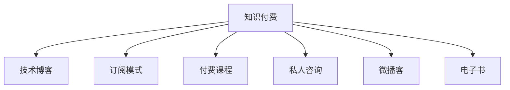

                 

# 程序员如何利用知识付费实现被动收入

> 关键词：知识付费, 程序员, 被动收入, 技术博客, 专业IT领域

## 1. 背景介绍

### 1.1 问题由来

在快速变化的技术环境中，不断学习和更新知识成为了程序员职业生涯中的重要一环。然而，面对繁杂且庞大的学习资源，如何高效地吸收新知，并转化为实际工作中的竞争力，成为了许多程序员面临的挑战。知识的获取和应用，不再是简单的教育和实践，更成为了一种生产要素和商业模式。

知识付费作为信息时代的一种新兴模式，通过提供有价值的内容和知识，帮助人们快速获取技能，节省时间成本。对于程序员而言，如何利用知识付费，不仅可以获得个人技能提升，还能转化为可持续的被动收入，成为越来越多人的关注焦点。

### 1.2 问题核心关键点

知识付费的本质是通过有偿方式提供高质量的信息和知识服务。对于程序员来说，知识付费不仅是一种学习工具，更是建立专业品牌、实现持续收益的重要途径。核心关键点在于：

1. **内容质量**：高质量、实用性强的内容能够吸引并留住用户，形成稳定的收入来源。
2. **用户体验**：友好的平台设计和互动机制，提升用户体验，增加用户粘性。
3. **市场定位**：明确市场定位，精准打击目标用户群体，提高收益效率。
4. **变现模式**：多样化变现策略，包括订阅费、付费课程、私人咨询等，增加收入渠道。
5. **持续更新**：不断更新和完善内容，保持市场竞争力。

## 2. 核心概念与联系

### 2.1 核心概念概述

为更好地理解程序员如何利用知识付费实现被动收入，本节将介绍几个关键概念：

- **知识付费**：通过付费方式获取知识和信息，如在线课程、电子书、技术博客等，利用知识和技能创造价值。
- **技术博客**：以编程、技术分享、经验总结等为主题的网络平台，成为程序员知识输出的重要方式。
- **订阅模式**：用户定期支付固定费用，获取平台的全部或部分内容。
- **付费课程**：针对特定技能或知识点的在线教学课程，通过收费提供深度学习资源。
- **私人咨询**：以一对一的形式，针对用户具体问题提供个性化技术支持和解决方案。
- **微播客**：通过音频或视频形式，分享日常开发经验、行业动态等，为听众提供实时交流的机会。
- **电子书**：结合文字和图形，提供系统的知识内容，方便用户随时随地学习。

这些核心概念之间的逻辑关系可以通过以下Mermaid流程图来展示：



这个流程图展示出知识付费的多个实现形式，它们共同构成了知识付费的生态系统。

## 3. 核心算法原理 & 具体操作步骤
### 3.1 算法原理概述

程序员利用知识付费实现被动收入，本质上是一种内容创造与商业变现的结合。其核心算法原理在于：

1. **内容创造**：通过撰写高质量的技术博客、开发付费课程、制作微播客等，创造有价值的内容。
2. **内容推广**：利用社交媒体、SEO优化等手段，提高内容的曝光度和访问量。
3. **用户转化**：通过精心设计的营销策略，将潜在用户转化为实际付费用户。
4. **变现策略**：采用多种变现模式，如订阅费、课程费、咨询费等，实现收入的多元化。

### 3.2 算法步骤详解

基于知识付费的被动收入实现，主要包括以下几个关键步骤：

**Step 1: 内容创作**

- **选题策划**：确定内容主题和目标受众，确保内容与市场需求匹配。
- **内容制作**：撰写文章、录制视频、开发课程等，提供系统化的知识资源。
- **互动交流**：在平台评论区、私信等渠道与用户互动，解答疑问，增强用户粘性。

**Step 2: 平台选择**

- **平台搭建**：选择合适的知识付费平台（如知乎、微信公众号、Coursera、Udemy等）进行内容发布。
- **功能优化**：根据平台特性，优化内容呈现形式，提升用户体验。

**Step 3: 营销推广**

- **社交媒体**：在微博、LinkedIn、GitHub等社交平台上分享内容，扩大受众范围。
- **SEO优化**：优化博客标题、正文和元数据，提高搜索引擎排名，吸引更多流量。
- **邮件营销**：通过邮件订阅机制，定期推送优质内容，保持用户活跃度。

**Step 4: 用户转化**

- **会员体系**：建立会员等级制度，提供特权内容，激励用户订阅。
- **优惠活动**：定期推出限时优惠，吸引新用户尝试付费服务。
- **用户反馈**：收集用户反馈，不断改进内容质量和平台体验。

**Step 5: 变现策略**

- **订阅模式**：设置月度或年度订阅，获取固定收入。
- **付费课程**：推出系统课程，根据内容深度和难度定价。
- **私人咨询**：提供一对一技术支持，按项目或小时收费。
- **广告收入**：通过平台内广告位，获得额外收入。

**Step 6: 收入分配**

- **平台分成**：按照平台约定比例，分配收入。
- **个人收益**：扣除平台抽成后，将剩余收入存入个人账户，用于再投资或消费。

以上是利用知识付费实现被动收入的基本步骤，每个步骤都需要精细化操作和持续优化。

### 3.3 算法优缺点

知识付费的被动收入实现方法，具有以下优点：

1. **灵活性高**：内容形式多样，用户选择范围广，适合不同兴趣和需求的用户。
2. **门槛低**：技术门槛较低，只要有内容和创意即可开始操作。
3. **收益稳定**：高质量内容能吸引稳定用户，持续收益可期。

同时，也存在一些缺点：

1. **用户获取难度**：新用户的获取需要时间和精力投入。
2. **竞争激烈**：市场上知识付费平台众多，内容同质化现象严重。
3. **内容更新周期**：需要持续生产新内容，保持市场竞争力。
4. **平台抽成**：部分平台抽成比例较高，影响个人收入。

尽管存在这些局限，但知识付费作为新兴的商业模式，仍然具有广阔的市场潜力和发展前景。

### 3.4 算法应用领域

知识付费的被动收入实现方法，不仅适用于程序员，更适用于各类专业人士，如教师、律师、艺术家等。通过分享专业知识，提供专业服务，这些专业人士同样可以实现被动收入的持续增长。

在实际应用中，知识付费的变现领域包括但不限于以下几个方面：

- **教育培训**：提供编程课程、设计课程、语言课程等。
- **技术咨询**：提供技术方案、项目顾问、问题诊断等服务。
- **内容创作**：撰写书籍、文章、电子书等，提供系统性知识。
- **市场分析**：提供行业报告、市场分析、趋势预测等服务。
- **个人品牌建设**：通过博客、社交媒体等平台，建立个人品牌，吸引更多用户关注。

## 4. 数学模型和公式 & 详细讲解  
### 4.1 数学模型构建

本节将使用数学语言对知识付费的被动收入实现过程进行更加严格的刻画。

设内容总价值为 $V$，平台抽成为 $C$，用户数为 $N$，单次订阅费用为 $S$，课程费用为 $C$，私人咨询费用为 $P$。则总收入 $I$ 可表示为：

$$
I = (N \times S) + (N \times C) + (N \times P)
$$

其中，$N$ 是不同形式内容的用户数，$S$ 是订阅模式的收入，$C$ 是付费课程的收入，$P$ 是私人咨询的收入。

### 4.2 公式推导过程

根据上述定义，我们可以推导出单次内容价值 $V$ 的计算公式：

$$
V = N \times (S + C + P)
$$

式中，$N$ 代表从不同形式内容中获取用户数，$S$、$C$、$P$ 分别代表订阅、课程、咨询等形式的收入。

### 4.3 案例分析与讲解

以一位技术博主为例，分析其通过知识付费实现被动收入的过程：

1. **内容创作**：博主撰写高质量的编程博客，每月更新三篇文章，每篇阅读量达到10万次。
2. **平台选择**：通过知乎专栏和微信公众号发布内容，并使用GitHub存储源代码和示例项目。
3. **营销推广**：通过SEO优化提高文章排名，在LinkedIn分享博客，在Twitter发布技术动态。
4. **用户转化**：设置知乎专栏的会员制度，每月固定收入1000元；同时提供单次付费文章下载，价格为5元/篇。
5. **变现策略**：推出订阅会员，提供专属内容、优先评论等特权；推出针对特定主题的课程，价格为199元/门。

通过以上步骤，该博主能够稳定获得订阅费、课程费和私人咨询费，实现被动收入的持续增长。

## 5. 项目实践：代码实例和详细解释说明
### 5.1 开发环境搭建

在进行知识付费项目实践前，我们需要准备好开发环境。以下是使用Python进行知识付费平台开发的环境配置流程：

1. 安装Anaconda：从官网下载并安装Anaconda，用于创建独立的Python环境。

2. 创建并激活虚拟环境：
```bash
conda create -n knowledge-payment python=3.8 
conda activate knowledge-payment
```

3. 安装Python相关库：
```bash
pip install flask pandas numpy matplotlib scikit-learn pythontidy
```

4. 安装其他工具：
```bash
pip install markdown google-cloud-storage
```

完成上述步骤后，即可在`knowledge-payment`环境中开始知识付费平台的开发。

### 5.2 源代码详细实现

下面以一个简单的技术博客为例，展示如何搭建一个基本的知识付费平台。

```python
from flask import Flask, render_template, request, redirect, url_for
from flask_sqlalchemy import SQLAlchemy
from markdown import markdown
import os

app = Flask(__name__)
app.config['SQLALCHEMY_DATABASE_URI'] = 'sqlite:///blog.db'
app.config['SQLALCHEMY_TRACK_MODIFICATIONS'] = False

db = SQLAlchemy(app)

class BlogPost(db.Model):
    id = db.Column(db.Integer, primary_key=True)
    title = db.Column(db.String(80), unique=True, nullable=False)
    content = db.Column(db.Text, nullable=False)
    views = db.Column(db.Integer, default=0)

@app.route('/')
def home():
    posts = BlogPost.query.all()
    return render_template('index.html', posts=posts)

@app.route('/create', methods=['GET', 'POST'])
def create_post():
    if request.method == 'POST':
        title = request.form['title']
        content = markdown(request.form['content'])
        post = BlogPost(title=title, content=content)
        db.session.add(post)
        db.session.commit()
        return redirect(url_for('home'))
    return render_template('create.html')

@app.route('/post/<id>')
def post(id):
    post = BlogPost.query.get_or_404(id)
    return render_template('post.html', post=post)

if __name__ == '__main__':
    app.run(debug=True)
```

上述代码创建了一个简单的博客平台，包含文章列表、文章创建、文章详情三个页面。文章存储在SQLite数据库中，每篇文章有一个标题、内容和一个阅读计数。通过Flask框架实现了基本的路由功能。

### 5.3 代码解读与分析

让我们再详细解读一下关键代码的实现细节：

**App和数据库配置**：
```python
app = Flask(__name__)
app.config['SQLALCHEMY_DATABASE_URI'] = 'sqlite:///blog.db'
app.config['SQLALCHEMY_TRACK_MODIFICATIONS'] = False
db = SQLAlchemy(app)
```

初始化Flask应用，配置数据库连接和监控模式。

**模型定义**：
```python
class BlogPost(db.Model):
    id = db.Column(db.Integer, primary_key=True)
    title = db.Column(db.String(80), unique=True, nullable=False)
    content = db.Column(db.Text, nullable=False)
    views = db.Column(db.Integer, default=0)
```

定义BlogPost模型，包含id、title、content和views（阅读计数）。

**路由定义**：
```python
@app.route('/')
def home():
    posts = BlogPost.query.all()
    return render_template('index.html', posts=posts)

@app.route('/create', methods=['GET', 'POST'])
def create_post():
    if request.method == 'POST':
        title = request.form['title']
        content = markdown(request.form['content'])
        post = BlogPost(title=title, content=content)
        db.session.add(post)
        db.session.commit()
        return redirect(url_for('home'))
    return render_template('create.html')

@app.route('/post/<id>')
def post(id):
    post = BlogPost.query.get_or_404(id)
    return render_template('post.html', post=post)
```

定义路由，实现文章列表、文章创建和文章详情的页面呈现。

**视图函数**：
```python
@app.route('/')
def home():
    posts = BlogPost.query.all()
    return render_template('index.html', posts=posts)

@app.route('/create', methods=['GET', 'POST'])
def create_post():
    if request.method == 'POST':
        title = request.form['title']
        content = markdown(request.form['content'])
        post = BlogPost(title=title, content=content)
        db.session.add(post)
        db.session.commit()
        return redirect(url_for('home'))
    return render_template('create.html')

@app.route('/post/<id>')
def post(id):
    post = BlogPost.query.get_or_404(id)
    return render_template('post.html', post=post)
```

定义视图函数，处理请求并返回相应的模板。

## 6. 实际应用场景
### 6.1 教育培训

教育培训是最常见的知识付费应用场景之一。传统教育往往受到时间和地点的限制，而知识付费平台可以打破这些限制，实现随时随地学习。

程序员可以通过录制编程课程、开发在线题库、编写教学文档等，构建自己的教育培训平台。通过订阅模式或单次付费，获取稳定收入。此外，还可以通过直播互动、在线答疑等方式，增强用户体验，提升平台黏性。

### 6.2 技术咨询

技术咨询是知识付费平台的重要变现手段。具有丰富经验的程序员，可以通过提供技术方案、项目诊断、问题解答等服务，帮助企业或个人解决技术难题。

知识付费平台可以提供在线咨询、私人邮件、电话会议等多种服务形式。用户可以根据具体需求选择合适的服务，支付相应费用。技术咨询不仅能帮助用户解决问题，还能提升个人品牌价值，吸引更多客户。

### 6.3 内容创作

内容创作是知识付费平台的重要基础。优秀的程序员可以通过撰写高质量的博客、技术文章、电子书等，构建内容生态。内容可以采用订阅模式、单次付费或打赏等多种形式变现。

通过持续更新内容，吸引和留住用户，形成稳定的用户群体。内容创作不仅能带来被动收入，还能提升个人技术水平和知名度，形成良性循环。

### 6.4 未来应用展望

随着知识付费市场的不断成熟，未来的知识付费平台将呈现以下几个趋势：

1. **多样化内容形式**：除了文章、视频、课程等传统形式，还会涌现更多新的内容形式，如音频播客、图文并茂的电子书、虚拟现实课程等。
2. **智能化推荐**：利用AI算法，根据用户兴趣和行为，提供个性化内容推荐，提升用户体验。
3. **实时互动**：通过实时互动工具，如在线聊天、直播授课等，增强用户参与感，提升学习效果。
4. **多平台联动**：将知识付费平台与社交媒体、视频平台等进行联动，扩大用户覆盖范围。
5. **内容众包**：引入用户生成内容，通过众包模式丰富内容生态，降低运营成本。

这些趋势将推动知识付费平台向更加智能化、个性化的方向发展，为用户提供更优质的服务体验。

## 7. 工具和资源推荐
### 7.1 学习资源推荐

为了帮助开发者系统掌握知识付费的实现方法和商业模型，这里推荐一些优质的学习资源：

1. **《知识付费：内容、平台与变现》**：深入浅出地介绍了知识付费的原理、平台搭建、内容创作和变现策略。
2. **Coursera和Udemy平台**：提供大量课程开发和平台运营的实战经验。
3. **Mindvalley课程**：提供系统化的内容创作和变现培训，帮助学员快速上手知识付费。
4. **谷歌开发者文档**：详细介绍了Flask等框架的使用方法，提供丰富的实践示例。

通过对这些资源的学习实践，相信你一定能够快速掌握知识付费的精髓，并用于解决实际的NLP问题。
###  7.2 开发工具推荐

高效的开发离不开优秀的工具支持。以下是几款用于知识付费平台开发的常用工具：

1. **Flask**：基于Python的微框架，简单易用，适合快速迭代开发。
2. **SQLAlchemy**：Python ORM工具，方便数据库操作。
3. **Pythontidy**：代码质量检查工具，提高代码规范性。
4. **Jekyll和GitHub Pages**：静态博客生成工具，方便知识输出和分享。
5. **Markdown**：轻量级标记语言，方便内容创作和排版。
6. **Ghost CMS**：功能强大的内容管理系统，提供丰富的内容管理和运营功能。

合理利用这些工具，可以显著提升知识付费平台的开发效率，加快创新迭代的步伐。

### 7.3 相关论文推荐

知识付费作为信息时代的新兴商业模式，近年来受到学界的广泛关注。以下是几篇奠基性的相关论文，推荐阅读：

1. **《知识付费平台的创新与挑战》**：探讨知识付费平台的技术实现和商业模型。
2. **《知识付费与人工智能的融合》**：分析知识付费平台如何借助AI技术提升用户体验和运营效率。
3. **《知识付费市场的发展趋势与挑战》**：研究知识付费市场的现状和未来发展方向。
4. **《知识付费的商业模式创新与实践》**：介绍知识付费平台的多样化变现策略和运营经验。

这些论文代表了大语言模型微调技术的发展脉络。通过学习这些前沿成果，可以帮助研究者把握学科前进方向，激发更多的创新灵感。

## 8. 总结：未来发展趋势与挑战
### 8.1 总结

本文对知识付费的被动收入实现方法进行了全面系统的介绍。首先阐述了知识付费的本质及其在程序员职业发展中的重要意义，明确了知识付费在提升技术能力、实现可持续收入方面的独特价值。其次，从原理到实践，详细讲解了知识付费的数学模型、核心算法和具体操作步骤，给出了知识付费项目开发的完整代码实例。同时，本文还广泛探讨了知识付费在教育培训、技术咨询、内容创作等多个行业领域的应用前景，展示了知识付费平台的广阔潜力。此外，本文精选了知识付费的相关学习资源，力求为读者提供全方位的技术指引。

通过本文的系统梳理，可以看到，知识付费作为程序员实现被动收入的重要手段，具有广泛的应用前景和价值。未来，伴随知识付费市场的不断成熟，内容创作和平台运营的精细化管理，相信知识付费平台将成为程序员技术分享、知识变现的重要途径，助力程序员实现职业转型和持续发展。

### 8.2 未来发展趋势

展望未来，知识付费平台将呈现以下几个发展趋势：

1. **内容多样化**：平台内容将更加丰富，形式更加多样化，如视频、音频、图文、互动等。
2. **运营智能化**：利用AI和大数据技术，优化内容推荐、用户画像和运营策略，提升平台效率和用户粘性。
3. **社区化建设**：构建开放的知识分享社区，促进用户互动和知识交流，形成学习型生态。
4. **个性化定制**：通过用户行为分析，提供个性化内容和服务，满足不同用户的需求。
5. **国际化扩展**：开拓国际市场，扩大用户覆盖范围，提升全球影响力。

这些趋势将推动知识付费平台向更加智能化、社区化的方向发展，为用户带来更优质的学习体验。

### 8.3 面临的挑战

尽管知识付费平台发展前景广阔，但在迈向更加智能化、普适化应用的过程中，它仍面临诸多挑战：

1. **内容质量参差不齐**：内容质量不一，用户筛选难度大，优质内容的稀缺性带来平台运营压力。
2. **用户体验有待提升**：用户互动机制不完善，平台粘性不足，需进一步优化用户体验。
3. **变现模式单一**：依赖订阅模式，收入结构单一，平台可持续性受限。
4. **数据隐私问题**：用户数据隐私保护机制不完善，需加强数据安全防护。
5. **市场竞争激烈**：平台数量众多，市场竞争激烈，需不断创新和优化运营策略。

尽管存在这些挑战，但知识付费作为新兴的商业模式，仍具有广阔的市场潜力和发展前景。

### 8.4 研究展望

面向未来，知识付费平台的研究需要在以下几个方面寻求新的突破：

1. **内容聚合与推荐**：构建高效的内容聚合与推荐系统，提升用户发现优质内容的能力。
2. **用户行为分析**：通过大数据分析，深入理解用户需求和行为，提供更个性化的服务和内容。
3. **多平台联动**：将知识付费平台与社交媒体、视频平台等进行联动，扩大用户覆盖范围。
4. **社区化运营**：构建开放的知识分享社区，促进用户互动和知识交流，形成学习型生态。
5. **区块链应用**：利用区块链技术，保障内容版权和交易透明，提升平台信任度和安全性。

这些研究方向的探索，必将引领知识付费平台向更高的台阶，为程序员技术分享、知识变现提供更广阔的空间。只有勇于创新、敢于突破，才能不断拓展知识付费平台的边界，为用户带来更优质的学习体验。

## 9. 附录：常见问题与解答
### 9.1 问答

**Q1：知识付费是否只适用于技术领域？**

A: 知识付费不只适用于技术领域，任何专业领域的专业知识和技能分享，都可以通过知识付费实现价值变现。例如，金融、医疗、教育、艺术等领域，均可以通过知识付费获取稳定收入。

**Q2：如何判断内容是否具有市场价值？**

A: 判断内容是否具有市场价值，可以从以下几个方面考虑：
1. **市场需求**：调研目标用户群体，分析其需求和痛点，确保内容能够解决实际问题。
2. **竞争分析**：分析市场上已有的相关内容，找到差异化的切入点。
3. **用户反馈**：通过试运行和用户反馈，验证内容的效果和受欢迎程度。

**Q3：如何提高内容变现效率？**

A: 提高内容变现效率，可以从以下几个方面入手：
1. **多元化变现**：除了订阅模式，还可以引入课程、咨询、广告、打赏等多种变现形式。
2. **精准营销**：通过数据分析，精准定位目标用户，提高转化率。
3. **优质内容**：不断提升内容质量，吸引和留住用户，形成长期稳定的收入。

**Q4：如何优化用户互动机制？**

A: 优化用户互动机制，可以从以下几个方面入手：
1. **社区建设**：构建开放的问答、讨论社区，促进用户互动和知识交流。
2. **实时答疑**：提供在线答疑机制，快速解决用户问题。
3. **用户反馈**：收集用户反馈，及时调整内容和策略，提高用户满意度。

通过这些措施，可以有效提升用户互动和平台粘性，提高知识付费平台的运营效率和用户价值。

**Q5：如何保持内容持续更新？**

A: 保持内容持续更新，可以从以下几个方面入手：
1. **内容规划**：制定长期的内容规划，确保内容持续输出。
2. **团队协作**：建立内容创作团队，分工明确，提升创作效率。
3. **用户激励**：通过会员体系、打赏机制等方式，激励用户参与内容创作和更新。

通过以上措施，可以有效保障内容的持续更新和质量提升，保持平台的用户吸引力和市场竞争力。

---

作者：禅与计算机程序设计艺术 / Zen and the Art of Computer Programming

