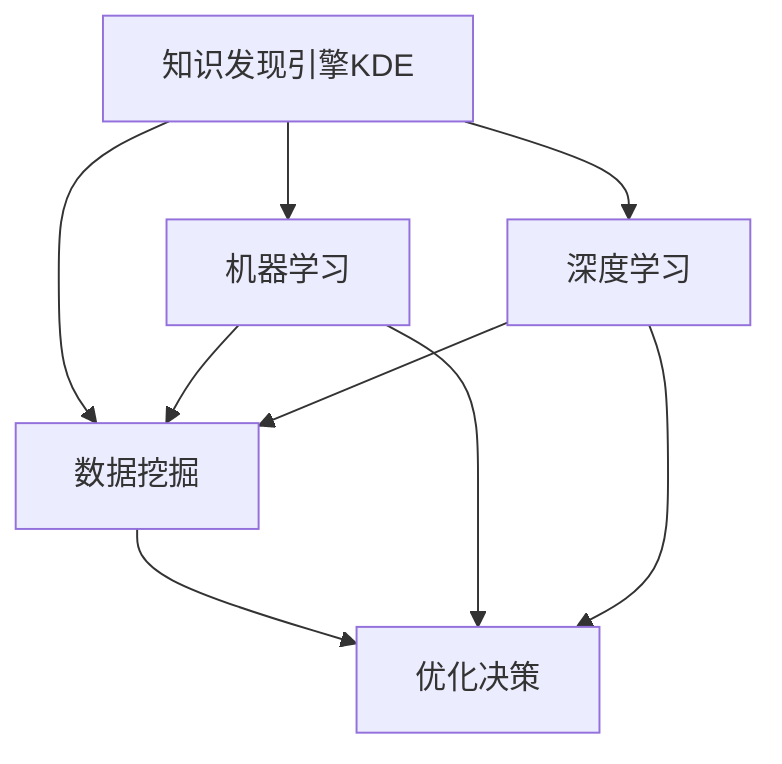

                 

## 1. 背景介绍

### 1.1 问题由来
在现代社会，信息技术日益普及，数据量爆炸式增长，知识管理已成为组织和个人提升工作效率、创新能力和决策水平的关键。知识发现（Knowledge Discovery，简称KD）作为信息时代的重要技术，能够从大量数据中提取有价值的信息和知识，辅助决策、优化流程、提升绩效。然而，传统的知识发现技术往往依赖复杂的数据库和统计方法，需要专业技术人员参与，且运行成本高昂。

### 1.2 问题核心关键点
为了降低知识发现的门槛，提高其普及性和应用效果，利用先进的数据挖掘技术和人工智能算法，推出知识发现引擎（Knowledge Discovery Engine，简称KDE）变得尤为重要。通过KDE，程序员可以更方便、高效地从数据中发现知识，驱动决策和创新。

### 1.3 问题研究意义
知识发现引擎的出现，为程序员和组织提供了强有力的知识管理工具，具有以下重要意义：
1. **提高工作效率**：自动化数据挖掘和知识发现过程，减少重复劳动。
2. **优化决策支持**：基于数据驱动的决策，提升决策质量。
3. **增强创新能力**：通过知识整合和分析，激发新的创意和解决方案。
4. **提升绩效**：优化流程和业务模式，降低运营成本，提高效率。

## 2. 核心概念与联系

### 2.1 核心概念概述

为更好地理解知识发现引擎的工作原理和应用场景，本节将介绍几个关键概念：

- **知识发现引擎(KDE)**：利用数据挖掘和人工智能算法，自动从大量数据中提取和发现知识的工具。通过KDE，程序员可以快速获取数据中的关键信息，辅助决策和创新。

- **数据挖掘(Data Mining)**：从数据中挖掘隐藏模式、关联和知识的过程，是知识发现的重要组成部分。常见的数据挖掘技术包括分类、聚类、关联规则挖掘等。

- **机器学习(Machine Learning)**：使计算机系统从数据中自动学习并改进性能的算法，是知识发现的重要手段。

- **人工智能(AI)**：使计算机系统具备智能推理、学习、决策等能力的科学和技术。知识发现引擎作为AI的一个分支，通过算法实现自动化的知识发现。

- **深度学习(Deep Learning)**：利用多层次神经网络模型，从数据中自动学习和提取高级特征。深度学习技术是现代知识发现引擎的重要支持。

这些概念之间的逻辑关系可以通过以下Mermaid流程图来展示：



这个流程图展示知识发现引擎的核心概念及其之间的关系：

1. 知识发现引擎以数据挖掘为工具，从数据中提取模式和知识。
2. 机器学习算法用于模型训练和优化，提升数据挖掘效果。
3. 深度学习技术进一步增强了数据挖掘和模型训练的深度和精度。
4. 通过优化决策支持系统，将知识转化为可执行的决策。

这些概念共同构成了知识发现引擎的工作原理和应用框架，使其能够在各种场景下提供高效的知识发现服务。通过理解这些核心概念，我们可以更好地把握知识发现引擎的工作机制和优化方向。

## 3. 核心算法原理 & 具体操作步骤
### 3.1 算法原理概述

知识发现引擎的原理主要基于数据挖掘和机器学习技术，其核心流程包括以下几个步骤：

1. **数据预处理**：清洗、整合、转换数据，使之适合进行挖掘和分析。
2. **特征工程**：选择、构造、优化特征，提升模型性能。
3. **模型训练**：选择合适的机器学习算法，训练数据模型。
4. **模型评估**：通过交叉验证等技术评估模型效果，进行参数调优。
5. **知识发现**：利用模型从数据中发现知识模式和关联。

这些步骤构成了知识发现引擎的基本工作流程。其中，数据预处理和特征工程是数据挖掘的基础，模型训练和评估是提高模型精度的关键，知识发现是知识发现引擎的最终目的。

### 3.2 算法步骤详解

知识发现引擎的具体操作步骤包括以下几个关键环节：

**Step 1: 数据预处理**

数据预处理是知识发现的首要步骤，包括数据清洗、数据整合、数据转换等。通过预处理，使数据更加规范、完整、准确，适合进一步分析和挖掘。

**Step 2: 特征工程**

特征工程是数据挖掘的核心步骤，通过选择、构造和优化特征，提升模型的表现力。

- **特征选择**：根据业务需求和模型要求，选择最相关、最有信息的特征。
- **特征构造**：利用统计学、机器学习等方法构造新的特征，提升模型性能。
- **特征优化**：通过降维、正则化等技术优化特征，降低维度，提升模型泛化能力。

**Step 3: 模型训练**

模型训练是知识发现的算法核心，通过选择合适的机器学习算法，训练数据模型。

- **算法选择**：根据任务类型和数据特点，选择合适的算法，如决策树、随机森林、神经网络等。
- **模型训练**：利用训练数据集训练模型，调整模型参数。
- **模型评估**：通过交叉验证、ROC曲线等技术评估模型性能，调整模型参数。

**Step 4: 模型评估**

模型评估是知识发现的保障，通过评估模型效果，优化模型参数，提升模型精度。

- **交叉验证**：通过k-fold交叉验证评估模型性能，避免过拟合。
- **ROC曲线**：通过ROC曲线评估模型性能，选择最佳阈值。
- **参数调优**：通过网格搜索、贝叶斯优化等技术，调整模型参数，提升模型性能。

**Step 5: 知识发现**

知识发现是知识发现引擎的最终目的，通过训练好的模型，从数据中发现有价值的信息和知识。

- **模式识别**：通过训练好的模型识别数据中的模式和关联。
- **关联规则挖掘**：利用频繁项集挖掘算法发现数据中的关联规则。
- **聚类分析**：利用聚类算法发现数据中的群组和类别。

### 3.3 算法优缺点

知识发现引擎具有以下优点：
1. **自动化程度高**：能够自动从数据中挖掘知识和模式，减少人工参与。
2. **精度高**：基于机器学习和深度学习技术，模型精度高，能够发现深层次的知识和模式。
3. **适用性强**：适用于各种类型的业务场景，覆盖面广。

同时，知识发现引擎也存在一些局限性：
1. **数据质量要求高**：数据预处理和特征工程对数据质量要求较高，数据不完整、不规范会影响挖掘效果。
2. **模型复杂**：算法复杂度较高，需要大量的计算资源和时间成本。
3. **解释性差**：部分算法模型难以解释其内部工作机制和决策过程。

尽管存在这些局限性，但就目前而言，知识发现引擎已成为大数据时代知识管理的重要工具，具有广阔的应用前景。未来相关研究的方向在于如何进一步提高算法的解释性，降低对数据质量的要求，提升模型的实时性，以满足更多的实际应用需求。

### 3.4 算法应用领域

知识发现引擎在多个领域得到广泛应用，例如：

- **金融领域**：用于市场趋势预测、信用评估、风险管理等，辅助金融机构做出更加精准的决策。
- **医疗领域**：用于疾病预测、药物研发、临床路径优化等，提升医疗服务的智能化水平。
- **市场营销**：用于客户细分、市场分析、个性化推荐等，提升企业营销效果和客户满意度。
- **供应链管理**：用于需求预测、库存管理、物流优化等，提升供应链的效率和透明度。
- **人力资源**：用于员工绩效评估、人才招聘、培训优化等，提升人力资源管理的智能化水平。

此外，知识发现引擎还在电子商务、教育、物流、城市管理等多个领域得到应用，为各行各业带来新的变革和机遇。

## 4. 数学模型和公式 & 详细讲解 & 举例说明

### 4.1 数学模型构建

本节将使用数学语言对知识发现引擎的工作原理进行更加严格的刻画。

记数据集为 $D=\{(x_i,y_i)\}_{i=1}^N$，其中 $x_i$ 为特征向量，$y_i$ 为标签。知识发现引擎的数学模型可以表示为：

$$
\mathcal{M} = \mathop{\arg\min}_{\theta} \sum_{i=1}^N \ell(\mathcal{M}(x_i),y_i)
$$

其中 $\mathcal{M}$ 为知识发现引擎的模型，$\theta$ 为模型参数，$\ell$ 为损失函数，衡量模型预测输出与真实标签之间的差异。

### 4.2 公式推导过程

以下我们以分类任务为例，推导逻辑回归模型的损失函数及其梯度的计算公式。

假设模型 $\mathcal{M}$ 在输入 $x$ 上的输出为 $\hat{y}=\sigma(\mathcal{W}x+b)$，其中 $\sigma$ 为sigmoid函数，$\mathcal{W}$ 和 $b$ 为模型参数。

定义模型 $\mathcal{M}$ 在数据样本 $(x,y)$ 上的损失函数为 $\ell(\mathcal{M}(x),y)=y\log \sigma(\mathcal{W}x+b)+(1-y)\log(1-\sigma(\mathcal{W}x+b))$，在数据集 $D$ 上的经验风险为：

$$
\mathcal{L}(\mathcal{M},D) = \frac{1}{N}\sum_{i=1}^N \ell(\mathcal{M}(x_i),y_i)
$$

根据链式法则，损失函数对模型参数 $\theta$ 的梯度为：

$$
\frac{\partial \mathcal{L}(\mathcal{M},D)}{\partial \theta} = -\frac{1}{N}\sum_{i=1}^N (\frac{y_i}{\sigma(\mathcal{W}x_i+b)}-\frac{1-y_i}{1-\sigma(\mathcal{W}x_i+b)}) \frac{\partial (\mathcal{W}x_i+b)}{\partial \theta}
$$

其中 $\frac{\partial (\mathcal{W}x_i+b)}{\partial \theta}=\mathcal{W}$。通过求解上述梯度方程，可以使用梯度下降等优化算法更新模型参数，最小化损失函数，完成模型的迭代优化。

### 4.3 案例分析与讲解

在实际应用中，知识发现引擎的案例分析可以更好地展示其工作原理和应用效果。

**案例1：市场趋势预测**

某电商平台希望通过知识发现引擎预测市场趋势，优化商品库存和价格策略。通过收集历史销售数据、市场调研数据、用户反馈数据等，构建包含用户行为、商品属性、时间特征等多维特征的预测模型。在模型训练阶段，选择合适的算法（如线性回归、随机森林、神经网络等），利用交叉验证等技术评估模型性能，调整模型参数。在模型应用阶段，利用训练好的模型对新数据进行预测，辅助决策。

**案例2：信用评估**

某银行希望通过知识发现引擎进行客户信用评估，降低贷款风险。通过收集客户历史交易数据、信用记录、社交网络数据等，构建包含财务状况、交易行为、社交关系等多维特征的评估模型。在模型训练阶段，选择合适的算法（如逻辑回归、支持向量机、决策树等），利用交叉验证等技术评估模型性能，调整模型参数。在模型应用阶段，利用训练好的模型对新客户进行信用评估，辅助贷款审批。

这些案例展示了知识发现引擎在实际应用中的具体流程和效果，验证了其在复杂业务场景中的强大应用潜力。

## 5. 项目实践：代码实例和详细解释说明
### 5.1 开发环境搭建

在进行知识发现引擎的实践开发前，需要先配置开发环境。以下是使用Python进行Scikit-learn开发的配置流程：

1. 安装Anaconda：从官网下载并安装Anaconda，用于创建独立的Python环境。

2. 创建并激活虚拟环境：
```bash
conda create -n kde-env python=3.8 
conda activate kde-env
```

3. 安装Scikit-learn：
```bash
conda install scikit-learn pandas matplotlib
```

4. 安装各类工具包：
```bash
pip install numpy scikit-learn matplotlib
```

完成上述步骤后，即可在`kde-env`环境中开始知识发现引擎的开发实践。

### 5.2 源代码详细实现

下面我们以信用评估任务为例，给出使用Scikit-learn进行知识发现引擎的PyTorch代码实现。

首先，定义数据预处理和特征工程函数：

```python
from sklearn.preprocessing import StandardScaler
from sklearn.model_selection import train_test_split
from sklearn.linear_model import LogisticRegression
from sklearn.metrics import accuracy_score

def preprocess_data(data):
    features = data.drop(['default'], axis=1)
    labels = data['default']
    scaler = StandardScaler()
    features = scaler.fit_transform(features)
    return features, labels

def feature_engineering(features, labels):
    features = pd.get_dummies(features)
    return features, labels
```

然后，定义模型训练和评估函数：

```python
def train_model(features, labels):
    model = LogisticRegression(C=0.1)
    model.fit(features, labels)
    return model

def evaluate_model(model, features, labels):
    preds = model.predict(features)
    accuracy = accuracy_score(labels, preds)
    print(f"Accuracy: {accuracy:.2f}")
```

最后，启动训练流程并在测试集上评估：

```python
import pandas as pd

# 加载数据集
data = pd.read_csv('credit.csv')

# 数据预处理
features, labels = preprocess_data(data)

# 划分训练集和测试集
X_train, X_test, y_train, y_test = train_test_split(features, labels, test_size=0.2, random_state=42)

# 特征工程
X_train, X_test = feature_engineering(X_train, y_train), feature_engineering(X_test, y_test)

# 模型训练
model = train_model(X_train, y_train)

# 模型评估
evaluate_model(model, X_test, y_test)
```

以上就是使用Scikit-learn对信用评估任务进行知识发现引擎的完整代码实现。可以看到，得益于Scikit-learn的强大封装，我们可以用相对简洁的代码完成模型训练和评估。

### 5.3 代码解读与分析

让我们再详细解读一下关键代码的实现细节：

**preprocess_data函数**：
- 定义数据预处理函数，将数据集拆分为特征和标签。
- 使用StandardScaler对特征进行归一化处理。

**feature_engineering函数**：
- 定义特征工程函数，将分类特征进行独热编码。

**train_model函数**：
- 定义模型训练函数，使用LogisticRegression算法训练模型。

**evaluate_model函数**：
- 定义模型评估函数，在测试集上评估模型性能。

**训练流程**：
- 首先加载数据集，进行数据预处理和特征工程。
- 划分为训练集和测试集。
- 训练LogisticRegression模型。
- 在测试集上评估模型性能。

可以看到，Scikit-learn的强大封装使得知识发现引擎的代码实现变得简洁高效。开发者可以将更多精力放在数据处理、模型改进等高层逻辑上，而不必过多关注底层的实现细节。

当然，工业级的系统实现还需考虑更多因素，如模型的保存和部署、超参数的自动搜索、更灵活的任务适配层等。但核心的知识发现过程基本与此类似。

## 6. 实际应用场景
### 6.1 金融领域

在金融领域，知识发现引擎可以广泛应用于市场趋势预测、信用评估、风险管理等场景。通过分析大量交易数据、财务报表、社交媒体等数据，挖掘出有价值的信息和知识，辅助金融机构做出更加精准的决策。例如，通过历史数据挖掘，发现市场趋势的波动规律，预测未来价格走势，优化交易策略；通过用户行为数据，评估客户信用风险，降低贷款损失率。

### 6.2 医疗领域

在医疗领域，知识发现引擎可以用于疾病预测、药物研发、临床路径优化等。通过分析电子病历、基因数据、医学文献等数据，发现疾病发展趋势和潜在关联，辅助医生做出诊断和治疗方案。例如，通过分析患者基因数据，发现疾病风险基因，提前预防疾病；通过分析医学文献，发现新药物的潜在疗效，加速药物研发进程。

### 6.3 市场营销

在市场营销领域，知识发现引擎可以用于客户细分、市场分析、个性化推荐等。通过分析用户行为数据、交易数据、社交网络数据等，挖掘出用户的潜在需求和偏好，制定精准的营销策略。例如，通过分析用户浏览和购买行为，发现用户的偏好和兴趣点，进行个性化推荐，提高用户满意度和转化率；通过分析社交网络数据，发现用户社群特征，制定更具针对性的营销策略。

### 6.4 供应链管理

在供应链管理领域，知识发现引擎可以用于需求预测、库存管理、物流优化等。通过分析订单数据、库存数据、物流数据等，发现供应链中的瓶颈和优化机会，提升供应链的效率和透明度。例如，通过分析订单数据，发现需求的季节性和波动性，优化库存管理，降低库存成本；通过分析物流数据，发现物流瓶颈和优化机会，提升物流效率，降低物流成本。

### 6.5 未来应用展望

随着知识发现引擎的不断发展，其在更多领域得到应用，为各行各业带来新的变革和机遇。

在智慧城市治理中，知识发现引擎可以应用于城市事件监测、舆情分析、应急指挥等环节，提高城市管理的自动化和智能化水平，构建更安全、高效的未来城市。

在智能制造领域，知识发现引擎可以用于生产流程优化、质量控制、设备预测性维护等，提升制造业的智能化水平，降低生产成本，提高生产效率。

在环境保护领域，知识发现引擎可以用于污染监测、气象预测、能源管理等，提高环境保护的智能化水平，降低环境污染，实现可持续发展。

## 7. 工具和资源推荐
### 7.1 学习资源推荐

为了帮助开发者系统掌握知识发现引擎的理论基础和实践技巧，这里推荐一些优质的学习资源：

1. 《Python数据科学手册》：由Wes McKinney撰写，全面介绍Python数据科学库的使用，包括Numpy、Pandas、Scikit-learn等。

2. 《机器学习实战》：由Peter Harrington撰写，从基础理论到实际应用，全面介绍机器学习算法和代码实现。

3. 《深度学习入门》：由斋藤康毅撰写，深入浅出地介绍深度学习原理和实现，适合初学者入门。

4. 《TensorFlow实战Google深度学习框架》：由王啸撰写，全面介绍TensorFlow的搭建、训练和部署，适合深度学习开发。

5. 《Python数据可视化手册》：由Joel Nothman撰写，介绍Python数据可视化库的使用，包括Matplotlib、Seaborn、Bokeh等。

通过对这些资源的学习实践，相信你一定能够快速掌握知识发现引擎的精髓，并用于解决实际的业务问题。

### 7.2 开发工具推荐

高效的开发离不开优秀的工具支持。以下是几款用于知识发现引擎开发的常用工具：

1. Jupyter Notebook：免费的开源Jupyter Notebook环境，支持Python和Scikit-learn的交互式编程和可视化。

2. PyCharm：开源的Python IDE，支持Scikit-learn的集成开发，提供代码自动补全、调试等功能。

3. R Studio：开源的R语言IDE，支持R语言和Scikit-learn的交互式编程和可视化。

4. Orange：开源的数据挖掘工具，支持数据预处理、特征工程、模型训练等，易于上手使用。

5. RapidMiner：商业化的数据挖掘平台，提供丰富的数据挖掘组件和可视化界面，支持复杂的模型构建和优化。

6. Tableau：商业化的数据可视化工具，支持复杂数据可视化和大数据分析，提供丰富的图表和仪表盘设计功能。

合理利用这些工具，可以显著提升知识发现引擎的开发效率，加快创新迭代的步伐。

### 7.3 相关论文推荐

知识发现引擎的研究源于学界的持续研究。以下是几篇奠基性的相关论文，推荐阅读：

1. "Knowledge Discovery in Databases: An Introduction"：由Michael J. Kearns撰写，全面介绍知识发现的基本概念和应用场景。

2. "The Elements of Statistical Learning"：由Tibshirani, Hastie, Friedman撰写，全面介绍统计学习和机器学习的基本理论和方法。

3. "Pattern Recognition and Machine Learning"：由Christopher M. Bishop撰写，全面介绍模式识别和机器学习的基本理论和算法。

4. "Machine Learning Yearning"：由Andrew Ng撰写，全面介绍机器学习的应用实践，包括模型训练、超参数调优、模型评估等。

5. "Deep Learning for NLP"：由Ian Goodfellow, Yoshua Bengio, Aaron Courville撰写，全面介绍深度学习在NLP领域的应用。

这些论文代表了大数据时代知识发现引擎的发展脉络。通过学习这些前沿成果，可以帮助研究者把握学科前进方向，激发更多的创新灵感。

## 8. 总结：未来发展趋势与挑战

### 8.1 总结

本文对知识发现引擎的工作原理和应用场景进行了全面系统的介绍。首先阐述了知识发现引擎的研究背景和应用意义，明确了知识发现引擎在提升业务决策、优化流程和绩效方面的独特价值。其次，从原理到实践，详细讲解了知识发现引擎的数学模型和操作步骤，给出了知识发现引擎的完整代码实现。同时，本文还广泛探讨了知识发现引擎在金融、医疗、市场营销等多个行业领域的应用前景，展示了知识发现引擎的强大应用潜力。此外，本文精选了知识发现引擎的学习资源，力求为读者提供全方位的技术指引。

通过本文的系统梳理，可以看到，知识发现引擎作为知识管理的重要工具，正在为各行各业带来新的变革和机遇。通过从数据中挖掘知识，知识发现引擎能够在多个领域提供强有力的决策支持，提高业务效率和决策质量。未来，伴随数据科学和人工智能技术的不断演进，知识发现引擎必将在更多领域大放异彩。

### 8.2 未来发展趋势

展望未来，知识发现引擎的发展趋势主要包括以下几个方面：

1. **自动化水平提升**：未来知识发现引擎将更加自动化，能够自动进行数据预处理、特征工程、模型训练和评估，减少人工参与。

2. **模型复杂度降低**：通过优化算法和模型结构，降低模型的复杂度，提升模型的实时性和可解释性。

3. **多模态数据融合**：未来知识发现引擎将支持多模态数据的融合，利用视觉、语音、文本等多种数据源，提升模型的综合能力。

4. **实时性要求提升**：随着业务场景对实时性的要求提升，知识发现引擎将支持实时数据处理和模型更新，提升响应的速度和效率。

5. **智能推荐系统**：未来知识发现引擎将与推荐系统结合，提供更加精准的个性化推荐服务，提升用户体验和满意度。

6. **跨领域知识图谱**：未来知识发现引擎将构建跨领域知识图谱，实现知识在不同领域的有效传递和应用，提升跨领域协作能力。

以上趋势凸显了知识发现引擎的发展潜力和应用前景。这些方向的探索发展，必将进一步提升知识发现引擎的智能化水平，为各行各业带来新的变革和机遇。

### 8.3 面临的挑战

尽管知识发现引擎已经取得了显著的成就，但在迈向更加智能化、普适化应用的过程中，仍面临诸多挑战：

1. **数据质量要求高**：知识发现引擎依赖高质量的数据进行挖掘和分析，数据的不完整、不规范和噪声等都会影响挖掘效果。如何提高数据质量，降低数据预处理的复杂度，仍是亟需解决的问题。

2. **模型泛化能力弱**：部分算法模型在面对新的数据时，泛化能力较弱，容易出现过拟合现象。如何提高模型的泛化能力，增强其应对新数据的能力，仍是重要研究方向。

3. **实时性要求高**：许多应用场景对实时性要求较高，如实时风险评估、实时推荐等，如何提高知识发现引擎的实时处理能力，仍是重要挑战。

4. **可解释性差**：部分算法模型难以解释其内部工作机制和决策过程，难以进行人工干预和调试。如何提高模型的可解释性，增强其透明性，仍是重要研究方向。

5. **计算资源消耗大**：知识发现引擎通常需要大量计算资源进行训练和模型优化，如何降低计算成本，提高资源利用效率，仍是重要研究方向。

尽管存在这些挑战，但通过技术创新和工程实践的不断探索，知识发现引擎必将在未来的数据科学和人工智能领域发挥更大的作用，为各行各业带来更多的价值。

### 8.4 研究展望

面向未来，知识发现引擎的研究可以从以下几个方向进行深入探索：

1. **多模态数据挖掘**：研究多模态数据融合和挖掘技术，提升知识发现引擎的综合能力，支持复杂业务场景。

2. **实时数据处理**：研究实时数据处理和模型更新技术，提升知识发现引擎的响应速度和效率。

3. **可解释性增强**：研究可解释性增强技术，提高知识发现引擎的透明性和可解释性，增强人工干预能力。

4. **跨领域知识图谱**：研究跨领域知识图谱的构建和应用技术，实现知识在不同领域的高效传递和应用。

5. **模型复杂度优化**：研究模型复杂度优化技术，降低知识发现引擎的计算成本和复杂度，提升其普及性和应用效果。

6. **智能推荐系统**：研究智能推荐系统与知识发现引擎的结合应用，提供更加精准的个性化推荐服务，提升用户体验和满意度。

通过这些研究方向的研究和探索，知识发现引擎必将进一步提升其智能化水平，为各行各业带来更多的价值。面向未来，知识发现引擎将与大数据、人工智能等技术协同发展，共同推动数据科学和人工智能技术的前沿进步。

## 9. 附录：常见问题与解答

**Q1：知识发现引擎的开发难点是什么？**

A: 知识发现引擎的开发难点主要包括：
1. **数据预处理**：数据不完整、不规范、噪声等问题影响挖掘效果，需要投入大量时间和精力进行预处理。
2. **特征工程**：特征选择、构造和优化需要专业知识和经验，对开发者的能力和水平要求较高。
3. **模型调优**：选择合适的算法和优化模型参数需要大量实验和调优，通常需要反复迭代。
4. **模型解释**：部分算法模型难以解释其内部工作机制和决策过程，难以进行人工干预和调试。
5. **实时处理**：实时数据处理和模型更新需要高效的算法和计算资源，对系统性能要求较高。

**Q2：知识发现引擎如何提高数据质量？**

A: 提高数据质量是知识发现引擎的重要前提，主要方法包括：
1. **数据清洗**：去除重复数据、异常数据、缺失数据等，保证数据完整性和一致性。
2. **数据整合**：将不同来源的数据进行整合，消除数据冗余和重复，提升数据一致性。
3. **数据转换**：将不同格式的数据进行转换，使之适合进行挖掘和分析。
4. **数据标注**：对数据进行标注，提升数据的准确性和可用性。

**Q3：知识发现引擎在实际应用中需要注意哪些问题？**

A: 知识发现引擎在实际应用中需要注意以下问题：
1. **数据隐私**：在处理敏感数据时，需要注意数据隐私和合规性，防止数据泄露和滥用。
2. **模型评估**：在模型评估时，需要综合考虑模型精度、泛化能力、可解释性等多方面因素，选择最适合的评估指标。
3. **模型优化**：在模型优化时，需要综合考虑模型复杂度、实时性、可解释性等多方面因素，选择最适合的优化方法。
4. **系统部署**：在模型部署时，需要考虑系统的可扩展性、可维护性和稳定性，保证系统的高效运行。
5. **用户交互**：在应用知识发现引擎时，需要考虑用户交互界面的设计，提供良好的用户体验和互动方式。

通过科学合理的数据处理和特征工程，选择合适的算法和优化模型参数，合理设计交互界面和系统架构，知识发现引擎必将在更多领域发挥其强大的知识和决策支持能力。

---

作者：禅与计算机程序设计艺术 / Zen and the Art of Computer Programming

