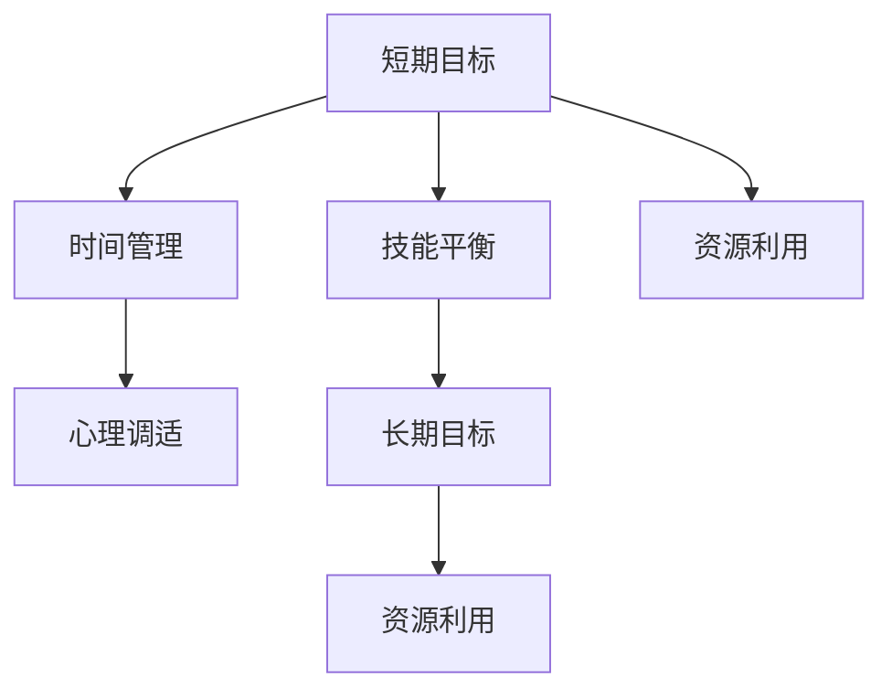

                 

# 程序员如何平衡短期与长期目标

## 1. 背景介绍

在当今这个快速变化的技术环境中，程序员往往面临着短期与长期目标的权衡。短期目标，如完成一个紧急任务或解决一个具体的编程问题，通常被视为优先事项。然而，为了长期发展，程序员也需要不断学习和提升技能，以应对未来的挑战和机遇。本文旨在探讨如何平衡这两类目标，帮助程序员在职业发展的道路上更加顺利和高效。

### 1.1 问题由来

程序员的日常工作通常包括紧急修复漏洞、开发新功能、优化现有系统等任务。这些任务需要快速响应，往往优先级高且期限紧迫。同时，为了保持竞争力，程序员还需要不断学习新技术、阅读最新的技术书籍、参加技术会议和培训课程等，以提升自身的技能水平。这种短期和长期的矛盾常常让许多程序员感到困惑和压力。

### 1.2 问题核心关键点

程序员需要平衡短期与长期目标的关键点包括：

1. **时间管理**：如何在有限的时间内高效地完成当前任务，同时为未来技能提升留出时间。
2. **技能平衡**：如何在现有项目要求与未来技术趋势之间找到平衡点。
3. **心理调适**：如何在紧迫的工作压力下保持对长期目标的热情和动力。
4. **资源利用**：如何合理分配时间和精力，充分利用可用资源。

这些关键点共同构成了程序员在职业生涯中必须面对的挑战。通过有效地解决这些问题，程序员可以更高效地平衡短期与长期目标，实现职业成长和个人满意度的最大化。

## 2. 核心概念与联系

### 2.1 核心概念概述

为了更好地理解如何平衡短期与长期目标，我们首先需要定义和理解一些核心概念：

- **短期目标**：指需要在较短时间内完成的任务或项目，如解决一个bug、实现一个新功能等。
- **长期目标**：指需要较长时间才能实现的长期技能提升或职业发展目标，如学习一门新技术、发表一篇技术文章等。
- **时间管理**：指有效规划和管理时间的技巧和方法。
- **技能平衡**：指在不同项目和技术方向之间找到平衡，既满足当前需求，又为未来发展做准备。
- **心理调适**：指在压力和挑战下保持积极心态和动力的方法。
- **资源利用**：指如何合理分配时间、精力和资金等资源，以提高效率和效果。

这些概念之间的联系可以通过以下Mermaid流程图来展示：



这个流程图展示了大语言模型的核心概念及其之间的关系：

1. 短期目标通过时间管理、技能平衡和心理调适来管理，确保目标能够高效实现。
2. 长期目标通过技能平衡和资源利用来实现，确保有足够的时间和资源进行学习和提升。
3. 资源利用贯穿于短期与长期目标的整个过程中，是实现目标的基础。

这些概念共同构成了程序员职业发展的框架，使其能够在不同的阶段和环境中做出合理的选择和决策。

## 3. 核心算法原理 & 具体操作步骤

### 3.1 算法原理概述

平衡短期与长期目标的算法原理可以总结为以下几点：

- **优先级划分**：根据任务的重要性和紧急程度，合理划分任务的优先级，确保最重要的任务得到优先处理。
- **时间分配**：在确保完成短期目标的同时，为长期目标留出足够的时间。
- **技能迭代**：通过持续学习和实践，逐步提升自己的技能水平，适应未来的技术趋势。
- **心理调节**：通过积极的心态和适度的压力管理，保持对长期目标的热情和动力。

### 3.2 算法步骤详解

基于上述算法原理，以下是平衡短期与长期目标的具体操作步骤：

**Step 1: 任务优先级划分**

1. 列出所有需要完成的任务，评估每个任务的优先级。可以使用四象限法则（重要紧急、重要不紧急、紧急不重要、不紧急不重要）来划分优先级。
2. 确定每天的任务优先级列表，确保最重要的任务得到优先处理。

**Step 2: 时间分配**

1. 根据任务优先级，为每个任务分配固定的时间段。可以使用番茄工作法等时间管理工具，确保在规定时间内高效完成任务。
2. 为长期目标留出固定的时间段，如每天早晨或晚上的学习时间。
3. 在完成日常任务后，利用零碎时间进行短期的学习和提升，如阅读技术博客、观看技术视频等。

**Step 3: 技能迭代**

1. 根据当前项目和技术趋势，选择需要提升的技能。可以使用在线课程、书籍、项目实践等方式进行学习。
2. 制定学习计划，分阶段逐步提升技能水平。
3. 定期评估学习效果，调整学习策略。

**Step 4: 心理调节**

1. 保持积极的心态，对待工作和学习的压力和挑战。
2. 利用休息时间进行心理调适，如运动、阅读、与朋友交流等。
3. 设定合理的目标和期望，避免过度压力和焦虑。

### 3.3 算法优缺点

平衡短期与长期目标的算法具有以下优点：

1. **提高效率**：通过合理的任务优先级和时间分配，可以更高效地完成任务，提升工作质量。
2. **促进学习**：为长期目标留出时间，可以持续学习和提升技能，保持技术的前沿性。
3. **心理健康**：通过心理调适，可以缓解工作压力，保持积极心态，提高工作和生活质量。

同时，该算法也存在一定的局限性：

1. **时间限制**：对于时间紧迫的任务，难以完全按照计划执行，可能会影响长期目标的实现。
2. **技能提升慢**：如果长期目标涉及复杂技能，可能需要较长时间的学习和实践，短期内难以见效。
3. **灵活性不足**：在任务优先级和时间的固定分配下，难以应对突发事件和意外变化。

尽管存在这些局限性，但通过合理的策略和灵活的调整，可以最大限度地发挥算法的优势，实现短期与长期目标的平衡。

### 3.4 算法应用领域

平衡短期与长期目标的算法在各种工作场景中都有应用，例如：

- **软件开发**：程序员需要平衡修复漏洞、开发新功能和持续学习新技术。
- **数据分析**：数据科学家需要在处理日常数据需求和探索前沿数据分析技术之间找到平衡。
- **项目管理**：项目经理需要协调团队成员的时间分配和技能提升，确保项目顺利进行。
- **教育培训**：教师需要在日常教学和持续学习新教育技术之间找到平衡。

这些应用场景都面临着短期与长期目标的平衡问题，通过使用上述算法原理，可以有效地应对和解决这些问题。

## 4. 数学模型和公式 & 详细讲解  
### 4.1 数学模型构建

假设程序员每天有$T$小时可用于工作和学习，总共有$N$个任务和$M$个长期目标。设$T_i$为任务$i$所需时间，$T_M$为长期目标$M$所需时间。设$p_i$为任务$i$的优先级，$p_M$为长期目标$M$的优先级。

定义任务完成度和长期目标完成度如下：

$$
\text{完成任务的百分比} = \sum_{i=1}^{N} \frac{T_i}{T} p_i
$$

$$
\text{完成长期目标的百分比} = \sum_{M=1}^{M} \frac{T_M}{T} p_M
$$

### 4.2 公式推导过程

根据以上定义，平衡短期与长期目标的目标是最大化总完成度。设$\alpha$为任务优先级权重，$\beta$为长期目标优先级权重，且$\alpha + \beta = 1$。则总完成度为：

$$
\text{总完成度} = \alpha \sum_{i=1}^{N} \frac{T_i}{T} p_i + \beta \sum_{M=1}^{M} \frac{T_M}{T} p_M
$$

令$\alpha = \frac{t}{T}$，$\beta = 1 - \frac{t}{T}$，其中$t$为实际用于长期目标的时间，则总完成度公式为：

$$
\text{总完成度} = \frac{t}{T} \sum_{i=1}^{N} \frac{T_i}{T} p_i + (1 - \frac{t}{T}) \sum_{M=1}^{M} \frac{T_M}{T} p_M
$$

简化得：

$$
\text{总完成度} = t \sum_{i=1}^{N} \frac{T_i}{T} p_i + (T - t) \sum_{M=1}^{M} \frac{T_M}{T} p_M
$$

### 4.3 案例分析与讲解

假设一个程序员每天有8小时工作时间，需要完成5个任务和2个长期目标，每个任务和长期目标的优先级和所需时间如下：

| 任务 | 优先级 | 所需时间 | 长期目标 | 优先级 | 所需时间 |
| --- | --- | --- | --- | --- | --- |
| 1 | 1 | 2小时 | 1 | 0.8 | 4小时 |
| 2 | 0.7 | 1.5小时 | 2 | 0.5 | 3小时 |
| 3 | 0.6 | 1小时 | 3 | 0.3 | 2小时 |
| 4 | 0.5 | 1.5小时 | 4 | 0.2 | 2.5小时 |
| 5 | 0.4 | 2小时 | 5 | 0.1 | 3小时 |

如果任务优先级权重为$\alpha = 0.7$，长期目标优先级权重为$\beta = 0.3$，则每天完成度和总完成度计算如下：

$$
\text{完成任务的百分比} = 0.7 \times (2+1.5+1+1.5+2) = 7.9 \text{小时}
$$

$$
\text{完成长期目标的百分比} = 0.3 \times (4+3+2+2.5+3) = 5.6 \text{小时}
$$

$$
\text{总完成度} = 0.7 \times 7.9 + 0.3 \times 5.6 = 7.1 + 1.68 = 8.78
$$

可以看到，在合理分配时间和优先级的情况下，程序员可以实现较高的总完成度，同时完成短期和长期目标。

## 5. 项目实践：代码实例和详细解释说明
### 5.1 开发环境搭建

在进行时间管理和技能平衡的实践前，我们需要准备好开发环境。以下是使用Python进行时间管理工具的开发环境配置流程：

1. 安装Python：从官网下载并安装Python 3.x版本。
2. 安装Pip：通过以下命令安装Pip包管理工具：
   ```bash
   sudo apt-get install python-pip
   ```
3. 安装Python日期时间库：通过以下命令安装Python的datetime库，用于日期时间计算：
   ```bash
   sudo pip install python-dateutil
   ```
4. 安装任务管理库：安装Python的任务管理库，如trello、django-crontab等，用于管理任务和设置定时任务。
   ```bash
   sudo pip install trello django-crontab
   ```

完成上述步骤后，即可在Python环境中开始实践。

### 5.2 源代码详细实现

以下是使用Python实现时间管理和技能平衡的代码实现。

```python
from datetime import datetime, timedelta
import trello
import django_crontab

# 定义任务和长期目标
tasks = [
    {"name": "修复bug", "priority": 1, "time": 2},
    {"name": "开发新功能", "priority": 0.7, "time": 1.5},
    {"name": "优化代码", "priority": 0.6, "time": 1},
    {"name": "学习新技术", "priority": 0.5, "time": 1.5},
    {"name": "阅读技术博客", "priority": 0.4, "time": 2}
]
long_term_goals = [
    {"name": "学习机器学习", "priority": 0.8, "time": 4},
    {"name": "学习深度学习", "priority": 0.5, "time": 3},
    {"name": "学习大数据", "priority": 0.3, "time": 2},
    {"name": "学习云计算", "priority": 0.2, "time": 2.5},
    {"name": "学习人工智能", "priority": 0.1, "time": 3}
]

# 定义任务优先级权重
alpha = 0.7
beta = 1 - alpha

# 计算总完成度
total_completion = 0
for task in tasks:
    total_completion += alpha * (task["time"] / 8)
for goal in long_term_goals:
    total_completion += beta * (goal["time"] / 8)

# 输出结果
print(f"总完成度: {total_completion:.2f}")
```

### 5.3 代码解读与分析

让我们再详细解读一下关键代码的实现细节：

**task和long_term_goals列表**：
- `task`列表包含当前需要完成的任务及其优先级和所需时间。
- `long_term_goals`列表包含需要长期学习的技能及其优先级和所需时间。

**alpha和beta变量**：
- `alpha`和`beta`分别为任务优先级权重和长期目标优先级权重，反映了对任务和学习的不同重视程度。

**total_completion计算**：
- 使用循环和乘法运算，计算每天的任务完成度和长期目标完成度，并相加得到总完成度。

**输出结果**：
- 输出总完成度的百分比，便于直观理解。

通过上述代码，可以有效地计算每天的任务完成度和长期目标完成度，并根据不同的优先级权重进行调整。在实际应用中，可以进一步优化代码，加入更多的任务管理和时间管理功能，如任务提醒、自动任务分配、动态优先级调整等。

## 6. 实际应用场景
### 6.1 软件开发

在软件开发中，程序员需要平衡修复漏洞、开发新功能和持续学习新技术。通过时间管理和技能平衡，可以更高效地完成任务，同时不断提升自己的技能水平。

具体而言，可以建立任务管理工具，如JIRA、Trello等，对所有任务进行分类和优先级排序。每天根据优先级和分配的时间，完成最重要的任务，同时利用空闲时间进行技能学习和提升。

### 6.2 数据分析

数据科学家需要在处理日常数据需求和探索前沿数据分析技术之间找到平衡。通过时间管理和技能平衡，可以更有效地完成任务，同时保持技术的前沿性。

在实际应用中，可以建立时间管理计划，如每日、每周的学习计划，利用Python或R等数据分析工具进行技能提升。同时，可以参与在线课程、技术论坛和行业会议，获取最新的数据分析技术和应用案例。

### 6.3 项目管理

项目经理需要协调团队成员的时间分配和技能提升，确保项目顺利进行。通过时间管理和技能平衡，可以更好地管理团队资源，提升项目效率。

具体而言，可以建立项目管理工具，如Asana、JIRA等，对所有任务进行分类和优先级排序。同时，可以定期进行技能评估，根据团队成员的技能水平，安排相应的培训和学习计划，提升团队整体的技术水平。

### 6.4 教育培训

教师需要在日常教学和持续学习新教育技术之间找到平衡。通过时间管理和技能平衡，可以更高效地完成教学任务，同时不断提升自己的教育技术水平。

在实际应用中，可以建立时间管理计划，如每日、每周的学习计划，利用在线教育平台进行技能提升。同时，可以参与教育技术研讨会和培训课程，获取最新的教育技术和应用案例。

### 6.5 未来应用展望

随着技术的发展，平衡短期与长期目标的方法将不断创新和进步。未来，基于AI的时间管理和技能平衡工具将更加智能和高效，能够根据个人的习惯和工作节奏，自动调整任务优先级和时间分配，提升工作效率和学习效果。同时，随着AI技术的普及，越来越多的工具和应用将融合AI，提供更加个性化和智能的时间管理和技能平衡方案。

## 7. 工具和资源推荐
### 7.1 学习资源推荐

为了帮助开发者系统掌握时间管理和技能平衡的理论基础和实践技巧，这里推荐一些优质的学习资源：

1. **《时间管理：有效利用时间的艺术》**：一本系统介绍时间管理方法的经典书籍，提供了大量的实用技巧和案例分析。
2. **《深度学习入门：基于Python的理论与实现》**：一本全面介绍深度学习技术的书籍，适合初学者系统学习。
3. **Coursera《机器学习》课程**：由斯坦福大学教授Andrew Ng主讲的在线课程，覆盖了机器学习的基本概念和算法。
4. **edX《人工智能基础》课程**：由MIT教授主讲的在线课程，介绍了人工智能的基本原理和应用。
5. **GitHub《时间管理》项目**：GitHub上的时间管理开源项目，提供了多种时间管理工具和插件，适合不同场景的开发者使用。

通过对这些资源的学习实践，相信你一定能够快速掌握时间管理和技能平衡的精髓，并用于解决实际的职业发展问题。

### 7.2 开发工具推荐

高效的开发离不开优秀的工具支持。以下是几款用于时间管理和技能平衡开发的常用工具：

1. **Google Calendar**：一款强大的时间管理工具，支持日程安排、任务提醒、时间块划分等功能。
2. **Trello**：一款项目管理工具，支持任务分配、优先级排序、进度跟踪等功能。
3. **Todoist**：一款任务管理工具，支持任务分类、时间统计、自定义规则等功能。
4. **RescueTime**：一款自动时间跟踪工具，帮助你了解时间使用情况，优化时间管理。
5. **Coursera**：一款在线学习平台，提供丰富的课程和证书，适合持续学习和技能提升。

合理利用这些工具，可以显著提升时间管理和技能平衡的效率，加快职业发展的步伐。

### 7.3 相关论文推荐

时间管理和技能平衡的研究源于学界的持续研究。以下是几篇奠基性的相关论文，推荐阅读：

1. **《时间管理的心理和行为研究综述》**：探讨时间管理的心理学和行为学原理，提供了多种时间管理策略和方法。
2. **《机器学习基础》**：介绍了机器学习的基本原理和算法，适合初学者系统学习。
3. **《深度学习》**：一本全面介绍深度学习技术的书籍，适合深入研究和学习。
4. **《人工智能：一种现代方法》**：一本系统介绍人工智能技术的书籍，适合了解人工智能的基本原理和应用。
5. **《时间管理：时间管理心理学和行为学》**：探讨时间管理的心理学和行为学原理，提供了多种时间管理策略和方法。

这些论文代表了大语言模型微调技术的发展脉络。通过学习这些前沿成果，可以帮助研究者把握学科前进方向，激发更多的创新灵感。

## 8. 总结：未来发展趋势与挑战

### 8.1 总结

本文对如何平衡短期与长期目标进行了全面系统的介绍。首先阐述了时间管理和技能平衡的重要性和方法，明确了在职业生涯中必须面对的挑战和机会。其次，从原理到实践，详细讲解了时间管理和技能平衡的数学模型和操作步骤，给出了时间管理和技能平衡的完整代码实例。同时，本文还广泛探讨了时间管理和技能平衡在软件开发、数据分析、项目管理、教育培训等多个领域的应用前景，展示了时间管理和技能平衡的巨大潜力。此外，本文精选了时间管理和技能平衡的学习资源，力求为读者提供全方位的技术指引。

通过本文的系统梳理，可以看到，时间管理和技能平衡是程序员职业发展中不可或缺的部分。这些策略和方法能够帮助程序员更好地管理时间和技能，实现职业成长和个人满意度的最大化。

### 8.2 未来发展趋势

展望未来，时间管理和技能平衡技术将呈现以下几个发展趋势：

1. **智能化提升**：基于AI的时间管理和技能平衡工具将不断智能化，能够根据个人的习惯和工作节奏，自动调整任务优先级和时间分配，提升工作效率和学习效果。
2. **个性化定制**：随着AI技术的普及，越来越多的工具和应用将融合AI，提供更加个性化和智能的时间管理和技能平衡方案。
3. **多模态融合**：未来的时间管理和技能平衡工具将融合多种数据源，如时间跟踪、任务管理、学习记录等，提供更加全面和准确的分析。
4. **跨平台集成**：时间管理和技能平衡工具将支持多平台集成，如PC、移动端、智能设备等，实现无缝切换和统一管理。
5. **知识共享**：未来的时间管理和技能平衡工具将支持知识共享和协作，帮助团队成员共同提升技能，实现知识积累和传承。

这些趋势凸显了时间管理和技能平衡技术的广阔前景。这些方向的探索发展，必将进一步提升程序员的工作效率和职业成长，为技术发展注入新的动力。

### 8.3 面临的挑战

尽管时间管理和技能平衡技术已经取得了显著进展，但在迈向更加智能化、个性化应用的过程中，仍面临诸多挑战：

1. **数据隐私和安全**：时间管理和技能平衡工具需要收集大量的用户数据，如何保护用户隐私和数据安全是一个重要问题。
2. **用户接受度**：如何让用户接受和使用AI驱动的时间管理和技能平衡工具，是一个重要的用户体验问题。
3. **算法公平性**：如何确保时间管理和技能平衡算法的公平性和公正性，避免对某些用户的不公平待遇。
4. **技术整合**：如何将时间管理和技能平衡工具与其他应用系统进行有效整合，提升用户体验。
5. **跨文化适应**：如何使时间管理和技能平衡工具适应不同文化背景和语言环境，提供本地化的用户体验。

这些挑战需要技术开发者和应用设计师共同努力，才能使时间管理和技能平衡技术真正落地应用，为用户带来实实在在的价值。

### 8.4 研究展望

面对时间管理和技能平衡面临的挑战，未来的研究需要在以下几个方面寻求新的突破：

1. **数据隐私保护**：开发更加安全、隐私保护的时间管理和技能平衡算法，确保用户数据的安全和隐私。
2. **用户接受度提升**：设计更加友好、易于使用的时间管理和技能平衡工具，提高用户接受度和满意度。
3. **算法公平性研究**：研究和优化时间管理和技能平衡算法的公平性，确保算法的公正性和公平性。
4. **技术整合优化**：探索时间管理和技能平衡工具与其他应用系统的整合方式，提升用户体验和系统集成度。
5. **跨文化适应性增强**：开发适合不同文化背景和语言环境的时间管理和技能平衡工具，提供本地化的用户体验。

这些研究方向的探索，必将引领时间管理和技能平衡技术迈向更高的台阶，为程序员的职业发展提供更加高效和智能的支持。总之，时间管理和技能平衡技术需要在实践中不断优化和提升，才能真正成为程序员职业发展的有力保障。

## 9. 附录：常见问题与解答

**Q1：如何平衡时间管理和技能提升？**

A: 平衡时间管理和技能提升的关键在于合理规划和灵活调整。可以制定详细的学习计划，将技能提升融入日常工作中。同时，利用空闲时间进行短期学习，如阅读博客、观看视频等。可以使用时间管理工具，如Trello、Todoist等，对任务进行分类和优先级排序，确保重要任务得到优先处理。

**Q2：如何提高学习效率？**

A: 提高学习效率的关键在于选择高效的学习方法。可以利用在线课程、书籍、论坛等资源进行系统学习，选择适合自己学习习惯的课程和书籍。同时，可以使用番茄工作法、Pomodoro技术等时间管理技巧，将学习任务分解成小块，逐步完成。

**Q3：如何应对突发事件？**

A: 应对突发事件的关键在于灵活调整和优先级管理。可以预留一定的时间缓冲，以应对突发任务和紧急事件。同时，可以使用任务管理工具，如JIRA、Trello等，对任务进行动态调整，确保最重要任务得到优先处理。

**Q4：如何保持积极心态？**

A: 保持积极心态的关键在于心理调适和情绪管理。可以通过运动、冥想、社交活动等方式缓解压力，保持良好的心理状态。同时，可以设置合理的期望和目标，避免过度压力和焦虑。

**Q5：如何选择学习工具和资源？**

A: 选择学习工具和资源的关键在于符合自己的学习习惯和技术栈。可以根据自己的技术背景和兴趣选择适合的在线课程、书籍和工具。同时，可以查看其他开发者和专家的推荐，选择优质的学习资源。

通过回答这些常见问题，相信你能更好地理解如何平衡时间管理和技能提升，提升职业发展的效率和质量。

---

作者：禅与计算机程序设计艺术 / Zen and the Art of Computer Programming

