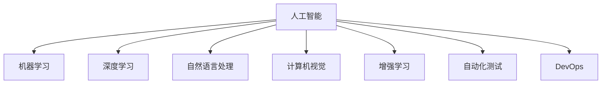

                 

# 程序员如何应对人工智能带来的挑战

人工智能（AI）技术的飞速发展正在彻底改变各行各业，尤其是计算机编程领域。程序员作为AI时代的主力军，面临的挑战与机遇并存。本文将系统探讨程序员如何应对人工智能带来的挑战，并提出相应的应对策略。

## 1. 背景介绍

### 1.1 问题由来

人工智能技术的快速发展，尤其是机器学习、深度学习和大数据技术的应用，使得越来越多的传统程序开发任务被AI自动化替代。例如，数据清洗、特征工程、模型训练等任务逐渐被自动化系统所取代，这对程序员的技能和思维模式提出了新的要求。同时，AI技术的应用也带来了新的编程需求，程序员需要学习和掌握基于AI的编程范式和工具。

### 1.2 问题核心关键点

目前，人工智能对程序员的挑战主要体现在以下几个方面：

- **技能更新**：需要持续学习新的AI技术，掌握相关的编程框架和工具。
- **跨学科能力**：需要具备计算机科学、统计学、数据科学等多学科的知识。
- **算法理解**：需要深入理解AI算法的原理，设计有效的数据流和模型结构。
- **自动化与效率提升**：需要熟练使用自动化工具和流程，提高编程效率和质量。
- **伦理与安全性**：需要考虑AI模型的伦理和安全性问题，避免潜在的风险和错误。

## 2. 核心概念与联系

### 2.1 核心概念概述

为更好地理解AI带来的挑战及应对策略，本节将介绍几个密切相关的核心概念：

- **人工智能（AI）**：使用算法和机器学习技术，使计算机具备模拟人类智能的能力，实现问题解决和决策。
- **机器学习（ML）**：通过数据训练模型，使模型自动发现并学习数据中的规律，实现对新数据的预测和分类。
- **深度学习（DL）**：一种特殊的机器学习方法，使用多层神经网络结构进行特征提取和模式识别。
- **自然语言处理（NLP）**：使计算机能够理解、处理和生成人类语言的技术。
- **计算机视觉（CV）**：使计算机能够处理、分析和理解图像和视频信息的技术。
- **增强学习（RL）**：通过试错的方式，使智能体在环境中学习最优策略，实现自主决策。
- **自动化测试（AT）**：使用自动化工具对软件进行测试，提高测试效率和覆盖率。
- **DevOps**：通过自动化和持续集成/持续部署（CI/CD）流程，提高软件开发生命周期的效率和质量。

这些核心概念之间的逻辑关系可以通过以下Mermaid流程图来展示：



这个流程图展示了大语言模型的核心概念及其之间的关系：

1. 人工智能通过机器学习、深度学习、自然语言处理、计算机视觉、增强学习等技术，实现问题解决和决策。
2. 自动化测试和DevOps技术提升软件开发效率和质量，是AI技术落地的重要支撑。

## 3. 核心算法原理 & 具体操作步骤

### 3.1 算法原理概述

AI技术的核心在于算法，程序员应对AI挑战的第一步是理解并掌握相关的算法原理。以下是几种核心AI算法的简要介绍：

1. **监督学习（Supervised Learning）**：使用带有标签的数据进行训练，使模型能够预测新数据的标签。常见算法包括决策树、随机森林、支持向量机等。
2. **无监督学习（Unsupervised Learning）**：使用无标签的数据进行训练，使模型能够发现数据中的结构和规律。常见算法包括聚类、降维、关联规则挖掘等。
3. **半监督学习（Semi-supervised Learning）**：结合少量有标签数据和大量无标签数据进行训练，提高模型泛化能力。常见算法包括自训练、伪标签生成等。
4. **强化学习（Reinforcement Learning）**：通过试错的方式，使智能体在环境中学习最优策略。常见算法包括Q-learning、策略梯度等。

### 3.2 算法步骤详解

AI算法的实施一般包括以下关键步骤：

**Step 1: 数据收集与预处理**
- 收集相关的数据集，确保数据质量和多样性。
- 进行数据清洗和特征工程，提取和构造有用的特征。

**Step 2: 模型选择与训练**
- 选择合适的算法和模型架构，进行参数初始化。
- 使用训练集数据进行模型训练，最小化损失函数。

**Step 3: 模型评估与优化**
- 使用验证集数据进行模型评估，选择性能最优的模型。
- 调整超参数，进行模型调优，提高模型泛化能力。

**Step 4: 模型应用与部署**
- 使用测试集数据进行模型测试，评估模型性能。
- 将模型部署到实际应用中，进行模型监控和维护。

### 3.3 算法优缺点

AI算法各有优缺点，程序员需要根据具体任务选择合适的算法：

| 算法类型 | 优点 | 缺点 |
|---------|-----|-----|
| 监督学习 | 简单易懂，泛化能力强 | 需要大量标注数据，可能过拟合 |
| 无监督学习 | 无需标注数据，适用于大数据 | 结果难以解释，可能不适用于某些任务 |
| 半监督学习 | 兼顾标注数据和非标注数据 | 算法复杂度较高，需要多次迭代 |
| 强化学习 | 适用于动态环境，可实现自主决策 | 需要大量计算资源，难以解释 |

### 3.4 算法应用领域

AI算法广泛应用于各个领域，以下是几个典型应用场景：

1. **自然语言处理（NLP）**：文本分类、机器翻译、情感分析、语音识别等。
2. **计算机视觉（CV）**：图像分类、目标检测、人脸识别、视频分析等。
3. **推荐系统**：个性化推荐、广告投放、用户行为分析等。
4. **金融分析**：信用评分、风险评估、投资策略等。
5. **医疗诊断**：医学影像分析、基因组学、药物研发等。
6. **自动驾驶**：环境感知、路径规划、决策系统等。

## 4. 数学模型和公式 & 详细讲解 & 举例说明

### 4.1 数学模型构建

本节将使用数学语言对AI算法的实施进行更加严格的刻画。

以监督学习为例，假设训练数据集为 $(x_i, y_i)$，其中 $x_i \in \mathbb{R}^d$ 为输入特征，$y_i \in \{0,1\}$ 为标签。模型 $f_\theta(x)$ 的参数为 $\theta$，训练目标为最小化损失函数 $\mathcal{L}(\theta)$。

**Step 1: 模型选择与训练**
- 选择适当的模型结构，如线性回归、逻辑回归、神经网络等。
- 使用训练集数据进行模型训练，最小化损失函数：
$$
\min_{\theta} \frac{1}{N} \sum_{i=1}^N \ell(f_\theta(x_i), y_i)
$$

**Step 2: 模型评估与优化**
- 使用验证集数据进行模型评估，选择性能最优的模型。
- 调整超参数，进行模型调优，提高模型泛化能力。
- 使用测试集数据进行模型测试，评估模型性能。

### 4.2 公式推导过程

以线性回归为例，假设模型为 $f(x) = \theta_0 + \theta_1 x_1 + \theta_2 x_2 + \cdots + \theta_d x_d$，其中 $\theta = (\theta_0, \theta_1, \theta_2, \cdots, \theta_d)$。训练数据集为 $(x_i, y_i)$，其中 $x_i = (x_{i1}, x_{i2}, \cdots, x_{id})$，$y_i$ 为标签。最小化损失函数：

$$
\min_{\theta} \frac{1}{N} \sum_{i=1}^N (y_i - f(x_i))^2
$$

对损失函数求导，得：

$$
\nabla_{\theta} \mathcal{L}(\theta) = \frac{1}{N} \sum_{i=1}^N 2(y_i - f(x_i)) x_i
$$

通过反向传播算法更新模型参数，最小化损失函数：

$$
\theta \leftarrow \theta - \eta \nabla_{\theta} \mathcal{L}(\theta)
$$

其中 $\eta$ 为学习率。

### 4.3 案例分析与讲解

以线性回归为例，假设数据集为 $(x_i, y_i)$，其中 $x_i = (x_{i1}, x_{i2})$，$y_i$ 为标签。假设模型为 $f(x) = \theta_0 + \theta_1 x_1 + \theta_2 x_2$，其中 $\theta = (\theta_0, \theta_1, \theta_2)$。

使用最小二乘法训练模型，目标为最小化损失函数：

$$
\mathcal{L}(\theta) = \frac{1}{N} \sum_{i=1}^N (y_i - f(x_i))^2
$$

对损失函数求导，得：

$$
\nabla_{\theta} \mathcal{L}(\theta) = \frac{2}{N} \sum_{i=1}^N (y_i - f(x_i)) (1, x_{i1}, x_{i2})
$$

通过反向传播算法更新模型参数，最小化损失函数：

$$
\theta \leftarrow \theta - \eta \nabla_{\theta} \mathcal{L}(\theta)
$$

其中 $\eta$ 为学习率。

## 5. 项目实践：代码实例和详细解释说明

### 5.1 开发环境搭建

在进行AI算法实践前，我们需要准备好开发环境。以下是使用Python进行TensorFlow开发的环境配置流程：

1. 安装Anaconda：从官网下载并安装Anaconda，用于创建独立的Python环境。

2. 创建并激活虚拟环境：
```bash
conda create -n tf-env python=3.8 
conda activate tf-env
```

3. 安装TensorFlow：根据CUDA版本，从官网获取对应的安装命令。例如：
```bash
pip install tensorflow
```

4. 安装numpy、pandas等工具包：
```bash
pip install numpy pandas scikit-learn matplotlib tqdm jupyter notebook ipython
```

完成上述步骤后，即可在`tf-env`环境中开始AI算法开发。

### 5.2 源代码详细实现

下面我们以线性回归为例，给出使用TensorFlow进行模型训练的PyTorch代码实现。

首先，定义数据集：

```python
import numpy as np
import tensorflow as tf

# 生成随机数据
x = np.random.randn(100, 2)
y = x.dot([0.5, 2.0]) + np.random.randn(100) * 0.1

# 划分训练集和测试集
train_x = x[:80]
train_y = y[:80]
test_x = x[80:]
test_y = y[80:]
```

然后，定义模型：

```python
# 定义模型
model = tf.keras.Sequential([
    tf.keras.layers.Dense(1, input_shape=(2,))
])
```

接着，定义损失函数和优化器：

```python
# 定义损失函数和优化器
loss_fn = tf.keras.losses.MeanSquaredError()
optimizer = tf.keras.optimizers.SGD(learning_rate=0.1)
```

最后，进行模型训练：

```python
# 训练模型
model.compile(optimizer=optimizer, loss=loss_fn)
model.fit(train_x, train_y, epochs=10, batch_size=32)
```

以上代码展示了使用TensorFlow进行线性回归模型训练的完整过程。可以看到，TensorFlow提供了丰富的API，使得模型训练和优化变得简洁高效。

### 5.3 代码解读与分析

让我们再详细解读一下关键代码的实现细节：

**模型定义**：
- 使用 `tf.keras.Sequential` 定义序列模型，包含一个线性层 `tf.keras.layers.Dense`，输入维度为2，输出维度为1。

**损失函数和优化器定义**：
- 使用 `tf.keras.losses.MeanSquaredError` 定义均方误差损失函数。
- 使用 `tf.keras.optimizers.SGD` 定义随机梯度下降优化器，学习率为0.1。

**模型训练**：
- 使用 `model.compile` 定义模型编译过程，指定优化器和损失函数。
- 使用 `model.fit` 进行模型训练，指定训练集和测试集数据，训练轮数为10，批次大小为32。

可以看到，TensorFlow的高级API大大简化了模型训练的实现过程，使得程序员能够专注于算法和模型设计。

当然，工业级的系统实现还需考虑更多因素，如模型的保存和部署、超参数的自动搜索、更灵活的模型架构等。但核心的AI算法实现基本与此类似。

## 6. 实际应用场景

### 6.1 智能推荐系统

基于AI的推荐系统已经在电商、新闻、视频等多个领域得到了广泛应用。传统推荐系统依赖用户历史行为数据进行推荐，难以应对个性化需求和实时变化。而基于AI的推荐系统可以处理海量数据，学习用户的深层兴趣和行为模式，实时生成个性化推荐。

在技术实现上，可以收集用户浏览、点击、评分等行为数据，使用深度学习模型（如协同过滤、深度神经网络）进行推荐。模型使用这些行为数据进行训练，能够学习用户的长期兴趣和短期行为，生成更加精准和多样化的推荐结果。同时，可以通过强化学习技术，使推荐系统动态调整策略，提高推荐效果。

### 6.2 金融风控系统

金融行业的风险控制需要实时监控和预测，确保金融交易的安全和稳定。传统的规则系统难以应对复杂的市场环境，容易遗漏潜在的风险。而基于AI的风控系统可以实时分析大量交易数据，检测异常行为和欺诈交易，及时预警和干预。

在技术实现上，可以收集金融交易数据，使用深度学习模型（如LSTM、CNN）进行欺诈检测和风险评估。模型使用这些数据进行训练，能够学习交易模式和异常行为，实时监控新交易，识别潜在的欺诈和风险。同时，可以通过强化学习技术，使风控系统动态调整策略，提高风险预测的准确性和及时性。

### 6.3 智能客服系统

传统的客服系统依赖人工客服，成本高、效率低、服务质量不稳定。基于AI的智能客服系统可以24小时不间断服务，快速响应客户咨询，提供高质量的自然语言交互。

在技术实现上，可以收集客户咨询数据，使用深度学习模型（如RNN、Transformer）进行对话生成和意图识别。模型使用这些数据进行训练，能够理解客户意图，自动生成回复，并提供多轮对话支持。同时，可以通过强化学习技术，使客服系统动态调整策略，提高对话质量和客户满意度。

### 6.4 未来应用展望

随着AI技术的不断进步，基于AI的系统将变得更加智能和普适，为各行各业带来深远影响。

在智慧医疗领域，基于AI的诊断系统可以自动识别和分析医学影像，提供精准的医疗诊断和建议，提升医疗服务的智能化水平。

在智能教育领域，基于AI的个性化学习系统可以分析学生的学习行为和成绩，提供个性化的学习建议和资源，因材施教，促进教育公平。

在智能交通领域，基于AI的自动驾驶系统可以实时感知和分析道路环境，自动规划和执行驾驶策略，提高交通的安全和效率。

此外，在工业制造、环境保护、智能家居等多个领域，基于AI的系统也将不断涌现，为社会带来新的变革。相信随着AI技术的不断成熟，未来将会有更多领域得到AI技术的赋能，加速经济和社会的发展。

## 7. 工具和资源推荐

### 7.1 学习资源推荐

为了帮助程序员掌握AI技术，这里推荐一些优质的学习资源：

1. 《Python机器学习》：通过实例讲解了Python在机器学习中的应用，适合初学者入门。
2. 《深度学习》（Goodfellow等著）：介绍了深度学习的基本概念和算法，是深度学习领域的经典教材。
3. 《TensorFlow实战》：介绍了TensorFlow的API和高级特性，适合TensorFlow开发者。
4. 《Keras深度学习实战》：介绍了Keras的使用和实践，适合Keras开发者。
5. Coursera的《机器学习》课程：由斯坦福大学开设的在线课程，涵盖了机器学习的基础理论和实践技巧。
6. Udacity的《深度学习》纳米学位：提供系统的深度学习课程和实践项目，适合想要系统学习深度学习的开发者。

通过对这些资源的学习实践，相信你一定能够快速掌握AI技术的精髓，并用于解决实际的业务问题。

### 7.2 开发工具推荐

高效的AI开发离不开优秀的工具支持。以下是几款用于AI开发的常用工具：

1. TensorFlow：由Google主导开发的深度学习框架，生产部署方便，适合大规模工程应用。
2. PyTorch：基于Python的开源深度学习框架，灵活动态的计算图，适合快速迭代研究。
3. Jupyter Notebook：用于数据处理和模型训练的交互式环境，支持多种编程语言。
4. Keras：高级神经网络API，适合快速搭建和训练模型。
5. Scikit-learn：开源机器学习库，提供丰富的算法和工具，适合初学者。
6. Weights & Biases：模型训练的实验跟踪工具，可以记录和可视化模型训练过程中的各项指标，方便对比和调优。

合理利用这些工具，可以显著提升AI开发的效率，加快创新迭代的步伐。

### 7.3 相关论文推荐

AI技术的发展源于学界的持续研究。以下是几篇奠基性的相关论文，推荐阅读：

1. **《深度学习》（Goodfellow等著）**：介绍了深度学习的基本概念和算法，是深度学习领域的经典教材。
2. **《Google Brain研究报告》**：介绍了Google Brain团队的深度学习研究成果，涵盖了多个前沿方向。
3. **《ICML2015: A tutorial on deep learning for NLP》**：介绍了深度学习在自然语言处理中的应用，适合NLP开发者。
4. **《ICML2017: Learning to predict the future from past values》**：介绍了强化学习的基本概念和算法，适合强化学习开发者。
5. **《Nature2016: Human-level control through deep reinforcement learning》**：介绍了深度强化学习在智能控制中的应用，适合强化学习开发者。

这些论文代表了大AI技术的发展脉络。通过学习这些前沿成果，可以帮助程序员把握学科前进方向，激发更多的创新灵感。

## 8. 总结：未来发展趋势与挑战

### 8.1 总结

本文对AI带来的挑战及应对策略进行了系统探讨。首先，分析了AI技术的核心算法和基本实现过程，介绍了TensorFlow等主流框架的使用方法。其次，探讨了AI在推荐系统、金融风控、智能客服等多个领域的实际应用，展示了AI技术的广阔前景。最后，提出了AI技术的未来发展趋势和面临的挑战，提出了相应的应对策略。

通过本文的系统梳理，可以看到，AI技术正在深刻改变计算机编程领域的生态，程序员需要不断学习和适应新技术，才能在AI时代立于不败之地。

### 8.2 未来发展趋势

未来，AI技术将继续快速发展，以下是几个可能的发展趋势：

1. **跨领域融合**：AI技术将与其他技术（如区块链、物联网、量子计算）进行深度融合，推动各领域的智能化进程。
2. **普适化应用**：AI技术将更多地应用于大众消费领域，提升用户体验和生活质量。
3. **自动化与协作**：AI技术将推动自动化流程的普及，提升软件开发生命周期的效率和质量，促进人机协作。
4. **智能辅助**：AI技术将提供更加精准的辅助决策，提高各领域的决策水平和效率。
5. **伦理与安全**：AI技术的伦理和安全问题将得到更多关注，推动AI技术的负责任应用。

这些趋势凸显了AI技术的广泛影响和深远意义。只有持续学习和适应新技术，才能更好地应对AI带来的挑战和机遇。

### 8.3 面临的挑战

尽管AI技术带来了诸多机遇，但在实际应用中也面临诸多挑战：

1. **数据质量与隐私**：数据质量不高、数据隐私问题将制约AI技术的落地。
2. **算法透明度与可解释性**：AI算法的复杂性和黑盒性质将影响其可解释性和可信度。
3. **计算资源与成本**：大规模AI训练和推理需要大量计算资源，成本高昂。
4. **安全与伦理**：AI技术的应用可能引发伦理和安全问题，需要更多监管机制和约束。
5. **模型泛化与鲁棒性**：AI模型在处理新数据时可能出现泛化能力不足和鲁棒性差的问题。

这些挑战需要学界和产业界共同应对，才能确保AI技术的健康发展。

### 8.4 研究展望

面对AI技术面临的挑战，未来的研究方向包括：

1. **数据治理与隐私保护**：研究如何提高数据质量和隐私保护水平，确保数据安全和公平使用。
2. **算法透明性与可解释性**：研究如何提升AI算法的透明性和可解释性，增强其可信度。
3. **高效计算与模型压缩**：研究如何降低AI计算成本，提高模型效率和鲁棒性。
4. **伦理与安全**：研究如何建立AI技术的伦理和安全机制，确保其负责任应用。
5. **跨领域融合与创新**：研究如何推动AI技术与其他技术的深度融合，推动各领域的智能化进程。

这些研究方向将为AI技术的未来发展提供重要支持，推动AI技术在更多领域落地应用。

## 9. 附录：常见问题与解答

**Q1：如何学习AI技术？**

A: 学习AI技术需要掌握多个领域知识，建议从以下几个方面入手：
1. 学习数学和统计学基础知识，理解AI算法的基本原理。
2. 学习编程语言，如Python、R、C++等，熟悉AI开发工具和框架。
3. 参加在线课程和培训班，如Coursera、Udacity等，系统学习AI技术和实践。
4. 阅读经典教材和论文，如《深度学习》（Goodfellow等著）、《机器学习实战》等。
5. 实践项目和竞赛，如Kaggle比赛、TensorFlow项目，提升实践经验和项目能力。

**Q2：AI算法有哪些应用场景？**

A: AI算法广泛应用于各个领域，以下是几个典型应用场景：
1. 自然语言处理（NLP）：文本分类、机器翻译、情感分析、语音识别等。
2. 计算机视觉（CV）：图像分类、目标检测、人脸识别、视频分析等。
3. 推荐系统：个性化推荐、广告投放、用户行为分析等。
4. 金融分析：信用评分、风险评估、投资策略等。
5. 医疗诊断：医学影像分析、基因组学、药物研发等。
6. 自动驾驶：环境感知、路径规划、决策系统等。

**Q3：AI技术的发展趋势是什么？**

A: AI技术的发展趋势包括以下几个方面：
1. 跨领域融合：AI技术将与其他技术（如区块链、物联网、量子计算）进行深度融合，推动各领域的智能化进程。
2. 普适化应用：AI技术将更多地应用于大众消费领域，提升用户体验和生活质量。
3. 自动化与协作：AI技术将推动自动化流程的普及，提升软件开发生命周期的效率和质量，促进人机协作。
4. 智能辅助：AI技术将提供更加精准的辅助决策，提高各领域的决策水平和效率。
5. 伦理与安全：AI技术的伦理和安全问题将得到更多关注，推动AI技术的负责任应用。

这些趋势凸显了AI技术的广泛影响和深远意义。只有持续学习和适应新技术，才能更好地应对AI带来的挑战和机遇。

---

作者：禅与计算机程序设计艺术 / Zen and the Art of Computer Programming

