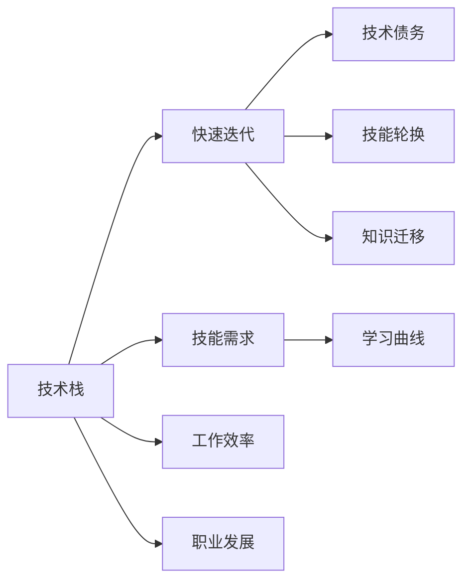

                 

## 1. 背景介绍

在当今快速变化的技术环境中，技术栈的快速迭代已变得司空见惯。从云计算到人工智能，从区块链到量子计算，新的技术理念和工具层出不穷。这不仅要求程序员具备强大的学习能力，还需要有良好的技术视野和战略规划能力。本文旨在探讨程序员如何应对技术栈的快速迭代，以确保在不断变化的技术环境中保持竞争力。

### 1.1 技术栈迭代的原因
技术栈的快速迭代主要归因于以下几个因素：

- **技术进步**：基础技术领域的不断突破，如云计算、人工智能等，推动了新工具和框架的涌现。
- **市场需求**：随着企业对数字化转型的重视，新兴技术被广泛应用到各行各业，带来了技术需求的转变。
- **社区活跃**：开源社区的活跃和开放，使得新技术的快速传播和采纳成为可能。
- **企业创新**：企业为了保持市场竞争力，不断寻找新的技术突破，推动了技术栈的更新迭代。

### 1.2 技术栈迭代的影响
技术栈的快速迭代对程序员有深远影响，包括但不限于：

- **技能需求**：需要不断学习新技能，保持技能更新。
- **学习曲线**：新技术的引入往往伴随更高的学习曲线。
- **工作效率**：短期内可能会因为熟悉新工具而降低效率。
- **职业发展**：具备多样化的技术栈可以增强职业竞争力，开拓更多发展路径。

## 2. 核心概念与联系

### 2.1 核心概念概述
- **技术栈**：指的是一个项目或团队使用的所有技术和工具，包括编程语言、框架、库、平台等。
- **快速迭代**：指的是技术栈中各项技术和工具的快速更新和替换。
- **技术债务**：指因技术栈过时或不适应当前需求而积累的技术债务。
- **技能轮换**：指程序员在不同技术间进行技能切换，以适应技术栈的变化。
- **知识迁移**：指将已有的知识和技能应用于新领域的迁移。

### 2.2 核心概念原理和架构的 Mermaid 流程图



这个流程图展示了技术栈快速迭代对各个核心概念的直接影响：

1. 技术栈的快速迭代导致技能需求的增加，进而影响学习曲线和工作效率。
2. 技术债务增加，需要通过技能轮换和知识迁移来应对。
3. 职业发展机会增加，因为多样化的技术栈使程序员更具竞争力。

## 3. 核心算法原理 & 具体操作步骤

### 3.1 算法原理概述

针对技术栈快速迭代，可以采用以下算法原理：

1. **优先级管理**：根据技术的紧急程度和重要程度，进行优先级排序。
2. **持续学习**：保持持续学习的习惯，不断获取新知识和技能。
3. **技能轮换策略**：定期进行技能轮换，确保技能多样性。
4. **知识迁移策略**：将已有知识迁移到新的技术领域，提升学习效率。

### 3.2 算法步骤详解

#### 3.2.1 优先级管理
1. **评估技术的重要性**：根据技术对项目的影响程度，分为高、中、低三个优先级。
2. **识别技术趋势**：通过阅读技术社区、行业报告等，识别技术趋势。
3. **制定学习计划**：基于评估和趋势，制定学习计划，优先学习高优先级技术。

#### 3.2.2 持续学习
1. **在线课程和教程**：利用Coursera、Udemy、edX等平台上的在线课程进行学习。
2. **技术博客和论坛**：关注Kaggle、GitHub、Stack Overflow等平台上的技术博客和论坛。
3. **参与开源项目**：通过参与开源项目，实践新技术。

#### 3.2.3 技能轮换策略
1. **轮换周期**：根据技术栈的变化频率，设定适当的技能轮换周期。
2. **轮换比例**：在每个轮换周期内，选择30%~50%的技术进行学习和实践。
3. **轮换机制**：轮流学习和实践不同技术，避免过度依赖单一技术。

#### 3.2.4 知识迁移策略
1. **识别共通点**：分析新技术和已有技术的共通点和差异。
2. **迁移路径**：制定从已有技术到新技术的迁移路径，逐步进行迁移。
3. **迁移工具**：使用迁移工具（如迁移学习框架），加速迁移过程。

### 3.3 算法优缺点

#### 3.3.1 优点
- **应对变化**：通过优先级管理、持续学习、技能轮换和知识迁移，可以更好地应对技术栈的快速迭代。
- **提升竞争力**：多样化的技术栈和持续学习习惯，可以提升程序员的职业竞争力。
- **减少技术债务**：通过定期轮换和知识迁移，可以降低因技术过时而积累的技术债务。

#### 3.3.2 缺点
- **学习压力**：持续学习和技能轮换可能导致一定的学习压力。
- **资源消耗**：持续学习和技能轮换需要大量的时间和精力投入。
- **迁移难度**：部分新技术可能需要较长时间才能从已有技术中迁移过来。

### 3.4 算法应用领域

技术栈快速迭代的影响不仅限于软件开发，还广泛适用于数据分析、机器学习、云计算等多个领域。以下是几个典型应用领域：

- **软件开发**：如使用React、Angular等前端框架，或使用Docker、Kubernetes等容器化技术。
- **数据分析**：如使用Apache Spark、Pandas等数据分析工具，或使用Python、R等数据科学语言。
- **机器学习**：如使用TensorFlow、PyTorch等深度学习框架，或使用Scikit-learn等经典机器学习库。
- **云计算**：如使用AWS、Azure等云平台，或使用IaaS、PaaS、SaaS等云服务模型。

## 4. 数学模型和公式 & 详细讲解 & 举例说明

### 4.1 数学模型构建

假设技术栈中的技术数量为 $N$，技术重要性评分为 $I_i$，其中 $i=1,2,...,N$。设 $I_i \in [0,1]$，$I_i=1$ 表示该技术对项目非常重要，$I_i=0$ 表示该技术不太重要。优先级管理的目标是最大化重要技术的覆盖，同时最小化学习时间和资源消耗。

### 4.2 公式推导过程

优先级管理的数学模型可以表示为：

$$
\max_{\{I_i\}} \sum_{i=1}^N I_i \quad \text{subject to} \quad \sum_{i=1}^N I_i \leq 1
$$

目标是最大化重要技术的评分和，同时保证所有技术的评分之和小于等于1。

### 4.3 案例分析与讲解

以AWS技术栈的优先级管理为例：

1. **技术评估**：将AWS技术栈中的技术分为高、中、低三个优先级，分别赋予评分。
2. **制定计划**：根据评分，优先学习高评分技术，如AWS Lambda、EC2等。
3. **学习路径**：按照技术评分和重要性制定学习计划，如先学习EC2，再学习S3。
4. **应用实践**：在学习过程中，逐步在实际项目中应用新技术，积累经验。

## 5. 项目实践：代码实例和详细解释说明

### 5.1 开发环境搭建

#### 5.1.1 虚拟环境

1. **创建虚拟环境**：使用Python的virtualenv工具创建虚拟环境。
2. **激活虚拟环境**：使用`source`命令激活虚拟环境。
3. **安装依赖**：在虚拟环境中安装需要的依赖包。

#### 5.1.2 持续集成

1. **选择工具**：选择Jenkins、Travis CI等持续集成工具。
2. **配置工具**：配置工具所需的环境变量、项目路径、测试脚本等。
3. **自动部署**：配置自动部署流程，实现代码提交后自动构建和部署。

### 5.2 源代码详细实现

以下是一个使用Python和Django框架构建的Web应用示例代码：

```python
# views.py
from django.shortcuts import render
from django.http import HttpResponse

def index(request):
    return render(request, 'index.html')
```

### 5.3 代码解读与分析

**views.py**：
- 定义了一个`index`视图函数，用于渲染`index.html`页面。
- 使用`render`函数将视图函数返回的上下文模板渲染成HTML页面。
- 通过`HttpResponse`类返回HTTP响应。

## 6. 实际应用场景

### 6.1 云计算项目

在云计算项目中，程序员需要快速适应各种云服务模型和平台。例如，使用AWS进行云架构设计时，需要了解EC2、S3、Lambda等技术的特性和使用方法，通过持续学习和技能轮换，确保技术栈的现代化。

### 6.2 数据分析项目

在数据分析项目中，需要灵活应用各种数据处理工具和语言。例如，使用Python进行数据清洗和分析时，需要熟悉Pandas、NumPy等数据处理库，通过持续学习和技能轮换，提升数据处理能力。

### 6.3 机器学习项目

在机器学习项目中，需要掌握不同的深度学习框架和算法。例如，使用TensorFlow进行模型训练时，需要了解TensorFlow的基本原理和API，通过持续学习和知识迁移，提升模型构建和优化能力。

### 6.4 未来应用展望

未来，随着技术栈的不断演变，程序员需要不断适应新的技术趋势和工具，保持持续学习和技能轮换的习惯。随着新技术的出现，云计算、人工智能、量子计算等领域的应用将更加广泛，程序员需要具备跨领域的知识迁移能力，以应对多样化的技术需求。

## 7. 工具和资源推荐

### 7.1 学习资源推荐

- **在线课程平台**：如Coursera、Udacity、edX等，提供大量技术栈相关的在线课程。
- **技术博客和论坛**：如Kaggle、GitHub、Stack Overflow等，阅读最新的技术趋势和实践案例。
- **专业书籍**：如《深度学习》（Goodfellow等著）、《Python数据科学手册》（Jake VanderPlas著）等，深入理解技术原理。

### 7.2 开发工具推荐

- **IDE和编辑器**：如Visual Studio Code、PyCharm等，提高开发效率。
- **持续集成工具**：如Jenkins、Travis CI等，自动化构建和部署流程。
- **版本控制系统**：如Git、GitHub等，管理代码版本和协作开发。

### 7.3 相关论文推荐

- **技术栈优先级管理**：《A Survey on Software Engineering Issues of Microservices》（Turhan等，2019）
- **持续学习**：《A Survey of Deep Learning Techniques for Continual Learning》（Thrun等，2016）
- **技能轮换策略**：《Adaptive Skills Training in Project Teams: A Survey》（Gaynor等，2008）

## 8. 总结：未来发展趋势与挑战

### 8.1 研究成果总结

本文通过介绍技术栈快速迭代对程序员的影响，提出了优先级管理、持续学习、技能轮换和知识迁移的算法原理，并通过具体案例进行了讲解。通过这些策略，程序员可以更好地应对技术栈的变化，提升职业竞争力。

### 8.2 未来发展趋势

未来技术栈的快速迭代将持续加速，程序员需要不断学习新的技术，保持技能的更新。云计算、人工智能、量子计算等领域的技术将更加普及，程序员需要具备多领域知识，以应对未来的技术挑战。

### 8.3 面临的挑战

技术栈的快速迭代也带来了挑战，如学习压力、资源消耗、技术迁移难度等。如何平衡学习和工作，提高学习效率，将是程序员需要重点考虑的问题。

### 8.4 研究展望

未来研究应聚焦于更智能的技术推荐系统、更高效的学习路径规划工具、更易迁移的技术框架等方面，以帮助程序员更快速、高效地适应技术栈的变化。

## 9. 附录：常见问题与解答

**Q1：如何平衡学习新技能和当前项目工作？**

A: 制定合理的学习计划，利用工作间隙进行学习和实践。设定每日或每周的学习时间，避免对当前项目工作产生太大影响。

**Q2：如何快速掌握新工具和技术？**

A: 通过阅读官方文档、观看在线教程、参与开源项目等方式进行学习。先了解基本概念和用法，再逐步深入探索。

**Q3：如何评估新技术的重要性和优先级？**

A: 根据技术对项目的影响程度，结合技术趋势，进行评估。可以使用优先级矩阵、决策树等工具辅助评估。

**Q4：如何处理学习过程中遇到的困难？**

A: 加入技术社区、论坛，寻求社区支持和帮助。参加线下技术交流活动，与同行交流学习心得。

**Q5：如何评估技能学习的成果？**

A: 通过项目实践、技术博客、公开分享等方式，评估技能掌握情况。不断反思学习过程，总结经验教训，提升学习效果。

作者：禅与计算机程序设计艺术 / Zen and the Art of Computer Programming

