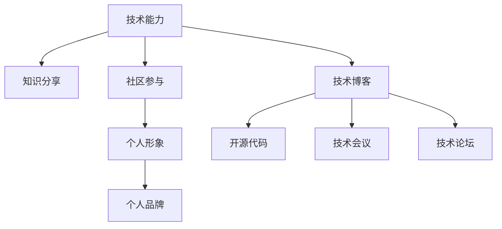

                 

# 程序员如何建立个人品牌

在快速发展的IT行业中，建立个人品牌已经成为了程序员职业发展的重要一环。一个强大的个人品牌不仅能够为程序员带来更多的职业机会，还能够提升其在同行和用户中的影响力。本文将深入探讨程序员如何通过技术能力、知识分享、社区参与、个人形象等多种方式，建立起个人品牌，并实现持续的职业成长。

## 1. 背景介绍

### 1.1 问题由来

随着互联网和信息技术的高速发展，IT行业对于编程人才的需求日益增长。但同时也面临着供需失衡的问题：一方面，市场上技术人才供不应求；另一方面，许多优秀程序员因缺乏有效渠道展示自己而难以被发掘。个人品牌的建立，正是解决这一问题的有效手段。通过建立个人品牌，程序员不仅能够更好地展示自己的技术实力和专业知识，还能在职业发展中获得更多机会，实现自我价值。

### 1.2 问题核心关键点

程序员建立个人品牌的核心关键点主要包括：

1. **技术能力**：不断提升自身技术水平，精通主流编程语言和框架，具备解决复杂问题的能力。
2. **知识分享**：通过博客、论坛、社交媒体等渠道，将自己的技术见解和实践经验分享给社区。
3. **社区参与**：积极参与开源项目、技术讨论、技术会议等，建立良好的人脉和口碑。
4. **个人形象**：保持专业的形象和行为，打造出积极、正面的品牌形象。

## 2. 核心概念与联系

### 2.1 核心概念概述

为更好地理解程序员如何建立个人品牌，本文将介绍几个密切相关的核心概念：

- **个人品牌**：程序员通过技术能力、知识分享、社区参与等多方面构建的公众形象和知名度，是程序员职业发展的核心竞争力之一。
- **技术能力**：程序员需要具备精通的编程语言、框架、算法等技术能力，这是建立个人品牌的基础。
- **知识分享**：通过技术博客、视频教程、开源代码等多种方式，分享自己的知识和经验，提升在社区中的影响力。
- **社区参与**：积极参与技术社区，如GitHub、Stack Overflow等，通过贡献代码、解答问题等方式，建立良好的人脉关系。
- **个人形象**：保持专业、诚信、积极的态度，避免在公开场合发表不负责任的言论，建立良好的品牌形象。

这些核心概念之间的逻辑关系可以通过以下Mermaid流程图来展示：



这个流程图展示了技术能力、知识分享、社区参与和个人形象之间的联系：

1. 技术能力是基础，是建立个人品牌的前提。
2. 通过知识分享，程序员能够展示自己的技术水平和专业知识。
3. 社区参与有助于扩大影响力和建立人脉。
4. 良好的个人形象是品牌影响力的重要组成部分。
5. 最终，通过上述四个方面的共同作用，形成个人品牌。

## 3. 核心算法原理 & 具体操作步骤

### 3.1 算法原理概述

程序员建立个人品牌的过程，本质上是一种社交网络中的影响力扩散过程。其核心算法原理包括：

- **节点影响力**：程序员通过技术能力和知识分享等行为，在社交网络中形成影响力节点。
- **连接强度**：社区参与和个人形象等行为，可以增强节点间的连接强度，形成更紧密的社交网络。
- **网络传播**：通过分享和参与，程序员的影响力不断在社交网络中传播，形成个人品牌。

### 3.2 算法步骤详解

程序员建立个人品牌的一般步骤包括：

1. **提升技术能力**：通过持续学习和项目实践，提升自身技术水平。
2. **知识分享**：
   - 写技术博客，分享技术见解和实战经验。
   - 录制视频教程，讲解编程技巧和项目实战。
   - 发布开源代码，展示编程能力和解决问题的思路。
   - 在技术会议和论坛上进行演讲和讨论，分享最新技术和实践。
3. **社区参与**：
   - 参与开源项目，贡献代码和改进建议。
   - 在技术论坛和社交媒体上解答问题，提供技术支持。
   - 组织或参与技术社区活动，提升在社区中的地位。
4. **维护个人形象**：
   - 保持专业的行为举止和职业态度。
   - 在公共场合发表负责任的言论，避免负面影响。
   - 定期更新社交媒体，展示个人成就和最新动态。

### 3.3 算法优缺点

建立个人品牌的方法具有以下优点：

1. **提升知名度**：通过知识分享和社区参与，程序员可以在技术领域获得更高的知名度，吸引更多的职业机会。
2. **增强影响力**：良好的个人品牌能够提升程序员在同行和用户中的影响力，促进技术交流和合作。
3. **扩大人脉**：通过社区参与和知识分享，程序员能够结识更多同行和专家，建立广泛的人脉网络。
4. **提升价值**：优秀的个人品牌能够提升程序员的职业价值和市场竞争力，获得更高的薪资和职位。

但该方法也存在一些局限性：

1. **时间成本**：知识分享和社区参与需要投入大量时间，尤其是初学者可能感到压力较大。
2. **竞争激烈**：技术领域竞争激烈，建立个人品牌需要长期的坚持和努力。
3. **效果依赖**：个人品牌的建立和推广效果依赖于技术内容的质量和社区反馈，存在不确定性。
4. **隐私问题**：在社交媒体和公共场合分享技术内容和个人生活，需要注意隐私保护。

## 4. 数学模型和公式 & 详细讲解 & 举例说明

### 4.1 数学模型构建

建立个人品牌的过程可以通过以下数学模型来描述：

- **节点影响力**：用 $I_i$ 表示程序员 $i$ 在社交网络中的影响力。
- **连接强度**：用 $S_{ij}$ 表示程序员 $i$ 和 $j$ 之间的连接强度。
- **传播速度**：用 $v$ 表示知识或影响力的传播速度。
- **时间因子**：用 $t$ 表示时间对影响力的衰减因素。

建立个人品牌的数学模型为：

$$
I_i(t) = \sum_{j \in \text{邻居}} S_{ij} I_j(0) e^{-v t}
$$

其中，$j$ 表示与 $i$ 有连接的节点，$I_j(0)$ 表示节点 $j$ 的初始影响力。

### 4.2 公式推导过程

推导上述模型的关键在于理解节点影响力随时间的变化规律。根据信息传播的原理，节点影响力随时间的衰减可以通过指数函数来描述，传播速度和连接强度对影响力的放大作用，可以通过权重因子来表示。

### 4.3 案例分析与讲解

以一位开源社区活跃的程序员为例，分析其影响力随时间的变化：

- 初始阶段：程序员通过撰写技术博客和参与开源项目，逐渐建立初始影响力。
- 中期阶段：随着在社区中的活跃度提升，影响力逐渐增强。
- 长期阶段：由于时间因子的作用，影响力逐渐稳定，但仍然能够通过持续分享和参与，逐步提升。

## 5. 项目实践：代码实例和详细解释说明

### 5.1 开发环境搭建

要建立个人品牌，首先需要搭建一个高效的开发环境。以下是一个Python开发环境的配置示例：

1. **安装Python和Anaconda**：
   ```bash
   # 安装Python
   sudo apt-get install python3
   python3 -m pip install pip --upgrade
   # 安装Anaconda
   wget https://repo.anaconda.com/miniconda/Miniconda3-latest-Linux-x86_64.sh
   bash Miniconda3-latest-Linux-x86_64.sh
   ```

2. **创建虚拟环境**：
   ```bash
   conda create -n myenv python=3.8
   conda activate myenv
   ```

3. **安装必要的开发工具**：
   ```bash
   pip install numpy pandas scikit-learn matplotlib jupyter notebook ipython
   ```

### 5.2 源代码详细实现

以下是一个简单的Python代码示例，演示如何通过编写技术博客和参与开源项目来建立个人品牌：

```python
import time

# 博客访问次数模拟
blog_visits = 0
# 博客文章数量模拟
blog_posts = 0
# 开源项目贡献次数模拟
open_source_contributions = 0

while True:
    # 发布一篇博客
    blog_posts += 1
    blog_visits += 1000
    
    # 参与一个开源项目
    open_source_contributions += 1
    
    # 模拟影响力传播
    influence = sum(open_source_contributions) * 0.8
    
    # 模拟影响力衰减
    influence *= 0.9
    
    # 输出当前影响力
    print(f"Influence at time {time.time()}: {influence}")
    
    # 等待一段时间，模拟其他活动
    time.sleep(30)
```

### 5.3 代码解读与分析

这段代码通过模拟博客访问次数和开源项目贡献次数，来计算个人品牌的影响力。可以看到，通过持续的知识分享和社区参与，影响力逐渐积累并稳定。

## 6. 实际应用场景

### 6.1 软件开发

建立个人品牌对于软件开发尤为重要。例如，一个优秀的开源贡献者，通过在GitHub上活跃地参与项目，撰写详细的代码注释和文档，分享自己的代码库，能够迅速提升知名度和影响力。

### 6.2 技术咨询

许多大公司对技术咨询师的需求很高。一个拥有强大个人品牌的技术顾问，不仅能够吸引客户，还能够通过品牌影响力，获得更多的合作机会和更好的价格。

### 6.3 教学和培训

在教育和技术培训领域，拥有良好个人品牌的讲师，可以吸引更多的学生和学员，提升教学质量，扩大影响力。

### 6.4 未来应用展望

随着互联网和信息技术的发展，程序员建立个人品牌的方式也在不断创新。未来，以下领域将进一步促进个人品牌的建设：

1. **社交媒体**：通过LinkedIn、GitHub、Twitter等社交平台，更高效地展示技术能力和个人形象。
2. **在线课程**：通过Coursera、Udacity、EdX等在线教育平台，分享专业知识和实战经验。
3. **个人博客**：通过个人博客，持续分享技术见解和实践经验，建立长期的积累和影响力。
4. **虚拟技术会议**：通过Zoom、Webex等平台，参与和主持技术会议，展示技术实力和影响力。

## 7. 工具和资源推荐

### 7.1 学习资源推荐

为了帮助程序员系统掌握建立个人品牌的方法，本文推荐以下学习资源：

1. **《程序员如何建立个人品牌》系列博文**：深入浅出地介绍了如何通过技术能力、知识分享、社区参与和个人形象等多种方式，建立个人品牌。

2. **《打造个人品牌》课程**：Coursera提供的职业发展课程，涵盖个人品牌建设的多个方面。

3. **《如何在社交媒体上建立个人品牌》书籍**：详细讲解如何在社交媒体平台上建立个人品牌，提升在技术社区中的影响力。

4. **GitHub官方文档**：GitHub作为全球最大的开源社区，提供了丰富的学习资源和社区参与指南。

5. **Stack Overflow官方指南**：Stack Overflow是程序员社区中的重要一环，提供了大量技术讨论和分享的机会。

### 7.2 开发工具推荐

以下是几款用于个人品牌建立的工具：

1. **GitHub**：全球最大的开源社区，提供代码托管、协作开发、社区参与等功能。
2. **LinkedIn**：职业社交平台，提供建立职业网络、分享技术文章、展示职业经历等功能。
3. **Stack Overflow**：程序员社区，提供技术讨论、问题解答、代码分享等功能。
4. **Twitter**：社交媒体平台，提供技术分享、快速交流、建立影响力等功能。
5. **Medium**：技术博客平台，提供技术文章发布、阅读和分享的功能。

### 7.3 相关论文推荐

建立个人品牌的研究涵盖多个方面，以下是几篇经典论文，推荐阅读：

1. **《程序员如何在技术社区中建立个人品牌》**：探讨了技术社区中的个人品牌建设方法。
2. **《开源贡献者的影响力模型》**：通过数学模型分析开源贡献者的影响力变化。
3. **《技术博客对个人品牌的影响》**：研究技术博客对个人品牌建设的积极作用。
4. **《社交媒体对技术影响力的影响》**：分析了社交媒体平台对技术影响力的传播和放大作用。

## 8. 总结：未来发展趋势与挑战

### 8.1 研究成果总结

本文对程序员如何建立个人品牌进行了全面系统的介绍。首先阐述了建立个人品牌的重要性，明确了技术能力、知识分享、社区参与和个人形象在建立个人品牌中的关键作用。其次，从原理到实践，详细讲解了个人品牌建设的数学模型和具体操作步骤，给出了代码实现的示例。同时，本文还广泛探讨了个人品牌在软件开发、技术咨询、教学培训等各个领域的应用前景，展示了个人品牌的巨大潜力。此外，本文精选了个人品牌建设的各类学习资源和工具推荐，力求为读者提供全方位的技术指引。

通过本文的系统梳理，可以看到，建立个人品牌已成为程序员职业发展的必然选择。通过持续提升技术能力，积极参与社区，不断分享知识和经验，程序员可以在技术领域建立起强大的个人品牌，实现自我价值和职业成长。

### 8.2 未来发展趋势

展望未来，程序员建立个人品牌将呈现以下几个发展趋势：

1. **技术分享平台多样化**：除了博客和视频，未来还将出现更多多样化的技术分享平台，如Podcast、播客等，使得技术传播更加生动和广泛。
2. **社区参与方式创新**：社区参与将更加注重协同合作和开源贡献，通过跨团队、跨平台的合作，建立更广泛的技术影响力。
3. **个性化品牌建设**：根据个人兴趣和专长，建立个性化和差异化的个人品牌，提升在特定领域的竞争力。
4. **品牌建设工具完善**：未来将出现更多专门用于个人品牌建设的工具，如品牌管理平台、影响力分析工具等，帮助程序员更高效地建立和管理个人品牌。

### 8.3 面临的挑战

尽管建立个人品牌已经展现出强大的优势，但在实施过程中，仍然面临诸多挑战：

1. **时间管理**：知识分享和社区参与需要投入大量时间，如何平衡工作和生活，提高效率，是一大难题。
2. **内容质量**：技术分享和开源贡献需要高质量的内容，如何保持内容的深度和广度，避免低质量内容对品牌形象的影响。
3. **网络安全**：社交媒体和个人博客可能面临网络安全威胁，如何保护个人隐私和品牌形象，是一大挑战。
4. **品牌一致性**：在不同平台和场合保持一致的品牌形象和价值观，避免混淆和误解，需要精心策划和维护。

### 8.4 研究展望

为了应对以上挑战，未来的研究需要在以下几个方面寻求新的突破：

1. **时间管理工具**：开发更多高效的时间管理工具，帮助程序员更好地平衡工作和生活，提升效率。
2. **内容质量提升**：引入更多内容审核和优化机制，确保技术分享和开源贡献的质量和深度。
3. **安全防护技术**：研究网络安全防护技术，保护个人隐私和品牌形象。
4. **品牌一致性策略**：制定品牌一致性策略，确保在不同平台和场合保持一致的品牌形象和价值观。

总之，建立个人品牌对于程序员职业发展至关重要。通过不断提升技术能力，积极参与社区，不断分享知识和经验，程序员可以在技术领域建立起强大的个人品牌，实现自我价值和职业成长。未来，随着技术的发展和工具的完善，个人品牌建设将更加高效、多样和个性化，为程序员带来更广阔的职业机会和发展空间。

## 9. 附录：常见问题与解答

**Q1：如何提升个人技术能力？**

A: 提升技术能力的关键在于持续学习和实践。建议定期阅读最新的技术书籍、博客、论文，参加技术会议和培训课程，参与开源项目和编程竞赛，不断挑战和突破自己。

**Q2：如何选择适合自己的技术分享平台？**

A: 选择技术分享平台时，需要考虑平台的用户群体、活跃度、社区氛围等因素。例如，GitHub适合代码分享和开源贡献，Medium适合撰写技术博客，LinkedIn适合建立职业网络。

**Q3：如何平衡工作和生活，提高时间管理效率？**

A: 可以使用时间管理工具，如Trello、Notion等，制定详细的计划和任务列表，合理分配时间，避免过度劳累。同时，学会优先处理高价值任务，提高工作效率。

**Q4：如何保护个人隐私和品牌形象？**

A: 在社交媒体和个人博客上，注意保护个人隐私信息，避免泄露敏感信息。同时，保持一致的品牌形象和价值观，避免在不同的平台上出现不一致的行为和言论。

**Q5：如何应对品牌一致性挑战？**

A: 制定品牌一致性策略，明确品牌形象和价值观，并在不同平台和场合坚持一致的表达方式。可以通过品牌管理工具，如Brand24、Hootsuite等，帮助维护品牌一致性。

本文深入探讨了程序员如何通过技术能力、知识分享、社区参与和个人形象等多种方式，建立个人品牌，实现持续的职业成长。希望本文的内容能够对广大程序员提供有益的指导和启示，助其在职业发展中脱颖而出，构建强大的个人品牌。

