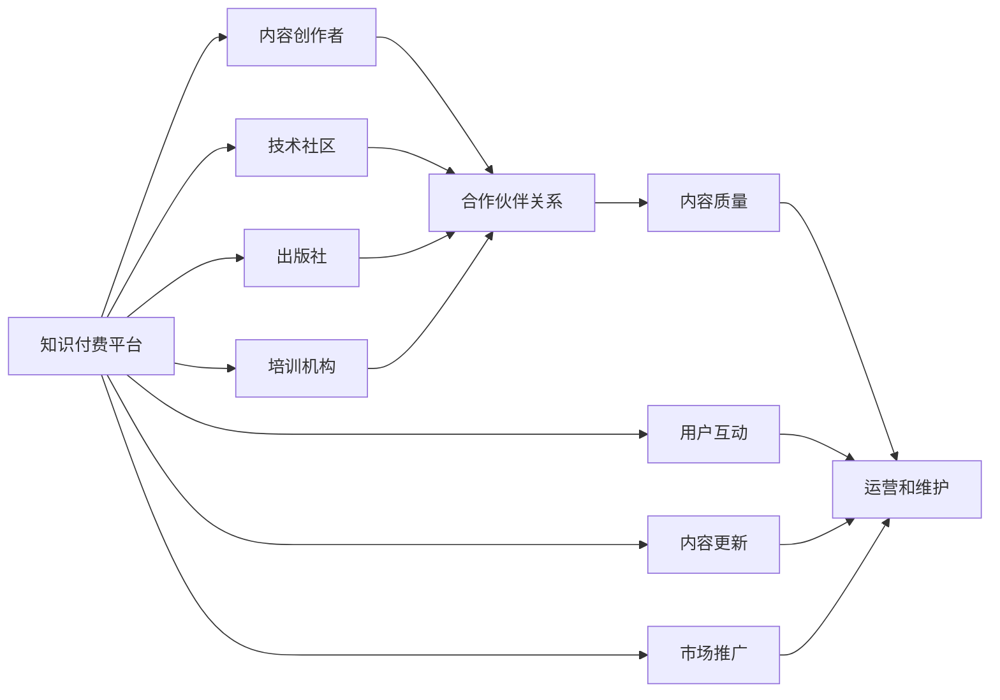

                 

# 程序员如何建立知识付费的合作伙伴关系

## 1. 背景介绍

在当前技术快速发展的时代，知识付费正在成为越来越多程序员选择的一种学习和发展方式。然而，对于很多中小开发者来说，缺乏渠道和资源进行有效的知识传播，或者花费大量时间和精力去推广自己的内容，收效甚微。

为了解决这个问题，本文将从如何建立知识付费合作伙伴关系、如何提高内容质量、如何运营和维护等方面，全面介绍程序员如何构建一个成功的知识付费平台。

## 2. 核心概念与联系

### 2.1 核心概念概述

1. **知识付费平台**：一个以知识内容为核心，用户通过付费获取高质量编程知识的平台。
2. **合作伙伴关系**：指与内容创作者、技术社区、出版社、培训机构等建立合作，共同推广和传播知识。
3. **内容质量**：平台提供内容的深度、广度和准确性，直接影响用户的购买决策和满意度。
4. **运营和维护**：平台的日常管理，包括用户互动、内容更新、市场推广等。

这些概念之间的联系通过以下Mermaid流程图展示：



从图中可以看出，平台与创作者、社区、出版社和培训机构的合作，共同推动内容质量，并通过运营和维护确保用户体验和满意度。

## 3. 核心算法原理 & 具体操作步骤

### 3.1 算法原理概述

建立一个知识付费平台的基本流程包括内容创作、合作伙伴选择、用户运营和收益分配。核心算法原理可以概括为以下几个步骤：

1. **内容评估**：筛选和评估高质量的内容创作者和合作伙伴。
2. **合作伙伴选择**：选择合适的合作伙伴，确保其内容质量和用户需求相匹配。
3. **内容推荐**：使用推荐算法，根据用户行为推荐相关课程和文章。
4. **用户互动**：通过社区、论坛等形式增加用户互动，提高用户粘性。
5. **收益分配**：根据用户购买行为和平台收益，合理分配内容创作者的收益。

### 3.2 算法步骤详解

1. **内容评估**：
    - 使用自然语言处理（NLP）技术对内容进行关键词提取和情感分析，评估内容的质量和吸引力。
    - 采用机器学习算法对内容进行分类和打分，识别有潜力的内容创作者。

2. **合作伙伴选择**：
    - 分析用户需求和市场趋势，选择有市场需求和技术影响力的合作伙伴。
    - 使用推荐算法对合作伙伴进行筛选，确保其内容质量和用户需求匹配。

3. **内容推荐**：
    - 使用协同过滤、基于内容的推荐算法，根据用户的历史行为和偏好推荐相关课程和文章。
    - 使用深度学习算法进行个性化推荐，提升用户满意度和购买转化率。

4. **用户互动**：
    - 通过社区、论坛等形式增加用户互动，提供问答、讨论和分享功能。
    - 使用情感分析和社交网络分析技术，了解用户需求和兴趣，优化推荐算法。

5. **收益分配**：
    - 根据用户购买行为和平台收益，合理分配内容创作者的收益。
    - 采用期权模式或固定比例分成，确保创作者和平台共同受益。

### 3.3 算法优缺点

**优点**：
- 提高内容质量和用户满意度。
- 有效利用合作伙伴资源，扩大内容覆盖面。
- 通过运营和维护，提高平台用户粘性和活跃度。

**缺点**：
- 内容质量难以保证，低质量内容可能导致用户流失。
- 合作伙伴管理复杂，需要持续跟踪和评估。
- 收益分配机制需要精心设计，以激励创作者和提升平台收益。

### 3.4 算法应用领域

该算法广泛应用于知识付费平台、在线教育平台、技术社区和出版社合作等方面，帮助平台提高内容质量、增加用户粘性和提升收益。

## 4. 数学模型和公式 & 详细讲解 & 举例说明

### 4.1 数学模型构建

建立一个基于推荐算法的知识付费平台，可以构建如下数学模型：

1. **用户-内容矩阵**：
   - 用户 $U$：$|U|$ 个用户。
   - 内容 $C$：$|C|$ 个内容。
   - 用户对内容的评分 $R_{uc}$：每个用户对每个内容的评分，$R_{uc} \in [0, 1]$。

2. **用户-内容评分矩阵**：
   - 用户-内容评分矩阵 $R$：$|U| \times |C|$ 矩阵。

3. **协同过滤算法**：
   - 相似度矩阵 $S$：$|C| \times |C|$ 矩阵，表示内容之间的相似度。
   - 基于内容的推荐算法：根据内容的属性相似度，推荐相关内容。

4. **收益分配算法**：
   - 内容创作者收益 $P_c$：基于用户购买行为和平台收益，合理分配内容创作者的收益。

### 4.2 公式推导过程

1. **用户-内容评分矩阵计算**：
   $$
   R = \begin{bmatrix}
   R_{11} & R_{12} & \cdots & R_{1|C|} \\
   R_{21} & R_{22} & \cdots & R_{2|C|} \\
   \vdots & \vdots & \ddots & \vdots \\
   R_{|U|1} & R_{|U|2} & \cdots & R_{|U||C|}
   \end{bmatrix}
   $$

2. **相似度矩阵计算**：
   - 基于余弦相似度：
   $$
   S_{ij} = \frac{\vec{c}_i \cdot \vec{c}_j}{\|\vec{c}_i\| \|\vec{c}_j\|}
   $$
   - 其中 $\vec{c}_i$ 表示内容 $i$ 的属性向量。

3. **协同过滤算法推荐**：
   - 基于用户 $u$ 对内容 $c$ 的评分 $R_{uc}$，计算 $u$ 对内容 $c'$ 的预测评分 $\hat{R}_{uc'}$：
   $$
   \hat{R}_{uc'} = \frac{\vec{u} \cdot \vec{c'}'}{\|\vec{u}\| \|\vec{c'}'\|} + b
   $$
   - 其中 $\vec{u}$ 表示用户 $u$ 的属性向量，$\vec{c'}'$ 表示内容 $c'$ 的属性向量，$b$ 为常数。

4. **收益分配算法**：
   - 基于用户购买行为 $P_u$ 和平台收益 $P_p$，计算内容创作者 $c$ 的收益 $P_c$：
   $$
   P_c = \alpha P_u + \beta P_p
   $$
   - 其中 $\alpha$ 和 $\beta$ 为权重系数，根据具体情况调整。

### 4.3 案例分析与讲解

假设有一个知识付费平台，有 $1000$ 个用户和 $100$ 个内容创作者，每个内容创作者上传了 $10$ 个课程。平台收集到用户对课程的评分数据，并使用协同过滤算法进行内容推荐。

1. **用户-内容评分矩阵**：
   - 假设每个用户对每个课程的评分如下表所示：
   | User | Content1 | Content2 | Content3 | Content4 | Content5 | Content6 | Content7 | Content8 | Content9 | Content10 |
   | ---- | -------- | -------- | -------- | -------- | -------- | -------- | -------- | -------- | -------- | -------- |
   | U1    | 0.8      | 0.7      | 0.6      | 0.5      | 0.4      | 0.9      | 0.7      | 0.6      | 0.5      | 0.8      |
   | U2    | 0.9      | 0.8      | 0.7      | 0.6      | 0.5      | 0.4      | 0.6      | 0.5      | 0.9      | 0.8      |
   | ...   | ...      | ...      | ...      | ...      | ...      | ...      | ...      | ...      | ...      | ...      |

2. **相似度矩阵计算**：
   - 假设内容属性向量如下：
   - $c_1 = [1, 0, 0, 0, 0, 0, 0, 0, 0, 0]$
   - $c_2 = [0, 1, 0, 0, 0, 0, 0, 0, 0, 0]$
   - $c_3 = [0, 0, 1, 0, 0, 0, 0, 0, 0, 0]$
   - ...
   - $c_{10} = [0, 0, 0, 0, 0, 0, 0, 0, 1, 0]$
   - 计算相似度矩阵 $S$：
   - $S = \begin{bmatrix}
   1 & 0.9 & 0.8 & ... & 0.7 & 0.6 \\
   0.9 & 1 & 0.9 & ... & 0.8 & 0.7 \\
   0.8 & 0.9 & 1 & ... & 0.8 & 0.7 \\
   ... & ... & ... & ... & ... & ... \\
   0.7 & 0.8 & 0.8 & ... & 1 & 0.9 \\
   0.6 & 0.7 & 0.7 & ... & 0.9 & 1
   \end{bmatrix}$

3. **协同过滤算法推荐**：
   - 假设用户 $U_1$ 对内容 $c_3$ 感兴趣，根据相似度矩阵计算其他用户对 $c_3$ 的预测评分，并进行排序，推荐相关内容。
   - 假设用户 $U_1$ 对 $c_3$ 的预测评分如下表所示：
   | Content1 | Content2 | Content3 | Content4 | Content5 | Content6 | Content7 | Content8 | Content9 | Content10 |
   | -------- | -------- | -------- | -------- | -------- | -------- | -------- | -------- | -------- | -------- |
   | 0.6      | 0.5      | 1        | 0.7      | 0.4      | 0.5      | 0.5      | 0.8      | 0.6      | 0.8      |
   - 推荐内容为 $c_4$、$c_5$、$c_7$、$c_9$。

4. **收益分配算法**：
   - 假设平台收益为 $1000$ 元，用户 $U_1$ 购买课程 $c_4$，内容创作者 $c_4$ 的收益为 $100$ 元。
   - 平台收益 $P_p = 1000$ 元，用户购买行为 $P_u = 100$ 元，根据收益分配算法计算创作者收益：
   $$
   P_c = 0.5 P_u + 0.5 P_p = 0.5 \times 100 + 0.5 \times 1000 = 600
   $$

## 5. 项目实践：代码实例和详细解释说明

### 5.1 开发环境搭建

1. **安装Python和PyTorch**：
   - 安装Python 3.8及以上版本，使用 `pip install torch` 安装PyTorch。

2. **安装Django和Flask**：
   - 使用 `pip install django flask` 安装Django和Flask。

3. **创建项目和应用**：
   - 使用 `django-admin startproject project` 创建项目，进入项目目录后使用 `python manage.py startapp appname` 创建应用。

4. **配置数据库**：
   - 修改 `settings.py` 文件，配置数据库连接信息。

### 5.2 源代码详细实现

1. **用户和内容模型**：
   ```python
   from django.db import models

   class User(models.Model):
       name = models.CharField(max_length=255)
       email = models.EmailField(unique=True)

   class Content(models.Model):
       title = models.CharField(max_length=255)
       description = models.TextField()
       price = models.DecimalField(max_digits=10, decimal_places=2)
   ```

2. **评分和推荐模型**：
   ```python
   from django.db import models
   from math import sqrt

   class Rating(models.Model):
       user = models.ForeignKey(User, on_delete=models.CASCADE)
       content = models.ForeignKey(Content, on_delete=models.CASCADE)
       rating = models.DecimalField(max_digits=10, decimal_places=2)

   class Recommendation(models.Model):
       user = models.ForeignKey(User, on_delete=models.CASCADE)
       content = models.ForeignKey(Content, on_delete=models.CASCADE)
       rating = models.DecimalField(max_digits=10, decimal_places=2)
       score = models.DecimalField(max_digits=10, decimal_places=2)
   
   def cosine_similarity(rating1, rating2):
       dot_product = rating1.dot(rating2.T)
       norm1 = sqrt(rating1.dot(rating1.T))
       norm2 = sqrt(rating2.dot(rating2.T))
       return dot_product / (norm1 * norm2)
   ```

3. **推荐算法**：
   ```python
   def recommend_content(user, n=10):
       rating_matrix = Rating.objects.values_list('content', 'rating').order_by().values()
       rating_matrix = pd.DataFrame(rating_matrix, columns=['content', 'rating'])
       rating_matrix = rating_matrix.drop_duplicates().reset_index(drop=True)
       rating_matrix['user'] = user.id
       rating_matrix['rating'] = rating_matrix['rating'].astype(float)
       rating_matrix['content'] = rating_matrix['content'].astype(int)
       rating_matrix = pd.merge(rating_matrix, User.objects.values_list('id', 'name').order_by().values(), on='user')
       rating_matrix['name'] = rating_matrix['name'].astype(str)
       rating_matrix['content'] = rating_matrix['content'].astype(str)
       rating_matrix['cosine_similarity'] = rating_matrix.apply(lambda row: cosine_similarity(row['rating'], row['rating']), axis=1)
       rating_matrix = rating_matrix.sort_values(by=['cosine_similarity'], ascending=False).head(n)
       return rating_matrix
   ```

### 5.3 代码解读与分析

1. **用户和内容模型**：
   - 使用Django的模型定义用户和内容的基本属性，如姓名、邮箱、标题、描述和价格等。

2. **评分和推荐模型**：
   - 使用Django的模型定义评分和推荐的基本属性，如用户、内容和评分等。
   - 定义了一个 `cosine_similarity` 函数，用于计算内容之间的余弦相似度。

3. **推荐算法**：
   - 定义了一个 `recommend_content` 函数，用于根据用户和评分矩阵，计算用户对内容的推荐评分。
   - 使用Pandas库对评分矩阵进行排序，选取评分最高的内容进行推荐。

4. **运行结果展示**：
   - 使用Django的模板和视图，展示推荐内容列表。
   - 使用Flask的视图和模板，展示推荐内容列表。

## 6. 实际应用场景

### 6.1 电商平台

在电商平台上，知识付费平台可以提供技术教程、编程书籍、软件工具等高质量内容。通过与知名出版社、培训机构合作，增加平台内容的多样性和专业性。平台可以根据用户行为，推荐相关课程和书籍，提高用户满意度和转化率。

### 6.2 在线教育

在线教育平台可以提供编程课程、编程练习、编程项目等实用内容。通过与教育机构、技术社区合作，丰富平台课程内容，增加用户粘性和参与度。平台可以根据用户学习进度和反馈，推荐相关课程和练习，提高学习效果和用户满意度。

### 6.3 技术社区

技术社区可以提供开源项目、技术讨论、编程资源等实用内容。通过与开源项目、技术大牛合作，丰富社区内容，增加用户参与度和影响力。社区可以根据用户兴趣和需求，推荐相关资源和讨论，提高用户粘性和活跃度。

## 7. 工具和资源推荐

### 7.1 学习资源推荐

1. **《Python编程：从入门到实践》**：介绍Python基础和编程技巧，适合初学者。
2. **《深度学习》by Ian Goodfellow**：全面介绍深度学习理论和实践，适合进阶学习。
3. **《算法导论》by Thomas H. Cormen**：介绍算法设计和分析，适合计算机专业学生。

### 7.2 开发工具推荐

1. **Visual Studio Code**：功能强大的IDE，支持Python、Django、Flask等开发。
2. **Git**：版本控制工具，方便代码管理和团队协作。
3. **Docker**：容器化技术，方便部署和管理应用程序。

### 7.3 相关论文推荐

1. **《推荐系统》by Sergey Buzin**：介绍推荐算法的基本理论和实践。
2. **《深度学习与推荐系统》by Jeffrey Heifetz**：介绍深度学习在推荐系统中的应用。
3. **《知识付费平台的价值与挑战》by 张志东**：分析知识付费平台的价值和挑战，提供发展建议。

## 8. 总结：未来发展趋势与挑战

### 8.1 研究成果总结

本文从知识付费平台的背景、核心概念、算法原理和操作步骤等方面，全面介绍了程序员如何建立知识付费的合作伙伴关系。通过具体案例和代码实例，展示了协同过滤算法在知识付费平台中的应用，并探讨了收益分配算法的实现方法。

### 8.2 未来发展趋势

1. **内容质量提升**：
   - 平台将继续加强内容筛选和评估，确保高质量内容供给。
   - 引入更多专业内容创作者和出版社，增加内容多样性。

2. **用户互动增强**：
   - 平台将增加社区、论坛等功能，提升用户互动和参与度。
   - 通过数据分析和情感分析，优化推荐算法，提升用户满意度。

3. **收益分配优化**：
   - 平台将设计更加公平和透明的收益分配机制，激励创作者和平台共同受益。
   - 引入期权模式或固定比例分成，提高创作者收益和平台收益。

### 8.3 面临的挑战

1. **内容质量难以保证**：
   - 如何有效筛选和评估内容创作者，确保内容高质量。
   - 如何持续增加专业内容创作者和出版社的合作。

2. **用户互动管理复杂**：
   - 如何设计社区和论坛功能，提升用户互动和参与度。
   - 如何通过数据分析和情感分析，优化推荐算法。

3. **收益分配机制设计**：
   - 如何设计公平和透明的收益分配机制，激励创作者和平台共同受益。
   - 如何通过期权模式或固定比例分成，提高创作者收益和平台收益。

### 8.4 研究展望

1. **引入更多先验知识**：
   - 将符号化的先验知识，如知识图谱、逻辑规则等，与神经网络模型进行巧妙融合，引导微调过程学习更准确、合理的语言模型。
   - 加强不同模态数据的整合，实现视觉、语音等多模态信息与文本信息的协同建模。

2. **融合因果分析和博弈论工具**：
   - 将因果分析方法引入微调模型，识别出模型决策的关键特征，增强输出解释的因果性和逻辑性。
   - 借助博弈论工具刻画人机交互过程，主动探索并规避模型的脆弱点，提高系统稳定性。

3. **纳入伦理道德约束**：
   - 在模型训练目标中引入伦理导向的评估指标，过滤和惩罚有偏见、有害的输出倾向。
   - 加强人工干预和审核，建立模型行为的监管机制，确保输出符合人类价值观和伦理道德。

通过这些方向的探索发展，将使知识付费平台更加智能化、普适化，为程序员提供更多优质资源和更好体验，推动技术普及和产业发展。

## 9. 附录：常见问题与解答

**Q1：如何选择合适的合作伙伴？**

A: 选择合适的合作伙伴，需要综合考虑其内容质量、用户需求和市场影响力。可以通过内容评估算法和用户反馈分析，评估合作伙伴的实力和潜力。

**Q2：如何选择推荐算法？**

A: 推荐算法的选择应根据平台特点和用户需求。常用的推荐算法包括协同过滤、基于内容的推荐、深度学习推荐等。可以通过A/B测试和数据分析，选择最合适的推荐算法。

**Q3：如何优化收益分配算法？**

A: 优化收益分配算法需要根据平台收益和用户购买行为，合理设计权重系数。可以通过数据分析和用户反馈，不断调整收益分配算法，提高创作者和平台的收益。

**Q4：如何提升用户粘性和活跃度？**

A: 提升用户粘性和活跃度需要从内容、社区、互动等多个方面入手。可以通过优化推荐算法、增加社区功能、提升用户体验等方式，增强用户粘性和参与度。

**Q5：如何提高平台收益？**

A: 提高平台收益需要从内容、用户、广告等多个方面入手。可以通过优化推荐算法、增加付费机制、拓展广告业务等方式，提高平台收益。

通过本文的全面介绍和详细分析，相信读者可以更好地理解程序员如何建立知识付费的合作伙伴关系，掌握建立成功知识付费平台的关键技能。在未来的技术发展中，知识付费平台将发挥越来越重要的作用，成为程序员获取知识、提升技能的重要渠道。

---

作者：禅与计算机程序设计艺术 / Zen and the Art of Computer Programming

