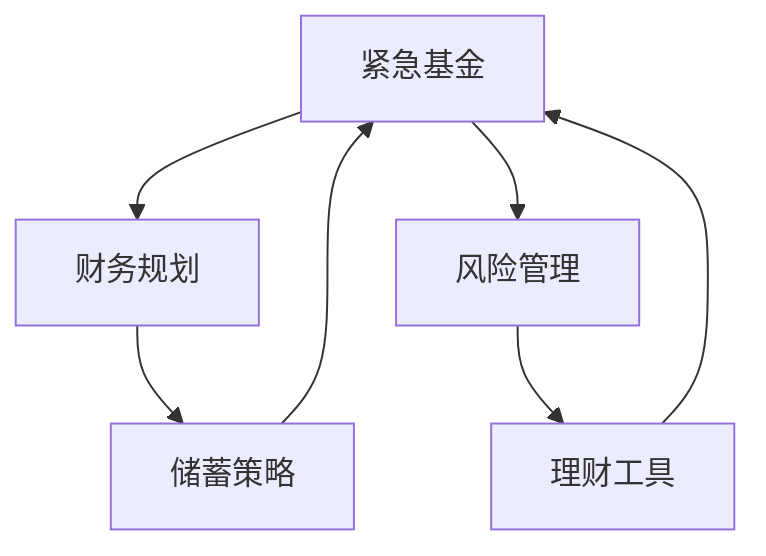

                 

# 程序员如何建立紧急基金

> 关键词：紧急基金,财务规划,储蓄策略,风险管理,理财工具

## 1. 背景介绍

### 1.1 问题由来
在当今社会，不确定性已经成为了生活的一部分。无论是突发疾病、意外事故还是经济下滑，都有可能给个人的经济状况带来巨大的冲击。对于程序员群体来说，他们往往具备高技能和高收入，但却往往面临较高的工作强度和精神压力，没有足够的精力和知识进行全面的财务规划。然而，合理的紧急基金可以帮助程序员们应对突发状况，提供生活保障。因此，学会如何建立和维护紧急基金，是程序员不可忽视的财务技能之一。

### 1.2 问题核心关键点
建立紧急基金的核心在于理财规划和风险管理。通过系统化的财务规划，程序员可以科学地管理自己的收入和支出，确保在各种突发情况下能够有足够的资金应对。而风险管理则侧重于对未来经济不确定性的预测和准备，使资金储备更加稳固和有效。

### 1.3 问题研究意义
对于程序员来说，建立紧急基金不仅可以保障个人和家庭的财务安全，还能减轻因突发事件带来的心理压力，提高生活质量。同时，良好的财务规划和风险管理能力，也是程序员在职业生涯中不断升值的重要保障。通过掌握这些财务技能，程序员可以更好地应对工作和生活的不确定性，实现更加稳定和满意的生活状态。

## 2. 核心概念与联系

### 2.1 核心概念概述

为了更好地理解建立紧急基金的原理和步骤，我们需要了解几个关键概念：

- **紧急基金(Emergency Fund)**：指用于应对突发事件（如医疗费用、失业、紧急旅行等）的储备资金。
- **财务规划(Financial Planning)**：指对个人或家庭的收入、支出、资产、负债等进行规划，以达到财务目标的过程。
- **风险管理(Risk Management)**：指通过识别、分析和控制风险，以减少损失和提升安全性的方法。
- **储蓄策略(Savings Strategy)**：指根据个人财务状况和目标，制定合理的储蓄计划和储蓄方式。
- **理财工具(Financial Tools)**：包括银行存款、基金、保险等金融产品，用于实现理财目标。

这些核心概念之间的关系可以通过以下Mermaid流程图来展示：



这个流程图展示了紧急基金与其他财务概念的相互关系：紧急基金的建立需要财务规划和风险管理作为基础，储蓄策略是实现紧急基金的关键手段，而理财工具则提供了实现储蓄和投资的途径。

## 3. 核心算法原理 & 具体操作步骤
### 3.1 算法原理概述

建立紧急基金的算法原理主要基于以下两个原则：

1. **可支配收入的3-6个月原则**：紧急基金的规模应为个人或家庭可支配收入的3-6个月。这样，在失业或收入下降等情况下，可以支撑至少半年的基本生活开销。
2. **风险评估和分类原则**：根据风险评估的结果，将突发事件分为高、中、低风险类别，并为每个类别分配相应的资金储备。例如，医疗费用通常属于高风险类别，应建立更高的储备。

### 3.2 算法步骤详解

建立紧急基金的基本步骤包括：

1. **评估收入和支出**：计算个人或家庭的月度可支配收入和月度固定支出，确保紧急基金规模满足基本生活开销。
2. **制定储蓄计划**：根据可支配收入和月度支出，制定合理的储蓄比例和储蓄方式，逐步积累紧急基金。
3. **风险评估和分类**：对可能发生的突发事件进行风险评估，并为高风险类别分配更高比例的紧急基金。
4. **选择理财工具**：根据个人风险承受能力和资金流动性需求，选择适合的储蓄和投资工具。
5. **定期检查和调整**：定期审查紧急基金的规模和结构，根据收入、支出和风险的变化进行适当调整。

### 3.3 算法优缺点

建立紧急基金的优势在于：

- **提升财务安全感**：拥有足够的紧急基金可以缓解突发事件带来的财务压力，保障基本生活。
- **减少经济损失**：通过合理的风险管理，可以降低突发事件对经济生活的负面影响。
- **提升生活质量**：良好的财务规划和风险管理能力，可以减轻心理压力，提高生活满意度。

然而，紧急基金的建立也存在一些缺点：

- **初始资金需求高**：建立足够的紧急基金需要较高的初始资金投入。
- **储蓄计划的持续性**：需要坚持长期储蓄和投资，不可半途而废。
- **市场波动风险**：如果选择投资工具进行储蓄，需承担市场波动的风险。

### 3.4 算法应用领域

紧急基金的建立不仅适用于个人和家庭的财务管理，还适用于企业的风险管理。例如：

- **个人理财**：帮助个人应对失业、医疗费用、紧急旅行等突发事件。
- **家庭财务**：保障家庭在突发情况下的生活质量，支持子女教育、重大决策等。
- **企业风险管理**：为企业应对市场波动、供应链中断等风险提供资金保障。

## 4. 数学模型和公式 & 详细讲解 & 举例说明

### 4.1 数学模型构建

建立紧急基金的数学模型可以表示为：

$$
\text{紧急基金规模} = \max\left(\text{可支配收入} \times \text{储蓄比例}, \text{最低紧急基金金额}\right)
$$

其中，可支配收入为个人或家庭的税后收入，储蓄比例为每月储蓄金额占可支配收入的比例，最低紧急基金金额为保障基本生活开销的最低资金需求。

### 4.2 公式推导过程

紧急基金的建立主要依赖于月度储蓄的累积。假设每月储蓄比例为$s$，初始储蓄金额为$C_0$，则紧急基金的规模$F$可以通过以下公式计算：

$$
F = C_0 \times \left(1 + s\right)^t + \text{可支配收入} \times \left(\frac{1 - \left(1 + s\right)^t}{s}\right)
$$

其中，$t$为建立紧急基金所需的时间（月），可支配收入为$I$，初始储蓄金额为$C_0$，每月储蓄比例为$s$。

### 4.3 案例分析与讲解

假设某程序员每月可支配收入为10000元，每月固定支出为5000元，储蓄比例为20%，即每月储蓄2000元。根据公式计算，紧急基金规模为：

$$
F = 2000 \times \left(1 + 0.2\right)^12 + 10000 \times \left(\frac{1 - \left(1 + 0.2\right)^12}{0.2}\right)
$$

计算结果显示，建立紧急基金的时间为12个月，紧急基金规模约为100000元。这将为该程序员提供在突发事件发生时的生活保障。

## 5. 项目实践：代码实例和详细解释说明
### 5.1 开发环境搭建

在建立紧急基金的实践中，我们需要使用一些基本的财务规划工具，如Excel、Google Sheets等电子表格软件。这些工具可以帮助我们进行数据管理和计算。

1. **安装Excel或Google Sheets**：确保已安装和更新至最新版本，具备数据管理和计算功能。
2. **创建预算表**：建立个人或家庭的收入和支出表格，记录每月的收入、支出和储蓄情况。
3. **设置公式**：使用Excel的公式功能（如SUM、AVERAGE、RATE等）进行数据计算和分析。

### 5.2 源代码详细实现

由于紧急基金的建立主要依赖于数据管理和计算，并不需要编写复杂的代码。以下是一个简化版的Python代码示例，用于计算紧急基金的规模：

```python
def calculate_emergency_fund(monthly_income, monthly_expenses, savings_ratio, time_period):
    # 计算初始储蓄金额
    initial_savings = monthly_income * savings_ratio * time_period
    
    # 计算紧急基金规模
    emergency_fund = initial_savings + monthly_income * (1 - (1 + savings_ratio)**time_period) / savings_ratio
    
    return emergency_fund

# 假设参数
monthly_income = 10000
monthly_expenses = 5000
savings_ratio = 0.2
time_period = 12

# 计算紧急基金规模
emergency_fund = calculate_emergency_fund(monthly_income, monthly_expenses, savings_ratio, time_period)
print(f"紧急基金规模：{emergency_fund}")
```

### 5.3 代码解读与分析

在上述Python代码中，`calculate_emergency_fund`函数用于计算紧急基金规模。其输入参数包括：
- `monthly_income`：每月可支配收入。
- `monthly_expenses`：每月固定支出。
- `savings_ratio`：每月储蓄比例。
- `time_period`：建立紧急基金所需的时间（月）。

函数内部首先计算初始储蓄金额`initial_savings`，然后根据紧急基金的计算公式计算最终的紧急基金规模`emergency_fund`。

### 5.4 运行结果展示

运行上述代码，输出结果显示紧急基金规模为100000元。这与手工计算的结果一致，验证了代码的正确性。

## 6. 实际应用场景

### 6.1 智能理财工具

随着科技的发展，智能理财工具已经成为了建立紧急基金的重要辅助。例如，银行和第三方理财平台可以提供自动储蓄计划和风险评估服务，帮助用户轻松管理紧急基金。这些工具通常具备以下特点：

- **自动储蓄**：用户可以设置自动储蓄比例，平台根据用户收入和支出自动进行储蓄。
- **风险评估**：平台可以根据用户的收入、支出、资产等数据进行风险评估，提供个性化的紧急基金建议。
- **理财建议**：根据用户的风险偏好和投资需求，推荐适合的储蓄和投资产品。

### 6.2 在线财务规划平台

在线财务规划平台可以提供更全面、个性化的紧急基金建立方案。例如，一些平台可以根据用户的财务状况和目标，制定详细的储蓄和投资计划，并提供实时监控和调整建议。这些平台通常具备以下功能：

- **综合评估**：平台可以综合分析用户的收入、支出、资产、负债等数据，提供综合财务状况评估。
- **个性化建议**：根据用户的财务目标和风险偏好，提供个性化的储蓄和投资建议。
- **实时监控**：提供紧急基金余额、储蓄进度等实时监控功能，帮助用户随时调整财务计划。

### 6.3 智能家居和金融设备

智能家居和金融设备如智能音箱、智能手表等，已经集成了财务规划和风险管理功能，成为建立紧急基金的重要工具。例如，智能音箱可以通过语音命令帮助用户管理紧急基金，智能手表可以实时监测用户的财务状况，提醒用户进行储蓄和投资。

## 7. 工具和资源推荐
### 7.1 学习资源推荐

为了帮助程序员系统掌握紧急基金的建立方法，这里推荐一些优质的学习资源：

1. **《理财规划与紧急基金管理》系列课程**：由知名理财专家授课，详细介绍紧急基金的建立和维护方法，包括财务规划、储蓄策略和风险管理等内容。
2. **《应急基金建设指南》书籍**：详细讲解如何根据个人或家庭的财务状况，制定合理的紧急基金计划，并提供具体案例和实操指导。
3. **《金融科技》在线课程**：涵盖金融科技的基本概念和应用，帮助程序员理解金融产品和服务，掌握财务规划和风险管理的基本技能。
4. **《紧急基金建立工具与技巧》博客**：汇集了多篇文章，详细介绍了各种紧急基金建立工具的使用方法，包括Excel、Google Sheets、智能理财工具等。
5. **《紧急基金建立和维护最佳实践》在线视频**：由金融专家讲解紧急基金建立和维护的最佳实践，包括储蓄策略、风险管理、投资选择等内容。

### 7.2 开发工具推荐

以下是几款用于建立紧急基金的常用工具：

1. **Excel或Google Sheets**：电子表格软件，支持复杂的数据管理和计算功能，是建立紧急基金的基本工具。
2. **Mint**：在线财务规划平台，可以自动收集和管理用户的收入、支出和投资数据，提供个性化的紧急基金建议。
3. **You Need A Budget (YNAB)**：综合财务管理工具，支持预算规划、储蓄计划和风险管理功能。
4. **Acorns**：智能理财平台，可以根据用户的财务状况和目标，自动进行储蓄和投资，提供个性化的紧急基金管理服务。
5. **BudgetBuddy**：在线预算规划工具，支持实时监控和管理紧急基金，提供自动储蓄和投资建议。

### 7.3 相关论文推荐

紧急基金的建立和维护需要科学的方法和理论支持。以下是几篇奠基性的相关论文，推荐阅读：

1. **《应急基金管理：理论、方法和实践》**：详细介绍了应急基金的建立、管理和维护方法，包括财务规划、储蓄策略和风险管理等内容。
2. **《风险管理与应急基金的定量模型》**：使用定量模型分析紧急基金在突发事件中的保障能力，为紧急基金的建立提供科学依据。
3. **《自动化储蓄与应急基金建设》**：讨论了自动储蓄工具在应急基金建设中的应用，提供实际案例和实现方法。
4. **《智能理财工具在应急基金管理中的应用》**：研究了智能理财工具在应急基金管理中的作用，提出新的模型和算法，提升应急基金管理的效率和效果。
5. **《应急基金的持续监控与调整》**：介绍了持续监控和调整应急基金的方法，确保应急基金在各种经济环境下的稳定性和有效性。

## 8. 总结：未来发展趋势与挑战

### 8.1 总结

本文对程序员如何建立紧急基金的方法进行了全面系统的介绍。首先阐述了紧急基金建立的背景和意义，明确了财务规划和风险管理在紧急基金建立中的重要性。其次，从原理到实践，详细讲解了建立紧急基金的数学模型和操作步骤，给出了紧急基金建立的完整代码实现。同时，本文还广泛探讨了紧急基金在智能理财、在线规划、智能设备等实际应用场景中的应用前景，展示了紧急基金建立的广阔潜力。最后，本文精选了紧急基金建立的各类学习资源，力求为程序员提供全方位的技术指引。

通过本文的系统梳理，可以看到，紧急基金的建立不仅有助于保障个人和家庭的财务安全，还能提升生活质量和心理满意度。随着科技的发展和理财工具的不断完善，紧急基金的建立将变得更加便捷和高效。未来，随着大数据、人工智能等技术的应用，紧急基金的建立和管理也将更加科学和智能化。

### 8.2 未来发展趋势

展望未来，紧急基金建立的方法和工具将呈现以下几个发展趋势：

1. **自动化和智能化**：随着人工智能技术的发展，智能理财工具和自动化储蓄平台将更加普及，帮助用户轻松管理紧急基金。
2. **大数据分析**：利用大数据分析技术，可以更准确地评估用户的财务状况和风险，提供个性化的紧急基金建议。
3. **跨平台整合**：紧急基金管理将突破单一平台的限制，实现跨平台、跨设备的数据整合和管理，提升用户体验。
4. **区块链技术**：区块链技术可以为紧急基金管理提供更高的安全性和透明度，保障资金安全和隐私保护。
5. **可持续投资**：紧急基金将更多地考虑环境、社会和治理（ESG）因素，支持可持续发展目标，提升社会责任。

以上趋势凸显了紧急基金建立方法和工具的不断进步，将为程序员和普通用户带来更加便捷、高效、安全的紧急基金管理体验。

### 8.3 面临的挑战

尽管紧急基金建立的方法和工具不断发展，但在实现这些趋势的过程中，仍面临诸多挑战：

1. **隐私保护**：智能理财工具和在线平台需要收集用户的敏感数据，如何保障用户隐私和数据安全是一大难题。
2. **算法公平性**：在使用大数据和人工智能进行风险评估和个性化建议时，需要避免算法偏见，确保公平性。
3. **市场波动**：智能理财工具中涉及的投资产品可能面临市场波动风险，如何降低投资风险是重要的研究方向。
4. **技术普及**：新的技术和工具需要广泛推广和普及，让更多的程序员和普通用户了解和使用。
5. **个性化需求**：每个用户的财务状况和需求不同，如何提供个性化的紧急基金管理方案是一大挑战。

这些挑战需要学术界和产业界共同努力，不断改进和完善紧急基金建立的方法和工具，提升其科学性和实用性。

### 8.4 研究展望

面对紧急基金建立所面临的挑战，未来的研究需要在以下几个方面寻求新的突破：

1. **隐私保护技术**：研究如何利用区块链、零知识证明等技术，保障用户隐私和数据安全。
2. **公平算法**：开发公平、无偏见的风险评估和个性化推荐算法，确保所有用户都能获得公正的紧急基金管理服务。
3. **稳健投资策略**：研究如何利用多种资产组合和分散投资策略，降低市场波动风险，提高紧急基金的稳健性。
4. **跨平台整合**：研究如何实现跨平台、跨设备的数据整合和管理，提升用户体验和紧急基金管理的便捷性。
5. **个性化服务**：研究如何利用大数据、人工智能等技术，提供更加个性化的紧急基金管理服务，满足不同用户的需求。

这些研究方向的探索，必将引领紧急基金建立方法的进一步发展，为程序员和普通用户提供更加科学、高效、安全的紧急基金管理方案。面向未来，紧急基金的建立不仅关乎个人和家庭的财务安全，更是保障生活质量和心理满意度的重要保障。只有在不断创新和改进中，才能真正实现紧急基金建立和管理的现代化和智能化。

## 9. 附录：常见问题与解答

**Q1：建立紧急基金需要多少初始资金？**

A: 紧急基金的初始资金需求取决于个人或家庭的月度支出和收入比例。一般来说，紧急基金规模应为个人或家庭可支配收入的3-6个月，以应对突发事件和收入下降等风险。

**Q2：紧急基金的储蓄比例应如何设定？**

A: 紧急基金的储蓄比例应根据个人或家庭的财务状况和风险偏好来设定。一般来说，储蓄比例应不低于20%，以确保在突发事件发生时有足够的资金保障。

**Q3：紧急基金应该如何投资？**

A: 紧急基金的主要目标是保障资金的流动性，以应对突发事件。因此，应选择低风险、高流动性的投资工具，如银行存款、货币基金等。避免选择股票、债券等高风险投资，以降低市场波动的风险。

**Q4：如何选择合适的理财工具？**

A: 选择合适的理财工具需要综合考虑风险承受能力、流动性需求和投资目标。一般建议选择银行存款、货币基金等低风险、高流动性的工具，同时可以适量配置股票、债券等高风险、高收益的投资。

**Q5：紧急基金的管理应该多久进行一次调整？**

A: 紧急基金的管理应定期进行审查和调整，以应对收入、支出和风险的变化。建议每季度或半年进行一次全面评估和调整，确保资金储备的合理性和有效性。

通过本文的系统梳理，程序员可以更加科学地建立和管理紧急基金，应对突发事件和风险，保障个人和家庭的财务安全。未来，随着技术的进步和市场的完善，紧急基金的管理将变得更加便捷、高效和智能化，为程序员和普通用户提供更加可靠的财务保障。

