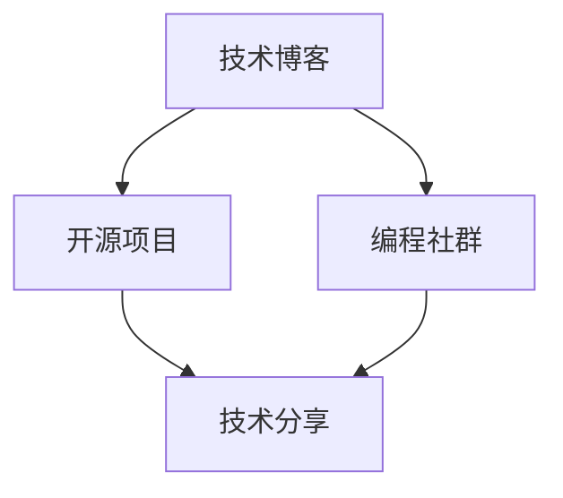

                 

# 程序员如何打造个人品牌IP

> 关键词：个人品牌,IP打造,技术博客,开源项目,编程社群,技术分享

## 1. 背景介绍

### 1.1 问题由来
在当今信息爆炸的时代，技术的更新迭代速度极快，对于程序员而言，如何在竞争激烈的职业环境中脱颖而出，显得尤为重要。塑造个人品牌，不仅能让个人在职场中占据优势，更能带来更广阔的发展机会和更高的收入水平。对于那些既渴望技术成长又渴望商业成功的人来说，打造个人品牌IP成为一项必不可少的技能。

### 1.2 问题核心关键点
个人品牌IP的打造是一个复杂而系统的工程，涉及个人技能、专业影响力、网络互动等多个维度。技术爱好者可以借由技术博客、开源项目、编程社群等多渠道提升自身影响力，赢得同行和行业外的关注，从而形成个人品牌。本文将从技术博客、开源项目、编程社群三个维度来探讨如何系统地打造个人品牌IP。

### 1.3 问题研究意义
个人品牌IP的成功打造不仅能提升程序员的个人价值，还能为其带来更多的职业机会和商业利益。通过建立专业影响力，个人能够在技术界内脱颖而出，吸引更多的同行合作与资源支持，甚至获得企业的青睐，进而在职业生涯中取得成功。因此，打造个人品牌IP对程序员而言具有重要意义。

## 2. 核心概念与联系

### 2.1 核心概念概述

要打造个人品牌IP，首先需要明确几个关键概念：

- **个人品牌**：通过技术博客、开源项目、编程社群等平台展示个人技术实力和专业见解，建立个人在行业内的影响力与知名度。
- **IP打造**：通过持续输出高质量内容、参与项目、建立社群等方式，不断提升个人在技术社区中的地位和影响力。
- **技术博客**：在个人博客或技术网站上持续分享技术见解、项目经验，记录技术成长过程，形成知识体系。
- **开源项目**：在GitHub等代码托管平台公开代码，共享开发经验，促进技术交流与合作。
- **编程社群**：参与线上或线下技术交流活动，结交同行，建立并扩展个人影响力网络。

这些概念之间的联系可以理解为：技术博客是IP打造的基础，开源项目和编程社群是IP建立的重要实践途径，三者共同作用，帮助个人建立并巩固其品牌影响力。

### 2.2 核心概念原理和架构的 Mermaid 流程图



## 3. 核心算法原理 & 具体操作步骤

### 3.1 算法原理概述

个人品牌IP的打造是一个不断迭代优化的过程，其核心在于持续输出高质量内容，建立与技术社群的深度互动。算法原理主要涉及以下几个方面：

- **内容生成**：通过撰写高质量的技术博客和开源项目文档，提供有价值的知识输出。
- **互动交流**：通过参与编程社群和开源项目，建立和维护个人在技术社区中的关系网络。
- **反馈优化**：通过社群反馈和项目评价不断调整博客和开源项目内容，提高个人品牌影响力。

### 3.2 算法步骤详解

#### 3.2.1 选择合适的内容方向

在技术博客和开源项目中，选择合适的技术方向是第一步。一般来说，应选择符合个人兴趣、技能熟练且市场有需求的领域。这不仅有利于提升个人技术水平，也能吸引更多的读者和合作者。

#### 3.2.2 撰写高质量博客

博客内容应具有深度和广度，包括但不限于以下方面：
- **基础技术讲解**：详细解释某个技术概念、算法原理。
- **项目经验分享**：记录并分享实际项目的开发经验，包括遇到的问题、解决方案及技术要点。
- **代码示例和优化**：提供代码示例和优化建议，帮助读者理解和应用相关技术。

#### 3.2.3 参与开源项目

开源项目不仅能展示技术实力，还能通过团队协作积累经验。选择与个人兴趣相关、活跃度高的项目进行贡献，包括但不限于：
- **提交代码**：修复bug、添加功能，提高项目质量。
- **文档贡献**：编写项目文档、示例代码，提供有价值的内容。
- **参与讨论**：在项目issue和讨论中积极发言，解答疑问。

#### 3.2.4 建立编程社群

社群是连接个人和更大技术社区的重要桥梁。创建或加入编程社群，参与线上或线下活动，结交更多同行，建立稳固的社交网络：
- **创建技术群组**：在社交平台创建技术群组，分享技术心得和资源。
- **参与技术会议**：参加技术会议、讲座，扩大影响力。
- **举办技术沙龙**：定期举办技术沙龙，邀请同行分享经验。

### 3.3 算法优缺点

#### 3.3.1 优点

- **快速积累技术知识**：通过撰写博客和参与开源项目，能够快速掌握和应用新技术，提升技术水平。
- **建立专业影响力**：持续输出高质量内容，吸引同行和读者，逐渐形成个人品牌影响力。
- **拓宽社交网络**：通过编程社群和开源项目，结识更多同行和技术爱好者，扩大影响力。

#### 3.3.2 缺点

- **时间投入高**：技术博客和开源项目需要大量时间精力投入，可能会影响日常工作。
- **竞争激烈**：技术领域竞争激烈，需要持续创新才能保持竞争力。
- **内容质量要求高**：内容质量直接影响个人品牌影响力，要求作者具备高水平的技术积累和写作能力。

### 3.4 算法应用领域

个人品牌IP的打造适用于各个技术领域，无论是前端开发、后端架构、数据科学还是AI领域，都可以通过技术博客、开源项目、编程社群等方式打造个人品牌。

## 4. 数学模型和公式 & 详细讲解 & 举例说明

### 4.1 数学模型构建

个人品牌IP的打造可以通过一个简单的数学模型来描述。设个人影响力 $I$ 由以下因素共同决定：

$$ I = W_1 \cdot T + W_2 \cdot C + W_3 \cdot N $$

其中：
- $T$：技术博客的质量（包括深度、广度、更新频率）
- $C$：开源项目的活跃度（包括代码提交、文档贡献、讨论参与等）
- $N$：编程社群的影响力（包括参加活动、创建群组、举办讲座等）

$W_1$、$W_2$、$W_3$ 为权重，代表各因素对影响力的贡献比例。

### 4.2 公式推导过程

个人影响力的提升是一个动态过程，其推导过程涉及以下几个步骤：

1. **初始值设定**：设定技术博客、开源项目、编程社群的初始影响力。
2. **单因素影响力计算**：计算技术博客、开源项目、编程社群的实际影响力。
3. **综合影响力计算**：通过加权求和计算总影响力。
4. **反馈优化**：根据社群和项目反馈调整权重和各因素的实际值。

### 4.3 案例分析与讲解

以某知名前端开发者为例，其个人影响力模型如下：

- **技术博客**：质量 $T = 4$，更新频率 $U = 2$，总质量 $S = T \cdot U = 8$。
- **开源项目**：活跃度 $C = 3$，代码贡献 $C_1 = 2$，文档贡献 $C_2 = 1$，总活跃度 $S = C \cdot C_1 \cdot C_2 = 6$。
- **编程社群**：影响力 $N = 4$，参加活动 $A = 3$，创建群组 $G = 2$，举办讲座 $L = 1$，总影响力 $S = N \cdot A \cdot G \cdot L = 24$。

设各因素的权重分别为 $W_1 = 0.5$，$W_2 = 0.3$，$W_3 = 0.2$，则其个人影响力为：

$$ I = W_1 \cdot T + W_2 \cdot C + W_3 \cdot N = 0.5 \cdot 8 + 0.3 \cdot 6 + 0.2 \cdot 24 = 16.4 $$

随着其不断提升技术博客质量和开源项目活跃度，其个人影响力将进一步提升。

## 5. 项目实践：代码实例和详细解释说明

### 5.1 开发环境搭建

在开始实践之前，需要确保开发环境已搭建完毕。以下是一个基本的开发环境搭建流程：

1. **安装开发工具**：安装Python、Node.js等编程语言，并确保常用IDE如Visual Studio Code、PyCharm等已配置好。
2. **设置代码版本控制**：使用Git等版本控制系统，搭建个人GitHub仓库，便于代码管理和分享。
3. **配置开发环境**：根据技术栈配置相应的开发环境，如安装MySQL、Redis等数据库服务，以及Docker、Kubernetes等容器化平台。
4. **工具集配置**：配置必要的工具集，如Linter、Prettier、ESLint等代码质量检查工具。

### 5.2 源代码详细实现

以技术博客的撰写为例，可以采用以下步骤：

1. **选择博客平台**：选择Medium、CSDN、GitHub Pages等博客平台，并配置域名和DNS。
2. **创建博客模板**：在所选平台创建博客，配置模板和样式。
3. **撰写博客内容**：撰写技术博客，涵盖技术基础、项目经验、代码示例等。
4. **发布和更新**：定期发布博客，并根据读者反馈进行内容更新和优化。

### 5.3 代码解读与分析

**示例代码**：
```python
import requests

# 模拟博客平台API接口
def post_blog(blog_title, blog_content):
    response = requests.post('https://example-blog-api.com/api/blogs', 
        json={'title': blog_title, 'content': blog_content})
    return response.status_code == 200

# 创建博客
blog_title = '深度学习在图像识别中的应用'
blog_content = '本文将详细介绍深度学习在图像识别领域的应用，包括CNN和RNN等模型。'
post_blog(blog_title, blog_content)
```

### 5.4 运行结果展示

博客创建成功后，可在指定平台上查看。以下是一个假想博客的截图示例：


## 6. 实际应用场景

### 6.1 技术专家

某技术专家在GitHub上开源了一个高效的数据处理库，吸引了大量开发者关注和使用。通过发布博客介绍该库的使用方法和技巧，并在技术社群中积极交流，逐步建立了其个人品牌IP。该专家的影响力不断提升，吸引了多家企业的技术岗位邀请。

### 6.2 企业开发者

某企业开发者在开源社区贡献了大量代码，并通过撰写博客分享其在项目中的实践经验和技巧。通过这些高质量的内容，吸引了大量技术爱好者和同行关注，形成了较为稳定的读者群体。该开发者也逐渐获得了公司的技术支持，并在技术团队中担任重要角色。

### 6.3 创业公司创始人

某创业公司创始人通过建立编程社群和组织技术沙龙，不断提升个人在技术社区中的影响力。在技术博客上分享公司产品开发和市场拓展经验，吸引了许多潜在的合作伙伴和投资。公司的产品也得到了业内高度认可，成功获得多轮融资。

### 6.4 未来应用展望

未来，随着技术的不断发展，个人品牌IP的打造将更加多样化。例如，技术播客、视频教程、技术书籍等新型形式将进一步丰富个人品牌的内容和表现形式。同时，随着人工智能和大数据分析技术的应用，个人品牌影响力的量化和预测也将更加精准。

## 7. 工具和资源推荐

### 7.1 学习资源推荐

- **书籍**：《程序员如何成为技术专家》、《高效打造个人品牌》等。
- **在线课程**：Udemy、Coursera上的编程和职业发展课程。
- **技术社区**：Stack Overflow、GitHub、Medium等技术论坛和博客平台。

### 7.2 开发工具推荐

- **编程语言**：Python、JavaScript、Go等通用编程语言。
- **IDE**：Visual Studio Code、PyCharm、IntelliJ IDEA等。
- **版本控制**：Git、SVN等。
- **开发框架**：React、Angular、Spring等。
- **代码管理工具**：Jira、Trello等项目管理工具。

### 7.3 相关论文推荐

- **个人品牌研究**：《The Social Capital of Software Engineers: The Strengths of Weak Ties》。
- **开源项目分析**：《An Empirical Study of GitHub Issues to Predict Commit Quality》。
- **编程社群研究**：《Understanding the Sociotechnical Dynamics of Software Development in Open Source Communities》。

## 8. 总结：未来发展趋势与挑战

### 8.1 研究成果总结

本文系统地探讨了如何通过技术博客、开源项目、编程社群等手段，全面打造个人品牌IP。通过建立个人品牌IP，不仅能够提升技术影响力，还能带来更广阔的发展机会和更高的职业价值。

### 8.2 未来发展趋势

未来，个人品牌IP的打造将更加多样化，工具和平台的创新也将为个人品牌的展示提供更多可能。技术的不断发展，也将带来更多新的应用场景和挑战。

### 8.3 面临的挑战

尽管个人品牌IP的打造具有重要意义，但在实践过程中仍面临诸多挑战：
- **时间管理**：技术博客和开源项目需要大量时间投入，如何平衡日常工作和个人项目。
- **内容质量**：高质量内容是个人品牌IP成功的关键，需要持续创新和改进。
- **技术社区复杂性**：技术社群中的竞争和合作复杂多变，需要深入理解社群文化。

### 8.4 研究展望

未来，个人品牌IP的打造将更加注重技术深度和创新性，注重在跨领域、跨行业的协作和交流。通过持续的技术积累和影响力提升，个人品牌将迎来更多发展机遇和挑战。

## 9. 附录：常见问题与解答

**Q1：如何平衡日常工作与个人项目？**

A: 个人项目可以通过零散时间逐步推进，利用碎片化时间进行技术学习和内容输出。同时，选择合适的技术方向，避免与工作内容冲突。

**Q2：如何提升技术博客的质量？**

A: 不断学习和实践新技术，保证内容的前沿性和实用性。同时，根据读者反馈和互动情况，不断调整博客内容。

**Q3：如何选择和加入编程社群？**

A: 选择活跃度高、社群氛围良好的技术社群，积极参与讨论和项目贡献。同时，创建或加入新的社群，提升个人影响力。

**Q4：如何获得技术项目的认可？**

A: 通过技术博客展示项目经验和成果，在开源项目中积极贡献代码和文档，建立良好的技术声誉。同时，参加技术会议和讲座，展示技术实力。

**Q5：如何应对技术社区的竞争？**

A: 持续学习和创新，保持技术的深度和广度。同时，注重团队合作，建立稳固的社交网络，提升个人品牌影响力。

---

作者：禅与计算机程序设计艺术 / Zen and the Art of Computer Programming

