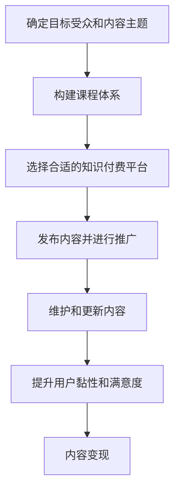

                 

# 程序员如何打造个人知识付费IP

在知识经济飞速发展的今天，个人知识付费IP（Intellectual Property）成为了一种备受关注的新兴产业。尤其是在程序员群体中，知识付费IP不仅可以提升自身影响力，还能通过内容变现获得收益。本文将从背景介绍、核心概念与联系、核心算法原理、数学模型、项目实践、应用场景、工具和资源推荐、总结与发展趋势等方面，全面解析程序员如何打造个人知识付费IP。

## 1. 背景介绍

### 1.1 问题由来
随着互联网技术的发展，知识获取和传播的成本逐渐降低，人们开始追求更加高效、精准的知识获取方式。同时，互联网的互动性、社交性也促进了知识分享和传播。程序员作为IT行业的核心力量，积累了大量的专业知识和实战经验，这些知识和经验本身就具有很高的市场价值。

### 1.2 问题核心关键点
个人知识付费IP的打造，关键在于将自身专业知识进行系统化整理、深入浅出地表达，并通过互联网平台进行传播和变现。核心步骤包括：

1. 确定目标受众和内容主题。
2. 构建课程体系，包括课程大纲、讲义、视频等。
3. 选择合适的知识付费平台，发布内容并进行推广。
4. 维护和更新内容，提升用户黏性和满意度。

### 1.3 问题研究意义
打造个人知识付费IP，对于程序员而言，具有以下几方面的意义：

1. 提升影响力：通过内容传播，吸引更多同行和用户关注，建立个人品牌。
2. 知识变现：将积累的知识和经验转化为货币收益，实现知识经济价值。
3. 技术传承：分享经验，促进技术知识的传承和普及。
4. 职业发展：通过教学反哺实战经验，提升自身的技术水平和影响力。

## 2. 核心概念与联系

### 2.1 核心概念概述

为了更好地理解如何打造个人知识付费IP，本节将介绍几个关键概念：

- **个人知识付费IP**：指程序员通过互联网平台，将自己积累的专业知识和实战经验系统化整理，并按需收费进行传播和变现的内容形式。
- **知识付费**：指以专业知识为基础，通过付费方式进行内容传播和变现的商业模式。
- **内容变现**：指将自身积累的知识和经验，通过内容创作和传播，转化为货币收益的过程。
- **知识共享**：指将专业知识无偿或低成本共享给他人的行为，旨在促进知识传播和普及。
- **内容生态**：指知识付费平台与创作者、消费者之间的互动关系，包括内容创作、传播、消费等环节。

这些概念共同构成了个人知识付费IP的核心，需要通过合理的设计和运营，实现知识变现和传播。

### 2.2 核心概念原理和架构的 Mermaid 流程图



这个流程图展示了个人知识付费IP的完整流程：

1. 确定目标受众和内容主题，是构建IP的起点。
2. 构建课程体系，包括课程大纲、讲义、视频等，是内容创作的核心。
3. 选择合适的知识付费平台，进行内容发布和推广，是内容传播的关键。
4. 维护和更新内容，提升用户黏性和满意度，是持续发展的动力。
5. 通过内容变现，实现商业价值的转化，是IP价值体现的终点。

## 3. 核心算法原理 & 具体操作步骤

### 3.1 算法原理概述

个人知识付费IP的打造，本质上是一个基于知识传播和内容变现的商业过程。核心算法原理主要包括以下几个方面：

1. **内容创作算法**：通过分析目标受众的兴趣和需求，设计课程内容和结构，确保内容具有吸引力。
2. **内容传播算法**：利用社交网络、SEO等手段，提高内容在互联网上的曝光率和传播范围。
3. **用户行为分析**：通过用户行为数据，分析课程效果和用户反馈，进行内容优化和改进。
4. **变现策略**：根据用户消费行为和市场价格，制定合理的课程定价策略，实现内容变现。

### 3.2 算法步骤详解

个人知识付费IP的打造，可以按以下步骤进行：

**Step 1: 确定目标受众和内容主题**

1. 分析市场需求，确定目标受众。可以通过调查问卷、数据分析等方式，了解潜在用户的兴趣和需求。
2. 确定内容主题，设计课程大纲。课程内容应具有系统性、实战性和实用性，涵盖技术知识、项目经验、职业规划等方面。

**Step 2: 构建课程体系**

1. 设计课程大纲，包括课程目标、内容和结构。每个章节应明确知识点、实战案例和作业任务。
2. 制作课程讲义和视频，确保内容详实、易懂。讲义应包含关键代码、实验步骤和案例分析。
3. 开发课程配套工具，如在线编程环境、作业提交系统等，提升用户体验。

**Step 3: 选择合适的知识付费平台**

1. 分析各个知识付费平台的优势和劣势，选择适合自己内容的特点和受众的平台。
2. 研究平台机制和推广策略，制定相应的内容发布和推广计划。

**Step 4: 发布内容并进行推广**

1. 上传课程到知识付费平台，进行初步发布。
2. 利用社交媒体、博客、论坛等渠道，进行内容推广和用户互动。
3. 参加线上线下活动，提升个人品牌影响力。

**Step 5: 维护和更新内容**

1. 定期更新课程内容和实验案例，保持课程的时效性和实用性。
2. 根据用户反馈，优化课程内容和教学方法。
3. 建立用户社群，提升用户黏性和满意度。

**Step 6: 内容变现**

1. 分析用户消费行为，制定合理的课程定价策略。
2. 利用平台提供的各种优惠和推广手段，提升课程销量。
3. 建立会员体系，提供专属内容和增值服务。

### 3.3 算法优缺点

个人知识付费IP的打造，具有以下优点：

1. **高效传播**：通过互联网平台，可以高效传播专业知识，覆盖更多受众。
2. **精准变现**：通过定价策略，可以实现精准变现，获得稳定的收入。
3. **提升影响力**：通过内容传播和互动，可以提升个人品牌影响力。
4. **持续发展**：通过维护和更新内容，可以实现持续发展和增值。

同时，也存在一些缺点：

1. **时间和精力投入**：内容创作和维护需要大量的时间和精力。
2. **市场竞争激烈**：知识付费市场竞争激烈，内容需要具备独特性和创新性。
3. **用户质量参差不齐**：用户群体多样，内容需兼顾不同层次的需求。
4. **知识版权问题**：需要注意课程内容的版权问题，避免侵权风险。

### 3.4 算法应用领域

个人知识付费IP不仅适用于技术类内容，还可以应用于生活、教育、管理等多个领域。例如：

- 编程技术类：包括Java、Python、前端开发等，通过课程讲授实战经验和项目案例。
- 数据分析类：包括SQL、Python数据分析、机器学习等，通过案例分析和技术讲解。
- 职业规划类：包括简历优化、面试技巧、职业发展等，通过经验和实战指导。
- 教育类：包括K12教育、家庭教育、成人教育等，通过课程讲授知识要点和解题技巧。
- 生活类：包括健康管理、心理调适、时间管理等，通过实用方法和案例分享。

## 4. 数学模型和公式 & 详细讲解 & 举例说明

### 4.1 数学模型构建

假设有一门技术课程，其收益为 $R$，内容质量为 $Q$，课程定价为 $P$，用户购买力为 $C$，平台推广力度为 $T$，则收益的数学模型为：

$$
R = P \times C \times T \times f(Q)
$$

其中 $f(Q)$ 为内容质量对收益的影响函数，需根据具体内容进行设计和优化。

### 4.2 公式推导过程

为了简化问题，假设 $f(Q)$ 为线性函数，即：

$$
f(Q) = a \times Q
$$

其中 $a$ 为比例系数，表示内容质量每增加一个单位，收益增加的倍数。则收益模型可进一步简化为：

$$
R = P \times C \times T \times a \times Q
$$

### 4.3 案例分析与讲解

以一門Java编程课程为例：

- 内容质量 $Q$：包含基础语法、高级特性、实战项目等，每章内容按难度和实用性进行打分。
- 课程定价 $P$：根据市场调研和目标受众，制定合理的课程价格。
- 用户购买力 $C$：分析目标受众的收入水平和消费习惯，合理定价。
- 平台推广力度 $T$：根据平台资源和用户反馈，制定推广策略。

通过以上分析，可以计算课程的期望收益，并根据结果进行优化和调整。

## 5. 项目实践：代码实例和详细解释说明

### 5.1 开发环境搭建

在搭建开发环境前，需要准备以下工具和软件：

1. **编程语言**：Python、JavaScript等，用于开发课程内容。
2. **知识付费平台**：如Coursera、Udemy、网易云课堂等，用于发布和推广课程。
3. **视频编辑工具**：如Adobe Premiere Pro、Final Cut Pro等，用于制作视频课程。
4. **社交媒体平台**：如微博、微信公众号、B站等，用于内容推广和用户互动。

### 5.2 源代码详细实现

以下是一个简单的Python课程发布和推广代码示例：

```python
# 定义课程信息
course_name = 'Python基础入门'
course_duration = '6个月'
course_price = 99
target_audience = '初学者'

# 选择知识付费平台
platform = 'Coursera'

# 制作课程内容
lecture1 = 'Python基础语法'
lecture2 = 'Python高级特性'
lecture3 = 'Python实战项目'

# 发布课程到知识付费平台
platform.publish(course_name, course_duration, course_price, target_audience)

# 推广课程到社交媒体平台
social_media.post(course_name, lecture1, lecture2, lecture3)

# 维护和更新课程内容
lecture1 = 'Python基础语法（优化版）'
lecture2 = 'Python高级特性（新增内容）'
lecture3 = 'Python实战项目（更新案例）'
platform.update(course_name, lecture1, lecture2, lecture3)
```

### 5.3 代码解读与分析

在实际开发中，上述代码仅为示例，具体实现还需结合实际需求进行调整。代码中包含了课程发布和推广的关键步骤：

1. **课程信息定义**：包括课程名称、时长、价格和目标受众等关键信息。
2. **平台选择**：根据内容特点和受众选择适合的付费平台。
3. **课程内容制作**：包括编写讲义、制作视频等，确保内容质量。
4. **内容发布**：将课程上传并发布到知识付费平台。
5. **社交媒体推广**：通过社交媒体平台进行课程宣传和用户互动。
6. **内容维护和更新**：定期优化和更新课程内容，提升用户满意度。

### 5.4 运行结果展示

课程发布和推广后，可以通过平台的数据统计工具，实时监控课程的销售情况和用户反馈，分析课程效果并进行优化。

## 6. 实际应用场景

### 6.1 软件开发类

软件开发类课程包括前端开发、后端开发、移动应用开发等。通过课程讲解实战项目和案例，帮助学员掌握编程技能和开发流程。

### 6.2 数据分析类

数据分析类课程包括SQL、Python数据分析、机器学习等，通过案例分析和技术讲解，帮助学员掌握数据分析工具和方法。

### 6.3 教育类

教育类课程包括K12教育、家庭教育、成人教育等，通过课程讲授知识要点和解题技巧，帮助学员提升学习效果。

### 6.4 未来应用展望

随着技术的发展，个人知识付费IP的应用场景将更加广泛：

1. **新兴技术**：如人工智能、区块链、物联网等，将有越来越多的相关课程出现。
2. **跨学科融合**：如编程+设计、编程+数学等，跨学科融合的课程将更具吸引力。
3. **个性化定制**：根据用户需求和偏好，提供定制化的课程内容，提升用户体验。
4. **在线互动**：通过实时互动和反馈机制，提升学习效果和用户满意度。

## 7. 工具和资源推荐

### 7.1 学习资源推荐

为了帮助程序员打造个人知识付费IP，以下是一些推荐的学习资源：

1. **Coursera、Udemy、网易云课堂等平台**：提供丰富的课程资源和平台推广支持。
2. **知乎、CSDN、博客园等技术社区**：分享编程经验和知识，建立个人品牌。
3. **《编程珠玑》、《重构》等经典书籍**：深入学习编程技术和思想。
4. **《黑客与画家》、《代码大全》等编程类书籍**：提升编程技能和思维能力。
5. **《程序员代码面试指南》、《LeetCode算法题解》等书籍**：掌握面试技巧和编程能力。

### 7.2 开发工具推荐

为了高效开发和推广课程，以下是一些推荐的开发工具：

1. **编程语言**：Python、JavaScript、Java等，适用于不同内容的开发。
2. **视频编辑工具**：Adobe Premiere Pro、Final Cut Pro等，用于制作视频课程。
3. **在线编程环境**：GitHub、CodePen等，提供在线编程和代码共享平台。
4. **社交媒体平台**：微博、微信公众号、B站等，用于内容推广和用户互动。
5. **数据分析工具**：Tableau、Power BI等，用于用户行为分析和课程效果评估。

### 7.3 相关论文推荐

为了深入理解个人知识付费IP的打造过程，以下是一些推荐的论文：

1. **《知识付费市场的研究与分析》**：分析知识付费市场的现状和趋势，提出未来的发展方向。
2. **《基于社交网络的课程推广策略》**：研究社交网络在课程推广中的应用，提出有效的推广策略。
3. **《课程定价策略研究》**：分析课程定价对用户购买力和收益的影响，提出合理的定价策略。
4. **《内容质量和收益关系分析》**：研究内容质量对课程收益的影响，提出提升内容质量的方法。
5. **《知识付费平台的用户行为分析》**：研究用户行为对课程效果的影响，提出提升用户满意度的策略。

## 8. 总结：未来发展趋势与挑战

### 8.1 总结

本文详细介绍了程序员如何打造个人知识付费IP的过程。从确定目标受众和内容主题，到构建课程体系、选择合适的知识付费平台、发布内容并进行推广，再到维护和更新内容、内容变现，每个步骤都进行了系统化的分析。通过实例和案例讲解，进一步展示了具体实现方法。

### 8.2 未来发展趋势

未来，个人知识付费IP将呈现以下几个发展趋势：

1. **内容多样化**：除了技术类课程，还将涌现出更多生活、教育、管理等领域的课程。
2. **个性化定制**：根据用户需求和偏好，提供定制化的课程内容，提升用户体验。
3. **跨平台运营**：通过多平台运营，扩大课程覆盖范围和用户群体。
4. **持续创新**：不断优化课程内容和技术手段，提升课程质量和用户满意度。
5. **社会责任**：将知识传播与公益相结合，促进社会知识普及和公平教育。

### 8.3 面临的挑战

尽管个人知识付费IP具有巨大的发展潜力，但也面临诸多挑战：

1. **时间和精力投入**：课程开发和维护需要大量的时间和精力。
2. **市场竞争激烈**：知识付费市场竞争激烈，内容需具备独特性和创新性。
3. **用户质量参差不齐**：用户群体多样，内容需兼顾不同层次的需求。
4. **内容版权问题**：需要注意课程内容的版权问题，避免侵权风险。
5. **技术更新迅速**：需要持续学习和更新课程内容，保持课程的时效性。

### 8.4 研究展望

为了克服上述挑战，未来的研究需要在以下几个方面进行突破：

1. **自动化开发工具**：开发智能化的课程开发工具，提升开发效率。
2. **知识图谱技术**：利用知识图谱技术，提升课程内容的系统性和连贯性。
3. **用户行为分析**：利用大数据和机器学习技术，提升用户行为分析的准确性。
4. **多模态学习**：结合图像、视频、音频等多种模态数据，提升课程的吸引力和实用性。
5. **跨学科融合**：将不同学科的知识融合，设计跨学科的课程内容，提升课程的创新性。

这些研究方向的探索，将进一步推动个人知识付费IP的发展，为程序员提供更广阔的发展空间。

## 9. 附录：常见问题与解答

**Q1: 如何确定目标受众和内容主题？**

A: 通过市场调研和数据分析，了解潜在用户的兴趣和需求，确定目标受众。同时，分析自身技术优势和兴趣，确定内容主题，设计课程大纲。

**Q2: 课程内容应该如何设计？**

A: 课程内容应具有系统性、实战性和实用性，涵盖技术知识、项目经验、职业规划等方面。每个章节应明确知识点、实战案例和作业任务。

**Q3: 如何选择知识付费平台？**

A: 分析各个知识付费平台的优势和劣势，选择适合自己内容的特点和受众的平台。研究平台机制和推广策略，制定相应的内容发布和推广计划。

**Q4: 如何推广课程？**

A: 利用社交媒体、博客、论坛等渠道，进行内容推广和用户互动。参加线上线下活动，提升个人品牌影响力。

**Q5: 如何维护和更新课程内容？**

A: 定期更新课程内容和实验案例，保持课程的时效性和实用性。根据用户反馈，优化课程内容和教学方法。

**Q6: 如何制定合理的课程定价策略？**

A: 分析用户消费行为和市场价格，制定合理的课程定价策略。利用平台提供的各种优惠和推广手段，提升课程销量。

通过以上问题与解答，希望能帮助更多程序员成功打造个人知识付费IP，实现技术知识和经济价值的双赢。

---

作者：禅与计算机程序设计艺术 / Zen and the Art of Computer Programming

