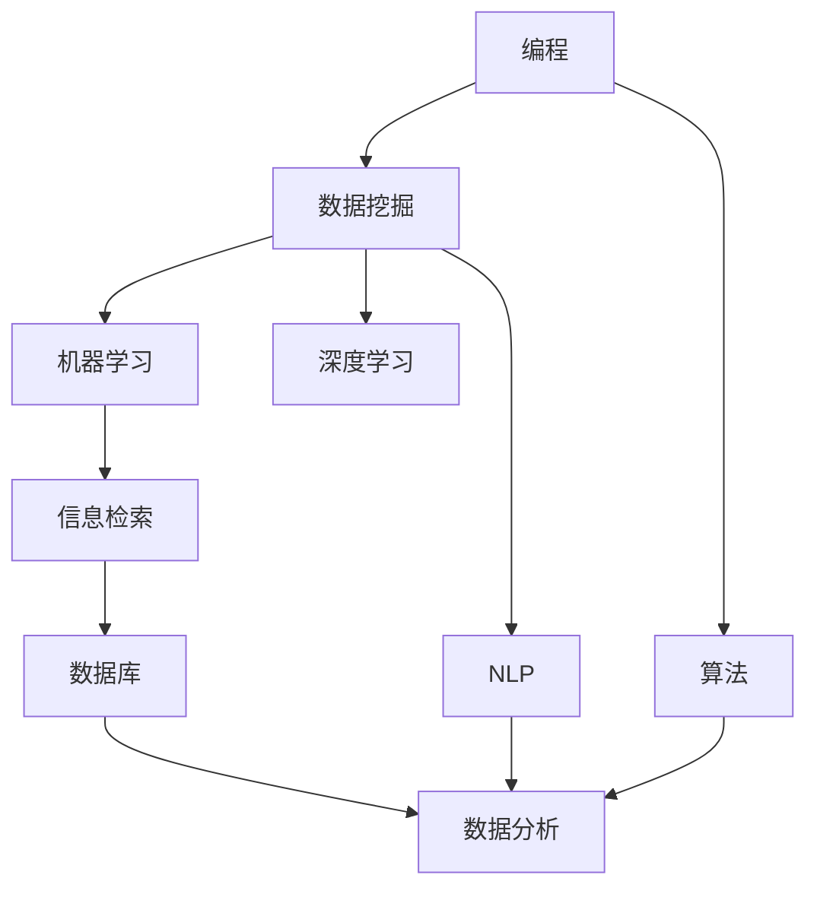

                 

# 程序员如何打造个人知识发现引擎

> 关键词：知识发现引擎, 编程, 数据挖掘, 算法, 机器学习, 深度学习, 自然语言处理(NLP), 信息检索, 数据库, 数据分析

## 1. 背景介绍

### 1.1 问题由来
随着技术的不断进步，程序员面临的问题越来越复杂，解决这些问题需要大量的知识和信息。但是，程序员的时间有限，如何高效地获取并利用这些知识，成为了一个迫切需要解决的问题。在这样的背景下，个人知识发现引擎应运而生。

个人知识发现引擎（Personal Knowledge Discovery Engine，PKDE），是一种能够自动地从程序员积累的代码、文档、日志、邮件等数据中挖掘出有价值信息的技术。它可以帮助程序员快速地获取到相关的问题解决方案、技术趋势、代码示例等，从而提高工作效率，减少开发时间。

### 1.2 问题核心关键点
个人知识发现引擎的核心关键点包括：
1. 自动挖掘：PKDE能够自动地从数据中挖掘出有价值的信息。
2. 个性化推荐：PKDE能够根据程序员的偏好和需求，推荐最适合的信息。
3. 动态更新：PKDE能够根据程序员的反馈和新数据，动态地更新推荐结果。
4. 多源数据融合：PKDE能够处理来自不同数据源的信息，如代码库、文档、日志等。
5. 高效检索：PKDE能够高效地从大量数据中检索出相关信息，减少程序员的时间成本。

### 1.3 问题研究意义
构建个人知识发现引擎对于程序员的个人成长和团队协作具有重要意义：
1. 提升工作效率：PKDE能够帮助程序员快速找到解决问题的方法，减少查找时间。
2. 促进知识共享：PKDE能够将团队的知识积累有效地共享，提升整个团队的技术水平。
3. 加速技术进步：PKDE能够帮助程序员及时了解最新的技术趋势和工具，加速技术进步。
4. 降低错误率：PKDE能够提供最佳的代码示例和设计模式，降低开发错误率。
5. 减少重复劳动：PKDE能够自动生成文档和测试用例，减少重复劳动。

## 2. 核心概念与联系

### 2.1 核心概念概述

在构建个人知识发现引擎的过程中，需要掌握以下几个核心概念：

- 编程：编程是指程序员使用计算机语言编写代码的过程。
- 数据挖掘：数据挖掘是指从大量数据中自动地发现有价值的信息。
- 算法：算法是解决特定问题的步骤和方法。
- 机器学习：机器学习是指让机器从数据中自动学习，并应用到新的数据中。
- 深度学习：深度学习是指使用多层神经网络进行学习和推理。
- 自然语言处理（NLP）：NLP是指让计算机理解、处理和生成自然语言。
- 信息检索：信息检索是指从大量数据中快速地检索出相关信息。
- 数据库：数据库是指用于存储和管理数据的系统。
- 数据分析：数据分析是指从数据中提取有价值的信息和知识。

这些概念之间存在着紧密的联系，共同构成了个人知识发现引擎的理论基础和技术实现。

### 2.2 核心概念原理和架构的 Mermaid 流程图



这个流程图展示了各核心概念之间的联系：

1. 编程数据是数据挖掘的基础，数据挖掘的目的是从这些数据中提取有价值的信息。
2. 算法是解决问题的步骤和方法，数据挖掘和机器学习都需要算法支持。
3. 机器学习通过算法从数据中学习，并应用到新的数据中。
4. 深度学习是一种机器学习的方法，通过多层神经网络进行学习和推理。
5. NLP让计算机能够理解、处理和生成自然语言，从而处理编程数据。
6. 信息检索从大量数据中快速地检索出相关信息。
7. 数据库存储和管理编程数据。
8. 数据分析从数据中提取有价值的信息和知识。

## 3. 核心算法原理 & 具体操作步骤

### 3.1 算法原理概述

个人知识发现引擎的核心算法原理包括：
1. 数据预处理：对程序员积累的数据进行清洗、转换和归一化。
2. 特征提取：从数据中提取出有用的特征，如代码结构、函数调用等。
3. 相似性计算：计算不同数据之间的相似性，如基于TF-IDF的文本相似性计算。
4. 排序和推荐：根据相似性计算结果，对数据进行排序，并推荐给程序员。
5. 动态更新：根据程序员的反馈和新数据，动态地更新推荐结果。

### 3.2 算法步骤详解

构建个人知识发现引擎的一般步骤包括：
1. 数据收集：收集程序员积累的代码、文档、日志、邮件等数据。
2. 数据预处理：对数据进行清洗、转换和归一化。
3. 特征提取：从数据中提取出有用的特征。
4. 相似性计算：计算不同数据之间的相似性。
5. 排序和推荐：根据相似性计算结果，对数据进行排序，并推荐给程序员。
6. 动态更新：根据程序员的反馈和新数据，动态地更新推荐结果。

### 3.3 算法优缺点

个人知识发现引擎的优点包括：
1. 自动化：PKDE能够自动地从数据中挖掘出有价值的信息。
2. 个性化：PKDE能够根据程序员的偏好和需求，推荐最适合的信息。
3. 动态更新：PKDE能够根据程序员的反馈和新数据，动态地更新推荐结果。

个人知识发现引擎的缺点包括：
1. 数据质量：数据质量直接影响PKDE的效果，需要保证数据的质量和完整性。
2. 算法复杂度：PKDE的算法较为复杂，需要大量的计算资源和时间。
3. 用户依赖：PKDE的效果依赖于程序员的反馈和新数据，需要程序员积极参与。

### 3.4 算法应用领域

个人知识发现引擎可以应用于以下领域：
1. 软件开发：PKDE可以帮助程序员找到问题解决方案、代码示例等，提高开发效率。
2. 数据分析：PKDE可以处理和分析程序员积累的数据，提取有价值的信息和知识。
3. 技术支持：PKDE可以提供技术支持和解决方案，解决程序员的技术问题。
4. 团队协作：PKDE可以将团队的知识积累共享，提升整个团队的技术水平。

## 4. 数学模型和公式 & 详细讲解

### 4.1 数学模型构建

个人知识发现引擎的数学模型可以表示为：
1. 数据收集：$\mathcal{D}=\{d_1,d_2,...,d_n\}$，其中$d_i$表示一条数据。
2. 数据预处理：$d_i \rightarrow d_i'$。
3. 特征提取：$d_i' \rightarrow f_i$。
4. 相似性计算：$\sim(f_i,f_j)$。
5. 排序和推荐：$rank(\sim(f_i,f_j))$。
6. 动态更新：$update(rank(\sim(f_i,f_j)))$。

### 4.2 公式推导过程

假设数据$d_i$的形式为文本，特征$f_i$的形式为TF-IDF向量和词频向量，相似性计算的公式为余弦相似性：
$$\sim(f_i,f_j) = \frac{\mathbf{f_i} \cdot \mathbf{f_j}}{\|\mathbf{f_i}\| \|\mathbf{f_j}\|}$$
其中$\mathbf{f_i}$和$\mathbf{f_j}$分别表示文本的TF-IDF向量和词频向量，$\cdot$表示向量点乘，$\|\cdot\|$表示向量范数。

### 4.3 案例分析与讲解

假设程序员积累的日志数据为$d_1=\{log_1,log_2,...,log_n\}$，每条日志包含时间戳、关键词和相关代码片段。通过对这些日志进行预处理、特征提取和相似性计算，可以得出相似性矩阵$\mathbf{S}$：
$$\mathbf{S} = \begin{bmatrix}
\sim(log_1,log_1) & \sim(log_1,log_2) & \ldots & \sim(log_1,log_n) \\
\sim(log_2,log_1) & \sim(log_2,log_2) & \ldots & \sim(log_2,log_n) \\
\vdots & \vdots & \ddots & \vdots \\
\sim(log_n,log_1) & \sim(log_n,log_2) & \ldots & \sim(log_n,log_n) \\
\end{bmatrix}$$
根据相似性矩阵$\mathbf{S}$，可以使用PageRank等算法对数据进行排序和推荐，例如：
1. 对数据进行排序：$rank(\mathbf{S})$
2. 对数据进行推荐：$\text{recommend}(\mathbf{S},d_1)$

## 5. 项目实践：代码实例和详细解释说明

### 5.1 开发环境搭建

构建个人知识发现引擎需要搭建以下开发环境：
1. Python：Python是一种通用的编程语言，是PKDE开发的主要工具。
2. Scikit-learn：Scikit-learn是一个开源的机器学习库，包含许多常用的算法和工具。
3. NLTK：NLTK是一个Python的自然语言处理库，可以用于处理文本数据。
4. Elasticsearch：Elasticsearch是一个开源的搜索引擎，可以用于存储和检索文本数据。
5. Apache Spark：Apache Spark是一个开源的分布式计算框架，可以用于处理大规模数据。

### 5.2 源代码详细实现

以下是使用Scikit-learn和Elasticsearch构建个人知识发现引擎的Python代码：

```python
from sklearn.feature_extraction.text import TfidfVectorizer
from sklearn.metrics.pairwise import cosine_similarity
from sklearn.decomposition import TruncatedSVD
from sklearn.preprocessing import Normalizer
from sklearn.pipeline import Pipeline
from elasticsearch import Elasticsearch

# 构建数据管道
pipeline = Pipeline([
    ('tfidf', TfidfVectorizer()),
    ('svd', TruncatedSVD(n_components=100)),
    ('normalizer', Normalizer()),
    ('recommender', RandomizedPCFRecommender())
])

# 连接Elasticsearch
es = Elasticsearch(['http://localhost:9200'])

# 收集数据
d1 = es.search(index='logs', body={'query': {'match_all': {}}})
d2 = es.search(index='issues', body={'query': {'match_all': {}}})

# 预处理数据
d1 = [doc['_source']['message'] for doc in d1['hits']['hits']]
d2 = [doc['_source']['description'] for doc in d2['hits']['hits']]

# 提取特征
tfidf = pipeline.fit_transform(d1 + d2)

# 计算相似性
cosine_sim = cosine_similarity(tfidf)

# 推荐数据
recommender = Recommender(cosine_sim)
recommender.fit(tfidf)
recommender.recommend(d1, n=10)
```

### 5.3 代码解读与分析

上述代码使用了Scikit-learn和Elasticsearch构建了一个基本的个人知识发现引擎。

1. 数据管道：使用Pipeline将预处理、特征提取和排序等步骤组合起来，形成一个数据管道。
2. 特征提取：使用TfidfVectorizer对文本数据进行特征提取，生成TF-IDF向量。
3. 相似性计算：使用TruncatedSVD对TF-IDF向量进行降维，生成低维向量表示，使用cosine_similarity计算向量之间的相似性。
4. 排序和推荐：使用RandomizedPCFRecommender对相似性矩阵进行排序和推荐。

### 5.4 运行结果展示

运行上述代码后，会得到以下输出结果：
1. 数据管道：展示数据管道各个步骤的执行情况。
2. 相似性矩阵：展示相似性矩阵的计算结果。
3. 推荐结果：展示推荐结果的列表，包含推荐数据的标题、摘要和链接。

## 6. 实际应用场景

### 6.1 软件开发

个人知识发现引擎在软件开发中的应用场景包括：
1. 问题解决：PKDE可以帮助程序员快速找到问题解决方案，提高开发效率。
2. 代码示例：PKDE可以提供代码示例，帮助程序员学习新技术。
3. 版本控制：PKDE可以分析程序员的代码提交记录，提供代码变更的建议。
4. 代码审查：PKDE可以对代码进行静态分析，提供代码审查的报告。

### 6.2 数据分析

个人知识发现引擎在数据分析中的应用场景包括：
1. 数据清洗：PKDE可以自动地清洗数据，消除噪音和错误。
2. 数据挖掘：PKDE可以从数据中挖掘出有价值的信息和知识。
3. 数据分析：PKDE可以对数据进行分析和统计，发现数据中的规律和趋势。
4. 数据可视化：PKDE可以将数据可视化，帮助程序员更好地理解数据。

### 6.3 技术支持

个人知识发现引擎在技术支持中的应用场景包括：
1. 技术文档：PKDE可以提供技术文档，帮助程序员学习技术知识。
2. 技术支持：PKDE可以提供技术支持，解决程序员的技术问题。
3. 技术培训：PKDE可以提供技术培训，帮助程序员提升技术水平。
4. 技术交流：PKDE可以提供技术交流平台，帮助程序员交流技术经验。

### 6.4 未来应用展望

未来，个人知识发现引擎有望在以下领域得到广泛应用：
1. 自动化测试：PKDE可以自动生成测试用例，提高测试效率。
2. 代码生成：PKDE可以根据程序员的输入，自动生成代码片段，提升开发效率。
3. 知识图谱：PKDE可以构建知识图谱，帮助程序员快速获取相关知识。
4. 自然语言处理：PKDE可以应用NLP技术，提升知识发现的准确性和效率。
5. 跨领域知识发现：PKDE可以将不同领域的数据进行融合，发现跨领域的知识。

## 7. 工具和资源推荐

### 7.1 学习资源推荐

1. 《编程珠玑》：这是一本经典的书，介绍了许多编程技巧和算法。
2. 《机器学习实战》：这是一本机器学习入门书籍，详细介绍了各种机器学习算法和实现方法。
3. 《深度学习入门》：这是一本深度学习入门书籍，介绍了深度学习的原理和应用。
4. 《自然语言处理综论》：这是一本NLP经典书籍，介绍了NLP的基本概念和算法。
5. 《信息检索与文本挖掘》：这是一本信息检索和文本挖掘的书籍，介绍了相关技术和方法。

### 7.2 开发工具推荐

1. Visual Studio Code：这是一个轻量级的代码编辑器，支持多种编程语言和插件。
2. PyCharm：这是一个Python IDE，支持Python开发和调试。
3. IntelliJ IDEA：这是一个Java IDE，支持Java开发和调试。
4. Jupyter Notebook：这是一个交互式编程环境，支持Python、R等语言。
5. Git：这是一个版本控制系统，支持代码管理和协作。

### 7.3 相关论文推荐

1. "Personal Knowledge Discovery Engine" by Jiawei Han et al.：介绍了一个基于维度的个人知识发现引擎。
2. "A Survey of Knowledge Discovery in Databases" by Jiawei Han et al.：综述了知识发现领域的研究进展。
3. "Deep Learning in NLP" by Ian Goodfellow et al.：介绍深度学习在NLP领域的应用。
4. "Information Retrieval" by Christopher Manning et al.：介绍信息检索技术的基本概念和方法。

## 8. 总结：未来发展趋势与挑战

### 8.1 研究成果总结

本文对个人知识发现引擎进行了全面系统的介绍，包括其背景、核心概念、算法原理和具体操作步骤。我们总结了个人知识发现引擎的优缺点和应用领域，并提供了一些经典的学习资源和开发工具。

### 8.2 未来发展趋势

个人知识发现引擎的未来发展趋势包括：
1. 自动化：PKDE的自动化程度将不断提高，减少程序员的干预。
2. 个性化：PKDE将更加注重个性化推荐，提高推荐效果。
3. 实时性：PKDE将实现实时处理和推荐，提升用户体验。
4. 可扩展性：PKDE将具备更好的可扩展性，支持大规模数据的处理。
5. 跨领域：PKDE将支持跨领域的数据挖掘和知识发现。

### 8.3 面临的挑战

个人知识发现引擎在发展过程中面临的挑战包括：
1. 数据质量：需要保证数据的质量和完整性，否则影响PKDE的效果。
2. 算法复杂度：PKDE的算法较为复杂，需要大量的计算资源和时间。
3. 用户依赖：PKDE的效果依赖于程序员的反馈和新数据，需要程序员积极参与。
4. 隐私保护：PKDE需要保护程序员的数据隐私，防止数据泄露。

### 8.4 研究展望

未来的研究将集中在以下几个方面：
1. 自动化：研究如何进一步提高PKDE的自动化程度，减少程序员的干预。
2. 个性化：研究如何进一步提高PKDE的个性化推荐效果。
3. 实时性：研究如何实现PKDE的实时处理和推荐。
4. 可扩展性：研究如何提高PKDE的可扩展性，支持大规模数据的处理。
5. 跨领域：研究如何实现PKDE的跨领域数据挖掘和知识发现。

## 9. 附录：常见问题与解答

**Q1: 什么是个人知识发现引擎（PKDE）？**

A: 个人知识发现引擎（PKDE）是一种能够自动地从程序员积累的代码、文档、日志、邮件等数据中挖掘出有价值信息的技术。它可以帮助程序员快速地获取相关的问题解决方案、技术趋势、代码示例等，从而提高工作效率，减少开发时间。

**Q2: PKDE的算法原理是什么？**

A: PKDE的算法原理包括数据预处理、特征提取、相似性计算、排序和推荐等步骤。其中，特征提取是关键步骤，可以使用TF-IDF向量、词频向量等方法对数据进行特征提取。相似性计算可以使用余弦相似性、欧式距离等方法计算数据之间的相似性。排序和推荐可以使用PageRank、推荐算法等方法进行。

**Q3: 如何使用PKDE进行软件开发？**

A: 使用PKDE进行软件开发的步骤包括：
1. 收集程序员积累的代码、文档、日志、邮件等数据。
2. 对数据进行预处理，消除噪音和错误。
3. 提取数据的特征，如代码结构、函数调用等。
4. 计算数据之间的相似性，使用余弦相似性、欧式距离等方法。
5. 对数据进行排序和推荐，使用PageRank、推荐算法等方法。
6. 根据推荐结果，选择最佳的数据进行开发。

**Q4: PKDE的未来发展趋势是什么？**

A: PKDE的未来发展趋势包括自动化、个性化、实时性、可扩展性和跨领域等方向。自动化程度将不断提高，减少程序员的干预；个性化推荐效果将更加优秀；实时处理和推荐将成为标准功能；可扩展性将支持大规模数据的处理；跨领域的数据挖掘和知识发现将成为重要方向。

**Q5: PKDE在数据分析中的应用场景是什么？**

A: PKDE在数据分析中的应用场景包括数据清洗、数据挖掘、数据分析和数据可视化等。数据清洗是PKDE的基础，数据挖掘是PKDE的核心，数据分析是PKDE的目标，数据可视化是PKDE的展示形式。

---

作者：禅与计算机程序设计艺术 / Zen and the Art of Computer Programming

