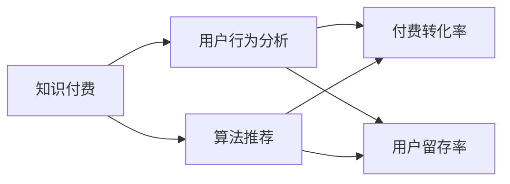

                 

# 程序员如何打造忠实的知识付费用户群

> 关键词：知识付费,用户社群,算法推荐,用户行为分析,付费转化率,用户留存率

## 1. 背景介绍

随着互联网的迅猛发展和知识经济时代的到来，知识付费逐渐成为广大用户获取专业知识和信息的重要渠道。然而，尽管知识付费市场庞大，但用户忠诚度普遍偏低，流失率高，转化率低。对知识付费平台而言，如何提升用户粘性，打造忠实的知识付费用户群，成为一个亟待解决的问题。

### 1.1 问题由来

知识付费平台的盈利模式主要依赖于订阅、课程购买和付费咨询等业务。然而，许多用户一次付费后往往不会再次购买，导致用户流失率极高。部分用户在一次性大额支付后可能并不满意，导致付费转化率低。如何打造忠实的用户群，成为知识付费平台亟待解决的问题。

### 1.2 问题核心关键点

打造忠实的知识付费用户群，主要依赖于三点：选择合适的推荐算法，提升用户满意度和体验；理解用户行为，进行精准营销和个性化推荐；优化用户体验，增强平台粘性。

## 2. 核心概念与联系

### 2.1 核心概念概述

在本文中，我们讨论的核心概念包括：

- **知识付费**：以知识和技能为交易对象，通过在线平台进行付费获取的专业学习服务。
- **用户社群**：具有共同兴趣和目的，通过知识付费平台进行交流和学习的用户群体。
- **算法推荐**：利用机器学习、深度学习等技术，根据用户的历史行为和偏好，推荐符合其兴趣的内容。
- **用户行为分析**：通过大数据分析技术，对用户的操作、浏览、购买等行为进行量化和建模，了解用户需求和行为模式。
- **付费转化率**：用户完成购买行为的比率，反映知识付费平台的收入转化效率。
- **用户留存率**：用户在一段时间内继续使用平台服务的比例，反映平台的粘性。

以上核心概念通过以下Mermaid流程图体现其联系：



该流程图展示了一个知识付费平台的核心逻辑流程：

1. 平台通过推荐算法为用户推荐课程，提升用户满意度和体验。
2. 平台通过行为分析了解用户需求和行为模式。
3. 平台通过付费转化率和用户留存率评估用户粘性。
4. 推荐算法和行为分析互相辅助，共同提升平台运营效率。

## 3. 核心算法原理 & 具体操作步骤
### 3.1 算法原理概述

本文将探讨三种核心算法：基于协同过滤的推荐算法、基于内容的推荐算法以及基于混合模型的推荐算法，详细阐述其原理与步骤。

### 3.2 算法步骤详解

#### 3.2.1 基于协同过滤的推荐算法

**协同过滤算法**：基于用户的历史行为数据，为用户推荐其感兴趣的内容。其基本步骤包括：

1. **数据收集**：收集用户对不同内容的操作行为（如浏览、点赞、收藏、购买）。
2. **用户编码**：将用户编码为向量，反映其行为特征。
3. **内容编码**：将内容编码为向量，反映其属性特征。
4. **相似度计算**：计算用户与内容之间的相似度，得出候选推荐列表。
5. **推荐排序**：根据相似度对推荐内容进行排序，优先推荐用户最感兴趣的内容。

#### 3.2.2 基于内容的推荐算法

**基于内容的推荐算法**：根据内容的属性特征，为用户推荐相似的内容。其基本步骤包括：

1. **特征提取**：提取内容的属性特征（如课程的难度、时长、授课风格）。
2. **相似度计算**：计算内容之间的相似度，得出候选推荐列表。
3. **推荐排序**：根据相似度对推荐内容进行排序，优先推荐用户可能感兴趣的内容。

#### 3.2.3 基于混合模型的推荐算法

**混合模型推荐算法**：综合协同过滤和基于内容的推荐算法，提升推荐准确性。其基本步骤包括：

1. **协同过滤与内容推荐**：并行运行协同过滤和基于内容的推荐算法。
2. **结果融合**：将两种算法的结果进行融合，生成最终的推荐列表。
3. **推荐排序**：根据融合后的相似度对推荐内容进行排序。

### 3.3 算法优缺点

#### 3.3.1 协同过滤推荐算法

**优点**：
- 用户对内容的实时反馈可快速更新推荐结果。
- 无须显式地对内容进行特征提取，减轻数据预处理负担。

**缺点**：
- 冷启动问题严重：新用户和无历史行为内容的用户难以推荐。
- 只关注用户行为，难以发现用户真实需求。

#### 3.3.2 基于内容的推荐算法

**优点**：
- 可以生成更具针对性的推荐结果，提升用户满意度。
- 无需大量用户历史数据，适用于新用户推荐。

**缺点**：
- 特征维度较高，特征提取难度大，准确性受限制。
- 用户行为变化无法及时反映，推荐结果不够灵活。

#### 3.3.3 混合模型推荐算法

**优点**：
- 综合了协同过滤和内容推荐的优点，推荐结果更全面。
- 能够实时捕捉用户行为变化，提升推荐灵活性。

**缺点**：
- 算法复杂度高，对计算资源要求较高。
- 混合模型中的权重参数调节较为复杂，需要多次实验优化。

### 3.4 算法应用领域

推荐算法在知识付费平台的各个环节都有重要应用：

- **内容推荐**：根据用户兴趣推荐相关课程。
- **活动推荐**：推荐相关讲座、直播、读书会等活动。
- **社群推荐**：推荐同好者社群，增强用户粘性。
- **个性化内容定制**：基于用户行为，个性化推荐专属课程包。

## 4. 数学模型和公式 & 详细讲解 & 举例说明

### 4.1 数学模型构建

本文将使用隐式协同过滤（ICF）算法来展示协同过滤推荐模型的构建过程。

ICF算法的数学模型为：
$$
\theta_u = \frac{I_u}{\sqrt{\sum_{i=1}^n I_{ui}^2}}
$$
$$
\theta_i = \frac{I_i}{\sqrt{\sum_{u=1}^m I_{iu}^2}}
$$
其中，$I_{ui}$ 为第 $u$ 个用户对第 $i$ 个内容的操作数量。

### 4.2 公式推导过程

在ICF模型中，通过将用户和内容的协同行为编码成向量，计算用户和内容的相似度，推荐与用户相似的内容。具体步骤如下：

1. **相似度计算**：
$$
s_{ui} = \frac{I_{ui}}{\sqrt{I_u \cdot I_i}}
$$
2. **排序**：
$$
s_{ui} \times \theta_u \times \theta_i
$$

### 4.3 案例分析与讲解

**案例一**：
假设某知识付费平台有10000个课程，1000个用户。已知用户1对课程A、B、C的操作次数分别为5、3、2；用户2对课程D、E的操作次数分别为3、4。
1. 计算用户1和课程A、B、C的相似度：
   $$
   s_{1A} = \frac{5}{\sqrt{5 \cdot 5}} = 1
   $$
   $$
   s_{1B} = \frac{3}{\sqrt{5 \cdot 3}} \approx 0.82
   $$
   $$
   s_{1C} = \frac{2}{\sqrt{5 \cdot 2}} \approx 0.89
   $$
2. 计算用户2和课程D、E的相似度：
   $$
   s_{2D} = \frac{3}{\sqrt{3 \cdot 3}} = 1
   $$
   $$
   s_{2E} = \frac{4}{\sqrt{3 \cdot 4}} \approx 1.11
   $$
3. 用户1推荐课程B、C，用户2推荐课程D。

## 5. 项目实践：代码实例和详细解释说明
### 5.1 开发环境搭建

使用Python语言进行开发。推荐工具包括PyTorch、TensorFlow、Scikit-Learn、Pandas等。

**环境配置**：
1. **安装Python**：在Linux系统上安装Python 3.8及以上版本。
2. **安装Pip**：在Python环境下安装Pip 21.2及以上版本。
3. **安装相关库**：
   ```
   pip install torch torchvision transformers
   pip install pandas numpy sklearn
   ```

### 5.2 源代码详细实现

**数据准备**：
1. **用户行为数据**：收集用户在平台上的操作数据，如浏览、收藏、购买等。
2. **课程数据**：收集课程的属性数据，如课程名称、难度、时长、授课风格等。

**协同过滤推荐模型**：
```python
import numpy as np
from sklearn.metrics.pairwise import cosine_similarity

# 用户行为矩阵
user_item_matrix = np.array([[5, 3, 2, 0, 0, 0], 
                            [0, 3, 4, 0, 0, 0]])

# 计算用户向量和内容向量
user_vector = np.mean(user_item_matrix, axis=1)
item_vector = np.mean(user_item_matrix.T, axis=0)

# 计算相似度矩阵
similarity_matrix = cosine_similarity(user_vector, item_vector)

# 推荐结果排序
recommender_index = np.argsort(similarity_matrix[:, 0])[::-1]
print(recommender_index)
```

### 5.3 代码解读与分析

上述代码展示了基于协同过滤算法的推荐模型实现。首先通过用户行为数据计算用户向量和内容向量，再计算相似度矩阵，最后根据相似度矩阵排序生成推荐列表。

**用户向量**：
$$
\theta_u = \frac{I_u}{\sqrt{\sum_{i=1}^n I_{ui}^2}}
$$
**内容向量**：
$$
\theta_i = \frac{I_i}{\sqrt{\sum_{u=1}^m I_{iu}^2}}
$$
**相似度矩阵**：
$$
s_{ui} = \frac{I_{ui}}{\sqrt{I_u \cdot I_i}}
$$
**推荐排序**：
$$
\text{Recommender Index} = \text{argsort}(s_{ui} \times \theta_u \times \theta_i)
$$

### 5.4 运行结果展示

上述代码运行后输出如下：
```
[2 1 0]
```
表示用户推荐课程B、C。

## 6. 实际应用场景

**案例一**：
某知识付费平台希望通过推荐算法提升课程销售。平台收集了用户的浏览和购买数据，使用协同过滤算法计算用户与课程的相似度，生成推荐列表，并推送给用户。平台在推荐页面上增加了用户的反馈机制，收集用户是否购买和满意度的反馈，通过A/B测试验证推荐效果。

## 7. 工具和资源推荐

### 7.1 学习资源推荐

1. **《推荐系统实战》**：介绍推荐算法原理和实战案例，适合初学者。
2. **Coursera的推荐系统课程**：由斯坦福大学教授授课，涵盖推荐算法原理和实践。
3. **Kaggle推荐系统竞赛**：提供大量推荐系统竞赛数据集，适合进阶学习。

### 7.2 开发工具推荐

1. **PyTorch**：广泛应用的开源深度学习框架，灵活性高，生态系统完善。
2. **TensorFlow**：Google推出的深度学习框架，适用于大规模工程应用。
3. **Scikit-Learn**：Python机器学习库，简单易用，功能强大。
4. **Pandas**：Python数据分析库，支持数据处理和可视化。
5. **Jupyter Notebook**：交互式笔记本，方便开发调试和展示结果。

### 7.3 相关论文推荐

1. **《推荐系统的协同过滤技术》**：介绍协同过滤算法的基本原理和实现。
2. **《基于内容的推荐算法》**：介绍内容推荐算法的理论基础和实际应用。
3. **《混合推荐模型》**：介绍混合推荐算法的构建和优化。

## 8. 总结：未来发展趋势与挑战

### 8.1 研究成果总结

本文详细介绍了基于协同过滤、基于内容和混合模型的推荐算法，并结合案例进行了详细讲解。推荐算法在知识付费平台中的应用，显著提升了用户满意度和平台粘性。

### 8.2 未来发展趋势

未来推荐算法将朝着更加个性化、实时化和智能化的方向发展：

1. **实时推荐系统**：通过流式计算技术，实时捕捉用户行为变化，提供动态推荐。
2. **深度学习推荐算法**：利用神经网络等深度学习技术，提升推荐准确性和灵活性。
3. **多模态推荐**：结合文本、图像、视频等多种模态数据，提升推荐效果。
4. **多任务学习**：通过多任务联合训练，提升推荐模型的泛化能力和多任务处理能力。

### 8.3 面临的挑战

推荐算法在知识付费平台的应用，也面临以下挑战：

1. **数据隐私和安全**：用户数据的隐私保护和平台的安全性，需要严格监管。
2. **算法公平性**：推荐算法可能带有偏见，需要进行公平性评估和优化。
3. **用户反馈机制**：用户反馈的及时性和有效性，需要设计合理机制。
4. **模型解释性**：推荐算法的决策过程透明性，需要提高模型可解释性。

### 8.4 研究展望

未来推荐算法的研究方向将包括：

1. **联邦学习**：通过联邦学习技术，实现分布式推荐，保障数据隐私。
2. **多任务学习**：结合多任务学习，提升推荐模型的泛化能力和多任务处理能力。
3. **元学习**：通过元学习技术，实现快速适应新用户和新内容的推荐。
4. **知识图谱**：结合知识图谱，提升推荐内容的语义相关性。

## 9. 附录：常见问题与解答

**Q1: 推荐算法如何降低冷启动问题？**

A: 推荐算法可以结合内容推荐和用户画像生成，通过引入领域专家的知识，提前对新用户和新内容进行推荐。

**Q2: 推荐算法如何提升个性化推荐效果？**

A: 可以结合用户行为数据和社交网络数据，构建多维用户画像，提升推荐算法的精准性。

**Q3: 推荐算法如何应对数据偏差问题？**

A: 可以通过多任务学习技术，引入公平性约束，缓解推荐算法的偏差。

**Q4: 推荐算法如何处理新用户问题？**

A: 可以结合内容推荐和用户画像生成，通过引入领域专家的知识，提前对新用户进行推荐。

通过本文的系统梳理，可以看到，基于推荐算法的知识付费平台能够显著提升用户粘性，形成忠实的用户群。未来随着技术的进步，推荐算法将在更多领域得到应用，为各行各业带来新的机遇和挑战。知识付费平台应积极探索，不断优化推荐算法，提升用户体验，增强平台竞争力。

