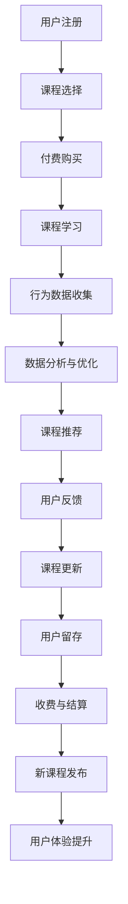

                 

# 程序员如何打造知识付费的订阅模式

## 1. 背景介绍

在信息爆炸的时代，知识付费逐渐成为一种新的消费趋势。对于程序员而言，学习新技术、掌握新工具是他们持续进步的重要途径。通过知识付费订阅模式，程序员可以在固定的时间和费用下，获取高质量的在线课程和资源，更好地提升自身竞争力。本文将探讨如何通过技术手段，打造一套高效、易用的知识付费订阅系统，为程序员提供有价值的在线学习体验。

## 2. 核心概念与联系

### 2.1 核心概念概述

- **知识付费订阅模式**：用户通过定期支付费用，获取平台提供的专业课程和资源，以提升职业技能。
- **在线学习平台**：利用互联网技术搭建的学习资源共享平台，支持用户在线观看视频、阅读文章、进行互动等。
- **课程编排与推荐**：根据用户兴趣和行为数据，自动推荐相关课程，提高学习效率。
- **付费模式与激励机制**：通过多种付费方式（如包月、包年、按需购买等），鼓励用户持续订阅，并设计合理的激励机制，提高用户粘性。
- **数据分析与优化**：利用大数据分析技术，对用户行为和课程效果进行监控和优化，不断提升学习体验。

这些核心概念共同构成了知识付费订阅系统的框架，使得程序员可以方便地获取有价值的学习资源，同时也为平台运营商提供了持续的收入来源。

### 2.2 核心概念原理和架构的 Mermaid 流程图(Mermaid 流程节点中不要有括号、逗号等特殊字符)



## 3. 核心算法原理 & 具体操作步骤

### 3.1 算法原理概述

知识付费订阅模式的算法原理主要包括以下几个方面：

1. **用户行为分析**：通过用户的行为数据（如浏览记录、点击率、学习时间等），分析用户的兴趣和需求，以指导课程推荐。
2. **课程推荐算法**：基于协同过滤、内容推荐、用户画像等技术，实现课程的个性化推荐，提高用户满意度。
3. **订阅策略设计**：设计合理的订阅包和付费策略，吸引用户长期订阅，同时保证平台的盈利能力。
4. **学习效果评估**：通过学习成果测试、用户评价等方式，评估课程效果，及时调整优化课程内容和教学方法。
5. **数据分析与优化**：利用机器学习和大数据技术，对用户行为和课程效果进行深入分析，优化用户体验和学习效果。

### 3.2 算法步骤详解

1. **用户注册与认证**：用户通过手机号或第三方账号进行注册，完成身份认证。
2. **课程选择与购买**：用户在课程页面选择感兴趣的课程，并进行购买。
3. **课程学习与互动**：用户在线观看视频、阅读文章，参与讨论，获取学习资源。
4. **行为数据收集与分析**：平台收集用户的学习行为数据，如观看时长、学习进度、答题情况等，进行分析。
5. **课程推荐与更新**：基于用户行为数据和市场趋势，进行课程推荐，并根据用户反馈进行课程更新。
6. **用户留存与激励**：设计积分奖励、学习排名、课程分享等激励机制，提高用户留存率。
7. **收费与结算**：定期收取订阅费用，并通过第三方支付平台进行结算。
8. **数据分析与优化**：对用户行为数据进行深入分析，优化课程内容、推荐策略等，提升用户体验。

### 3.3 算法优缺点

#### 优点：

- **高效学习**：课程编排和推荐算法可以提高用户学习效率，帮助程序员快速掌握新知识。
- **个性化体验**：根据用户兴趣和行为数据，提供个性化的学习建议，提升学习效果。
- **灵活订阅**：支持多种订阅模式，用户可根据自身需求选择最合适的学习计划。
- **持续盈利**：通过订阅费和广告收入，平台可以获得稳定收入，支持持续运营。

#### 缺点：

- **付费门槛**：部分用户可能因费用问题而不愿意付费，影响平台用户规模。
- **课程内容质量**：课程内容质量和教师水平直接影响用户的学习体验和效果。
- **数据隐私**：收集用户行为数据可能涉及隐私问题，需严格遵守相关法规。

### 3.4 算法应用领域

知识付费订阅模式不仅适用于在线教育平台，还广泛应用于多个行业，如技能培训、健康管理、金融理财等领域。本文以在线教育为例，探讨如何通过技术手段打造高效的知识付费订阅系统。

## 4. 数学模型和公式 & 详细讲解 & 举例说明

### 4.1 数学模型构建

知识付费订阅系统的核心数学模型主要包括以下几个部分：

- **用户行为模型**：描述用户的行为数据，如浏览记录、观看时长、答题情况等。
- **课程推荐模型**：基于协同过滤、内容推荐等技术，生成课程推荐列表。
- **订阅策略模型**：设计合理的订阅包和付费策略，吸引用户长期订阅。
- **学习效果模型**：评估用户的学习成果，如通过答题测试、课程评价等方式。
- **数据分析模型**：利用机器学习技术，对用户行为和课程效果进行深入分析。

### 4.2 公式推导过程

以课程推荐模型为例，假设用户行为数据为 $X$，课程特征为 $Y$，用户对课程的评分向量为 $U$，则课程推荐算法可以表示为：

$$
\hat{Y} = \text{Recommender}(X, Y, U)
$$

其中，$\text{Recommender}$ 表示推荐算法，可以是协同过滤、基于内容的推荐等。通过不断优化 $\text{Recommender}$，可以实现更加精准的课程推荐。

### 4.3 案例分析与讲解

以一个简单的基于协同过滤的课程推荐算法为例：

1. **用户行为矩阵**：收集用户对课程的评分数据，构建用户行为矩阵 $A$。
2. **课程特征矩阵**：提取课程的特征，构建课程特征矩阵 $B$。
3. **用户画像**：基于用户行为矩阵和课程特征矩阵，计算用户对课程的兴趣向量 $U$。
4. **课程推荐**：根据用户兴趣向量和课程特征向量，计算推荐分数，生成推荐列表 $\hat{Y}$。

## 5. 项目实践：代码实例和详细解释说明

### 5.1 开发环境搭建

在进行知识付费订阅系统的开发时，我们需要准备以下开发环境：

- **编程语言**：Python，推荐使用 Flask 框架。
- **数据库**：MySQL 或 MongoDB，用于存储用户数据和课程数据。
- **第三方库**：Flask、SQLAlchemy、TensorFlow、Scikit-learn 等。
- **开发工具**：PyCharm、Visual Studio Code 等。
- **测试框架**：unittest、pytest 等。

### 5.2 源代码详细实现

以下是一个简单的知识付费订阅系统的代码实现示例：

```python
# 导入必要的库
from flask import Flask, render_template, request
from flask_sqlalchemy import SQLAlchemy

# 创建 Flask 应用
app = Flask(__name__)
app.config['SQLALCHEMY_DATABASE_URI'] = 'sqlite:///user.db'

# 创建 SQLAlchemy 实例
db = SQLAlchemy(app)

# 定义用户和课程模型
class User(db.Model):
    id = db.Column(db.Integer, primary_key=True)
    name = db.Column(db.String(50), nullable=False)
    email = db.Column(db.String(50), nullable=False)

class Course(db.Model):
    id = db.Column(db.Integer, primary_key=True)
    title = db.Column(db.String(100), nullable=False)
    description = db.Column(db.String(255), nullable=False)
    price = db.Column(db.Float, nullable=False)

# 创建用户注册页面
@app.route('/')
def index():
    return render_template('index.html')

# 创建用户登录页面
@app.route('/login', methods=['GET', 'POST'])
def login():
    if request.method == 'POST':
        # 处理用户登录请求
        return 'login successful'
    return render_template('login.html')

# 创建课程选择页面
@app.route('/courses')
def courses():
    # 查询所有课程
    courses = Course.query.all()
    # 渲染课程选择页面
    return render_template('courses.html', courses=courses)

# 创建课程购买页面
@app.route('/purchase', methods=['GET', 'POST'])
def purchase():
    if request.method == 'POST':
        # 处理用户购买请求
        return 'purchase successful'
    return render_template('purchase.html')

# 创建课程学习页面
@app.route('/learn', methods=['GET', 'POST'])
def learn():
    if request.method == 'POST':
        # 处理用户学习请求
        return 'learning successful'
    return render_template('learn.html')
```

### 5.3 代码解读与分析

以上代码示例中，我们使用了 Flask 框架搭建了一个简单的知识付费订阅系统。其中，`User` 和 `Course` 类分别表示用户和课程模型，`index`、`login`、`courses`、`purchase` 和 `learn` 函数分别处理用户注册、登录、课程选择、课程购买和课程学习等页面逻辑。

在实际开发中，还需要考虑更多的因素，如用户行为数据的收集和分析、课程推荐算法的实现、订阅策略的设计等。这些功能的实现需要结合具体的业务需求和技术手段，不断迭代和优化。

### 5.4 运行结果展示

运行上述代码，可以通过访问 `localhost:5000` 访问系统页面。例如，在 `/courses` 页面可以查看所有课程列表，在 `/purchase` 页面选择感兴趣的课程进行购买，在 `/learn` 页面进行课程学习。

## 6. 实际应用场景

### 6.1 在线教育

知识付费订阅模式在在线教育领域有广泛应用，如 Udemy、Coursera、网易云课堂等。这些平台通过收集用户行为数据，进行课程推荐和个性化学习，提高用户学习效果和平台留存率。

### 6.2 技能培训

职业技能培训市场庞大，知识付费订阅模式可以为程序员提供技能提升的途径。例如，某编程培训平台可以提供 Python、Java、Web 开发等多种课程，帮助程序员提升技能，同时通过订阅费和广告收入实现盈利。

### 6.3 健康管理

健康管理市场近年来兴起，知识付费订阅模式可以为用户提供营养、运动、心理健康等方面的知识，帮助他们实现健康目标。例如，某健康平台可以提供营养饮食方案、运动计划、心理健康讲座等课程，通过订阅费和品牌合作实现盈利。

### 6.4 未来应用展望

未来，知识付费订阅模式将进一步拓展应用范围，涵盖更多领域。例如，在金融理财、法律咨询、音乐艺术等专业领域，知识付费订阅将为专业人士提供更好的资源共享平台，实现更加精准的学习和交流。

## 7. 工具和资源推荐

### 7.1 学习资源推荐

- **《Python Web 开发实战》**：介绍 Flask 框架和 SQLAlchemy 的使用，适合初学者快速上手。
- **《Flask Web 开发全栈教程》**：深入讲解 Flask 框架的各项功能，涵盖前后端开发、数据建模、用户认证等。
- **《机器学习实战》**：介绍机器学习的基本算法和应用，适合结合数据分析进行课程推荐。
- **Kaggle**：提供大量数据集和竞赛，帮助用户积累实践经验，提升数据分析能力。
- **Coursera**：提供多个领域的在线课程，包括计算机科学、数据科学、商业管理等，适合用户扩展知识和技能。

### 7.2 开发工具推荐

- **PyCharm**：功能强大的 Python IDE，支持代码编写、调试、测试、部署等全流程开发。
- **Visual Studio Code**：轻量级、高扩展性的编辑器，适合多种编程语言和框架的开发。
- **Jupyter Notebook**：支持交互式编程和数据可视化，适合数据分析和机器学习开发。
- **Git**：版本控制工具，支持多人协作开发，提高代码管理效率。
- **Docker**：容器化技术，支持应用程序的快速部署和扩展。

### 7.3 相关论文推荐

- **《深度学习在在线教育中的应用》**：介绍深度学习技术在在线教育中的应用，涵盖图像识别、自然语言处理、课程推荐等。
- **《基于协同过滤的推荐系统》**：介绍协同过滤算法在推荐系统中的应用，提高推荐效果和用户体验。
- **《订阅模型在知识付费平台中的应用》**：探讨订阅模型在知识付费平台中的实现，设计合理的订阅策略和付费模式。

## 8. 总结：未来发展趋势与挑战

### 8.1 研究成果总结

知识付费订阅模式作为一种新型的在线学习方式，已经在多个领域得到了广泛应用，取得了良好的效果。通过技术手段，可以优化课程编排和推荐，提升用户学习体验和满意度。但同时，也面临着用户付费门槛、课程质量、数据隐私等挑战，需要不断优化和改进。

### 8.2 未来发展趋势

未来，知识付费订阅模式将进一步拓展应用领域，涵盖更多行业和专业。同时，随着技术的发展，将引入更多创新手段，如 AI 辅助教学、混合式学习、虚拟现实等，提升学习效果和用户体验。

### 8.3 面临的挑战

- **用户付费门槛**：部分用户可能因费用问题而不愿意付费，影响平台用户规模。
- **课程质量**：课程内容质量和教师水平直接影响用户的学习体验和效果。
- **数据隐私**：收集用户行为数据可能涉及隐私问题，需严格遵守相关法规。

### 8.4 研究展望

未来的研究需要在以下几个方面寻求新的突破：

1. **优化订阅策略**：设计更加灵活和有吸引力的订阅方案，降低用户付费门槛。
2. **提升课程质量**：引入更多优质课程和优秀教师，提升课程内容质量。
3. **保护用户隐私**：加强数据隐私保护，确保用户行为数据的安全和合规。
4. **引入 AI 技术**：利用 AI 辅助教学、个性化推荐等技术，提升学习效果和用户体验。

通过不断优化和创新，知识付费订阅模式必将在更多的行业和专业领域大放异彩，为程序员和用户提供更加高效、灵活、个性化的学习体验。

## 9. 附录：常见问题与解答

**Q1：知识付费订阅系统应该如何设计订阅策略？**

A: 设计订阅策略时，需要考虑用户需求和平台盈利。以下是几种常见的订阅策略：

- **免费试用期**：用户可以先免费试用一段时间，再决定是否购买订阅。
- **阶梯价格**：提供不同价格和功能的订阅包，用户可根据需求选择。
- **付费分拆**：将课程分成多个模块，用户可以单独购买或组合购买。
- **推广优惠**：定期推出限时优惠和促销活动，吸引用户订阅。

**Q2：如何进行课程推荐？**

A: 课程推荐算法可以使用协同过滤、基于内容的推荐、混合推荐等技术。以协同过滤为例，通过计算用户和课程的相似度，生成推荐列表。

**Q3：如何保障数据隐私？**

A: 保障数据隐私需要从技术和管理两个方面入手。在技术上，可以采用数据加密、访问控制等措施，防止数据泄露。在管理上，需制定严格的数据使用和保护政策，遵守相关法规。

**Q4：如何设计合理的激励机制？**

A: 激励机制设计应考虑用户行为和平台收益。例如，可以设置积分奖励、学习排名、课程分享等激励措施，提高用户粘性和活跃度。

---

作者：禅与计算机程序设计艺术 / Zen and the Art of Computer Programming

