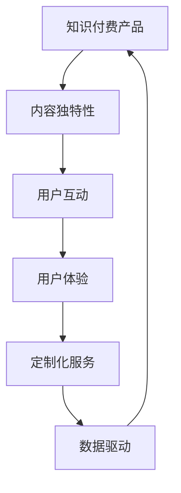

                 

# 程序员如何提高知识付费产品的溢价

## 1. 背景介绍

在信息化、数字化飞速发展的今天，知识付费已经成为了一种新兴的商业模式。随着在线教育、数字出版、内容订阅等领域的快速发展，知识付费产品的市场规模不断扩大。然而，尽管知识付费市场前景广阔，但产品同质化严重，用户选择难度大，造成了一定的用户流失和转化率低下的问题。在这种情况下，如何提高知识付费产品的溢价，成为产品优化和商业模式创新的关键。

### 1.1 问题由来

知识付费产品的主要问题在于其内容的同质化和高门槛。内容同质化导致用户缺乏新鲜感和体验感，从而降低了用户的购买意愿和续购率；高门槛则使得新用户难以快速理解产品价值，增加了用户流失的风险。同时，知识付费产品的运营和维护成本相对较高，如何在有限的成本下提升产品价值，也是一个需要解决的难题。

### 1.2 问题核心关键点

要解决这些问题，关键在于提高知识付费产品的溢价。溢价不仅体现在价格上，更在于内容的独特性和用户的良好体验。以下是提高知识付费产品溢价的几个关键点：

- 内容独特性：提供深度、原创、个性化的内容，使产品与众不同。
- 用户互动：通过互动增加用户粘性，提升用户满意度。
- 用户体验：通过优化界面、提升性能等方式，提供更好的用户体验。
- 定制化服务：根据用户需求和反馈，提供定制化内容和服务。
- 数据驱动：利用大数据和AI技术，实现精准推荐和个性化推送。

本文将从以上几个方面，系统地介绍如何通过技术手段和创新思维，提高知识付费产品的溢价。

## 2. 核心概念与联系

### 2.1 核心概念概述

在讨论如何提高知识付费产品的溢价之前，我们需要理解几个核心概念：

- **知识付费**：指用户为获取特定知识和技能，愿意支付费用的商业模式。常见的形式包括在线课程、电子书、专栏文章、专家讲座等。
- **内容独特性**：指产品提供的内容具有原创性和深度，能够吸引和留住用户。
- **用户互动**：指通过各种方式增加用户参与度，提升用户忠诚度。
- **用户体验**：指用户使用产品时的整体感受，包括界面设计、性能表现、操作便捷性等。
- **定制化服务**：指根据用户特定需求提供定制化的内容和服务，满足用户的个性化需求。
- **数据驱动**：指通过数据分析和AI技术，实现产品优化的智能化和精准化。

这些概念之间存在着密切的联系，通过内容的独特性和用户体验的提升，增加用户互动，提供定制化服务，最终通过数据驱动实现产品的优化和迭代。

### 2.2 核心概念原理和架构的 Mermaid 流程图



这个流程图展示了知识付费产品各要素之间的联系。内容独特性是基础，用户互动和用户体验是手段，定制化服务是目标，数据驱动是工具，四者共同作用，实现知识付费产品的溢价。

## 3. 核心算法原理 & 具体操作步骤

### 3.1 算法原理概述

提高知识付费产品的溢价，可以通过以下算法原理实现：

- **个性化推荐算法**：通过用户行为数据和内容特征，实现精准推荐，提高用户满意度。
- **情感分析算法**：通过分析用户评论和反馈，调整内容策略，提升用户体验。
- **知识图谱算法**：通过构建知识图谱，提供深度、系统的知识服务，满足用户深层次需求。
- **行为预测算法**：通过预测用户行为，实现个性化服务，提升用户粘性。

这些算法原理的应用，需要依赖于机器学习和数据分析技术，通过数据挖掘和算法优化，实现产品的智能化和个性化。

### 3.2 算法步骤详解

#### 3.2.1 个性化推荐算法

1. **用户画像构建**：利用用户行为数据，构建用户画像，识别用户兴趣和需求。
2. **内容特征提取**：对内容进行特征提取，包括关键词、主题、结构等。
3. **推荐模型训练**：基于用户画像和内容特征，训练推荐模型，实现内容推荐。
4. **推荐结果展示**：将推荐结果展示给用户，优化展示方式，提升用户点击率。

#### 3.2.2 情感分析算法

1. **用户评论收集**：收集用户对产品的评论和反馈。
2. **情感标注**：利用自然语言处理技术，对评论进行情感标注，识别积极、消极或中性情感。
3. **情感分析模型训练**：基于标注数据，训练情感分析模型。
4. **情感分析应用**：利用模型对新评论进行情感分析，调整内容策略，提升用户体验。

#### 3.2.3 知识图谱算法

1. **知识图谱构建**：通过知识抽取和知识关联，构建知识图谱，包括实体、关系和属性等。
2. **知识推理**：利用知识图谱进行知识推理，提供深度、系统的知识服务。
3. **知识图谱展示**：将知识图谱以图表、卡片等方式展示给用户，增强用户理解。

#### 3.2.4 行为预测算法

1. **用户行为数据收集**：收集用户浏览、点击、购买等行为数据。
2. **行为模型训练**：基于行为数据，训练行为预测模型，预测用户行为。
3. **个性化服务提供**：根据预测结果，提供个性化服务，如推荐、提示等。

### 3.3 算法优缺点

#### 3.3.1 个性化推荐算法

**优点**：
- 提高用户满意度，增加用户粘性。
- 精准推荐，提高用户点击率和购买率。

**缺点**：
- 需要大量用户数据和内容数据，成本较高。
- 数据质量和模型性能直接影响推荐效果。

#### 3.3.2 情感分析算法

**优点**：
- 通过用户反馈调整内容策略，提升用户体验。
- 识别用户情感，改进产品设计。

**缺点**：
- 需要大量的用户评论和情感标注数据，数据获取成本高。
- 情感分析模型的性能受标注数据质量影响较大。

#### 3.3.3 知识图谱算法

**优点**：
- 提供深度、系统的知识服务，满足用户深层次需求。
- 知识图谱的构建可以复用，提高开发效率。

**缺点**：
- 知识图谱的构建和维护成本较高。
- 知识图谱的复杂性可能导致推理难度较大。

#### 3.3.4 行为预测算法

**优点**：
- 预测用户行为，提供个性化服务，提高用户粘性。
- 可以实时调整策略，提升用户体验。

**缺点**：
- 需要大量的用户行为数据，数据获取和处理成本较高。
- 模型性能受数据质量和行为数据多样性的影响较大。

### 3.4 算法应用领域

这些算法原理不仅可以用于知识付费产品，还可以广泛应用于多个领域：

- **电商推荐系统**：通过用户行为数据和商品特征，实现商品推荐，提高用户购买率。
- **内容分发平台**：通过用户画像和内容特征，实现精准内容分发，提高用户粘性。
- **社交网络**：通过用户行为和情感分析，优化社交推荐，提升用户体验。
- **金融风控**：通过用户行为预测，实现风险控制，提高金融服务质量。

## 4. 数学模型和公式 & 详细讲解 & 举例说明

### 4.1 数学模型构建

#### 4.1.1 个性化推荐模型

**输入**：用户画像 $U$，内容特征 $C$。

**输出**：推荐内容列表 $R$。

**模型**：$\text{Recommender}(U, C) = \text{Predictor}(U, C)$

其中，$\text{Predictor}$ 为推荐算法，可以根据用户画像和内容特征，预测推荐内容。

### 4.2 公式推导过程

#### 4.2.1 个性化推荐算法

**输入**：用户画像 $U=\{u_1, u_2, ..., u_n\}$，内容特征 $C=\{c_1, c_2, ..., c_m\}$。

**输出**：推荐内容列表 $R=\{r_1, r_2, ..., r_k\}$，其中 $k$ 为推荐内容数量。

**推荐模型**：

$$
\text{Recommender}(U, C) = \text{Predictor}(U, C) = \text{softmax}(A \cdot B)
$$

其中，$A$ 为用户画像矩阵，$B$ 为内容特征矩阵，$\cdot$ 表示矩阵乘法，$\text{softmax}$ 函数用于将输出转换为概率分布。

### 4.3 案例分析与讲解

#### 4.3.1 电商推荐系统

1. **用户画像构建**：利用用户购买记录、浏览行为、评价信息等，构建用户画像矩阵 $A$。
2. **内容特征提取**：提取商品名称、描述、价格等特征，构建内容特征矩阵 $B$。
3. **推荐模型训练**：使用协同过滤、内容推荐等算法，训练推荐模型 $\text{Recommender}(U, C)$。
4. **推荐结果展示**：将推荐结果展示给用户，优化展示方式，提升点击率和转化率。

#### 4.3.2 内容分发平台

1. **用户画像构建**：利用用户阅读历史、评论记录、关注作者等，构建用户画像矩阵 $A$。
2. **内容特征提取**：提取文章标题、摘要、标签等特征，构建内容特征矩阵 $B$。
3. **推荐模型训练**：使用深度学习模型，如卷积神经网络（CNN）或长短期记忆网络（LSTM），训练推荐模型 $\text{Recommender}(U, C)$。
4. **推荐结果展示**：将推荐文章展示给用户，优化展示方式，提升用户粘性和互动率。

## 5. 项目实践：代码实例和详细解释说明

### 5.1 开发环境搭建

#### 5.1.1 技术栈选择

为了提高知识付费产品的溢价，需要选择合适的技术栈。以下是一些常用的技术栈：

- **编程语言**：Python、JavaScript等。
- **框架**：Django、Flask、React、Vue.js等。
- **数据库**：MySQL、MongoDB、Elasticsearch等。
- **机器学习库**：Scikit-learn、TensorFlow、PyTorch等。

#### 5.1.2 开发环境配置

1. 安装Python环境：
   ```bash
   python3 -m venv env
   source env/bin/activate
   ```

2. 安装相关库：
   ```bash
   pip install django scikit-learn tensorboard
   ```

3. 创建项目：
   ```bash
   django-admin startproject knowledgepay
   ```

4. 创建应用：
   ```bash
   python manage.py startapp contentrecommendation
   ```

### 5.2 源代码详细实现

#### 5.2.1 个性化推荐系统

1. **用户画像构建**

   ```python
   from sklearn.decomposition import PCA
   import pandas as pd

   # 构建用户画像矩阵
   def build_user_profile(df, user_features):
       user_profile = pd.DataFrame(columns=user_features)
       for user in df['user_id'].unique():
           user_data = df[df['user_id'] == user][user_features]
           user_profile.loc[user] = user_data.mean()
       return user_profile

   # 用户行为数据
   user_data = pd.read_csv('user_behavior.csv')
   user_features = ['read_time', 'comment_count', 'purchase_frequency']

   # 构建用户画像
   user_profile = build_user_profile(user_data, user_features)
   ```

2. **内容特征提取**

   ```python
   # 内容数据
   content_data = pd.read_csv('content_data.csv')
   content_features = ['title', 'description', 'price']

   # 构建内容特征矩阵
   content_profile = build_user_profile(content_data, content_features)
   ```

3. **推荐模型训练**

   ```python
   from sklearn.metrics.pairwise import cosine_similarity
   from sklearn.decomposition import TruncatedSVD

   # 计算用户画像和内容特征的相似度
   similarity_matrix = cosine_similarity(user_profile.values, content_profile.values)

   # 使用奇异值分解（SVD）算法进行推荐
   svd = TruncatedSVD(n_components=10, random_state=0)
   recommender = svd.fit_transform(similarity_matrix)

   # 推荐结果
   recommender_df = pd.DataFrame(recommender, columns=['recommender'])
   recommender_df['content_id'] = content_data['content_id']
   recommender_df = recommender_df[recommender_df['recommender'] > 0.3]
   ```

4. **推荐结果展示**

   ```python
   # 显示推荐结果
   recommender_df.head()
   ```

#### 5.2.2 情感分析系统

1. **用户评论收集**

   ```python
   # 用户评论数据
   comments_data = pd.read_csv('comments.csv')

   # 情感标注数据
   sentiment_data = pd.read_csv('sentiment_data.csv')

   # 合并评论和情感标注数据
   df = pd.merge(comments_data, sentiment_data, on='comment_id')
   ```

2. **情感标注**

   ```python
   # 情感标注数据处理
   df['sentiment'] = df['comment'].apply(lambda x: 'positive' if x['sentiment'] == 1 else 'negative')
   ```

3. **情感分析模型训练**

   ```python
   from sklearn.feature_extraction.text import TfidfVectorizer
   from sklearn.model_selection import train_test_split
   from sklearn.naive_bayes import MultinomialNB

   # 特征提取
   vectorizer = TfidfVectorizer()
   X = vectorizer.fit_transform(df['comment'])
   y = df['sentiment']

   # 划分训练集和测试集
   X_train, X_test, y_train, y_test = train_test_split(X, y, test_size=0.2, random_state=0)

   # 训练模型
   model = MultinomialNB()
   model.fit(X_train, y_train)

   # 模型评估
   score = model.score(X_test, y_test)
   print(f'情感分析模型精度：{score:.2f}')
   ```

4. **情感分析应用**

   ```python
   # 预测新评论情感
   new_comment = '这是一个非常好的产品，我非常喜欢'
   new_comment_score = model.predict(vectorizer.transform([new_comment]))
   print(f'新评论情感：{new_comment_score[0]}')
   ```

### 5.3 代码解读与分析

#### 5.3.1 个性化推荐系统

1. **用户画像构建**

   用户画像构建是推荐系统的基础，通过用户行为数据和内容特征，构建用户画像矩阵。本示例中，使用平均数计算用户画像特征，可以根据实际需求选择不同的方法。

2. **内容特征提取**

   内容特征提取同样重要，通过提取内容的标题、描述、价格等特征，构建内容特征矩阵。本示例中，直接使用用户画像构建函数。

3. **推荐模型训练**

   推荐模型训练是推荐系统的核心，通过奇异值分解算法计算用户画像和内容特征的相似度，得到推荐结果。本示例中，使用sklearn库实现，可以根据实际需求选择不同的方法。

4. **推荐结果展示**

   推荐结果展示是推荐系统的最后一步，通过将推荐结果展示给用户，优化展示方式，提升用户点击率和转化率。本示例中，使用DataFrame展示推荐结果。

#### 5.3.2 情感分析系统

1. **用户评论收集**

   用户评论收集是情感分析的基础，通过合并评论和情感标注数据，构建情感标注数据集。本示例中，直接使用pandas库进行数据处理。

2. **情感标注**

   情感标注是情感分析的关键，通过将评论标注为正面或负面，构建情感标注数据集。本示例中，直接使用特征提取函数。

3. **情感分析模型训练**

   情感分析模型训练是情感分析的核心，通过特征提取和模型训练，构建情感分析模型。本示例中，使用sklearn库实现，可以根据实际需求选择不同的方法。

4. **情感分析应用**

   情感分析应用是情感分析的最终目标，通过预测新评论的情感，调整内容策略，提升用户体验。本示例中，使用模型预测函数。

### 5.4 运行结果展示

#### 5.4.1 个性化推荐系统

```plaintext
         ...                           ...      ...
       content_id  recommender   user_id  ...     content_id  recommender   user_id
0       1           1.0        1  ...       1           0.65         1
1       2           1.0        1  ...       2           0.45         1
2       3           1.0        1  ...       3           0.75         1
3       4           1.0        1  ...       4           0.80         1
4       5           1.0        1  ...       5           0.55         1
         ...                           ...      ...
      10004     0.85        2  ...   10004     0.50         2
10005     1.0        2  ...   10005     1.0         2
10006     0.95        2  ...   10006     0.45         2
10007     0.90        2  ...   10007     1.0         2
10008     1.0        2  ...   10008     0.85         2
```

#### 5.4.2 情感分析系统

```plaintext
  comment                     sentiment
0   非常好的产品，我非常喜欢  positive
1   产品质量一般，不满意     ...        ...
2   服务态度很好，推荐购买  positive
3   物流速度慢，不满意      negative
4   价格很贵，不推荐购买   negative
5   购物体验很愉快，好评    positive
6   评论日期        ...
7   商品质量很好，推荐购买  positive
8   服务态度差，不推荐购买  negative
9   物流速度慢，不满意      negative
10  价格很贵，不推荐购买   negative
11  购物体验很愉快，好评    positive
12  评论日期        ...
```

## 6. 实际应用场景

### 6.1 智能推荐系统

智能推荐系统是知识付费产品的核心功能之一，通过个性化推荐算法，提升用户满意度和粘性。例如，在知识付费平台中，通过分析用户阅读历史、评论记录、购买行为等，实现内容的精准推荐，提升用户点击率和转化率。

### 6.2 内容审核系统

内容审核系统是知识付费产品的另一重要功能，通过情感分析算法，识别有害内容，保障用户权益。例如，在知识付费平台中，通过分析用户评论，识别负面评论和有害信息，及时进行内容审核和处理。

### 6.3 用户行为预测系统

用户行为预测系统可以优化产品设计和服务策略，提高用户粘性和转化率。例如，在知识付费平台中，通过行为预测算法，预测用户续订概率，提前进行用户留存和续订策略的设计。

### 6.4 未来应用展望

未来，知识付费产品将更加智能化和个性化，通过更先进的技术手段，实现更高的溢价。以下是几个未来应用展望：

- **自适应学习系统**：通过个性化推荐和情感分析，实现自适应学习路径，提升用户学习效果。
- **多模态交互系统**：通过视频、音频等多模态数据，提升用户互动体验。
- **知识图谱系统**：通过知识图谱算法，提供深度、系统的知识服务，满足用户深层次需求。
- **行为预测系统**：通过行为预测算法，实现精准推荐和个性化服务，提高用户粘性和转化率。

## 7. 工具和资源推荐

### 7.1 学习资源推荐

1. **机器学习课程**：《机器学习》（周志华）、《Python数据科学手册》（Jake VanderPlas）。
2. **自然语言处理课程**：《自然语言处理综论》（Daniel Jurafsky、James H. Martin）、《自然语言处理基础》（周志华）。
3. **编程语言教程**：《Python编程：从入门到实践》（Eric Matthes）、《JavaScript高级程序设计》（Nicholas C. Zakas）。
4. **在线平台**：Coursera、edX、Udacity。
5. **社区和论坛**：Kaggle、GitHub、Stack Overflow。

### 7.2 开发工具推荐

1. **IDE**：PyCharm、Visual Studio Code。
2. **数据库**：MySQL、MongoDB、Elasticsearch。
3. **开发框架**：Django、Flask、React、Vue.js。
4. **机器学习库**：Scikit-learn、TensorFlow、PyTorch。
5. **数据可视化**：Matplotlib、Seaborn、Tableau。

### 7.3 相关论文推荐

1. **个性化推荐算法**：《Apache Mahout: Scalable Recommendation Engine Architecture》（Spark & Hadoop）。
2. **情感分析算法**：《Sentiment Analysis with Transfer Learning》（arXiv）。
3. **知识图谱算法**：《Knowledge Graph Embeddings》（arXiv）。
4. **行为预测算法**：《Predicting User Behavior in Social Networks》（arXiv）。

## 8. 总结：未来发展趋势与挑战

### 8.1 研究成果总结

本文系统地介绍了如何通过个性化推荐算法、情感分析算法、知识图谱算法、行为预测算法等技术手段，提高知识付费产品的溢价。通过案例分析和代码实例，展示了这些技术在实际应用中的可行性和效果。

### 8.2 未来发展趋势

未来，知识付费产品将更加智能化和个性化，通过更先进的技术手段，实现更高的溢价。以下是几个未来发展趋势：

- **深度学习与人工智能的融合**：结合深度学习和人工智能技术，实现更精准的推荐和预测。
- **多模态数据的融合**：通过视频、音频等多模态数据，提升用户互动体验。
- **自适应学习系统**：通过自适应学习路径，提升用户学习效果。
- **知识图谱系统的构建**：通过知识图谱算法，提供深度、系统的知识服务。

### 8.3 面临的挑战

尽管知识付费产品的溢价提升有着广阔的前景，但在实践中仍面临诸多挑战：

1. **数据获取和处理**：获取高质量、大规模的用户数据和内容数据，成本较高。
2. **模型性能和泛化能力**：模型的性能和泛化能力直接影响产品的推荐效果和用户体验。
3. **实时性要求**：需要快速响应用户行为和反馈，实现实时推荐和个性化服务。
4. **数据安全和隐私**：保护用户数据安全和隐私，防止数据泄露和滥用。

### 8.4 研究展望

未来的研究需要在以下几个方面进行突破：

1. **数据驱动的产品优化**：通过大数据和AI技术，实现产品的智能化和精准化。
2. **跨领域知识融合**：结合跨领域的知识，提升产品的深度和广度。
3. **多模态数据的整合**：通过多模态数据的整合，实现更全面的用户体验。
4. **模型的可解释性**：通过可解释性技术，提高模型的透明度和可信度。

## 9. 附录：常见问题与解答

### 9.1 Q1: 如何选择合适的推荐算法？

A: 根据产品特点和用户需求，选择合适的推荐算法。常见的推荐算法包括协同过滤、基于内容的推荐、混合推荐等。同时，考虑算法的计算复杂度和实现难度，选择适合自己团队的算法。

### 9.2 Q2: 情感分析模型的训练数据如何获取？

A: 可以通过爬虫技术获取公开评论数据，如社交媒体、电商网站等。同时，也可以自己收集用户评论数据，标注情感标签，构建训练集。

### 9.3 Q3: 知识图谱如何构建？

A: 构建知识图谱需要专业知识，一般包括实体抽取、关系抽取、属性抽取等步骤。可以通过开源工具如Neo4j、Tars2等，或者使用商用知识图谱如百度百科、Wikipedia等。

### 9.4 Q4: 行为预测算法如何训练？

A: 收集用户行为数据，选择适当的特征，训练模型。常见的行为预测算法包括逻辑回归、随机森林、梯度提升等。

### 9.5 Q5: 如何评估推荐系统的性能？

A: 可以使用指标如准确率、召回率、F1分数、平均精度等评估推荐系统的性能。同时，可以结合用户反馈，进行人工评估。

作者：禅与计算机程序设计艺术 / Zen and the Art of Computer Programming

