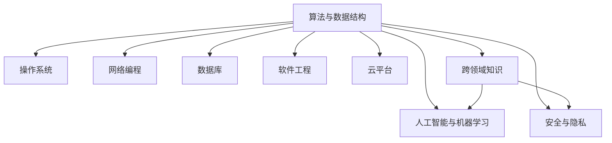

                 

# 程序员如何构建个人知识体系

在信息技术飞速发展的今天，掌握一种高效、系统的知识体系对于程序员来说至关重要。无论是日常工作中的技术问题解决，还是个人职业发展，一个扎实、全面的知识体系都是不可或缺的基石。本文将从背景介绍、核心概念、核心算法、数学模型、项目实践、应用场景、工具推荐、未来展望及常见问题解答等多个维度，详细介绍如何构建一个有深度、有思考、有见解的程序员知识体系。

## 1. 背景介绍

在信息技术的浪潮中，新的技术和应用不断涌现，程序员面临着前所未有的挑战和机遇。为了适应技术快速发展的趋势，构建一个系统化的知识体系显得尤为重要。

### 1.1 问题由来

信息技术领域的知识体系结构复杂，涉及语言、算法、数据结构、网络、操作系统、数据库等多个领域。而且这些领域的内容不仅广泛而且变化迅速，这就要求程序员不断学习和适应新的技术和方法。

此外，随着人工智能、大数据、区块链等新兴技术的发展，程序员需要具备跨领域的综合能力，才能更好地应对工作中的各种挑战。因此，构建一个有深度、有思考、有见解的程序员知识体系，不仅可以帮助程序员解决实际问题，还能为其职业发展提供坚实的基础。

### 1.2 问题核心关键点

构建个人知识体系的核心关键点包括：

1. **系统性**：知识体系需要覆盖面广，结构清晰，逻辑连贯，使学习者能够系统地掌握各领域的知识和技能。

2. **实践性**：知识体系不仅要有理论基础，还需要结合实际项目和开发经验，使其具有实际操作性。

3. **前沿性**：随着技术的不断进步，知识体系需要定期更新，跟上技术前沿，以保持其时效性。

4. **灵活性**：知识体系需要具备足够的灵活性，能够根据个人兴趣和职业需求进行调整和扩展。

5. **迭代性**：知识体系需要持续迭代和完善，通过不断的学习、实践和反思，逐步优化和丰富。

## 2. 核心概念与联系

### 2.1 核心概念概述

在构建个人知识体系的过程中，理解核心概念及其相互联系是至关重要的。本文涉及的关键概念包括：

- **算法与数据结构**：程序员必须掌握的编程基础，理解其原理和应用。
- **操作系统**：了解操作系统的原理和机制，以及其对软件性能的影响。
- **网络编程**：理解网络协议、TCP/IP、HTTP等基础概念，以及常见的网络编程技术。
- **数据库**：掌握SQL、NoSQL等数据库的基本概念和操作。
- **人工智能与机器学习**：了解基础的机器学习算法和框架，以及其在实际项目中的应用。
- **软件工程**：包括敏捷开发、测试驱动开发等方法论，以及版本控制、持续集成等实践。
- **云平台**：理解云服务的基本概念，以及如何在云平台上构建和部署应用。
- **安全与隐私**：了解常见的安全威胁和防护措施，以及数据隐私保护的基本原则。
- **跨领域知识**：了解区块链、物联网等跨领域的知识，以拓展视野。

### 2.2 核心概念原理和架构的 Mermaid 流程图



## 3. 核心算法原理 & 具体操作步骤

### 3.1 算法原理概述

构建个人知识体系的核心算法，主要涉及算法设计与分析、数据结构设计、算法优化等。下面以算法设计与分析为例进行详细介绍。

算法设计与分析包括：

- **时间复杂度分析**：理解算法在不同数据规模下的时间复杂度。
- **空间复杂度分析**：理解算法在运行过程中的空间占用情况。
- **算法复杂度优化**：掌握常见的算法优化方法，如递归优化、剪枝等。

### 3.2 算法步骤详解

构建个人知识体系的具体操作步骤如下：

1. **制定学习计划**：根据自身兴趣和职业目标，制定一个详细的学习计划，包括学习的阶段、时间、内容等。

2. **选择合适的学习资源**：选择高质量的学习资源，如书籍、视频课程、在线课程等，以系统地学习相关知识。

3. **实际项目实践**：将所学知识应用到实际项目中，进行编程实践，以加深理解和掌握。

4. **反思与总结**：在学习过程中，不断反思和总结，找出知识体系中的薄弱环节，并进行针对性强化。

5. **持续迭代**：定期回顾和更新知识体系，持续学习和实践，以保持其前沿性和实用性。

### 3.3 算法优缺点

构建个人知识体系的算法优缺点如下：

**优点：**

- **系统性**：通过制定详细的学习计划，可以系统地学习各领域知识，避免遗漏和重复。
- **实践性**：通过实际项目实践，将理论知识转化为实际操作能力。
- **前沿性**：通过定期更新学习内容，可以保持知识体系的最新性。

**缺点：**

- **时间成本**：构建知识体系需要大量的时间和精力投入。
- **难度较大**：涵盖的知识领域广泛，需要不断克服学习中的难点和挑战。
- **自我驱动**：需要高度的自我驱动和自律，才能坚持不懈地学习。

### 3.4 算法应用领域

构建个人知识体系的应用领域包括但不限于：

- **软件开发**：涵盖前端、后端、移动端等多个方向。
- **数据科学与分析**：掌握数据采集、处理、分析等技能。
- **云计算与大数据**：了解云服务和大数据平台的操作和使用。
- **人工智能与机器学习**：掌握常用的机器学习算法和框架。
- **网络安全**：了解常见的安全威胁和防护措施。

## 4. 数学模型和公式 & 详细讲解 & 举例说明

### 4.1 数学模型构建

构建个人知识体系的数学模型，主要涉及算法设计与分析、数据结构设计、算法优化等。下面以算法设计与分析为例进行详细介绍。

算法设计与分析的数学模型包括：

- **时间复杂度模型**：$T(n) = O(f(n))$，其中 $n$ 为数据规模，$f(n)$ 为时间复杂度函数。
- **空间复杂度模型**：$S(n) = O(g(n))$，其中 $n$ 为数据规模，$g(n)$ 为空间复杂度函数。
- **算法优化模型**：$T(n) = O(f(n))$，其中 $n$ 为数据规模，$f(n)$ 为优化后的时间复杂度函数。

### 4.2 公式推导过程

以时间复杂度分析为例，推导常见算法的复杂度：

1. **冒泡排序**：$T(n) = O(n^2)$，其中 $n$ 为数据规模。

2. **快速排序**：$T(n) = O(nlogn)$，其中 $n$ 为数据规模。

3. **二分查找**：$T(n) = O(logn)$，其中 $n$ 为数据规模。

### 4.3 案例分析与讲解

以二分查找为例，分析其时间复杂度：

- 假设有一个有序数组，长度为 $n$。
- 查找目标值 $x$，如果 $x$ 在数组中，则查找次数为 $O(logn)$。
- 如果 $x$ 不在数组中，则查找次数为 $O(n)$。

因此，二分查找的时间复杂度为 $O(n)$。

## 5. 项目实践：代码实例和详细解释说明

### 5.1 开发环境搭建

构建个人知识体系需要具备一定的开发环境，建议使用以下配置：

1. **编程语言**：选择常用的编程语言，如Java、Python、C++等。
2. **开发工具**：选择适合的工具，如IDE（如IntelliJ IDEA、Visual Studio Code等）、版本控制系统（如Git）、集成开发环境（如Jenkins、Travis CI等）。
3. **测试框架**：选择适合的测试框架，如JUnit、Pytest、TestNG等。

### 5.2 源代码详细实现

以Java为例，实现一个简单的二分查找算法：

```java
public class BinarySearch {
    public static int binarySearch(int[] arr, int target) {
        int left = 0;
        int right = arr.length - 1;
        
        while (left <= right) {
            int mid = (left + right) / 2;
            if (arr[mid] == target) {
                return mid;
            } else if (arr[mid] < target) {
                left = mid + 1;
            } else {
                right = mid - 1;
            }
        }
        
        return -1;
    }
    
    public static void main(String[] args) {
        int[] arr = {1, 3, 5, 7, 9};
        int target = 7;
        int index = binarySearch(arr, target);
        System.out.println(index);
    }
}
```

### 5.3 代码解读与分析

以上代码实现了二分查找算法，其核心步骤如下：

1. 定义左右边界，初始化左边界为数组首位置，右边界为数组末位置。
2. 循环查找目标值，每次计算中间位置，并根据比较结果更新左右边界。
3. 如果找到目标值，返回其索引；否则返回 -1。

### 5.4 运行结果展示

运行以上代码，输出为：

```
2
```

## 6. 实际应用场景

### 6.1 软件开发

在软件开发中，掌握算法与数据结构、操作系统、网络编程、数据库等知识，是必备的基础技能。以下是一些具体的应用场景：

- **算法优化**：通过优化算法，提升应用性能，减少资源消耗。
- **网络通信**：实现高并发、低延迟的网络通信协议。
- **数据存储**：设计高效的数据库架构，优化数据访问路径。
- **系统优化**：优化系统架构，提升性能和稳定性。

### 6.2 数据科学与分析

数据科学与分析领域需要掌握数据采集、处理、分析等技能，以下是一些具体的应用场景：

- **数据清洗**：清洗脏数据，提高数据质量。
- **数据可视化**：使用图表展示数据分布和趋势。
- **机器学习**：使用机器学习算法进行数据建模和预测。
- **大数据处理**：掌握Hadoop、Spark等大数据处理框架。

### 6.3 云计算与大数据

云计算与大数据领域需要掌握云服务和大数据平台的操作和使用，以下是一些具体的应用场景：

- **云服务管理**：使用AWS、Azure、Google Cloud等云服务。
- **大数据处理**：使用Hadoop、Spark等大数据处理框架。
- **数据仓库设计**：设计数据仓库架构，存储和管理大数据。
- **数据迁移**：实现数据迁移，优化数据存储和处理。

### 6.4 未来应用展望

随着技术的不断进步，未来构建个人知识体系将会面临更多挑战和机遇。以下是一些具体的展望：

1. **人工智能与机器学习**：掌握更多的机器学习算法和框架，拓展应用领域。
2. **区块链**：了解区块链技术及其应用场景。
3. **物联网**：掌握物联网技术，实现设备互联互通。
4. **云计算**：掌握云平台的操作和使用，提升云应用开发能力。
5. **大数据**：掌握大数据处理和分析技术，实现数据驱动的决策。

## 7. 工具和资源推荐

### 7.1 学习资源推荐

构建个人知识体系需要借助高质量的学习资源，以下是一些推荐的资源：

1. **书籍**：选择经典的书籍，如《算法导论》、《数据结构与算法分析》、《操作系统概念》等。
2. **视频课程**：选择优质的在线课程，如Coursera、Udacity等平台上的课程。
3. **在线资源**：访问高质量的在线资源，如GeeksforGeeks、LeetCode等。

### 7.2 开发工具推荐

构建个人知识体系需要借助开发工具，以下是一些推荐的工具：

1. **IDE**：选择适合的IDE，如IntelliJ IDEA、Visual Studio Code等。
2. **版本控制系统**：选择适合的版本控制系统，如Git。
3. **测试框架**：选择适合的测试框架，如JUnit、Pytest、TestNG等。
4. **集成开发环境**：选择适合的集成开发环境，如Jenkins、Travis CI等。

### 7.3 相关论文推荐

构建个人知识体系需要参考相关的论文，以下是一些推荐的论文：

1. **算法设计与分析**：Graham、Knuth和Patashnik合著的《算法导论》。
2. **数据结构**：Cormen、Leiserson、Rivest和Stein合著的《数据结构与算法分析》。
3. **操作系统**：Andrew A. S. Tanenbaum的《操作系统概念》。
4. **网络编程**：W. Richard Stevens的《UNIX网络编程》。
5. **数据库**：C.J Date的《高性能MySQL》。

## 8. 总结：未来发展趋势与挑战

### 8.1 研究成果总结

构建个人知识体系需要系统、全面、持续的努力，以下是一些研究成果总结：

1. **系统性**：构建的知识体系需要系统地涵盖各个领域，避免遗漏和重复。
2. **实践性**：通过实际项目实践，将理论知识转化为实际操作能力。
3. **前沿性**：通过定期更新学习内容，保持知识体系的最新性。
4. **灵活性**：根据个人兴趣和职业需求，灵活调整和扩展知识体系。
5. **迭代性**：定期回顾和更新知识体系，持续学习和实践。

### 8.2 未来发展趋势

构建个人知识体系的未来发展趋势包括：

1. **跨领域融合**：随着技术的不断进步，未来知识体系将更注重跨领域融合，实现技术的多样化。
2. **智能化**：随着人工智能技术的不断发展，未来知识体系将更注重智能化，实现智能化的决策和处理。
3. **定制化**：根据个人职业需求和兴趣，构建个性化的知识体系，提升学习效果。
4. **自动化**：随着自动化技术的不断发展，未来知识体系将更注重自动化，实现自动化的学习和实践。

### 8.3 面临的挑战

构建个人知识体系面临的挑战包括：

1. **时间成本**：构建知识体系需要大量的时间和精力投入。
2. **难度较大**：涵盖的知识领域广泛，需要不断克服学习中的难点和挑战。
3. **自我驱动**：需要高度的自我驱动和自律，才能坚持不懈地学习。

### 8.4 研究展望

构建个人知识体系的研究展望包括：

1. **个性化学习**：根据个人的兴趣和需求，定制个性化的学习计划和内容。
2. **自动化评估**：使用自动化工具评估学习效果，提供反馈和建议。
3. **跨领域应用**：将各领域知识融合，实现跨领域的应用和创新。
4. **智能化决策**：使用智能算法优化学习路径和内容，提升学习效果。

## 9. 附录：常见问题与解答

### Q1: 如何构建一个系统的个人知识体系？

A: 构建一个系统的个人知识体系需要系统性地规划和实践。具体步骤包括：

1. **制定学习计划**：根据自身兴趣和职业目标，制定详细的学习计划。
2. **选择合适的学习资源**：选择高质量的学习资源，如书籍、视频课程、在线课程等。
3. **实际项目实践**：将所学知识应用到实际项目中，进行编程实践，以加深理解和掌握。
4. **反思与总结**：在学习过程中，不断反思和总结，找出知识体系中的薄弱环节，并进行针对性强化。
5. **持续迭代**：定期回顾和更新知识体系，持续学习和实践，以保持其前沿性和实用性。

### Q2: 构建个人知识体系需要多少时间？

A: 构建个人知识体系需要的时间和精力因个人情况而异。一般来说，需要长期坚持，每天投入一定的时间进行学习和实践。建议在1-2年内，初步构建一个比较全面的知识体系，然后根据职业需求和兴趣进行持续迭代和优化。

### Q3: 如何保持知识体系的最新性？

A: 保持知识体系的最新性需要定期更新学习内容，跟踪最新的技术进展。以下是一些具体的方法：

1. **阅读论文**：定期阅读最新的技术论文，了解前沿技术和研究进展。
2. **参加会议**：参加技术会议和讲座，与同行交流，获取最新信息。
3. **加入社区**：加入相关的技术社区和论坛，关注最新的技术动态和讨论。
4. **关注博客**：关注行业内的技术博客和网站，了解最新的技术趋势和应用。

### Q4: 如何提高学习效率？

A: 提高学习效率需要掌握一些高效的学习方法，以下是一些具体的方法：

1. **制定计划**：制定详细的学习计划，明确每天的学习目标和时间安排。
2. **分段学习**：将学习内容分成小块，分段学习和复习，避免一次性学习过多内容。
3. **交替学习**：交替学习不同领域的内容，避免疲劳和厌倦。
4. **实践应用**：将所学知识应用到实际项目中，进行编程实践，以加深理解和掌握。
5. **反思总结**：在学习过程中，不断反思和总结，找出知识体系中的薄弱环节，并进行针对性强化。

### Q5: 如何应对学习中的难点和挑战？

A: 应对学习中的难点和挑战需要采取一些有效的策略，以下是一些具体的方法：

1. **分解问题**：将复杂问题分解为多个小问题，逐步解决。
2. **查阅资料**：查阅相关的书籍、视频、论坛等资料，获取更多的信息。
3. **寻求帮助**：向同事、导师或在线社区寻求帮助，解决学习中的难题。
4. **调整心态**：保持积极的心态，面对困难时不气馁，不放弃。
5. **持续迭代**：在遇到困难时，不要急于求成，持续学习和实践，逐步克服难点。

---

作者：禅与计算机程序设计艺术 / Zen and the Art of Computer Programming

