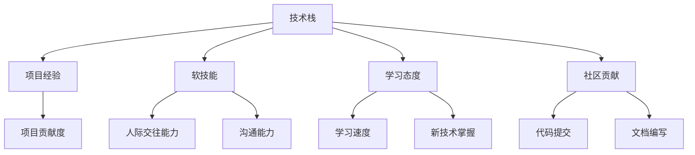

                 

# 程序员如何正确评估自身价值

> 关键词：职业规划,自我价值,技能评估,持续学习,技术栈优化,社区贡献,项目经验

## 1. 背景介绍

### 1.1 问题由来
在快速变化的IT行业中，程序员常常面临着不断变化的技术栈和市场需求，如何在复杂多变的职业环境中正确评估自己的价值，制定合理的发展路线，是每位程序员都需要认真思考的问题。

### 1.2 问题核心关键点
正确评估自身价值的过程，主要包括以下几个关键点：
- **技术能力**：掌握哪些技术栈，技术水平如何。
- **项目经验**：参与过哪些项目，扮演了什么角色，取得了什么成果。
- **软技能**：沟通能力、团队协作、问题解决等软技能如何。
- **学习态度**：是否持续学习新技术、新工具，是否关注行业动态。
- **社区贡献**：在开源社区中是否有所贡献，如代码提交、文档编写等。

正确评估自身价值不仅能帮助程序员制定合理的发展目标，还能提升自身的市场竞争力，在职业发展中占据优势。

## 2. 核心概念与联系

### 2.1 核心概念概述

为更好地理解如何正确评估自身价值，本节将介绍几个密切相关的核心概念：

- **技术栈**：程序员需要掌握的编程语言、框架、库等技术工具。
- **项目经验**：程序员在实际项目中积累的经验，包括但不限于项目的规模、角色、贡献度等。
- **软技能**：与技术无关的人际交往、沟通、管理、创新等能力。
- **学习态度**：对新技术、新工具的学习热情和速度，对行业动态的关注程度。
- **社区贡献**：在开源社区的活跃度，如代码提交、文档编写、社区参与等。

这些核心概念之间的逻辑关系可以通过以下Mermaid流程图来展示：



这个流程图展示了几大核心概念之间的关系：

1. 技术栈为项目经验、软技能、学习态度、社区贡献提供了基础。
2. 项目经验展示了技术栈和软技能在实际项目中的应用效果。
3. 学习态度和社区贡献进一步提升技术栈和项目经验的价值。
4. 软技能在不同技术栈和项目经验中发挥重要作用。

## 3. 核心算法原理 & 具体操作步骤

### 3.1 算法原理概述

正确评估自身价值的过程，本质上是一个多维度综合评估的过程。我们需要通过量化的指标来综合考量技术栈、项目经验、软技能、学习态度和社区贡献等多个方面的因素，得到综合得分。

### 3.2 算法步骤详解

正确评估自身价值的步骤主要包括以下几个环节：

**Step 1: 技术栈评估**

1. **技术栈选择**：选择技术栈时，需综合考虑行业需求、公司技术栈、个人兴趣等。优先选择主流、应用广泛的技术栈。
2. **技术掌握度**：对选择的技术栈进行评估，了解自己的掌握程度，包括语法、常用API、高级特性等。
3. **技术熟练度**：结合实际项目和日常编码任务，评估技术栈的熟练度。

**Step 2: 项目经验评估**

1. **项目选择**：选择有代表性、具有挑战性的项目，如公司内部项目、开源项目、个人项目等。
2. **角色评估**：评估自己在项目中扮演的角色，如开发、架构、测试等。
3. **贡献度评估**：评估自己在项目中的贡献度，包括代码提交量、功能实现、性能优化等。

**Step 3: 软技能评估**

1. **沟通能力**：通过与同事、客户的沟通交流情况，评估自己的沟通能力。
2. **团队协作**：评估自己在团队中的协作能力，包括跨部门合作、项目管理等。
3. **问题解决**：评估自己的问题解决能力，包括技术问题、团队矛盾等。

**Step 4: 学习态度评估**

1. **学习速度**：评估自己学习新技术的速度和掌握程度。
2. **新技术掌握**：评估自己掌握新技术的广度和深度。
3. **行业关注**：评估自己对行业动态的关注程度，如技术会议、专业文章等。

**Step 5: 社区贡献评估**

1. **代码提交**：评估自己在开源社区的代码提交情况，包括提交次数、质量、被接受度等。
2. **文档编写**：评估自己为开源项目编写的文档情况，包括文档质量、阅读量、贡献度等。
3. **社区参与**：评估自己在开源社区中的活跃度，如参与讨论、提交issue、参加会议等。

**Step 6: 综合评估与得分计算**

1. **权重分配**：根据各个维度的重要性，分配相应的权重。
2. **评估打分**：根据评估结果，对每个维度打分。
3. **综合得分**：计算综合得分，公式为：

   $$
   V = \sum_{i=1}^n (w_i \times S_i)
   $$

   其中 $w_i$ 为维度 $i$ 的权重，$S_i$ 为维度 $i$ 的评分。

### 3.3 算法优缺点

正确评估自身价值的方法具有以下优点：
1. **全面考量**：综合评估技术栈、项目经验、软技能、学习态度和社区贡献，避免了单一维度的片面评估。
2. **量化衡量**：通过打分和加权平均，将评估结果量化，便于对比和分析。
3. **动态更新**：随着时间和经验的积累，评估过程可以动态更新，持续提升评估结果的准确性。

同时，该方法也存在一定的局限性：
1. **主观性强**：权重分配和评分过程包含主观因素，可能导致结果的偏差。
2. **复杂度高**：评估过程涉及多个维度的详细评估，工作量较大。
3. **静态评估**：评估结果基于当前的评估数据，未能动态反映变化情况。

尽管存在这些局限性，但通过合理的设计和操作，正确评估自身价值的方法仍可以显著提升个人发展方向的选择和调整能力。

### 3.4 算法应用领域

正确评估自身价值的方法适用于各种职业发展场景，包括但不限于：

- **职业规划**：帮助程序员制定合理的发展路线，明确技术提升方向。
- **面试准备**：全面展示自己的技能和经验，提升面试成功率。
- **团队协作**：了解团队成员的技术栈和能力，优化团队配置。
- **招聘决策**：评估候选人的技术栈、项目经验、软技能和学习态度，提升招聘效果。

## 4. 数学模型和公式 & 详细讲解 & 举例说明

### 4.1 数学模型构建

正确评估自身价值的过程可以建模为一个多维度的线性加权评分系统，具体形式为：

$$
V = \sum_{i=1}^n (w_i \times S_i)
$$

其中 $n$ 为维度数，$w_i$ 为维度 $i$ 的权重，$S_i$ 为维度 $i$ 的评分。

### 4.2 公式推导过程

以项目经验维度为例，假设有两个指标：项目规模和角色，每个指标的评分分别为 $S_1$ 和 $S_2$，对应的权重分别为 $w_1$ 和 $w_2$，则项目经验的综合评分为：

$$
V_{\text{项目经验}} = w_1 \times S_1 + w_2 \times S_2
$$

### 4.3 案例分析与讲解

假设某程序员在技术栈评估中，对Python的掌握度得分为 $S_1=4$，熟练度得分为 $S_2=5$；在项目经验评估中，参与的项目规模得分为 $S_3=6$，扮演的角色得分为 $S_4=7$；在软技能评估中，沟通能力得分为 $S_5=3$，团队协作得分为 $S_6=4$；在技术栈评估中，学习速度得分为 $S_7=5$，新技术掌握得分为 $S_8=6$；在社区贡献评估中，代码提交得分为 $S_9=2$，文档编写得分为 $S_{10}=3$，社区参与得分为 $S_{11}=4$。

设权重 $w_1=0.2, w_2=0.8, w_3=0.5, w_4=0.5, w_5=0.3, w_6=0.7, w_7=0.4, w_8=0.6, w_9=0.3, w_{10}=0.5, w_{11}=0.2$。

则综合评估结果为：

$$
V = (0.2 \times 4 + 0.8 \times 5) + (0.5 \times 6 + 0.5 \times 7) + (0.3 \times 3 + 0.7 \times 4) + (0.4 \times 5 + 0.6 \times 6) + (0.3 \times 2 + 0.5 \times 3 + 0.2 \times 4) = 14.3
$$

## 5. 项目实践：代码实例和详细解释说明

### 5.1 开发环境搭建

在进行正确评估自身价值的实践时，我们需要准备好开发环境。以下是使用Python进行数据分析的环境配置流程：

1. 安装Anaconda：从官网下载并安装Anaconda，用于创建独立的Python环境。

2. 创建并激活虚拟环境：
```bash
conda create -n python-env python=3.8 
conda activate python-env
```

3. 安装必要的Python库：
```bash
pip install pandas numpy matplotlib seaborn
```

完成上述步骤后，即可在`python-env`环境中进行数据分析和评估。

### 5.2 源代码详细实现

我们通过Python代码来实现对程序员进行技术栈、项目经验、软技能、学习态度和社区贡献等多个维度的综合评估，并计算其综合得分。

首先，定义各个维度的评分和权重：

```python
# 技术栈评分
scores_tech = [4, 5]  # Python的掌握度和熟练度
weights_tech = [0.2, 0.8]  # 权重

# 项目经验评分
scores_project = [6, 7]  # 项目规模和角色
weights_project = [0.5, 0.5]  # 权重

# 软技能评分
scores_soft = [3, 4]  # 沟通能力和团队协作
weights_soft = [0.3, 0.7]  # 权重

# 学习态度评分
scores_learning = [5, 6]  # 学习速度和新技术掌握
weights_learning = [0.4, 0.6]  # 权重

# 社区贡献评分
scores_contribute = [2, 3, 4]  # 代码提交、文档编写和社区参与
weights_contribute = [0.3, 0.5, 0.2]  # 权重
```

然后，定义综合评估函数，计算综合得分：

```python
def calculate_score(scores, weights):
    return sum(score * weight for score, weight in zip(scores, weights))
```

最后，调用函数计算综合得分：

```python
total_score = calculate_score(scores_tech, weights_tech) + calculate_score(scores_project, weights_project) + calculate_score(scores_soft, weights_soft) + calculate_score(scores_learning, weights_learning) + calculate_score(scores_contribute, weights_contribute)
print(f"综合评估结果为：{total_score}")
```

以上就是使用Python对程序员进行综合评估的代码实现。可以看到，通过合理设计评分和权重，可以全面、量化地评估程序员的综合价值。

### 5.3 代码解读与分析

让我们再详细解读一下关键代码的实现细节：

**定义评分和权重**：
- `scores_tech`、`scores_project`、`scores_soft`、`scores_learning`、`scores_contribute`分别代表不同维度的评分。
- `weights_tech`、`weights_project`、`weights_soft`、`weights_learning`、`weights_contribute`分别代表不同维度的权重。

**计算综合得分**：
- `zip`函数用于将评分和权重进行一一对应。
- `sum`函数用于计算加权求和，得到综合评估结果。

**输出结果**：
- 使用`print`函数输出综合评估结果，便于查看和分析。

## 6. 实际应用场景

### 6.1 面试准备

在面试中，候选人往往需要通过技术栈评估、项目经验评估、软技能评估等方式展示自己的综合能力。通过系统评估自身价值，可以明确自己的优势和不足，有针对性地准备面试内容，提升成功率。

### 6.2 职业规划

在制定职业发展路线时，程序员可以通过正确评估自身价值，明确技术提升方向，选择有发展潜力的技术和项目，制定合理的学习计划，提升自身的市场竞争力。

### 6.3 团队协作

在团队中，了解成员的技术栈和能力，可以帮助管理者更好地分配任务和优化团队配置，提升团队整体效率。

### 6.4 招聘决策

在招聘候选人时，公司可以通过系统评估候选人的技术栈、项目经验、软技能和学习态度，全面了解候选人的综合能力，提升招聘效果。

## 7. 工具和资源推荐

### 7.1 学习资源推荐

为帮助程序员全面掌握正确评估自身价值的方法，这里推荐一些优质的学习资源：

1. **《程序员职业发展指南》**：该书系统介绍了程序员在职业发展中的各个阶段应具备的技能和知识。

2. **《软件工程师手册》**：该书详细讲解了软件工程师应具备的技术栈、软技能和项目管理能力。

3. **Coursera《计算机科学导论》课程**：该课程由斯坦福大学教授讲授，涵盖计算机科学基础知识和职业规划等内容。

4. **Udacity《软件开发人员职业发展》课程**：该课程通过项目实践，帮助学员提升职业规划和技能评估能力。

5. **GitHub《开源项目评估指南》**：该指南详细介绍了如何在开源社区中评估项目和贡献。

### 7.2 开发工具推荐

正确的评估自身价值需要依托于高效的工具支持。以下是几款推荐的工具：

1. **Jupyter Notebook**：Python数据分析和可视化的好助手，支持代码和结果的交互式展示。

2. **Excel**：简单易用的电子表格软件，适合进行简单数据的处理和分析。

3. **Tableau**：高级的数据可视化工具，适合复杂数据的分析和展示。

4. **PyTorch**：深度学习框架，适合进行综合评估模型的训练和测试。

5. **TensorBoard**：TensorFlow配套的可视化工具，支持模型的训练和评估过程的实时监测。

### 7.3 相关论文推荐

正确评估自身价值的研究涉及多个领域，以下是几篇经典论文，推荐阅读：

1. **《数据驱动的职业生涯规划系统》**：该论文介绍了如何使用大数据技术评估程序员的职业规划路径。

2. **《技能矩阵：软件工程师能力评估模型》**：该论文详细介绍了技能矩阵在评估软件工程师能力中的应用。

3. **《基于开源项目的程序员技能评估模型》**：该论文研究了如何通过开源项目评估程序员的技能水平。

4. **《编程技能评估方法与实践》**：该论文介绍了多种评估编程技能的方法和工具。

5. **《人工智能时代程序员的自我提升》**：该论文探讨了人工智能技术对程序员自我提升的影响。

## 8. 总结：未来发展趋势与挑战

### 8.1 研究成果总结

正确评估自身价值的研究已经取得了一些进展，包括但不限于：
- 开发了多维度评估模型，全面量化程序员的能力和经验。
- 设计了权重分配算法，提高了评估结果的公平性和准确性。
- 实现了系统化的评估工具和资源，提升了评估过程的效率和便利性。

### 8.2 未来发展趋势

展望未来，正确评估自身价值的研究将呈现以下几个趋势：

1. **多维度融合**：未来的评估模型将更加全面，涵盖技术栈、项目经验、软技能、学习态度和社区贡献等多个维度。
2. **动态更新**：随着时间和经验的积累，评估模型将具备动态更新功能，实时反映程序员的能力变化。
3. **人工智能应用**：未来可能引入人工智能技术，如自然语言处理和机器学习，进一步提升评估模型的准确性和智能化程度。
4. **跨领域应用**：评估方法将逐步应用于不同行业，帮助不同职业领域的从业人员进行自我评估和发展规划。

### 8.3 面临的挑战

尽管评估方法已经取得了一些进展，但仍然面临以下挑战：
1. **主观因素**：权重分配和评分过程包含主观因素，可能导致结果的偏差。
2. **数据获取**：评估过程中需要获取大量数据，数据获取和处理成本较高。
3. **动态适应性**：评估模型需要具备动态适应新技能和新技术的能力，技术栈更新较快时，模型更新难度较大。
4. **社区贡献的衡量**：社区贡献的量化较为复杂，难以全面衡量程序员在开源社区中的贡献。

### 8.4 研究展望

面对这些挑战，未来的研究需要在以下几个方面寻求新的突破：
1. **自动化权重分配**：开发基于数据驱动的权重分配算法，减少主观因素的影响。
2. **数据增强技术**：研究新的数据获取和处理技术，降低数据获取和处理成本。
3. **动态评估模型**：开发动态评估模型，适应快速变化的技术栈和技能需求。
4. **社区贡献评估方法**：研究新的社区贡献评估方法，更全面地量化程序员的社区参与度。

## 9. 附录：常见问题与解答

**Q1: 如何合理设定各个维度的权重？**

A: 权重设定应综合考虑各维度的重要性和实际应用场景。通常可以通过专家调研、数据分析等方式，确定各维度的相对重要性，然后分配相应的权重。

**Q2: 评估过程中如何处理主观因素的影响？**

A: 评估过程中，尽量采用多维度、多角度的评估方法，减少主观因素的影响。例如，通过多轮评估、多人参与等方式，增加评估结果的客观性和公正性。

**Q3: 如何处理社区贡献的量化问题？**

A: 社区贡献的量化可以通过多种方式实现，如代码提交数、PR（Pull Request）数量、文档编写质量等。需要根据社区的特点和评估目标，设计合适的量化指标。

**Q4: 如何处理动态评估问题？**

A: 动态评估可以通过定期更新评估模型，增加新的维度和数据，实时反映程序员的能力变化。例如，可以通过技术栈更新、项目经验积累等，动态更新评估结果。

**Q5: 如何处理主观因素的影响？**

A: 评估过程中，尽量采用多维度、多角度的评估方法，减少主观因素的影响。例如，通过多轮评估、多人参与等方式，增加评估结果的客观性和公正性。

通过合理设计和操作，正确评估自身价值的方法不仅能帮助程序员全面了解自己的综合能力，还能为其制定合理的发展路线，提升市场竞争力。相信随着技术的发展和实践的积累，正确评估自身价值的方法将变得更加全面和高效，成为程序员职业发展的有力工具。

