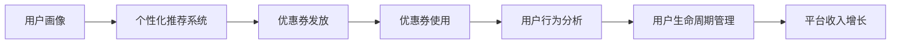

                 

## 1. 背景介绍

在知识付费的浪潮中，优惠券策略成为了吸引用户的重要手段。合理设计优惠券策略，不仅可以提升用户转化率，还能带动平台流量和收入增长。本文将从优惠券的设计、发放和监控三个维度，详细解析程序员如何高效地设计知识付费的优惠券策略。

## 2. 核心概念与联系

### 2.1 核心概念概述

- **优惠券**：一种折扣或促销方式，通过减免部分或全部费用，吸引用户购买或续订知识付费服务。
- **用户画像**：基于用户的属性、行为等数据，构建用户特征模型，用于个性化推荐和优惠券发放。
- **用户生命周期**：指用户与平台的交互过程中，从潜在用户到流失用户的全生命周期，分为获客、激活、留存、续订、流失五个阶段。
- **转化率**：指用户在看到优惠券后，实际购买或续订知识付费服务的比例。
- **个性化推荐**：利用算法推荐系统，根据用户画像推送最适合的优惠券，提升用户体验和转化率。

### 2.2 核心概念原理和架构的 Mermaid 流程图



- **用户画像**：通过收集用户的各类数据（如浏览记录、购买行为、活跃度等），构建用户画像，用于推荐系统个性化推荐优惠券。
- **个性化推荐系统**：根据用户画像，推送最优的优惠券，提升转化率。
- **优惠券发放**：根据推荐系统的建议，选择最适合的目标用户发放优惠券。
- **优惠券使用**：用户领取并使用优惠券后，平台根据用户行为进行后续的推荐和分析。
- **用户行为分析**：分析用户使用优惠券后的行为，评估优惠券的效果。
- **用户生命周期管理**：通过优惠券策略，提升用户各个生命周期阶段的表现，最终实现平台收入的增长。

## 3. 核心算法原理 & 具体操作步骤

### 3.1 算法原理概述

基于用户画像的优惠券策略，主要包含以下几个关键步骤：

1. **数据收集**：收集用户的基本信息和行为数据，构建用户画像。
2. **用户画像构建**：利用机器学习算法，将用户数据转化为高质量的特征向量。
3. **个性化推荐**：根据用户画像，使用推荐算法，推送最优的优惠券。
4. **优惠券发放**：选择最合适的高价值用户，发放优惠券。
5. **优惠券效果分析**：跟踪用户使用优惠券后的行为，评估优惠券的实际效果。

### 3.2 算法步骤详解

#### 3.2.1 数据收集

用户数据主要包括以下几类：

- **基本信息**：如年龄、性别、职业等。
- **行为数据**：如浏览时间、购买历史、活跃度等。
- **交互数据**：如点击、搜索、评论等行为。

通过数据收集，构建一个多维度的用户画像。

#### 3.2.2 用户画像构建

利用机器学习算法，将收集到的用户数据转化为特征向量。例如，可以使用TF-IDF算法计算用户的浏览兴趣，使用K-means算法对用户进行聚类分析。

#### 3.2.3 个性化推荐

使用协同过滤、内容推荐等算法，根据用户画像，推荐最适合的优惠券。例如，对于高活跃度的用户，可以推荐较为昂贵的高级课程；对于新用户，可以推荐一些免费试用课程。

#### 3.2.4 优惠券发放

根据个性化推荐的结果，选择最合适的高价值用户，发放优惠券。例如，对于最近登录频率较高的用户，可以发放一个月的会员券；对于购买过多个课程的用户，可以发放一定比例的课程折扣券。

#### 3.2.5 优惠券效果分析

通过A/B测试等方法，跟踪用户使用优惠券后的行为，评估优惠券的效果。例如，可以跟踪优惠券的领取率、使用率、购买转化率等指标。

### 3.3 算法优缺点

#### 3.3.1 优点

- **提升转化率**：通过个性化推荐，向高价值用户发放适合的优惠券，提升用户的购买转化率。
- **精准投放**：利用用户画像和推荐算法，确保优惠券被真正有需求的用户使用，避免浪费。
- **用户留存**：通过优惠券策略，增加用户的粘性，提升用户留存率。

#### 3.3.2 缺点

- **计算成本高**：构建用户画像和使用推荐算法，需要大量的计算资源和时间。
- **数据隐私问题**：收集和分析用户数据时，需要注意隐私保护，避免数据泄露。
- **过度依赖优惠券**：过度依赖优惠券可能导致用户对平台的认知偏差，影响长期营收。

### 3.4 算法应用领域

基于用户画像的优惠券策略，适用于各类知识付费平台，如在线教育、技能培训、知识库订阅等。通过精细化的用户画像和个性化推荐，提升平台的整体转化率和用户满意度。

## 4. 数学模型和公式 & 详细讲解 & 举例说明

### 4.1 数学模型构建

优惠券策略的数学模型主要包括以下几个关键部分：

1. **用户画像表示**：
   $$
   \mathbf{u} = (u_1, u_2, \ldots, u_n)
   $$
   其中，$u_i$ 表示用户画像的第 $i$ 个特征。

2. **个性化推荐算法**：
   $$
   \hat{y} = \text{model}(\mathbf{u})
   $$
   其中，$\text{model}$ 为推荐算法模型，$\hat{y}$ 为推荐结果。

3. **优惠券发放策略**：
   $$
   \text{发放策略}(\hat{y})
   $$
   根据推荐结果，选择最适合的优惠券发放。

4. **优惠券效果评估**：
   $$
   \text{效果评估}(\text{发放策略})
   $$
   评估优惠券策略的效果。

### 4.2 公式推导过程

以协同过滤算法为例，假设用户画像为向量 $\mathbf{u}$，推荐系统为目标函数 $f$，根据用户画像和目标函数，推荐结果 $\hat{y}$ 的计算公式为：
$$
\hat{y} = f(\mathbf{u})
$$
其中，$f$ 可以使用矩阵分解、神经网络等模型实现。

### 4.3 案例分析与讲解

#### 4.3.1 协同过滤算法

协同过滤算法是基于用户之间的相似度，推荐用户可能感兴趣的产品。例如，在电商平台上，可以根据用户历史购买记录，推荐其他用户购买过的商品。

#### 4.3.2 K-means聚类算法

K-means聚类算法可以将用户聚类为不同群体，根据不同群体的特征，推荐不同的优惠券。例如，对于年轻用户群体，可以推荐一些偏娱乐性的课程；对于中年用户群体，可以推荐一些职业技能提升的课程。

## 5. 项目实践：代码实例和详细解释说明

### 5.1 开发环境搭建

1. **安装Python和相关库**：
   ```bash
   sudo apt-get update
   sudo apt-get install python3 python3-pip python3-dev
   pip3 install scikit-learn pandas numpy scipy
   ```

2. **安装推荐系统框架**：
   ```bash
   pip3 install recommender-eng
   ```

3. **安装数据处理工具**：
   ```bash
   pip3 install pandas numpy scikit-learn sklearn-joblib
   ```

### 5.2 源代码详细实现

以下是使用Python和Scikit-learn实现协同过滤算法的代码示例：

```python
from sklearn.neighbors import NearestNeighbors
import pandas as pd
import numpy as np

# 构建用户画像
users = pd.read_csv('users.csv')
user_features = users[['age', 'gender', 'occupation']].values

# 构建推荐系统
model = NearestNeighbors(n_neighbors=5, algorithm='brute')
model.fit(user_features)

# 推荐优惠券
def recommend_coupon(user_features):
    distances, indices = model.kneighbors([user_features])
    recommended_users = users.iloc[indices[0]]
    return recommended_users

# 优惠券发放策略
def coupon_policy(recommended_users):
    # 根据推荐用户，发放优惠券
    # ...

# 优惠券效果评估
def coupon_effect(发放优惠券):
    # 跟踪用户使用优惠券后的行为
    # ...
```

### 5.3 代码解读与分析

- **用户画像构建**：使用Pandas读取用户数据，提取年龄、性别、职业等特征。
- **推荐系统实现**：使用NearestNeighbors算法构建推荐系统，根据用户特征进行相似度计算。
- **优惠券发放策略**：根据推荐结果，选择最合适的高价值用户，发放优惠券。
- **优惠券效果评估**：跟踪用户使用优惠券后的行为，评估优惠券的效果。

### 5.4 运行结果展示

- **用户画像示例**：
  ```python
  users.head()
  ```

- **推荐结果示例**：
  ```python
  recommended_users.head()
  ```

- **优惠券发放结果**：
  ```python
  发放优惠券
  ```

- **优惠券效果评估结果**：
  ```python
  优惠券效果分析
  ```

## 6. 实际应用场景

### 6.1 在线教育平台

在线教育平台可以使用优惠券策略，吸引新用户注册并购买课程。例如，对于新用户，可以发放7天免费试用券；对于老用户，可以发放一定的课程折扣券，促进续订。

### 6.2 技能培训平台

技能培训平台可以使用优惠券策略，提升用户技能培训的积极性。例如，对于有专业技能认证需求的用户，可以发放认证考试折扣券；对于普通用户，可以发放技能培训课程折扣券。

### 6.3 知识库订阅平台

知识库订阅平台可以使用优惠券策略，吸引用户订阅年度会员。例如，对于年度会员，可以发放额外的免费订阅月；对于首次订阅用户，可以发放一定的折扣券。

### 6.4 未来应用展望

未来，优惠券策略将结合更多的技术手段，如机器学习、深度学习等，进一步提升个性化推荐的效果。同时，结合区块链技术，增强优惠券的不可篡改性和安全性，保障用户权益。

## 7. 工具和资源推荐

### 7.1 学习资源推荐

- **书籍**：《推荐系统实战》，张皓，人民邮电出版社。
- **在线课程**：Coursera上的“Machine Learning”课程，由Andrew Ng主讲。
- **博客和文章**：Kaggle上关于推荐系统相关的博客和论文。

### 7.2 开发工具推荐

- **Python**：Python语言简单易用，支持多种数据处理和机器学习库，如Pandas、NumPy、Scikit-learn等。
- **推荐系统框架**：如RecSys，提供完整的推荐系统实现，支持协同过滤、基于内容的推荐等算法。

### 7.3 相关论文推荐

- **协同过滤算法**：“Collaborative Filtering for Implicit Feedback Datasets”，Daniel Lemire，Gus Brodley。
- **K-means聚类算法**：“A Density-Based Algorithm for Discovering Clusters in Large Spatial Datasets with Noise”，Michelle Gormley，Jaideep K. Bhattacharya。

## 8. 总结：未来发展趋势与挑战

### 8.1 研究成果总结

本文从优惠券策略的原理和实践出发，详细分析了用户画像、个性化推荐、优惠券发放和效果评估等关键环节。通过多个实际案例，展示了优惠券策略在知识付费平台中的应用，并给出了具体的代码实现和运行结果。

### 8.2 未来发展趋势

未来，优惠券策略将结合更多的技术手段，如机器学习、深度学习等，进一步提升个性化推荐的效果。同时，结合区块链技术，增强优惠券的不可篡改性和安全性，保障用户权益。

### 8.3 面临的挑战

优惠券策略在实际应用中，仍然面临以下挑战：

- **计算成本高**：构建用户画像和使用推荐算法，需要大量的计算资源和时间。
- **数据隐私问题**：收集和分析用户数据时，需要注意隐私保护，避免数据泄露。
- **过度依赖优惠券**：过度依赖优惠券可能导致用户对平台的认知偏差，影响长期营收。

### 8.4 研究展望

针对这些挑战，未来的研究方向包括：

- **高效推荐算法**：开发更高效的推荐算法，减少计算资源和时间。
- **隐私保护技术**：研究隐私保护技术，确保用户数据的安全性。
- **长效营收策略**：探索多样化的营收手段，减少对优惠券的依赖。

通过不断探索和优化，优惠券策略将更加精准和高效，为知识付费平台的健康发展提供有力支持。

## 9. 附录：常见问题与解答

**Q1: 如何构建高质量的用户画像？**

A: 构建高质量的用户画像，需要收集用户的基本信息和行为数据，并利用机器学习算法进行特征提取和模型训练。关键步骤包括：

- 收集用户数据：包括基本信息（如年龄、性别、职业等）、行为数据（如浏览记录、购买历史、活跃度等）和交互数据（如点击、搜索、评论等行为）。
- 数据预处理：清洗和处理数据，去除异常值和噪声，确保数据的完整性和准确性。
- 特征提取：选择合适的特征提取方法，如TF-IDF、PCA等，将用户数据转化为特征向量。
- 模型训练：选择合适的机器学习算法，如协同过滤、K-means聚类等，训练用户画像模型。

**Q2: 优惠券策略如何与个性化推荐结合？**

A: 优惠券策略与个性化推荐结合，可以通过以下步骤实现：

- 收集用户数据：包括用户的基本信息和行为数据，构建用户画像。
- 个性化推荐：利用推荐算法，如协同过滤、内容推荐等，推荐最适合的优惠券。
- 优惠券发放：根据推荐结果，选择最合适的高价值用户，发放优惠券。
- 优惠券效果评估：跟踪用户使用优惠券后的行为，评估优惠券的效果，并根据结果调整推荐策略。

**Q3: 如何处理用户数据隐私问题？**

A: 处理用户数据隐私问题，需要采取以下措施：

- 数据加密：在数据传输和存储过程中，使用加密技术保护用户数据的安全性。
- 匿名化处理：对用户数据进行匿名化处理，去除敏感信息，保护用户隐私。
- 数据访问控制：严格控制数据访问权限，确保只有授权人员能够访问用户数据。
- 法律合规：遵守相关法律法规，如GDPR、CCPA等，保护用户数据隐私。

通过采取这些措施，可以有效保护用户数据隐私，确保优惠券策略的安全性和可靠性。

**Q4: 如何提升优惠券策略的个性化推荐效果？**

A: 提升优惠券策略的个性化推荐效果，需要采用以下方法：

- 数据融合：将多维度的用户数据进行融合，构建更全面的用户画像。
- 推荐算法优化：选择更高效的推荐算法，如协同过滤、基于内容的推荐等，提升推荐效果。
- 用户反馈机制：建立用户反馈机制，收集用户使用优惠券后的反馈，不断调整和优化推荐策略。
- 实时推荐：结合实时数据分析，动态调整推荐策略，提升用户体验。

通过这些方法，可以显著提升优惠券策略的个性化推荐效果，提升用户满意度和转化率。

**Q5: 如何评估优惠券策略的效果？**

A: 评估优惠券策略的效果，需要采用以下指标：

- 优惠券领取率：衡量用户对优惠券的接受度。
- 优惠券使用率：衡量用户使用优惠券的频率。
- 购买转化率：衡量优惠券对用户购买的直接影响。
- 用户留存率：衡量优惠券对用户留存的长期影响。

通过这些指标，可以全面评估优惠券策略的效果，发现问题并进行优化。

综上所述，优惠券策略是知识付费平台吸引用户的重要手段，通过结合用户画像和个性化推荐，可以有效提升用户转化率和平台收入。同时，需要注意处理数据隐私问题，避免过度依赖优惠券，确保优惠券策略的健康发展。

