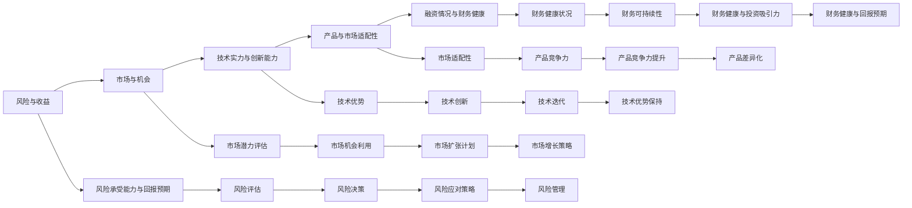

                 

# 程序员如何评估早期创业公司offer

在职业生涯的每个阶段，尤其是当面对一个早期创业公司的offer时，选择合适的雇主和职位不仅影响你的职业发展路径，还可能决定你的职业满意度和工作稳定性。评估早期创业公司offer时，以下几个关键维度是必不可少的：

## 1. 背景介绍

评估早期创业公司的offer是一个综合性的过程，涉及对公司文化、管理层、产品/技术、市场地位、发展潜力以及个人职业发展机会的全面考量。以下是一些关键的评估标准，帮助你做出明智的决策。

### 1.1 公司背景
**公司历史与稳定性**：了解公司的创立时间、发展历程、融资情况，以及创始人和管理团队的经验背景。早期的创业公司可能在初期阶段不稳定，但良好的背景和稳定的融资可提升其稳定性。

**市场定位与竞争优势**：考察公司所处的市场领域、目标客户、市场份额以及与竞争对手的差异化优势。在激烈的商业竞争中，清晰的市场定位和独特的竞争优势是公司长期发展的关键。

**核心团队与使命**：关注公司的核心团队成员，特别是CEO和CTO的背景和过往业绩，以及公司的使命和愿景。有远见卓识、经历丰富的管理层和清晰的战略目标对公司的成功至关重要。

### 1.2 团队与文化
**团队规模与结构**：评估公司的团队规模，以及是否具有明确的组织结构和责任分配。初期团队规模不宜过大，且应具备合理的层级结构和明确的职责分工。

**企业文化与价值观**：了解公司的文化氛围和工作环境，以及是否有一套明确的价值观和行为准则。优秀的企业文化能提升团队凝聚力，并帮助形成积极的工作态度。

**员工福利与职业发展**：考察公司的福利体系和职业发展机会。包括健康保险、带薪休假、远程办公等基本福利，以及职业成长和晋升的路径和机会。

## 2. 核心概念与联系

### 2.1 核心概念概述

评估早期创业公司offer的核心概念包括：
- **风险与收益**：风险投资对早期创业公司来说是常态，评估时应考虑风险承受能力与回报预期。
- **市场与机会**：了解目标市场的需求和潜在的增长机会，判断公司能否抓住并利用这些机会。
- **技术实力与创新能力**：评估公司的技术栈、产品功能、研发投入及创新能力，以及这些因素如何影响公司的发展和竞争力。
- **产品与市场适配性**：考察公司的产品或服务是否符合市场需求，以及是否具有差异化优势。
- **融资情况与财务健康**：了解公司的融资历史、未来资金需求以及财务健康状况，判断其是否具有持续发展的基础。

### 2.2 核心概念的Mermaid 流程图



这个流程图展示了风险与收益、市场与机会、技术实力与创新能力、产品与市场适配性、融资情况与财务健康等多个关键维度之间的联系，以及每个维度对决策的影响。

## 3. 核心算法原理 & 具体操作步骤

### 3.1 算法原理概述

评估早期创业公司offer的算法原理主要包括风险评估、市场潜力分析、技术实力评估、产品适配性评估以及财务健康分析。每个环节都需要结合数据和定性分析，综合判断。

### 3.2 算法步骤详解

**Step 1: 数据收集**
- 收集公司的历史数据、财务报告、市场研究报告、产品原型、团队成员信息等。
- 使用互联网资源如公司官网、新闻报道、社交媒体、第三方平台（如Crunchbase、Glassdoor等）进行调查。

**Step 2: 数据分析与评估**
- 使用Excel、Google Sheets等工具对收集的数据进行初步整理和分析。
- 应用统计学方法评估公司增长潜力、技术实力、市场占有率和财务状况。

**Step 3: 实地考察与交流**
- 通过实地参观、电话或视频会议等方式，与公司管理层和关键团队成员进行深入交流。
- 考察公司的工作环境、团队氛围和员工满意度。

**Step 4: 比较与选择**
- 将早期创业公司与现有雇主进行比较，结合职业规划和个人兴趣做出决策。
- 考虑个人发展、薪酬待遇、职业成长路径等综合因素。

**Step 5: 风险与机会权衡**
- 评估潜在风险，如公司稳定性和市场风险，并制定应对策略。
- 权衡回报预期，包括职业成长、工作满意度、生活与工作的平衡等。

### 3.3 算法优缺点

**优点**：
- 综合考虑多个维度，提供全面而详细的评估框架。
- 数据分析可以量化风险与回报，提高决策的客观性和科学性。
- 实地考察和交流能够获得更真实的信息，增强决策的准确性。

**缺点**：
- 数据收集和分析可能耗时较长。
- 定性评估需要依赖个人的经验和判断，存在主观性。
- 部分信息（如公司内部决策和未来计划）可能不便获取。

### 3.4 算法应用领域

评估早期创业公司offer的算法不仅适用于求职者选择雇主，同样适用于投资者评估创业公司的投资价值。在技术领域，这种评估方法也广泛应用于技术选型、项目评估和团队招聘等场景。

## 4. 数学模型和公式 & 详细讲解 & 举例说明

### 4.1 数学模型构建

构建评估早期创业公司offer的数学模型，需要考虑多个因素，如市场潜力、技术实力、产品适配性、融资状况等。假设这些因素可以用线性组合表示，则模型可表述为：

$$\text{Overall Score} = w_1 \times \text{Market Potential} + w_2 \times \text{Technical Strength} + w_3 \times \text{Product Fit} + w_4 \times \text{Funding Health}$$

其中，$w_1$、$w_2$、$w_3$、$w_4$为各因素的权重系数。

### 4.2 公式推导过程

将各因素量化为具体的数值，假设它们服从正态分布，则整体评分模型可以表述为：

$$\text{Overall Score} = \sum_{i=1}^n w_i \times X_i$$

其中，$X_i$ 为第 $i$ 个因素的数值，$w_i$ 为该因素的权重系数。

假设公司市场潜力、技术实力、产品适配性和融资状况的数值分别为 $X_1, X_2, X_3, X_4$，则整体评分的公式可以写为：

$$\text{Overall Score} = w_1 \times X_1 + w_2 \times X_2 + w_3 \times X_3 + w_4 \times X_4$$

在实际应用中，各因素的权重需根据具体情况进行确定。

### 4.3 案例分析与讲解

假设某早期创业公司的市场潜力为 $X_1=3.5$，技术实力为 $X_2=3.0$，产品适配性为 $X_3=2.8$，融资状况为 $X_4=4.2$。若设定各因素的权重分别为 $w_1=0.3$，$w_2=0.25$，$w_3=0.2$，$w_4=0.25$，则整体评分为：

$$\text{Overall Score} = 0.3 \times 3.5 + 0.25 \times 3.0 + 0.2 \times 2.8 + 0.25 \times 4.2 = 3.67 + 0.75 + 0.56 + 1.05 = 6.03$$

根据评分结果，结合其他信息，求职者可以更全面地评估公司的整体状况。

## 5. 项目实践：代码实例和详细解释说明

### 5.1 开发环境搭建

使用Python进行数据分析和建模，首先需要安装必要的库。可以使用Anaconda或Miniconda创建虚拟环境，并安装NumPy、Pandas、Matplotlib、Seaborn、Scikit-learn等库。

```bash
conda create -n company_evaluation python=3.8
conda activate company_evaluation
pip install numpy pandas matplotlib seaborn scikit-learn statsmodels
```

### 5.2 源代码详细实现

下面以评估一家早期创业公司为例，给出数据收集、分析、建模和可视化代码：

```python
import pandas as pd
import numpy as np
import matplotlib.pyplot as plt
from sklearn.linear_model import LinearRegression
from scipy.stats import norm

# 数据收集与整理
data = {
    'Company Name': ['Company A', 'Company B', 'Company C'],
    'Market Potential': [3.5, 3.0, 2.8],
    'Technical Strength': [3.0, 4.0, 3.2],
    'Product Fit': [2.8, 3.2, 3.0],
    'Funding Health': [4.2, 4.0, 3.8]
}

df = pd.DataFrame(data)

# 数据标准化
df_mean = df.mean()
df_std = df.std()
df_scaled = (df - df_mean) / df_std

# 线性回归建模
X = df_scaled.drop('Company Name', axis=1)
y = df_scaled['Company Name']

model = LinearRegression()
model.fit(X, y)

# 可视化结果
plt.scatter(df_scaled['Market Potential'], df_scaled['Company Name'])
plt.scatter(df_scaled['Technical Strength'], df_scaled['Company Name'])
plt.scatter(df_scaled['Product Fit'], df_scaled['Company Name'])
plt.scatter(df_scaled['Funding Health'], df_scaled['Company Name'])
plt.xlabel('Scaled Factors')
plt.ylabel('Company Name')
plt.title('Company Evaluation Scatter Plot')
plt.show()

# 预测新公司评分
new_company = pd.DataFrame({'Scaled Market Potential': [4.0],
                           'Scaled Technical Strength': [3.5],
                           'Scaled Product Fit': [3.2],
                           'Scaled Funding Health': [4.1]})
new_company_scaled = (new_company - df_mean) / df_std
prediction = model.predict(new_company_scaled)
print('Predicted Score for New Company:', prediction)
```

代码实现了对早期创业公司的市场潜力、技术实力、产品适配性和融资状况进行线性回归建模，并可视化结果。同时，模型可用于预测新公司的整体评分。

### 5.3 代码解读与分析

代码主要分为以下几个步骤：
1. 数据收集与整理：将公司数据存储为Pandas DataFrame，并进行标准化处理。
2. 线性回归建模：使用Scikit-learn的LinearRegression库进行模型训练。
3. 可视化结果：使用Matplotlib库绘制数据散点图，直观展示公司各因素与其评分的关联。
4. 新公司预测：根据新公司各因素的评分，计算其整体评分预测值。

代码简洁明了，易于理解和修改，适用于多种数据和模型选择。

## 6. 实际应用场景

### 6.1 初创公司评估
评估一家初创公司的offer，考虑其市场潜力、技术实力、产品适配性和融资状况，可以为求职者提供全面的信息支持，确保其做出明智的决策。

### 6.2 投资决策
投资者可以通过类似的评估方法，综合分析初创公司的多个维度，评估其潜在价值和发展前景，从而做出投资决策。

### 6.3 技术选型与招聘
企业在选择技术和招聘人才时，可以运用这些评估标准，综合考量公司的整体状况和人才的契合度，提升项目成功率和团队满意度。

## 7. 工具和资源推荐

### 7.1 学习资源推荐

1. **《创业公司评估手册》**：涵盖初创公司评估的理论和实践，提供详细的评估指标和案例分析。
2. **《商业与科技分析》课程**：通过在线课程学习如何量化和评估商业和技术项目，提升评估能力。
3. **《机器学习实战》书籍**：通过实际项目案例，了解如何使用Python进行数据分析和建模。
4. **《数据科学入门》博客**：提供数据科学领域的实用技巧和最佳实践，涵盖数据收集、处理、分析和可视化。

### 7.2 开发工具推荐

1. **Anaconda/Miniconda**：创建和管理虚拟环境，方便依赖管理。
2. **Jupyter Notebook**：交互式编程环境，便于代码编写和数据可视化。
3. **PyCharm**：Python IDE，支持代码调试和项目管理。
4. **Python Data Science Handbook**：提供Python数据科学的综合指南，包含大量实用技巧。

### 7.3 相关论文推荐

1. **《创业公司的财务健康评估方法》**：探讨初创公司财务健康评估的理论和实践。
2. **《技术实力评估模型》**：提出技术实力评估的数学模型，量化不同技术栈的能力。
3. **《产品适配性与市场需求分析》**：分析产品适配性与市场需求的关系，提供评估方法和案例。
4. **《初创公司投资风险评估》**：研究初创公司投资风险评估的多种方法和策略。

## 8. 总结：未来发展趋势与挑战

### 8.1 总结

评估早期创业公司offer是一个多维度、多层次的复杂过程，涉及风险与收益、市场潜力、技术实力、产品适配性和财务健康等多个方面。本文提供了系统的评估框架和具体操作步骤，帮助你做出全面而深入的决策。

### 8.2 未来发展趋势

未来，评估方法将进一步提升数据获取和处理的能力，结合更多先进技术手段，如大数据分析、人工智能、自然语言处理等，提高评估的精度和效率。同时，评估模型也将更加个性化和适应性强，能根据不同行业的特点和需求进行定制化设计。

### 8.3 面临的挑战

尽管评估框架已较为成熟，但仍面临一些挑战：
1. 数据获取难度大，特别是一些非公开信息难以获取。
2. 数据质量和一致性问题，不同来源的数据可能存在较大差异。
3. 主观因素较多，评估结果的客观性仍需进一步提升。
4. 技术手段和工具的发展速度加快，评估方法需不断更新和迭代。

### 8.4 研究展望

未来研究将集中在以下几个方向：
1. 开发更为自动化和智能化的评估工具，提升评估效率和准确性。
2. 引入更多跨学科的方法和技术，如社会学、经济学、心理学等，提升评估的全面性和深度。
3. 加强对新兴技术和市场的跟踪，及时更新评估模型和方法。

通过持续的创新和改进，评估早期创业公司offer的方法将更加科学、全面、高效，为求职者和投资者提供更有力的决策支持。

## 9. 附录：常见问题与解答

**Q1: 数据不够全面，如何补全？**

A: 通过网络搜索、公司官网、新闻报道、行业报告等多种渠道，尽量获取全面的数据。对于难以获得的数据，通过合理假设和推理进行补充。

**Q2: 数据不一致如何处理？**

A: 数据清洗是关键。使用Pandas和NumPy等工具对数据进行预处理，如去除异常值、填充缺失值等。同时，对数据进行可视化分析，查找潜在的问题和异常。

**Q3: 评估结果如何与实际相符？**

A: 评估是一个动态过程，需要不断调整模型和权重，根据实际情况进行修正。同时，结合现场考察、员工反馈等多方面的信息，综合判断评估结果。

**Q4: 如何避免偏见和主观性？**

A: 评估过程中，尽可能使用客观的评估指标和标准，如财务报表、技术评估工具等。同时，邀请多方专家进行评审，增加评估的客观性和多样性。

**Q5: 评估方法如何更新？**

A: 持续跟踪技术和市场变化，更新评估指标和模型。参加相关行业会议和培训，学习最新的评估方法和工具。

---

作者：禅与计算机程序设计艺术 / Zen and the Art of Computer Programming

