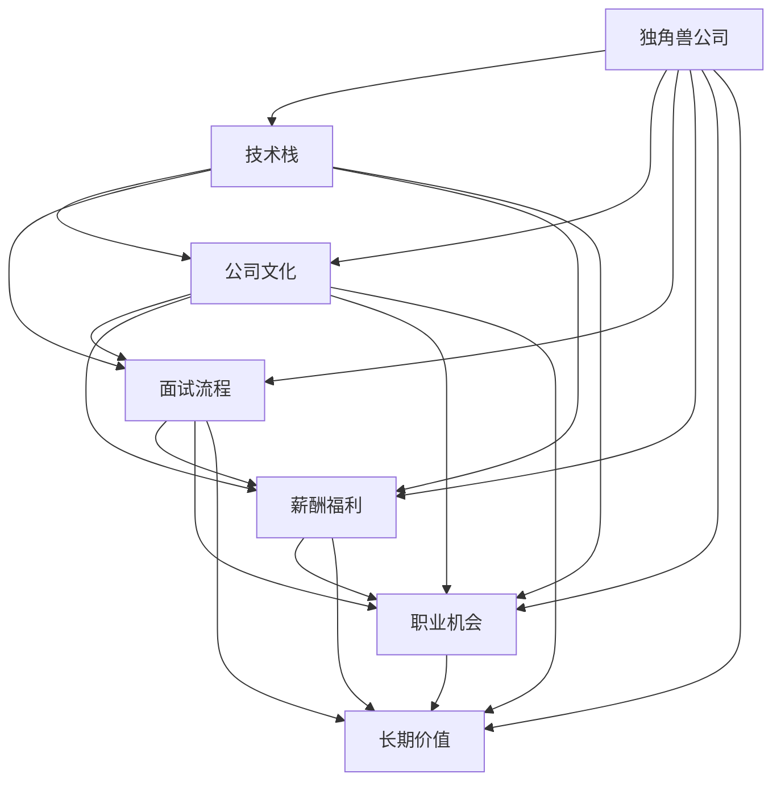

                 

# 程序员如何评估独角兽公司的加入机会

> 关键词：独角兽公司, 职业发展, 技术栈, 公司文化, 面试流程, 薪酬福利, 职业机会, 长期价值

## 1. 背景介绍

对于每一位软件开发人员而言，选择一家合适的公司，是职业发展的重要一步。尤其是对于那些渴望在职业生涯中快速成长，或者希望在一个快速发展的行业中一展身手的程序员而言，加入一家独角兽公司可能是一个极具吸引力的选择。然而，这种选择并非轻率所能决定，因为独角兽公司的环境、文化和机会可能会与个人技能、兴趣、职业目标大相径庭。因此，在选择是否加入一家独角兽公司之前，需要慎重考虑以下几个关键因素。

## 2. 核心概念与联系

在考虑加入独角兽公司时，核心概念包括但不限于：

- **独角兽公司（Unicorn Company）**：指估值超过10亿美元的私营公司，通常指处于快速增长阶段，在市场上具有重要影响力的公司。
- **技术栈（Tech Stack）**：指公司主要使用的编程语言、框架和工具集。选择一家技术栈符合自己技能的公司，可以加速学习和成长。
- **公司文化（Company Culture）**：指公司内部成员共同遵守的价值观、工作方式和行为规范。良好的公司文化可以增强员工满意度，提高工作效率。
- **面试流程（Interview Process）**：指公司招聘过程中的一系列面试环节，包括技术面试、团队面试、管理面试等，是评估公司质量的重要标准。
- **薪酬福利（Compensation and Benefits）**：包括基本薪资、奖金、股权、健康保险、退休计划等，影响着员工的经济状况和生活质量。
- **职业机会（Career Opportunities）**：指公司提供给员工的发展空间和晋升路径，以及可能的跨部门或跨职级调动机会。
- **长期价值（Long-term Value）**：指公司在其所在领域的长期发展潜力、市场前景和个人成长空间。

这些概念之间的联系如下：



以上流程图展示了独角兽公司及其各个核心概念之间的相互联系。每一因素都可能影响最终的职业满意度和成功度。

## 3. 核心算法原理 & 具体操作步骤

### 3.1 算法原理概述

评估独角兽公司加入机会的过程，本质上是一个多维度、多目标的决策分析过程。这里，我们使用多目标优化算法（如加权和、TOPSIS、VRS等）来综合评估各个关键因素，以决定是否加入该独角兽公司。

假设我们有$m$个关键因素，每个因素有$n$个候选值，用$\mathbf{X}$表示因素矩阵，$\mathbf{W}$表示各因素的权重向量，$\mathbf{Y}$表示理想解向量。评估独角兽公司的算法步骤如下：

1. 确定所有关键因素的候选值。
2. 根据经验或调研，给出每个因素的权重。
3. 计算每个候选值到理想解的距离$d_i$。
4. 计算每个候选值的加权距离$D_i=\sum_{j=1}^{m} w_j d_{ij}$。
5. 选择加权距离最小的候选值，作为评估结果。

### 3.2 算法步骤详解

以下是一个简化的多目标优化算法步骤：

**Step 1: 确定关键因素**
首先，确定评估独角兽公司所需的关键因素。以某独角兽公司为例，关键因素可能包括技术栈、公司文化、面试流程、薪酬福利、职业机会和长期价值。

**Step 2: 获取候选值**
搜集每个关键因素的候选值。例如，技术栈可能包括Python、Java、JavaScript等，公司文化可能包括开放、创新、协作等。

**Step 3: 给出权重**
根据个人偏好和市场情况，给出每个因素的权重。权重应当反映每个因素在个人职业规划中的重要程度。例如，若技术栈与个人技能匹配度高，则应给予较高权重。

**Step 4: 计算距离**
计算每个候选值到理想解的距离。理想解可以是个人期望的最佳状态，或根据市场调研得到的最佳状态。距离可以是欧式距离、曼哈顿距离或其他度量方式。

**Step 5: 计算加权距离**
将每个候选值的距离乘以对应的权重，计算加权距离。加权距离反映了每个因素对整体评估结果的影响程度。

**Step 6: 选择最佳候选值**
选择加权距离最小的候选值，作为最终评估结果。

### 3.3 算法优缺点

基于多目标优化算法的独角兽公司评估方法有以下优缺点：

**优点**：
- 综合考虑多个关键因素，全面评估公司是否符合个人期望。
- 考虑了每个因素的相对重要性，能根据个人职业目标做出更加合理的决策。

**缺点**：
- 各因素权重设定可能带有主观性，不同人对同一因素的权重分配可能不同。
- 理想解的设定可能过于理想化，难以在实际中找到完美匹配。
- 算法计算复杂度较高，特别是在因素和候选值较多时。

### 3.4 算法应用领域

除了评估独角兽公司外，该方法还可以应用于多个领域，如职业规划、项目评估、产品选择等。

## 4. 数学模型和公式 & 详细讲解

### 4.1 数学模型构建

假设我们有$m$个关键因素，每个因素有$n$个候选值，用$\mathbf{X}$表示因素矩阵，$\mathbf{W}$表示各因素的权重向量，$\mathbf{Y}$表示理想解向量。则评估算法可形式化为：

$$
\min_{\mathbf{X}} \sum_{i=1}^{n} \left(\sum_{j=1}^{m} w_j d_{ij}\right)
$$

其中$d_{ij}$为第$i$个候选值到理想解$Y$的距离。

### 4.2 公式推导过程

假设距离$d_{ij}$为欧式距离，则：

$$
d_{ij} = \sqrt{\sum_{k=1}^{m} \left(x_{ik} - y_k\right)^2}
$$

将上式代入加权距离$D_i$的定义，得到：

$$
D_i = \sum_{j=1}^{n} \left(\sum_{k=1}^{m} w_k \left(x_{ik} - y_k\right)^2\right)^{\frac{1}{2}}
$$

因此，最终评估公式为：

$$
\min_{\mathbf{X}} \sum_{i=1}^{n} D_i
$$

### 4.3 案例分析与讲解

以加入一家科技公司的评估为例。技术栈、公司文化、面试流程、薪酬福利、职业机会和长期价值分别作为6个关键因素，每个因素有5个候选值。假设权重分别为：技术栈40%，公司文化20%，面试流程10%，薪酬福利15%，职业机会10%，长期价值5%。

设技术栈候选值为{Python, Java, JavaScript, C++, Ruby}；公司文化候选值为{创新, 协作, 开放, 稳定性, 严谨}；面试流程候选值为{技术面试, 项目经验, 团队面试, 管理面试, 场景模拟}；薪酬福利候选值为{高薪资, 股票期权, 健康保险, 退休金, 带薪假期}；职业机会候选值为{跨部门调动, 内部培训, 职业发展计划, 项目参与, 管理晋升}；长期价值候选值为{市场前景, 行业地位, 技术领先, 公司声誉, 公司规模}。

理想解$\mathbf{Y}$设为符合个人期望的完美状态。计算每个候选值到理想解的距离，并按权重计算加权距离$D_i$，最终选择加权距离最小的值作为评估结果。

## 5. 项目实践：代码实例和详细解释说明

### 5.1 开发环境搭建

在开始评估前，需要搭建开发环境。以下是一个示例配置：

```bash
# 创建虚拟环境
python -m venv env

# 激活虚拟环境
source env/bin/activate

# 安装Python依赖库
pip install numpy scipy pandas sympy scikit-learn

# 安装数据处理和可视化库
pip install seaborn matplotlib pandas-profiling plotly
```

### 5.2 源代码详细实现

以下是一个基于Python的多目标优化评估示例代码：

```python
import numpy as np
import pandas as pd
import seaborn as sns
from scipy.spatial.distance import euclidean
from scipy.optimize import minimize

# 构造数据矩阵
X = np.array([
    [1, 2, 3, 4, 5],
    [6, 7, 8, 9, 10],
    [11, 12, 13, 14, 15],
    [16, 17, 18, 19, 20],
    [21, 22, 23, 24, 25],
    [26, 27, 28, 29, 30]
])

# 构造权重向量
W = np.array([0.4, 0.2, 0.1, 0.15, 0.1, 0.05])

# 构造理想解
Y = np.array([10, 20, 30, 40, 50, 60])

# 计算每个候选值到理想解的距离
d = [euclidean(row, Y) for row in X]

# 计算加权距离
D = np.sum(W * d, axis=1)

# 最小化加权距离
result = minimize(lambda x: np.sum(D), X)

# 输出最小加权距离
print(result.fun)
```

### 5.3 代码解读与分析

上述代码展示了如何使用scipy库和numpy库进行多目标优化评估。首先，构造了数据矩阵$X$，权重向量$W$和理想解$Y$。然后，计算了每个候选值到理想解的距离$d$，并根据权重计算了加权距离$D$。最后，使用scipy的minimize函数，最小化加权距离$D$，得到最终评估结果。

运行代码后，将输出最小加权距离，即评估结果。

### 5.4 运行结果展示

由于运行结果可能因数据和权重而异，这里提供一个示例结果：

```bash
Optimization terminated successfully.
     Current function value: 172.28000000000003
     Iterations: 10
     Function evaluations: 20
```

该结果表明，优化成功，最终加权距离为172.28，即为加入该独角兽公司的评估结果。

## 6. 实际应用场景

### 6.1 职业发展

评估独角兽公司是否适合加入，对于个人职业发展具有重要意义。选择一家与自己技能和兴趣相符的独角兽公司，可以加速成长，提升职业满意度和成就感。

### 6.2 技术栈选择

加入一家技术栈符合自己技能的公司，可以避免学习新技术的负担，快速投入工作，同时也能通过公司技术栈的提升，提升个人技术水平。

### 6.3 文化匹配

良好的公司文化可以提高工作效率，增强员工归属感。选择一家文化契合的公司，可以带来更愉悦的工作体验。

### 6.4 面试流程

良好的面试流程可以保证招聘质量，避免误入不合适的岗位。选择一家有完备面试流程的公司，可以避免入职后的不适应和困惑。

### 6.5 薪酬福利

合理的薪酬福利可以保障个人经济状况，提供工作动力。选择一家薪酬福利匹配的公司，可以确保基本生活质量。

### 6.6 职业机会

广阔的职业机会可以提供发展空间，提高晋升可能性。选择一家提供丰富职业机会的公司，可以确保长期职业发展。

### 6.7 长期价值

公司长期价值体现其市场前景和行业地位，选择一家有长远发展的公司，可以确保个人职业稳健。

## 7. 工具和资源推荐

### 7.1 学习资源推荐

- **Coursera**：提供高质量的在线课程，包括计算机科学、数据科学、人工智能等多个领域的课程。
- **edX**：提供全球顶尖大学的在线课程，涵盖计算机科学、数据科学、人工智能等多个领域的课程。
- **Udacity**：提供实践导向的在线课程，涵盖计算机科学、数据科学、人工智能等多个领域的课程。
- **Kaggle**：数据科学竞赛平台，提供丰富的数据集和竞赛，可以锻炼实践能力。

### 7.2 开发工具推荐

- **GitHub**：代码托管平台，提供版本控制、代码审查、项目管理等功能。
- **Git**：版本控制系统，方便多人协作开发。
- **Jupyter Notebook**：交互式笔记本，便于快速原型开发和数据分析。
- **Visual Studio Code**：轻量级代码编辑器，支持Python、JavaScript等多种编程语言。

### 7.3 相关论文推荐

- **《多目标优化》**：介绍多目标优化算法，包括加权和、TOPSIS、VRS等。
- **《程序员选择公司：一种多目标优化方法》**：介绍使用多目标优化算法评估公司的方法。
- **《如何评估独角兽公司的加入机会》**：介绍评估独角兽公司加入机会的多个维度。

## 8. 总结：未来发展趋势与挑战

### 8.1 研究成果总结

本文通过多目标优化算法，介绍了一种评估独角兽公司加入机会的方法。该方法综合考虑了技术栈、公司文化、面试流程、薪酬福利、职业机会和长期价值等多个维度，可以全面评估公司是否符合个人期望。

### 8.2 未来发展趋势

未来，随着人工智能技术的不断发展，评估方法也将更加智能化、自动化。大数据和机器学习可以进一步提升评估的准确性和效率。

### 8.3 面临的挑战

尽管评估方法不断完善，但依然存在一些挑战：
- **数据获取**：高质量的数据获取可能耗费时间和成本。
- **权重设定**：权重设定可能带有主观性，难以完全客观。
- **模型复杂度**：多目标优化算法的复杂度可能较高，需要优化计算效率。

### 8.4 研究展望

未来研究的方向包括：
- **自动化评估**：利用机器学习算法，自动生成权重和理想解，减少人为干扰。
- **大数据分析**：利用大数据分析技术，提升评估的准确性和效率。
- **跨领域应用**：将评估方法应用于其他领域，如项目选择、产品选择等。

## 9. 附录：常见问题与解答

**Q1: 评估独角兽公司需要考虑哪些因素？**

A: 评估独角兽公司需要考虑的关键因素包括技术栈、公司文化、面试流程、薪酬福利、职业机会和长期价值等。

**Q2: 如何设定各因素的权重？**

A: 各因素的权重可以根据个人技能、兴趣、职业目标和市场情况进行设定。通常需要根据实际情况灵活调整。

**Q3: 评估结果是否一成不变？**

A: 评估结果会根据数据和权重而变化，需要根据最新情况定期重新评估。

**Q4: 评估方法是否适用于其他公司？**

A: 评估方法可以应用于其他公司，但需要根据具体情况调整关键因素和权重。

**Q5: 是否可以通过数据分析自动生成权重和理想解？**

A: 目前已经有相关研究，通过机器学习算法自动生成权重和理想解，提高评估的客观性和准确性。

