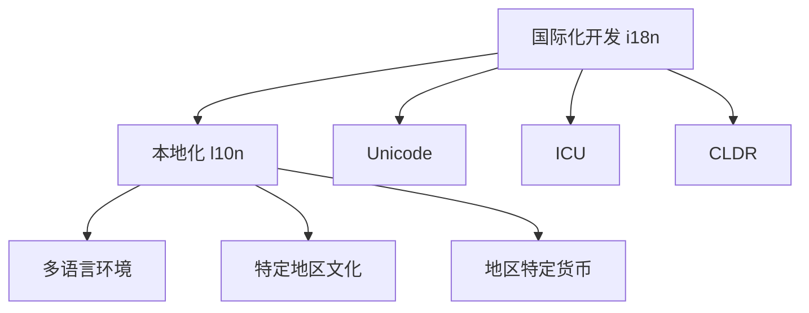

                 

# 程序员如何进行国际化发展

> 关键词：国际化开发, 跨文化交流, 多语言应用, 全球市场, 本地化实践

## 1. 背景介绍

在全球化的今天，软件开发已经不再局限于单一国家或地区。随着技术的进步和互联网的普及，跨国家、跨文化的应用程序需求日益增长。因此，程序员需要进行国际化（Internationalization, 简称 i18n）开发，以满足不同国家和地区的用户需求，提升应用在全球市场的竞争力。

国际化开发是一项复杂的任务，涉及语言、字符集、日期格式、货币单位等多个方面。通过规范和标准化的开发实践，程序员可以使得应用软件支持多语言和多地区，从而提升用户的使用体验。

## 2. 核心概念与联系

### 2.1 核心概念概述

为了更好地理解国际化开发，我们先介绍几个核心概念：

- **国际化开发（Internationalization, 简称 i18n）**：指在软件开发过程中，预先设计应用程序以支持多语言和文化环境，使其能够自动适应不同国家和地区的语言和字符集。

- **本地化（Localization, 简称 l10n）**：指将国际化开发后的应用程序根据特定地区的语言、文化、货币等进行定制，以适应特定市场的用户需求。

- **Unicode**：是国际上通用的字符集标准，支持全球各种语言的文字表示，是国际化开发的基础。

- **ICU (International Components for Unicode)**：是开放源代码库，提供了一系列国际化相关的组件和工具，包括日期时间、货币转换、字符串处理等。

- **CLDR (Common Locale Data Repository)**：是一个多语言数据交换标准，用于描述全球不同地区的语言、地区和货币等信息，是本地化开发的重要参考。

这些概念之间的联系可以用以下 Mermaid 流程图来展示：



这个流程图展示了一体化的国际化开发流程：通过国际化开发，应用程序支持多语言和多地区环境；通过本地化，应用程序根据特定地区的语言、文化、货币等进行定制，以适应特定市场的用户需求。

## 3. 核心算法原理 & 具体操作步骤

### 3.1 算法原理概述

国际化开发的算法原理相对简单，核心在于字符集处理和文本格式化。应用程序需支持Unicode字符集，以兼容全球各种语言的字符。文本格式化则需支持不同语言的文字排列和日期时间格式转换，以适应不同地区的用户习惯。

具体来说，国际化开发主要涉及以下几个方面：

- 字符集支持：应用程序需支持Unicode字符集，以兼容全球各种语言的字符。
- 文本格式化：应用程序需支持不同语言的文字排列和日期时间格式转换，以适应不同地区的用户习惯。
- 货币转换：应用程序需支持多种货币单位的显示和计算。
- 数据存储：应用程序需支持不同地区的数据存储格式，如时间戳、日期格式等。

### 3.2 算法步骤详解

以下是进行国际化开发的主要步骤：

**Step 1: 设计多语言支持架构**
- 使用Unicode字符集，支持全球各种语言的字符。
- 设计通用的接口和数据格式，支持多种语言和地区。

**Step 2: 实现本地化组件**
- 引入国际化组件库，如ICU，处理文本格式化和日期时间转换等。
- 实现货币转换函数，支持多种货币单位的显示和计算。

**Step 3: 实现多语言环境切换**
- 设计语言切换机制，允许用户选择或自动检测语言环境。
- 设计用户界面，支持多语言环境的文字排列和字体渲染。

**Step 4: 进行本地化测试**
- 在不同地区和语言环境下测试应用程序，确保应用程序能够正常运行。
- 根据测试结果调整本地化配置，优化用户体验。

**Step 5: 发布和维护**
- 将应用程序发布到全球市场，根据用户反馈持续改进和维护。

### 3.3 算法优缺点

国际化开发具有以下优点：

- **提升用户体验**：支持多语言和多地区环境，满足不同国家和地区用户的需求，提升用户的使用体验。
- **拓展市场**：支持全球市场，有助于拓展应用程序的市场范围，增加用户群。
- **标准化**：遵循国际标准，如Unicode、ICU等，使得应用程序具有更高的可靠性和兼容性。

同时，国际化开发也存在一些缺点：

- **开发复杂**：国际化开发需要考虑多种语言和地区的环境，开发复杂度较高。
- **维护成本高**：应用程序需持续进行本地化维护，以适应不同市场的需求。
- **开发周期长**：国际化开发需要大量的时间和精力，开发周期较长。

### 3.4 算法应用领域

国际化开发广泛应用于各种应用程序中，特别是以下领域：

- **移动应用**：支持多语言和多地区环境，提升全球用户的体验。
- **网站和Web应用**：支持多语言环境，吸引全球用户访问。
- **桌面应用**：支持多语言和多地区环境，满足全球用户的需求。
- **嵌入式系统**：支持多语言环境，适应全球市场的需求。

## 4. 数学模型和公式 & 详细讲解 & 举例说明

### 4.1 数学模型构建

在国际化开发中，我们主要涉及以下数学模型：

- **Unicode字符集**：支持全球各种语言的字符，通过编码转换实现字符的显示。
- **日期时间格式化**：将本地时间转换为国际时间，支持不同语言的文字排列。
- **货币转换**：支持多种货币单位的显示和计算。

### 4.2 公式推导过程

以下是几个关键的公式推导过程：

1. **Unicode字符集编码转换**
   - 假设原始字符集为 $C$，目标字符集为 $T$，则字符集转换公式为：
   $$
   T = f(C)
   $$

2. **日期时间格式化**
   - 假设原始日期时间为 $D$，目标日期时间为 $D'$，则日期时间转换公式为：
   $$
   D' = g(D)
   $$

3. **货币转换**
   - 假设原始货币为 $M$，目标货币为 $M'$，则货币转换公式为：
   $$
   M' = h(M)
   $$

### 4.3 案例分析与讲解

以下是一个简单的案例：假设我们有一款全球销售的应用程序，需要在美国、中国、印度等地区销售。我们首先对应用程序进行国际化开发，确保其支持多语言和多地区环境。然后在各个地区进行本地化，根据不同地区的语言、文化和货币等进行定制。

- **国际化开发**：
  - 使用Unicode字符集，支持全球各种语言的字符。
  - 设计通用的接口和数据格式，支持多种语言和地区。

- **本地化**：
  - 在美国，我们将日期格式设置为MM/DD/YYYY。
  - 在中国，我们将日期格式设置为YYYY-MM-DD。
  - 在印度，我们将日期格式设置为DD/MM/YYYY。
  - 在美国，我们显示货币为USD。
  - 在中国，我们显示货币为CNY。
  - 在印度，我们显示货币为INR。

通过这些操作，我们使得应用程序能够适应不同地区的用户需求，提升用户体验，拓展全球市场。

## 5. 项目实践：代码实例和详细解释说明

### 5.1 开发环境搭建

在进行国际化开发时，我们需要以下开发环境：

- **编程语言**：Python、Java等。
- **国际化组件库**：ICU、Boost.Locale等。
- **开发工具**：Visual Studio、IntelliJ IDEA等。

### 5.2 源代码详细实现

以下是一个简单的Python代码实例，展示如何使用ICU库进行日期时间格式化：

```python
import icu

# 创建日期时间格式化器
formatter = icu.DateTimeFormatter("MM/dd/yyyy")
formatter.setLocale(icu.Locale("en_US"))

# 格式化日期时间
date = icu.DateTime("2023-01-01")
formatted_date = formatter.format(date)
print(formatted_date)
```

### 5.3 代码解读与分析

以上代码展示如何使用ICU库对日期时间进行格式化。具体步骤如下：

1. 创建日期时间格式化器，使用"MM/dd/yyyy"格式，并设置语言环境为"en_US"。
2. 创建一个日期时间对象，表示2023年1月1日。
3. 使用格式化器对日期时间进行格式化，输出格式为"MM/dd/yyyy"。

通过以上操作，我们实现了对日期时间的国际化处理。

### 5.4 运行结果展示

运行上述代码，输出结果为"01/01/2023"，即美国日期时间格式。

## 6. 实际应用场景

### 6.1 全球化企业

国际化开发对于全球化企业至关重要。通过支持多语言和多地区环境，企业可以拓展全球市场，提升品牌影响力。

例如，某全球化企业开发了一款全球销售的应用程序，支持包括中文、英文、日文、德文等多种语言。在各个地区，企业根据当地语言和文化进行本地化，确保应用程序能够适应不同市场的需求，从而提升用户体验和市场竞争力。

### 6.2 跨国电商平台

跨国电商平台需要支持多语言和多地区环境，以吸引全球用户。例如，某跨国电商平台支持英文、中文、日文等多种语言，并根据不同地区的文化和货币等进行本地化，从而提升用户体验和交易效率。

### 6.3 国际教育

国际教育需要支持多语言环境，以适应不同国家和地区的教育需求。例如，某在线教育平台支持英文、中文、法文等多种语言，并根据不同地区的教育体系和文化进行本地化，从而提升教育效果和用户体验。

## 7. 工具和资源推荐

### 7.1 学习资源推荐

为了帮助程序员系统掌握国际化开发的理论基础和实践技巧，这里推荐一些优质的学习资源：

1. **《Unicode标准》**：详细介绍了Unicode字符集的标准，是国际化开发的基础。
2. **ICU官方文档**：提供了详细的ICU库使用说明，包括日期时间、字符串处理等。
3. **Boost.Locale官方文档**：提供了Boost.Locale库的使用说明，包括本地化、字符集转换等。
4. **《Java国际化和本地化编程指南》**：介绍如何在Java中进行国际化开发和本地化。
5. **《Python国际化开发指南》**：介绍如何在Python中进行国际化开发和本地化。

通过这些资源的学习实践，相信程序员能够快速掌握国际化开发的精髓，并用于解决实际的国际化问题。

### 7.2 开发工具推荐

高效的开发离不开优秀的工具支持。以下是几款用于国际化开发的工具：

1. **Visual Studio**：支持多语言环境开发，提供了丰富的国际化开发工具。
2. **IntelliJ IDEA**：支持多语言环境开发，提供了丰富的国际化开发工具。
3. **NetBeans**：支持多语言环境开发，提供了丰富的国际化开发工具。
4. **Xcode**：支持多语言环境开发，提供了丰富的国际化开发工具。
5. **Eclipse**：支持多语言环境开发，提供了丰富的国际化开发工具。

合理利用这些工具，可以显著提升国际化开发的效率，加快创新迭代的步伐。

### 7.3 相关论文推荐

国际化开发的研究源于学界的持续研究。以下是几篇奠基性的相关论文，推荐阅读：

1. **《Unicode: The Character Encoding Standard》**：详细介绍了Unicode字符集的标准，是国际化开发的基础。
2. **《International Components for Unicode》**：介绍了ICU库的使用和实现原理，是国际化开发的重要工具。
3. **《Locale-Aware Software Engineering》**：介绍了国际化开发的工程实践，包括设计、开发、测试等。
4. **《Internationalization of Software》**：介绍了国际化开发的技术实现，包括字符集转换、日期时间格式化等。
5. **《Localization of Software in the Global Market》**：介绍了本地化开发的技术实现，包括多语言环境切换、用户界面定制等。

这些论文代表了大规模国际化开发的研究脉络，通过学习这些前沿成果，可以帮助程序员把握国际化开发的前沿方向，激发更多的创新灵感。

## 8. 总结：未来发展趋势与挑战

### 8.1 总结

本文对国际化开发的背景、核心概念、算法原理、具体操作步骤进行了全面系统的介绍。首先阐述了国际化开发的重要性和应用场景，明确了国际化开发在软件开发中的独特价值。其次，从原理到实践，详细讲解了国际化开发的数学模型和具体步骤，给出了国际化任务开发的完整代码实例。同时，本文还广泛探讨了国际化开发在企业、电商、教育等多个行业领域的应用前景，展示了国际化开发的巨大潜力。此外，本文精选了国际化开发的各类学习资源，力求为程序员提供全方位的技术指引。

通过本文的系统梳理，可以看到，国际化开发已经成为软件开发的重要组成部分，极大地拓展了软件应用的边界，提升了软件产品的全球竞争力。未来，伴随国际化开发技术的持续演进，软件产品必将在更广阔的市场中发挥更大的作用，深刻影响人类的生产生活方式。

### 8.2 未来发展趋势

展望未来，国际化开发将呈现以下几个发展趋势：

1. **技术工具的不断进步**：新的国际化开发工具和技术不断涌现，如自动语言检测、机器翻译等，使得国际化开发更加高效和自动化。
2. **多语言处理能力增强**：越来越多的应用程序将支持多种语言，包括多语言混排、多语言文本处理等，使得用户体验更加丰富和多样。
3. **本地化服务的提升**：基于云服务的本地化服务将更加普及，如自动翻译、语音识别等，使得本地化开发更加便捷和高效。
4. **文化因素的考虑**：在国际化开发中，将更加注重文化因素的考虑，如字体选择、颜色搭配等，使得应用程序更加符合当地文化和习惯。
5. **自动化和智能化**：通过机器学习和自然语言处理技术，自动化和智能化程度将不断提高，使得国际化开发更加智能化和自动化。

以上趋势凸显了国际化开发的广阔前景。这些方向的探索发展，必将进一步提升国际化开发的质量和效率，使得软件开发更加全面和智能化。

### 8.3 面临的挑战

尽管国际化开发已经取得了瞩目成就，但在迈向更加智能化、普适化应用的过程中，它仍面临着诸多挑战：

1. **开发复杂度高**：国际化开发涉及多种语言和地区的环境，开发复杂度较高。
2. **维护成本高**：应用程序需持续进行本地化维护，以适应不同市场的需求。
3. **开发周期长**：国际化开发需要大量的时间和精力，开发周期较长。
4. **技术标准化问题**：不同语言和文化之间存在差异，使得标准化问题更加复杂。
5. **资源消耗高**：国际化开发需要大量的计算资源和时间，资源消耗较高。

### 8.4 未来突破

面对国际化开发所面临的种种挑战，未来的研究需要在以下几个方面寻求新的突破：

1. **自动化工具的研发**：开发更智能、更高效的自动化工具，如自动语言检测、自动翻译等，使得国际化开发更加便捷和高效。
2. **本地化服务的优化**：优化本地化服务，提供更丰富的本地化功能，如多语言文本处理、多语言混排等，使得本地化开发更加智能化。
3. **文化因素的融合**：在国际化开发中，更加注重文化因素的融合，如字体选择、颜色搭配等，使得应用程序更加符合当地文化和习惯。
4. **智能化和自动化的进一步提升**：通过机器学习和自然语言处理技术，进一步提升国际化开发的质量和效率，使得开发更加智能化和自动化。

这些研究方向的探索，必将引领国际化开发技术迈向更高的台阶，为构建全面、智能化的国际化软件产品铺平道路。面向未来，国际化开发技术还需要与其他人工智能技术进行更深入的融合，如知识表示、因果推理、强化学习等，多路径协同发力，共同推动软件技术的进步。只有勇于创新、敢于突破，才能不断拓展国际化开发技术的边界，让软件产品更好地服务于全球市场。

## 9. 附录：常见问题与解答

**Q1：什么是国际化开发？**

A: 国际化开发（Internationalization, 简称 i18n）是指在软件开发过程中，预先设计应用程序以支持多语言和文化环境，使其能够自动适应不同国家和地区的语言和字符集。

**Q2：如何实现国际化开发？**

A: 实现国际化开发需要设计通用的接口和数据格式，支持多种语言和地区。使用Unicode字符集，支持全球各种语言的字符。引入国际化组件库，如ICU、Boost.Locale等，处理文本格式化和日期时间转换等。设计语言切换机制，允许用户选择或自动检测语言环境。设计用户界面，支持多语言环境的文字排列和字体渲染。

**Q3：国际化开发有哪些优点和缺点？**

A: 国际化开发的优点包括提升用户体验，拓展市场，标准化等。缺点包括开发复杂度高，维护成本高，开发周期长等。

**Q4：如何进行本地化开发？**

A: 本地化开发（Localization, 简称 l10n）指将国际化开发后的应用程序根据特定地区的语言、文化、货币等进行定制，以适应特定市场的用户需求。在本地化开发中，需要根据不同地区的语言、文化和货币等进行定制，如日期时间格式转换，货币单位显示等。

**Q5：如何应对国际化开发中的挑战？**

A: 应对国际化开发中的挑战需要开发更智能、更高效的自动化工具，优化本地化服务，注重文化因素的融合，进一步提升智能化和自动化的程度等。

---

作者：禅与计算机程序设计艺术 / Zen and the Art of Computer Programming

