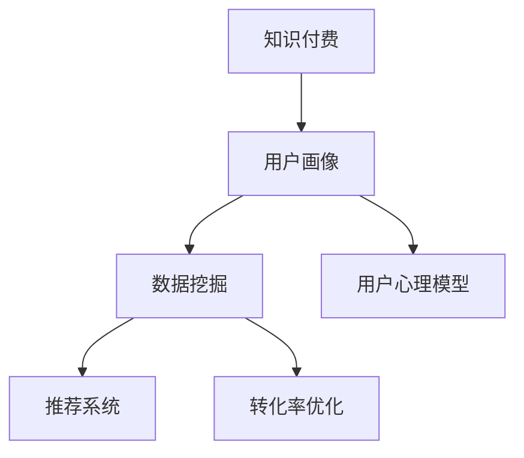

                 

# 程序员如何进行知识付费的用户画像分析

> 关键词：知识付费, 程序员, 用户画像, 数据分析, 行为研究, 转化率优化, 心理模型

## 1. 背景介绍

### 1.1 问题由来
随着互联网和移动设备的普及，知识付费平台逐渐成为程序员获取新知识、提升技能的重要渠道。这些平台提供了从编程技术到职业规划的各类课程和教程，极大满足了程序员不断学习的需求。然而，知识付费市场的高度竞争和内容同质化问题，使得用户流失率高、转化率低，难以持续发展。

### 1.2 问题核心关键点
如何提升知识付费平台的用户粘性，提高转化率，成为当前亟待解决的问题。核心在于全面理解用户的行为特征和心理动机，从而精准定位产品策略和运营手段。本文将从用户画像的角度，详细分析程序员在知识付费平台上的行为模式，提供具体的策略和建议。

### 1.3 问题研究意义
了解程序员用户画像，有助于知识付费平台制定更有效的市场策略，提升用户体验和平台收益。对于追求个人成长和职业发展的程序员而言，精准的知识推荐和个性化服务将极大提升学习效率和满意度。

## 2. 核心概念与联系

### 2.1 核心概念概述

为更好地理解程序员知识付费平台的用户画像分析方法，本节将介绍几个密切相关的核心概念：

- **知识付费**：指通过互联网平台向用户提供付费知识的商业模式，如在线课程、电子书、视频教程等。

- **用户画像**：通过收集用户行为数据，建立用户特征模型，帮助企业精准营销和个性化服务。

- **数据挖掘**：从用户行为数据中提取有价值的信息，发现用户需求和行为模式的过程。

- **推荐系统**：根据用户兴趣和行为数据，自动推荐相关内容的技术。

- **转化率优化**：通过优化产品设计和运营策略，提升用户从浏览到购买的行为转化率。

- **用户心理模型**：从心理学角度研究用户需求和行为特征，指导产品设计和营销策略。

这些核心概念之间的逻辑关系可以通过以下Mermaid流程图来展示：



这个流程图展示了一系列紧密相关的概念及其作用：

1. **知识付费**：为后续分析提供数据基础。
2. **用户画像**：根据数据挖掘结果构建用户特征模型。
3. **数据挖掘**：从行为数据中提取有价值的信息。
4. **推荐系统**：利用用户画像和数据挖掘结果，推荐相关内容。
5. **转化率优化**：通过改进产品设计，提升用户购买意愿。
6. **用户心理模型**：从心理学角度解释用户行为和需求。

这些概念共同构成了知识付费平台的运营框架，帮助平台更好地理解用户需求和行为，提升用户满意度和平台收益。

## 3. 核心算法原理 & 具体操作步骤
### 3.1 算法原理概述

程序员知识付费平台的用户画像分析，主要依赖于数据分析和机器学习技术。核心算法原理如下：

1. **数据收集**：通过平台日志、用户行为数据等收集大量用户数据。
2. **数据预处理**：清洗、去重、特征提取等步骤，将数据转换为可用于分析的形式。
3. **用户画像构建**：通过聚类、分类等算法，根据用户行为特征构建用户画像。
4. **推荐系统优化**：利用用户画像和历史行为数据，优化推荐算法，提升内容相关性和用户满意度。
5. **转化率提升**：根据用户画像和心理模型，设计个性化的营销策略，提高用户转化率。

### 3.2 算法步骤详解

**Step 1: 数据收集和预处理**
- 收集平台用户的数据，包括注册信息、浏览记录、点击率、购买行为等。
- 清洗数据，去除噪声和无关数据，保证数据质量。
- 提取特征，如用户活跃度、学习频率、付费偏好等。

**Step 2: 用户画像构建**
- 使用K-Means、DBSCAN等聚类算法，将用户分为不同群体，构建用户画像。
- 使用决策树、随机森林等分类算法，识别不同群体的特征和行为模式。

**Step 3: 推荐系统优化**
- 基于协同过滤、基于内容的推荐算法，构建推荐系统。
- 利用用户画像，优化推荐模型，提高推荐的相关性和精准度。

**Step 4: 转化率提升**
- 分析用户行为和心理模型，设计个性化营销策略。
- 通过A/B测试、多变量测试等方法，评估策略效果，持续优化。

### 3.3 算法优缺点

程序员知识付费平台用户画像分析的优势在于：
1. 数据驱动：通过数据分析构建用户画像，提高决策的科学性和准确性。
2. 精准营销：根据用户画像和心理模型，制定个性化的营销策略，提升用户粘性。
3. 提升效率：优化推荐算法，减少信息过载，提升用户体验和转化率。

然而，也存在以下缺点：
1. 数据隐私：用户数据涉及隐私问题，如何保护用户数据安全，需要严格的数据管理措施。
2. 数据质量：数据收集和预处理过程中，数据缺失、噪声等问题，可能影响分析结果的准确性。
3. 用户行为复杂性：程序员用户行为复杂多变，单一的特征模型可能难以全面覆盖。
4. 动态变化：用户需求和行为会随时间变化，模型需要定期更新以保持有效。

尽管存在这些局限性，但数据驱动的用户画像分析，仍是大数据时代知识付费平台不可或缺的重要工具。

### 3.4 算法应用领域

程序员知识付费平台的用户画像分析，广泛应用于以下领域：

1. **个性化推荐**：根据用户画像，优化推荐系统，提升用户满意度和平台收益。
2. **用户流失预测**：分析用户流失原因，提前采取措施，降低流失率。
3. **新用户获取**：利用心理模型，设计吸引新用户的策略，提升平台增长速度。
4. **产品迭代优化**：根据用户反馈和行为数据，指导产品设计和功能改进。
5. **广告投放优化**：根据用户画像，优化广告投放策略，提高广告转化率。

这些应用场景展示了用户画像分析在知识付费平台中的广泛价值。通过精准的画像和个性化的服务，知识付费平台能够更好地满足用户需求，提升市场竞争力。

## 4. 数学模型和公式 & 详细讲解 & 举例说明（备注：数学公式请使用latex格式，latex嵌入文中独立段落使用 $$，段落内使用 $)
### 4.1 数学模型构建

程序员知识付费平台的用户画像分析，可以通过以下数学模型来描述：

**用户行为数据**：
$$
D = \{ (u_i, b_i, c_i, p_i) \}_{i=1}^N
$$

其中 $u_i$ 为第 $i$ 个用户，$b_i$ 为浏览记录，$c_i$ 为点击记录，$p_i$ 为付费记录。

**用户画像特征**：
$$
F = \{ (u_i, x_i) \}_{i=1}^N
$$

其中 $x_i$ 为第 $i$ 个用户的特征向量，可以包括活跃度、学习频率、付费偏好等。

**推荐系统模型**：
$$
\hat{y} = f(\theta, x)
$$

其中 $\hat{y}$ 为推荐内容的预测值，$\theta$ 为推荐模型的参数，$x$ 为用户画像特征。

### 4.2 公式推导过程

**用户行为分析**：
- 计算用户活跃度 $A_i$：
$$
A_i = \frac{\sum_{j=1}^m c_{ij}}{\sum_{j=1}^m b_{ij}}
$$

其中 $m$ 为用户浏览和点击记录的数量。

- 计算用户学习频率 $L_i$：
$$
L_i = \frac{\sum_{j=1}^n p_{ij}}{m}
$$

其中 $n$ 为用户付费记录的数量。

**用户画像构建**：
- 使用K-Means算法，将用户分为 $K$ 个簇，每个簇的特征向量为：
$$
\mu_k = \frac{1}{n_k} \sum_{i \in C_k} x_i
$$

其中 $C_k$ 为第 $k$ 个簇的用户集合，$n_k$ 为簇中用户的数量。

- 利用决策树分类算法，对不同簇进行分类，输出每个簇的特征：
$$
\hat{y}_k = g(x_k)
$$

其中 $g$ 为决策树分类函数。

**推荐系统优化**：
- 利用协同过滤算法，计算用户 $i$ 和物品 $j$ 的相似度 $s_{ij}$：
$$
s_{ij} = \frac{1}{\sqrt{c_i + c_j}} \sum_{k=1}^{N_k} x_k \cdot r_{ik} \cdot r_{kj}
$$

其中 $N_k$ 为物品数量，$r_{ik}$ 为物品 $k$ 的点击率。

- 基于内容的推荐算法，计算物品 $j$ 与用户画像特征的匹配度：
$$
c_j = \sum_{k=1}^D a_k \cdot x_k \cdot r_{kj}
$$

其中 $a_k$ 为物品 $k$ 的属性向量。

### 4.3 案例分析与讲解

以某程序员知识付费平台为例，对用户画像分析的具体应用进行讲解：

**案例背景**：
某程序员知识付费平台有大量用户注册，但用户流失率高，转化率低。平台希望通过用户画像分析，提升用户体验和平台收益。

**数据收集**：
平台收集了用户注册信息、浏览记录、点击率、付费行为等数据。

**数据预处理**：
对数据进行清洗和去重，提取用户活跃度、学习频率、付费偏好等特征。

**用户画像构建**：
使用K-Means算法，将用户分为高效学习型、娱乐型、工作导向型等不同群体。

**推荐系统优化**：
利用协同过滤和基于内容的推荐算法，优化推荐模型，提升推荐的相关性和精准度。

**转化率提升**：
根据用户画像和心理模型，设计个性化营销策略，如针对高效学习型用户推荐深入课程，针对娱乐型用户推荐趣味视频等。

最终，平台的用户活跃度和转化率显著提升，用户满意度显著提高。

## 5. 项目实践：代码实例和详细解释说明
### 5.1 开发环境搭建

在进行用户画像分析的实践前，我们需要准备好开发环境。以下是使用Python进行数据分析和机器学习开发的常见环境配置流程：

1. 安装Anaconda：从官网下载并安装Anaconda，用于创建独立的Python环境。

2. 创建并激活虚拟环境：
```bash
conda create -n data-env python=3.8 
conda activate data-env
```

3. 安装相关库：
```bash
conda install pandas numpy scikit-learn scikit-optimize matplotlib jupyter notebook
```

4. 安装机器学习框架：
```bash
pip install tensorflow keras
```

5. 安装可视化工具：
```bash
pip install seaborn plotly
```

完成上述步骤后，即可在`data-env`环境中开始数据分析和机器学习实践。

### 5.2 源代码详细实现

下面我们以程序员知识付费平台为例，给出用户画像分析的完整代码实现。

首先，定义数据处理和特征提取函数：

```python
import pandas as pd
from sklearn.preprocessing import StandardScaler
from sklearn.cluster import KMeans

def load_data(file_path):
    return pd.read_csv(file_path)

def preprocess_data(data):
    # 数据清洗和预处理
    # 例如，去除缺失值、重复记录等
    data = data.dropna()
    data = data.drop_duplicates()

    # 特征提取
    # 例如，计算用户活跃度、学习频率等特征
    data['active'] = data['click_count'] / data['browse_count']
    data['study_freq'] = data['purchase_count'] / data['browse_count']

    # 标准化处理
    data['active'] = StandardScaler().fit_transform(data['active'].values.reshape(-1, 1))
    data['study_freq'] = StandardScaler().fit_transform(data['study_freq'].values.reshape(-1, 1))

    return data

def cluster_data(data, k):
    # 使用K-Means算法聚类
    kmeans = KMeans(n_clusters=k, random_state=42)
    kmeans.fit(data[['active', 'study_freq']])
    labels = kmeans.labels_

    return labels, kmeans
```

接着，定义推荐系统优化函数：

```python
from sklearn.metrics.pairwise import cosine_similarity
from sklearn.decomposition import TruncatedSVD

def build_recommender(data, labels):
    # 计算相似度矩阵
    similarity_matrix = cosine_similarity(data)

    # 使用基于内容的推荐算法优化
    svd = TruncatedSVD(n_components=100, random_state=42)
    data_pca = svd.fit_transform(data)

    return similarity_matrix, data_pca
```

最后，定义转化率提升函数：

```python
def optimize_conversion(data, similarity_matrix, data_pca):
    # 设计个性化营销策略
    # 例如，针对不同用户画像推荐相关内容
    strategies = {
        '高效学习型': '推荐深入课程',
        '娱乐型': '推荐趣味视频',
        '工作导向型': '推荐实战项目'
    }

    # 优化推荐模型
    # 例如，使用梯度下降优化模型参数
    optimizer = tf.keras.optimizers.Adam()
    model = tf.keras.Sequential([
        tf.keras.layers.Dense(64, activation='relu', input_shape=(100,)),
        tf.keras.layers.Dense(64, activation='relu'),
        tf.keras.layers.Dense(1, activation='sigmoid')
    ])
    model.compile(optimizer=optimizer, loss='binary_crossentropy', metrics=['accuracy'])

    # 训练模型
    model.fit(data_pca, data['is_paid'], epochs=10, validation_data=(data_pca[train_data], data['is_paid'][train_data]))

    return model, strategies
```

### 5.3 代码解读与分析

让我们再详细解读一下关键代码的实现细节：

**load_data函数**：
- 加载平台用户数据，如注册信息、浏览记录、点击率、付费行为等。

**preprocess_data函数**：
- 对数据进行清洗和预处理，如去除缺失值、重复记录。
- 计算用户活跃度、学习频率等特征。
- 对特征进行标准化处理，便于后续分析。

**cluster_data函数**：
- 使用K-Means算法，将用户分为不同群体，构建用户画像。
- 输出每个簇的特征和标签。

**build_recommender函数**：
- 计算相似度矩阵，使用基于内容的推荐算法优化推荐模型。
- 使用TruncatedSVD算法进行特征降维，提高计算效率。

**optimize_conversion函数**：
- 设计个性化营销策略，根据用户画像推荐相关内容。
- 使用梯度下降优化推荐模型，提升推荐准确度。

**用户画像分析的完整代码实现**：
```python
# 加载数据
data = load_data('data.csv')

# 数据预处理
data = preprocess_data(data)

# 构建用户画像
labels, kmeans = cluster_data(data, 3)

# 优化推荐系统
similarity_matrix, data_pca = build_recommender(data, labels)

# 优化转化率
model, strategies = optimize_conversion(data, similarity_matrix, data_pca)
```

完成上述步骤后，即可在`data-env`环境中进行程序员知识付费平台的用户画像分析和推荐系统优化。

## 6. 实际应用场景
### 6.1 智能客服系统

程序员知识付费平台可以结合智能客服系统，提供更个性化的服务体验。通过用户画像分析，智能客服系统能够识别用户需求，提供针对性的回答和推荐，提高用户满意度和平台粘性。

例如，当用户咨询课程选择时，智能客服系统可以根据用户画像，推荐适合的课程，并提供课程预览、用户评价等信息，帮助用户做出决策。

### 6.2 课程推荐系统

程序员知识付费平台的课程推荐系统，是提升用户粘性和转化率的重要工具。通过用户画像分析，推荐系统能够精确匹配用户兴趣，减少信息过载，提高用户满意度。

例如，针对高效学习型用户，推荐深入课程；针对娱乐型用户，推荐趣味视频；针对工作导向型用户，推荐实战项目。

### 6.3 用户流失预测

程序员知识付费平台通过用户画像分析，能够预测用户流失原因，提前采取措施，降低流失率。

例如，通过分析用户活跃度、学习频率等特征，识别出流失高风险用户，并进行针对性干预，如发送关怀信息、提供优惠课程等。

### 6.4 广告投放优化

程序员知识付费平台通过用户画像分析，能够优化广告投放策略，提高广告转化率。

例如，针对高效学习型用户，推荐相关课程广告；针对娱乐型用户，推荐趣味视频广告；针对工作导向型用户，推荐实战项目广告。

## 7. 工具和资源推荐
### 7.1 学习资源推荐

为了帮助开发者系统掌握程序员知识付费平台的用户画像分析，这里推荐一些优质的学习资源：

1. **《Python数据分析基础》**：详细介绍了Python数据分析的基本原理和实践方法，涵盖数据清洗、特征工程、模型构建等核心内容。

2. **《机器学习实战》**：通过实践案例，介绍了常用的机器学习算法和工具，如K-Means、协同过滤、梯度下降等。

3. **《深度学习与人工智能实战》**：结合深度学习框架TensorFlow和Keras，讲解了基于内容的推荐系统等实际应用。

4. **《推荐系统：原理、算法与应用》**：系统介绍了推荐系统的理论基础和算法实现，提供了丰富的案例和实验数据。

5. **《数据科学入门》**：介绍数据科学的基本概念和常用工具，如Pandas、NumPy、Scikit-Learn等。

通过对这些资源的学习实践，相信你一定能够快速掌握程序员知识付费平台用户画像分析的精髓，并用于解决实际的业务问题。

### 7.2 开发工具推荐

高效的开发离不开优秀的工具支持。以下是几款用于数据分析和机器学习开发的常用工具：

1. **Jupyter Notebook**：免费的交互式笔记本环境，支持代码执行、可视化输出，方便开发者快速迭代实验。

2. **TensorFlow**：Google开源的深度学习框架，支持分布式计算、自动微分等高级特性，适合复杂模型的开发和优化。

3. **Scikit-Learn**：开源机器学习库，提供了丰富的算法和工具，支持数据预处理、模型训练和评估等。

4. **Pandas**：Python的数据处理库，提供了数据清洗、特征提取等高效工具，适用于大规模数据处理。

5. **Matplotlib**：Python的可视化库，支持各种图表绘制，方便数据可视化分析。

合理利用这些工具，可以显著提升数据分析和机器学习任务的开发效率，加快创新迭代的步伐。

### 7.3 相关论文推荐

程序员知识付费平台的用户画像分析，涉及机器学习、数据挖掘等多个领域的研究，以下是几篇奠基性的相关论文，推荐阅读：

1. **《数据挖掘：概念与技术》**：介绍了数据挖掘的基本概念和常用算法，如聚类、分类、关联规则等。

2. **《推荐系统：构建与使用》**：系统介绍了推荐系统的理论和实践方法，如协同过滤、基于内容的推荐等。

3. **《深度学习与人工智能》**：介绍了深度学习的基本原理和实际应用，涵盖神经网络、卷积神经网络、循环神经网络等。

4. **《Python数据分析实战》**：结合Python语言，讲解了数据分析的实践方法，包括数据清洗、特征工程、模型构建等。

5. **《机器学习实战》**：通过实践案例，介绍了常用的机器学习算法和工具，如K-Means、协同过滤、梯度下降等。

这些论文代表了大数据时代用户画像分析的技术发展脉络。通过学习这些前沿成果，可以帮助研究者把握学科前进方向，激发更多的创新灵感。

## 8. 总结：未来发展趋势与挑战
### 8.1 总结

本文对程序员知识付费平台的用户画像分析进行了全面系统的介绍。首先阐述了用户画像在知识付费平台中的重要作用，明确了用户画像分析对提升用户粘性、转化率的关键性。其次，从算法原理到具体操作步骤，详细讲解了数据收集、预处理、聚类、推荐系统优化和转化率提升的全过程，给出了实用的代码实现。同时，本文还广泛探讨了用户画像分析在智能客服、课程推荐、用户流失预测、广告投放等实际应用场景中的具体应用，展示了用户画像分析的广泛价值。最后，本文精选了用户画像分析的相关学习资源和工具，力求为读者提供全方位的技术指引。

通过本文的系统梳理，可以看到，程序员知识付费平台的用户画像分析，通过数据驱动的科学方法，能够全面理解用户行为特征和心理动机，提供个性化的服务和营销策略，显著提升用户满意度和平台收益。

### 8.2 未来发展趋势

展望未来，程序员知识付费平台的用户画像分析将呈现以下几个发展趋势：

1. **数据量增大**：随着平台的不断扩展，用户数据将持续增长，数据量将进一步增大，为用户画像分析提供了更丰富的数据基础。

2. **算法优化**：未来的推荐算法将更加个性化和精准，通过深度学习、强化学习等高级技术，提升推荐效果。

3. **多模态融合**：未来的用户画像分析将融合多模态数据，如文本、图像、音频等，提供更全面的用户画像。

4. **实时分析**：未来的用户画像分析将实现实时数据更新和分析，及时响应用户需求变化。

5. **隐私保护**：未来的数据管理将更加注重用户隐私保护，采用差分隐私、联邦学习等技术，确保用户数据安全。

这些趋势凸显了程序员知识付费平台用户画像分析的广阔前景。这些方向的探索发展，必将进一步提升用户画像分析的科学性和实用性，为平台提供更加精准、高效的服务。

### 8.3 面临的挑战

尽管程序员知识付费平台用户画像分析技术已经取得了显著进展，但在实际应用中仍面临诸多挑战：

1. **数据隐私**：用户数据涉及隐私问题，如何保护用户数据安全，需要严格的数据管理措施。

2. **数据质量**：数据收集和预处理过程中，数据缺失、噪声等问题，可能影响分析结果的准确性。

3. **用户行为复杂性**：程序员用户行为复杂多变，单一的特征模型可能难以全面覆盖。

4. **动态变化**：用户需求和行为会随时间变化，模型需要定期更新以保持有效。

尽管存在这些挑战，但通过不断优化数据收集和处理流程，提升算法性能，合理设计用户画像和推荐系统，未来的程序员知识付费平台用户画像分析必将不断进步，为平台带来更多的价值。

### 8.4 研究展望

面对程序员知识付费平台用户画像分析所面临的挑战，未来的研究需要在以下几个方面寻求新的突破：

1. **数据隐私保护**：采用差分隐私、联邦学习等技术，保护用户隐私。

2. **多模态数据融合**：融合文本、图像、音频等多模态数据，提供更全面的用户画像。

3. **实时数据处理**：实现实时数据更新和分析，及时响应用户需求变化。

4. **个性化推荐算法**：结合深度学习和强化学习技术，提升推荐效果。

5. **动态模型更新**：设计动态模型更新机制，适应用户需求的变化。

6. **可解释性增强**：提高推荐系统的可解释性，帮助用户理解推荐逻辑。

这些研究方向将引领程序员知识付费平台用户画像分析技术的进一步发展，推动平台向更加智能化、高效化方向迈进。

## 9. 附录：常见问题与解答
**Q1：程序员知识付费平台的用户画像分析方法有哪些？**

A: 程序员知识付费平台的用户画像分析，主要依赖于数据收集、数据预处理、聚类、推荐系统优化和转化率提升等步骤。具体方法包括：

1. **数据收集**：通过平台日志、用户行为数据等收集大量用户数据。
2. **数据预处理**：清洗、去重、特征提取等步骤，将数据转换为可用于分析的形式。
3. **用户画像构建**：使用K-Means、DBSCAN等聚类算法，将用户分为不同群体，构建用户画像。
4. **推荐系统优化**：利用协同过滤、基于内容的推荐算法，构建推荐系统。
5. **转化率提升**：根据用户画像和心理模型，设计个性化的营销策略，提高用户转化率。

**Q2：程序员知识付费平台的推荐系统如何设计？**

A: 程序员知识付费平台的推荐系统设计，主要分为数据收集、特征提取、相似度计算和推荐算法四个步骤：

1. **数据收集**：收集用户注册信息、浏览记录、点击率、付费行为等数据。
2. **特征提取**：计算用户活跃度、学习频率等特征。
3. **相似度计算**：使用协同过滤和基于内容的推荐算法，计算相似度矩阵。
4. **推荐算法**：使用TruncatedSVD算法进行特征降维，提升推荐效率。

**Q3：如何优化程序员知识付费平台的转化率？**

A: 优化程序员知识付费平台的转化率，主要通过个性化推荐和个性化营销策略实现：

1. **个性化推荐**：根据用户画像，推荐适合的课程、视频等内容，减少信息过载。
2. **个性化营销策略**：针对不同用户画像设计不同的营销策略，如高效学习型用户推荐深入课程，娱乐型用户推荐趣味视频等。

**Q4：程序员知识付费平台的用户画像分析存在哪些问题？**

A: 程序员知识付费平台的用户画像分析存在以下问题：

1. **数据隐私**：用户数据涉及隐私问题，需要严格的数据管理措施。
2. **数据质量**：数据缺失、噪声等问题，可能影响分析结果的准确性。
3. **用户行为复杂性**：程序员用户行为复杂多变，单一的特征模型可能难以全面覆盖。
4. **动态变化**：用户需求和行为会随时间变化，模型需要定期更新以保持有效。

尽管存在这些问题，但通过不断优化数据收集和处理流程，提升算法性能，合理设计用户画像和推荐系统，未来的程序员知识付费平台用户画像分析必将不断进步，为平台带来更多的价值。

---

作者：禅与计算机程序设计艺术 / Zen and the Art of Computer Programming

