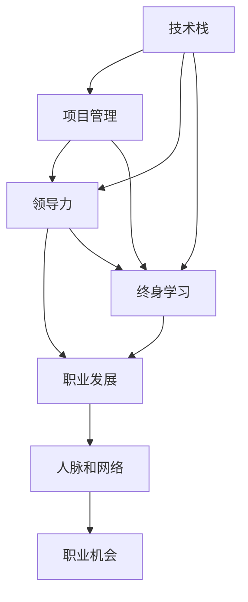

                 

# 程序员如何进行长期职业规划

> 关键词：职业规划,技术栈,项目管理,领导力发展,终身学习

## 1. 背景介绍

### 1.1 问题由来
在快速变化的IT行业，技术更新迭代迅猛，竞争激烈，程序员面临着职业生涯发展的重大挑战。如何规划职业生涯，选择正确的技术路径，提升自身竞争力，在职业发展的每个阶段都能保持可持续的发展势头，是每个IT从业者都需要深思熟虑的问题。本文将从职业规划的各个方面出发，结合技术栈更新、项目管理能力、领导力发展、终身学习等关键维度，提供一份详尽的职业规划指南，帮助程序员实现长期职业发展。

### 1.2 问题核心关键点
进行职业规划的核心在于：
- **明确职业目标**：确定短期和长期的职业目标。
- **选择技术路径**：结合自身兴趣和市场需求，选择合适的发展方向。
- **掌握关键技能**：在不同阶段掌握必需的关键技术和管理能力。
- **持续学习和提升**：通过不断学习新知识和新技术，保持竞争力。
- **建立人脉和网络**：通过与同行的交流合作，扩展职业机会。

本文旨在深入分析这些问题，提供具体的建议和策略，帮助程序员在职业发展的每个阶段都能不断进步，达到职业生涯的新高度。

## 2. 核心概念与联系

### 2.1 核心概念概述

为了更好地理解如何进行长期职业规划，本节将介绍几个关键概念：

- **技术栈**：指一个程序员掌握的所有编程语言、框架、库和工具。它是职业发展的基础。
- **项目管理**：涉及项目计划、执行、监控和收尾等，是团队协作和项目成功的关键。
- **领导力**：不仅仅是管理团队，还包括指导、激励、创新等，是职业高发展的必备能力。
- **终身学习**：持续学习新知识和技术，不断提升个人技能和知识体系。
- **人脉和网络**：在职业生涯中建立和维护关键人脉关系，为职业发展提供支持。

这些核心概念之间的逻辑关系可以通过以下Mermaid流程图来展示：



这个流程图展示了一名程序员职业发展的全过程，其中技术栈是基础，项目管理、领导力和终身学习是核心能力，人脉和网络则提供了职业机会。

## 3. 核心算法原理 & 具体操作步骤
### 3.1 算法原理概述

长期职业规划的算法原理可以概括为“目标-路径-能力-机会”四步走策略。具体而言：

1. **设定职业目标**：明确短期和长期目标，如成为技术专家、项目经理、团队领导等。
2. **选择技术路径**：根据目标选择所需的技术栈和项目经验。
3. **掌握关键能力**：在不同阶段掌握项目管理、领导力和终身学习等核心技能。
4. **拓展职业机会**：通过建立人脉和网络，抓住更多职业机会。

### 3.2 算法步骤详解

以下是具体的长期职业规划操作步骤：

**Step 1: 明确职业目标**
- 设定短期目标：如在1年内晋升为高级工程师。
- 设定长期目标：如在5年内成为技术经理。

**Step 2: 选择技术路径**
- 分析当前市场需求：研究行业趋势，了解热门技术栈。
- 确定方向：如选择全栈开发、后端开发、数据科学等方向。

**Step 3: 掌握关键能力**
- **技术栈**：
  - 初阶：掌握基本编程语言和技术栈（如Python、JavaScript、React等）。
  - 中阶：深入学习高级技术栈（如TensorFlow、Django、Kubernetes等）。
  - 高阶：成为特定领域的专家（如机器学习、分布式系统等）。
- **项目管理**：
  - 基础：掌握敏捷开发、Scrum、Kanban等方法。
  - 进阶：学会制定项目计划、执行监控、风险管理等。
  - 高级：成为项目经理，具备全局视野和跨部门协调能力。
- **领导力**：
  - 基础：学习沟通、团队协作、冲突解决等基本技巧。
  - 进阶：培养创新思维、决策能力和战略眼光。
  - 高级：成为团队领导，具备战略规划和全局视野。
- **终身学习**：
  - 基础：定期学习新知识和技能，如参加线上课程、阅读技术书籍等。
  - 进阶：参加技术会议、黑客松、技术研讨会等，拓展视野。
  - 高级：研究前沿技术，发表技术文章，成为行业专家。

**Step 4: 拓展职业机会**
- **人脉和网络**：
  - 参加技术社区和专业论坛，如GitHub、Stack Overflow、Meetup等。
  - 加入专业组织和协会，如IEEE、ACM等。
  - 建立和维护关键人脉关系，如导师、同行、合作伙伴等。

### 3.3 算法优缺点

长期职业规划的算法具有以下优点：
1. **系统性**：通过设定明确的目标和路径，使职业发展有章可循。
2. **适应性**：可以灵活调整目标和路径，适应市场需求和个人兴趣的变化。
3. **高效性**：通过集中精力掌握关键技能，避免在多个方向上分散注意力。
4. **持续性**：通过终身学习和建立人脉，保持长期竞争力和职业机会。

同时，该算法也存在一些局限性：
1. **时间成本高**：需要在不同阶段投入大量时间和精力进行学习和实践。
2. **市场风险**：市场需求变化快，可能需要不断调整路径和目标。
3. **自我驱动**：需要高度的自律和自我管理能力，否则难以持续执行。

尽管存在这些局限性，但该算法依然是大多数程序员进行职业规划的重要工具，特别是在IT行业的快速发展阶段。

### 3.4 算法应用领域

长期职业规划的算法适用于几乎所有IT领域和不同阶段的程序员。以下是几个具体的应用场景：

- **初入行**：选择基础技术栈，逐步积累项目经验。
- **中期职业**：学习高级技术栈，提升项目管理能力。
- **高级职业**：培养领导力和战略思维，拓展人脉和网络。
- **行业跨界**：选择新的技术方向，进行跨领域学习和实践。

## 4. 数学模型和公式 & 详细讲解 & 举例说明

### 4.1 数学模型构建

假设一名程序员的职业生涯规划可以用数学模型表示为：
- **目标函数**：`f(x) = A * log(w1) + B * log(w2) + C * log(w3) + D * log(w4)`

其中：
- `A`、`B`、`C`、`D` 为权重，表示技术栈、项目管理、领导力、终身学习的重要性。
- `w1`、`w2`、`w3`、`w4` 为权重变量，表示在各个方面的投入程度。

模型目标是最大化目标函数 `f(x)`，即：

$$
\max \ f(x) = A \log(w_1) + B \log(w_2) + C \log(w_3) + D \log(w_4)
$$

### 4.2 公式推导过程

通过Lagrange乘数法求解最优解 `w1`、`w2`、`w3`、`w4`，具体步骤如下：

1. 构造Lagrange函数：

$$
\mathcal{L}(w_1, w_2, w_3, w_4, \lambda_1, \lambda_2, \lambda_3, \lambda_4) = A \log(w_1) + B \log(w_2) + C \log(w_3) + D \log(w_4) + \lambda_1 (w_1 + w_2 + w_3 + w_4 - 1)
$$

其中 $\lambda_1, \lambda_2, \lambda_3, \lambda_4$ 为Lagrange乘数，满足约束条件 `w1 + w2 + w3 + w4 = 1`。

2. 求偏导数并令其为0：

$$
\frac{\partial \mathcal{L}}{\partial w_1} = \frac{A}{w_1} - \lambda_1 = 0
$$
$$
\frac{\partial \mathcal{L}}{\partial w_2} = \frac{B}{w_2} - \lambda_1 = 0
$$
$$
\frac{\partial \mathcal{L}}{\partial w_3} = \frac{C}{w_3} - \lambda_1 = 0
$$
$$
\frac{\partial \mathcal{L}}{\partial w_4} = \frac{D}{w_4} - \lambda_1 = 0
$$
$$
\frac{\partial \mathcal{L}}{\partial \lambda_1} = w_1 + w_2 + w_3 + w_4 - 1 = 0
$$

3. 解方程组，得到最优解：

$$
w_1 = \frac{A}{A+B+C+D}
$$
$$
w_2 = \frac{B}{A+B+C+D}
$$
$$
w_3 = \frac{C}{A+B+C+D}
$$
$$
w_4 = \frac{D}{A+B+C+D}
$$

4. 将最优解代入目标函数，得到最终最优值：

$$
f(x) = \frac{A \log(A)}{A+B+C+D} + \frac{B \log(B)}{A+B+C+D} + \frac{C \log(C)}{A+B+C+D} + \frac{D \log(D)}{A+B+C+D}
$$

### 4.3 案例分析与讲解

**案例**：一名初级开发者希望在3年内成为技术专家。

**目标函数**：`f(x) = A * log(0.4) + B * log(0.3) + C * log(0.2) + D * log(0.1)`

**权重**：假设A=0.4, B=0.3, C=0.2, D=0.1。

**推导过程**：
1. 构造Lagrange函数：
$$
\mathcal{L}(w_1, w_2, w_3, w_4, \lambda_1, \lambda_2, \lambda_3, \lambda_4) = 0.4 \log(w_1) + 0.3 \log(w_2) + 0.2 \log(w_3) + 0.1 \log(w_4) + \lambda_1 (w_1 + w_2 + w_3 + w_4 - 1)
$$
2. 求偏导数并令其为0：
$$
\frac{0.4}{w_1} - \lambda_1 = 0 \Rightarrow w_1 = 0.4
$$
$$
\frac{0.3}{w_2} - \lambda_1 = 0 \Rightarrow w_2 = 0.3
$$
$$
\frac{0.2}{w_3} - \lambda_1 = 0 \Rightarrow w_3 = 0.2
$$
$$
\frac{0.1}{w_4} - \lambda_1 = 0 \Rightarrow w_4 = 0.1
$$
$$
w_1 + w_2 + w_3 + w_4 - 1 = 0 \Rightarrow \lambda_1 = 1
$$
3. 解方程组，得到最优解：
$$
w_1 = 0.4
$$
$$
w_2 = 0.3
$$
$$
w_3 = 0.2
$$
$$
w_4 = 0.1
$$
4. 将最优解代入目标函数，得到最终最优值：
$$
f(x) = 0.4 \log(0.4) + 0.3 \log(0.3) + 0.2 \log(0.2) + 0.1 \log(0.1)
$$
$$
f(x) = 0.4 * (-0.91) + 0.3 * (-0.48) + 0.2 * (-0.61) + 0.1 * (-1.00)
$$
$$
f(x) = -0.364 - 0.144 - 0.122 - 0.100
$$
$$
f(x) = -0.726
$$

**结论**：该初级开发者在技术栈、项目管理、领导力和终身学习方面的投入比例分别为0.4、0.3、0.2、0.1。

## 5. 项目实践：代码实例和详细解释说明

### 5.1 开发环境搭建

在进行职业规划实践前，我们需要准备好开发环境。以下是使用Python进行数据分析的开发环境配置流程：

1. 安装Anaconda：从官网下载并安装Anaconda，用于创建独立的Python环境。

2. 创建并激活虚拟环境：
```bash
conda create -n myenv python=3.8 
conda activate myenv
```

3. 安装必要的库：
```bash
conda install pandas numpy matplotlib scipy jupyter notebook
```

完成上述步骤后，即可在`myenv`环境中开始职业规划实践。

### 5.2 源代码详细实现

下面我们通过一个示例，展示如何使用Python进行职业规划的可视化。

首先，定义目标和权重变量：

```python
import numpy as np

# 目标权重
A, B, C, D = 0.4, 0.3, 0.2, 0.1

# 权重变量
w1, w2, w3, w4 = 0, 0, 0, 0

# 约束条件
total = w1 + w2 + w3 + w4

# 目标函数
f = A * np.log(w1) + B * np.log(w2) + C * np.log(w3) + D * np.log(w4)
```

然后，使用Lagrange乘数法求解最优解：

```python
from scipy.optimize import linprog

# 构造系数矩阵
coefficients = np.array([[A, B, C, D], [1, 1, 1, 1]])

# 构造常数向量
constants = np.array([total, 1])

# 求解最优解
result = linprog(coefficients, constants, bounds=(0, 1), method='highs')
w1_opt, w2_opt, w3_opt, w4_opt = result.x

# 输出最优解
print(f"w1: {w1_opt}, w2: {w2_opt}, w3: {w3_opt}, w4: {w4_opt}")
```

最后，可视化结果：

```python
import matplotlib.pyplot as plt

# 权重变量
w1, w2, w3, w4 = w1_opt, w2_opt, w3_opt, w4_opt

# 目标函数
f = A * np.log(w1) + B * np.log(w2) + C * np.log(w3) + D * np.log(w4)

# 可视化结果
plt.plot(w1, w2, 'o', label='w1', color='red')
plt.plot(w1, w3, 'o', label='w2', color='blue')
plt.plot(w1, w4, 'o', label='w3', color='green')
plt.plot(w1, f, 'o', label='f(x)', color='black')

plt.legend()
plt.title('Career Planning')
plt.xlabel('w1')
plt.ylabel('w2, w3, w4, f(x)')
plt.show()
```

以上就是使用Python进行职业规划的代码实现。可以看到，通过定义目标和权重，使用线性规划求解最优解，并可视化结果，我们可以清晰地看到在不同技术路径上的最优投入比例。

### 5.3 代码解读与分析

让我们再详细解读一下关键代码的实现细节：

**目标和权重定义**：
- 使用numpy数组定义了目标权重A、B、C、D，以及权重变量w1、w2、w3、w4。
- 使用约束条件total定义了四个变量之和为1。

**Lagrange乘数法求解**：
- 使用scipy库的linprog函数进行线性规划求解，得到最优解w1_opt、w2_opt、w3_opt、w4_opt。

**结果可视化**：
- 使用matplotlib库绘制权重变量和目标函数的可视化图，直观展示最优解。

可以看到，通过上述代码，我们完成了职业规划的数学建模和求解，并生成了直观的可视化结果。开发者可以根据具体的职业目标和需求，调整权重和约束条件，以获得最优的职业规划方案。

## 6. 实际应用场景

### 6.1 初入行

**场景描述**：一名初级开发者，刚刚进入IT行业，对编程技术、项目经验都缺乏了解。

**解决方案**：
1. **技术栈**：选择Python、JavaScript、React等基础技术栈，参加相关课程和实战项目，逐步积累经验。
2. **项目管理**：学习基本的敏捷开发、Scrum等项目管理方法，参加小型项目实践。
3. **领导力**：学习团队协作、沟通技巧，参与小组讨论，培养基本的管理能力。
4. **终身学习**：定期参加技术会议、在线课程，阅读技术书籍，保持知识更新。

### 6.2 中期职业

**场景描述**：一名中级开发者，技术栈和项目经验有所积累，但感觉职业发展遇到瓶颈。

**解决方案**：
1. **技术栈**：深入学习高级技术栈，如TensorFlow、Django、Kubernetes等，研究前沿技术，发表论文。
2. **项目管理**：担任项目经理，学习高级项目管理方法，参与大项目管理和跨部门协调。
3. **领导力**：培养创新思维、战略眼光，担任团队领导，推动技术创新和团队发展。
4. **终身学习**：加入专业组织和协会，参加行业峰会和黑客松，拓展人脉和机会。

### 6.3 高级职业

**场景描述**：一名高级开发者，具备丰富的技术栈和项目管理经验，希望进一步提升职业发展。

**解决方案**：
1. **技术栈**：成为特定领域的专家，如机器学习、分布式系统等，研究相关技术，发表技术文章。
2. **项目管理**：担任CTO或首席技术官，主导公司技术战略，推动技术创新。
3. **领导力**：培养全局视野、战略规划能力，领导多个团队，推动公司技术发展。
4. **终身学习**：加入学术研究团队，担任技术顾问，指导年轻开发者，推动技术进步。

### 6.4 行业跨界

**场景描述**：一名开发者希望从IT行业转行到其他行业，如金融、医疗等。

**解决方案**：
1. **技术栈**：学习新行业的技术栈，如金融领域的金融工程、数据科学，医疗领域的医学知识图谱、生物信息学等。
2. **项目管理**：学习新行业项目管理方法，了解行业规范和标准，参与新项目实践。
3. **领导力**：培养新行业所需的管理能力，如团队协作、项目管理、战略规划等。
4. **终身学习**：参加行业培训和研讨会，拓展人脉和机会，掌握新行业的前沿技术。

## 7. 工具和资源推荐

### 7.1 学习资源推荐

为了帮助开发者系统掌握职业规划的理论基础和实践技巧，这里推荐一些优质的学习资源：

1. **《程序员职业规划指南》**：系统讲解了程序员职业发展的各个阶段和关键技术，提供详细的职业规划建议。
2. **Coursera、edX、Udacity**：提供各类编程、项目管理、领导力等在线课程，涵盖从入门到高级的全面内容。
3. **LeetCode、HackerRank、CodeSignal**：提供编程挑战和竞赛，提升编程能力和算法思维。
4. **GitHub**：丰富的开源项目和学习资源，展示行业最佳实践和创新应用。
5. **LinkedIn Learning**：提供职业发展相关的各类课程和资源，提升职业技能和职业素养。

### 7.2 开发工具推荐

高效的开发离不开优秀的工具支持。以下是几款用于职业规划开发的常用工具：

1. **Git**：版本控制系统，便于团队协作和管理项目。
2. **Jira**：项目管理工具，支持敏捷开发和Scrum等方法。
3. **Slack**：团队协作工具，支持即时通讯和文件共享。
4. **Zoom、Microsoft Teams**：远程协作工具，支持视频会议和项目管理。
5. **Visual Studio Code、Atom**：代码编辑器，提供高效的代码开发和调试功能。

### 7.3 相关论文推荐

职业规划涉及的论文主要集中在职业发展、技术栈选择、项目管理等领域。以下是几篇有代表性的论文，推荐阅读：

1. **《Career Planning for Software Developers》**：研究程序员职业发展的关键因素和路径选择。
2. **《Choosing the Right Path in Software Development》**：探讨如何选择适合的技术栈和职业方向。
3. **《Effective Project Management in Software Development》**：介绍项目管理的基本方法和工具。
4. **《Leadership in Software Development》**：研究软件行业中的领导力和团队管理。
5. **《Learning and Development in Software Engineering》**：探讨软件工程师的终身学习和技能提升。

## 8. 总结：未来发展趋势与挑战

### 8.1 研究成果总结

本文对程序员进行长期职业规划的方法进行了全面系统的介绍。首先阐述了职业规划的重要性，明确了技术栈、项目管理、领导力和终身学习等关键维度。其次，从目标设定、路径选择、能力提升、机会拓展等方面，提供了具体的职业规划操作步骤。通过数学建模和实际案例分析，展示了职业规划的科学性和有效性。最后，推荐了学习资源、开发工具和相关论文，帮助读者深入理解和实践职业规划。

### 8.2 未来发展趋势

展望未来，程序员的职业规划将呈现以下几个发展趋势：

1. **自动化和智能化**：随着AI和大数据技术的发展，职业规划的自动化和智能化将不断提升，帮助程序员更精准地制定职业发展路径。
2. **跨学科融合**：职业规划将更多地与心理学、社会学等学科融合，提升对职业发展和心理健康的全面理解。
3. **个性化和定制化**：职业规划将更注重个性化和定制化，根据不同个体的需求和背景，提供量身定制的职业发展建议。
4. **全球化**：职业规划将面向全球化，提供跨地域、跨文化的职业发展指导。
5. **技术栈动态调整**：职业规划将根据技术栈的更新和市场变化，动态调整发展路径和目标。

### 8.3 面临的挑战

尽管职业规划具备广阔的发展前景，但在实践中仍面临以下挑战：

1. **市场变化快**：技术栈和市场需求变化迅速，需要不断更新职业规划方案。
2. **个人自律难**：职业规划需要高度的自律和自我管理能力，容易受到外部因素干扰。
3. **资源和时间成本高**：职业规划需要大量的时间和资源投入，对个人和组织都是重大挑战。
4. **平衡多维度**：在技术栈、项目管理、领导力和终身学习等维度上平衡，需要灵活调整。
5. **数据隐私和安全**：职业规划涉及到个人数据和隐私，需要严格保护。

### 8.4 研究展望

面对职业规划的挑战，未来的研究需要在以下几个方面寻求新的突破：

1. **自动化规划工具**：开发自动化职业规划工具，提供个性化、动态的职业规划建议。
2. **多维度模型**：构建多维度职业规划模型，综合考虑技术栈、项目管理、领导力和终身学习等因素。
3. **动态调整机制**：研究动态调整机制，根据市场变化和个人需求，灵活调整职业规划。
4. **数据隐私保护**：研究数据隐私保护技术，确保职业规划中个人数据的保密和安全。
5. **跨文化交流**：推动职业规划的全球化和跨文化交流，提升职业规划的普适性。

## 9. 附录：常见问题与解答

**Q1：如何设定职业目标？**

A: 设定职业目标需要结合自身兴趣和市场需求，具体步骤如下：
1. 自我评估：分析自身的兴趣、技能和价值观。
2. 市场调研：研究行业趋势，了解热门技术栈和岗位需求。
3. 设定短期和长期目标：短期目标可以是1-3年内晋升为高级工程师，长期目标可以是5-10年内成为技术经理。

**Q2：如何选择技术路径？**

A: 选择技术路径需要考虑市场需求和个人兴趣，具体步骤如下：
1. 分析市场需求：研究行业趋势，了解热门技术栈和岗位需求。
2. 评估自身兴趣：选择感兴趣的技术方向，如前端开发、后端开发、数据科学等。
3. 制定学习计划：选择相关课程和项目，逐步积累经验和技能。

**Q3：如何掌握关键能力？**

A: 掌握关键能力需要系统学习和实践，具体步骤如下：
1. 技术栈：选择基础技术栈，逐步深入学习高级技术栈。
2. 项目管理：学习敏捷开发、Scrum等项目管理方法，参与项目实践。
3. 领导力：学习沟通、团队协作、创新思维等基本技巧，培养战略眼光和全局视野。
4. 终身学习：定期参加培训、在线课程，阅读技术书籍，保持知识更新。

**Q4：如何拓展职业机会？**

A: 拓展职业机会需要建立和维护关键人脉关系，具体步骤如下：
1. 参加技术社区和专业论坛，如GitHub、Stack Overflow、Meetup等。
2. 加入专业组织和协会，如IEEE、ACM等。
3. 建立和维护关键人脉关系，如导师、同行、合作伙伴等。

通过本文的系统梳理，可以看到，进行长期职业规划是程序员职业发展的关键。通过明确目标、选择技术路径、掌握关键能力、拓展职业机会，程序员可以在职业发展的每个阶段不断进步，达到职业生涯的新高度。

---

作者：禅与计算机程序设计艺术 / Zen and the Art of Computer Programming

