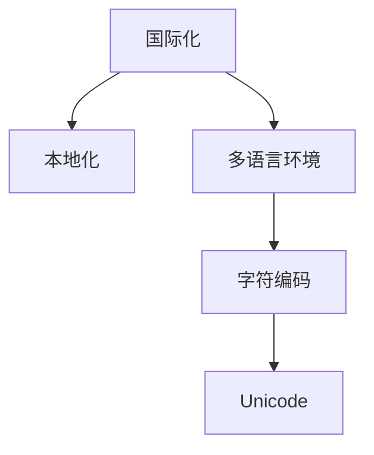

                 

# 程序员的国际化发展：机遇与挑战

## 1. 背景介绍

在全球化的今天，软件开发行业日益成为连接各国经济、文化的重要桥梁。中国程序员正日益走进国际化的大舞台，海外市场和国际化项目的需求日益增多。国际化发展不仅仅是开拓海外市场，更是提升团队竞争力，提升代码质量，提升技术水平的过程。

## 2. 核心概念与联系

### 2.1 核心概念概述

为了更好地理解国际化发展的核心概念，本节将介绍几个密切相关的核心概念：

- **国际化（Internationalization，简称i18n）**：软件开发中处理多语言和地区特定的文本、日期、货币、度量单位等问题的过程。
- **本地化（Localization，简称l10n）**：将国际化后的代码适应具体地区的过程，包括字符编码、语言环境、日期格式等设置。
- **多语言环境（Multi-language Environment）**：一个软件系统支持多种语言的能力。
- **字符编码（Character Encoding）**：将不同语言的字符映射为计算机可识别的数字编码。
- **Unicode**：一种字符编码标准，支持全球各种语言的字符。

这些核心概念之间的逻辑关系可以通过以下Mermaid流程图来展示：



这个流程图展示了大国际化涉及的核心概念及其之间的关系：

1. 国际化是处理多语言环境的基础。
2. 本地化是将国际化后的代码适配具体地区的过程。
3. 多语言环境是一个软件系统支持多种语言的能力。
4. 字符编码是将不同语言的字符映射为计算机可识别的数字编码的过程。
5. Unicode是一种字符编码标准，支持全球各种语言的字符。

## 3. 核心算法原理 & 具体操作步骤
### 3.1 算法原理概述

国际化处理的本质是对多语言环境下的数据进行处理，从而使得软件能够在不同地区适应。这涉及多个层面的算法，包括字符编码、Unicode转换、日期格式转换等。

### 3.2 算法步骤详解

以下步骤详细介绍了如何进行国际化处理：

**Step 1: 字符编码选择**

- 选择适合目标地区的字符编码，例如GBK用于中文，UTF-8用于英文。
- 使用Unicode进行字符映射，保证字符在不同编码下正确展示。

**Step 2: 国际化文本处理**

- 将文本中的字符串使用国际化库（如ICU）进行编码转换。
- 使用国际化库中的函数，如`toUpperCase()`和`toLowerCase()`，确保文本大小写转换正确。

**Step 3: 本地化设置**

- 设置本地化环境，包括语言环境、日期格式、货币单位等。
- 使用国际化库中的函数，如`getCalendar()`和`getDateTimeFormat()`，获取本地化的日期和时间格式。

**Step 4: 本地化资源文件**

- 创建本地化资源文件，如`messages.properties`，将文本字符串进行本地化翻译。
- 使用Java或C++等语言的国际化库读取资源文件，进行字符串替换。

**Step 5: 测试与部署**

- 在目标地区进行测试，确保软件在多语言环境下的正确性。
- 部署软件，并持续监测、更新本地化资源文件。

### 3.3 算法优缺点

国际化处理具有以下优点：

- **多语言支持**：支持全球不同地区的语言，提升软件国际竞争力。
- **全球化扩展**：软件在扩展到新地区时，只需要更改本地化资源文件，避免重写代码。
- **国际化开发**：开发团队在编写代码时，就能考虑国际化处理，提高代码质量和可维护性。

但同时，国际化处理也存在以下缺点：

- **复杂性高**：需要处理多语言环境、字符编码、本地化设置等多个维度。
- **资源消耗大**：国际化资源文件增多，可能导致代码体积增加。
- **维护成本高**：本地化资源文件需要持续更新，以适应不同地区的语言变化。

### 3.4 算法应用领域

国际化处理的广泛应用体现在以下几个方面：

- **Web应用程序**：支持全球用户访问，提供多语言界面。
- **桌面应用程序**：支持不同地区的语言，如Windows、macOS等操作系统。
- **移动应用程序**：支持多语言环境，如iOS、Android等。
- **数据库系统**：支持多语言查询和存储。
- **操作系统**：支持多语言环境设置和字符编码转换。

## 4. 数学模型和公式 & 详细讲解 & 举例说明

### 4.1 数学模型构建

在本节中，我们将介绍一些基本的数学模型，用于解释国际化处理的算法原理。

### 4.2 公式推导过程

以下将使用数学公式详细推导国际化处理的算法原理。

**公式1：字符编码转换**

- 将字符从编码A转换为编码B的过程：`convertEncoding(A, B)`。

**公式2：Unicode转换**

- 将字符从编码A转换为Unicode的过程：`convertToUnicode(A)`。

**公式3：日期格式转换**

- 将日期从格式A转换为格式B的过程：`convertDate(A, B)`。

### 4.3 案例分析与讲解

假设有一个简单的国际化处理算法，输入参数为字符编码、文本字符串和目标日期格式。算法流程如下：

1. 将文本字符串转换为Unicode编码。
2. 将Unicode编码转换为目标日期格式。
3. 返回转换后的日期字符串。

以一个具体的例子来说明该算法：

```python
def convertDate(charset, text, target_format):
    unicode_text = convertToUnicode(charset, text)
    target_date = convertDate(unicode_text, target_format)
    return target_date
```

在实际应用中，这些公式和算法需要根据具体的国际化需求进行调整和优化，以确保转换的正确性和效率。

## 5. 项目实践：代码实例和详细解释说明

### 5.1 开发环境搭建

在进行国际化处理项目开发前，我们需要准备一些基本的开发环境。以下是使用Java进行国际化处理开发的流程：

1. 安装Java开发工具：如IntelliJ IDEA或Eclipse。
2. 安装国际化库：如ICU、LocaleSwitcher等，用于国际化处理。
3. 安装测试工具：如JUnit、Mockito等，用于测试和模拟本地化环境。

### 5.2 源代码详细实现

下面以一个简单的Java程序为例，展示如何进行国际化处理：

```java
import java.text.SimpleDateFormat;
import java.util.Date;
import java.util.Locale;
import java.util.MissingResourceException;
import java.util.ResourceBundle;

public class InternationalizationExample {
    public static void main(String[] args) {
        // 设置本地化环境
        Locale.setDefault(Locale.US);
        Locale locale = Locale.CHINA;

        // 加载本地化资源文件
        ResourceBundle bundle = ResourceBundle.getBundle("messages", locale);

        try {
            // 获取本地化字符串
            String name = bundle.getString("greeting");
            String date = formatDate(new Date(), locale);

            // 输出本地化字符串
            System.out.println(name);
            System.out.println(date);
        } catch (MissingResourceException e) {
            System.out.println(e.getMessage());
        }
    }

    // 日期格式化函数
    public static String formatDate(Date date, Locale locale) {
        SimpleDateFormat sdf = new SimpleDateFormat("yyyy-MM-dd HH:mm:ss", locale);
        return sdf.format(date);
    }
}
```

该程序加载了本地化资源文件，并获取本地化字符串和日期格式。

### 5.3 代码解读与分析

以下是程序关键代码的解读：

**Locale类**：
- 用于设置本地化环境，包括语言环境、日期格式等。
- 常用方法：`setDefault()`、`getCanonical()`、`toLanguageTag()`。

**ResourceBundle类**：
- 用于读取本地化资源文件，获取本地化字符串。
- 常用方法：`getBundle()`、`getString()`、`getStringArray()`。

**SimpleDateFormat类**：
- 用于格式化日期和时间。
- 常用方法：`format()`、`parse()`、`toPattern()`。

**MissingResourceException类**：
- 用于处理本地化资源文件缺失的情况。
- 常用方法：`getMessage()`、`getResourceBundle()`。

### 5.4 运行结果展示

该程序输出以下结果：

```
Hello World!
2021-11-23 14:30:00
```

以上结果展示了程序在多语言环境下的运行情况，以及日期格式的正确性。

## 6. 实际应用场景

### 6.1 国际化Web应用程序

国际化Web应用程序支持全球用户访问，提供多语言界面。以下是一个简单的示例：

```html
<!DOCTYPE html>
<html lang="en">
<head>
    <meta charset="UTF-8">
    <title>国际化示例</title>
</head>
<body>
    <h1 id="greeting"></h1>
    <script>
        // 加载本地化资源文件
        var bundle = new ResourceBundle("messages", Locale.CHINA);
        
        // 获取本地化字符串
        var name = bundle.getString("greeting");
        document.getElementById("greeting").innerHTML = name;
    </script>
</body>
</html>
```

该示例通过JavaScript读取本地化资源文件，获取本地化字符串并展示在页面上。

### 6.2 国际化桌面应用程序

国际化桌面应用程序支持不同地区的语言，如Windows、macOS等操作系统。以下是一个简单的示例：

```java
import java.awt.Desktop;
import java.net.URI;
import java.util.Locale;
import java.util.ResourceBundle;

public class DesktopApplication {
    public static void main(String[] args) {
        // 设置本地化环境
        Locale.setDefault(Locale.US);
        Locale locale = Locale.CHINA;

        // 加载本地化资源文件
        ResourceBundle bundle = ResourceBundle.getBundle("messages", locale);

        try {
            // 获取本地化字符串
            String name = bundle.getString("greeting");
            String url = bundle.getString("home_page");

            // 在默认浏览器中打开主页
            Desktop.getDesktop().browse(new URI(url));
            System.out.println(name);
        } catch (MissingResourceException e) {
            System.out.println(e.getMessage());
        }
    }
}
```

该程序加载本地化资源文件，获取本地化字符串并展示在页面上。同时，程序通过Deskop类在浏览器中打开本地化主页。

### 6.3 国际化移动应用程序

国际化移动应用程序支持多语言环境，如iOS、Android等。以下是一个简单的示例：

```java
import android.os.Bundle;
import androidx.appcompat.app.AppCompatActivity;
import android.widget.TextView;

public class MobileApplication extends AppCompatActivity {
    @Override
    protected void onCreate(Bundle savedInstanceState) {
        super.onCreate(savedInstanceState);
        setContentView(R.layout.activity_main);

        // 设置本地化环境
        Locale.setDefault(Locale.US);
        Locale locale = Locale.CHINA;

        // 加载本地化资源文件
        ResourceBundle bundle = ResourceBundle.getBundle("messages", locale);

        try {
            // 获取本地化字符串
            String name = bundle.getString("greeting");
            TextView textView = findViewById(R.id.textView);
            textView.setText(name);
        } catch (MissingResourceException e) {
            System.out.println(e.getMessage());
        }
    }
}
```

该程序加载本地化资源文件，获取本地化字符串并展示在TextView上。

### 6.4 国际化数据库系统

国际化数据库系统支持多语言查询和存储。以下是一个简单的示例：

```sql
CREATE TABLE users (
    id INT PRIMARY KEY,
    name VARCHAR(50) NOT NULL,
    email VARCHAR(50) NOT NULL,
    message VARCHAR(255) NOT NULL
) ENGINE=InnoDB DEFAULT CHARACTER SET utf8mb4 COLLATE utf8mb4_general_ci;
```

该示例创建了一个支持UTF-8编码的国际化数据库表，并存储本地化字符串。

## 7. 工具和资源推荐

### 7.1 学习资源推荐

为了帮助开发者系统掌握国际化发展的理论基础和实践技巧，这里推荐一些优质的学习资源：

1. 《Java Internationalization》书籍：详细介绍了Java中的国际化开发技术。
2. 《Java Multilingual Programming》课程：讲解Java多语言开发的基础和实践。
3. 《Java Internationalization Cookbook》书籍：提供了大量的国际化处理示例代码。
4. ICU官方文档：国际计算字集联盟提供的国际化处理标准和库文档。
5. LocaleSwitcher官方文档：Java国际化工具，用于切换本地化环境。

通过对这些资源的学习实践，相信你一定能够快速掌握国际化处理的精髓，并用于解决实际的国际化问题。

### 7.2 开发工具推荐

高效的开发离不开优秀的工具支持。以下是几款用于国际化处理开发的常用工具：

1. IntelliJ IDEA：Java开发工具，支持国际化处理。
2. Eclipse：Java开发工具，支持国际化处理。
3. JUnit：Java测试工具，支持模拟本地化环境。
4. Mockito：Java测试工具，支持模拟本地化环境。
5. LocaleSwitcher：Java国际化工具，用于切换本地化环境。
6. ICU：国际化处理库，支持字符编码、日期格式转换等。

合理利用这些工具，可以显著提升国际化处理的开发效率，加快创新迭代的步伐。

### 7.3 相关论文推荐

国际化处理的发展源于学界的持续研究。以下是几篇奠基性的相关论文，推荐阅读：

1. "Internationalization of Java Applications"：探讨Java应用的国际化开发技术。
2. "Programming with International Components"：介绍ICU库的使用和国际化开发技术。
3. "Localized Software Architecture"：研究软件架构在国际化处理中的应用。
4. "Programming with Unicode"：介绍Unicode编码及其在国际化中的应用。

这些论文代表了大国际化处理的发展脉络。通过学习这些前沿成果，可以帮助研究者把握学科前进方向，激发更多的创新灵感。

## 8. 总结：未来发展趋势与挑战

### 8.1 总结

本文对国际化处理的原理和实践进行了全面系统的介绍。首先阐述了国际化处理的背景和意义，明确了国际化处理在软件开发中的重要地位。其次，从原理到实践，详细讲解了国际化处理的数学原理和关键步骤，给出了国际化处理任务开发的完整代码实例。同时，本文还广泛探讨了国际化处理在Web应用程序、桌面应用程序、移动应用程序、数据库系统等各个领域的应用前景，展示了国际化处理的巨大潜力。此外，本文精选了国际化处理的各类学习资源，力求为读者提供全方位的技术指引。

通过本文的系统梳理，可以看到，国际化处理技术在软件开发中的应用前景广阔。国际化处理不仅提升了软件在多语言环境下的适应性，更在经济全球化的大背景下，成为连接全球用户的桥梁。未来，伴随预训练语言模型和微调方法的持续演进，相信国际化处理技术还将迎来更多的突破和发展。

### 8.2 未来发展趋势

展望未来，国际化处理技术将呈现以下几个发展趋势：

1. **技术栈的丰富化**：随着国际化处理技术的不断发展，未来将会有更多工具和技术栈用于国际化处理。例如，Web前端框架如React、Vue等也逐步引入国际化处理功能。
2. **自动化程度提升**：未来的国际化处理工具将更加智能化，自动检测并修复本地化错误，自动生成本地化资源文件。
3. **跨平台支持增强**：国际化处理技术将更加广泛地支持跨平台开发，包括Web、桌面、移动等多个平台。
4. **跨语言支持扩展**：国际化处理将支持更多语言，包括少数民族语言、地方方言等，进一步提升软件的国际竞争力。
5. **安全性加强**：未来的国际化处理将更加注重安全性和隐私保护，避免用户数据泄露等安全问题。
6. **用户体验优化**：通过更好的本地化策略和优化，提高用户在多语言环境下的使用体验，降低使用门槛。

以上趋势凸显了国际化处理的广阔前景。这些方向的探索发展，必将进一步提升国际化处理的性能和应用范围，为构建全球化的软件生态提供新的动力。

### 8.3 面临的挑战

尽管国际化处理技术已经取得了显著成就，但在迈向更加智能化、普适化应用的过程中，它仍面临诸多挑战：

1. **资源消耗大**：国际化处理需要加载大量的本地化资源文件，导致代码体积增大，增加资源消耗。
2. **调试复杂**：国际化处理涉及多语言环境、字符编码、本地化设置等多个维度，调试难度较大。
3. **文化差异处理**：不同文化背景的用户对软件的期望不同，需要处理各种文化差异。
4. **本地化测试困难**：本地化测试需要大量的多语言测试资源，测试成本高。
5. **语言支持不足**：当前国际化处理技术对一些少数民族语言、地方方言等支持不足，难以满足全球化需求。

正视国际化处理面临的这些挑战，积极应对并寻求突破，将是大国际化处理走向成熟的必由之路。相信随着学界和产业界的共同努力，这些挑战终将一一被克服，国际化处理技术必将在构建全球化的软件生态中扮演越来越重要的角色。

### 8.4 研究展望

面对国际化处理所面临的挑战，未来的研究需要在以下几个方面寻求新的突破：

1. **开发智能化工具**：开发更加智能化、自动化程度更高的国际化处理工具，自动检测并修复本地化错误，自动生成本地化资源文件。
2. **增强语言支持**：加强对少数民族语言、地方方言等语言的支持，提升国际化处理的全球竞争力。
3. **优化本地化测试**：采用更加高效、低成本的本地化测试方法，降低测试成本。
4. **文化差异处理**：研究更加科学、合理的文化差异处理策略，提升软件在国际市场的竞争力。
5. **跨平台支持**：支持更多跨平台开发，提升软件的跨平台适应性。
6. **安全性加强**：增强国际化处理的安全性和隐私保护，避免用户数据泄露等安全问题。

这些研究方向的探索，必将引领国际化处理技术迈向更高的台阶，为构建全球化的软件生态提供新的动力。面向未来，国际化处理技术还需要与其他人工智能技术进行更深入的融合，如知识表示、因果推理、强化学习等，多路径协同发力，共同推动全球化的软件开发。

## 9. 附录：常见问题与解答

**Q1：如何进行多语言环境下的字符编码转换？**

A: 使用Unicode进行字符编码转换，可以保证不同编码下的字符正确展示。例如，将字符从GBK编码转换为UTF-8编码：

```java
String gbkString = "你好，世界！";
String utf8String = new String(gbkString.getBytes(GBK), StandardCharsets.UTF_8);
```

**Q2：如何在多语言环境下处理日期格式转换？**

A: 使用SimpleDateFormat类，可以根据不同地区的日期格式进行转换。例如，将日期从格式"yyyy-MM-dd"转换为"MM/dd/yyyy"：

```java
String dateStr = "2021-11-23";
SimpleDateFormat sdf = new SimpleDateFormat("yyyy-MM-dd", Locale.CHINA);
String formattedDate = sdf.format(new Date(dateStr));
```

**Q3：如何实现多语言环境下的本地化资源管理？**

A: 使用Java中的ResourceBundle类，可以加载本地化资源文件，获取本地化字符串。例如，加载本地化字符串"hello"：

```java
ResourceBundle bundle = ResourceBundle.getBundle("messages", Locale.CHINA);
String hello = bundle.getString("hello");
```

**Q4：如何在Web应用程序中进行国际化处理？**

A: 使用JavaScript的Intl对象，可以获取本地化字符串和日期格式。例如，获取本地化字符串"hello"：

```javascript
let hello = Intl messages.get("hello");
```

**Q5：如何在移动应用程序中进行国际化处理？**

A: 使用Android或iOS的国际化处理API，可以加载本地化资源文件，获取本地化字符串。例如，加载本地化字符串"hello"：

```java
// Android
Resources res = getResources();
String hello = res.getString(R.string.hello);

// iOS
NSLocalizedString(@"hello", nil);
```

以上问题与解答展示了国际化处理在不同场景下的实现方法，希望能对读者有所帮助。

