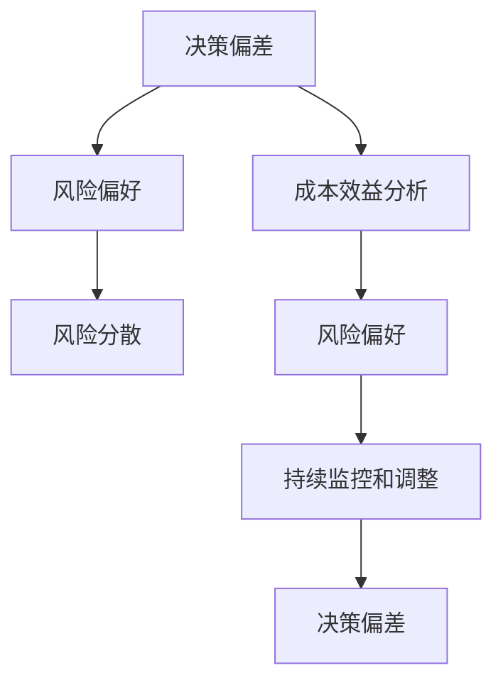

                 

# 程序员的投资心理学：风险与收益

## 1. 背景介绍

### 1.1 问题由来
在现代软件开发和信息技术行业，程序员们不仅需要具备深厚的技术功底，还需要进行各种决策，包括项目规划、技术选型、投资布局等。这些决策往往涉及成本、收益和风险的权衡，需要程序员具备一定的投资心理学知识。然而，现实情况是许多程序员在这方面并没有接受过系统的训练，甚至对基本的投资心理规律和原则一无所知。

### 1.2 问题核心关键点
本文将重点介绍程序员在技术投资决策过程中常见的心理偏差，以及如何避免这些偏差，以提高决策质量。

## 2. 核心概念与联系

### 2.1 核心概念概述

为了更好地理解程序员的投资心理学，本文将介绍几个关键概念：

- **决策偏差（Decision Bias）**：程序员在进行技术决策时，由于心理和认知因素导致的选择偏差，包括过度自信、过分乐观、从众行为等。
- **风险偏好（Risk Tolerance）**：程序员对项目技术选型风险的容忍程度，直接影响到决策的方向和风险控制策略。
- **成本效益分析（Cost-Benefit Analysis）**：评估项目成本和预期收益的过程，是做出明智决策的基础。
- **风险分散（Diversification）**：在技术投资中，通过组合多种技术方案来分散风险，避免单一技术的失败导致整个项目的失败。
- **持续监控和调整（Continuous Monitoring and Adjustment）**：技术投资不是一劳永逸的，需要程序员不断地监控项目进展，并根据实际情况调整投资策略。

这些核心概念之间的关系可以通过以下Mermaid流程图来展示：



该流程图展示了决策偏差的形成、成本效益分析、风险偏好、风险分散和持续监控与调整之间的关系。程序员的投资决策是这些因素相互作用的结果，理解并应用这些概念可以更好地进行技术投资。

## 3. 核心算法原理 & 具体操作步骤

### 3.1 算法原理概述

程序员的投资心理学涉及心理学和经济学两个领域。心理学的角度关注决策过程中的偏差和心理因素，而经济学的角度则关注风险、成本和收益等经济因素。本文将结合这两个角度，介绍程序员进行技术投资时可能遇到的心理偏差及其解决方法。

### 3.2 算法步骤详解

#### 3.2.1 确定决策目标和参数

程序员在进行技术投资决策时，首先需要明确决策目标和相关的参数。例如，是否使用新的编程语言、是否引入新的框架或工具、是否进行代码重构等。明确这些目标和参数有助于后续的决策分析和评估。

#### 3.2.2 风险评估

风险评估是投资决策中至关重要的一环。程序员需要评估不同技术方案的风险，包括技术不成熟、学习曲线陡峭、兼容性问题等。风险评估通常通过以下步骤完成：

1. **风险识别**：识别出可能的风险点，如技术依赖度高、开发周期长、维护成本高等。
2. **风险评估**：对每个风险点进行量化评估，确定其对项目的影响程度。
3. **风险应对策略**：针对每个风险点制定相应的应对策略，如备份方案、缓冲时间等。

#### 3.2.3 成本效益分析

成本效益分析是衡量投资可行性的重要方法。程序员需要评估不同技术方案的成本和预期的收益，并进行比较。具体步骤如下：

1. **成本估算**：对技术方案的成本进行估算，包括人力成本、工具成本、学习成本等。
2. **效益估算**：对技术方案的预期效益进行估算，包括性能提升、可维护性提高、开发效率提高等。
3. **对比分析**：通过比较不同方案的成本和效益，选择最优方案。

#### 3.2.4 决策执行

在风险评估和成本效益分析的基础上，程序员可以制定决策方案，并进行实施。需要注意的是，决策过程中需要考虑团队反馈、市场变化等因素，灵活调整决策方案。

#### 3.2.5 持续监控和调整

技术投资不是一成不变的，程序员需要持续监控项目进展，并根据实际情况进行调整。具体步骤包括：

1. **监控指标**：设定监控指标，如代码质量、开发效率、用户满意度等。
2. **反馈机制**：建立反馈机制，收集团队和用户的反馈信息。
3. **调整策略**：根据监控结果和反馈信息，对投资决策进行适当的调整。

### 3.3 算法优缺点

#### 3.3.1 优点

1. **全面性**：结合心理学和经济学的角度，对技术投资进行全面的评估和分析。
2. **可操作性**：提供具体的步骤和策略，易于程序员实践应用。
3. **风险控制**：通过风险评估和风险应对策略，有效降低技术投资的风险。

#### 3.3.2 缺点

1. **复杂性**：涉及多个方面的评估和分析，过程较为复杂。
2. **数据依赖**：需要大量的历史数据和市场信息作为支撑，有时难以获取。
3. **主观性**：决策过程中包含大量主观判断，可能导致偏差。

### 3.4 算法应用领域

程序员的投资心理学在软件开发、信息技术和创业等领域有广泛应用。具体应用场景包括：

- **技术选型**：在开发新项目时，选择合适的编程语言、框架和工具。
- **技术升级**：在现有项目中，进行代码重构、引入新技术或框架。
- **团队管理**：在团队管理中，优化技术栈，提高团队效率。
- **创业投资**：在创业公司中，进行技术选型和资源分配，制定投资策略。

## 4. 数学模型和公式 & 详细讲解 & 举例说明

### 4.1 数学模型构建

为了更严谨地描述程序员的投资心理学，我们可以构建一个数学模型来表示决策过程。

假设程序员面临两个技术方案A和B，每个方案的成功概率分别为$p_A$和$p_B$，成功后的收益分别为$R_A$和$R_B$，失败后的损失分别为$L_A$和$L_B$。成本为$C$，风险偏好为$\rho$。

### 4.2 公式推导过程

假设决策目标为最大化期望收益，根据期望效用理论，决策过程可以表示为：

$$
U = E[\max(R_A - L_A, 0)]^\rho + E[\max(R_B - L_B, 0)]^\rho
$$

其中，$\rho$为风险偏好系数，决定了决策者对风险的容忍程度。如果$\rho>0$，决策者倾向于选择收益高的方案；如果$\rho<0$，决策者倾向于选择风险低的方案。

### 4.3 案例分析与讲解

假设有两个技术方案A和B，A的成功概率为80%，收益为10000元，失败损失为2000元；B的成功概率为60%，收益为15000元，失败损失为3000元。成本为10000元，风险偏好系数为0.5。

1. **风险评估**：A的风险为20%，B的风险为40%。A的损失为2000元，B的损失为3000元。
2. **成本效益分析**：A的成本为10000元，B的成本也为10000元。A的期望收益为8000元，B的期望收益为9000元。
3. **决策执行**：根据期望效用理论，决策者应选择B方案。

## 5. 项目实践：代码实例和详细解释说明

### 5.1 开发环境搭建

在进行投资心理学分析时，我们不需要进行复杂的代码实现。但为了更好地理解心理偏差的影响，可以编写一个简单的模拟实验。以下是一个Python环境搭建过程：

```python
import numpy as np
import matplotlib.pyplot as plt
```

### 5.2 源代码详细实现

我们可以编写一个简单的模拟实验，模拟程序员在面临两个技术方案时的决策过程。具体代码如下：

```python
# 定义技术方案A和B的成功概率、收益和损失
p_A, R_A, L_A = 0.8, 10000, 2000
p_B, R_B, L_B = 0.6, 15000, 3000

# 定义成本和风险偏好系数
C = 10000
rho = 0.5

# 计算期望效用
U_A = np.maximum(R_A - L_A, 0) ** rho
U_B = np.maximum(R_B - L_B, 0) ** rho

# 计算期望收益
E_A = p_A * R_A - (1 - p_A) * L_A + C
E_B = p_B * R_B - (1 - p_B) * L_B + C

# 绘制期望收益曲线
plt.plot(p_A, E_A, label='方案A')
plt.plot(p_B, E_B, label='方案B')
plt.legend()
plt.show()
```

### 5.3 代码解读与分析

通过模拟实验，我们可以看到，在风险偏好系数为0.5的情况下，决策者应选择方案B。但实际情况中，程序员可能受到决策偏差的影响，做出不符合期望效用的决策。

## 6. 实际应用场景

### 6.1 软件开发

在软件开发中，程序员需要不断进行技术选型和升级，以保持项目的竞争力。例如，在引入新的编程语言或框架时，需要进行全面的风险评估和成本效益分析，确保投资回报。

### 6.2 创业投资

在创业公司中，技术投资决策对公司的成败至关重要。创业者需要进行技术选型和资源分配，制定投资策略，确保技术投资最大化公司的收益。

### 6.3 企业技术管理

在企业技术管理中，需要对多个技术方案进行评估和选择，制定合理的投资策略，以提高企业的技术实力和竞争力。

## 7. 工具和资源推荐

### 7.1 学习资源推荐

为了帮助程序员掌握投资心理学知识，以下是一些优质的学习资源：

1. 《行为经济学》课程：提供行为经济学的基础知识和理论，理解心理因素对决策的影响。
2. 《投资心理学》书籍：介绍投资决策中的心理偏差和应对策略，帮助程序员提高决策质量。
3. 《程序员的心理学》课程：结合编程实践，讲解心理偏差的实际应用和解决方法。
4. 《风险管理》书籍：介绍风险评估和风险控制的方法，帮助程序员应对技术投资中的风险。
5. 《统计学与决策》书籍：讲解统计学在决策中的应用，提供数据驱动的决策支持。

### 7.2 开发工具推荐

在进行投资心理学分析时，可以使用一些简单易用的工具：

1. Python：Python作为数据科学和机器学习的主流语言，提供了丰富的数学和统计分析库。
2. Excel：Excel可以进行简单的数据处理和可视化，适合进行成本效益分析和风险评估。
3. R语言：R语言在统计分析方面非常强大，适合进行复杂的风险评估和投资模拟。
4. Matplotlib和Seaborn：用于绘制数据可视化图表，帮助程序员更直观地理解决策结果。

### 7.3 相关论文推荐

以下是几篇关于程序员投资心理学的经典论文，推荐阅读：

1. Kahneman, D. (2011). Thinking, Fast and Slow. Farrar, Straus and Giroux.
2. Thaler, R. H. (2015). Misbehaving: The Making of Behavioral Economics. W.W. Norton & Company.
3. Tversky, A., & Kahneman, D. (1974). Judgment under Uncertainty: Heuristics and Biases. Science.
4. Sunstein, C. R., & Reisch, L. (2013). Nudge: Improving Decisions About Health, Wealth, and Happiness. Yale University Press.
5. Smith, J. P. (1997). The End of History and the Last Man. W.W. Norton & Company.

## 8. 总结：未来发展趋势与挑战

### 8.1 研究成果总结

本文介绍了程序员在进行技术投资决策时可能遇到的决策偏差及其解决方法，结合心理学和经济学的视角，提出了系统的决策框架。通过案例分析、数学模型和项目实践，深入讲解了决策过程和注意事项。

### 8.2 未来发展趋势

1. **数据驱动**：未来，随着数据采集和分析技术的进步，程序员可以更加依赖数据进行决策，减少主观判断。
2. **算法优化**：基于机器学习和人工智能的算法将不断优化，提高决策的准确性和效率。
3. **跨学科融合**：心理学、经济学、数据科学和人工智能等领域将不断融合，产生新的决策方法和理论。
4. **工具和平台**：更多的工具和平台将支持程序员进行决策分析，提供全方位的决策支持。

### 8.3 面临的挑战

1. **数据获取**：大规模高质量数据集的获取仍然是一个挑战，特别是在一些新兴领域和技术。
2. **算法复杂性**：复杂的决策算法和模型需要更多的计算资源和时间，增加了实施难度。
3. **用户接受度**：一些新的决策工具和方法需要用户接受和习惯，可能面临用户的抵触。
4. **隐私和伦理**：数据驱动的决策可能涉及用户隐私和伦理问题，需要制定相应的政策和法规。

### 8.4 研究展望

1. **心理模型与算法结合**：将心理模型与人工智能算法结合起来，提高决策模型的适应性和普适性。
2. **跨领域应用**：将决策心理学应用于更多领域，如金融、医疗、教育等，推动多领域的决策科学化。
3. **持续学习和优化**：建立持续学习机制，根据实时反馈不断优化决策模型。
4. **伦理与法规**：制定和完善与数据驱动决策相关的伦理和法规，保障决策的公正性和透明度。

## 9. 附录：常见问题与解答

**Q1: 程序员如何识别决策偏差？**

A: 程序员可以通过自我反思和团队反馈来识别决策偏差。具体方法包括：
1. **回顾决策过程**：记录决策过程和结果，分析是否有异常决策。
2. **收集团队反馈**：与团队成员交流，收集他们对决策的看法和建议。
3. **借鉴历史数据**：参考类似项目的决策数据，对比分析结果。

**Q2: 如何应对决策偏差？**

A: 应对决策偏差的方法包括：
1. **制定决策框架**：建立系统化的决策流程，减少主观判断。
2. **引入外部意见**：通过专家评审或咨询外部意见，多角度评估决策结果。
3. **建立监控机制**：持续监控决策效果，及时发现和纠正偏差。
4. **培训与教育**：提高团队成员的心理学知识，减少心理偏差的影响。

**Q3: 如何进行成本效益分析？**

A: 成本效益分析的步骤包括：
1. **成本估算**：对技术方案的成本进行详细估算，包括人力成本、工具成本、学习成本等。
2. **效益估算**：对技术方案的预期效益进行估算，包括性能提升、可维护性提高、开发效率提高等。
3. **对比分析**：通过比较不同方案的成本和效益，选择最优方案。

**Q4: 如何评估风险偏好？**

A: 风险偏好可以通过问卷调查、实验模拟等方式进行评估。具体方法包括：
1. **问卷调查**：设计问卷，评估决策者在不同风险水平下的偏好。
2. **实验模拟**：设计模拟实验，评估决策者在不同情景下的行为反应。
3. **心理测评**：使用心理测评工具，评估决策者的风险承受能力。

**Q5: 如何进行持续监控和调整？**

A: 持续监控和调整的步骤包括：
1. **设定监控指标**：设定与决策目标相关的监控指标，如代码质量、开发效率、用户满意度等。
2. **建立反馈机制**：建立反馈机制，收集团队和用户的反馈信息。
3. **调整策略**：根据监控结果和反馈信息，对投资决策进行适当的调整。

---

作者：禅与计算机程序设计艺术 / Zen and the Art of Computer Programming

