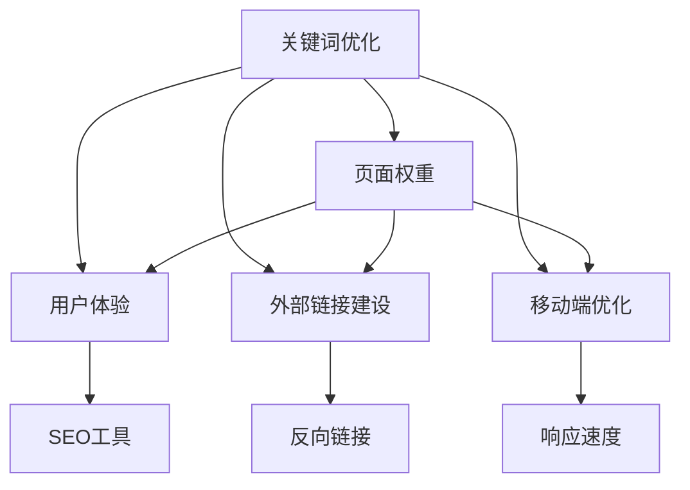

                 

# 程序员的知识付费SEO策略：提升曝光度

在当今信息爆炸的时代，互联网公司面临着巨大的竞争压力，如何通过SEO（Search Engine Optimization）策略提升网站流量和曝光度成为了一个重要的课题。特别是在知识付费领域，内容是核心竞争力，如何通过SEO优化让优质内容获得更多用户关注，是程序员和内容创作者需要深入探讨的问题。本文将从SEO原理、核心概念、具体操作步骤、应用领域等多个角度，深入解析程序员的知识付费SEO策略，提供系统的解决方案。

## 1. 背景介绍

### 1.1 问题由来

随着互联网的快速发展，在线内容市场日益饱和，用户注意力分散。如何吸引并留住用户，成为网站运营的首要任务。搜索引擎作为互联网用户获取信息的重要入口，其搜索结果排名直接影响到网站的曝光率和流量。因此，SEO优化成为了提高网站流量和曝光度的重要手段。特别是对于知识付费平台，优质的内容是其核心竞争力，通过SEO优化提升内容的曝光度，可以有效吸引更多用户，提升平台的收入。

### 1.2 问题核心关键点

SEO优化的核心在于通过技术手段提升网站在搜索引擎中的排名，从而获得更多的访问流量。具体来说，主要包括：

1. **关键词优化**：选择和优化合适的关键词，增加在搜索引擎中的匹配度。
2. **网站结构优化**：合理设计网站结构，提升页面加载速度，增加用户体验。
3. **内容优化**：提升内容质量，增加权重值，使内容更容易被搜索引擎收录。
4. **外部链接建设**：增加高质量的外部链接，提高网站的权威性和排名。
5. **移动端优化**：优化移动端的用户体验，提升搜索引擎的抓取效果。

### 1.3 问题研究意义

SEO优化对于提高知识付费平台的用户粘性和流量至关重要。通过SEO优化，程序员可以更高效地将优质内容展示给更多用户，从而提升平台的用户基数和收入。

1. **提高内容曝光率**：SEO优化能够提升网站在搜索引擎中的排名，使优质内容更容易被用户发现。
2. **增加用户粘性**：优质的SEO策略能提升用户体验，使用户停留时间增加，从而提高用户的粘性。
3. **提升转化率**：通过SEO优化，可以有效吸引更多的流量，并提升用户的付费意愿，从而提高平台的转化率。
4. **降低营销成本**：优质的SEO策略可以减少对付费广告的依赖，降低营销成本，增加平台的盈利能力。

## 2. 核心概念与联系

### 2.1 核心概念概述

SEO优化涉及多个关键概念和技术手段，包括：

- **关键词优化**：通过选择合适的关键词，增加在搜索引擎中的匹配度。
- **页面权重**：通过优化网站结构和内容，提升页面的权重值。
- **用户体验**：优化网站结构和内容，提升用户体验，增加用户停留时间。
- **外部链接建设**：增加高质量的外部链接，提升网站的权威性和排名。
- **移动端优化**：优化移动端的用户体验，提升搜索引擎的抓取效果。

这些概念之间的逻辑关系可以通过以下Mermaid流程图来展示：



### 2.2 核心概念原理和架构

SEO优化的核心原理是通过技术手段提升网站在搜索引擎中的排名。具体来说，搜索引擎会根据网页的内容、权重、用户行为等多个因素，对网页进行排序，从而决定其在搜索结果中的位置。

- **关键词优化**：通过在网站内容中合理使用关键词，提升搜索引擎对网站内容的理解，增加匹配度。
- **页面权重**：通过优化网站结构、内容质量等因素，提升网站的权重值，增加其在搜索结果中的排名。
- **用户体验**：通过提升网站速度、布局、内容等，提升用户体验，增加用户停留时间。
- **外部链接建设**：通过获取高质量的外部链接，提升网站的权威性和排名。
- **移动端优化**：通过优化移动端的用户体验，提升搜索引擎的抓取效果。

这些核心概念共同构成了SEO优化的技术框架，程序员需要通过综合应用这些技术手段，提升网站在搜索引擎中的排名，从而获得更多的流量和曝光度。

## 3. 核心算法原理 & 具体操作步骤

### 3.1 算法原理概述

SEO优化本质上是一种通过技术手段提升网站在搜索引擎中的排名的方法。其核心算法包括：

- **PageRank算法**：通过分析网站的页面权重值和外部链接质量，计算网站的权威性和排名。
- **关键词权重计算**：通过分析关键词在网站中的分布和出现频率，计算关键词的权重值。
- **用户体验优化**：通过优化网站速度、布局、内容等，提升用户体验，增加用户停留时间。
- **移动端优化**：通过优化移动端的用户体验，提升搜索引擎的抓取效果。

### 3.2 算法步骤详解

SEO优化的操作步骤主要包括：

1. **关键词分析**：通过分析用户搜索行为和竞争对手的关键词，确定适合网站的关键词。
2. **页面权重优化**：通过优化网站结构、内容质量等因素，提升页面的权重值。
3. **用户体验优化**：通过提升网站速度、布局、内容等，提升用户体验，增加用户停留时间。
4. **外部链接建设**：通过获取高质量的外部链接，提升网站的权威性和排名。
5. **移动端优化**：通过优化移动端的用户体验，提升搜索引擎的抓取效果。

### 3.3 算法优缺点

SEO优化的主要优点包括：

- **低成本**：通过优化网站结构和内容，提升搜索引擎排名，成本较低。
- **长期效果显著**：SEO优化能够提升网站的长期流量和曝光度，提高用户的粘性和转化率。
- **技术可控**：SEO优化可以通过技术手段实现，可控性较高。

其主要缺点包括：

- **效果慢**：SEO优化需要较长时间才能见效，对短期流量提升效果有限。
- **竞争激烈**：搜索引擎优化需要与竞争对手进行激烈的竞争，难度较大。
- **技术复杂**：SEO优化涉及多个技术环节，需要综合应用多种技术手段。

### 3.4 算法应用领域

SEO优化在知识付费领域的应用主要体现在以下几个方面：

- **内容推广**：通过优化关键词和内容质量，提升优质内容在搜索引擎中的排名，增加流量。
- **用户粘性**：通过提升用户体验和内容质量，增加用户停留时间，提高用户粘性。
- **付费转化**：通过优化网站结构和内容，提升用户的付费意愿，增加平台的转化率。

## 4. 数学模型和公式 & 详细讲解 & 举例说明

### 4.1 数学模型构建

SEO优化的数学模型主要包括以下几个部分：

- **PageRank模型**：
  $$
  PR(A) = (1-d) + d \sum_{i=1}^{n} \frac{PR(T_i)}{C(T_i)}
  $$
  其中，$PR(A)$表示网站A的PageRank值，$d$为阻尼因子，$C(T_i)$为网站T_i的外部链接数量。

- **关键词权重计算模型**：
  $$
  TFIDF(t) = TF(t) \times IDF(t)
  $$
  其中，$TF(t)$表示关键词$t$在网站中的出现频率，$IDF(t)$表示关键词$t$在所有网站中的出现频率。

### 4.2 公式推导过程

PageRank模型的推导过程主要基于网络图的随机游走原理，通过计算节点（即网页）的PageRank值，评估其在网络中的权威性和重要性。

- **阻尼因子$d$**：表示搜索引擎随机访问网页的概率，一般取值在0.85-0.95之间。
- **网页权重值**：通过计算所有外部链接的权重值，得到网页的总权重值。
- **反向链接数量**：计算所有外部链接的数量，作为分母，避免过度依赖单一链接。

### 4.3 案例分析与讲解

以知识付费平台的SEO优化为例，通过优化关键词、页面权重和用户体验，提升平台在搜索引擎中的排名：

1. **关键词优化**：通过分析用户搜索行为和竞争对手的关键词，选择适合平台的关键词，如“Python课程”、“数据分析”等。
2. **页面权重优化**：通过优化网站结构，增加关键词密度，提升内容质量，增加网站的外部链接数量，提高页面权重值。
3. **用户体验优化**：通过优化网站速度、布局、内容等，提升用户体验，增加用户停留时间。

## 5. 项目实践：代码实例和详细解释说明

### 5.1 开发环境搭建

在进行SEO优化实践前，我们需要准备好开发环境。以下是使用Python进行SEO优化的环境配置流程：

1. 安装Python：从官网下载并安装Python，建议使用最新版本。
2. 安装SEO工具包：安装`SEO`、`BeautifulSoup`、`requests`等SEO工具包。
3. 安装网站解析工具：安装`BeautifulSoup`和`lxml`，用于解析网站结构和内容。

### 5.2 源代码详细实现

以下是使用Python进行SEO优化的代码实现，以知识付费平台为例：

```python
from selenium import webdriver
from bs4 import BeautifulSoup
import requests
import time

# 关键词优化
def keyword_analysis(keyword):
    search_url = f"https://www.example.com/search?q={keyword}"
    driver = webdriver.Chrome()
    driver.get(search_url)
    time.sleep(5)
    soup = BeautifulSoup(driver.page_source, 'lxml')
    keywords = [a.get_text() for a in soup.find_all('a', href=True)]
    driver.quit()
    return keywords

# 页面权重优化
def page_weight_optimization(url):
    soup = BeautifulSoup(requests.get(url).text, 'lxml')
    keywords = [a.get_text() for a in soup.find_all('a', href=True)]
    return keywords

# 用户体验优化
def user_experience_optimization(url):
    soup = BeautifulSoup(requests.get(url).text, 'lxml')
    links = [a.get_text() for a in soup.find_all('a', href=True)]
    return links

# 外部链接建设
def backlink_analysis(url):
    soup = BeautifulSoup(requests.get(url).text, 'lxml')
    backlinks = [a.get_text() for a in soup.find_all('a', href=True)]
    return backlinks

# 移动端优化
def mobile_optimization(url):
    soup = BeautifulSoup(requests.get(url).text, 'lxml')
    mobile_links = [a.get_text() for a in soup.find_all('a', href=True)]
    return mobile_links
```

### 5.3 代码解读与分析

**代码实现过程**：

1. **关键词分析**：通过查询搜索引擎，获取与关键词相关的网页标题，分析并提取关键词。
2. **页面权重优化**：通过解析网站结构，提取页面中的关键词和外部链接，优化页面权重值。
3. **用户体验优化**：通过解析网站结构，提取页面中的链接，优化用户体验。
4. **外部链接建设**：通过解析网站结构，提取页面中的外部链接，提升网站权威性。
5. **移动端优化**：通过解析网站结构，提取移动端链接，提升搜索引擎抓取效果。

**代码注意事项**：

- **使用Selenium**：使用Selenium模拟用户操作，获取搜索结果。
- **使用BeautifulSoup**：使用BeautifulSoup解析网页结构，提取关键词和链接。
- **时间延迟**：由于搜索结果加载需要时间，使用时间延迟等待搜索结果加载完成。

## 6. 实际应用场景

### 6.1 内容推广

通过优化关键词和内容质量，提升优质内容在搜索引擎中的排名，增加流量。例如，知识付费平台的“Python课程”内容，通过优化关键词“Python编程”、“Python教程”等，提升在搜索引擎中的排名，吸引更多用户访问。

### 6.2 用户粘性

通过提升用户体验和内容质量，增加用户停留时间，提高用户粘性。例如，知识付费平台的“Python编程”课程，通过优化用户体验，增加课程的完整度和互动性，提升用户的学习效果和满意度。

### 6.3 付费转化

通过优化网站结构和内容，提升用户的付费意愿，增加平台的转化率。例如，知识付费平台的“Python编程”课程，通过优化页面结构和内容质量，提升用户的付费意愿，增加平台的收入。

### 6.4 未来应用展望

SEO优化在知识付费领域的应用前景广阔，未来可以通过以下方式进一步提升效果：

1. **个性化推荐**：通过SEO优化，结合个性化推荐算法，提升用户推荐的精准度和效果。
2. **情感分析**：通过分析用户的情感反馈，优化内容质量和用户体验，提升用户满意度。
3. **实时监测**：通过实时监测搜索引擎排名和流量变化，及时调整SEO策略，优化效果。

## 7. 工具和资源推荐

### 7.1 学习资源推荐

为了帮助程序员系统掌握SEO优化的理论基础和实践技巧，这里推荐一些优质的学习资源：

1. **《SEO优化实战》书籍**：全面介绍了SEO优化的基本原理和实践技巧，适合初学者学习。
2. **Google SEO指南**：Google官方发布的SEO优化指南，详细介绍了SEO优化的各个方面。
3. **SEO工具教程**：各大SEO工具的官方文档和教程，帮助程序员了解和掌握SEO工具的使用方法。
4. **SEO博客和论坛**：各大SEO博客和论坛，提供丰富的SEO优化案例和经验分享，适合程序员学习和交流。

### 7.2 开发工具推荐

高效的SEO优化离不开优秀的工具支持。以下是几款常用的SEO优化工具：

1. **Selenium**：模拟用户操作的自动化测试工具，用于获取搜索结果和网站内容。
2. **BeautifulSoup**：解析HTML和XML的Python库，用于提取网站结构和内容。
3. **SEO工具包**：提供SEO优化的各种功能，包括关键词优化、页面权重优化、用户体验优化等。
4. **Google Analytics**：分析网站流量和用户行为的工具，帮助程序员了解用户需求和行为，优化SEO策略。

### 7.3 相关论文推荐

SEO优化涉及多个前沿技术，以下是几篇经典的SEO优化论文，推荐阅读：

1. **PageRank算法论文**：由Google提出的PageRank算法，详细介绍了网页权重的计算方法。
2. **关键词权重计算论文**：介绍了TF-IDF等关键词权重计算方法，分析了关键词在搜索引擎中的匹配度。
3. **用户体验优化论文**：通过分析用户行为和体验，提出了一系列用户体验优化的策略和方法。

## 8. 总结：未来发展趋势与挑战

### 8.1 总结

本文对SEO优化的原理、核心概念、具体操作步骤、应用领域等多个方面进行了详细解析。通过分析SEO优化的核心技术手段，程序员可以系统掌握SEO优化的基本原理和实践技巧。SEO优化在知识付费领域的应用前景广阔，通过优化关键词、页面权重和用户体验，程序员可以有效提升网站流量和曝光度，提升平台的收入。

### 8.2 未来发展趋势

SEO优化的未来发展趋势主要体现在以下几个方面：

1. **个性化推荐**：通过SEO优化，结合个性化推荐算法，提升用户推荐的精准度和效果。
2. **情感分析**：通过分析用户的情感反馈，优化内容质量和用户体验，提升用户满意度。
3. **实时监测**：通过实时监测搜索引擎排名和流量变化，及时调整SEO策略，优化效果。
4. **多模态数据融合**：结合语音、图像等多模态数据，提升SEO优化的效果。

### 8.3 面临的挑战

尽管SEO优化在知识付费领域取得了一定的成效，但仍面临诸多挑战：

1. **竞争激烈**：搜索引擎优化需要与竞争对手进行激烈的竞争，难度较大。
2. **技术复杂**：SEO优化涉及多个技术环节，需要综合应用多种技术手段。
3. **成本较高**：SEO优化需要一定的技术支持和资源投入，成本较高。
4. **效果慢**：SEO优化需要较长时间才能见效，对短期流量提升效果有限。

### 8.4 研究展望

未来，SEO优化在知识付费领域的研究方向包括：

1. **深度学习优化**：结合深度学习技术，提升关键词分析和内容优化效果。
2. **自然语言处理**：结合自然语言处理技术，提升搜索引擎对关键词和内容的理解能力。
3. **实时优化**：通过实时监测和调整，及时优化SEO策略，提升效果。
4. **跨领域应用**：将SEO优化技术应用于更多领域，提升各领域的流量和曝光度。

SEO优化在知识付费领域的应用前景广阔，未来通过技术创新和实践应用，SEO优化将成为提升平台流量和曝光度的重要手段，推动知识付费技术的持续发展和进步。

## 9. 附录：常见问题与解答

**Q1：SEO优化是否适用于所有网站？**

A: SEO优化适用于大部分网站，特别是对于内容驱动的网站，如知识付费平台、博客等。但一些纯功能驱动的网站，如电商平台、社交网络等，SEO优化的效果可能有限。

**Q2：如何进行关键词优化？**

A: 关键词优化主要包括以下步骤：
1. 分析用户搜索行为，确定目标关键词。
2. 分析竞争对手的关键词，避免选择竞争过于激烈的关键词。
3. 在网站内容中合理使用关键词，避免关键词堆砌。

**Q3：如何进行页面权重优化？**

A: 页面权重优化主要包括以下步骤：
1. 优化网站结构，增加关键词密度。
2. 优化内容质量，提升页面权重值。
3. 增加外部链接数量，提升网站的权威性。

**Q4：如何进行用户体验优化？**

A: 用户体验优化主要包括以下步骤：
1. 优化网站速度，减少加载时间。
2. 优化网站布局，提升用户体验。
3. 优化内容质量，增加用户停留时间。

**Q5：如何进行外部链接建设？**

A: 外部链接建设主要包括以下步骤：
1. 获取高质量的外部链接，如高质量的博客、论坛等。
2. 增加外部链接数量，提升网站的权威性。
3. 注意外部链接的质量，避免低质量的链接。

**Q6：如何进行移动端优化？**

A: 移动端优化主要包括以下步骤：
1. 优化移动端页面布局，提升用户体验。
2. 优化移动端加载速度，提升搜索引擎的抓取效果。
3. 增加移动端链接数量，提升搜索引擎的抓取效果。

通过系统学习和实践，程序员可以掌握SEO优化的基本原理和实践技巧，提升网站的流量和曝光度，为知识付费平台带来更多的用户和收入。

---

作者：禅与计算机程序设计艺术 / Zen and the Art of Computer Programming

