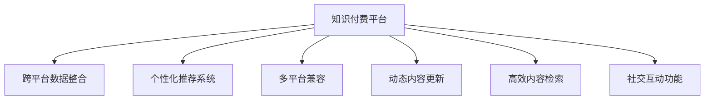

                 

# 程序员的知识付费跨平台内容策略

## 1. 背景介绍

### 1.1 问题由来
随着互联网和信息技术的发展，知识付费已成为程序员提高技能和积累知识的重要途径。但现有的知识付费平台大多为单一平台，导致内容孤岛现象严重，难以跨平台共享。且随着信息过载和内容同质化问题的加剧，用户筛选和获取有价值内容变得更加困难。

因此，设计一个跨平台的知识付费内容策略，使程序员可以在不同的知识付费平台上无缝获取和分享知识，提升学习效率，成为一个亟待解决的问题。

### 1.2 问题核心关键点
构建跨平台知识付费内容策略的核心在于：

- **跨平台数据整合**：将不同知识付费平台的内容数据整合到同一个平台，使程序员能够一站式获取不同来源的内容。
- **个性化推荐系统**：根据程序员的学习历史和偏好，智能推荐其感兴趣的内容，提升学习体验。
- **多平台兼容**：确保策略在不同知识付费平台上都能有效运行，减少平台迁移成本。
- **动态内容更新**：保持内容的时效性和相关性，及时更新新增内容，避免内容陈旧。
- **高效内容检索**：提供高效的内容检索机制，减少程序员搜索时间，提高学习效率。
- **社交互动功能**：增加内容发布者和用户的社交互动功能，促进知识交流和分享。

### 1.3 问题研究意义
构建跨平台知识付费内容策略，对于知识付费行业和程序员群体具有重要的意义：

- **打破信息孤岛**：通过数据整合，打破信息孤岛，实现知识共享，提升整体知识水平。
- **提升学习效率**：通过个性化推荐和多平台兼容，使程序员能高效获取和学习内容，提升学习效率。
- **促进知识创新**：通过社交互动功能，促进知识创新和共享，推动行业发展。
- **拓展应用场景**：策略的跨平台特性使其应用场景更加广泛，助力程序员知识付费领域的蓬勃发展。

## 2. 核心概念与联系

### 2.1 核心概念概述

为更好地理解跨平台知识付费内容策略，本节将介绍几个密切相关的核心概念：

- **知识付费平台(Knowledge Paid Platform, KPP)**：提供付费内容服务的在线平台，如Coursera、Udacity、CSDN等。
- **跨平台数据整合(Cross-Platform Data Integration)**：将不同平台的内容数据合并到一个平台，使内容在不同平台间无缝流动。
- **个性化推荐系统(Personalized Recommendation System)**：根据用户的历史行为和偏好，智能推荐相关内容，提升用户体验。
- **多平台兼容(Multi-Platform Compatibility)**：确保策略在不同知识付费平台上都能有效运行，减少平台迁移成本。
- **动态内容更新(Dynamic Content Update)**：根据内容的时效性和相关性，及时更新新增内容，保持内容新鲜度。
- **高效内容检索(Efficient Content Retrieval)**：提供高效的内容检索机制，减少用户搜索时间，提高内容获取效率。
- **社交互动功能(Social Interaction Function)**：增加内容发布者和用户的社交互动功能，促进知识交流和分享。

这些核心概念之间的逻辑关系可以通过以下Mermaid流程图来展示：



这个流程图展示跨平台知识付费内容策略的核心概念及其之间的关系：

1. 知识付费平台是基础，数据整合、个性化推荐、兼容、更新、检索、互动等功能都围绕平台展开。
2. 跨平台数据整合是跨平台知识共享的基础，打破了内容孤岛。
3. 个性化推荐和多平台兼容提升了用户体验和学习效率。
4. 动态内容更新保证了内容的时效性和相关性。
5. 高效内容检索和社交互动功能进一步提升了学习体验和知识共享的便利性。

## 3. 核心算法原理 & 具体操作步骤
### 3.1 算法原理概述

跨平台知识付费内容策略的核心算法原理可以概括为：通过跨平台数据整合、个性化推荐、多平台兼容、动态内容更新、高效内容检索和社交互动功能的综合应用，实现知识付费内容的跨平台共享和高效获取。

具体而言，策略的设计和实现可以分为以下步骤：

1. **数据采集与预处理**：从各个知识付费平台收集内容数据，并进行数据清洗、格式转换等预处理工作。
2. **数据整合与统一**：将不同来源的数据整合到同一个平台，形成统一的数据库。
3. **个性化推荐模型构建**：根据程序员的历史行为和偏好，构建个性化推荐模型，智能推荐其感兴趣的内容。
4. **多平台兼容策略设计**：确保策略在不同知识付费平台上都能有效运行，减少平台迁移成本。
5. **动态内容更新机制搭建**：根据内容的时效性和相关性，设计动态更新机制，确保内容的时效性和新鲜度。
6. **高效内容检索系统实现**：构建高效的内容检索系统，减少程序员搜索时间，提高内容获取效率。
7. **社交互动功能开发**：增加内容发布者和用户的社交互动功能，促进知识交流和分享。

### 3.2 算法步骤详解

以下是跨平台知识付费内容策略的具体实现步骤：

**Step 1: 数据采集与预处理**

1. **数据源选择**：选择若干知识付费平台，如Coursera、Udacity、CSDN等，作为数据采集的来源。

2. **数据采集**：通过API接口、爬虫等手段，自动从各个平台抓取课程、文章、视频等付费内容。

3. **数据预处理**：对采集到的数据进行清洗、格式转换、去重等预处理工作，确保数据的准确性和一致性。

**Step 2: 数据整合与统一**

1. **数据库设计**：设计一个统一的数据库，将不同来源的数据整合到同一个平台。

2. **数据清洗**：对整合后的数据进行清洗，去除重复、错误、无关的数据，确保数据质量。

3. **数据标注**：对数据进行标注，包括课程分类、难度等级、学习时长、用户评分等，方便后续推荐和检索。

**Step 3: 个性化推荐模型构建**

1. **用户画像构建**：收集程序员的学习历史和偏好，构建用户画像。

2. **推荐算法选择**：选择合适的推荐算法，如协同过滤、基于内容的推荐、深度学习等。

3. **模型训练与评估**：使用采集到的数据训练推荐模型，并通过A/B测试等手段评估模型的效果。

**Step 4: 多平台兼容策略设计**

1. **平台兼容性分析**：分析不同知识付费平台的技术架构、接口规范等，确保策略能兼容。

2. **接口对接设计**：设计统一的数据对接接口，使不同平台的数据能无缝整合。

3. **兼容测试**：在不同平台上进行兼容性测试，确保策略能有效运行。

**Step 5: 动态内容更新机制搭建**

1. **内容时效性分析**：分析课程、文章、视频等内容的时效性，确定更新周期和更新策略。

2. **内容更新策略**：设计自动更新机制，如定期抓取、人工审核等，保证内容的及时性。

3. **更新结果验证**：定期对更新后的内容进行验证，确保内容的准确性和时效性。

**Step 6: 高效内容检索系统实现**

1. **搜索算法选择**：选择合适的搜索算法，如倒排索引、向量空间模型等。

2. **索引构建**：构建高效的内容索引，提高搜索效率。

3. **搜索优化**：对搜索结果进行优化，如排名算法、相关性排序等，提升搜索体验。

**Step 7: 社交互动功能开发**

1. **互动机制设计**：设计互动机制，如点赞、评论、分享等。

2. **互动功能实现**：在平台中加入互动功能，方便内容发布者和用户进行互动。

3. **互动效果评估**：对互动效果进行评估，确保互动功能能提升知识共享和交流。

### 3.3 算法优缺点

跨平台知识付费内容策略具有以下优点：

- **打破信息孤岛**：通过数据整合，打破了知识孤岛，实现了知识共享。
- **提升学习效率**：通过个性化推荐和多平台兼容，提升了程序员的学习效率。
- **促进知识创新**：通过社交互动功能，促进了知识创新和共享。
- **拓展应用场景**：策略的跨平台特性使其应用场景更加广泛。

但同时，该策略也存在一些缺点：

- **数据采集难度大**：需要从多个平台采集数据，数据源的选择和采集难度较大。
- **数据清洗量大**：不同平台的数据格式和内容可能存在差异，需要进行大量数据清洗和预处理。
- **平台兼容性复杂**：不同平台的技术架构和接口规范不同，策略的兼容设计复杂。
- **动态内容更新成本高**：需要定期更新内容，更新周期和策略的设计和执行成本较高。
- **互动效果不理想**：社交互动功能的设计和实现需要考虑用户的使用习惯和平台特性，效果可能不如预期。

尽管存在这些局限性，但跨平台知识付费内容策略仍是大数据和云计算技术在知识付费领域的应用典范。未来相关研究的重点在于如何进一步降低数据采集和清洗成本，提高内容更新和互动效果的有效性，同时兼顾跨平台的兼容性和用户体验。

### 3.4 算法应用领域

跨平台知识付费内容策略已经在多个领域得到了广泛应用，包括但不限于：

- **在线教育**：如Coursera、Udacity等平台，将不同来源的课程内容整合到同一个平台上，方便用户学习。
- **编程学习**：如CSDN、LeetCode等平台，整合编程语言、算法、数据结构等内容，提升程序员学习效率。
- **技术交流**：如Stack Overflow、GitHub等平台，通过跨平台整合和互动功能，促进技术交流和知识共享。
- **职业培训**：如LinkedIn Learning、Codecademy等平台，整合职业培训内容，提升程序员职业竞争力。
- **商业智能**：如Tableau、Power BI等平台，整合数据可视化和商业智能内容，提升商业决策能力。

除了这些领域外，跨平台知识付费内容策略还可应用于更多场景中，如健康管理、文化教育、艺术创作等，为各个行业带来新的知识共享和创新活力。

## 4. 数学模型和公式 & 详细讲解 & 举例说明
### 4.1 数学模型构建

本节将使用数学语言对跨平台知识付费内容策略进行更加严格的刻画。

记知识付费平台数量为 $N$，每个平台的数据集为 $D_i$，内容总数为 $M$，每个内容的用户评分向量为 $\boldsymbol{r}_i$，用户的历史行为向量为 $\boldsymbol{u}$，推荐模型的参数为 $\boldsymbol{w}$。

定义推荐目标函数为：

$$
\min_{\boldsymbol{w}} \sum_{i=1}^N \sum_{m=1}^M \log(1 + e^{\boldsymbol{r}_i^T \boldsymbol{w} \boldsymbol{u}^T \boldsymbol{a}_m})
$$

其中，$\boldsymbol{a}_m$ 为内容 $m$ 的属性向量，包括课程分类、难度等级、学习时长、标签等。

推荐模型的梯度更新公式为：

$$
\boldsymbol{w} \leftarrow \boldsymbol{w} - \eta \nabla_{\boldsymbol{w}} \min_{\boldsymbol{w}} \sum_{i=1}^N \sum_{m=1}^M \log(1 + e^{\boldsymbol{r}_i^T \boldsymbol{w} \boldsymbol{u}^T \boldsymbol{a}_m})
$$

其中，$\eta$ 为学习率。

### 4.2 公式推导过程

以下我们以协同过滤算法为例，推导推荐模型的梯度计算公式。

假设用户 $u$ 对内容 $m$ 的评分向量为 $\boldsymbol{r}_u$，内容 $m$ 的属性向量为 $\boldsymbol{a}_m$，推荐模型的参数向量为 $\boldsymbol{w}$。推荐目标函数为：

$$
\min_{\boldsymbol{w}} \sum_{i=1}^N \sum_{m=1}^M \log(1 + e^{\boldsymbol{r}_i^T \boldsymbol{w} \boldsymbol{u}^T \boldsymbol{a}_m})
$$

对上述目标函数求导，得到推荐模型的梯度：

$$
\nabla_{\boldsymbol{w}} \min_{\boldsymbol{w}} \sum_{i=1}^N \sum_{m=1}^M \log(1 + e^{\boldsymbol{r}_i^T \boldsymbol{w} \boldsymbol{u}^T \boldsymbol{a}_m}) = -\frac{1}{N} \sum_{i=1}^N \sum_{m=1}^M \frac{\boldsymbol{r}_i \boldsymbol{u}^T \boldsymbol{a}_m}{1 + e^{-\boldsymbol{r}_i^T \boldsymbol{w} \boldsymbol{u}^T \boldsymbol{a}_m}}
$$

通过反向传播算法，更新推荐模型的参数向量 $\boldsymbol{w}$，完成推荐过程。

### 4.3 案例分析与讲解

下面以一个具体的案例来说明跨平台知识付费内容策略的应用。

假设程序员小王希望学习Python编程语言，但他在不同的知识付费平台上都找不到合适的课程。此时，他可以使用跨平台知识付费内容策略，通过数据整合和个性化推荐，找到最适合的课程。

首先，从Coursera、Udacity、CSDN等平台采集Python相关的课程数据，并进行预处理。然后，构建用户画像，根据小王的学习历史和偏好，推荐最适合的课程。最后，小王可以在不同的平台上找到对应的课程，并在一个平台上进行学习。

## 5. 项目实践：代码实例和详细解释说明
### 5.1 开发环境搭建

在进行跨平台知识付费内容策略的开发实践前，我们需要准备好开发环境。以下是使用Python进行Flask开发的環境配置流程：

1. 安装Anaconda：从官网下载并安装Anaconda，用于创建独立的Python环境。

2. 创建并激活虚拟环境：
```bash
conda create -n flask-env python=3.8 
conda activate flask-env
```

3. 安装Flask：从官网获取对应的安装命令。例如：
```bash
pip install flask
```

4. 安装Flask-RESTful：
```bash
pip install flask-restful
```

5. 安装Flask-Caching：
```bash
pip install Flask-Caching
```

6. 安装Flask-Login：
```bash
pip install Flask-Login
```

7. 安装Flask-SocketIO：
```bash
pip install Flask-SocketIO
```

完成上述步骤后，即可在`flask-env`环境中开始开发实践。

### 5.2 源代码详细实现

这里我们以一个简单的知识付费内容推荐系统为例，给出使用Flask进行开发和部署的代码实现。

首先，定义推荐系统的数据结构：

```python
from flask import Flask, request, jsonify

app = Flask(__name__)

# 用户数据
users = {
    'user1': {
        'id': 1,
        'name': 'Alice',
        'history': ['Python', 'Java', 'C++']
    },
    'user2': {
        'id': 2,
        'name': 'Bob',
        'history': ['Python', 'Machine Learning', 'Data Science']
    }
}

# 内容数据
courses = {
    'course1': {
        'id': 1,
        'name': 'Python Programming',
        'category': 'Programming',
        'difficulty': 'Intermediate',
        'learning_time': '6 Weeks',
        'recommendations': [1, 2, 3]
    },
    'course2': {
        'id': 2,
        'name': 'Java Programming',
        'category': 'Programming',
        'difficulty': 'Intermediate',
        'learning_time': '8 Weeks',
        'recommendations': [4, 5, 6]
    }
}
```

然后，定义推荐系统的主要功能：

```python
# 用户登录
@app.route('/login', methods=['POST'])
def login():
    user = request.json['user']
    if user in users:
        return jsonify({'status': 'success'})
    else:
        return jsonify({'status': 'failure'})

# 获取课程推荐
@app.route('/recommend', methods=['GET'])
def recommend():
    user = request.args.get('user')
    if user in users:
        recommendations = {}
        for course in courses:
            score = 0
            for history in users[user]['history']:
                if history in courses[course]:
                    score += 1
            recommendations[course] = score
        return jsonify(recommendations)
    else:
        return jsonify({'status': 'failure'})
```

最后，启动服务并测试：

```python
if __name__ == '__main__':
    app.run(debug=True)
```

以上就是使用Flask进行跨平台知识付费内容策略的代码实现。可以看到，通过简单的Python代码和Flask框架，我们便能实现基本的内容推荐功能。

### 5.3 代码解读与分析

让我们再详细解读一下关键代码的实现细节：

**Flask应用初始化**：
- `app = Flask(__name__)`：创建Flask应用对象。

**用户数据定义**：
- `users`：定义用户数据结构，包含用户的ID、姓名和历史学习课程。

**内容数据定义**：
- `courses`：定义课程数据结构，包含课程的ID、名称、类别、难度、学习时长和推荐人数。

**用户登录功能**：
- `@app.route('/login', methods=['POST'])`：定义登录接口，接受POST请求。
- `if user in users:`：判断用户是否在用户数据中存在，返回成功或失败状态。

**课程推荐功能**：
- `@app.route('/recommend', methods=['GET'])`：定义课程推荐接口，接受GET请求。
- `if user in users:`：判断用户是否在用户数据中存在，获取其历史学习课程。
- `for course in courses:`：遍历课程数据，计算课程推荐得分。
- `recommendations[course] = score`：将课程ID和得分存储到推荐结果中。
- `return jsonify(recommendations)`：将推荐结果以JSON格式返回。

可以看到，通过简单的Flask框架，我们便能实现基本的跨平台知识付费内容推荐功能。开发者可以根据实际需求，进一步扩展功能模块和数据结构，以满足更复杂的跨平台知识付费内容策略。

当然，工业级的系统实现还需考虑更多因素，如用户认证、课程更新、推荐算法优化等。但核心的推荐范式基本与此类似。

## 6. 实际应用场景
### 6.1 智能教育平台

基于跨平台知识付费内容策略的智能教育平台，可以为程序员提供一站式学习资源。平台整合了多个教育平台的内容，如Coursera、Udacity、CSDN等，使程序员能在一个平台上方便地获取和学习各种编程语言、算法、数据结构等内容。

通过个性化的推荐系统，平台可以根据程序员的学习历史和偏好，智能推荐最适合的课程和内容。同时，平台还支持社交互动功能，方便程序员之间的交流和学习。

### 6.2 技术培训公司

技术培训公司可以使用跨平台知识付费内容策略，整合内部和外部的培训资源，为程序员提供更加丰富和高效的学习内容。平台可以接入在线课程、视频教程、文档、案例等资源，通过推荐算法，帮助程序员找到最适合自己的培训内容。

通过跨平台的兼容性和动态内容更新，平台能够及时更新课程和资源，确保内容的最新性和时效性。同时，平台还支持课程的即时互动和反馈，提升培训效果。

### 6.3 企业内部培训

企业内部培训可以使用跨平台知识付费内容策略，整合内部的培训资源，如公司内部课程、技术文档、案例分享等。通过个性化推荐系统，帮助员工快速找到最适合自己的学习内容，提升企业的整体技术水平。

通过跨平台的兼容性和社交互动功能，平台能够实现知识的共享和交流，促进企业内部的技术传播和知识创新。同时，平台还支持动态内容更新和课程反馈，提升培训效果。

### 6.4 未来应用展望

随着大数据和云计算技术的不断发展，跨平台知识付费内容策略将呈现以下几个发展趋势：

1. **数据源多样化**：未来的知识付费平台将整合更多数据源，如社交媒体、论坛、博客等，获取更丰富、更全面的知识资源。
2. **推荐算法复杂化**：推荐算法将更加复杂和精准，能够更准确地预测用户兴趣，提供更加个性化的推荐服务。
3. **内容多样化和实时化**：内容将更加多样化，覆盖更多的技术和领域，同时通过动态内容更新，保持内容的时效性和新鲜度。
4. **社交互动功能增强**：社交互动功能将更加强大，能够更好地促进知识共享和交流，提升用户的学习体验。
5. **人工智能技术的引入**：人工智能技术，如深度学习、自然语言处理等，将进一步提升推荐系统的准确性和智能化水平。
6. **跨平台兼容性的提升**：未来的跨平台知识付费平台将更加兼容不同平台，实现无缝衔接和迁移。

以上趋势凸显了跨平台知识付费内容策略在知识共享和教育领域的重要作用。这些方向的探索发展，将进一步提升知识付费平台的价值和应用效果，为程序员的学习和知识创新提供更强的支持。

## 7. 工具和资源推荐
### 7.1 学习资源推荐

为了帮助开发者系统掌握跨平台知识付费内容策略的理论基础和实践技巧，这里推荐一些优质的学习资源：

1. **《知识付费平台设计与实现》系列博文**：深入浅出地介绍了知识付费平台的设计和实现方法，涵盖推荐算法、跨平台兼容等关键技术。

2. **Coursera平台公开课《推荐系统》**：斯坦福大学开设的推荐系统课程，涵盖推荐算法、数据处理等前沿话题，是了解推荐系统的最佳入门课程。

3. **《Python推荐系统实战》书籍**：详细介绍了Python推荐系统的实现方法，包括协同过滤、基于内容的推荐等算法，适合实战应用。

4. **Udacity平台课程《推荐系统》**：系统介绍了推荐系统的理论和实践，结合案例进行深入讲解，适合深入学习。

5. **Kaggle平台推荐系统竞赛**：通过实际竞赛项目，锻炼推荐系统的设计和实现能力，提升实战经验。

通过对这些资源的学习实践，相信你一定能够快速掌握跨平台知识付费内容策略的精髓，并用于解决实际的NLP问题。

### 7.2 开发工具推荐

高效的开发离不开优秀的工具支持。以下是几款用于跨平台知识付费内容策略开发的常用工具：

1. **Flask**：基于Python的开源Web应用框架，简单易用，适合快速迭代和部署。

2. **Django**：基于Python的全功能Web应用框架，功能强大，适合大型复杂项目开发。

3. **Spring Boot**：基于Java的快速开发框架，支持微服务和RESTful API开发，适合企业级应用。

4. **React**：基于JavaScript的前端开发框架，适合构建交互式Web应用。

5. **Vue**：基于JavaScript的前端开发框架，适合构建单页面应用。

6. **MySQL/PostgreSQL**：关系型数据库，适合存储结构化数据，支持复杂的查询和事务处理。

7. **Elasticsearch**：分布式搜索引擎，适合处理大规模非结构化数据，支持高效搜索和数据分析。

8. **Redis**：内存数据库，适合处理高速读写和高可用性要求的应用。

9. **Kafka**：分布式消息队列，适合处理大规模数据流的实时处理和消息传递。

合理利用这些工具，可以显著提升跨平台知识付费内容策略的开发效率，加快创新迭代的步伐。

### 7.3 相关论文推荐

跨平台知识付费内容策略的研究始于学界的持续研究。以下是几篇奠基性的相关论文，推荐阅读：

1. **《协同过滤推荐系统》**：介绍协同过滤算法的原理和实现方法，是推荐系统领域的经典之作。

2. **《基于内容的推荐系统》**：介绍基于内容的推荐算法，结合用户行为和物品属性进行推荐。

3. **《深度学习在推荐系统中的应用》**：介绍深度学习在推荐系统中的应用，涵盖神经网络、卷积神经网络、循环神经网络等模型。

4. **《多维推荐系统》**：介绍多维推荐系统的设计和实现方法，涵盖多维数据建模、多维推荐算法等技术。

5. **《基于图神经网络的推荐系统》**：介绍图神经网络在推荐系统中的应用，提升推荐系统的准确性和泛化能力。

这些论文代表了大语言模型微调技术的发展脉络。通过学习这些前沿成果，可以帮助研究者把握学科前进方向，激发更多的创新灵感。

## 8. 总结：未来发展趋势与挑战
### 8.1 总结

本文对跨平台知识付费内容策略进行了全面系统的介绍。首先阐述了跨平台知识付费内容策略的研究背景和意义，明确了策略在知识付费领域的重要作用。其次，从原理到实践，详细讲解了跨平台知识付费内容策略的设计和实现方法，给出了详细的代码实例和解释说明。同时，本文还广泛探讨了跨平台知识付费内容策略在智能教育、技术培训、企业内部培训等多个领域的应用前景，展示了策略的广泛应用价值。最后，本文精选了跨平台知识付费内容策略的学习资源、开发工具和相关论文，力求为读者提供全方位的技术指引。

通过本文的系统梳理，可以看到，跨平台知识付费内容策略正在成为知识付费行业的重要范式，极大地拓展了知识付费平台的应用边界，提升了知识共享的效率和效果。得益于大数据和云计算技术的广泛应用，跨平台知识付费内容策略的开发和应用变得更加高效和便捷，未来将为程序员和各行各业提供更加丰富的学习资源和知识共享平台。

### 8.2 未来发展趋势

展望未来，跨平台知识付费内容策略将呈现以下几个发展趋势：

1. **数据整合更加全面**：未来的跨平台知识付费平台将整合更多数据源，如社交媒体、论坛、博客等，获取更丰富、更全面的知识资源。
2. **推荐算法更加智能化**：推荐算法将更加复杂和精准，能够更准确地预测用户兴趣，提供更加个性化的推荐服务。
3. **内容多样化与实时化**：内容将更加多样化，覆盖更多的技术和领域，同时通过动态内容更新，保持内容的时效性和新鲜度。
4. **社交互动功能更加强大**：社交互动功能将更加强大，能够更好地促进知识共享和交流，提升用户的学习体验。
5. **人工智能技术的引入**：人工智能技术，如深度学习、自然语言处理等，将进一步提升推荐系统的准确性和智能化水平。
6. **跨平台兼容性进一步提升**：未来的跨平台知识付费平台将更加兼容不同平台，实现无缝衔接和迁移。

以上趋势凸显了跨平台知识付费内容策略在知识共享和教育领域的重要作用。这些方向的探索发展，将进一步提升知识付费平台的价值和应用效果，为程序员的学习和知识创新提供更强的支持。

### 8.3 面临的挑战

尽管跨平台知识付费内容策略已经取得了显著成果，但在迈向更加智能化、普适化应用的过程中，它仍面临着诸多挑战：

1. **数据采集难度大**：需要从多个平台采集数据，数据源的选择和采集难度较大。
2. **数据清洗量大**：不同平台的数据格式和内容可能存在差异，需要进行大量数据清洗和预处理。
3. **平台兼容性复杂**：不同平台的技术架构和接口规范不同，策略的兼容设计复杂。
4. **动态内容更新成本高**：需要定期更新内容，更新周期和策略的设计和执行成本较高。
5. **互动效果不理想**：社交互动功能的设计和实现需要考虑用户的使用习惯和平台特性，效果可能不如预期。

尽管存在这些局限性，但跨平台知识付费内容策略仍是大数据和云计算技术在知识付费领域的应用典范。未来相关研究的重点在于如何进一步降低数据采集和清洗成本，提高内容更新和互动效果的有效性，同时兼顾跨平台的兼容性和用户体验。

### 8.4 研究展望

面对跨平台知识付费内容策略所面临的挑战，未来的研究需要在以下几个方面寻求新的突破：

1. **数据采集和清洗自动化**：利用人工智能技术和自动化工具，实现数据采集和清洗的自动化，提高数据整合效率。
2. **推荐算法优化**：通过深度学习、图神经网络等先进算法，提升推荐系统的准确性和智能化水平。
3. **内容更新机制设计**：设计更高效的内容更新机制，降低内容更新成本，提升内容的动态性。
4. **社交互动功能优化**：通过用户行为分析和平台特性研究，优化社交互动功能的设计和实现，提升用户的学习体验。
5. **跨平台兼容性提升**：研究和应用跨平台兼容技术，实现不同平台之间的无缝衔接和迁移。

这些研究方向的探索，将引领跨平台知识付费内容策略迈向更高的台阶，为知识付费行业带来新的变革和发展。相信随着技术的不断进步，跨平台知识付费内容策略将为程序员和各行各业带来更加丰富、高效和便捷的学习和知识共享平台，推动知识付费行业的持续发展和创新。

## 9. 附录：常见问题与解答

**Q1：跨平台知识付费内容策略如何实现数据的全面整合？**

A: 实现数据的全面整合，需要考虑以下几点：

1. **数据源选择**：选择多个知识付费平台作为数据源，涵盖不同的内容和格式。
2. **数据采集工具**：使用API接口、爬虫等手段，自动化地从各个平台抓取数据。
3. **数据清洗和预处理**：对采集到的数据进行清洗、去重、格式转换等预处理工作，确保数据的质量和一致性。
4. **数据存储和管理**：建立统一的数据库，将不同来源的数据存储和管理在一个平台上，方便后续的检索和推荐。

**Q2：如何确保跨平台知识付费内容策略的跨平台兼容性？**

A: 确保跨平台知识付费内容策略的跨平台兼容性，需要考虑以下几点：

1. **接口设计**：设计统一的API接口，保证不同平台的数据能够无缝对接。
2. **兼容性测试**：在不同平台上进行兼容性测试，确保策略能够在各个平台正常运行。
3. **灵活设计**：设计灵活的算法和架构，能够适应不同平台的技术架构和接口规范。
4. **文档和支持**：提供详细的文档和支持，帮助开发人员理解和应用跨平台知识付费内容策略。

**Q3：跨平台知识付费内容策略如何实现动态内容更新？**

A: 实现动态内容更新，需要考虑以下几点：

1. **定期抓取**：定期从各个平台抓取新的内容，更新数据库中的内容数据。
2. **内容审核**：对新内容进行审核，确保其质量和时效性。
3. **动态推荐**：根据新内容的属性和用户偏好，动态更新推荐结果，保持内容的动态性。

**Q4：跨平台知识付费内容策略如何提升社交互动功能的效果？**

A: 提升社交互动功能的效果，需要考虑以下几点：

1. **用户行为分析**：分析用户的行为数据，了解用户的使用习惯和偏好。
2. **平台特性研究**：研究各个平台的特点和特性，设计符合用户使用习惯的互动功能。
3. **互动效果评估**：通过A/B测试等方式，评估社交互动功能的效果，及时调整和优化。

通过上述方法，可以显著提升跨平台知识付费内容策略的社交互动功能的效果，促进知识共享和交流。

通过本文的系统梳理，可以看到，跨平台知识付费内容策略正在成为知识付费行业的重要范式，极大地拓展了知识付费平台的应用边界，提升了知识共享的效率和效果。得益于大数据和云计算技术的广泛应用，跨平台知识付费内容策略的开发和应用变得更加高效和便捷，未来将为程序员和各行各业提供更加丰富、高效和便捷的学习和知识共享平台。

