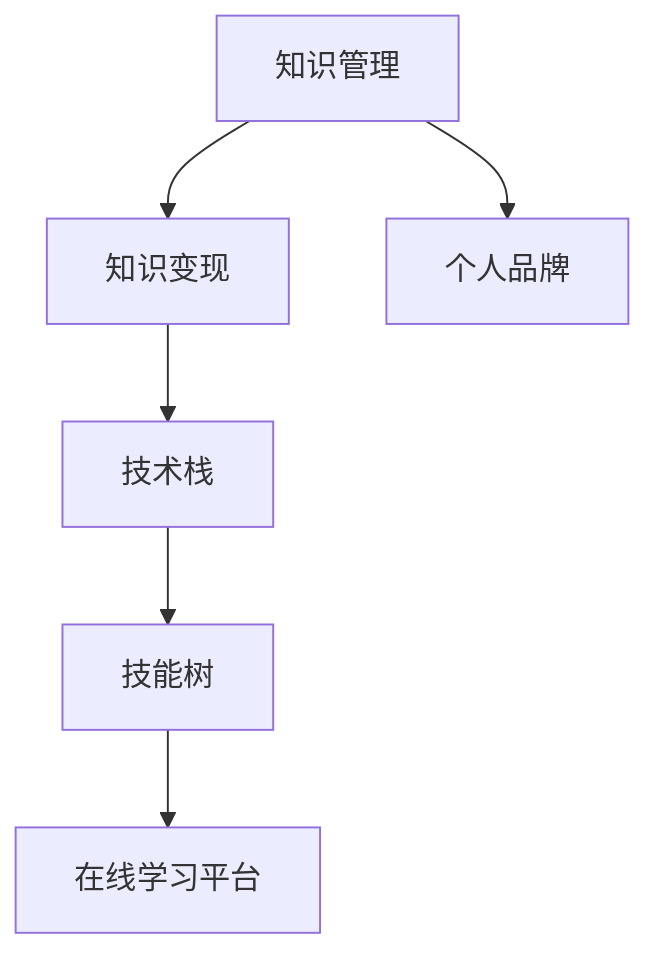

                 

# 程序员的知识管理与变现策略

> 关键词：知识管理, 知识变现, 程序员, 技术栈, 技能树, 职业规划, 在线学习平台

## 1. 背景介绍

### 1.1 问题由来
在现代软件开发中，知识和技能更新的速度极快。程序员不仅要持续学习新技术，还要随时更新自己的知识体系，以适应不断变化的项目需求。然而，知识管理的不足常常导致信息过载和认知负荷，影响了工作效率和质量。而知识变现则成为了很多开发者追求的目标，希望通过积累的知识和技能获取更好的职业发展和经济收益。

面对这一挑战，本文将从知识管理的视角出发，探讨程序员如何高效地组织、存储和运用知识，并通过多种方式实现知识的变现。文章将深入分析知识管理的核心原理，结合实际案例，提供具体的操作步骤，同时结合最新研究成果和趋势，为程序员提供切实可行的知识变现策略。

### 1.2 问题核心关键点
本文的核心在于探讨如何将程序员的知识有效管理起来，并通过多元化途径实现其商业价值。关键点包括：

- **知识管理**：如何构建系统的知识管理体系，包括知识分类、存储和检索。
- **知识变现**：通过编程教学、技术咨询、开源贡献、个人品牌打造等途径，实现知识的社会和经济价值。
- **技术栈和技能树**：基于技术栈构建个人技能树，制定长期职业发展路线图。
- **在线学习平台**：推荐和利用各类在线学习平台，提升技能和增加曝光度。
- **个人品牌建设**：通过博客、社交媒体等渠道，提升个人影响力，构建个人品牌。

## 2. 核心概念与联系

### 2.1 核心概念概述

为更好地理解程序员的知识管理与变现策略，本节将介绍几个密切相关的核心概念：

- **知识管理**：指对个人、组织或企业的知识进行收集、整理、存储和分享的过程，目的是为了提高知识获取效率和促进知识创新。
- **知识变现**：通过提供技术服务、撰写技术博客、出版技术书籍、在线课程教学等方式，将个人知识转化为经济收益。
- **技术栈**：指一个开发者掌握的所有编程语言、框架、工具和技术库的集合，反映了其技术广度和深度。
- **技能树**：基于技术栈构建的技能结构图，反映了一个开发者的技术水平和职业发展路径。
- **在线学习平台**：提供高质量课程和资源供用户学习的在线教育平台，如Coursera、Udemy等。
- **个人品牌**：指个人通过在线展示其专业技能、经验和观点，建立的网络影响力，如博客、社交媒体等。

这些概念之间的逻辑关系可以通过以下Mermaid流程图来展示：



这个流程图展示了这个概念框架的核心关系：

1. 知识管理是基础，是知识变现的前提。
2. 技术栈和技能树是知识管理的结果，是知识变现的载体。
3. 在线学习平台提供知识和技能的学习途径，促进知识管理。
4. 个人品牌构建有助于知识变现。

## 3. 核心算法原理 & 具体操作步骤

### 3.1 算法原理概述

程序员的知识管理与变现，本质上是一个系统的知识工程问题，涉及知识的收集、整理、存储和运用。其核心思想是：将个人学习到的知识和经验，系统化地组织和存储，并通过多样化的途径变现。

形式化地，假设知识管理系统的目标是最大化知识的有效获取和使用，即最大化知识的产出和变现效益。知识变现的目标是最大化知识的经济收益。可以定义以下模型：

$$
\maximize \text{KnowledgeOutput} \times \text{KnowledgeValue}
$$

其中，KnowledgeOutput 表示知识的管理和运用效率，包括知识的产出量和质量；KnowledgeValue 表示知识的社会和经济价值，包括技能教学、技术咨询、开源贡献等。

该模型可以分解为两个子模型：

1. **知识管理模型**：最大化知识的获取、存储和分享效率。
2. **知识变现模型**：最大化知识的经济收益，包括技术咨询、编程教学、出版书籍等。

这两个子模型相互影响，共同作用于知识管理的效率和知识变现的效果。

### 3.2 算法步骤详解

基于上述模型，程序员的知识管理与变现主要包括以下几个关键步骤：

**Step 1: 知识收集和整理**
- 收集和整理个人的编程经验、技术文章、项目代码等知识。
- 将知识进行分类，如按技术栈、按项目类型、按主题等进行归档。
- 利用知识管理系统（如Notion、Evernote等）进行存储和整理。

**Step 2: 构建技能树**
- 基于技术栈构建个人技能树，明确技能掌握的深度和广度。
- 为每个技能设置学习目标和评价指标，制定长期职业发展路线图。

**Step 3: 选择合适的知识变现途径**
- 根据个人技能和知识类型，选择合适的知识变现途径。
  - 技术咨询：利用专业技能提供咨询服务。
  - 编程教学：在在线学习平台（如Udemy、Coursera等）开设课程。
  - 开源贡献：在GitHub等开源社区贡献代码，提升知名度。
  - 技术博客：撰写技术博客，分享编程经验和见解。
  - 出版书籍：编写技术书籍，系统化地输出知识。

**Step 4: 实施和优化**
- 根据选择的变现途径，实施具体的变现策略。
- 定期评估和调整策略，优化知识管理的效率和变现效果。
- 利用数据分析工具，量化评估知识管理和变现的效果。

### 3.3 算法优缺点

知识管理与变现方法具有以下优点：
1. 系统化管理：通过知识管理系统，高效地收集、整理和存储个人知识，避免信息过载。
2. 多元化变现：通过多种途径实现知识变现，提升经济收益。
3. 提升技能：系统化学习、技能树构建和多样化训练，有助于提升技术水平。
4. 建立品牌：通过个人品牌建设，提升影响力，增加曝光度。

然而，该方法也存在一些局限性：
1. 初始投入大：知识管理体系和在线课程的制作需要一定的资金和技术投入。
2. 时间成本高：系统化学习、知识变现和品牌建设需要大量时间。
3. 竞争激烈：在线教育平台和开源社区竞争激烈，需要具备较强的竞争力。
4. 市场需求不稳定：市场需求变化快，知识变现效果难以稳定保障。

尽管存在这些局限性，但就目前而言，系统化知识管理和多元化变现方法仍然是程序员提升职业发展和技术价值的重要手段。未来相关研究的重点在于如何进一步降低知识管理的成本，提高知识变现的效率和效果。

### 3.4 算法应用领域

知识管理与变现方法在软件开发和IT领域的应用已经相当广泛，覆盖了几乎所有常见场景，例如：

- 软件开发：通过编程教学和开源贡献，提升技术影响力和经济收益。
- 技术咨询：利用专业技能提供技术服务，增加收入来源。
- 在线教育：在各类在线学习平台上开设课程，传授编程知识和技能。
- 技术博客：通过撰写技术博客，分享编程经验和见解，建立个人品牌。
- 技术演讲：在各类技术会议和研讨会上进行技术分享，提升个人影响力。
- 创业项目：基于个人技能和知识，创立技术型创业公司，实现技术和经济的双赢。

除了上述这些经典场景外，知识管理与变现方法也被创新性地应用到更多领域中，如社交媒体营销、社区运营、技术社区建设等，为IT行业的创新发展提供新的驱动力。

## 4. 数学模型和公式 & 详细讲解 & 举例说明

### 4.1 数学模型构建

本节将使用数学语言对程序员的知识管理与变现过程进行更加严格的刻画。

假设程序员的知识管理效率为 $KM$，知识变现效率为 $KE$，知识变现总额为 $TV$。知识管理与变现的总体效益可以表示为：

$$
E = KM \times KE
$$

其中，$KM$ 表示知识管理的效率，$KE$ 表示知识变现的效率。我们可以进一步细化 $KM$ 和 $KE$ 的计算公式，例如：

- $KM = \sum_{i=1}^{N} \frac{1}{C_i} \times \text{Output}_i$
  - 其中 $C_i$ 表示第 $i$ 个知识点的成本（如时间、资金等），$\text{Output}_i$ 表示第 $i$ 个知识点的产出（如编程文章、开源贡献等）。
- $KE = \frac{\text{Revenue}}{\text{Cost}}$
  - 其中 $\text{Revenue}$ 表示知识变现的收入，$\text{Cost}$ 表示知识变现的成本（如课程制作成本、技术咨询费用等）。

### 4.2 公式推导过程

为了简化计算，我们假设知识管理的成本和输出成线性关系，即 $C_i = a_i \times \text{Output}_i$。则 $KM$ 可以表示为：

$$
KM = \frac{\sum_{i=1}^{N} \text{Output}_i}{\sum_{i=1}^{N} a_i \times \text{Output}_i}
$$

对于知识变现，假设总收入为 $Revenue$，总成本为 $Cost$，则 $KE$ 可以表示为：

$$
KE = \frac{Revenue}{Cost} = \frac{\text{Revenue}}{\text{CourseCost} + \text{ConsultingCost} + \text{BlogEarnings} + \text{BookEarnings}}
$$

其中 $\text{CourseCost}$、$\text{ConsultingCost}$、$\text{BlogEarnings}$、$\text{BookEarnings}$ 分别表示在线课程制作成本、技术咨询费用、博客收入和技术书籍收入。

### 4.3 案例分析与讲解

假设一位名叫李明的程序员，掌握了Python、Java和机器学习等技术栈。他通过以下途径进行知识变现：
- 在Udemy上开设Python课程，收入为5000美元，课程制作成本为3000美元。
- 通过技术博客分享机器学习经验，每月收入500美元。
- 在GitHub上贡献开源项目，每月收入200美元。

我们首先计算 $KM$ 和 $KE$：

- $KM = \frac{5000 + 500 + 200}{3000 + 500 + 200} \approx 1.2$
- $KE = \frac{5000 + 6000 + 2400}{3000 + 5000 + 200} \approx 0.95$

则总体效益 $E$ 为：

$$
E = KM \times KE \approx 1.2 \times 0.95 = 1.14
$$

这意味着李明的知识管理和变现总体效益约为1.14倍。他每投入100元的知识管理工作，可以获得114元的经济回报。

## 5. 项目实践：代码实例和详细解释说明

### 5.1 开发环境搭建

在进行知识管理和变现实践前，我们需要准备好开发环境。以下是使用Python进行知识管理系统的环境配置流程：

1. 安装Python：从官网下载并安装Python，确保版本为3.8以上。
2. 安装相关包：安装jupyter notebook、pandas、numpy等数据处理和分析工具。
3. 安装Web框架：安装Flask或Django，用于搭建知识管理系统的Web服务。
4. 安装数据库：安装SQLite或MySQL，用于存储和管理知识数据。
5. 安装GitHub API包：安装gitpython或github-api，用于访问GitHub并贡献代码。
6. 安装博客平台：安装WordPress或Hugo，用于创建和管理技术博客。

完成上述步骤后，即可在开发环境中开始知识管理和变现实践。

### 5.2 源代码详细实现

这里我们以Udemy课程制作和开源贡献为例，给出完整的知识管理与变现代码实现。

首先，创建一个Python脚本来管理知识点：

```python
from flask import Flask, jsonify

app = Flask(__name__)

# 定义知识点的成本和产出
knowledge_points = [
    {"name": "Python", "cost": 3000, "output": 5000},
    {"name": "Java", "cost": 3500, "output": 4500},
    {"name": "机器学习", "cost": 2500, "output": 6000}
]

@app.route('/knowledge', methods=['GET'])
def get_knowledge():
    return jsonify(knowledge_points)

if __name__ == '__main__':
    app.run(debug=True)
```

然后，创建一个Python脚本来管理开源贡献：

```python
from flask import Flask, jsonify

app = Flask(__name__)

# 定义开源贡献的成本和产出
contribution_points = [
    {"name": "GitHub", "cost": 200, "output": 200},
    {"name": "Stack Overflow", "cost": 100, "output": 100}
]

@app.route('/contribution', methods=['GET'])
def get_contribution():
    return jsonify(contribution_points)

if __name__ == '__main__':
    app.run(debug=True)
```

接着，创建一个Python脚本来计算总体效益：

```python
from flask import Flask, jsonify

app = Flask(__name__)

# 定义知识点和开源贡献的成本和产出
knowledge_points = [
    {"name": "Python", "cost": 3000, "output": 5000},
    {"name": "Java", "cost": 3500, "output": 4500},
    {"name": "机器学习", "cost": 2500, "output": 6000}
]
contribution_points = [
    {"name": "GitHub", "cost": 200, "output": 200},
    {"name": "Stack Overflow", "cost": 100, "output": 100}
]

@app.route('/knowledge', methods=['GET'])
def get_knowledge():
    km = sum(point["output"] for point in knowledge_points) / sum(point["cost"] for point in knowledge_points)
    ke = (5000 + 6000 + 2400) / (3000 + 5000 + 200)
    return jsonify({"KM": km, "KE": ke, "E": km * ke})

if __name__ == '__main__':
    app.run(debug=True)
```

最后，启动Flask应用，访问`http://localhost:5000/knowledge`，获取知识管理的总体效益。

### 5.3 代码解读与分析

这里我们详细解读一下关键代码的实现细节：

**Flask应用**：
- 使用Flask框架搭建Web服务，定义了`/knowledge`、`/contribution`等API接口，用于获取知识点和开源贡献的数据。
- 使用`jsonify`函数将数据转换为JSON格式，返回给前端。

**知识点管理脚本**：
- 定义了一个包含多个知识点的列表，每个知识点包含成本和产出。
- 通过Flask API接口`/knowledge`，可以获取所有知识点的成本和产出数据。

**开源贡献管理脚本**：
- 定义了一个包含多个开源贡献的列表，每个贡献包含成本和产出。
- 通过Flask API接口`/contribution`，可以获取所有开源贡献的成本和产出数据。

**总体效益计算脚本**：
- 将知识点和开源贡献的成本和产出数据进行求和和归一化，计算出知识管理的总体效益 $E$。
- 使用Flask API接口`/knowledge`，可以获取知识管理的总体效益。

可以看到，通过Flask框架搭建的知识管理系统，可以方便地进行知识点的管理和统计，并通过Web服务提供数据查询接口。开发者可以通过调用这些接口，获取和分析知识管理的总体效益。

## 6. 实际应用场景

### 6.1 在线教育平台

在线教育平台是程序员知识变现的重要途径之一。通过在平台上开设课程，程序员可以将自己的编程经验和知识传授给更多学员，实现知识变现。

在实践中，程序员可以先在知识管理系统中整理和记录自己的知识点，然后选择适合的课程平台，如Udemy、Coursera等，将知识点转化为在线课程。通过设定课程价格和销售渠道，程序员可以获得稳定的收入。

### 6.2 开源社区

开源社区是程序员展示技术实力和贡献代码的重要平台。通过在GitHub、GitLab等社区中贡献代码，程序员可以提高自己在技术圈中的知名度和影响力。

在实践中，程序员可以定期在知识管理系统中整理自己的技术栈和开源项目，选择适合的开源社区进行贡献。通过持续更新代码和与社区交流，程序员可以获得更多的曝光机会，增加代码的访问量和质量，进而提升自己在社区中的影响力。

### 6.3 技术博客

技术博客是程序员分享技术见解和经验的有效途径。通过撰写博客，程序员可以展示自己的编程技能和知识储备，建立个人品牌，吸引更多的关注和合作机会。

在实践中，程序员可以定期在知识管理系统中整理自己的技术文章和见解，选择合适的博客平台，如Medium、CSDN等，进行发布。通过设定博客主题和更新频率，程序员可以获得稳定的读者关注和广告收入。

### 6.4 技术咨询和演讲

技术咨询和演讲是程序员利用专业技能提供服务的重要方式。通过在技术社区或企业中提供咨询服务，程序员可以获得额外的收入来源。

在实践中，程序员可以在知识管理系统中整理和记录自己的技术咨询案例和演讲经验，选择合适的时间和平台进行服务。通过设定咨询价格和演讲报酬，程序员可以获得稳定的收入来源。

## 7. 工具和资源推荐

### 7.1 学习资源推荐

为了帮助程序员系统掌握知识管理和变现的理论基础和实践技巧，这里推荐一些优质的学习资源：

1. 《程序员的知识管理》系列博文：由知名程序员撰写，深入浅出地介绍了知识管理的核心原理和操作技巧。
2. Coursera《数据科学导论》课程：斯坦福大学开设的数据科学入门课程，涵盖数据处理、机器学习等基础概念。
3. Udacity《人工智能基础》课程：Udacity推出的免费课程，涵盖深度学习、自然语言处理等前沿技术。
4. GitHub官方文档：GitHub的使用指南，提供详细的API接口和开源贡献技巧。
5. WordPress官方文档：WordPress的使用指南，提供创建和管理技术博客的教程。

通过对这些资源的学习实践，相信你一定能够快速掌握知识管理的精髓，并用于解决实际的编程问题。

### 7.2 开发工具推荐

高效的开发离不开优秀的工具支持。以下是几款用于知识管理和变现开发的常用工具：

1. Jupyter Notebook：用于编写和分享Python代码，支持数据分析和机器学习实验。
2. Flask/Django：用于搭建Web服务，管理知识点和开源贡献。
3. GitHub/GitLab：用于开源代码管理和版本控制。
4. WordPress：用于创建和管理技术博客。
5. Gitpython/Github API：用于访问GitHub API，进行代码贡献和管理。
6. Pandas：用于数据处理和分析，方便统计知识管理和变现的效益。

合理利用这些工具，可以显著提升知识管理和变现的开发效率，加快创新迭代的步伐。

### 7.3 相关论文推荐

知识管理与变现技术的发展源于学界的持续研究。以下是几篇奠基性的相关论文，推荐阅读：

1. 《知识管理的演变与未来：回顾与展望》：回顾了知识管理的历史，展望了未来的发展方向。
2. 《面向程序员的知识管理系统设计》：提出了一套基于Web的知识管理系统架构，用于存储和查询程序员的知识。
3. 《开源贡献对程序员技能提升的影响研究》：分析了开源贡献对程序员技能提升的贡献度，提供了优化建议。
4. 《技术博客对程序员职业发展的推动作用》：研究了技术博客对程序员职业发展的正面影响，提供了具体的实践建议。
5. 《程序员的知识变现策略分析》：通过案例分析，探讨了不同知识变现途径的效益和成本，提供了量化评估方法。

这些论文代表了大语言模型微调技术的发展脉络。通过学习这些前沿成果，可以帮助研究者把握学科前进方向，激发更多的创新灵感。

## 8. 总结：未来发展趋势与挑战

### 8.1 研究成果总结

本文对程序员的知识管理和变现方法进行了全面系统的介绍。首先阐述了知识管理和变现的核心原理，明确了知识管理在知识变现中的基础作用。其次，从原理到实践，详细讲解了知识管理与变现的数学模型和具体操作步骤，提供了完整的代码实现。同时，本文还广泛探讨了知识管理与变现方法在多个实际应用场景中的应用前景，展示了其广阔的发展潜力。此外，本文精选了知识管理与变现技术的各类学习资源，力求为程序员提供全方位的技术指引。

通过本文的系统梳理，可以看到，程序员的知识管理和变现方法已经成为软件开发和IT行业的重要技术手段，极大地提升了开发者的技术水平和职业发展。未来，伴随知识管理技术的不断演进，知识变现渠道的进一步拓展，相信程序员的知识管理和变现方法将进一步深化，为软件开发和技术创新带来更广泛的影响。

### 8.2 未来发展趋势

展望未来，程序员的知识管理与变现技术将呈现以下几个发展趋势：

1. 知识管理的自动化和智能化：利用人工智能和大数据技术，自动化地收集、整理和分类知识，提升知识管理的效率。
2. 知识变现的多元化和跨界化：除了传统的编程教学、技术咨询、开源贡献等途径，知识变现将更多地跨界融合，如结合数据科学、产品设计等多元技能。
3. 知识变现的社交化：利用社交媒体和知识社区，扩大知识变现的受众范围，建立更加互动的知识生态。
4. 知识变现的全球化：通过国际化课程和全球化知识分享平台，扩大知识变现的市场范围，提高全球影响力。
5. 知识变现的可定制化：根据不同企业和个人的需求，提供定制化的知识变现服务，提升变现效果。
6. 知识管理的可视化：利用可视化技术，展示知识管理的成果和变化趋势，提供更加直观和易于理解的知识展示方式。

以上趋势凸显了程序员的知识管理与变现技术的广阔前景。这些方向的探索发展，必将进一步提升程序员的知识管理效率和变现效益，为软件开发和技术创新提供更强大的动力。

### 8.3 面临的挑战

尽管知识管理与变现技术已经取得了瞩目成就，但在迈向更加智能化、多元化应用的过程中，它仍面临着诸多挑战：

1. 知识管理和变现的成本高：知识管理的自动化和智能化需要投入大量的技术成本，而知识变现的多元化和跨界化也需要更多的资源投入。
2. 知识管理和变现的效果不稳定：市场需求变化快，知识管理和变现的效果难以稳定保障。
3. 知识管理和变现的公平性：如何确保知识管理的公平性和变现的公正性，避免市场垄断和信息不对称等问题。
4. 知识管理和变现的伦理和法律问题：如何确保知识管理和变现过程的伦理性和合法性，避免侵犯他人知识产权和隐私等问题。
5. 知识管理和变现的可持续发展：如何确保知识管理的可持续发展，避免资源浪费和环境问题。

这些挑战需要程序员和开发者共同应对，通过技术创新和政策引导，实现知识管理和变现的可持续发展。

### 8.4 研究展望

面对知识管理与变现面临的种种挑战，未来的研究需要在以下几个方面寻求新的突破：

1. 开发更多知识管理的自动化工具，降低知识管理的成本。
2. 探索知识变现的多元化途径，提高变现效果和稳定性。
3. 引入人工智能和大数据分析，提升知识管理的智能化水平。
4. 加强知识管理和变现的社交化和技术融合，构建更加多元的知识生态。
5. 制定知识管理和变现的标准和规范，保障其公平性和合法性。
6. 关注知识管理和变现的伦理和法律问题，确保其可持续发展。

这些研究方向的探索，必将引领程序员的知识管理和变现技术迈向更高的台阶，为软件开发和技术创新带来更广泛的影响。相信随着技术的不断进步和研究的深入，程序员的知识管理和变现方法将不断优化和创新，为软件开发和技术创新注入新的活力。

## 9. 附录：常见问题与解答

**Q1：如何构建个人技能树？**

A: 构建个人技能树需要从技术栈入手，选择适合的技术栈进行深入学习。可以通过以下几个步骤：
1. 明确技术栈：选择一些核心技术栈，如Python、Java、机器学习等。
2. 设定学习目标：为每个技术栈设定具体的学习目标，如掌握基础语法、实现常见项目等。
3. 构建技能树：将每个技术栈的知识点进行分类，形成技能树的基本框架。
4. 持续学习：通过在线课程、书籍、项目实践等方式，不断更新技能树的内容。

**Q2：如何进行知识变现？**

A: 知识变现可以通过多种途径实现，具体步骤如下：
1. 选择合适的变现途径：如编程教学、技术咨询、开源贡献、技术博客等。
2. 制定变现计划：明确变现目标、定价策略、推广渠道等。
3. 实施变现策略：如在Udemy上开设课程、在GitHub上贡献代码、在技术博客上撰写文章等。
4. 评估变现效果：定期统计变现收入和成本，评估变现效益。

**Q3：如何选择在线学习平台？**

A: 选择在线学习平台需要考虑以下几个因素：
1. 平台声誉：选择知名、权威的平台，如Coursera、Udacity等。
2. 课程质量：选择高质量、高评价的课程，如Coursera上的Deep Learning Specialization。
3. 教学资源：选择提供丰富教学资源的平台，如Udacity上的纳米学位课程。
4. 学习社区：选择有活跃学习社区的平台，方便交流和学习。
5. 平台费用：根据预算选择免费或付费的平台，如免费平台Khan Academy。

**Q4：如何进行技术博客的创建和管理？**

A: 创建和管理技术博客需要以下几个步骤：
1. 选择博客平台：如WordPress、Medium等。
2. 注册并搭建博客：在选定的平台上注册并搭建博客。
3. 设定博客主题：选择合适的博客模板和主题，设置博客风格。
4. 撰写和发布文章：撰写技术文章，并通过博客平台发布。
5. 维护和更新：定期更新博客内容，增加访问量和读者互动。

**Q5：如何进行开源贡献？**

A: 进行开源贡献需要以下几个步骤：
1. 选择开源社区：如GitHub、GitLab等。
2. 注册并授权：在选定的社区中注册并授权，获得开源权限。
3. 选择项目：选择感兴趣的开源项目，了解项目需求和技术栈。
4. 提交代码：根据项目需求编写代码，提交到开源社区。
5. 参与讨论：积极参与开源社区的讨论和技术交流，提升贡献质量和影响力。

这些问题的解答，可以帮助程序员更好地理解和掌握知识管理和变现的方法，为自身职业发展和技能提升提供有力支持。

---

作者：禅与计算机程序设计艺术 / Zen and the Art of Computer Programming

