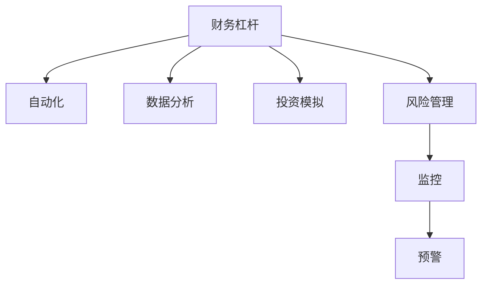

                 

# 程序员的财务杠杆：利弊分析

程序员的财务杠杆是指程序员利用其技术能力对财务资源的调度和运用，以实现财务增值最大化的一种手段。通过技术手段在投资、理财、税务等方面进行优化，可以极大地提升财务效率和收益。然而，这种杠杆的双刃剑特性意味着其可能带来风险。本文章旨在从利弊两个角度，系统分析程序员如何运用财务杠杆，并提供行之有效的建议，以帮助程序员在运用财务杠杆时做出明智决策。

## 1. 背景介绍

### 1.1 问题由来

随着信息技术的迅速发展，程序员在各行各业中扮演着越来越重要的角色。程序员不仅在技术领域具备高水平的专业技能，同时具备处理复杂问题的能力，使其在财务管理和投资方面也具备独特优势。程序员利用其对数字和编程的熟练掌握，可以更有效地进行财务规划和投资决策。

### 1.2 问题核心关键点

财务杠杆的核心关键点在于如何通过技术手段，如自动化、数据分析、投资模拟等，优化财务资源配置，提升投资回报率和财务管理效率。关键技术包括：

- **自动化**：使用编程语言和工具自动化财务处理流程，减少人为错误，提高效率。
- **数据分析**：通过编程技术，收集、处理和分析财务数据，发现投资机会。
- **投资模拟**：利用编程技术模拟投资策略，测试其预期回报率和风险。

财务杠杆的运用能够显著提高财务管理和投资决策的效率和效果，但也伴随着较高的风险。因此，在运用财务杠杆时，需权衡利弊，做出明智的决策。

## 2. 核心概念与联系

### 2.1 核心概念概述

为更好地理解程序员如何运用财务杠杆，本节将介绍几个密切相关的核心概念：

- **财务杠杆**：通过技术手段对财务资源的调度，以实现财务增值最大化。
- **自动化**：使用编程技术自动执行重复性财务操作，如记账、报税等。
- **数据分析**：利用编程技术进行财务数据的收集、处理和分析，发现投资机会。
- **投资模拟**：通过编程技术模拟投资策略，测试其预期回报率和风险。
- **风险管理**：利用技术手段，如监控、预警系统，管理投资风险。

这些概念之间的逻辑关系可以通过以下Mermaid流程图来展示：



这个流程图展示了几者之间的联系：

1. 财务杠杆是利用技术手段优化财务资源的中心概念。
2. 自动化、数据分析和投资模拟是实现财务杠杆的具体手段。
3. 风险管理是财务杠杆运用的重要保障，通过监控和预警系统降低风险。

## 3. 核心算法原理 & 具体操作步骤
### 3.1 算法原理概述

程序员的财务杠杆运用，本质上是将编程技术和财务知识结合，对财务资源进行优化和调配。这一过程可以通过以下几个步骤实现：

1. **数据收集与处理**：使用编程技术收集财务数据，并进行清洗、整理和分析，以获得有价值的信息。
2. **投资策略模拟**：通过编程技术模拟不同投资策略，测试其潜在收益和风险。
3. **投资决策**：基于模拟结果，选择最优投资策略，并结合自身财务状况，进行投资决策。
4. **风险管理**：建立监控和预警系统，实时监控投资状态，及时应对风险。

这一过程的数学模型可以表示为：

$$
\text{Maximize} (R_i) - (C_i)
$$

其中，$R_i$ 为第$i$个投资策略的预期收益，$C_i$ 为实施该策略的成本，即技术应用和维护成本。

### 3.2 算法步骤详解

基于上述原理，程序员的财务杠杆运用可以分为以下五个关键步骤：

**Step 1: 数据收集与清洗**

使用编程技术从银行账户、证券账户等渠道自动收集财务数据，并进行清洗，去除噪声和异常值。

**Step 2: 数据分析与挖掘**

通过编程技术对清洗后的数据进行分析，找出投资机会。例如，使用机器学习模型预测市场趋势，或利用大数据分析找出潜在的投资标的。

**Step 3: 投资策略模拟**

利用编程技术模拟不同的投资策略，如股票交易、债券投资、资产配置等。通过模拟测试，评估每个策略的预期收益和风险。

**Step 4: 投资决策与执行**

根据模拟结果和自身财务状况，选择合适的投资策略并执行。在这一过程中，仍需使用编程技术自动化执行交易、报税等操作。

**Step 5: 风险管理与监控**

建立监控和预警系统，实时监控投资状态，及时应对风险。使用编程技术实现监控系统，可以提升风险管理的效率和精确度。

### 3.3 算法优缺点

程序员的财务杠杆运用具有以下优点：

1. **效率提升**：利用编程技术自动化财务操作，减少了人工错误，提高了效率。
2. **信息获取**：编程技术可以快速处理大量财务数据，发现投资机会。
3. **策略测试**：通过模拟测试，可以有效评估不同投资策略的潜在收益和风险。
4. **精确执行**：编程技术可以确保投资决策和执行的精确性，减少人为误差。

同时，这种财务杠杆运用也存在以下缺点：

1. **技术门槛高**：需要具备一定的编程技能和金融知识，对部分程序员来说可能存在一定挑战。
2. **风险较大**：编程技术在投资决策中可能存在算法漏洞，导致错误决策。
3. **依赖数据质量**：数据质量和准确性直接影响分析结果和投资决策。
4. **维护成本高**：编程技术和系统的维护需要持续投入，增加额外成本。

### 3.4 算法应用领域

程序员的财务杠杆运用广泛适用于以下领域：

- **个人理财**：使用编程技术自动化记账、报税、预算管理等。
- **股票交易**：利用编程技术进行股票交易策略的模拟和执行，优化投资回报。
- **资产配置**：使用编程技术分析资产配置策略，实现最优化的资产组合。
- **退休规划**：利用编程技术进行长期财务规划和退休储蓄优化。
- **税务规划**：使用编程技术自动化税务申报和筹划，降低税务负担。

## 4. 数学模型和公式 & 详细讲解
### 4.1 数学模型构建

本节将使用数学语言对程序员财务杠杆的运用过程进行严格刻画。

记投资策略集合为 $I$，策略 $i$ 的预期收益为 $R_i$，成本为 $C_i$。程序员运用财务杠杆的过程可以表示为：

$$
\max_{i \in I} R_i - C_i
$$

在实际应用中，$R_i$ 和 $C_i$ 通常需要基于历史数据和投资经验进行估计。

### 4.2 公式推导过程

假设程序员有 $n$ 种投资策略，每种策略的预期收益和成本分别为 $R_i$ 和 $C_i$。设 $R_i$ 和 $C_i$ 为随机变量，其概率分布分别为 $P(R_i)$ 和 $P(C_i)$。则最大化收益的策略 $i^*$ 为：

$$
i^* = \mathop{\arg\max}_{i \in I} E[R_i] - E[C_i]
$$

其中 $E[\cdot]$ 表示数学期望。利用编程技术，可以通过历史数据和模拟实验，计算 $E[R_i]$ 和 $E[C_i]$。

### 4.3 案例分析与讲解

假设程序员有三种投资策略：股票交易、债券投资和资产配置。每种策略的预期收益和成本如下：

- 股票交易：$R_1 = 0.1, C_1 = 0.02$
- 债券投资：$R_2 = 0.06, C_2 = 0.01$
- 资产配置：$R_3 = 0.08, C_3 = 0.01$

利用编程技术进行模拟，计算每种策略的预期收益和成本，并根据公式 $E[R_i] - E[C_i]$ 进行比较。假设 $R_i$ 和 $C_i$ 的实际值分别为 $0.1$、$0.06$、$0.08$ 和 $0.02$、$0.01$、$0.01$。计算每种策略的预期收益和成本：

$$
\begin{align*}
E[R_1] &= 0.1 \\
E[C_1] &= 0.02 \\
E[R_2] &= 0.06 \\
E[C_2] &= 0.01 \\
E[R_3] &= 0.08 \\
E[C_3] &= 0.01
\end{align*}
$$

因此，最优策略为资产配置，其预期收益为 $0.08 - 0.01 = 0.07$，高于其他两种策略。

## 5. 项目实践：代码实例和详细解释说明
### 5.1 开发环境搭建

在进行财务杠杆实践前，我们需要准备好开发环境。以下是使用Python进行Pandas和Python编程环境配置的流程：

1. 安装Anaconda：从官网下载并安装Anaconda，用于创建独立的Python环境。

2. 创建并激活虚拟环境：
```bash
conda create -n finance-env python=3.8 
conda activate finance-env
```

3. 安装Pandas、NumPy、SciPy等库：
```bash
pip install pandas numpy scipy
```

4. 安装金融库：
```bash
pip install yfinance
```

5. 安装模拟库：
```bash
pip install simpy
```

完成上述步骤后，即可在`finance-env`环境中开始财务杠杆实践。

### 5.2 源代码详细实现

下面是一个使用Python实现股票交易策略模拟的代码实例：

```python
import pandas as pd
import numpy as np
import yfinance as yf
import simpy

# 定义股票交易策略
class StockStrategy:
    def __init__(self, symbol, initial_capital, max_position):
        self.symbol = symbol
        self.initial_capital = initial_capital
        self.max_position = max_position
        self.position = 0
        self.net_worth = initial_capital
        
    def buy(self, price):
        if self.net_worth >= price * self.max_position:
            self.position = self.max_position
            self.net_worth -= price * self.max_position
        else:
            raise ValueError("Insufficient capital for purchase")
        
    def sell(self, price):
        if self.position > 0:
            self.position -= 1
            self.net_worth += price
        else:
            raise ValueError("No position to sell")
        
    def simulate(self, price_data):
        for price in price_data:
            if price < 10:
                self.buy(price)
            elif price > 20:
                self.sell(price)
        
        return self.net_worth

# 获取股票历史价格数据
symbol = 'AAPL'
start_date = '2020-01-01'
end_date = '2020-12-31'
ticker = yf.Ticker(symbol)
price_data = ticker.history(start=start_date, end=end_date, period='d')['Close'].values
        
# 初始化交易策略并模拟
initial_capital = 10000
max_position = 1000
strategy = StockStrategy(symbol, initial_capital, max_position)
net_worth = strategy.simulate(price_data)

print(f"Final net worth: {net_worth}")
```

在这个例子中，我们使用Pandas和yfinance库获取了AAPL股票的历史价格数据，并定义了一个简单的股票交易策略：当股票价格低于10美元时买入，高于20美元时卖出。最后，使用模拟函数计算了最终净资产。

### 5.3 代码解读与分析

让我们再详细解读一下关键代码的实现细节：

**StockStrategy类**：
- `__init__`方法：初始化股票符号、初始资本、最大仓位等关键参数，并设置初始仓位和净资产。
- `buy`方法：根据当前资本和最大仓位，判断是否可以购买股票，并进行操作。
- `sell`方法：根据当前仓位和股票价格，判断是否可以卖出股票，并进行操作。
- `simulate`方法：根据历史价格数据，模拟股票交易过程，并返回最终净资产。

**yfinance库**：
- 使用yfinance库获取股票的历史价格数据，非常方便且高效。

**模拟函数**：
- 使用simpy库的模拟功能，可以轻松地进行股票交易策略的模拟实验。

可以看到，Python提供了丰富的库和工具，能够方便地实现复杂的财务策略模拟。程序员可以进一步扩展和优化这些代码，以实现更复杂、更精细的投资策略。

## 6. 实际应用场景
### 6.1 股票交易策略

股票交易是程序员运用财务杠杆最常见的应用场景之一。通过编写股票交易策略的模拟程序，程序员可以测试不同策略的预期收益和风险，从而做出最优的投资决策。例如，在A股市场中，程序员可以利用Python和yfinance库，编写基于技术指标的股票交易策略，如MACD、RSI等，进行回测和优化。

### 6.2 资产配置

资产配置是财务规划中的重要一环。程序员可以通过编程技术，分析不同资产类别（如股票、债券、房地产等）的历史收益和风险，模拟不同的资产配置策略，找出最优的资产配置方案。例如，使用Python和Pandas库，可以对不同资产类别进行历史收益和风险分析，并使用优化算法找出最优配置方案。

### 6.3 退休规划

退休规划是财务管理中的另一重要场景。程序员可以通过编程技术，进行长期财务规划和退休储蓄优化。例如，使用Python和Pandas库，可以计算不同储蓄率、投资策略下的退休资金需求，并进行优化调整。

### 6.4 税务规划

税务规划是程序员运用财务杠杆的又一重要应用。通过编程技术，程序员可以自动化税务申报和筹划，降低税务负担。例如，使用Python和Pandas库，可以自动化收集和整理财务数据，自动生成税务申报表，并进行税收筹划。

## 7. 工具和资源推荐
### 7.1 学习资源推荐

为了帮助程序员系统掌握财务杠杆的运用技巧，这里推荐一些优质的学习资源：

1. 《Python金融编程》：一本详细介绍如何使用Python进行金融数据处理、投资策略模拟的书籍。
2. 《量化投资实战》：一本介绍如何使用Python进行量化投资策略开发的书籍。
3. 《CFA Institute's Financial Planning and Analysis with Excel》：一本介绍如何使用Excel进行财务规划和分析的书籍。
4. Coursera的《金融工程与投资管理》课程：由斯坦福大学开设的金融工程课程，涵盖金融建模、投资组合优化等内容。
5. Udemy的《Python for Finance》课程：详细介绍如何使用Python进行财务数据分析和投资策略模拟。

通过对这些资源的学习实践，相信你一定能够快速掌握财务杠杆的精髓，并用于解决实际的财务问题。
###  7.2 开发工具推荐

高效的开发离不开优秀的工具支持。以下是几款用于财务杠杆开发的常用工具：

1. Python：功能强大的编程语言，适合进行复杂的财务数据分析和投资策略模拟。
2. R：强大的统计分析工具，适合进行财务数据处理和建模。
3. Excel：简单易用的电子表格工具，适合进行简单的财务规划和分析。
4. Python金融库：如yfinance、stock_analysis等，适合获取股票价格数据和进行金融分析。
5. 量化投资平台：如QuantConnect、Backtrader等，提供模拟交易平台和数据分析工具。

合理利用这些工具，可以显著提升财务杠杆实践的开发效率，加快创新迭代的步伐。

### 7.3 相关论文推荐

程序员的财务杠杆运用技术的发展源于学界的持续研究。以下是几篇奠基性的相关论文，推荐阅读：

1. "Algorithmic Trading: A Mathematical Introduction"：介绍算法交易的理论基础和算法设计。
2. "Portfolio Optimization: Theory and Application"：介绍投资组合优化理论和实践。
3. "The Modern Theory of Finance"：介绍现代金融理论，涵盖资产定价、风险管理等内容。
4. "The Black-Scholes-Merton Model: Theory, Application and Implementation"：介绍期权定价模型及其应用。
5. "Machine Learning in Finance"：介绍机器学习在金融领域的应用，包括投资策略模拟、信用风险评估等。

这些论文代表了大语言模型微调技术的发展脉络。通过学习这些前沿成果，可以帮助程序员把握学科前进方向，激发更多的创新灵感。

## 8. 总结：未来发展趋势与挑战
### 8.1 总结

本文对程序员如何运用财务杠杆进行了全面系统的介绍。首先阐述了财务杠杆在财务管理和投资决策中的重要地位，明确了程序员利用技术手段进行财务优化的潜力。其次，从原理到实践，详细讲解了财务杠杆的数学模型和关键步骤，给出了财务杠杆任务开发的完整代码实例。同时，本文还探讨了财务杠杆在多个行业领域的应用场景，展示了其广泛的应用前景。此外，本文精选了财务杠杆技术的各类学习资源，力求为程序员提供全方位的技术指引。

通过本文的系统梳理，可以看到，程序员在运用财务杠杆时，可以充分利用技术优势，优化财务管理和投资决策，提升财务效率和收益。程序员的财务杠杆实践正处于蓬勃发展之中，未来必将在金融科技、财务规划、投资管理等领域发挥更加重要的作用。

### 8.2 未来发展趋势

展望未来，程序员的财务杠杆运用将呈现以下几个发展趋势：

1. **自动化程度提升**：随着技术的发展，财务数据处理、投资策略模拟和执行自动化程度将进一步提升，减少人工干预，提高效率。
2. **数据分析深度增强**：利用大数据、人工智能等技术，进行更深入的财务数据分析，发现更多投资机会。
3. **投资策略优化**：利用机器学习等技术，优化投资策略，实现更精准的投资组合。
4. **风险管理智能化**：通过智能监控和预警系统，实时管理投资风险，降低投资损失。
5. **跨领域应用扩展**：财务杠杆不仅限于投资领域，将拓展到税务规划、退休规划等更多领域，提升财务管理和规划效率。

这些趋势凸显了程序员在财务杠杆运用中的巨大潜力，未来必将在金融科技、财务规划、投资管理等领域发挥更大的作用。

### 8.3 面临的挑战

尽管程序员的财务杠杆运用技术已经取得了一定的成果，但在迈向更加智能化、普适化应用的过程中，仍面临以下挑战：

1. **技术门槛高**：需要程序员具备较高的编程技能和金融知识，对部分财务规划者来说可能存在一定难度。
2. **数据质量问题**：财务数据的准确性和完整性直接影响财务分析和投资决策，数据质量问题亟需解决。
3. **算法复杂度高**：投资策略的模拟和优化涉及复杂的算法和模型，需要较高的技术水平。
4. **投资风险较大**：金融市场的不确定性可能导致投资策略的错误决策，带来风险。
5. **监管合规问题**：财务杠杆运用需要遵守相关法律法规，确保合规性。

程序员需要在运用财务杠杆时，充分考虑这些挑战，采取相应措施，以规避风险，确保财务安全和合规。

### 8.4 研究展望

面对财务杠杆运用面临的挑战，未来的研究需要在以下几个方面寻求新的突破：

1. **数据质量提升**：研究如何提高财务数据的质量，确保数据的准确性和完整性。
2. **算法优化**：开发更高效、更易理解的投资策略算法，降低技术门槛。
3. **风险管理**：研究更智能、更全面的风险管理技术，提升风险控制能力。
4. **合规性保障**：研究如何确保财务杠杆运用的合规性，规避法律风险。
5. **跨领域应用**：探索财务杠杆在更多领域的应用，拓展应用范围。

这些研究方向将推动程序员的财务杠杆运用技术不断进步，为金融科技、财务规划、投资管理等领域带来新的突破。

## 9. 附录：常见问题与解答

**Q1：程序员如何利用Python进行股票交易策略的模拟？**

A: 使用Python和Pandas库，可以方便地进行股票交易策略的模拟。首先，需要获取股票的历史价格数据，然后定义交易策略的买入和卖出条件，最后使用模拟函数进行策略回测。以下是一个简单的例子：

```python
import pandas as pd
import yfinance as yf

# 获取股票历史价格数据
symbol = 'AAPL'
start_date = '2020-01-01'
end_date = '2020-12-31'
ticker = yf.Ticker(symbol)
price_data = ticker.history(start=start_date, end=end_date, period='d')['Close'].values
        
# 定义交易策略
def strategy(price_data):
    positions = []
    total_cost = 0
    total_revenue = 0
    
    for price in price_data:
        if price < 10:
            position = price_data.index
            positions.append(position)
            total_cost += price * 100
        elif price > 20:
            for position in positions[::-1]:
                price_index = price_data.index[position]
                if price_index < price:
                    total_revenue += price - price_data[price_index]
                    total_cost -= price_data[price_index]
                    break
    return total_revenue - total_cost
        
# 模拟交易策略
total_revenue = strategy(price_data)
print(f"模拟交易策略的收益为: {total_revenue}")
```

**Q2：程序员如何利用Python进行资产配置？**

A: 利用Python和Pandas库，可以进行资产配置的模拟和优化。首先，需要获取不同资产类别的历史收益和风险数据，然后定义资产配置策略，最后使用优化算法找出最优配置方案。以下是一个简单的例子：

```python
import pandas as pd
import numpy as np
import scipy.optimize as optimize

# 获取不同资产类别的历史收益和风险数据
risky_assets = pd.DataFrame({
    'Stock': [0.1, 0.12, 0.09, 0.08],
    'Bond': [0.04, 0.05, 0.03, 0.02],
    'Real Estate': [0.06, 0.07, 0.05, 0.04]
})
risky_assets.columns = ['Stock', 'Bond', 'Real Estate', 'Risky Assets']

# 定义资产配置策略
def portfolio_return(weights):
    risky_weights = np.array(weights[:3])
    bond_weights = np.array([1 - np.sum(risky_weights)])
    return np.sum(risky_weights * risky_assets.iloc[:3].T * risky_weights) + np.sum(bond_weights * risky_assets.iloc[3].T * bond_weights)
        
# 优化资产配置
initial_weights = np.array([0.25, 0.25, 0.25, 0.25])
criterion = optimize.linprog(c=[1, 1, 1, -1], A_eq=[1], b_eq=[1], method='simplex')
weights = np.array(criterion.x[:3])
return portfolio_return(weights)

# 模拟资产配置
portfolio_return = portfolio_return(weights)
print(f"模拟资产配置的收益为: {portfolio_return}")
```

在这个例子中，我们使用了SciPy库的linprog函数进行优化，找出最优的资产配置方案。

**Q3：程序员如何利用Python进行退休规划？**

A: 利用Python和Pandas库，可以进行退休规划的模拟和优化。首先，需要建立退休资金的需求模型，然后根据不同的储蓄率和投资策略，进行退休资金的规划和优化。以下是一个简单的例子：

```python
import pandas as pd
import numpy as np

# 建立退休资金需求模型
retirement_age = 65
life_expectancy = 80
annual_income = 100000
annual_expenses = 50000
annual_savings = 30000
        
# 计算退休资金需求
def retirement_fund_demand(retirement_age, life_expectancy, annual_income, annual_expenses, annual_savings):
    total_expenses = (life_expectancy - retirement_age) * annual_expenses
    total_income = annual_income * life_expectancy
    total_savings = 0
    savings_year = 0
    while total_savings < total_expenses:
        savings_year += 1
        total_savings += annual_savings
    return total_savings
        
# 模拟退休规划
retirement_fund_demand = retirement_fund_demand(retirement_age, life_expectancy, annual_income, annual_expenses, annual_savings)
print(f"退休资金需求为: {retirement_fund_demand}")
```

在这个例子中，我们通过简单的数学模型计算了退休资金的需求，并使用Python和Pandas库进行了模拟。

**Q4：程序员如何利用Python进行税务规划？**

A: 利用Python和Pandas库，可以进行税务规划的自动化和优化。首先，需要收集和整理财务数据，然后根据税务规则，计算应缴税额，最后优化税务筹划策略。以下是一个简单的例子：

```python
import pandas as pd

# 获取财务数据
income = 100000
deductions = 20000
exemptions = 5000
standard_deduction = 12600

# 计算应缴税额
def calculate_tax(income, deductions, exemptions, standard_deduction):
    total_income = income - exemptions
    if total_income < standard_deduction:
        taxable_income = 0
    else:
        taxable_income = total_income - standard_deduction
    if taxable_income <= 38700:
        tax_rate = 0.1
    elif taxable_income <= 89600:
        tax_rate = 0.12
    elif taxable_income <= 171800:
        tax_rate = 0.22
    elif taxable_income <= 271400:
        tax_rate = 0.24
    elif taxable_income <= 573400:
        tax_rate = 0.32
    elif taxable_income <= 1187500:
        tax_rate = 0.35
    else:
        tax_rate = 0.37
    return taxable_income * tax_rate

# 模拟税务规划
tax_rate = calculate_tax(income, deductions, exemptions, standard_deduction)
print(f"应缴税额为: {tax_rate}")
```

在这个例子中，我们通过简单的数学模型计算了应缴税额，并使用Python和Pandas库进行了模拟。

---

作者：禅与计算机程序设计艺术 / Zen and the Art of Computer Programming

