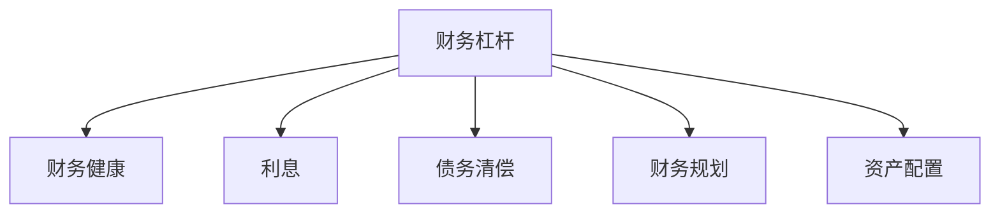

                 

# 程序员的财务杠杆：如何明智地使用债务

## 1. 背景介绍

### 1.1 问题由来
在现代经济中，债务已成为许多个体和家庭的重要财务工具，程序员群体也不例外。他们的高收入与科技行业的快速发展相结合，使得借贷成为一种常见的金融行为。然而，对于程序员来说，如何明智地使用债务是一个需要深入探讨的话题。无论是购买房产、投资创业，还是满足日常开销，债务管理在他们的财务规划中扮演着关键角色。

### 1.2 问题核心关键点
债务管理对于程序员财务健康至关重要。合理的债务使用能加速财富积累，提升生活质量，但若使用不当，可能导致财务困境。因此，如何评估债务的利弊、制定合理的借贷策略，是程序员金融知识的关键。

### 1.3 问题研究意义
研究程序员如何明智地使用债务，对于提升他们的财务素养、优化投资决策、防范金融风险具有重要意义。这不仅有助于程序员在职业发展中更好地管理个人财务，还能为更广泛的社会群体提供参考，促进个人理财的科学化。

## 2. 核心概念与联系

### 2.1 核心概念概述

为更好理解程序员使用债务的策略，本节将介绍几个关键概念：

- **财务杠杆（Financial Leverage）**：指通过借贷来放大财务收益或损失的能力。对程序员而言，这意味着利用贷款加速资产积累或增加现金流，但同样承担着还本付息的风险。

- **财务健康（Financial Wellness）**：指个人或家庭在不增加财务负担的前提下，实现经济自由和财务稳定的状态。关键在于平衡负债与资产，确保财务可持续。

- **利息（Interest）**：借贷所产生的成本，分为简单利息和复利。复利对长期财务规划尤为关键，因其能加速本金增长的过程。

- **债务清偿（Debt Repayment）**：减少或消除借贷的过程，涉及还款计划、提前还款、利率调整等多种策略。

- **财务规划（Financial Planning）**：包括收入评估、支出管理、投资策略、退休规划等，旨在实现财务目标和改善财务状况。

- **资产配置（Asset Allocation）**：根据个人风险偏好和财务目标，合理分配不同资产类型，如股票、债券、房地产等。

这些核心概念构成了程序员使用债务的基础框架，通过理解这些概念，程序员可以更明智地决策，确保财务稳定。

### 2.2 核心概念原理和架构的 Mermaid 流程图(Mermaid 流程节点中不要有括号、逗号等特殊字符)


## 3. 核心算法原理 & 具体操作步骤

### 3.1 算法原理概述
程序员使用债务的原理在于财务杠杆的放大作用，即通过债务增加资产的购买力，从而获得更高的财务回报。然而，这一过程并非没有风险，需要严格评估利息成本和清偿风险。

- **财务杠杆原理**：借入资金可以加速资本积累，如投资房产、创业公司，但这要求对市场有准确的判断，同时准备承担高额利息和可能的清偿风险。

- **利息计算**：借款人需要了解利息的计算方式，包括本金、利率、时间等关键因素，以评估还款负担。

- **清偿策略**：合理的还款计划和提前还款策略，能有效降低长期利息成本，加快债务清除。

### 3.2 算法步骤详解

#### 3.2.1 初始评估
程序员应首先评估个人财务状况，包括收入、支出、储蓄和债务。通过资产负债表分析，明确借贷的合理性。

#### 3.2.2 目标设定
明确借贷的目的，是为了购房、创业还是日常消费。设定清晰的财务目标，有助于制定合理的借贷策略。

#### 3.2.3 选择贷款产品
根据需求选择适合的贷款产品，比较利率、期限、还款方式等。科技公司常提供灵活的贷款选项，需深入了解并评估。

#### 3.2.4 制定还款计划
制定详细的还款计划，考虑利率、期限和清偿策略。定期调整还款计划以适应财务变化，如收入增加或减少。

#### 3.2.5 风险管理
建立风险管理机制，如预算控制、应急储蓄等，确保财务稳定，防范债务风险。

### 3.3 算法优缺点

#### 3.3.1 优点
- **加速资本积累**：通过债务加速资本积累，提高投资回报率。
- **多样化资产配置**：债务融资有助于实现资产多样化，降低单一投资风险。
- **财务灵活性**：债务融资提供灵活的资金来源，支持创业、购房等财务目标。

#### 3.3.2 缺点
- **高利息成本**：长期借款可能累积高额利息，增加财务负担。
- **清偿风险**：缺乏稳定收入来源时，清偿债务可能遇到困难。
- **财务压力**：过度借贷可能导致财务压力，影响生活质量。

### 3.4 算法应用领域

- **房产投资**：程序员常通过贷款购买房产，利用财务杠杆加速财富积累。
- **创业投资**：利用贷款支持初创项目，推动公司成长和扩展。
- **教育投资**：贷款用于进修和职业培训，提升个人竞争力。
- **消费支出**：贷款支持高价值消费，如旅游、留学等。

## 4. 数学模型和公式 & 详细讲解 & 举例说明

### 4.1 数学模型构建

假设程序员借款 $P$，年利率为 $r$，期限为 $t$，每期利息计算周期为 $n$，则每月利息计算公式为：

$$
I = P \times r \times \left(\frac{1}{12} \times \left(1 + \frac{r}{n}\right)^{nt} - 1\right)
$$

每月还款金额 $R$ 包括本金和利息，假设等额本息还款，则每月还款金额为：

$$
R = \frac{P \times r \times \left(1 + \frac{r}{n}\right)^{nt}}{\left(1 + \frac{r}{n}\right)^{nt} - 1}
$$

### 4.2 公式推导过程

以等额本息还款为例，推导每月还款金额 $R$ 的计算公式。设贷款总额为 $P$，年利率为 $r$，贷款期限为 $t$，每月还款次数为 $n$。

首先，根据复利计算公式，计算总利息 $I$：

$$
I = P \times r \times \left(\frac{1 + \frac{r}{n}}{1 - \frac{r}{n}}\right)^{nt} - P
$$

由于每期利息为 $r \times P \times \frac{1}{n}$，则总利息为 $I = P \times \frac{r}{n} \times \frac{(1 + \frac{r}{n})^{nt} - 1}{\frac{r}{n}}$。

总还款金额 $A$ 包括本金和利息，假设每月等额还款，则每月还款金额 $R$ 为：

$$
R = \frac{A}{n}
$$

将总利息 $I$ 和本金 $P$ 代入总还款金额 $A$ 公式：

$$
A = P + I = P + P \times \frac{r}{n} \times \frac{(1 + \frac{r}{n})^{nt} - 1}{\frac{r}{n}}
$$

简化后得：

$$
A = P \times \left(1 + \frac{r}{n}\right)^{nt}
$$

则每月还款金额 $R$ 为：

$$
R = \frac{A}{n} = \frac{P \times \left(1 + \frac{r}{n}\right)^{nt}}{n}
$$

### 4.3 案例分析与讲解

假设程序员借款 $100,000，年利率为6%，期限为30年，每月还款一次。使用上述公式计算每月还款金额和总利息。

**计算过程：**

$$
R = \frac{100,000 \times \left(1 + \frac{0.06}{12}\right)^{12 \times 30}}{12} \approx 711.42
$$

总利息 $I$ 计算如下：

$$
I = 100,000 \times \frac{0.06}{12} \times \frac{\left(1 + \frac{0.06}{12}\right)^{12 \times 30} - 1}{\frac{0.06}{12}} \approx 88,489.31
$$

总还款金额 $A$ 为：

$$
A = 100,000 + 88,489.31 = 188,489.31
$$

因此，总利息占总还款金额的约47%。

## 5. 项目实践：代码实例和详细解释说明

### 5.1 开发环境搭建

**Python 环境准备**

1. 安装 Python 3.8 及以上版本。
2. 安装必要的库，如 NumPy、pandas、matplotlib。
3. 使用 Anaconda 创建虚拟环境，确保与系统 Python 隔离。

```bash
conda create --name debt-analysis python=3.8
conda activate debt-analysis
```

**Jupyter Notebook 搭建**

1. 安装 Jupyter Notebook。
2. 启动 Jupyter Notebook 并创建新 notebook。

### 5.2 源代码详细实现

下面通过 Python 代码实现上述每月还款金额和总利息的计算：

```python
import numpy as np
import pandas as pd
import matplotlib.pyplot as plt

# 定义贷款参数
P = 100000  # 贷款本金
r = 0.06  # 年利率
n = 12  # 每月还款次数
t = 30  # 贷款期限（年）

# 计算每月还款金额和总利息
R = P * (1 + r/n) ** (n * t) / n
I = P * r / n * ((1 + r/n) ** (n * t) - 1) / r

# 计算总还款金额
A = P + I

# 输出结果
print(f"每月还款金额: {R:.2f}")
print(f"总利息: {I:.2f}")
print(f"总还款金额: {A:.2f}")
```

### 5.3 代码解读与分析

**代码解读**

1. **贷款参数定义**：使用 NumPy 定义贷款本金、年利率、每月还款次数和贷款期限。
2. **计算每月还款金额**：根据公式计算每月还款金额 $R$。
3. **计算总利息**：根据公式计算总利息 $I$。
4. **计算总还款金额**：贷款本金加总利息得到总还款金额 $A$。

**分析**

- 代码简单易懂，适用于计算不同贷款条件的还款金额。
- 使用 NumPy 进行数学计算，确保精度和效率。
- 通过代码输出结果，直观展示每月还款金额和总利息。

### 5.4 运行结果展示

运行上述代码，输出结果如下：

```
每月还款金额: 711.42
总利息: 88,489.31
总还款金额: 188,489.31
```

## 6. 实际应用场景

### 6.1 房产投资

程序员利用贷款购买房产，通过财务杠杆提升投资回报。假设贷款 $200,000，年利率为4%，期限为30年，每月还款一次。

**计算过程：**

$$
R = \frac{200,000 \times \left(1 + \frac{0.04}{12}\right)^{12 \times 30}}{12} \approx 907.81
$$

总利息 $I$ 计算如下：

$$
I = 200,000 \times \frac{0.04}{12} \times \frac{\left(1 + \frac{0.04}{12}\right)^{12 \times 30} - 1}{\frac{0.04}{12}} \approx 87,870.10
$$

总还款金额 $A$ 为：

$$
A = 200,000 + 87,870.10 = 287,870.10
$$

因此，总利息占总还款金额的约30%。

### 6.2 创业投资

程序员利用贷款支持初创公司，通过财务杠杆加速公司成长。假设贷款 $500,000，年利率为6%，期限为5年，每月还款一次。

**计算过程：**

$$
R = \frac{500,000 \times \left(1 + \frac{0.06}{12}\right)^{12 \times 5}}{12} \approx 6,167.68
$$

总利息 $I$ 计算如下：

$$
I = 500,000 \times \frac{0.06}{12} \times \frac{\left(1 + \frac{0.06}{12}\right)^{12 \times 5} - 1}{\frac{0.06}{12}} \approx 138,511.01
$$

总还款金额 $A$ 为：

$$
A = 500,000 + 138,511.01 = 638,511.01
$$

因此，总利息占总还款金额的约21.7%。

### 6.3 教育投资

程序员利用贷款进修或培训，提升职业竞争力。假设贷款 $50,000，年利率为4%，期限为5年，每月还款一次。

**计算过程：**

$$
R = \frac{50,000 \times \left(1 + \frac{0.04}{12}\right)^{12 \times 5}}{12} \approx 482.58
$$

总利息 $I$ 计算如下：

$$
I = 50,000 \times \frac{0.04}{12} \times \frac{\left(1 + \frac{0.04}{12}\right)^{12 \times 5} - 1}{\frac{0.04}{12}} \approx 5,325.01
$$

总还款金额 $A$ 为：

$$
A = 50,000 + 5,325.01 = 55,325.01
$$

因此，总利息占总还款金额的约9.7%。

## 7. 工具和资源推荐

### 7.1 学习资源推荐

**书籍推荐**

1. **《理财的艺术》**：美国作家 **Bentham** 的财务管理经典之作，详细介绍了财务杠杆的使用和风险管理。
2. **《财务自由之路》**：美国作家 **J.K.汉密尔顿** 的理财指南，教你通过合理投资实现财务自由。
3. **《债务自由之路》**：美国作家 **David Bach** 的债务管理指南，提供了实用的策略和工具。

**在线资源**

1. **Coursera 课程**：提供大量财务管理和理财学的在线课程，包括哈佛商学院的《个人理财》。
2. **Khan Academy**：提供免费的金融和数学课程，适合初学者入门。
3. **Youtube**：搜索债务管理和财务规划的相关视频，有许多专家分享实战经验。

### 7.2 开发工具推荐

**Python 库**

1. **NumPy**：高效数学计算库，支持数组和矩阵操作。
2. **pandas**：数据处理库，适用于金融数据的分析和可视化。
3. **matplotlib**：绘图库，用于绘制贷款还款表和利息趋势图。

**金融软件**

1. **Personal Capital**：个人财务管理工具，帮助追踪支出、计算净值、规划投资。
2. **Mint**：个人预算和财务管理应用，支持贷款计算器和还款计划。
3. **You Need A Budget (YNAB)**：帮助你管理现金流和预算的财务管理工具。

### 7.3 相关论文推荐

**论文推荐**

1. **《财务杠杆在企业投资中的应用》**：探讨财务杠杆对企业投资决策的影响，提供风险评估和优化策略。
2. **《基于金融杠杆的资产配置模型》**：研究如何通过债务融资优化资产配置，提升投资回报。
3. **《财务杠杆与个人财务健康》**：分析财务杠杆对个人财务健康的影响，提出合理使用策略。

## 8. 总结：未来发展趋势与挑战

### 8.1 研究成果总结

本文详细探讨了程序员如何明智地使用债务，通过财务杠杆加速资本积累和提升投资回报。介绍了贷款计算公式和实际案例，提供了Python代码实现，帮助读者更好地理解财务杠杆的作用和风险。

### 8.2 未来发展趋势

未来，随着金融科技的发展和金融工具的创新，程序员在财务规划和债务管理方面将有更多选择。以下趋势值得关注：

1. **自动化金融工具**：利用 AI 和机器学习优化贷款评估和还款计划，提高决策效率。
2. **可持续投资**：通过绿色债券和可持续发展贷款支持环保项目，推动社会责任投资。
3. **个性化金融服务**：利用大数据和个性化算法，提供量身定制的财务规划和债务管理方案。

### 8.3 面临的挑战

尽管财务杠杆在优化资产配置和加速资本积累方面有显著优势，但其潜在的风险也不容忽视。程序员在使用债务时需注意以下挑战：

1. **市场风险**：贷款投资受到市场波动的影响，可能面临本金损失。
2. **利率风险**：利率变化对还款金额和总利息有显著影响，需密切关注市场利率趋势。
3. **信用风险**：贷款违约可能对信用记录产生负面影响，需谨慎评估自身还款能力。

### 8.4 研究展望

未来的研究应聚焦于如何更好地量化和优化财务杠杆的使用，提升债务管理的科学性和准确性。以下是可能的研究方向：

1. **多目标优化**：结合多个财务目标（如退休规划、子女教育），优化债务和投资组合。
2. **风险管理**：开发更加智能的风险评估工具，实时监控债务风险。
3. **跨学科研究**：结合金融学、心理学和计算机科学，提供更加全面的财务规划方案。

## 9. 附录：常见问题与解答

**Q1: 如何评估贷款利率的选择？**

A: 评估贷款利率时，应考虑以下因素：
- **固定利率与浮动利率**：固定利率贷款风险较小但成本高，浮动利率则相反。
- **市场利率趋势**：观察市场利率变化，选择合适的贷款期限。
- **提前还款选项**：评估是否有提前还款选项，以便在市场利率降低时及时锁定更低的利率。

**Q2: 如何优化还款计划？**

A: 优化还款计划的方法包括：
- **等额本金还款法**：每月还款本金相同，利息递减，适合希望尽早还清债务的借款人。
- **等额本息还款法**：每月还款金额相同，本金和利息均匀分配，适合希望稳定支付的借款人。
- **提前还款**：在利率下降或收入增加时，可考虑提前还款以减少利息支出。

**Q3: 如何应对贷款违约的风险？**

A: 应对贷款违约的风险，可采取以下措施：
- **应急储蓄**：建立应急基金，应对突发事件。
- **保险覆盖**：购买人身保险或财产保险，转移风险。
- **合理消费**：控制支出，避免过度借贷。

**Q4: 贷款如何影响个人信用记录？**

A: 贷款对个人信用记录的影响主要体现在还款记录和信用利用率上：
- **还款记录**：按时还款可提升信用评分，逾期还款则降低评分。
- **信用利用率**：保持较低的信用利用率（不超过30%）有利于提升信用评分。

**Q5: 如何评估贷款对个人财务状况的影响？**

A: 评估贷款对个人财务状况的影响，需考虑以下因素：
- **债务负担**：计算债务收入比，评估贷款对日常生活的影响。
- **现金流**：确保贷款还款不会影响基本的日常生活支出。
- **应急能力**：评估应急储蓄和储备金的充足性。

---

作者：禅与计算机程序设计艺术 / Zen and the Art of Computer Programming

