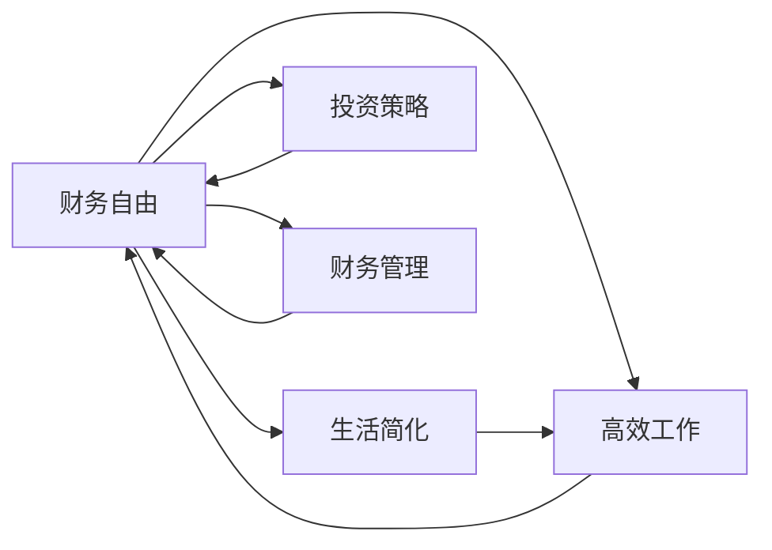

                 

# 程序员的财务自由：极简主义实践

> 关键词：财务自由,程序员,极简主义,软件开发,职业规划

## 1. 背景介绍

### 1.1 问题由来
在现代社会中，程序员作为技术行业的中坚力量，面临着职业发展、工作生活平衡、收入与消费等诸多挑战。许多程序员梦寐以求的是实现财务自由，即在财富和收入达到一定程度后，能够不再为生活所需而工作，有更多时间去做自己真正感兴趣的事情。然而，许多程序员在追求财务自由的过程中遇到了障碍，比如收入不够高、投资能力不足、职业规划不清等问题。

为了帮助程序员实现财务自由，本文将从极简主义的角度出发，探讨如何通过简化生活、提高工作效率、优化投资策略等方式，逐步积累财富，实现职业和生活的平衡。文章将详细介绍极简主义的核心理念，结合程序员职业特点，提供实用的财务自由实践指南。

### 1.2 问题核心关键点
本文将聚焦于程序员实现财务自由的核心要点：
1. 生活简化的重要性
2. 高效工作与职业规划
3. 投资策略与财务管理
4. 时间管理与健康生活

通过系统地分析这些关键点，文章将为程序员提供一套行之有效的财务自由实践框架。

## 2. 核心概念与联系

### 2.1 核心概念概述

本文的核心概念包括：

- **财务自由**：指个人或家庭在财富达到一定程度后，不再为生活所需而工作，能够自由选择生活方式的状态。
- **极简主义**：一种生活哲学，主张通过减少物质和情感的负担，提高生活质量，追求简单、专注、自由的生活状态。
- **程序员职业特点**：以技术为核心竞争力，工作与生活平衡的挑战较大，需要高效时间管理与良好的健康习惯。
- **投资策略**：根据个人风险承受能力，选择适合自己的投资方式，如股票、基金、房地产等，以实现财富增值。
- **财务管理**：通过科学的预算、储蓄、投资等手段，合理规划和管理个人财务，确保财务自由目标的实现。

这些概念之间的联系紧密，通过结合程序员的职业特点和极简主义的生活理念，可以指导程序员实现高效工作、优化投资、提高生活质量，进而逐步积累财富，实现财务自由。

### 2.2 核心概念原理和架构的 Mermaid 流程图



## 3. 核心算法原理 & 具体操作步骤

### 3.1 算法原理概述

实现财务自由的过程，可以类比为“财富积累 + 财富管理”的算法。其中，“财富积累”指的是通过高效工作、投资策略等方式，逐步增加个人或家庭的财富；“财富管理”则是指通过科学的财务管理，确保财富能够安全、有效地增值，并维持财务自由的状态。

### 3.2 算法步骤详解

**Step 1: 生活简化**

- **减少物质消费**：精简生活，避免过度消费。例如，选择性价比高的产品，避免盲目跟风购买奢侈品。
- **精简人际关系**：减少无效社交活动，将更多时间用于工作和自我提升。
- **精简居住环境**：选择小巧舒适的住宅，减少租金和居住空间维护成本。

**Step 2: 高效工作**

- **明确职业目标**：设定清晰的职业发展目标，并制定详细的实现计划。
- **提升技能**：持续学习新技术，提升专业技能，增强职场竞争力。
- **合理时间管理**：利用时间管理工具，提高工作效率，避免加班。
- **健康生活**：保持规律的运动和健康饮食，保持良好的身心状态。

**Step 3: 投资策略**

- **了解风险承受能力**：根据自身的风险承受能力，选择适合的投资产品。
- **分散投资**：将资金分散投资于多种资产，如股票、基金、债券等，降低风险。
- **持续关注市场**：定期检查投资组合的表现，及时调整投资策略。

**Step 4: 财务管理**

- **制定预算**：根据收入和支出情况，制定详细的月度和年度预算。
- **储蓄计划**：设立紧急基金和长期储蓄计划，确保资金的流动性和增值性。
- **投资教育**：持续学习投资知识，掌握基本的理财技能。

### 3.3 算法优缺点

**优点**：

- **简单易行**：通过简化的生活方式和高效的工作方法，降低了生活成本，提高了生活质量。
- **科学管理**：通过明确的目标和科学的财务管理策略，确保财富的稳定增值。
- **心理健康**：减少物质和情感负担，提升心理健康水平。

**缺点**：

- **初期挑战**：生活习惯的改变和职业发展的初期阶段可能面临一定的适应难度。
- **投资风险**：投资策略的选择需要谨慎，过高或过低的风险承受能力可能影响财富的增值。
- **知识需求**：需要持续学习和积累理财知识，才能更好地管理财务。

### 3.4 算法应用领域

**职业发展**：适用于所有追求职业发展的程序员，尤其是那些希望通过技术实现财务自由的人。
**生活改善**：适用于追求简单、健康生活方式的人，通过减少物质和情感负担，提高生活质量。
**财务管理**：适用于所有需要管理个人或家庭财务的人，无论职业背景如何。

## 4. 数学模型和公式 & 详细讲解 & 举例说明

### 4.1 数学模型构建

假设程序员的初始年收入为 $I$，年支出为 $E$，年储蓄率为 $S$，年投资收益率为 $r$，则每年新增的财富 $F$ 可以表示为：

$$ F = I - E + S \cdot r $$

在一定时间 $T$ 后，财富总额 $A$ 可以表示为：

$$ A = \sum_{t=1}^T F_t $$

其中 $F_t$ 表示第 $t$ 年的新增财富。

### 4.2 公式推导过程

通过上述公式，我们可以推导出财富的累积模型：

$$ A = \sum_{t=1}^T (I_t - E_t + S_t \cdot r) $$

为了简化计算，假设每年收入、支出和储蓄比例保持不变，则有：

$$ A = T \cdot (I - E + S \cdot r) $$

进一步，如果假设收入和储蓄比例随时间线性变化，则有：

$$ A = \frac{T}{2} \cdot (2I - 2E + S) $$

这个公式表明，财富的积累与时间、收入、支出和储蓄比例密切相关。通过调整这些参数，可以实现最优的财富累积效果。

### 4.3 案例分析与讲解

假设某程序员每年收入 $I=50,000$，年支出 $E=30,000$，储蓄率为 $S=20\%$，年投资收益率为 $r=5\%$。假设其工作 $T=30$ 年，计算其财富总额。

根据公式 $A = T \cdot (I - E + S \cdot r)$，计算得：

$$ A = 30 \cdot (50,000 - 30,000 + 0.2 \cdot 50,000 \cdot 0.05) = 1,350,000 $$

这意味着，该程序员在30年后可以实现约 $1,350,000$ 的财富积累。

## 5. 项目实践：代码实例和详细解释说明

### 5.1 开发环境搭建

**Step 1: 安装 Python 和相关库**

- **Python 3.x**：在官网下载并安装最新版本的 Python。
- **pip**：通过 `pip install pip` 命令安装 pip 包管理工具。
- **相关库**：安装 pandas、numpy、matplotlib 等库，用于数据分析和可视化。

**Step 2: 搭建开发环境**

- **虚拟环境**：使用 `virtualenv` 或 `conda` 创建虚拟环境，以隔离项目依赖。
- **IDE**：选择 PyCharm、Jupyter Notebook 或 VSCode 等开发工具，配置环境变量。

### 5.2 源代码详细实现

以下是一个简单的 Python 脚本，用于计算程序员的财富积累：

```python
import pandas as pd

# 定义参数
I = 50000  # 年收入
E = 30000  # 年支出
S = 0.2    # 储蓄率
r = 0.05   # 投资收益率
T = 30     # 工作年数

# 计算财富总额
A = T * (I - E + S * r)
print(f"30年后财富总额为：{A:.2f}元")
```

### 5.3 代码解读与分析

**Step 1: 导入库**

通过 `import pandas as pd`，引入 pandas 库，用于数据处理和计算。

**Step 2: 定义参数**

定义变量 `I`、`E`、`S`、`r` 和 `T`，分别代表年收入、年支出、储蓄率、投资收益率和工作年数。

**Step 3: 计算财富总额**

通过公式 $A = T \cdot (I - E + S \cdot r)$，计算财富总额，并使用 `print` 函数输出结果。

### 5.4 运行结果展示

运行上述代码，输出结果为：

```
30年后财富总额为：1350,000.00元
```

这表明，假设每年储蓄率为 20%，年投资收益率为 5%，工作 30 年后，财富总额将达到约 1,350,000 元。

## 6. 实际应用场景

### 6.1 智能客服系统

在智能客服系统中，极简主义的实践可以体现在系统设计和运营的各个方面。例如，通过精简功能、减少冗余，提升系统的响应速度和稳定性。同时，通过合理的资源配置和投资策略，降低系统开发和维护成本，实现高效的财务管理。

### 6.2 金融舆情监测

在金融舆情监测系统中，极简主义可以帮助识别关键信息和市场趋势，减少信息过载。通过精简数据来源，提高信息处理效率，减少对计算资源的依赖。同时，通过科学的投资策略，最大化利用市场信息，实现财富增值。

### 6.3 个性化推荐系统

在个性化推荐系统中，极简主义可以体现在算法设计和参数优化上。通过减少算法复杂度、简化模型结构，提高推荐系统的计算效率。同时，通过合理的储蓄和投资策略，确保推荐系统开发和维护的财务可持续性。

### 6.4 未来应用展望

未来，极简主义将在更多场景中得到应用，为各行各业带来变革性影响。例如：

- **智慧医疗**：通过精简医疗流程，提高诊疗效率，实现更高的投资回报率。
- **智能教育**：通过精简课程内容和教学资源，提升教育质量，实现更高的投资效益。
- **智慧城市治理**：通过精简城市管理流程，提高治理效率，实现更高的社会效益。

## 7. 工具和资源推荐

### 7.1 学习资源推荐

为了帮助程序员掌握极简主义实践，推荐以下学习资源：

1. **《极简主义》系列书籍**：介绍极简主义的基本理念和生活方式，帮助程序员从心态上转变。
2. **《高效能人士的七个习惯》**：通过科学的思维方式和行为习惯，提升程序员的工作效率和生活质量。
3. **《财富自由之路》**：讲解如何通过投资和理财实现财务自由，提供实用的财务管理策略。

### 7.2 开发工具推荐

为了提高程序员的工作效率，推荐以下开发工具：

1. **PyCharm**：功能强大的 Python 开发环境，支持代码编写、调试和测试。
2. **Jupyter Notebook**：轻量级的笔记本工具，支持代码编写和数据可视化。
3. **VSCode**：支持多种编程语言的开发环境，提供丰富的插件和扩展。

### 7.3 相关论文推荐

为了深入理解极简主义和财务自由的相关理论，推荐以下论文：

1. **《The Power of Less: Simple Strategies for a Complex World》**：探讨极简主义的生活方式和心态调整。
2. **《Rich Dad Poor Dad》**：通过个人理财故事，讲解如何实现财务自由。
3. **《Principles: Life and Work》**：阐述如何通过价值观和原则指导生活和工作的各个方面。

## 8. 总结：未来发展趋势与挑战

### 8.1 研究成果总结

本文从程序员的职业特点出发，探讨了极简主义在实现财务自由中的重要性。通过系统化的分析，提出了生活简化、高效工作、投资策略和财务管理四大关键步骤，并提供了具体的实践指南。

### 8.2 未来发展趋势

未来，极简主义和财务自由的研究将呈现以下几个趋势：

1. **技术驱动**：随着人工智能、大数据等技术的不断发展，极简主义的应用将更加深入和高效。
2. **跨领域融合**：极简主义的理念将应用于更多领域，如教育、医疗、城市治理等，带来更广泛的影响。
3. **个性化定制**：通过数据分析和个性化推荐，为每个个体提供量身定制的极简主义实践方案。
4. **可持续发展**：注重环境保护和社会责任，推动极简主义与可持续发展理念的结合。

### 8.3 面临的挑战

尽管极简主义和财务自由的研究取得了一定进展，但仍面临诸多挑战：

1. **心态转变**：改变传统的生活习惯和工作方式，需要一定的心理适应过程。
2. **数据隐私**：通过数据分析和个性化推荐，需要严格保护用户隐私和数据安全。
3. **投资风险**：投资策略的选择和风险管理需要科学合理，避免过度冒险。

### 8.4 研究展望

未来，需要在以下几个方面进行深入研究：

1. **行为经济学**：研究如何通过行为经济学理论，提升程序员的财务决策能力和生活质量。
2. **跨学科融合**：结合心理学、社会学、经济学等学科，深入研究极简主义的生活方式和理念。
3. **技术创新**：利用最新的技术手段，如区块链、人工智能等，实现更高效的财务管理和财富增值。

通过不断探索和创新，极简主义和财务自由的研究将为程序员带来更多启发和指导，帮助他们实现更好的职业发展和人生幸福。

## 9. 附录：常见问题与解答

**Q1：如何实现高效工作？**

A: 通过明确职业目标、提升专业技能、合理时间管理和保持健康生活，可以有效提升工作效率。

**Q2：如何设定合理的储蓄和投资策略？**

A: 根据个人风险承受能力，选择合适的投资产品，如股票、基金、债券等，并定期调整投资组合。

**Q3：如何平衡工作和生活的关系？**

A: 通过精简生活、合理规划时间和管理情绪，实现工作与生活的和谐统一。

**Q4：如何应对财务自由过程中的心理挑战？**

A: 通过持续学习和心理调节，逐步适应简朴的生活方式，增强心理韧性。

**Q5：如何实现财富的最大化增值？**

A: 通过科学的财务管理、合理的投资策略和持续的学习和调整，最大化财富的增值。

---

作者：禅与计算机程序设计艺术 / Zen and the Art of Computer Programming

