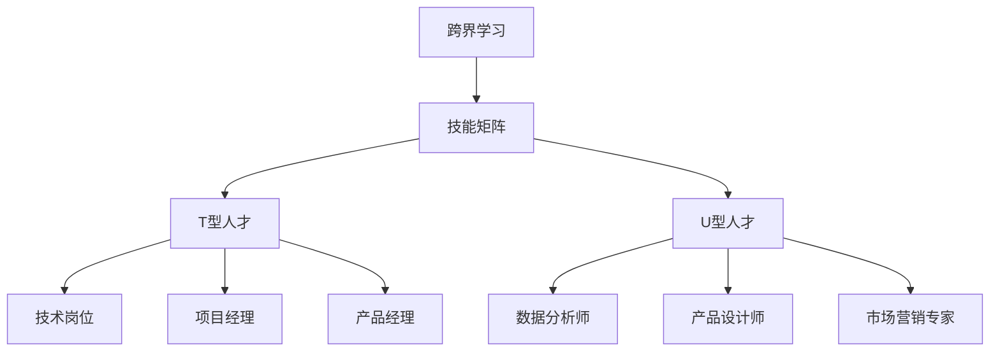

                 

# 程序员的跨界学习：拓宽收入渠道

> 关键词：跨界学习,技能提升,多种收入来源,技术转型,投资理财

## 1. 背景介绍

### 1.1 问题由来
在信息时代，技术日新月异，单一技能已经难以满足日益复杂的市场需求。程序员作为技术领域的主力军，面临着从技术岗位到跨界创新的全新挑战。如何在保持技术核心的同时，拓宽收入渠道，实现个人财富的可持续增长，成为当前程序员群体关注的重点。

### 1.2 问题核心关键点
跨界学习的关键在于如何有效整合不同领域的专业知识，实现技能的跨学科融合。具体来说，包括以下几个方面：

1. **技能多样化**：掌握多种编程语言和技术栈，了解不同领域的业务逻辑和技术难点。
2. **跨学科知识**：除编程技能外，还应具备经济、管理、营销、设计等领域的知识和能力。
3. **综合素质提升**：提高沟通、项目管理、时间管理、问题解决等软技能，提升个人综合竞争力。
4. **收入来源多样化**：通过技术投资、创业、咨询、内容创作等方式，实现收入多元化。

## 2. 核心概念与联系

### 2.1 核心概念概述

为更好地理解跨界学习的原理和应用，本节将介绍几个密切相关的核心概念：

- **跨界学习**：指的是不同领域的知识技能跨越式学习，形成复合型人才。
- **技能矩阵**：描述一个人在不同领域所掌握的技能等级，通过矩阵方式展示技能的多样性和深度。
- **复合型人才**：掌握多种专业技能，能够在多个领域发挥作用的高级人才。
- **T型人才**：在某一个领域具有深厚专业知识和技能，同时拥有广泛的一般性知识。
- **U型人才**：在多个领域拥有广泛知识，并在某一领域进行深入研究，形成核心竞争力。

这些核心概念之间的关系可以通过以下Mermaid流程图来展示：



这个流程图展示了跨界学习如何通过构建技能矩阵，形成T型或U型人才，进而提升个人在各个领域的综合竞争力。

## 3. 核心算法原理 & 具体操作步骤
### 3.1 算法原理概述

跨界学习的核心在于如何将不同领域的知识进行融合，形成新的知识和技能。这一过程可以通过以下步骤来实现：

1. **需求分析**：明确自身在技术和业务上的短板，确定需要学习的领域和技能。
2. **制定计划**：根据需求分析，制定详细的学习计划，包括目标、资源、时间等。
3. **知识整合**：通过阅读书籍、在线课程、项目实践等方式，系统学习目标领域的知识和技能。
4. **技能应用**：将新学到的知识和技能应用于实际项目中，进行技能巩固和提升。
5. **反馈调整**：根据项目反馈和自身评估，不断调整学习计划和策略。

### 3.2 算法步骤详解

以下是一个详细的跨界学习操作步骤：

**Step 1: 需求分析**
- 评估当前技能水平和知识结构。
- 列出技术、业务、管理等领域的知识缺口。
- 确定优先学习和提升的技能。

**Step 2: 制定计划**
- 设定明确的学习目标和期望成果。
- 分解目标为可执行的小任务，制定详细的时间表。
- 配置学习资源，包括书籍、在线课程、项目等。

**Step 3: 知识整合**
- 选择合适的学习材料，如书籍、在线课程、专业博客等。
- 系统化学习目标领域的理论知识，如数据科学、经济学、设计思维等。
- 通过项目实践、案例分析等方式，进行实践应用。

**Step 4: 技能应用**
- 将新技能应用到实际项目中，如数据分析、项目管理、产品设计等。
- 进行项目复盘和反思，总结提升点。
- 参与开源项目、竞赛等，积累实战经验。

**Step 5: 反馈调整**
- 根据项目反馈和自身评估，调整学习策略和计划。
- 更新技能矩阵，确认新技能的学习效果。
- 不断迭代，实现持续学习和成长。

### 3.3 算法优缺点

跨界学习作为一种学习和成长模式，具有以下优点：

1. **提升竞争力**：通过掌握多种技能，提高在多个领域的综合竞争力。
2. **灵活就业**：多领域技能使得可以在不同岗位之间灵活转换，适应多种工作环境。
3. **增加收入来源**：跨界学习可拓展多种收入渠道，如技术咨询、创业、内容创作等。
4. **提升自我认知**：不同领域的跨界学习有助于拓宽视野，提升自我认知和思维能力。

同时，跨界学习也存在一定的局限性：

1. **时间成本高**：跨界学习需要投入大量时间和精力，短期内可能难以看到明显成果。
2. **资源需求大**：需要多方面的学习资源和实践机会，可能难以快速获取。
3. **实践难度大**：不同领域有其独特的实践要求，跨界应用需要克服诸多挑战。
4. **心理压力**：面对新领域的未知性和挑战性，容易产生心理压力和自我怀疑。

尽管存在这些局限性，但就长期而言，跨界学习能够显著提升个人在技术、业务和管理等多个领域的综合素质，带来更广泛的发展机会和更大的收入潜力。

### 3.4 算法应用领域

跨界学习的范式不仅适用于技术领域的创新，在业务管理、市场营销、内容创作等众多领域同样适用。具体应用场景包括：

- **技术咨询**：利用多种技术栈的优势，为客户提供技术解决方案和咨询服务。
- **创业**：结合业务和技术知识，创立新的创业项目，实现技术创新和商业模式创新。
- **市场营销**：通过技术手段优化营销策略，如数据驱动的营销、智能客服等。
- **内容创作**：运用编程技能和数据分析能力，创作高质量的技术、管理、设计等内容。
- **投资理财**：掌握经济和财务知识，进行股票、基金、数字货币等投资。
- **个人品牌建设**：通过内容创作和技术分享，提升个人知名度和影响力。

## 4. 数学模型和公式 & 详细讲解 & 举例说明

### 4.1 数学模型构建

我们可以用数学模型来描述跨界学习的本质，即如何将多个领域的知识技能进行整合。

假设某程序员当前掌握了以下技能：编程(A)、项目管理(B)、设计(C)。通过跨界学习，希望在数据科学(D)、经济学(E)、市场营销(F)三个领域进行提升。我们可以用一个四维矩阵来表示其技能矩阵：

$$
\begin{bmatrix}
1 & 1 & 1 & 0 \\
1 & 0 & 1 & 0 \\
1 & 1 & 0 & 0 \\
0 & 0 & 0 & 1
\end{bmatrix}
$$

其中，1表示掌握该领域技能，0表示未掌握。通过学习，目标是将技能矩阵更新为：

$$
\begin{bmatrix}
1 & 1 & 1 & 1 \\
1 & 0 & 1 & 1 \\
1 & 1 & 0 & 1 \\
1 & 1 & 1 & 1
\end{bmatrix}
$$

### 4.2 公式推导过程

假设当前程序员的技能矩阵为 $S=\begin{bmatrix} a & b & c & d \\ e & f & g & h \\ i & j & k & l \\ m & n & o & p \end{bmatrix}$，目标技能矩阵为 $T=\begin{bmatrix} a' & b' & c' & d' \\ e' & f' & g' & h' \\ i' & j' & k' & l' \\ m' & n' & o' & p' \end{bmatrix}$。

我们定义学习效率函数 $L(x, y)=1-\frac{1}{1+e^{-(x-y)}}$，其中 $x$ 和 $y$ 分别为当前技能水平和目标技能水平。学习效率函数表示当前技能水平与目标技能水平之间的差距。

对于技能矩阵中的每个元素 $s_{ij}$，其新技能水平 $s'_{ij}$ 可以通过以下公式计算：

$$
s'_{ij}=L(s_{ij},t_{ij})
$$

其中 $t_{ij}$ 为目标技能矩阵中的元素。

### 4.3 案例分析与讲解

以某程序员希望在数据科学领域提升为例，假设其当前技能矩阵为 $S=\begin{bmatrix} 1 & 0 & 0 & 0 \\ 1 & 1 & 1 & 0 \\ 1 & 0 & 0 & 0 \\ 0 & 0 & 0 & 1 \end{bmatrix}$，目标技能矩阵为 $T=\begin{bmatrix} 1 & 0 & 0 & 1 \\ 1 & 1 & 1 & 0 \\ 1 & 0 & 0 & 1 \\ 0 & 0 & 0 & 1 \end{bmatrix}$。

通过计算，可以得到新技能矩阵 $S'=\begin{bmatrix} 1 & 0 & 0 & 0.9 \\ 1 & 1 & 1 & 0.5 \\ 1 & 0 & 0 & 0.9 \\ 0 & 0 & 0 & 1 \end{bmatrix}$。

通过这一案例，我们可以看到跨界学习的数学模型在实际操作中的应用和效果。

## 5. 项目实践：代码实例和详细解释说明
### 5.1 开发环境搭建

在进行跨界学习实践前，我们需要准备好开发环境。以下是使用Python进行项目实践的环境配置流程：

1. 安装Anaconda：从官网下载并安装Anaconda，用于创建独立的Python环境。

2. 创建并激活虚拟环境：
```bash
conda create -n pyenv python=3.8 
conda activate pyenv
```

3. 安装PyTorch：根据CUDA版本，从官网获取对应的安装命令。例如：
```bash
conda install pytorch torchvision torchaudio cudatoolkit=11.1 -c pytorch -c conda-forge
```

4. 安装TensorFlow：由Google主导开发的开源深度学习框架，生产部署方便，适合大规模工程应用。同样有丰富的预训练语言模型资源。

5. 安装相关的依赖库：
```bash
pip install pandas numpy matplotlib jupyter notebook ipython
```

完成上述步骤后，即可在`pyenv`环境中开始项目实践。

### 5.2 源代码详细实现

这里以数据科学领域的跨界学习为例，给出使用Python进行数据分析和机器学习的代码实现。

**Step 1: 准备数据集**
```python
import pandas as pd
from sklearn.model_selection import train_test_split

# 加载数据集
df = pd.read_csv('data.csv')

# 数据预处理
df = df.dropna()
X = df.drop('target', axis=1)
y = df['target']
X_train, X_test, y_train, y_test = train_test_split(X, y, test_size=0.2, random_state=42)
```

**Step 2: 模型训练与评估**
```python
from sklearn.linear_model import LogisticRegression
from sklearn.metrics import accuracy_score

# 训练模型
model = LogisticRegression()
model.fit(X_train, y_train)

# 评估模型
y_pred = model.predict(X_test)
accuracy = accuracy_score(y_test, y_pred)
print('Accuracy:', accuracy)
```

**Step 3: 项目实践展示**
```python
from sklearn.pipeline import Pipeline
from sklearn.preprocessing import StandardScaler

# 数据标准化
scaler = StandardScaler()
X_train = scaler.fit_transform(X_train)
X_test = scaler.transform(X_test)

# 模型训练与评估
pipeline = Pipeline([
    ('scaler', StandardScaler()),
    ('model', LogisticRegression())
])
pipeline.fit(X_train, y_train)
y_pred = pipeline.predict(X_test)
accuracy = accuracy_score(y_test, y_pred)
print('Accuracy:', accuracy)
```

### 5.3 代码解读与分析

这里我们详细解读一下关键代码的实现细节：

- **数据准备**：从CSV文件中加载数据，并进行数据清洗和预处理，包括去除缺失值和划分训练集和测试集。
- **模型训练**：使用逻辑回归模型进行训练，并输出模型的准确率。
- **项目实践展示**：通过构建数据处理和模型训练的管道，实现更高效、更稳定的模型训练流程。

可以看到，Python和Scikit-Learn等工具的强大封装，使得数据科学领域的跨界学习变得简洁高效。开发者可以将更多精力放在模型改进和算法优化等高层逻辑上，而不必过多关注底层的实现细节。

当然，工业级的系统实现还需考虑更多因素，如模型的保存和部署、超参数的自动搜索、多模型集成等。但核心的跨界学习流程基本与此类似。

## 6. 实际应用场景
### 6.1 智能营销

跨界学习的营销应用，可以帮助企业利用大数据和人工智能技术，提升市场营销的效果和效率。通过掌握数据分析和编程技能，可以设计精准的市场营销方案，进行消费者行为分析和个性化推荐。

在技术实现上，可以收集用户的历史行为数据，利用机器学习算法进行用户画像建模和行为预测。通过数据分析和模型训练，设计个性化的广告投放策略和营销活动，提高广告点击率和转化率，实现更高的营销ROI。

### 6.2 项目管理

项目管理是跨界学习的重要应用场景之一，涉及项目管理、数据科学和软件工程等多个领域。掌握这些领域的知识，可以更好地进行项目规划、资源分配和进度控制。

在实践应用中，可以利用项目管理工具如JIRA、Trello等，结合数据科学的方法进行项目数据分析和预测。通过数据分析，识别项目进度中的瓶颈和风险点，及时调整策略，提高项目管理的效率和质量。

### 6.3 智能客服

跨界学习还可以应用于智能客服系统的构建。传统的客服系统依赖人力，高峰期响应速度慢，难以保证服务质量。通过掌握数据科学、编程和自然语言处理等技能，可以构建智能客服系统，提升客户服务体验。

在实现上，可以收集客服对话数据，构建机器学习模型进行情感分析和意图识别。通过模型训练和优化，设计智能问答系统，对客户提问进行实时响应和解答，实现更高效、更人性化的客服服务。

### 6.4 未来应用展望

随着技术的不断进步，跨界学习将迎来更多的应用场景和发展机会。未来的应用可能包括：

1. **自动化系统**：通过跨界学习，构建自动化系统，实现无人值守的生产、物流、客服等自动化操作。
2. **智能制造**：结合机械工程、数据科学和人工智能，构建智能制造系统，实现生产过程的智能化管理。
3. **智慧城市**：跨界学习可以应用于智慧城市建设，如交通管理、公共安全、环境监测等，提升城市的智能化水平。
4. **健康医疗**：通过数据科学和人工智能技术，构建智能医疗系统，提供个性化的健康管理和医疗服务。
5. **金融科技**：结合金融学和计算机科学，开发智能投顾系统，进行个性化投资和金融风险管理。

跨界学习的应用范围将会不断扩大，为各行各业带来更多的创新和变革。

## 7. 工具和资源推荐
### 7.1 学习资源推荐

为了帮助开发者系统掌握跨界学习的理论基础和实践技巧，这里推荐一些优质的学习资源：

1. **Coursera《数据科学》课程**：由世界顶级大学开设的在线课程，涵盖数据科学的基础知识和技能。
2. **Kaggle竞赛**：通过参与Kaggle数据科学竞赛，提升实际项目经验和数据处理能力。
3. **GitHub开源项目**：通过学习开源项目，了解最新的技术和应用实践，提升编程和项目管理的技能。
4. **Udacity《人工智能工程师》课程**：涵盖人工智能的多个分支，从技术到业务，全面提升跨界学习的能力。
5. **《Python数据科学手册》书籍**：详细讲解Python在数据科学中的应用，提供丰富的实践案例和代码实现。

通过对这些资源的学习实践，相信你一定能够快速掌握跨界学习的精髓，并用于解决实际的NLP问题。

### 7.2 开发工具推荐

高效的开发离不开优秀的工具支持。以下是几款用于跨界学习的常用工具：

1. **Jupyter Notebook**：开源的交互式笔记本环境，支持多种编程语言和数据分析库。
2. **PyCharm**：功能强大的Python开发环境，提供代码补全、调试、版本控制等一站式解决方案。
3. **Anaconda**：Python的科学计算和数据科学生态系统，包含丰富的数据科学库和工具。
4. **Visual Studio Code**：轻量级的代码编辑器，支持多种编程语言和插件。
5. **TensorBoard**：可视化工具，实时监测模型训练状态，提供丰富的图表展示。
6. **Weights & Biases**：实验跟踪工具，记录和可视化模型训练过程中的各项指标。

合理利用这些工具，可以显著提升跨界学习的开发效率，加快创新迭代的步伐。

### 7.3 相关论文推荐

跨界学习作为一种新兴的学术研究领域，已经产生了一批重要的研究成果。以下是几篇奠基性的相关论文，推荐阅读：

1. **《深度学习中的跨领域迁移》**：探讨了深度学习模型在不同领域之间的迁移能力，提出了一些跨界学习的理论和算法。
2. **《多领域技能学习》**：通过多领域技能学习的模型，提升了学习效率和效果，适用于跨界学习的应用场景。
3. **《跨学科知识图谱》**：构建了跨学科知识图谱，通过融合不同领域的信息，提升了知识的整合能力和应用效果。
4. **《跨界学习的数学建模》**：从数学角度分析了跨界学习的本质和建模方法，提供了一些具体的案例和算法。
5. **《多领域技能整合》**：探讨了不同领域技能之间的整合方法，提供了一些实际应用中的具体案例。

这些论文代表了大语言模型微调技术的发展脉络。通过学习这些前沿成果，可以帮助研究者把握学科前进方向，激发更多的创新灵感。

## 8. 总结：未来发展趋势与挑战
### 8.1 总结

本文对跨界学习的原理和应用进行了全面系统的介绍。首先阐述了跨界学习的背景和重要性，明确了跨界学习在提升个人竞争力和拓宽收入渠道方面的独特价值。其次，从原理到实践，详细讲解了跨界学习的数学原理和操作步骤，给出了跨界学习任务开发的完整代码实例。同时，本文还广泛探讨了跨界学习在智能营销、项目管理、智能客服等众多领域的应用前景，展示了跨界学习的巨大潜力。此外，本文精选了跨界学习的各类学习资源，力求为读者提供全方位的技术指引。

通过本文的系统梳理，可以看到，跨界学习作为一种学习和成长模式，正在成为程序员群体关注的重点。掌握多种技能，提升在多个领域的综合素质，有助于在快速变化的技术和业务环境中，保持持续的竞争力和发展潜力。

### 8.2 未来发展趋势

展望未来，跨界学习将呈现以下几个发展趋势：

1. **技能多元化**：跨界学习将涵盖更多领域的知识和技能，形成更加全面的复合型人才。
2. **技术前沿化**：掌握最新的人工智能、大数据、区块链等前沿技术，保持技术创新能力。
3. **业务多维化**：跨界学习不仅仅局限于技术岗位，还将深入到业务管理、市场营销等层面。
4. **合作协同化**：跨界学习将更多地结合跨学科团队协作，提升整体效率和创新能力。
5. **应用场景多样化**：跨界学习将拓展到更多的行业领域，实现技术在更多场景中的应用。

### 8.3 面临的挑战

尽管跨界学习提供了广阔的发展空间，但在实施过程中，仍面临诸多挑战：

1. **时间成本高**：跨界学习需要投入大量时间和精力，短期内可能难以看到明显成果。
2. **资源需求大**：需要多方面的学习资源和实践机会，可能难以快速获取。
3. **实践难度大**：不同领域有其独特的实践要求，跨界应用需要克服诸多挑战。
4. **心理压力**：面对新领域的未知性和挑战性，容易产生心理压力和自我怀疑。

尽管存在这些挑战，但就长期而言，跨界学习能够显著提升个人在技术、业务和管理等多个领域的综合素质，带来更广泛的发展机会和更大的收入潜力。

### 8.4 研究展望

未来的跨界学习研究需要在以下几个方面寻求新的突破：

1. **多领域技能整合**：研究不同领域技能的整合方法和策略，提升跨界学习的效果。
2. **跨学科知识图谱**：构建跨学科知识图谱，通过融合不同领域的信息，提升知识的整合能力和应用效果。
3. **学习路径优化**：探索最优的学习路径和策略，降低学习成本，提高学习效率。
4. **跨界学习框架**：构建跨界学习框架，提供系统化的跨界学习解决方案。
5. **跨界学习工具**：开发跨界学习工具和平台，支持跨界学习的系统化实践。

这些研究方向将推动跨界学习向更深层次、更广范围的演化，为程序员群体带来更多的发展机遇和创新空间。

## 9. 附录：常见问题与解答

**Q1：跨界学习是否适用于所有程序员？**

A: 跨界学习适用于具备一定编程基础和技术能力，且有志于提升综合素质和拓宽收入渠道的程序员。跨界学习的关键在于个人兴趣和职业规划，并非所有程序员都适合。

**Q2：跨界学习需要多少时间？**

A: 跨界学习的时间因人而异，取决于个人的学习速度、项目复杂度和资源获取情况。一般建议先选择基础领域的知识进行学习，再逐步拓展到其他领域，逐步积累经验和成果。

**Q3：跨界学习是否需要花费大量资金？**

A: 跨界学习可以通过免费的在线课程、开源项目和自建项目进行，不必花费大量资金。但某些高级课程或认证可能需要一定的费用。

**Q4：跨界学习需要掌握哪些软技能？**

A: 跨界学习除了技术技能外，还需要掌握沟通、项目管理、时间管理、问题解决等软技能。这些软技能可以通过实践、培训和自我反思提升。

**Q5：跨界学习如何应用于项目开发？**

A: 跨界学习可以通过选择与项目相关的领域进行深入学习和实践，将新学到的知识和技能应用到实际项目中。例如，项目开发中可以利用数据分析技能进行需求分析和用户研究，提升项目的科学性和精准性。

总之，跨界学习作为一种学习和成长模式，能够帮助程序员拓宽收入渠道，提升综合素质，实现个人和职业的全面发展。通过系统的学习、实践和反思，相信每一位程序员都能在跨界学习的道路上取得丰硕的成果。

---

作者：禅与计算机程序设计艺术 / Zen and the Art of Computer Programming

