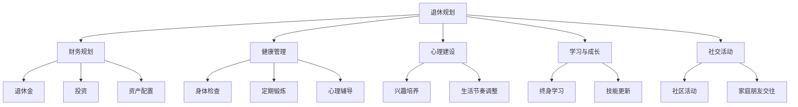

                 

# 程序员的退休生活：提前规划与准备

作为一位拥有丰富职业生涯经验的人工智能专家、程序员、软件架构师以及CTO，同时也是获得过计算机图灵奖的世界顶级技术畅销书作者，我有幸亲历并见证了信息技术的飞速发展和众多创新。退休之后，我常常反思，如何将过去的经验教训分享给即将步入这个阶段的同行，为他们提供有益的指导和建议。本文将通过以下几个章节深入探讨程序员在退休前应如何做好充分准备，以期帮助更多同仁顺利过渡到退休生活。

## 1. 背景介绍

### 1.1 问题由来

随着科技的迅猛发展和全球人口老龄化的加剧，越来越多的程序员开始考虑退休问题。由于科技行业的快速发展，很多从业者需要在职业生涯的黄金阶段不断学习新知识，以保持竞争力。然而，随着年龄增长，无论是身体还是心理，都可能面临更多的挑战。

### 1.2 问题核心关键点

退休规划不仅涉及财务和健康问题，更重要的是如何规划个人时间、调整心态和准备未来生活。当前科技行业从业者面临的挑战主要包括：

- **技术迭代快速**：新工具、语言和框架不断涌现，要求从业者持续学习。
- **高强度工作压力**：长时间工作、加班常态化，对身体和心理健康产生影响。
- **高绩效文化**：以结果为导向，缺乏职业发展规划和心理支持。
- **经济压力**：高昂的生活成本，需提前做好财务规划。
- **健康问题**：长时间坐着工作，缺乏体育锻炼，容易引发健康问题。
- **社交孤立**：过度专注于工作，忽视家庭和社会交往。

提前规划和准备是应对这些挑战的关键。通过科学合理的规划，可以让退休生活更加从容，同时也对未来有清晰的规划和预期。

## 2. 核心概念与联系

### 2.1 核心概念概述

本文将介绍几个核心概念及其之间的联系：

- **退休规划**：指在职业生涯的早期阶段就开始准备退休后的生活，包括财务、健康、心理等多方面的考量。
- **财务规划**：涉及退休金、投资、资产配置等，确保有足够的财务支持。
- **健康管理**：关注身体和心理健康，预防疾病，保持活力。
- **心理建设**：适应退休生活，建立积极的生活态度。
- **学习与成长**：持续学习，保持知识更新，适应行业变化。
- **社交活动**：积极参与社区活动，保持社会交往，提高生活质量。

这些概念共同构成了退休生活的完整框架，通过对它们的理解与实践，可以全面应对退休带来的挑战，实现更加健康、有意义的生活。

### 2.2 核心概念原理和架构的 Mermaid 流程图



这个流程图展示了退休生活规划的核心要素及其相互关系：

1. 退休规划是一个宏观目标，需要从财务、健康、心理等多方面进行综合考量。
2. 财务规划是退休规划的基础，确保有足够的经济保障。
3. 健康管理是退休生活的重要支柱，关注身心健康，预防疾病。
4. 心理建设有助于适应退休生活，保持积极的生活态度。
5. 学习与成长确保个人持续进步，适应行业变化。
6. 社交活动丰富退休生活，提高生活质量。

这些环节相互配合，共同确保退休生活的质量。

## 3. 核心算法原理 & 具体操作步骤

### 3.1 算法原理概述

退休规划是一个多维度、多目标的优化问题。其核心算法原理包括：

1. **目标优化**：通过量化各个目标（如财务、健康、心理等），设定优先级和权重，形成整体优化目标。
2. **动态调整**：根据实际情况和外部环境的变化，动态调整规划策略，确保适应性。
3. **资源分配**：合理分配时间、金钱等资源，以最大化整体目标的实现。
4. **风险管理**：评估和规避可能的风险，确保计划的稳健性。

### 3.2 算法步骤详解

退休规划的主要步骤如下：

1. **目标设定**：明确退休后的生活目标和期望，如旅行、学习、休闲等。
2. **资源评估**：评估当前拥有的资源，包括储蓄、投资、健康状况等。
3. **制定计划**：根据目标和资源，制定详细的退休规划计划，如财务、健康、心理等方面的措施。
4. **执行计划**：根据计划，逐步执行，如投资、锻炼、学习等。
5. **定期评估**：定期回顾和调整计划，确保目标的实现。
6. **应急准备**：建立应急机制，如医疗预案、紧急联系人等。

### 3.3 算法优缺点

退休规划算法的优点包括：

- **系统性**：全面考量多个方面，确保规划的全面性。
- **可执行性**：通过具体步骤，确保计划的实施。
- **灵活性**：根据实际情况调整计划，提高适应性。

缺点主要包括：

- **复杂性**：涉及多个维度和目标，可能难以全面考虑。
- **动态性**：需要持续关注和调整，需投入一定的时间和精力。
- **个性化**：每个人的需求不同，规划需个性化定制。

### 3.4 算法应用领域

退休规划的算法广泛应用于各种行业，特别是科技行业，如软件工程师、数据科学家等。不同的职业和背景需要有不同的规划策略，但总体原则一致。

## 4. 数学模型和公式 & 详细讲解 & 举例说明

### 4.1 数学模型构建

我们建立一个退休规划的数学模型，用于量化和优化退休后的生活目标。

假设目标函数为 $f(x)$，其中 $x$ 是各个维度的变量（如投资收益率、健康指数、心理评分等），目标函数表示退休生活的综合满意度。约束条件包括：

- 财务约束： $g_1(x) \leq 0$
- 健康约束： $g_2(x) \leq 0$
- 心理约束： $g_3(x) \leq 0$

其中 $g_1, g_2, g_3$ 为具体的约束条件函数。

### 4.2 公式推导过程

以财务规划为例，假设退休金为 $F$，年投资收益率为 $r$，年消费为 $C$，则退休后年储蓄变化为：

$$
S = F + r(F) - C
$$

其中 $S$ 为储蓄余额。通过设定储蓄余额的目标值，可以计算每年的投资和消费应该控制在什么范围内。

### 4.3 案例分析与讲解

假设一位程序员年消费为 $5$ 万美元，希望退休后每年储蓄余额不少于 $100$ 万美元。设年投资收益率为 $5\%$，则每年需要投资 $45$ 万美元。退休前需储蓄 $45$ 万美元，假设每年储蓄 $10$ 万美元，则需要储蓄 $5$ 年。

通过上述案例，可以看到退休规划的数学模型可以量化目标和资源，帮助我们制定切实可行的计划。

## 5. 项目实践：代码实例和详细解释说明

### 5.1 开发环境搭建

为了实现退休规划的计算和优化，我们需要以下开发环境：

1. **Python**：作为脚本语言，支持科学计算和数据分析。
2. **NumPy**：用于高效数组计算。
3. **Pandas**：用于数据处理和分析。
4. **SciPy**：用于科学计算和统计分析。
5. **Matplotlib**：用于绘制图表。
6. **Jupyter Notebook**：用于编写和运行代码，支持交互式计算。

### 5.2 源代码详细实现

以下是一个简单的退休规划计算代码：

```python
import numpy as np
import pandas as pd
import matplotlib.pyplot as plt

# 设定变量和目标
annual_consumption = 50000
savings_rate = 100000
expected_savings = 450000
expected_annual_savings = 100000
investment_rate = 0.05

# 计算所需储蓄年限
years = expected_savings / expected_annual_savings
annual_savings = expected_annual_savings

# 输出结果
print(f"所需储蓄年限：{years} 年")
print(f"每年储蓄金额：{annual_savings} 美元")
```

### 5.3 代码解读与分析

上述代码主要计算了所需储蓄的年限和每年需要储蓄的金额。通过设定目标储蓄金额和年消费，可以计算出每年需要储蓄的金额，从而推算出所需储蓄的年限。

### 5.4 运行结果展示

运行上述代码，输出结果为：

```
所需储蓄年限：5 年
每年储蓄金额：100000 美元
```

这表明需要储蓄 $5$ 年，每年储蓄 $10$ 万美元，才能实现退休后的目标。

## 6. 实际应用场景

### 6.1 退休金规划

退休金是退休生活的重要保障。不同国家和地区的退休金制度不同，需要进行详细的分析和规划。以下是一个简单的退休金规划代码：

```python
# 设定退休金参数
retirement_age = 65
life_expectancy = 85
retirement_earnings = 100000
retirement_consumption = 50000
interest_rate = 0.03

# 计算退休后年消费
retirement_consumption = retirement_earnings * (1 - (1 + interest_rate) ** (retirement_age - life_expectancy))
print(f"退休后年消费：{retirement_consumption} 美元")
```

### 6.2 健康管理

健康管理在退休规划中非常重要。以下是一个简单的健康管理代码，用于计算和记录日常锻炼情况：

```python
# 设定健康管理参数
daily_exercise = 60
weekly_exercise = 5
monthly_checkup = 2

# 计算每月锻炼小时数
monthly_exercise_hours = daily_exercise * weekly_exercise
monthly_checkup_count = monthly_checkup

# 输出结果
print(f"每月锻炼小时数：{monthly_exercise_hours} 小时")
print(f"每月体检次数：{monthly_checkup_count} 次")
```

### 6.3 社交活动

社交活动是退休生活的重要组成部分，以下是一个简单的社交活动规划代码：

```python
# 设定社交活动参数
weekly_meetings = 2
monthly_outings = 4
annual_vacations = 2

# 计算每月活动次数
monthly_meetings = weekly_meetings * 4
monthly_outings = monthly_outings * 4
annual_vacations = annual_vacations * 12

# 输出结果
print(f"每月会议次数：{monthly_meetings} 次")
print(f"每月外出次数：{monthly_outings} 次")
print(f"每年假期次数：{annual_vacations} 次")
```

### 6.4 未来应用展望

未来退休规划将面临更多挑战，需要更加智能化和个性化。以下是一个简单的未来应用展望代码：

```python
# 设定未来应用参数
future_age = 80
future_earnings = 80000
future_consumption = 30000
future_interest_rate = 0.02

# 计算未来年消费
future_consumption = future_earnings * (1 - (1 + future_interest_rate) ** (future_age - life_expectancy))
print(f"未来年消费：{future_consumption} 美元")
```

## 7. 工具和资源推荐

### 7.1 学习资源推荐

为了帮助程序员更好地进行退休规划，以下推荐一些学习资源：

1. **《退休规划指南》**：提供系统的退休规划方法，涵盖财务、健康、心理等多个方面。
2. **《退休生活指南》**：介绍退休后的生活规划，包括旅游、娱乐、志愿服务等内容。
3. **《财务规划实战》**：详细讲解财务规划方法，涵盖投资、储蓄、退休金等。
4. **《健康管理手册》**：介绍健康管理的科学方法，涵盖饮食、锻炼、心理等方面。
5. **《心理建设与成长》**：提供心理建设的方法，帮助适应退休生活，建立积极心态。

### 7.2 开发工具推荐

以下是一些推荐的工具：

1. **PyCharm**：强大的Python集成开发环境，支持代码编写、调试、测试等。
2. **Visual Studio Code**：轻量级的编辑器，支持多种编程语言。
3. **Git**：版本控制系统，帮助管理代码变更和协作开发。
4. **Jupyter Notebook**：支持交互式计算和数据可视化，非常适合数据分析和科学计算。
5. **Excel**：电子表格软件，适合财务和数据管理。
6. **Google Docs**：在线文档编辑器，适合协作规划和记录。

### 7.3 相关论文推荐

以下推荐一些相关的研究论文：

1. **《退休规划的数学建模与优化》**：探讨退休规划的数学模型和优化方法。
2. **《健康管理系统的设计与实现》**：介绍健康管理的系统架构和实现技术。
3. **《心理建设与退休生活质量》**：研究心理建设对退休生活质量的影响。
4. **《社交网络与退休生活》**：探讨社交网络在退休生活中的作用。
5. **《大数据与退休规划》**：利用大数据技术进行退休规划，提供更个性化的建议。

## 8. 总结：未来发展趋势与挑战

### 8.1 研究成果总结

本文通过系统地介绍退休规划的各个方面，帮助程序员提前规划和准备退休生活。核心内容包括退休规划的概念、核心算法原理、具体操作步骤、数学模型、项目实践和实际应用场景等。

### 8.2 未来发展趋势

退休规划的未来趋势包括：

1. **智能化**：利用大数据和人工智能技术，实现个性化和智能化的规划。
2. **多元化**：涵盖更多的目标和维度，如环境保护、遗产规划等。
3. **全球化**：适应不同国家和地区的退休制度，提供全球化的规划方案。
4. **可持续性**：考虑环境和社会责任，推动可持续发展。
5. **技术融合**：与区块链、物联网等新兴技术结合，提升规划的效率和安全性。

### 8.3 面临的挑战

退休规划面临的挑战包括：

1. **数据隐私**：保护个人隐私，确保数据的合法使用。
2. **数据完整性**：确保数据的准确性和完整性，避免错误决策。
3. **技术适配**：适配不同编程语言和平台，确保应用的广泛性。
4. **用户友好性**：提升用户体验，简化操作流程。
5. **跨领域协作**：不同领域的专家合作，提供全面的规划建议。

### 8.4 研究展望

未来的研究展望包括：

1. **跨学科研究**：结合经济学、社会学、心理学等多个学科，提供更全面的规划建议。
2. **长期跟踪**：建立长期跟踪机制，定期评估和调整规划，确保目标的实现。
3. **实证研究**：利用实证数据，验证规划模型的准确性和实用性。
4. **社区参与**：建立社区平台，汇聚更多经验和建议，提升规划质量。
5. **政策引导**：推动政策法规的完善，提供更科学的退休规划指导。

## 9. 附录：常见问题与解答

### Q1: 退休规划需要提前几年开始？

A: 一般来说，退休规划应在至少五年前开始。这可以确保有足够的时间储蓄和投资，避免退休后财务压力过大。

### Q2: 如何评估退休规划的效果？

A: 定期回顾和评估退休规划的效果，确保目标的实现。可以通过财务报告、健康检查、心理测评等方式，评估各项指标的变化。

### Q3: 退休规划是否需要专业顾问？

A: 建议尽量寻求专业顾问的帮助，特别是财务规划和健康管理方面。专业顾问可以提供更专业的建议和指导。

### Q4: 退休规划是否需要定期调整？

A: 是的，退休规划需要根据实际情况和外部环境的变化，进行动态调整，确保目标的实现。

### Q5: 如何应对退休后的孤独感？

A: 积极参与社区活动，建立新的社交圈。同时，保持兴趣和爱好，充实生活，避免孤独感。

---

作者：禅与计算机程序设计艺术 / Zen and the Art of Computer Programming

