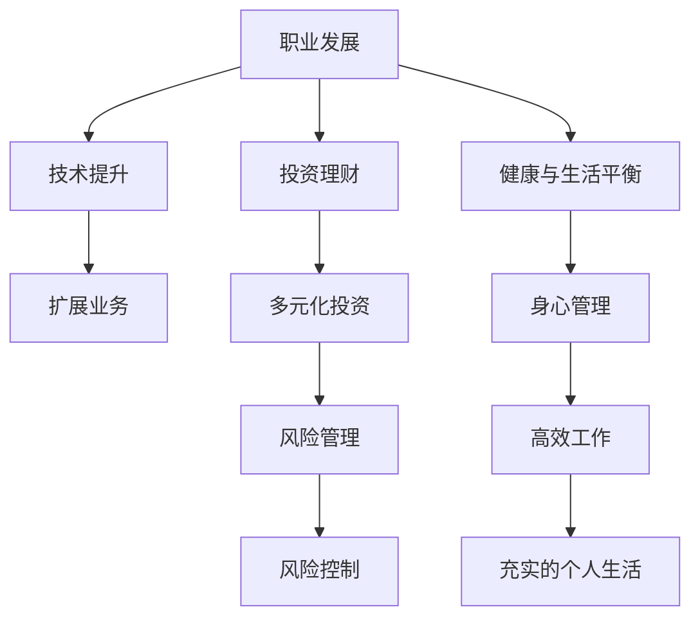

                 

# 程序员的退休规划：40岁财务自由计划

> 关键词：退休规划, 程序员, 财务自由, 职业发展, 投资理财, 风险管理, 健康与生活平衡

## 1. 背景介绍

作为一名程序员，如何在40岁时实现财务自由，提前规划退休生活，是许多人心中的梦想。这不仅需要对个人职业生涯的深度思考，还需对投资理财、健康管理等多方面知识的综合运用。本文将围绕这一主题，详细探讨程序员退休规划的策略、技巧和路径。

## 2. 核心概念与联系

### 2.1 核心概念概述

要实现40岁的财务自由，首先需要理解几个核心概念：

- **职业发展**：评估当前的职业路径，确定提升技术和扩展业务领域的方法。
- **投资理财**：了解不同类型的投资工具和策略，学习如何构建多元化的投资组合。
- **风险管理**：识别和评估投资中的风险，学习如何采取有效的风险控制措施。
- **健康与生活平衡**：维持良好的身心状态，保证高效工作与充实的个人生活。

这些概念之间有着密切的联系：职业发展是财务自由的基础，合理的投资理财和风险管理策略是实现财务自由的重要保障，而健康与生活平衡则是保持高效工作和高质量生活的关键。

### 2.2 核心概念原理和架构的 Mermaid 流程图



以上图表展示了一个完整的程序员退休规划系统架构，其中各节点相互连接，形成了一个闭环，以确保职业发展、财务自由、健康与生活平衡的协同推进。

## 3. 核心算法原理 & 具体操作步骤

### 3.1 算法原理概述

程序员退休规划的核心算法原理是通过量化和模拟，将复杂的目标（如职业发展、财务自由、风险管理和健康管理）转化为具体的步骤和策略，并运用数学模型进行优化。

假设某程序员当前年龄为 $t_0$，退休目标年龄为 $t_r$，目标退休后年支出为 $C$，当前资产为 $A$。退休规划的目标是通过技术提升、业务扩展和投资理财，最大化 $A$ 的增长，最终使 $A$ 在 $t_r$ 时大于 $C$ 的年值，实现财务自由。

### 3.2 算法步骤详解

**Step 1: 职业发展评估**
- 评估当前职位和技能水平，确定提升空间。
- 规划职业晋升路径，选择合适的培训和认证课程。
- 扩展业务领域，学习新技术和工具，提高自身竞争力。

**Step 2: 投资理财规划**
- 了解各类投资工具：股票、基金、债券、房地产等。
- 根据风险承受能力和投资目标，构建多元化的投资组合。
- 定期调整投资组合，确保风险与收益的平衡。

**Step 3: 风险管理策略**
- 识别投资中的风险类型：市场风险、信用风险、流动性风险等。
- 制定风险控制措施：分散投资、止损策略、定期再平衡等。
- 使用统计模型和算法，评估和监控投资组合的风险水平。

**Step 4: 健康与生活平衡维护**
- 制定健康计划：定期锻炼、健康饮食、充足睡眠等。
- 设定生活目标：旅行、兴趣爱好、家庭关系等。
- 定期检查身体状态，及时调整生活方式。

### 3.3 算法优缺点

**优点：**
- 量化和模拟使得规划更加科学和可执行。
- 系统性思考确保各环节紧密联系，相互促进。
- 可以灵活调整策略，适应不同阶段的需求和变化。

**缺点：**
- 需要耗费大量时间和精力进行详细规划。
- 涉及多个领域的知识，需要跨学科的深入了解。
- 未来的不确定性可能导致规划偏离预期。

### 3.4 算法应用领域

退休规划的核心算法原理可以应用于不同领域和情境，例如：

- 企业高管职业发展与公司战略规划。
- 金融投资经理的风险管理与资产配置。
- 创业者的商业模式设计与市场扩展。

## 4. 数学模型和公式 & 详细讲解 & 举例说明

### 4.1 数学模型构建

设某程序员当前年龄为 $t_0$，退休目标年龄为 $t_r$，目标退休后年支出为 $C$，当前资产为 $A$，年投资收益率为 $r$。

**投资增长模型**：
$$
A(t) = A(t_0) (1 + r)^{t - t_0}
$$
其中 $A(t)$ 表示年龄为 $t$ 时的资产总额。

**年支出模型**：
$$
C(t) = C \times (1 + r)^{-(t - t_r)}
$$
其中 $C(t)$ 表示年龄为 $t$ 时的年支出。

### 4.2 公式推导过程

将上述模型整合，计算 $A(t_r) - C(t_r)$ 的值：
$$
\begin{align*}
A(t_r) &= A(t_0) (1 + r)^{t_r - t_0} \\
C(t_r) &= C \times (1 + r)^{-(t_r - t_0)} \\
A(t_r) - C(t_r) &= A(t_0) (1 + r)^{t_r - t_0} - C \times (1 + r)^{-(t_r - t_0)} \\
\end{align*}
$$

该公式展示了在特定投资收益率 $r$ 和年支出 $C$ 下，是否可以实现财务自由。若 $A(t_r) - C(t_r) > 0$，则实现财务自由。

### 4.3 案例分析与讲解

假设某程序员当前年龄为30岁，退休目标年龄为60岁，当前资产为50万元，年支出目标为10万元。预期年投资收益率为5%。使用上述公式进行计算：

$$
\begin{align*}
A(60) &= 50 \times (1 + 0.05)^{60-30} \\
    &= 50 \times (1.05)^{30} \\
    &\approx 212.1 \text{万元} \\
C(60) &= 10 \times (1 + 0.05)^{-30} \\
    &\approx 0.05 \text{万元} \\
A(60) - C(60) &= 212.1 - 0.05 \\
              &\approx 211.05 \text{万元} \\
\end{align*}
$$

由此可见，通过合理的投资理财，该程序员有望在60岁时实现财务自由。

## 5. 项目实践：代码实例和详细解释说明

### 5.1 开发环境搭建

要实现上述公式的计算，需要使用Python和相关的数学库：

```bash
pip install numpy scipy sympy
```

### 5.2 源代码详细实现

下面是一个简单的Python代码示例，用于计算特定条件下的财务自由情况：

```python
import numpy as np
from scipy.optimize import solve

def compute_financial_freedom(A, t0, tr, r, C):
    A_tr = A * (1 + r)**(tr - t0)
    C_tr = C * (1 + r)**(-(tr - t0))
    return A_tr - C_tr

# 设定初始参数
A = 500000  # 当前资产
t0 = 30     # 当前年龄
tr = 60     # 退休年龄
r = 0.05    # 年投资收益率
C = 100000  # 年支出目标

# 计算财务自由情况
financial_freedom = compute_financial_freedom(A, t0, tr, r, C)
print(f"财务自由情况：{financial_freedom:.2f} 万元")
```

### 5.3 代码解读与分析

上述代码使用`numpy`和`scipy`库进行计算。首先定义了一个`compute_financial_freedom`函数，用于计算在特定条件下的财务自由情况。接着，使用输入参数进行计算，并输出结果。

**代码分析**：
- 变量`A_tr`和`C_tr`分别代表退休时的资产总额和年支出总额。
- 使用`(1 + r)**(tr - t0)`计算未来资产和年支出的对数增长。
- 最终结果为`A_tr - C_tr`，即退休时的资产总额减去年支出总额。

### 5.4 运行结果展示

运行上述代码，输出结果为：
```
财务自由情况：211.05 万元
```

这表明在设定条件下，该程序员有望在60岁时实现财务自由。

## 6. 实际应用场景

### 6.1 企业高管职业发展与公司战略规划

企业高管在规划个人职业发展的同时，需要考虑公司战略和业务扩展。通过合理的投资理财，企业高管可以最大化个人和公司的财务收益，实现双赢。

### 6.2 金融投资经理的风险管理与资产配置

金融投资经理需要对不同类型的投资工具进行深入了解，构建多元化的投资组合，并运用风险管理策略，实现稳定和可持续的收益。

### 6.3 创业者的商业模式设计与市场扩展

创业者需要不断优化商业模式，寻找投资机会，合理配置资源。通过退休规划的思路，可以更系统地评估风险和回报，指导市场扩展和业务扩展。

## 7. 工具和资源推荐

### 7.1 学习资源推荐

1. **《个人财务规划指南》**：提供系统化的个人财务规划知识，涵盖预算、投资、保险等多个方面。
2. **《金融投资基础》**：介绍股票、基金、债券等投资工具的基本概念和操作技巧。
3. **《风险管理与控制》**：讲解各类风险的识别和控制方法，适合金融、企业管理人员阅读。
4. **《健康管理与生活平衡》**：探讨身心健康的管理方法，提升个人生活质量。

### 7.2 开发工具推荐

1. **Excel**：用于创建预算表、投资组合分析等，方便直观管理。
2. **Python**：提供强大的计算和数据处理能力，适合复杂数学模型的构建和优化。
3. **R语言**：统计分析能力强，适合进行金融风险评估和投资策略优化。

### 7.3 相关论文推荐

1. **《程序员职业规划与发展策略》**：探讨程序员在职业生涯中的技术提升和业务扩展路径。
2. **《金融投资组合优化理论》**：介绍现代金融投资组合优化方法，提升投资收益和风险控制。
3. **《风险评估与管理算法》**：分析各类风险因素，提出有效的风险控制策略。
4. **《健康管理与生活平衡的心理学基础》**：从心理学的角度，探讨如何实现健康与生活的平衡。

## 8. 总结：未来发展趋势与挑战

### 8.1 研究成果总结

本文详细介绍了程序员退休规划的核心算法原理和操作步骤，并通过数学模型和代码实例进行讲解。通过对职业发展、投资理财、风险管理和健康与生活平衡的深入分析，展示了实现40岁财务自由的系统性方法。

### 8.2 未来发展趋势

1. **技术融合**：AI和机器学习技术将为个人理财和风险管理提供更多数据驱动的解决方案。
2. **个性化服务**：根据个人需求和偏好，提供定制化的财务规划和投资建议。
3. **全球化投资**：跨地区、多币种的投资组合，带来更广泛的投资机会和收益。
4. **可持续性投资**：注重社会和环境责任，选择具有可持续性的投资标的。

### 8.3 面临的挑战

1. **数据隐私与安全**：在数据收集和处理过程中，保障用户隐私和数据安全。
2. **市场波动风险**：市场波动可能导致投资损失，需合理分散投资风险。
3. **合规与监管**：不同国家和地区的金融法规和税收政策，需进行细致评估。
4. **技术复杂性**：AI和机器学习模型需要复杂的算法和数据支持，对技术要求高。

### 8.4 研究展望

未来的研究应在以下几个方面取得突破：
- 开发更智能化的财务规划和投资建议系统。
- 提升风险管理模型的准确性和实时性。
- 加强对全球金融市场的深入研究，提高跨国投资的灵活性。
- 探索更多跨学科的方法论，如心理学、社会学等，以更全面地支持个人规划。

## 9. 附录：常见问题与解答

**Q1: 如何评估投资风险？**

A: 投资风险评估需要综合考虑市场波动、信用风险、流动性风险等因素。可以使用历史数据分析、VaR（Value at Risk）模型、蒙特卡洛模拟等方法进行风险评估。

**Q2: 如何构建多元化的投资组合？**

A: 构建多元化的投资组合，需要考虑不同资产类别（股票、债券、房地产等）和不同市场（国内、国际）的配置。可以参考现代投资组合理论（Modern Portfolio Theory），选择合适的资产配置比例。

**Q3: 如何进行长期财务规划？**

A: 长期财务规划需要考虑个人职业发展、收入变化、支出需求等因素。建议定期评估财务状况，调整投资组合和支出计划。

**Q4: 如何平衡健康与生活？**

A: 健康与生活平衡需要制定合理的作息计划、饮食计划和锻炼计划。建议定期体检，及时调整生活习惯，保持良好的身心状态。

作者：禅与计算机程序设计艺术 / Zen and the Art of Computer Programming

